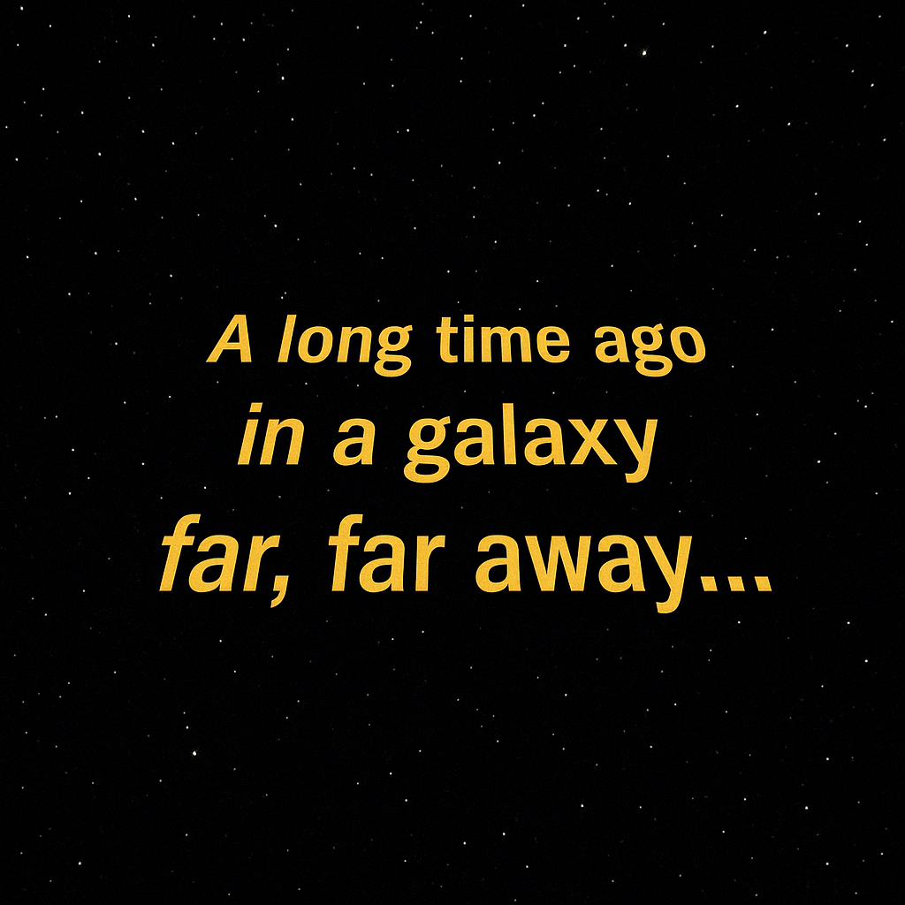

# Prefacio {.unnumbered}

![[Estrellas... y R.]{.smallcaps}](figuras/00%20Prefacio.jpg){width="100%"}

Este libro reúne las prácticas que han ido tomando forma a lo largo de muchos cursos, en diversas asignaturas de grado y máster sobre **análisis de datos** (especialmente de tipo económico) impartidas en la Facultad de Derecho y Ciencias Sociales de Ciudad Real. El motor de todo ese análisis es el lenguaje **R**, manejado a través de su IDE (o entorno de trabajo) **RStudio**.

¿Por qué R y no otra herramienta? La respuesta larga está en el capítulo introductorio; la corta cabe en una línea: R es **libre y gratuito** (igual que RStudio), está **pensado para la estadística** (frente a otros lenguajes también muy potentes, como Python) y cuenta con una **comunidad enorme y muy activa** que no deja de generar código y algoritmos para analizar datos.

¿La pega? Al principio, la curva de aprendizaje sube con cierta pendiente. Pero tranquilos: una vez os hacéis con la lógica de R y su entorno, las posibilidades son prácticamente infinitas.

Para que esa primera cuesta se haga más llevadera (o, al menos, más divertida), todos los ejemplos beben del proyecto **R-Stars**: una base de datos generada con herramientas de inteligencia artificial que recoge multitud de variables (muchas de ellas económicas) de **300 empresas ficticias**. Aunque todo es una gran simulación, los datos respetan las reglas básicas de coherencia económico-contable y conservan cierta dosis de realismo (dentro de lo que cabe).

¿Y a qué se dedican esas 300 empresas? Al **transporte interestelar de mercancías**.

```{r, echo=FALSE, out.width='60%', fig.align='center'}

```

Pido disculpas anticipadas por los errores que, inevitablemente, encontraréis: se irán puliendo (esperemos) a base de constantes revisiones. Os agradeceré de corazón que me comuniquéis cualquier fallo (ortográfico, de redacción, de contenido o de programación) que detectéis.

Por último, gracias a todas las personas y compañeros/as que hacen posible que este libro crezca y mejore sin descanso. Y gracias también a vosotros, por usar (si lo hacéis) esta peculiar guía de R para el análisis de datos económicos.

Y ahora sí: abrochaos el cinturón, que arrancamos este viaje galáctico rumbo al corazón mismo del lenguaje R.

```{r, echo=FALSE, out.width='60%', fig.align='center'}

```

------------------------------------------------------------------------

**Sobre el carácter gratuito de este libro.** Este manual es, y seguirá siendo, de acceso libre y gratuito. Se agradecen tanto los comentarios y sugerencias que ayuden a su mejora y actualización, como su cita en aquellos documentos en los que se utilice como referencia. La referencia recomendada, en formato APA, es la siguiente:

> Tarancón Morán, M. Á. (2026). *R-Stars: La Guía* [libro electrónico]. Universidad de Castilla-La Mancha. <https://teckel71.github.io/RStars-book/>
