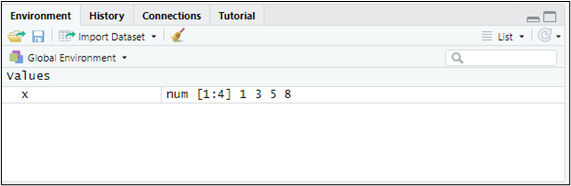

# Almacenando y manipulando datos.

![[¡Datos, datos!]{.smallcaps}](figuras/02%20robots.jpg){width="100%"}

## {.hicon} Objetos. Datos. {#c02-objetos-datos}

Como vimos en el capítulo 1, tras ejecutar un sencillo script (o al escribir instrucciones directamente desde la consola), R es interactivo: responde a las entradas que recibe. Las entradas o **expresiones** pueden ser, básicamente:

-   Expresiones aritméticas.

-   Expresiones lógicas.

-   Llamadas a funciones.

-   Asignaciones.

Las expresiones actúan sobre **objetos** de R. Un objeto es una entidad que puede llevar asociadas ciertas características o *metadatos*, a los que llamamos atributos. Ni todos los objetos comparten los mismos atributos ni todos ellos cuentan necesariamente con atributos que los caractericen.

Los objetos más importantes en R son ciertas estructuras o *contenedores* diseñados para almacenar elementos:

-   Vectores.

-   Matrices.

-   Listas.

-   Data frames.

-   Factores.

Los elementos almacenados en los objetos se agrupan en *clases*. Entre ellas destacan las referidas a **datos**, que pueden presentar distintos *modos*: `logical` (verdadero/falso), `numeric` (números) o `character` (cadena de texto). El modo `numeric` admite, además, dos tipos: `integer` (número entero) y `double` (número real). En los modos `logical` y `character`, modo y tipo coinciden.

Profundicemos un poco en algunos de estos contenedores. Para ello, situémonos en el proyecto que creamos en el capítulo anterior (proyecto "explora") y retomemos el script que preparamos allí mismo (script "explorando.R", alojado en la carpeta de dicho proyecto).

### {.hicon} Vectores. {#c02-vectores}

Los **vectores** son conjuntos de elementos **de la misma clase**. Definamos, por ejemplo, el vector x = (1,3,5,8). Para ello escribiremos en nuestro script:

```{r, eval=TRUE, echo=TRUE, warning=FALSE}
x <- c(1,3,5,8)
```

Ejecutamos la línea situando el cursor en cualquier punto de ella, dentro del script, y pulsando a la vez las teclas `Control + Enter` (o haciendo clic en el botón `Run` del editor). Ya tenemos en memoria nuestro primer objeto de tipo *vector*. Conviene reparar en que acabamos de realizar una **asignación**: una flecha formada por los signos "\<" y "-" traslada al vector llamado "x" los elementos 1, 3, 5 y 8.

Para ver su contenido basta con escribir en la consola (o en el script) el nombre del vector, "x". El resultado será:

```{r, eval=TRUE, echo=FALSE, message=FALSE, warning=FALSE}
x
```

Si además dirigimos la mirada a la ventana superior derecha de RStudio, comprobaremos que el ***Global Environment*** —la ventana que recoge los objetos que R mantiene en memoria— muestra nuestro vector e indica que su *modo* es *numérico*:

{.d-block .mx-auto width="100%"}

Si lo que buscamos es un vector de números consecutivos del 2 al 6, basta con ejecutar en la consola (o escribir y ejecutar en el script):

```{r, eval=TRUE, echo=TRUE, message=FALSE, warning=FALSE}
y <- c(2:6)
```

Al escribir el nombre del vector "y" en la consola obtendremos:

```{r, eval=TRUE, echo=TRUE, message=FALSE, warning=FALSE}
y
```

Para conocer la longitud de un vector recurriremos a la *función* `length()`. Así, `length(y)` devolverá el valor 5, pues "y" contiene cinco elementos. Escribamos en el script y ejecutemos:

```{r, eval=TRUE, echo=TRUE, message= FALSE, warning=FALSE}
length(y)
```

Un vector puede albergar, además de números, caracteres o cadenas alfanuméricas, siempre entrecomilladas (lo esencial es que todos los elementos pertenezcan a la misma clase). Sirva de ejemplo el vector "genero" (¡evitemos las tildes al nombrar los objetos o podemos encontrarnos con problemas!). Si ejecutamos estas dos líneas de código:

```{r, eval=FALSE, echo=TRUE, message=FALSE, warning=FALSE}
genero<-c("Mujer","Hombre")
genero
```

Se habrá creado el vector "genero":

```{r,eval=TRUE, echo=FALSE, message=FALSE, warning=FALSE}
genero<-c("Mujer","Hombre")
genero
```

La función `class()` nos indica la clase de los elementos almacenados en el vector:

```{r, eval=TRUE, echo=TRUE, message=FALSE, warning=FALSE}
class(genero)
```

Cuando falta un dato en un vector, escribiremos "NA" (*not available*, no disponible). Por ejemplo, si no dispusiéramos del tercer dato del vector "Z", lo definiríamos así:

```{r, eval=TRUE, echo=TRUE, message=FALSE, warning=FALSE}
Z <- c(1,2,NA,2,8)
```

Para **seleccionar un elemento** concreto de un vector indicaremos, entre corchetes, la posición que ocupa. Así, para recuperar el valor del tercer elemento del vector "x" haremos:

```{r, eval=TRUE, echo=TRUE, message=FALSE, warning=FALSE}
x[3]
```

Si lo que queremos es mostrar los elementos del vector "x" comprendidos entre el 2º y el 4º:

```{r, eval=TRUE, echo=TRUE, message=FALSE}
x[2:4]
```

Por último, para mostrar en pantalla elementos salteados —el 1º y el 4º, pongamos por caso— recurriremos, dentro de los corchetes, a la función `c()`, que recoge las posiciones seleccionadas:

```{r, eval=TRUE, echo=TRUE, message=FALSE, warning=FALSE}
x[c(1,4)]
```

### {.hicon} Matrices. {#c02-matrices}

Las **matrices** son, internamente, vectores a los que R añade dos atributos: el número de filas y el número de columnas. Se definen mediante la función `matrix()`. Por ejemplo, para construir la matriz "a":

$$
\begin{pmatrix}
    1 & 4 & 7 \\
    2 & 5 & 8 \\
    3 & 6 & 9
\end{pmatrix}
$$

Tendremos que escribir:

```{r, eval=TRUE, echo=TRUE, message=FALSE, warning=FALSE}
a <- matrix(c(1,2,3,4,5,6,7,8,9),nrow=3)
a
```

El número de filas se fija con el argumento `nrow =`; como el total de elementos es conocido, al indicar las filas queda determinado también el número de columnas. De forma equivalente, podríamos haber fijado las columnas con `ncol =`.

Como vemos, R "corta" el vector por columnas de forma predeterminada. Si lo preferimos, puede hacerlo por filas añadiendo a `matrix()` el argumento `byrow = TRUE`, si bien en nuestro ejemplo eso nos devolvería la traspuesta de la matriz que pretendemos almacenar.

Las dimensiones (número de filas y de columnas) de la matriz pueden obtenerse mediante la función `dim()`:

```{r, eval=TRUE, echo=TRUE, message=FALSE, warning=FALSE}
dim(a)
```

Esto es, 3 filas y 3 columnas.

Para seleccionar elementos concretos de una matriz emplearemos de nuevo los corchetes, esta vez con dos posiciones separadas por una coma: `[rango de filas, rango de columnas]`. Si dejamos en blanco el espacio situado entre el corchete de apertura y la coma, estaremos indicando que nos interesan todas las filas; y si no escribimos nada entre la coma y el corchete de cierre, que nos quedamos con todas las columnas. Veamos varios ejemplos de código, acompañados del resultado que devuelve la consola:

```{r, eval=TRUE, echo=TRUE, message=FALSE, warning=FALSE}
a[2,3]
a[1:2,2:3] 
a[,c(1,3)]
a[c(1,3),]
```

Tanto en vectores como en matrices, la suma y la diferencia funcionan sin mayor complicación. El producto, en cambio, merece una advertencia: la expresión `a*a` no realiza el producto matricial, sino la multiplicación elemento a elemento:

```{r, eval=FALSE, echo=TRUE, message=FALSE, warning=FALSE}
a*a
```

El resultado es, en este caso, el cuadrado de cada número, pues multiplicamos la matriz "a" por sí misma:

```{r, eval=TRUE, echo=FALSE, message=FALSE, warning=FALSE}
a*a
```

Para obtener el verdadero producto matricial deberemos escribir:

```{r, eval=TRUE, echo=TRUE, message=FALSE, warning=FALSE}
a%*%a
```

### {.hicon} *Data frames*. {#c02-data-frames}

Un ***data frame*** es un objeto que almacena datos con la estructura propia de la clase `data.frame`: en las filas se disponen los distintos casos o sujetos y, en las columnas, las variables. De ahí se derivan algunos rasgos característicos:

-   Se asemeja a una matriz, pues también tiene dos dimensiones: podemos acceder a sus elementos con corchetes, disponemos de nombres para filas y columnas, y podemos operar con sus datos.

-   Cada columna tiene un nombre, de manera que podemos acceder a una columna concreta con el símbolo **`$`**. Todas las columnas (variables) son vectores con la misma longitud.

-   Cada columna puede ser un vector numérico, factor, de tipo carácter o lógico.

Construyamos, por ejemplo, el *data frame* **"datos"**, con tres variables —"peso", "altura" y "color de ojos", a las que llamaremos "Peso", "Altura" y "Cl.ojos"— referidas a 3 individuos o casos. Una posibilidad consiste en definir primero las tres variables como vectores y reunirlas después mediante la función `data.frame()`:

```{r, eval=TRUE, echo=TRUE, message=FALSE, warning=FALSE}
Peso<-c(68,75,88)
Altura<-c(1.6,1.8,1.9)
Cl.ojos<-c("azules","marrones","marrones")
datos<-data.frame(Peso,Altura,Cl.ojos)
```

Si ahora ejecutamos una línea con el nombre de nuestro *data frame*, la consola nos devolverá su contenido:

```{r, eval=TRUE, echo=TRUE, message=FALSE, warning=FALSE}
datos
```

Para conocer los nombres de las variables (esto es, el de cada columna) recurriremos a la función `names()`:

```{r, eval=FALSE, echo=TRUE, message=FALSE, warning=FALSE}
names(datos)
```

Obteniéndose:

```{r, eval=TRUE, echo=FALSE, message=FALSE, warning=FALSE}
names(datos)
```

Para obtener únicamente los datos de la columna (variable) color de ojos escribiremos `datos$Cl.ojos`:

```{r, eval=TRUE, echo=TRUE, message=FALSE, warning=FALSE}
datos$Cl.ojos
```

Y para los de peso, `datos$Peso`:

```{r, eval=TRUE, echo=TRUE, message=FALSE, warning=FALSE}
datos$Peso
```

Para conocer el número de filas y de columnas de una hoja de datos utilizaremos las funciones `nrow()` y `ncol()`:

```{r, eval=TRUE, echo=TRUE, message=FALSE, warning=FALSE}
nrow(datos)
ncol(datos)
```

Para seleccionar elementos de un *data frame* podemos seguir las mismas reglas que en las matrices: el número de la fila identifica al individuo y el de la columna, a la variable. Para elegir una variable disponemos, además, de la vía que ya conocemos: su nombre precedido del nombre del *data frame* y del signo `$`. Así, si ejecutamos:

```{r, eval=TRUE, echo=TRUE, message=FALSE, warning=FALSE}
datos[,2]
datos$Altura
```

Obtenemos el mismo resultado.

### {.hicon} Factores. {#c02-factores}

En R, un **factor** es un tipo especial de objeto destinado a representar datos categóricos: datos que no son magnitudes continuas, sino que pertenecen a un conjunto limitado de categorías, también llamadas *niveles*. Pensemos en el vector "Cl.ojos" que creamos hace un momento: se trata de un vector de tipo carácter que, para R, todavía no es un factor.

Para convertirlo en un objeto de la clase "factor", podemos ejecutar:

```{r, eval=TRUE, echo=TRUE, message=FALSE, warning=FALSE}
Cl.ojosF <- factor(Cl.ojos)
```

En el *Global Environment* aparece ya el objeto "Cl.ojosF", de tipo factor. Si mostramos ambos objetos:

```{r, eval=TRUE, echo=TRUE, message=FALSE, warning=FALSE}
Cl.ojos
Cl.ojosF
```

Comprobamos que "Cl.ojosF" es algo más que un vector de elementos de tipo carácter: es una variable cuyos elementos solo pueden adoptar dos valores categóricos —los niveles "azules" y "marrones"—, que podrán aparecer una vez, repetirse o incluso no llegar a aparecer.

¿Por qué es necesario, a veces, transformar los datos "categóricos" en "factores"?

-   Ahorro de memoria: internamente, en lugar de almacenar "marrones" muchas veces, R guarda un número que representa a esa categoría (por ejemplo, 1 = marrones, 2 = azules).

-   Orden y niveles: podemos indicar si las categorías siguen una escala ordinal. Supongamos que manejamos las calificaciones "Suspenso", "Aprobado", "Notable" y "Sobresaliente". Si las guardamos como factor ordenado, R sabrá que Suspenso \< Aprobado \< Notable \< Sobresaliente, lo que nos permitirá comparar, ordenar, etc.

```{r, eval=TRUE, echo=TRUE, message=FALSE, warning=FALSE}
notas <- factor(
  c("Aprobado", "Notable", "Sobresaliente", "Suspenso"),
  levels = c("Suspenso", "Aprobado", "Notable", "Sobresaliente"),
  ordered = TRUE
)
notas
```

-   Modelos estadísticos: numerosos métodos de R reconocen automáticamente los factores como variables cualitativas y les aplican el tratamiento adecuado (tablas de contingencia, regresiones con variables categóricas, etc.).

En síntesis, un factor es una suerte de etiqueta inteligente para las categorías, que permite trabajar con datos cualitativos de forma más ordenada y más provechosa para el análisis.

### {.hicon} Listas. {#c02-listas}

Por último, una **lista** es un tipo de objeto capaz de albergar en su interior prácticamente cualquier cosa:

-   números

-   textos

-   vectores

-   matrices

-   *data frames*

-   otras listas

Podemos imaginarla como una caja organizadora con muchos compartimentos, en cada uno de los cuales cabe un objeto distinto, sea cual sea su naturaleza. Creemos, por ejemplo, la lista "mi_lista":

```{r, eval=TRUE, echo=TRUE, message=FALSE, warning=FALSE}
mi_lista <- list(
  nombre = "María",
  edad = 21,
  notas = c(8.5, 9.0, 7.2),
  aprobado = TRUE
)

mi_lista
```

La lista queda almacenada en el *Global Environment*. Si solo queremos ver su tercer elemento, podemos referirnos a él por su nombre o por la posición que ocupa, en este caso con corchetes dobles:

```{r, eval=TRUE, echo=TRUE, message=FALSE, warning=FALSE}
mi_lista$notas
mi_lista[[3]]

```

Las listas son las estructuras de almacenamiento más flexibles de R y se emplean con frecuencia para organizar y empaquetar resultados complejos.

En la práctica, la estructura con la que más trabajaremos a lo largo del libro es el ***data frame***: cada columna es un vector (numérico o factor) y cada fila un caso de la muestra. Además, cuando apliquemos técnicas estadísticas, los resultados de los modelos se devolverán habitualmente empaquetados en **listas**, ya que contienen elementos de distinta naturaleza (coeficientes, residuos, estadísticos de bondad de ajuste, etc.). De este modo, los cinco tipos de objetos que acabamos de presentar no son compartimentos estancos: conviven y se complementan en cualquier análisis real.

## {.hicon} Importando datos. {#c02-importando-datos}

Lo habitual no es teclear los datos, como hemos hecho hasta ahora, sino importarlos a R desde algún contenedor externo: un archivo de texto, una hoja de cálculo, una base de datos... En nuestro caso los traeremos desde Microsoft® Excel®. Cerremos, pues, el script que hemos ido construyendo en los apartados anteriores (recordemos guardarlo antes si queremos conservarlo), sin salir del proyecto "explora" en el que venimos trabajando. Acto seguido iremos a la carpeta del proyecto y guardaremos en ella los dos archivos de esta práctica, cuyos enlaces de descarga figuran en la sección final del capítulo:

-   Un archivo de Microsoft® Excel® llamado "interestelar_100.xlsx"

-   Un script con las instrucciones que vamos a mostrar a continuación, y que se llama "explora_rstars.R"

Si abrimos el archivo de Microsoft® Excel® "interestelar_100.xlsx", comprobaremos que consta de tres hojas: la primera recoge un aviso sobre el uso exclusivo que debe darse a los datos; la segunda describe las variables consideradas; y la tercera (hoja "Datos") contiene la información que vamos a **importar** desde RStudio. Se trata de variables económico-financieras y de otra índole, referidas a una muestra de empresas dedicadas al transporte interestelar de mercancías.

Abramos ahora el script "explora_rstars.R" con `File → Open File…` (o haciendo clic sobre el archivo en la ventana inferior derecha de RStudio, pestaña "Files"). Este script contiene el programa que iremos ejecutando a lo largo de la práctica.

La primera línea / instrucción en los scripts suele ser:

```{r, eval=TRUE, echo=TRUE, message=FALSE, warning=FALSE}
## Importando datos de las empresas R-Stars

# Limpiando el Global Environment
rm(list = ls())
```

Esta instrucción persigue **limpiar el *Global Environment*** (la memoria) de los objetos que hayan quedado de sesiones de trabajo anteriores.

A continuación suelen **cargarse los paquetes necesarios para ejecutar el código**. En rigor, pueden cargarse en cualquier punto del script, siempre que sea antes de ejecutar una línea que requiera alguno de los elementos que contienen.

```{r, eval=TRUE, echo=TRUE, message=FALSE}
# Cargando paquetes
library(readxl)
library(gtExtras)
```

Naturalmente, para cargar o activar un paquete este debe haberse instalado antes en la máquina en la que trabajamos. Si aún no hemos instalado `{readxl}` y `{gtExtras}`, habrá que hacerlo siguiendo el procedimiento descrito en la sección de *Paquetes* del capítulo anterior (sección 1.7); de lo contrario, R nos devolverá un error.

Para importar los datos alojados en el archivo de Microsoft® Excel® "interestelar_100.xlsx", el código que podemos emplear es:

```{r, eval=TRUE, echo=TRUE, message=FALSE}
# DATOS

interestelar_100 <- read_excel("interestelar_100.xlsx", sheet = "Datos", na = c("n.d."))
```

La función encargada de importar los datos es `read_excel()`, del paquete `{readxl}`.

Conviene detenerse en un detalle importante. Si la hoja de cálculo señala los valores perdidos mediante alguna anotación —"n.d." (no disponible), por ejemplo—, debemos incluir el argumento `na =` para indicar a R qué contenidos de las celdas ha de traducir como valores faltantes. Si las celdas sin dato estuvieran siempre en blanco, este argumento resultaría innecesario.

Volviendo a nuestro ejemplo, en el *Global Environment* aparece ya un objeto: una estructura de datos de tipo *data frame*, llamada "interestelar_100", que contiene 104 filas (una por empresa) y 29 columnas, una por cada variable almacenada en el archivo de Microsoft® Excel®. Cinco de esas variables son de naturaleza cualitativa y están formadas por cadenas de caracteres.

Puede explorarse el contenido del *data frame* y los principales estadísticos con la función `summary()`:

```{r, eval=FALSE, echo=TRUE, message=FALSE}
summary (interestelar_100)
```

```{r, eval=TRUE, echo=FALSE, message=FALSE}

library (dplyr)
df <- select(interestelar_100, everything())
# Número de variables por bloque
variables_por_bloque <- 4

# Dividir las variables en bloques
for (i in seq(1, ncol(interestelar_100), variables_por_bloque)) {
  # Comentario: No mostramos el nombre del bloque
  print(summary(interestelar_100[, i:min(i + variables_por_bloque - 1, ncol(interestelar_100))]))
  cat("\n")
}
rm (i)
rm (variables_por_bloque)
rm (df)
```

Veremos desfilar las 29 variables acompañadas de algunos estadísticos básicos.

Observemos que R ha interpretado la primera columna como una variable cualitativa (un atributo) cuando, en realidad, no es una variable, sino el nombre de los individuos o casos. Para evitarlo, podemos redefinir el *data frame* indicándole que tome esa primera columna como los *nombres de las filas*:

```{r, eval=TRUE, echo=TRUE, message=FALSE}
interestelar_100 <- data.frame(interestelar_100, row.names = 1)
```

En la línea anterior hemos asignado al *data frame* "interestelar_100" sus propios datos, pero advirtiendo a R de que la primera columna no es una variable, sino el nombre de los casos. Si repetimos ahora el `summary()`:

```{r, eval=FALSE, echo=TRUE, message=FALSE}
summary (interestelar_100)
```

```{r, eval=TRUE, echo=FALSE, message=FALSE}
library (dplyr)
df <- select(interestelar_100, everything())
# Número de variables por bloque
variables_por_bloque <- 4

# Dividir las variables en bloques
for (i in seq(1, ncol(interestelar_100), variables_por_bloque)) {
  # Comentario: No mostramos el nombre del bloque
  print(summary(interestelar_100[, i:min(i + variables_por_bloque - 1, ncol(interestelar_100))]))
  cat("\n")
}
rm (i)
rm (variables_por_bloque)
rm (df)
```

Comprobamos que "NOMBRE" ha dejado de figurar como variable: en el *Global Environment*, el *data frame* "interestelar_100" conserva sus 104 observaciones (casos), pero ahora cuenta con 28 variables, una menos que antes.

Una forma visualmente más elegante de explorar el contenido del *data frame* consiste en emplear la función `gt_plt_summary()` del paquete `{gtExtras}`:

```{r, eval=FALSE, echo=TRUE, message=FALSE}
# visualizando el data frame de modo elegante con {gtExtras}
datos_df_graph <- gt_plt_summary(interestelar_100)
```

El código asigna al nombre "datos_df_graph" (o al que prefiramos) una tabla gráfica con las variables que contiene el *data frame* —en este caso, "interestelar_100"—, junto con sus características y algunas medidas básicas, que varían según la tipología de cada variable. Bastará con invocar ese nombre para visualizarla:

```{r, eval=FALSE, echo=TRUE, message=FALSE}
datos_df_graph
```

Y el resultado será:

```{r, eval=TRUE, echo=FALSE, message=FALSE, warning=FALSE}
# visualizando el data frame de modo elegante con {gtExtras}
datos_df_graph <- gt_plt_summary(interestelar_100)
datos_df_graph
```

Antes de seguir manipulando nuestros datos, conviene recordar que R admite muchos otros formatos de importación. El paquete `{readr}`, por ejemplo, lee archivos de texto de tipo tabular (como los \*.csv). El paquete `{haven}` recupera los datos almacenados en archivos de SPSS® (.sav), Stata® (.dta) o SAS® (.sas7bdat), entre otros. Y también es posible capturar información procedente de páginas web (archivos JSON o XML, o tablas HTML) o de bases de datos gestionadas con diversos sistemas (SQLite, MySQL, MariaDB, PostgreSQL, Oracle®).

## {.hicon} El paquete `{dplyr}`. {#c02-el-paquete-dplyr}

### {.hicon} El *Tidyverse*. Cargando `{dplyr}`. {#c02-el-tidyverse-cargando-dplyr}

El ***Tidyverse*** es un conjunto de paquetes que comparten una misma filosofía —el uso de ciertas estructuras gramaticales comunes— y que simplifican buena parte de las tareas y análisis que podrían acometerse con el lenguaje R estándar. Una obra excelente para profundizar en el *Tidyverse* es @Wickham2017R.

Uno de esos paquetes es `{dplyr}`, que ofrece una gramática más sencilla que la del lenguaje R convencional para **manipular** las estructuras de datos conocidas como ***data frames***.

Los *data frames*, como ya sabemos, son estructuras que almacenan los datos disponiendo las variables del análisis en columnas y los casos que conforman la muestra o población en filas.

Supongamos que seguimos trabajando dentro del proyecto "explora" que creamos anteriormente (véase el capítulo 1) y que continuamos con el script "explora_rstars.R", con el que importamos los datos del archivo de Microsoft® Excel® "interestelar_100.xlsx", que reunía información sobre 104 empresas de transporte interestelar de mercancías.

Damos por hecho, por tanto, que ya hemos ejecutado la primera parte del script —la importación de los datos y la corrección de la columna con los nombres de las filas— y que el *data frame* "interestelar_100" se encuentra almacenado en el *Global Environment*.

Retomemos el trabajo desde ese punto cargando el paquete `{dplyr}` (si aún no está instalado, procedamos como se indicó en la sección 1.7):

```{r, eval=TRUE, echo=TRUE, message=FALSE}
## dplyr
# Cargando dplyr
library (dplyr)

```

Para comprender mejor la **sintaxis** de las funciones a las que da acceso `{dplyr}`, conviene retener tres ideas:

-   El primer argumento que tiene una función de `{dplyr}` es el *data frame* con el que se va a trabajar.

-   Los otros argumentos describen qué hay que hacer con el *data frame* especificado en el primer argumento. Es posible referirse a las columnas (variables) del *data frame* con su nombre, **sin utilizar el operador \$**.

-   El valor de retorno es un **nuevo** *data frame*.

En los siguientes subapartados practicaremos con algunas de sus funciones principales.

### {.hicon} Seleccionando columnas de un *data frame*. {#c02-seleccionando-columnas-de-un-data-frame}

La función clave de `{dplyr}` para seleccionar una o varias columnas (variables) de un *data frame* es la función `select()`.

Imaginemos, por ejemplo, que queremos eliminar de nuestro *data frame* la variable FJUR (forma jurídica de la empresa), de tipo carácter. Bastará con ejecutar la siguiente asignación:

```{r, eval=FALSE, echo=TRUE, message=FALSE}

# Seleccionando variables
interestelar_100 <-select(interestelar_100, -FJUR)
summary (interestelar_100)
```

```{r, eval=TRUE, echo=FALSE, message=FALSE}

#Seleccionando variables
interestelar_100 <-select(interestelar_100, -FJUR)

library (dplyr)
df <- select(interestelar_100, everything())
# Número de variables por bloque
variables_por_bloque <- 4

# Dividir las variables en bloques
for (i in seq(1, ncol(interestelar_100), variables_por_bloque)) {
  # Comentario: No mostramos el nombre del bloque
  print(summary(interestelar_100[, i:min(i + variables_por_bloque - 1, ncol(interestelar_100))]))
  cat("\n")
}
rm (i)
rm (variables_por_bloque)
rm (df)
```

En el *Global Environment* podemos verificar que el *data frame* ha pasado a tener una variable menos (27), pues hemos prescindido de FJUR. Como vemos, basta anteponer el guion "-" al nombre de una variable para eliminarla.

Supongamos ahora que solo deseamos visualizar tres variables del *data frame* "interestelar_100": ACTIVO, FPIOS y LIQUIDEZ. Para ello ejecutaremos:

```{r, eval=FALSE, echo=TRUE, message=FALSE}
select(interestelar_100, ACTIVO, FPIOS, LIQUIDEZ)
```

```{r, eval=TRUE, echo=FALSE, message=FALSE}
df <-select(interestelar_100, ACTIVO, FPIOS, LIQUIDEZ)
df <- dplyr::slice_head(df, n = 10)  # Solo primeras 10 filas

# Número de columnas por bloque
columnas_por_bloque <- 4

# Dividir las columnas en bloques y mostrar los datos en la consola
for (i in seq(1, ncol(df), columnas_por_bloque)) {
  print(df[, i:min(i + columnas_por_bloque - 1, ncol(df))])
  cat("\n")
}
rm(i)
rm(df)
rm(columnas_por_bloque)
```

(**Nota:** solo mostramos aquí los 10 primeros casos del *data frame*).

Como no hemos asignado el resultado de la función a ningún nombre, R se limita a mostrarlo en pantalla, sin guardar objeto alguno en el *Global Environment*. Si, por el contrario, asignamos el `select()` a un nombre, se creará un *data frame* que lo llevará y que contendrá las variables seleccionadas:

```{r, eval=FALSE, echo=TRUE, message=FALSE}

interestelar_100A <-select(interestelar_100, ACTIVO, FPIOS, LIQUIDEZ)
summary (interestelar_100A)
```

```{r, eval=TRUE, echo=FALSE, message=FALSE}

interestelar_100A <-select(interestelar_100, ACTIVO, FPIOS, LIQUIDEZ)

library (dplyr)
df <- select(interestelar_100A, everything())
# Número de variables por bloque
variables_por_bloque <- 3

# Dividir las variables en bloques
for (i in seq(1, ncol(interestelar_100A), variables_por_bloque)) {
  # Comentario: No mostramos el nombre del bloque
  print(summary(interestelar_100A[, i:min(i + variables_por_bloque - 1, ncol(interestelar_100A))]))
  cat("\n")
}
rm (i)
rm (variables_por_bloque)
rm (df)
```

Podemos comprobar que en el *Global Environment* figura otro *data frame*, llamado "interestelar_100A", con 3 variables y los mismos 104 casos.

### {.hicon} Ordenando casos de un *data frame*. {#c02-ordenando-casos-de-un-data-frame}

Además de seleccionar columnas, las funciones de `{dplyr}` permiten ordenar los casos (filas) de un *data frame* según los valores de ciertas variables. La encargada de ello es `arrange()`, que ordena de modo **ascendente** salvo que se le indique lo contrario. Creemos, por ejemplo, el *data frame* "interestelar_100C" con las variables RENECO, EFLO y ACTIVO, y con los casos ordenados de menor a mayor valor de RENECO:

```{r, eval=FALSE, echo=TRUE, message=FALSE}
# Ordenando casos
interestelar_100C <- select(interestelar_100, RENECO, EFLO, ACTIVO)
interestelar_100C <- arrange(interestelar_100C, RENECO)
interestelar_100C
```

```{r, eval=TRUE, echo=FALSE, message=FALSE}
interestelar_100C <- select(interestelar_100, RENECO, EFLO, ACTIVO)
interestelar_100C <- arrange(interestelar_100C, RENECO)
df<-interestelar_100C
df <- dplyr::slice_head(df, n = 10)  # Solo primeras 10 filas
# Número de columnas por bloque
columnas_por_bloque <- 3

# Dividir las columnas en bloques y mostrar los datos en la consola
for (i in seq(1, ncol(df), columnas_por_bloque)) {
  print(df[, i:min(i + columnas_por_bloque - 1, ncol(df))])
  cat("\n")
  }
rm(df)
rm(columnas_por_bloque)
```

(**Nota:** solo mostramos aquí los 10 primeros casos del *data frame*).

Para ordenar de modo descendente, en cambio, envolveremos el nombre de la variable en la función `desc()`:

```{r, eval=FALSE, echo=TRUE, message=FALSE}
interestelar_100D <- arrange(interestelar_100C, desc(RENECO))
interestelar_100D
```

```{r, eval=TRUE, echo=FALSE, message=FALSE}
interestelar_100D <- arrange(interestelar_100C, desc(RENECO))
df<-interestelar_100D
df <- dplyr::slice_head(df, n = 10)  # Solo primeras 10 filas
# Número de columnas por bloque
columnas_por_bloque <- 3

# Dividir las columnas en bloques y mostrar los datos en la consola
for (i in seq(1, ncol(df), columnas_por_bloque)) {
  print(df[, i:min(i + columnas_por_bloque - 1, ncol(df))])
  cat("\n")
  }
rm(df)
rm(columnas_por_bloque)
```

(**Nota:** solo mostramos aquí los 10 primeros casos del *data frame*).

Cuando varios casos comparten el mismo valor en una variable, podemos añadir una segunda variable como criterio de desempate. Ordenemos, por ejemplo, las empresas según EFLO (categorización de la antigüedad promedio de la flota, con las categorías ANTIGUA, MADURA y RENOVADA). Al tratarse de una variable categórica, los casos se dispondrán por orden alfabético de la categoría a la que pertenecen; y, dentro de cada una de ellas, los ordenaremos de nuevo por RENECO, esta vez de mayor a menor:

```{r, eval=FALSE, echo=TRUE, message=FALSE}
interestelar_100E <- arrange(interestelar_100C, EFLO, desc(RENECO))
interestelar_100E
```

```{r, eval=TRUE, echo=FALSE, message=FALSE}
interestelar_100E <- arrange(interestelar_100C, EFLO, desc(RENECO))
df<- interestelar_100E
df <- dplyr::slice_head(df, n = 10)  # Solo primeras 10 filas
# Número de columnas por bloque
columnas_por_bloque <- 3

# Dividir las columnas en bloques y mostrar los datos en la consola
for (i in seq(1, ncol(df), columnas_por_bloque)) {
  print(df[, i:min(i + columnas_por_bloque - 1, ncol(df))])
  cat("\n")
}
rm(df)
rm(columnas_por_bloque)
rm(i)
```

(**Nota:** solo mostramos aquí los 10 primeros casos del *data frame*. Una vez agotados los casos con categoría "ANTIGUA" en EFLO, comenzarían a aparecer los de categoría "MADURA", concretamente a partir de la posición 52).

### {.hicon} El operador *pipe*. {#c02-el-operador-pipe}

Ahora que conocemos `select()` y `arrange()`, podemos apreciar un problema: cuando necesitamos combinar varias operaciones, el código anidado se vuelve difícil de leer. El **operador *pipe*** `%>%`, proporcionado por el paquete `{magrittr}` (que se carga automáticamente con `{dplyr}`), resuelve este problema permitiendo **encadenar** operaciones de forma legible: toma el resultado de la expresión a su izquierda y lo pasa como primer argumento de la función a su derecha. Así, en lugar de anidar funciones —lo que obliga a leer "de dentro hacia fuera"—, el código se lee de izquierda a derecha y de arriba abajo, como una secuencia de pasos.

Veamos un ejemplo. Ya sabemos seleccionar variables con `select()` y ordenar casos con `arrange()`. Si quisiéramos hacer ambas cosas a la vez, sin *pipe* habría que anidar las funciones:

```{r, eval=FALSE, echo=TRUE, message=FALSE}
# Sin pipe (lectura "de dentro hacia fuera"):
arrange(select(interestelar_100, RENECO, EFLO, ACTIVO), RENECO)
```

Con el operador *pipe*, el mismo código se escribe así:

```{r, eval=FALSE, echo=TRUE, message=FALSE}
# Con pipe (lectura secuencial):
interestelar_100 %>%
  select(RENECO, EFLO, ACTIVO) %>%
  arrange(RENECO)
```

La segunda versión se lee de un modo mucho más natural: "toma `interestelar_100`, selecciona esas tres variables y ordena por RENECO". A lo largo del libro, utilizaremos habitualmente el operador *pipe* para construir secuencias de instrucciones.

**Nota:** Desde la versión 4.1, R incorpora un *pipe* nativo, `|>`, que funciona de forma muy similar a `%>%`. En este libro utilizaremos `%>%` por ser el más habitual en el ecosistema *tidyverse*, pero es posible encontrar `|>` en documentación y código más reciente.

### {.hicon} Seleccionando casos de un *data frame*. {#c02-seleccionando-casos-de-un-data-frame}

Además de seleccionar variables, `{dplyr}` permite quedarse con los casos que cumplen ciertas condiciones. De este cometido se encarga la función `filter()`. Si, por ejemplo, queremos retener las empresas con un resultado (variable RES) mayor o igual a 500 miles de PAVOs y mostrar en pantalla los valores de RES y RENECO, la instrucción será:

```{r, eval=FALSE, echo=TRUE, message=FALSE}
# Seleccionando casos
select(filter(interestelar_100, RES >= 500), RES, RENECO)
```

```{r, eval=TRUE, echo=FALSE, message=FALSE}

#definir df
df<-select(filter(interestelar_100, RES >= 500), RES, RENECO)

# Número de columnas por bloque
columnas_por_bloque <- 2

# Dividir las columnas en bloques y mostrar los datos en la consola
for (i in seq(1, ncol(df), columnas_por_bloque)) {
  print(df[, i:min(i + columnas_por_bloque - 1, ncol(df))])
  cat("\n")
}
rm(df)
rm(columnas_por_bloque)
```

Un mismo filtro admite varias condiciones. Construyamos un nuevo *data frame*, "interestelar_100B", que recoja las variables RES, RENECO y ACTIVO de aquellas empresas con un resultado mayor o igual a 500 miles de PAVOs y una rentabilidad económica (variable RENECO) inferior al 40%:

```{r, eval=FALSE, echo=TRUE, message=FALSE}
interestelar_100B <-select(filter(interestelar_100,
                                  RES >= 500 & RENECO < 40),
                                  RES, RENECO, ACTIVO)
interestelar_100B
```

```{r, eval=TRUE, echo=FALSE, message=FALSE}
interestelar_100B <-select(filter(interestelar_100,
                                  RES >= 500 & RENECO < 40),
                                  RES, RENECO, ACTIVO)
df <- select(interestelar_100B, everything())

# Número de columnas por bloque
columnas_por_bloque <- 3

# Dividir las columnas en bloques y mostrar los datos en la consola
for (i in seq(1, ncol(df), columnas_por_bloque)) {
  print(df[, i:min(i + columnas_por_bloque - 1, ncol(df))])
  cat("\n")
  }
rm(df)
rm(columnas_por_bloque)
```

En el *Global Environment* aparecerá el *data frame* "interestelar_100B" con un único caso: la empresa que satisface ambas condiciones, enlazadas mediante el operador lógico "**&**", equivalente a la conjunción "y" o, dicho de otro modo, a la intersección. El otro operador lógico de uso frecuente es la barra vertical "**\|**", que equivale a la conjunción "o", esto es, a la unión.

Por su parte, los operadores de comparación más habituales al construir las condiciones son \>, \<, \>=, \<=, == (igual: atención, con dos símbolos de igualdad seguidos) y != (distinto).

### {.hicon} Seleccionando casos por posición: `slice()`. {#c02-seleccionando-casos-por-posicion-slice}

Mientras que `filter()` selecciona casos según una **condición lógica**, la función `slice()` selecciona casos por su **posición** (número de fila). Por ejemplo, para obtener los 5 primeros casos del *data frame*:

```{r, eval=TRUE, echo=TRUE, message=FALSE}
# Seleccionando las 5 primeras filas
interestelar_100 %>% slice(1:5)
```

`{dplyr}` ofrece además variantes muy útiles de `slice()`. Por ejemplo, `slice_head()` y `slice_tail()` seleccionan las primeras o últimas *n* filas, y `slice_max()` y `slice_min()` seleccionan los casos con los valores más altos o más bajos de una variable:

```{r, eval=FALSE, echo=TRUE, message=FALSE}
# Las 3 empresas con mayor rentabilidad económica
interestelar_100 %>% slice_max(RENECO, n = 3)

# Las 3 empresas con menor resultado
interestelar_100 %>% slice_min(RES, n = 3)
```

```{r, eval=TRUE, echo=FALSE, message=FALSE}
interestelar_100 %>%
  slice_max(RENECO, n = 3) %>%
  select(RENECO, RES, ACTIVO)
```

(**Nota:** mostramos aquí únicamente el resultado de la primera instrucción y, para facilitar la lectura, solo tres de sus variables).

### {.hicon} Cambiando el nombre de las variables de un *data frame*. {#c02-cambiando-el-nombre-de-las-variables-de-un}

`{dplyr}` dispone de una función que permite cambiar con comodidad el nombre de una variable o columna de un *data frame*: `rename()`. Si queremos sustituir el nombre SOLVENCIA por SOLVE, bastará con ejecutar:

```{r, eval=TRUE, echo=TRUE, message=FALSE}
# Renombrando variables
interestelar_100 <- rename(interestelar_100, SOLVE = SOLVENCIA)
```

Si desplegamos el *data frame* "interestelar_100" en el *Global Environment*, comprobaremos que la variable SOLVENCIA ha desaparecido y que en su lugar figura SOLVE, naturalmente con los mismos datos. Conviene retener el orden: a la **izquierda** de la igualdad se escribe el **nombre nuevo** y, a la derecha, el antiguo. Un mismo `rename()` puede cambiar el nombre de **varias variables**, separando con comas las igualdades correspondientes.

### {.hicon} Añadiendo variables como transformación de otras variables en un *data frame*. {#c02-anadiendo-variables-como-transformacion-de}

El paquete `{dplyr}` permite además incorporar al *data frame* variables nuevas, obtenidas al **transformar las variables ya existentes**. De ello se ocupa la función `mutate()`.

Imaginemos que necesitamos calcular el cociente entre el resultado obtenido y el activo. Llamaremos RATIO a esta nueva variable, y el código será:

```{r, eval=FALSE, echo=TRUE, message=FALSE}
# Añadiendo variables como transformacion de otras variables
interestelar_100 <- mutate (interestelar_100, RATIO = RES / ACTIVO)
summary(interestelar_100)
```

```{r, eval=TRUE, echo=FALSE, message=FALSE}
# Añadiendo variables como transformacion de otras variables
interestelar_100 <- mutate (interestelar_100, RATIO = RES / ACTIVO)

library (dplyr)
df <- select(interestelar_100, everything())
# Número de variables por bloque
variables_por_bloque <- 4

# Dividir las variables en bloques
for (i in seq(1, ncol(interestelar_100), variables_por_bloque)) {
  # Comentario: No mostramos el nombre del bloque
  print(summary(interestelar_100[, i:min(i + variables_por_bloque - 1, ncol(interestelar_100))]))
  cat("\n")
}
rm (i)
rm (variables_por_bloque)
rm (df)
```

Dentro de `mutate()` podemos apoyarnos en **funciones procedentes de otros paquetes** de R. Si, por ejemplo, queremos construir la variable ACTIVOS_ACUM, que recoge el activo acumulado de las empresas empezando por la de menor tamaño, recurriremos a la función `cumsum()` del paquete `{base}`:

```{r, eval=FALSE, echo=TRUE, message=FALSE}
interestelar_100 <- arrange(interestelar_100, ACTIVO)
interestelar_100 <- mutate (interestelar_100, ACTIVOS_ACUM = cumsum(ACTIVO))
select(interestelar_100, ACTIVO, ACTIVOS_ACUM)
```

Podemos verificar que la variable ACTIVOS_ACUM se ha integrado ya en el *data frame*:

```{r, eval=TRUE, echo=FALSE, message=FALSE}
interestelar_100 <- arrange(interestelar_100, ACTIVO)
interestelar_100 <- mutate (interestelar_100, ACTIVOS_ACUM = cumsum(ACTIVO))
df<- select(interestelar_100, ACTIVO, ACTIVOS_ACUM)
df <- dplyr::slice_head(df, n = 10)  # Solo primeras 10 filas
# Número de columnas por bloque
columnas_por_bloque <- 3

# Dividir las columnas en bloques y mostrar los datos en la consola
for (i in seq(1, ncol(df), columnas_por_bloque)) {
  print(df[, i:min(i + columnas_por_bloque - 1, ncol(df))])
  cat("\n")
}
rm(df)
rm(columnas_por_bloque)
rm(i)
```

(**Nota:** solo mostramos aquí los 10 primeros casos del *data frame*).

Veamos un último ejemplo de variable creada a partir de otras. Construiremos ahora DIM (dimensión), una variable **categórica**, cuyos valores son cadenas de caracteres. DIM tomará el valor "ALTA" en las empresas con un ACTIVO mayor o igual que 216 miles de PAVOs; "MEDIA" en aquellas cuyo ACTIVO sea menor que 216 miles de PAVOs y mayor o igual que 54 miles de PAVOs; y "REDUCIDA" en las que no alcancen los 54 miles de PAVOs. Para obtener esta clasificación de forma automática emplearemos la función `cut()`, del paquete `{base}`:

```{r, eval=FALSE, echo=TRUE, message=FALSE}
interestelar_100 <- mutate(interestelar_100,
                           DIM = cut(ACTIVO,
                                 breaks = c(-Inf, 54, 216, Inf),
                                 labels = c("REDUCIDA", "MEDIA", "ALTA")))
select(interestelar_100, ACTIVO, DIM)
```

Reparemos en que `cut()`, anidada dentro del `mutate()` de `{dplyr}`, recibe a su vez varios argumentos: la variable numérica de referencia (ACTIVO); `breaks =`, donde fijamos los cortes que delimitan los intervalos en que se repartirán los casos (de menos infinito a 54, de 54 a 216 y de 216 a más infinito); y `labels =`, que recoge la etiqueta que adoptará la nueva variable DIM según el intervalo en el que caiga cada caso de la muestra:

```{r, eval=TRUE, echo=FALSE, message=FALSE}
interestelar_100 <- mutate(interestelar_100,
                           DIM = cut(ACTIVO,
                                 breaks = c(-Inf, 54, 216, Inf),
                                 labels = c("REDUCIDA", "MEDIA", "ALTA")))
df <-select(interestelar_100, ACTIVO, DIM)
df <- dplyr::slice_head(df, n = 10)  # Solo primeras 10 filas
# Número de columnas por bloque
columnas_por_bloque <- 3

# Dividir las columnas en bloques y mostrar los datos en la consola
for (i in seq(1, ncol(df), columnas_por_bloque)) {
  print(df[, i:min(i + columnas_por_bloque - 1, ncol(df))])
  cat("\n")
}
rm(df)
rm(columnas_por_bloque)
rm(i)

```

(**Nota:** solo mostramos aquí los 10 primeros casos del *data frame*).

Este mismo código gana legibilidad si recurrimos al operador *pipe* `%>%` que presentamos unas páginas atrás:

```{r, eval=FALSE, echo=TRUE, message=FALSE}
interestelar_100 <- interestelar_100 %>%
  mutate(DIM = cut(ACTIVO,
                   breaks = c(-Inf, 54, 216, Inf),
                   labels = c("REDUCIDA", "MEDIA", "ALTA")))

interestelar_100 %>% select(ACTIVO, DIM)
```

La lectura es ahora secuencial: "toma `interestelar_100`, crea la variable DIM con `cut()` y guarda el resultado". En la segunda línea: "toma `interestelar_100` y muestra las variables ACTIVO y DIM".

### {.hicon} Extrayendo y sintetizando información de las variables de un *data frame*. {#c02-extrayendo-y-sintetizando-informacion-de-las}

`{dplyr}` ofrece también la posibilidad de extraer y sintetizar, mediante *medidas*, la información de las variables que alberga un *data frame*. De ello se encarga la función `summarise()`. A modo de ejemplo, calculemos la *rentabilidad financiera* media de las 104 empresas:

```{r, eval=TRUE, echo=TRUE, message=FALSE}
#Extrayendo información de las variables de un data frame
summarise(interestelar_100, RENFIN_media = mean(RENFIN)) 
```

En muchas ocasiones resulta muy útil combinar `summarise()` con `group_by()`, que divide previamente el conjunto de casos en grupos definidos por una de las variables. Para ilustrarlo aprovecharemos la recién creada DIM: formaremos tres grupos de empresas y calcularemos después la rentabilidad media de cada uno:

```{r, eval=TRUE, echo=TRUE, message=FALSE}
interestelar_100 %>%
  group_by(DIM) %>%
  summarise(RENFIN_media = mean(RENFIN))
```

Hemos empleado el operador *pipe* `%>%` para encadenar dos instrucciones de `{dplyr}`: primero agrupar los casos y después calcular la media de cada grupo. El código podría "traducirse" así: "toma el *data frame* "interestelar_100", reparte sus casos en grupos según el valor de la variable DIM y, para cada grupo, calcula la media de RENFIN". Merece la pena reparar en que aparece un grupo cuyo valor de DIM es "NA", esto es, sin dato: se debe a que, al crear DIM, una empresa —en concreto, "Vega Transport"— carecía de valor en ACTIVO.

## {.hicon}{.hicon} Exportando datos. {#c02-exportando-datos}

Antes de concluir el capítulo, dediquemos unas líneas a la exportación de datos.

R dispone de un **formato propio de datos**, con extensión ".RData", capaz de albergar cualquier objeto del programa. Exportaremos el *data frame* "interestelar_100" a un archivo de este tipo, "interestelar_100.RData"; después lo borraremos del *Global Environment* y recuperaremos la información volviendo a cargar ese mismo archivo.

Para la exportación utilizaremos la función `save()`:

```{r, eval=TRUE, echo=TRUE, message=FALSE}
## Exportación de datos

# Exportando data frame a formato R (.RData)
save(interestelar_100, file = "interestelar_100.RData")
```

En la carpeta del proyecto puede verse ya el archivo generado. Para asegurarnos de que la exportación ha sido correcta, borraremos del *Global Environment* el *data frame* "interestelar_100" con la función `rm()` (de *remove*) y volveremos a cargarlo desde el archivo "interestelar_100.RData" mediante la función `load()`. El resultado será un *data frame* "interestelar_100" idéntico al de partida:

```{r, eval=FALSE, echo=TRUE, message=FALSE}
# Borrando el data frame interestelar_100
rm(interestelar_100)

# Importando el archivo .RData con los mismos datos
load("interestelar_100.RData")
summary (interestelar_100)
```

```{r, eval=TRUE, echo=FALSE, message=FALSE}
# Borrando el data frame interestelar_100
rm(interestelar_100)

# Importando el archivo .RData con los mismos datos
load("interestelar_100.RData")

library (dplyr)
df <- select(interestelar_100, everything())
# Número de variables por bloque
variables_por_bloque <- 4

# Dividir las variables en bloques
for (i in seq(1, ncol(interestelar_100), variables_por_bloque)) {
  # Comentario: No mostramos el nombre del bloque
  print(summary(interestelar_100[, i:min(i + variables_por_bloque - 1, ncol(interestelar_100))]))
  cat("\n")
}
rm (i)
rm (variables_por_bloque)
rm (df)
```

R admite, por supuesto, otros formatos de exportación. Podemos guardar los datos, por ejemplo, **en un archivo de Microsoft® Excel®**, para lo que utilizaremos la función `write_xlsx()` del paquete `{writexl}`. Ahora bien, para que la hoja de cálculo resultante incluya los nombres de las filas (las empresas), antes hay que dar dos pasos: crear con `row.names()` un vector que los recoja (vector "NOMBRE") y añadir ese vector al *data frame* "interestelar_100" como primera columna, lo que da lugar a un nuevo *data frame*, "interestelar_100n". De esta última operación se ocupa la función `cbind()`, que **pega columnas de datos** siempre que compartan el mismo número de filas.

El resultado de todo el código es el archivo de Microsoft® Excel® "interestelar_100_new.xlsx":

```{r, eval=TRUE, echo=TRUE, message=FALSE}
# Exportando el data frame interestelar_100 a Microsoft (R) Excel (R)
library(writexl)
NOMBRE <- row.names(interestelar_100)
interestelar_100n <- cbind(NOMBRE, interestelar_100)
write_xlsx(interestelar_100n, path = "interestelar_100_new.xlsx")

#Fin del script :)
```

## {.hicon} Las variables de la base de datos del proyecto R-Stars. {#c02-las-variables-de-la-base-de-datos-del}

La base de datos completa del proyecto R-Stars contiene datos económicos, financieros y operativos de 300 empresas de transporte interestelar de mercancías, recogidos en unas 30 variables. La ficha detallada de cada variable —nombre, tipo de datos, distribución, valores ausentes y número estimado de *outliers*— puede consultarse en el **Apéndice: Bases de datos utilizadas en el libro** al final del libro.

## {.hicon} Materiales para realizar las prácticas del capítulo. {#c02-materiales-para-realizar-las-practicas-del}

En esta sección se recogen los enlaces de acceso a los distintos materiales (*scripts*, datos...) necesarios para desarrollar los contenidos prácticos del capítulo.

**Datos (en formato Microsoft® Excel®):**

-   interestelar_100.xlsx ([obtener aquí](https://raw.githubusercontent.com/teckel71/RStars-book/main/download/interestelar_100.xlsx))

**Scripts:**

-   explora_rstars.R ([obtener aquí](https://raw.githubusercontent.com/teckel71/RStars-book/main/download/explora_rstars.R))
