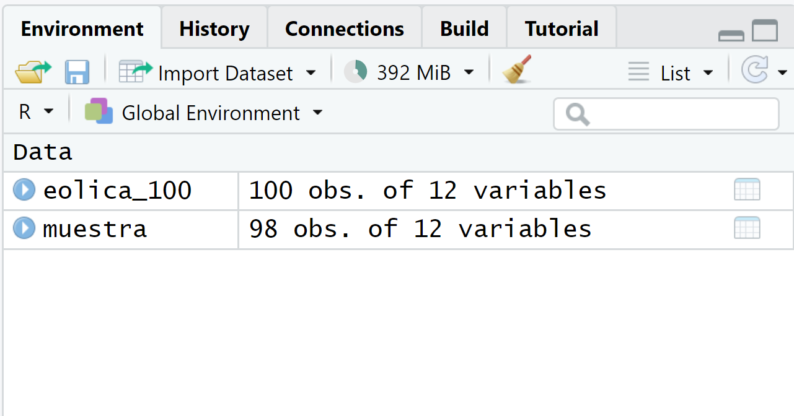

# Análisis previo de datos.

## Introducción.

Antes de la aplicación de técnicas complejas que permitan extraer de los datos conclusiones relevantes, es necesario realizar unas **tareas previas** destinadas a conseguir dos objetivos:

-   **Preparar nuestros datos** para que puedan ser procesados correctamente sin provocar distorsiones en los resultados.

-   Obtener una **visión inicial de la información** que esconden los datos, fundamentalmente en cuanto a las medidas básicas que caracterizan la distribución de frecuencias de las variables en las que se estructuran estos, así como, en el caso de contar con más de una variable, de las relaciones estadísticas que existen entre ellas.

Además, es preciso tener en cuenta que, usualmente, es conveniente que estos rasgos iniciales que caracterizan a nuestra muestra o población sean plasmados de un modo **visualmente amigable**, claro y conciso.

En esta práctica, por medio de un ejemplo basado en información económico-financiera de una muestra constituida por 100 empresas dedicadas a la producción de electricidad mediante tecnología eólica, se mostrarán una serie de buenas prácticas y análisis básicos útiles a la hora de preparar y analizar inicialmente nuestro conjunto de datos.

Vamos a suponer que trabajamos dentro de un **proyecto** que hemos creado previamente, de nombre "explora". Dentro de la carpeta del proyecto guardaremos el *script* llamado "[explora_describe.R](https://drive.google.com/file/d/1VqZX81h15JZhF7KXXj3alLd08o5ywkX2/view?usp=sharing)", y el archivo de Microsoft® Excel® llamado "[eolica_100_mv.xlsx](https://docs.google.com/spreadsheets/d/1f9KV5epNpBRM6v9sKPtgFDkzMlOo75Y2/edit?usp=sharing&ouid=115375878280465826079&rtpof=true&sd=true)". Si abrimos este último archivo, comprobaremos que se compone de tres hojas. La primera muestra un mensaje sobre el uso de los datos, la segunda recoge la descripción de las variables consideradas, y la tercera (hoja "Datos") almacena los datos que debemos importar. Estos datos se corresponden con diferentes variables económico-financieras de las 100 empresas productoras de electricidad mediante generación eólica con mayor volumen de activo.

Es muy importante observar que existen variables con datos faltantes (*missing values*). En concreto, podemos identificar estas faltas de dato por la existencia de celdas en blanco; pero también por la existencia de celdas con el texto "n.d." (no dato) o "s.d." (sin dato). Es muy importante identificar el modo en que quedan recogidos los datos faltantes en la hoja de cálculo, ya que **tendremos que aplicar código adicional** en el comando de importación de R **para que estos casos queden correctamente recogidos como *NAs*** (*not available*).

Cerraremos el archivo de Microsoft® Excel®, "eolica_100_mv.xlsx" y volveremos a RStudio. Después, abriremos nuestro *script* "explora_describe.R" con `File → Open File…` Este *script* contiene el programa que vamos a ir ejecutando en la práctica.

La primera línea / instrucción en el *script* es:

```{r, eval=TRUE, echo=TRUE, message=FALSE}
rm(list = ls())
```

La instrucción tiene como objeto limpiar el *Environment* (memoria) de objetos de anteriores sesiones de trabajo. Para importar los datos que hay en la hoja "Datos" del archivo de Microsoft® Excel® llamado "eolica_100_mv.xlsx", ejecutaremos el código:

```{r, eval=FALSE, echo=TRUE, message=FALSE}
library(readxl)
eolica_100 <- read_excel("eolica_100_mv.xlsx", sheet = "Datos",
                         na = c("n.d.", "s.d."))
summary (eolica_100)
```

```{r, eval=TRUE, echo=FALSE, message=FALSE}
library(readxl)
eolica_100 <- read_excel("eolica_100_mv.xlsx", sheet = "Datos",
                         na = c("n.d.", "s.d."))
library (dplyr)
df <- select(eolica_100, everything())
# Número de variables por bloque
variables_por_bloque <- 4

# Dividir las variables en bloques
for (i in seq(1, ncol(df), variables_por_bloque)) {
  # Comentario: No mostramos el nombre del bloque
  print(summary(df[, i:min(i + variables_por_bloque - 1, ncol(df))]))
  cat("\n")
}
rm (i)
rm (variables_por_bloque)
rm (df)
```

Por defecto, R considera las celdas en blanco de la hoja de cálculo como NAs; pero hemos de advertirle del resto de posibilidades que existen en la hoja para comunicar que falta un dato determinado, como ya se ha comentado. Para ello, hemos añadido en la función `read_excel()` el argumento `na =`, que recoge los contenidos de celda de la hoja de cálculo que indican que falta el dato en cuestión.

Por otro lado, R ha considerado la primera columna como una variable de tipo cualitativo, atributo, o factor. En realidad, esta columna no es una variable, sino que está formada por los nombres de los diferentes casos u observaciones. Para evitar que R tome la columna de los nombres de los casos como una variable más, podemos redefinir nuestro *data frame* diciéndole que tome esa primera columna como el conjunto de los *nombres* de los casos:

```{r, eval=FALSE, echo=TRUE, message=FALSE}
eolica_100 <- data.frame(eolica_100, row.names = 1)
summary (eolica_100)
```

```{r, eval=TRUE, echo=FALSE, message=FALSE}
eolica_100 <- data.frame(eolica_100, row.names = 1)
library (dplyr)
df <- select(eolica_100, everything())
# Número de variables por bloque
variables_por_bloque <- 4

# Dividir las variables en bloques
for (i in seq(1, ncol(df), variables_por_bloque)) {
  # Comentario: No mostramos el nombre del bloque
  print(summary(df[, i:min(i + variables_por_bloque - 1, ncol(df))]))
  cat("\n")
}
rm (i)
rm (variables_por_bloque)
rm (df)
```

Observaremos que ya no aparece NOMBRE, puesto que la columna correspondiente ya no es considerada como una variable.

## Análisis de una variable.

### Buscando *missing values* y *outliers*.

Vamos a suponer que la variable que queremos estudiar es la variable *Rentabilidad Económica* (RENECO).

La primera acción que debe realizarse es comprobar que todos los casos (empresas) tienen su correspondiente dato o valor para la variable (RENECO), es decir, que no existen **valores perdidos o *missing values***.

Para tener una idea general, se puede utilizar la función `vis_miss()` del paquete `{visdat}`, que nos localizará gráficamente los *missing values* de las diferentes variables, y calculará el porcentaje de casos que supone, con respecto al total de observaciones:

```{r eval=TRUE, echo=TRUE, message=FALSE, warning=FALSE, message=FALSE}
library(visdat)
vis_miss(eolica_100)
```

Puede observarse cómo, en el caso concreto de la variable RENECO, un 2% de los casos no tienen dato (es decir, 2 casos de los 100). Para localizar los casos concretos, puede recurrirse a utilizar las herramientas de manejo de *data frames* del paquete `{dplyr}`. En concreto, realizaremos una copia del *data frame* original, "eolica_100", a la que llamaremos "muestra", que es con la que trabajaremos (para mantener la integridad del *data frame* original); y filtraremos los casos para detectar aquellos que carecen de valor en la variable RENECO:

```{r eval=FALSE, echo=TRUE, message=FALSE}
library (dplyr)
muestra<- select(eolica_100, everything())
muestra %>% filter(is.na(RENECO)) %>% select(RENECO)
```

La función `is.na()` comprueba si, en la posición correspondiente a una fila o caso, para la variable escrita en el argumento; hay o no un dato o valor. Como resultado se obtienen dos empresas, para las que se puede comprobar que no hay valor para la variable RENECO:

```{r eval=TRUE, echo=FALSE, message=FALSE, warning=FALSE}
library (dplyr)
muestra<- select(eolica_100, everything())
muestra %>% filter(is.na(RENECO)) %>% select(RENECO)
```

Ante la existencia de *missing values*, se puede actuar de varios modos. Por ejemplo, se puede intentar obtener por otro canal de información el conjunto de valores de RENECO que no están disponibles, o recurrir a alguna estimación para los mismos y asignarlos. En caso de que esto sea difícil, se puede optar, simplemente, por eliminar estos casos, en especial cuando representan un porcentaje muy reducido respecto al total de casos. En nuestro ejemplo, vamos a suponer que hemos optado por esta última vía, al no conseguir unos valores más o menos verosímiles de RENECO para las empresas de las que se carece de dato. Esta **eliminación de casos** se podrá realizar mediante el código:

```{r, eval=TRUE, echo=TRUE}
muestra <- muestra %>% filter(! is.na(RENECO))
```

El operador **`!`** significa "no".

Podemos comprobar cómo en el *Global Environment* aparece el *data frame* "muestra" con dos casos menos (98):

{width="500"}

Una vez tratados los casos con valores perdidos o *missing values*, **conviene detectar la posible presencia en la muestra de *outliers*** o casos atípicos, que pudieran desvirtuar los resultados derivados de ciertos análisis. Al trabajar con una sola variable métrica (la rentabilidad económica, RENECO), podemos intentar realizar esta tarea **representando gráficamente** la variable mediante un ***boxplot*** o *gráfico de caja*. Aplicaremos, por ejemplo, el código siguiente, que utiliza la gramática del paquete `{ggplot2}`:

```{r eval=FALSE, echo=TRUE, message=FALSE}
library (ggplot2)
ggplot(data = muestra, map = (aes(y = RENECO))) +
    geom_boxplot(fill = "orange") +
    ggtitle("RENTABILIDAD ECONÓMICA", subtitle = "Empresas eólicas") +
    ylab("Rentabilidad Económica (%)")

```

Obteniéndose el gráfico:

```{r eval=TRUE, echo=FALSE, message=FALSE}
library (ggplot2)
ggplot(data = muestra, map = (aes(y = RENECO))) +
    geom_boxplot(fill = "orange") +
    ggtitle("RENTABILIDAD ECONÓMICA", subtitle = "Empresas eólicas") +
    ylab("Rentabilidad Económica (%)")

```

La "caja" contiene el 50% de los valores de la variable que toman los casos centrales (los que van del primer cuartil al tercero, cuya diferencia se llama *rango intercuartílico*), y contiene una línea horizontal que es la mediana (segundo cuartil). Por arriba sobresale un segmento que llega al mayor valor de la variable que toma algún caso y que no llega a ser atípico; y por debajo de la caja otro segmento que llega al menor valor de la variable que toma algún caso y que no llega a ser atípico. Los casos atípicos o outliers son aquellos que toman valores que se alejan más de 1.5 veces del rango intercuartílico (altura de la caja) del tercer cuartil, por arriba; o del primer cuartil, por abajo. Se registran mediante puntos.

En nuestro caso, el *boxplot* ratifica la existencia de dos casos atípicos. Para identificar esos dos casos concretos, podemos recurrir al paquete `{dplyr}`, y **establecer un filtro** con el siguiente código:

```{r eval=FALSE, echo=TRUE, message=FALSE}
Q1 <- quantile (muestra$RENECO, c(0.25))
Q3 <- quantile (muestra$RENECO, c(0.75))
muestra %>% 
        filter(RENECO > Q3 + 1.5*IQR(RENECO) | RENECO < Q1 - 1.5*IQR(RENECO)) %>%
        select(RENECO)
```

En el código anterior, las dos primeras filas calculan los cuartiles primero (Q1) y tercero (Q3) mediante la función `quantile()`. En esta función, es preciso poner como segundo argumento la proporción de casos que van a quedar por debajo del "cuantil" en cuestión (por ejemplo, el primer cuartil se calcula poniendo 0.25, dado que deja por debajo al 25% de casos con menor valor en la variable). Luego se filtran los *outliers* mediante la función `filter()` de `{dplyr}` , calculados como aquellos casos con valores de RENECO mayores que Q3 más 1,5 veces el rango intercuartílico de la variable; o menores que Q1 menos 1,5 veces dicho rango intercuartílico. Para calcular el rango intercuartílico se recurre a la función `IQR()`. Finalmente, con `select()`, se muestran los casos en la consola de R-Studio:

```{r eval=TRUE, echo=FALSE, message=FALSE}
Q1 <- quantile (muestra$RENECO, c(0.25))
Q3 <- quantile (muestra$RENECO, c(0.75))
muestra %>% 
        filter(RENECO > Q3 + 1.5*IQR(RENECO) | RENECO < Q1 - 1.5*IQR(RENECO)) %>%
        select(RENECO)

```

Como ocurría con los *missing values*, el tratamiento de los *outliers* depende de la información que se tenga, existiendo varias alternativas (corrección del dato, estimación, etc.) Si no se tiene información fiable, y los *outliers* no representan una gran proporción respecto al total de casos, puede optarse por su eliminación de la muestra. En este ejemplo, efectivamente, **eliminaremos estas dos empresas con comportamiento atípico** en la rentabilidad económica (RENECO), a fin de que su presencia en la muestra **no** **distorsione los resultados en la aplicación posterior de ciertas técnicas** (por ejemplo, un ANOVA o un análisis de regresión). Podemos hacerlo creando un nuevo *data frame* a partir de "muestra"; pero sin esos dos casos. Ese nuevo *data frame* se llamará, por ejemplo, "muestra_so":

```{r eval=TRUE, echo=TRUE, message=FALSE}
muestra_so <- muestra %>%
            filter(RENECO <= Q3 + 1.5*IQR(RENECO) & RENECO >= Q1 - 1.5*IQR(RENECO))
```

Es importante observar que, en el código de la función `filter()`, las desigualdades deben cambiar, así como el operador "**\|**" por el operador "**&**". En el *Global Environment* podemos comprobar cómo el *data frame* "muestra_so" posee el mismo número de variables que el *data frame* "muestra"; pero con dos observaciones o casos menos (96).

### Descripción de una variable.

Una vez que se tiene preparada la base de datos, con un tratamiento adecuado de los *missing values* y de los *outliers,* y **antes** de proceder a la aplicación de una técnica adecuada según los objetivos perseguidos en el estudio; suelen presentarse una serie de **gráficos** básicos y **medidas** descriptivas que proporcionan una **idea inicial de la estructura** del sector para la variable o variables analizadas. Nos referimos a medidas y/o gráficos de posición, dispersión y forma (asimetría y curtosis).

Antes de ello, se puede presentar una tabla donde se recoja la distribución de frecuencias de la variable. Si son muchos los casos (en el ejemplo, 96), la distribución podría presentarse agrupada en intervalos, como ya se vio en el capítulo 4 de este libro. De este modo, el código para generar la tabla podría ser:

```{r, eval=FALSE, echo=TRUE, message=FALSE}

# Tabla de datos (distribución de frecuencias agrupadas en intervalos)

library (knitr)
library (kableExtra)
muestra_so <- muestra_so %>% arrange(RENECO, row.names(muestra_so))

# Crear los intervalos
muestra_so$intervalos <- cut(muestra_so$RENECO, breaks = 5, include.lowest = TRUE)

# Contar las frecuencias de cada intervalo
conteo_intervalos <- table(muestra_so$intervalos)

# Convertir el resultado a un data frame para una mejor visualización
conteo_intervalos_df <- as.data.frame(conteo_intervalos)

# Renombrar las columnas para mayor claridad
colnames(conteo_intervalos_df) <- c("Intervalo", "Frecuencia")

# Calcular y guardar la frecuencia total
N_agre <- sum(conteo_intervalos_df$Frecuencia)

# Calcular frecuencias absolutas acumuladas
conteo_intervalos_df$Frecuencia_acum <- cumsum(conteo_intervalos_df$Frecuencia)

# Calcular frecuencias relativas
conteo_intervalos_df$Frecuencia_R <- conteo_intervalos_df$Frecuencia / N_agre

# Calcular frecuencias relativas acumuladas
conteo_intervalos_df$Frecuencia_R_acum <- cumsum(conteo_intervalos_df$Frecuencia_R)

# Mostrar el resultado
conteo_intervalos_df %>%
  kable(caption = "Distribución de frecuencias agrupadas en intervalos de la Rentabilidad Económica",
        col.names = c("Intervalo rentabilidad", "Frecuencia absoluta n(i)",
                      "Frecuencia absoluta acum. N(i)", "Frecuencia relativa f(i)",
                      "Frecuencia relativa acum. F(i)"),
        format.args = list(decimal.mark = ".", digits = 2)) %>%
  kable_styling(full_width = F, bootstrap_options = "striped",
                "bordered", "condensed",
                position = "center", font_size = 11) %>%
  row_spec(0, bold= T, align = "c") %>%
  row_spec(1:(nrow(conteo_intervalos_df)), bold= F, align = "c")
```

```{r, eval=TRUE, echo=FALSE, message=FALSE}

# Tabla de datos (distribución de frecuencias agrupadas en intervalos)

library (knitr)
library (kableExtra)
muestra_so <- muestra_so %>% arrange(RENECO, row.names(muestra_so))

# Crear los intervalos
muestra_so$intervalos <- cut(muestra_so$RENECO, breaks = 5, include.lowest = TRUE)

# Contar las frecuencias de cada intervalo
conteo_intervalos <- table(muestra_so$intervalos)

# Convertir el resultado a un data frame para una mejor visualización
conteo_intervalos_df <- as.data.frame(conteo_intervalos)

# Renombrar las columnas para mayor claridad
colnames(conteo_intervalos_df) <- c("Intervalo", "Frecuencia")

# Calcular y guardar la frecuencia total
N_agre <- sum(conteo_intervalos_df$Frecuencia)

# Calcular frecuencias absolutas acumuladas
conteo_intervalos_df$Frecuencia_acum <- cumsum(conteo_intervalos_df$Frecuencia)

# Calcular frecuencias relativas
conteo_intervalos_df$Frecuencia_R <- conteo_intervalos_df$Frecuencia / N_agre

# Calcular frecuencias relativas acumuladas
conteo_intervalos_df$Frecuencia_R_acum <- cumsum(conteo_intervalos_df$Frecuencia_R)

```

```{r, eval=TRUE, echo=FALSE, message=FALSE}
tipo_output <- c("html") # pdf, html, docx
knitr::opts_knit$set(rmarkdown.pandoc.to = tipo_output)
```

```{r, eval=TRUE, echo=FALSE, message=FALSE}

# Mostrar el resultado
if (knitr::opts_knit$get("rmarkdown.pandoc.to") == "html") {
    knitr.table.format = "html"
    conteo_intervalos_df %>%
  kable(caption = "Distribución de frecuencias agrupadas en intervalos de la Rentabilidad Económica",
        col.names = c("Intervalo rentabilidad", "Frecuencia absoluta n(i)",
                      "Frecuencia absoluta acum. N(i)", "Frecuencia relativa f(i)",
                      "Frecuencia relativa acum. F(i)"),
        format.args = list(decimal.mark = ".", digits = 2)) %>%
  kable_styling(full_width = F, bootstrap_options = "striped",
                "bordered", "condensed",
                position = "center", font_size = 11) %>%
  row_spec(0, bold= T, align = "c") %>%
  row_spec(1:(nrow(conteo_intervalos_df)), bold= F, align = "c")

    } else if (knitr::opts_knit$get("rmarkdown.pandoc.to") == "docx") {
conteo_intervalos_df %>%
  kable(caption = "Distribución de frecuencias agrupadas en intervalos de la Rentabilidad Económica",
        col.names = c("Intervalo rentabilidad", "Frecuencia absoluta n(i)",
                      "Frecuencia absoluta acum. N(i)", "Frecuencia relativa f(i)",
                      "Frecuencia relativa acum. F(i)"),
        format.args = list(decimal.mark = ".", digits = 2))
}
```

El **análisis gráfico** suele dar una idea atractiva e intuitiva de la estructura de la distribución de frecuencias de nuestro conjunto de casos en relación con la variable a analizar. Un gráfico fundamental es el **histograma** de la variable estudiada. Para ello, utilizaremos la gramática del paquete `{ggplot2}`:

```{r eval=TRUE, echo=TRUE, message=FALSE}
## Descriptivos básicos

# Gráficos básicos

g1 <-
ggplot(data = muestra_so, map = aes(x = RENECO)) +
  geom_histogram(bins = 40,
                 colour = "red",
                 fill = "orange",
                 alpha = 0.7) +
  geom_vline(xintercept = mean(muestra_so$RENECO),
             color = "dark blue",
             size = 1.2,
             alpha = 0.8) +
  ggtitle("Histograma")+
  xlab("Rentabilidad Económica (%)") +
  ylab("Frecuencias")

g1

```

En el gráfico vemos de un modo bastante nítido la distribución de frecuencias en cuanto a la rentabilidad económica (RENECO). Se ha incorporado una línea vertical azul (mediante `geom_vline()`) para localizar la rentabilidad media. Entre otras cosas, se puede apreciar que la distribución de frecuencias es acampanada y *asimétrica positiva*.

Como complemento al histograma, podemos realizar un gráfico de densidad de RENECO, al que añadiremos una curva normal con la misma media y desviación típica que nuestra distribución de frecuencias, y que se añade mediante `stat_function()` y el argumento `fun = dnorm`. Este gráfico representa la distribución de probabilidad empírica de la muestra, es una especie de histograma "suavizado". De este modo, se podrán verificar de un modo fácil algunas de las características avanzadas con la observación del histograma, como la asimetría positiva. El código es:

```{r eval=TRUE, echo=TRUE, message=FALSE}
g2 <-
ggplot(data = muestra_so, map = aes(x = RENECO)) +
  geom_density(colour = "red",
               fill = "orange",
               alpha = 0.7) +
  geom_vline(xintercept = mean(muestra_so$RENECO),
             color = "dark blue",
             size = 0.8,
             alpha = 0.8) +
  stat_function(fun = dnorm, args = list(mean = mean(muestra_so$RENECO),
                                         sd = sd(muestra_so$RENECO)),
                                         geom = "area", color = "darkblue", 
                                         fill = "yellow", alpha = 0.2) +
  ggtitle("Gráfico de densidad vs curva normal")+
  xlab("Rentabilidad Económica (%)") +
  ylab("Densidad")

g2
```

Un tercer gráfico útil es el box-plot una vez se eliminaron los casos outliers, con la incorporación de los valores que toman los casos que componen la muestra, para lo cuál se utiliza el `geom_jitter`:

```{r eval=TRUE, echo=TRUE, message=FALSE}
g3 <-
ggplot(data = muestra_so, map = (aes(x = "", y = RENECO))) +
  geom_boxplot(color = "red",
               fill = "orange",
               outlier.shape = NA) +
  stat_summary(fun = "mean",
               geom = "point",
               size = 3,
               col = "darkblue") +
  geom_jitter(width = 0.1,
              size = 1,
              col = "darkred",
              alpha = 0.50) +
  ggtitle("Box-Plot") +
  ylab("Rentabilidad Económica (%)")

g3
```

Por otro lado, conviene tener conocimiento del valor de las principales **medidas descriptivas** (de posición, dispersión, forma) que caracterizan a la distribución de la variable a analizar. Para ello, vamos a crear un *data frame* llamado, por ejemplo, "estadisticos", que recogerá las diferentes medidas, calculadas al aplicar a la variable RENECO del *data frame* "muestra_so" la función de `{deplyr}` llamada `summarise()`. Se calcularán la media, desviación típica, valor mínimo, mediana, valor máximo, el coeficiente de asimetría de Fisher, y el coeficiente de apuntamiento o curtosis de Fisher. Precisamente, para poder calcular esta última medida, es preciso activar el paquete `{moments}`, que contiene la función `kurtosis()`. La versión del coeficiente de apuntamiento de esta función dispone como distribución perfectamente mesocúrtica el valor de 3, por lo que se le restará 3 en la versión que manejaremos para que la distribución mesocúrtica se sitúe en un coeficiente de 0. El código es:

```{r eval=TRUE, echo=TRUE, message=FALSE}
# Calcular estadísticos

library (moments) # paquete necesario para calcular la curtosis.

estadisticos <- muestra_so %>% summarise( Media = mean(RENECO),
                                          DT = sd(RENECO),
                                          Mínimo = min(RENECO),
                                          Mediana = median(RENECO),
                                          Maximo = max(RENECO),
                                          Asimetria = skewness(RENECO),
                                          Curtosis = kurtosis(RENECO) - 3)
```

La ventaja de volcar las medidas y estadísticos en el data frame (de un solo caso) "estadisticos" es que se pueden mostrar los valores en una tabla elegante generada a partir de el mismo mediante las funciones knitr() y kableExtra(), como ya sabemos:

```{r eval=FALSE, echo=TRUE, message=FALSE}
# Mostrar estadisticos

estadisticos %>%
  kable(caption = "Principales Estadísticos de la Rentabilidad Económica",
        col.names = c("Media", "Mediana",
                      "Desviación Típica", "Valor mínimo",
                      "Valor Máximo", "C. Asimetría Fisher",
                      "C. Curtosis Fisher"),
        format.args = list(decimal.mark = ".", digits = 2)) %>%
  kable_styling(full_width = F, bootstrap_options = "striped",
                "bordered", "condensed",
                position = "center", font_size = 11) %>%
  row_spec(0, bold= T, align = "c") %>%
  row_spec(1:(nrow(estadisticos)), bold= F, align = "c")
```

```{r eval=TRUE, echo=FALSE, message=FALSE}
# Determinar el formato de salida actual
output_format <- knitr::opts_knit$get("rmarkdown.pandoc.to")

# Formatear la tabla según el formato de salida
if (output_format == "html") {
  estadisticos %>%
  kable(caption = "Principales Estadísticos de la Rentabilidad Económica",
        col.names = c("Media", "Mediana",
                      "Desviación Típica", "Valor mínimo",
                      "Valor Máximo", "C. Asimetría Fisher",
                      "C. Curtosis Fisher"),
        format.args = list(decimal.mark = ".", digits = 2)) %>%
  kable_styling(full_width = F, bootstrap_options = "striped",
                "bordered", "condensed",
                position = "center", font_size = 11) %>%
  row_spec(0, bold= T, align = "c") %>%
  row_spec(1:(nrow(estadisticos)), bold= F, align = "c")
} else if (output_format == "latex") {
estadisticos %>%
  kable(caption = "Principales Estadísticos de la Rentabilidad Económica",
        col.names = c("Media", "Mediana",
                      "Desviación Típica", "Valor mínimo",
                      "Valor Máximo", "C. Asimetría Fisher",
                      "C. Curtosis Fisher"),
        format.args = list(decimal.mark = ".", digits = 2))
}  
```

La interpretación de estas medidas fueron comentadas en el capítulo 4.

### Normalidad.

En muchas técnicas multivariantes basadas en métodos inferenciales (por ejemplo, análisis de la varianza, o en la regresión lineal), se requiere que las variables sigan una **distribución normal**. Para comprobarlo, se puede a recurrir a análisis gráficos o a análisis formales, estos últimos basados en contrastar la hipótesis nula de normalidad.

Vamos a mostrar un **método gráfico** muy extendido. Comprobaremos la normalidad de la variable RENECO mediante un ***gráfico qq*** (cuantil-cuantil), que compara los cuantiles de nuestra muestra con los de una distribución normal teórica (con la misma media y desviación típica). Si los puntos se sitúan cercanos a la diagonal, entonces se asumirá un comportamiento (aproximadamente) normal. El código para realizar el gráfico con las herramientas del paquete `{ggplot2}` es:

```{r eval=FALSE, echo=TRUE, message=FALSE}
## Normalidad

# Grafico QQ

g4 <-
ggplot(data = muestra_so, aes(sample = RENECO)) +
  stat_qq(colour = "red") + 
  stat_qq_line(colour = "dark blue") +
  ggtitle("QQ-Plot")

g4
```

Y el resultado:

```{r eval=TRUE, echo=FALSE, message=FALSE}
## Normalidad

# Grafico QQ

g4 <-
ggplot(data = muestra_so, aes(sample = RENECO)) +
  stat_qq(colour = "red") + 
  stat_qq_line(colour = "dark blue") +
  ggtitle("QQ-Plot")

g4
```

A veces, es difícil obtener una conclusión sólida con el gráfico *qq*; aunque en el ejemplo se aprecia, sobre todo en los primeros puntos, una separación notable de estos con respecto a la línea, lo que induce a pensar en que podría **no** seguirse una distribución normal.

Si queremos ser más precisos, en lugar de un análisis gráfico se puede recurrir a realizar un análisis formal, basado en la realización de **contrastes de hipótesis**. Una prueba muy usual es la **prueba de normalidad de *Shapiro y Wilk***, que tiene un buen comportamiento en muestras relativamente reducidas. En esta prueba, la hipótesis nula equivale al supuesto de normalidad. Para un 5% de significación estadística, un p-valor superior a 0.05 implicará el no-rechazo de la hipótesis de normalidad. Para realizar la prueba, se ejecutará el código:

```{r eval=FALSE, echo=TRUE, message=FALSE}
# Prueba de Shapiro-Wilk

shapiro.test(x = muestra_so$RENECO)
```

El resultado obtenido en la consola:

```{r eval=TRUE, echo=FALSE, message=FALSE}
# Prueba de Shapiro-Wilk

shapiro.test(x = muestra_so$RENECO)
```

Como el p-valor es (muy) inferior a 0.05, **se rechaza la hipótesis nula de normalidad en la distribución**, lo que implica que, para una significación estadística del 5%, admitimos que RENECO **no** sigue, para nuestra muestra, un comportamiento normal, como ya se anticipó con el gráfico *qq*.

### Resumen: los 4 gráficos básicos en la descripción de una variable.

En definitiva, para describir de un modo inicial una distribución de frecuencias de una variable (en escala métrica), podrían analizarse los 4 gráficos que se han comentado anteriormente. Estos gráficos se pueden presentar conjuntamente, para ahorrar espacio en un informe, utilizando el paquete `{patchwork}`, que permite combinar e integrar en una sola imagen varios gráficos generados con `{ggplot2}`. En nuestro ejemplo, vamos a generar una figura que integra los 4 gráficos anteriores (que hemos denominado "g1", "g2", "g3" y "g4"). Para ello creamos el objeto "resumen", que integra los gráficos, mediante una asignación con la sintaxis del paquete `{patchwork}`: El operador `/` indica que los gráficos siguientes se dispondrán inmediatamente debajo; mientras que `|` indica que el gráfico siguiente se dispone al lado del anterior. Luego, se le añade también un título y un subtítulo:

```{r eval=TRUE, echo=TRUE, message=FALSE}
## Resumen gráfico

library (patchwork)
resumen <- (g1 | g2)/(g3 | g4)
resumen <- resumen + 
  plot_annotation(
    title = "Rentabilidad Económica",
    subtitle = "Empresas eólicas (sin outliers)")
resumen
```

## Análisis de múltiples variables.

Son muchas las técnicas aplicadas al análisis de datos económicos basadas en una distribución de frecuencias multivariante. En este apartado nos centraremos en el caso de **variables métricas**, ya que al caso de atributos, variables categóricas o factores; le dedicaremos un capítulo en exclusiva. Algunas técnicas multivariantes son el análisis de componentes principales, el análisis de regresión, el análisis clúster...

Todas estas metodologías requieren, de nuevo, de una fase inicial que ponga a punto la base de datos y ofrezca una fotografía de cómo es la situación en cuanto a las variables en estudio. En este sentido, es conveniente aplicar, para cada variable por separado, algunos de los análisis gráficos básicos vistos anteriormente.

A estos análisis básicos hay que añadir, principalmente, algún análisis previo adicional, destinado fundamentalmente a comprobar el **grado de intensidad en la relación estadística** entre las variables implicadas. Antes de abordar esta cuestión, hemos de pararnos en una casuística específica que se presenta cuando trabajamos con numerosas variables: la detección de casos atípicos o *outliers*.

### Localización de *missing values* y *outliers*.

Para trabajar con múltiples variables, en primer lugar es preciso localizar los casos con **valores perdidos o *missing values***, para decidir cómo procesarlos (eliminación del caso, estimación del valor faltante, etc.)

Vamos a imaginar que queremos realizar un análisis en el que tendremos en cuenta las variables RENECO (rentabilidad económica), ACTIVO (volumen de activos de la empresa), MARGEN (margen de beneficio) y RES (resultado del ejercicio).

Ya vimos cómo el siguiente código nos aporta gráficamente una idea de la posible existencia de valores faltantes:

```{r echo=TRUE, message=FALSE, warning=FALSE, message=FALSE}
## Trabajando con multiples variables.

# Localizando y descartando casos con missing values.

vis_miss(eolica_100)
```

Podemos apreciar cómo existen varios casos con *missing values* en las variables objeto de estudio.

Para localizar los *missing values*, podemos recurrir al siguiente código. En él, hacemos una copia del *data frame* original, "eolica_100", para preservar su integridad. A esa copia la hemos llamado "muestra2". Luego, hemos sometido a "muestra2" a un *filtro* para detectar los casos en los que no hay valor para alguna (o varias) de las variables analizadas. El operador **`|`** significa "o". Posteriormente, hemos decidido eliminar esos casos. Para ello asignamos a "muestra2" el resultado de pasar un filtro en el que se eligen los casos que no tienen valores faltantes en ninguna de las variables. El operador **`&`** significa "y":

```{r eval=TRUE, echo=TRUE, message=FALSE}
## Trabajando con multiples variables.

# Localizando y descartando casos con missing values.
muestra2<- select(eolica_100, everything())
muestra2 %>% filter(is.na(RENECO) | is.na(ACTIVO) | is.na(MARGEN) | is.na(RES))%>%
             select(RENECO, ACTIVO, MARGEN, RES)
muestra2 <- muestra2 %>%
            filter(! is.na(RENECO) & ! is.na(ACTIVO) & ! is.na(MARGEN) & ! is.na(RES))
```

El *data frame* "muestra2" contiene los mismos datos que "eolica_100", salvo los 6 casos con *missing values* (94).

Para la **detección de *outliers***, si las variables que entran en el análisis son numerosas, podría ser poco operativo estudiar las variables una a una. Una alternativa consiste en calcular la ***distancia de Mahalanobis*** de las variables del estudio, como **"resumen" del comportamiento de cada caso** en todas las variables del análisis, consideradas conjuntamente.

Así, primero vamos a calcular una columna más en el *data frame* "muestra2" con los valores de la *distancia de* *Mahalanobis* del conjunto de las 4 variables en cada uno de los casos (empresas eólicas). Esta columna o variable la denominaremos, por ejemplo, MAHALANOBIS*.* Para ello, se utiliza la función `mutate()` del paquete `{deplyr}`, y como argumento de esta la función `mahalanobis()`, en la que hay que especificar:

-   Las columnas de "muestra2" para las que se van a calcular las distancias, unidas en una matriz interna con la función `cbind()`.

-   El vector de medias de las variables para las que se calcula la distancia (argumento `center =`). Las variables, aquí, se recogen con la función `select()` de `{deplyr}`, en donde el punto significa que las columnas pertenecen al *data frame* al que se llamó con el operador *pipe* `%>%`:

-   La matriz de varianzas y covarianzas de las variables para las que se calcula la distancia (argumento `cov =`).

En definitiva, el código es:

```{r eval=TRUE, echo=TRUE, message=FALSE}
# Identificando y descartando outliers con distancia de Mahalanobis.

muestra2 <- muestra2 %>%
            mutate (MAHALANOBIS = mahalanobis(cbind(RENECO, ACTIVO, MARGEN, RES),
                      center = colMeans(select(., RENECO, ACTIVO, MARGEN, RES)),
                      cov = cov(select(., RENECO, ACTIVO, MARGEN, RES))))
```

Posteriormente, se puede construir el diagrama de caja de la variable MAHALANOBIS, como cualquier otra variable:

```{r eval=TRUE, echo=TRUE, message=FALSE}
ggplot(data = muestra2, map = (aes(y = MAHALANOBIS))) +
    geom_boxplot(fill = "orange") +
    ggtitle("DISTANCIA DE MAHALANOBIS",
            subtitle = "RENECO, ACTIVO, MARGEN, RES. Empresas eólicas ") +
    ylab("MAHALANOBIS")
```

Se observa cómo existen varios casos *outliers*. Para saber de qué casos concretos se trata, se podrá ejecutar el código:

```{r eval=FALSE, echo=TRUE, message=FALSE}
Q1M <- quantile (muestra2$MAHALANOBIS, c(0.25))
Q3M <- quantile (muestra2$MAHALANOBIS, c(0.75))

muestra2 %>%
  filter(MAHALANOBIS > Q3M + 1.5*IQR(MAHALANOBIS) |
         MAHALANOBIS < Q1M - 1.5*IQR(MAHALANOBIS))%>%
  select(MAHALANOBIS, RENECO, ACTIVO, MARGEN, RES) 
```

En la consola se obtendrá el listado:

```{r eval=TRUE, echo=FALSE, message=FALSE}
Q1M <- quantile (muestra2$MAHALANOBIS, c(0.25))
Q3M <- quantile (muestra2$MAHALANOBIS, c(0.75))

df <- muestra2 %>%
  filter(MAHALANOBIS > Q3M + 1.5*IQR(MAHALANOBIS) |
           MAHALANOBIS < Q1M - 1.5*IQR(MAHALANOBIS))%>%
           select(MAHALANOBIS, RENECO, ACTIVO, MARGEN, RES)
  
# Número de columnas por bloque
columnas_por_bloque <- 3

# Dividir las columnas en bloques y mostrar los datos en la consola
for (i in seq(1, ncol(df), columnas_por_bloque)) {
  print(df[, i:min(i + columnas_por_bloque - 1, ncol(df))])
  cat("\n")
}
rm(i)
rm(df)
rm(columnas_por_bloque)
```

Si se opta por eliminar estos casos cara al análisis a aplicar posteriormente, se podrá crear un nuevo *data frame*, por ejemplo "muestra2_so", con el código siguiente:

```{r eval=TRUE, echo=TRUE, message=FALSE}
muestra2_so <- muestra2 %>%
  filter(MAHALANOBIS <= Q3M + 1.5*IQR(MAHALANOBIS) &
           MAHALANOBIS >= Q1M - 1.5*IQR(MAHALANOBIS)) 
```

El *data frame* "muestra2_so" será una réplica de "muestra2", aunque sin incluir los casos detectados como atípicos o *outliers* (85 casos).

### Correlación entre variables.

Cuando trabajamos con más de una variable, una característica muy importante viene dada por la intensidad con la que tales variables están relacionadas estadísticamente entre sí, es decir, el estudio de las correlaciones. Un modo atractivo y rápido de visualizar la **matriz de correlaciones** de las variables es a través de la función `ggpairs()` del paquete `{GGally}`. Para aplicar la función, hemos creado el *data frame* "temporal" con las variables (métricas) del estudio, que borramos tras general el gráfico:

```{r eval=TRUE, echo=TRUE, warning=FALSE, error=FALSE, message=FALSE}
## Correlaciones entre variables.
library (GGally)

temporal <- muestra2_so %>% select(RENECO, ACTIVO, MARGEN, RES)
corr_plot_so <- ggpairs(temporal, 
                        lower = list(continuous = wrap("cor",
                        size = 4.5,
                        method = "pearson",
                        stars = TRUE)),
                        title = "Matriz de Correlación sin outliers")
rm(temporal)
corr_plot_so
```

Un coeficiente de correlación puede tomar un valor entre -1 (fuerte relación, en sentido opuesto) a +1 (fuerte relación, en el mismo sentido). Como puede apreciarse en el gráfico, las variables ACTIVO y RES mantienen una relación muy intensa y en sentido positivo. Entre MARGEN y RENECO existe también una relación de intensidad destacable. En cambio, ACTIVO y MARGEN; y RENECO y ACTIVO apenas están estadísticamente relacionadas.

Antes de terminar la práctica, vamos a comparar las correlaciones anteriores con las que se dan si se incluyen los casos outliers en la muestra. Estas correlaciones se generarán con el mismo código; pero sustituyendo el *data frame* "muestra2_so" por "muestra":

```{r eval=TRUE, echo=TRUE, warning=FALSE, error=FALSE, message=FALSE}
temporal <- muestra2 %>% select(RENECO, ACTIVO, MARGEN, RES)
corr_plot_co <- ggpairs(temporal, 
                        lower = list(continuous = wrap("cor",
                                                       size = 4.5,
                                                       method = "pearson",
                                                       stars = TRUE)),
                        title = "Matriz de Correlación con outliers")
rm(temporal)
corr_plot_co
```

Puede observarse cómo la presencia de outliers puede variar la relación entre las variables. Salvo el caso de la correlación entre ACTIVO y RES, que se fortalece; las correlaciones entre RENECO y MARGEN, y RENECO y RES se debilitan (en este último caso, pasa a no ser significativa ni tan siquiera para una significación de 0.1).

Un modo visual para poder comparar ambas figuras consiste en utilizar la función `ggmatrix_gtable()` del paquete `{GGally}` para realizar "copias" en formato compatible con la función `ggplot()` del paquete `{ggplo2}`. Estas "copias" pueden integrarse en una sola figura utilizando la función `grid.arrange()` del paquete `{gridExtra}`. Nota: este paquete funciona de modo parecido a `{patchwork}`, y lo utilizamos porque este último paquete no funciona correctamente al intentar combinar las copias creadas en formato compatible con la función `ggplot()`. El código y resultado serán:

```{r eval=TRUE, echo=TRUE, warning=FALSE, error=FALSE, message=FALSE}
corr_plot_so_gg <- ggmatrix_gtable(corr_plot_so)
corr_plot_co_gg <- ggmatrix_gtable(corr_plot_co)

library (gridExtra)

grid.arrange(corr_plot_so_gg, corr_plot_co_gg, ncol = 2, top = "CORRELACIONES")

```

## Materiales para realizar las prácticas del capítulo.

En esta sección se muestran los links de acceso a los diferentes materiales (scripts, datos...) necesarios para llevar a cabo los contenidos prácticos del capítulo.

**Datos (en formato Microsoft (R) Excel (R)):**

-   eolica_100_mv.xlsx ([obtener aquí](https://docs.google.com/spreadsheets/d/1f9KV5epNpBRM6v9sKPtgFDkzMlOo75Y2/edit?usp=sharing&ouid=115375878280465826079&rtpof=true&sd=true))

**Scripts:**

-   explora_describe.R ([obtener aquí](https://drive.google.com/file/d/1VqZX81h15JZhF7KXXj3alLd08o5ywkX2/view?usp=sharing))
