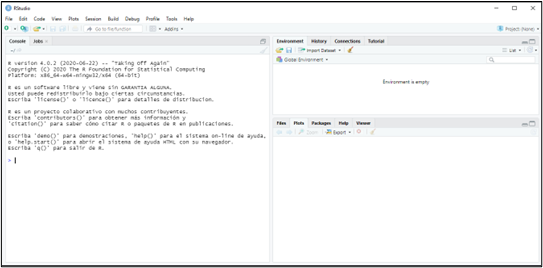
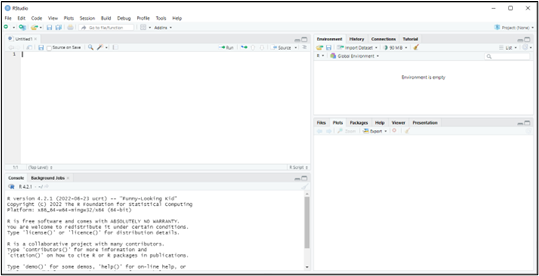

```{r matrstars-numerado-setup-cap1, include=FALSE}
options(matrstars.suppress_caption = TRUE)
```

# Introducción.

{width="100%"}

::: {style="text-align: center;"}
**Figura 1.1.** [La distribución Normal...]{.smallcaps}
:::


## {.hicon} De los datos a la información: la analítica de datos.

Vivimos rodeados de datos. Las administraciones públicas los recopilan para diseñar políticas; las empresas los generan en cada transacción; los mercados financieros los emiten segundo a segundo. Pero los datos, por sí solos, no son más que registros en bruto: cifras de ventas, cotizaciones, respuestas a una encuesta, indicadores macroeconómicos. Su verdadero valor aparece cuando somos capaces de transformarlos en **información** que sirva de base para la **toma de decisiones**.

Esta necesidad de convertir datos en conocimiento útil está presente en prácticamente todas las facetas de la actividad humana. Y de manera muy especial en la **Economía**, entendida como la ciencia que se ocupa de la asignación y administración de recursos limitados. Un gestor público necesita saber si una política de empleo está funcionando; una empresa necesita anticipar la demanda; un investigador necesita contrastar si una teoría sobre el comportamiento de los mercados se sostiene frente a la evidencia empírica. En todos estos casos, el punto de partida son datos, y el objetivo es extraer de ellos información fiable.

### {.hicon} La Estadística como ciencia instrumental.

La ciencia que se ocupa de este tránsito del dato a la información es la **Estadística**. Su singularidad reside en que no posee un objeto de estudio sustantivo propio, como lo tiene la Física o la Biología: la Estadística es una **ciencia instrumental** que dota al resto de disciplinas de herramientas para recopilar datos de forma sistemática, organizarlos y extraer de ellos información relevante. Por eso es transversal a todas las ciencias —naturales, sociales, jurídicas— y a todos los campos del saber. Como señalan @Mood&Graybill1963:

> *"La Estadística es la tecnología del método científico."*

Dentro de la Estadística podemos distinguir dos grandes vertientes:

-   La **recopilación y organización** de datos en un sistema estructurado de consulta. Es la vertiente que asociamos a la producción de estadísticas oficiales, censos, encuestas, registros administrativos o bases de datos corporativas.

-   La **explotación y análisis** de esos datos: su transformación en información relevante mediante la aplicación de técnicas que permiten describir, resumir, detectar patrones, contrastar hipótesis y construir modelos.

### {.hicon} Analítica de datos económicos.

Esta segunda vertiente —la explotación de los datos y su conversión en información— es lo que hoy se conoce como **analítica de datos** (*data analytics*). La analítica de datos abarca desde la estadística descriptiva más elemental hasta las técnicas de aprendizaje automático (*machine learning*), pasando por la modelización econométrica, el análisis multivariante o los modelos de elección discreta, entre otras.

Este libro se sitúa precisamente en ese terreno: la **analítica de datos económicos**. Es decir, la aplicación de técnicas estadísticas y de análisis de datos a problemas de naturaleza económica y empresarial, con el objetivo de generar conocimiento que reduzca la incertidumbre inherente a los fenómenos económicos y contribuya a una mejor toma de decisiones.

### {.hicon} La infraestructura: el software de análisis.

Para llevar a cabo esta analítica se necesita una infraestructura básica. Además de los propios datos y de los conocimientos metodológicos, resulta imprescindible contar con un **software** adecuado que permita procesar el flujo de datos, aplicar las técnicas de análisis pertinentes y presentar los resultados de forma clara.

En los últimos tiempos se ha producido una evolución del hardware sin precedentes, lo que ha dado soporte al desarrollo de un potente software dedicado al análisis de datos. Este software se concreta en aplicaciones y plataformas diversas: SPSS®, Stata, SAS®... Y también en lenguajes de programación orientados al análisis estadístico y matemático, como pueden ser Python, Matlab, Julia o... R.

En nuestro caso, la herramienta elegida es **R**.

## {.hicon} ¿Qué es R y cómo nos ayuda a analizar datos?

R no es solo una aplicación al uso. Es todo un **lenguaje de programación**, orientado principalmente a la analítica de datos, sobre todo desde una perspectiva estadística. R es un proyecto de GNU, por lo que los usuarios son libres de modificarlo y extenderlo. Se distribuye como software libre bajo la licencia GNU y es multiplataforma, lo que ha facilitado su difusión y la existencia de una comunidad muy activa de usuarios y desarrolladores.

R nos ofrece un ecosistema idóneo para cubrir todas las etapas de un proyecto de analítica de datos: desde la importación y depuración de los datos, pasando por su exploración gráfica y descriptiva, hasta la estimación de modelos y la presentación de resultados. A lo largo de este libro, R será nuestra herramienta de trabajo en cada una de estas etapas.

## {.hicon} Instalación de R y R-Studio.

Como ya se ha mencionado, R es un software o lenguaje de uso y difusión gratuitos, bajo licencia GNU. El modo de instalar R es sencillo: basta con ir a la web [*CRAN*](https://cran.r-project.org/) (*Comprehensive R Archive Network*) y descargar la última versión disponible en el sistema operativo del que se sea usuario (en este manual, Microsoft® Windows®). Se ejecutará el archivo descargado, y se completará la instalación.

Una limitación de R es la interfaz o IDE (entorno de desarrollo integrado) que incorpora. Es decir, el "software" con el que se interactúa con el lenguaje R. Esta IDE es muy poco amigable. Para superar esta limitación, existen IDEs alternativas, entre las que destaca RStudio, desarrollada por Posit® Software. Esta IDE es gratuita. De nuevo, simplemente tendremos que ir a la web de[RStudio](https://posit.co/download/rstudio-desktop/) y descargar e instalar la versión gratuita.

## {.hicon} R y RStudio. Comienzo: Proyectos.

Tras instalar R y su IDE RStudio, podremos comenzar a trabajar. Para ello, abriremos RStudio pulsando en el icono correspondiente. Aparecerá la siguiente ventana:

{.d-block .mx-auto width="100%"}

::: {style="text-align: center;"}
**Figura 1.2.** [IDE de RStudio.]{.smallcaps}
:::


La parte izquierda de la ventana es la **consola**. La consola es la sección de RStudio donde podemos manejar R mediante la introducción de código. Por ejemplo, podemos escribir `2+2` después del cursor (signo "\>"), y pulsar Enter. La propia consola nos devolverá el valor 4:

```{r,eval=TRUE, echo=TRUE}
2+2
```

De todos modos, la forma más eficiente de trabajar es mediante "proyectos" y "scripts".

Un **proyecto** básicamente viene asociado a la carpeta donde R trabajará, buscando los datos que sean sus "inputs", y, en su caso, enviando sus resultados u "outputs". Dicho de otro modo, es una carpeta más de nuestro sistema de carpetas o directorios; pero a la que dotamos de una característica especial: ser un proyecto de R. Si abrimos desde RStudio el proyecto, estaremos diciendo a R que, por defecto, preferentemente busque todos los archivos e inputs (datos, etc.) que necesite en esa carpeta de proyecto; y que, en su caso, guarde en tal carpeta los outputs que genere.

Para crear un nuevo proyecto, seguiremos la instrucción `File → New Project`, luego se nos preguntará si se crea el proyecto en una nueva carpeta o en una ya existente. Vamos a crearlo, por ejemplo, en el disco extraíble D, carpeta R, subcarpeta "explora", que ya está creada. Nos saldrá una ventana para buscar la carpeta y, cuando la encontremos, pulsaremos `Open` y `Create Project`. Ya tendremos creado nuestro proyecto. Si nos vamos al explorador de Windows®, y buscamos la carpeta "explora", encontraremos que en tal carpeta aparece un archivo de nombre "explora", con un icono de un cubo con una "R". Ese archivo lo que está haciendo es actuar como un "faro" que le dice a R que, cuando trabajemos en el proyecto "explora", todos los archivos de datos necesarios estarán en esa carpeta (también llamada "explora", porque el proyecto adopta el nombre de la carpeta donde lo localizamos). Y que, si nuestro trabajo aporta algún fichero de "output", también se depositará en esa carpeta del proyecto.

En futuras sesiones, si queremos trabajar en el mismo proyecto, en lugar de seguir la ruta `File → New Project`, tendremos que hacer `File → Open Project`.

## {.hicon} Scripts.

En cuanto a los **scripts**, son programas o rutinas donde varias instrucciones se ejecutan secuencialmente. Para crear un script, se seguirá la ruta Fi`le → New File → R Script`. Y si el script lo guardamos, ¿dónde lo hará? Pues en la carpeta "explora", que es la del proyecto en el que estamos trabajando.

Informáticamente, un script es simplemente un archivo de texto plano. Se puede modificar con cualquier editor de texto. Afortunadamente, para no estar entrando y saliendo de R-Studio, esta interfaz incorpora un **editor** de scripts, lo cual es muy cómodo.

Vemos cómo ahora, a la izquierda de RStudio, ha aparecido, en la parte superior, una nueva ventana, pasando la consola a ocupar la parte inferior. Es la ventana del "editor":

{.d-block .mx-auto width="100%"}

::: {style="text-align: center;"}
**Figura 1.3.** [El editor de Scripts de RStudio.]{.smallcaps}
:::


Igual que con los proyectos, podemos crear desde RStudio un script nuevo, o abrir uno preexistente; y modificarlo, ejecutarlo, o volverlo a guardar.

Vamos a comenzar a escribir nuestro script. Si queremos hacer un comentario que no ejecute ninguna instrucción, éste irá precedido del símbolo almohadilla o *hashtag* "\#". Luego, vamos a ordenar a R que haga la operación de suma: 2+2. Escribimos, por tanto, en el editor:

```{r, eval=FALSE, echo=TRUE}
#Ejemplo de Script
2+2  #este script hace una simple suma.
```

Si pulsamos `Control + Mayúsculas + ENTER` o al desplegable de `Source → Source with Echo`, se ejecutará el script (para ejecutar solo la línea donde está el cursor, pulsaremos `Control + ENTER` o el botón de `Run`; y para ejecutar varias líneas, hemos de sombrearlas y pulsar `Control + ENTER` o el botón de `Run`). En la consola aparecerá:

```{r, eval=TRUE, echo=FALSE}
#Ejemplo de Script
2+2  #este script hace una simple suma.
```

Podemos guardar el script con `File → Save As…` ¿Dónde se guardará por defecto? Pues en la carpeta "explora", que es la de nuestro proyecto. Una vez nuestro script ya tiene nombre, podemos ir guardándolo de vez en cuando pulsando simplemente en el botón del "disquete" del editor. Vamos a llamarlo, por ejemplo, "explorando". Si vamos, en el explorador de Windows®, a nuestra carpeta de proyecto, veremos que hay un archivo de texto llamado "explorando" con extensión ".R" (explorando.R). Este script lo podremos ejecutar cuantas veces queramos sin tener que escribir nada, o reescribirlo si vemos que no funciona o que necesitamos hacer modificaciones. Esa es la ventaja de trabajar con scripts.

Para recuperar un script en una nueva sesión de trabajo simplemente tenemos que seguir las instrucciones `File → Open File…` y seleccionarlo.

## {.hicon} Funciones.

R trabaja con datos y funciones, principalmente. Pero, ¿qué es una **función**?

Una función es un conjunto o **sistema de instrucciones** que convierten unos datos de entrada o **inputs** en otros datos de salida, resultados, u **outputs**. Una función puede ser muy sencilla o ser verdaderamente compleja. Por otro lado, no todas las funciones están integradas en "paquetes"; sino que el usuario puede crear sus propias funciones (por ejemplo, escribiéndolas en un script) y ejecutarlas.

Las partes básicas de una función son:

-   **Entradas, inputs o argumentos:** son las diversas informaciones necesarias para realizar el procedimiento de la función. Los argumentos pueden ser introducidos por el usuario, o pueden venir dados por defecto, lo que quiere decir que, si el usuario no dota de valor a un argumento, este tomará automáticamente un valor prestablecido.

-   **Cuerpo:** está formado por un conjunto de instrucciones que transforman los *inputs* o entradas en los *outputs* o salidas. Si el cuerpo de la función está formado por varias instrucciones, éstas deben escribirse entre llaves `{ }`.

-   **Salidas:** son los resultados u *output* de la función. Si una función ofrece como salida varios tipos de *objetos,* estos objetos suelen ser almacenados en una estructura de almacenaje de *lista*.

Como ejemplo, vamos a integrar en nuestro script una función, llamada "suma". Esta función requerirá de dos entradas o argumentos (dos números cualesquiera), y ofrecerá, como resultado, salida u output; la suma de tales entradas. El código es:

```{r, eval=TRUE, echo=TRUE}
suma <- function(x, y) {
  resultado <- x + y
  return(resultado)
}
```

Ahora, una vez ejecutado el código anterior; si queremos sumar, por ejemplo, los números 12 y 16, solo tendremos que teclear en la consola, o escribir en el script y hacer run, a la línea:

```{r, eval=TRUE, echo=TRUE}
suma(x=12, y=16)
```

## {.hicon} Paquetes (packages).

R es un lenguaje de programación en torno al cual se ha desarrollado una cantidad casi inimaginable de recursos: funciones, bases de datos, utilidades... Tal es la cantidad de recursos, que no sería operativo abrir R (directamente, o a través de una IDE, como RStudio) y tener inmediatamente todos esos recursos activos y preparados para ser utilizados. Además, R debería ser actualizado de un modo casi constante.

Por todo ello, todos los recursos disponibles están organizados mediante "paquetes" ("packages" en inglés). Un **paquete** es una colección de funciones y/o un conjunto de datos desarrollados por la comunidad de R. Estos incrementan el potencial de R ampliando sus capacidades básicas, o añadiendo otras nuevas.

De hecho, cuando abrimos R, algunos de estos paquetes, que se han instalado junto al propio lenguaje, se activan. Pero solo algunos. Un ejemplo es el paquete `{base}` o el paquete `{stats}` [@R-base].

La mayor parte de los paquetes disponibles no forman parte, por "defecto", en la misma instalación de R. Se encuentran en diversos servidores llamados repositorios. El más importante, es [CRAN](https://cran.r-project.org/), que es el "repositorio oficial" y que alberga más de 10.000 paquetes. Pero existen otros repositorios, a destacar, por ejemplo, GitHub.

Para **instalar** un paquete en nuestra máquina que esté albergado en CRAN, un modo sencillo es, dentro de R-Studio, pulsar en la ventana inferior / izquierda sobre la pestaña "Packages", y sobre el botón "Install". Emergerá entonces una ventana donde hay un campo para escribir el nombre del paquete (al comenzar a escribirlo, el propio R-Studio te sugerirá los paquetes disponibles). Esto equivale a usar (bien directamente en la consola, o bien como línea de código insertada en un script) la instrucción `install.packages()`, con el nombre del paquete entre comillas (si son varios, pues irán separados por comas.

Una vez se tiene instalado el paquete, ya no habrá que volver a instalarlo para utilizarlo; sino **activarlo**. De hecho, todos los paquetes que no se encuentran por defecto en la propia instalación de R, deben ser activados para poder usar sus funcionalidades y/o datos. Para hacerlo, se debe utilizar la instrucción `library()`, y el nombre del paquete dentro del paréntesis.

Del nombre de esta instrucción surge la confusión común de tomar como sinónimos las palabras "paquete" y "librería" en el entorno de R. Si nos referimos a estas colecciones de funcionalidades y/o datos; lo correcto es "paquete", ya que "librería" tiene más que ver con la organización informática de un software.

## {.hicon} Help! (sistema de ayuda).

A veces podemos albergar dudas sobre la correcta utilización de las funcionalidades y herramientas que nos proporciona un paquete. Hay varias fuentes de ayuda para intentar encontrar respuesta a las cuestiones que se nos plantean.

Una opción, para obtener información general sobre un paquete, es utilizar la función `help()`, con el argumento "package". Por ejemplo:

```{r, eval=TRUE, echo=TRUE}
help(package="base")
```

Observaremos como en la ventana inferior / izquierda de R-Studio nos saldrá la información correspondiente. De hecho, en tal ventana existe una pestaña **"Help"** para obtener la ayuda sin teclear código.

Además, cada función puede ser consultada individualmente mediante `help("nombre de la función")` o `help(function, package = "package")` si el paquete no ha sido cargado. Estas instrucciones nos mostrarán la descripción de la función y sus argumentos acompañados de ejemplos de utilización. Por ejemplo:

```{r, eval=FALSE, echo=TRUE}
help("rm", package="base")
```

La instrucción anterior nos aporta la documentación sobre la función `rm()` del paquete `{base}` de R (nota: este paquete se activa por defecto al abrir R o R-Studio; por lo que el segundo argumento, con el nombre del paquete que contiene la instrucción no es necesario).

Otra opción para mostrar información de ayuda es la exploración de las "viñetas" (vignettes). Las **viñetas** son documentos que muestran de un modo más detallado las funcionalidades de un paquete. La información de las viñetas de un paquete están disponibles en el archivo "documentation". Puede obtenerse una lista de las viñetas de nuestros paquetes instalados con la función `browseVignettes()`. Si solo queremos consultar las viñetas de un paquete concreto pasaremos como argumento a la función el nombre del mismo: `browseVignettes(package = "packagename")`. En ambos casos, una ventana del navegador se abrirá para que podamos fácilmente explorar el documento.

Si optamos por permanecer en la consola, la instrucción `vignette()` nos mostrará una lista de viñetas, `vignette(package = "packagename")` las viñetas incluidas en el paquete, y una vez identificada la viñeta de interés podremos consultarla mediante `vignette("vignettename")`.

## {.hicon} ¿Y ahora?

Ya tenemos R instalado, sabemos crear proyectos, escribir scripts, definir funciones, instalar y activar paquetes, y consultar la ayuda. Con esta infraestructura estamos listos para empezar a trabajar con datos. En el siguiente capítulo aprenderemos a importar datos desde fuentes externas y a manejar las estructuras que R utiliza para almacenarlos y manipularlos.

## {.hicon} El universo R-Stars.

Los ejemplos empíricos desarrollados a lo largo de los distintos capítulos de este libro se apoyan en un escenario ficticio: el **universo R-Stars**, ambientado en un hipotético sector de transporte interestelar de mercancías en el año 2210. Este universo proporciona una base de datos con 300 empresas caracterizadas por variables económico-financieras y operativas, lo que permite aplicar cada técnica analítica del libro a datos con una estructura realista, pero sin las restricciones de confidencialidad asociadas a datos reales.

La descripción completa del universo R-Stars —la historia del sector, las cifras globales, las empresas más relevantes, el análisis DAFO y la ficha detallada de todas las variables de la base de datos— puede consultarse en el **Apéndice: El universo R-Stars** al final del libro.
