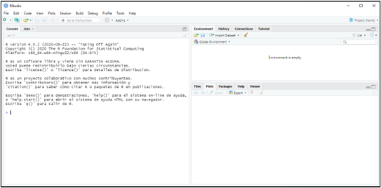
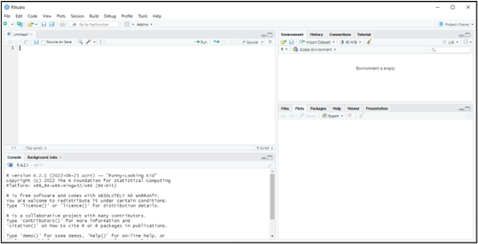

```{r matrstars-numerado-setup-cap1, include=FALSE}
options(matrstars.suppress_caption = TRUE)
```

# Introducción.

{width="100%"}

::: {style="text-align: center;"}
**Figura 1.1.** [La distribución Normal...]{.smallcaps}
:::


## {.hicon} De los datos a la información: la analítica de datos.

Vivimos rodeados de datos. Las administraciones públicas los recopilan para diseñar políticas; las empresas los generan en cada transacción; los mercados financieros los emiten segundo a segundo. Pero los datos, por sí solos, no son más que registros en bruto: cifras de ventas, cotizaciones, respuestas a una encuesta, indicadores macroeconómicos. Su verdadero valor aparece cuando somos capaces de transformarlos en **información** que sirva de base para la **toma de decisiones**.

Esta necesidad de convertir datos en conocimiento útil recorre prácticamente todas las facetas de la actividad humana, y de manera muy especial la **Economía**, entendida como la ciencia que se ocupa de la asignación y administración de recursos limitados. Un gestor público quiere saber si una política de empleo está funcionando; una empresa aspira a anticipar la demanda; un investigador busca contrastar si una teoría sobre el comportamiento de los mercados se sostiene frente a la evidencia empírica. En todos estos casos el punto de partida son datos, y el objetivo, extraer de ellos información fiable.

### {.hicon} La Estadística como ciencia instrumental.

La ciencia que se ocupa de este tránsito del dato a la información es la **Estadística**. Su singularidad reside en que no posee un objeto de estudio sustantivo propio, como lo tiene la Física o la Biología: la Estadística es una **ciencia instrumental** que dota al resto de disciplinas de herramientas para recopilar datos de forma sistemática, organizarlos y extraer de ellos información relevante. Por eso es transversal a todas las ciencias —naturales, sociales, jurídicas— y a todos los campos del saber. Como señalan @Mood&Graybill1963:

> *"La Estadística es la tecnología del método científico."*

Dentro de la Estadística podemos distinguir dos grandes vertientes:

-   La **recopilación y organización** de datos en un sistema estructurado de consulta. Es la vertiente que asociamos a la producción de estadísticas oficiales, censos, encuestas, registros administrativos o bases de datos corporativas.

-   La **explotación y análisis** de esos datos: su transformación en información relevante mediante la aplicación de técnicas que permiten describir, resumir, detectar patrones, contrastar hipótesis y construir modelos.

### {.hicon} Analítica de datos económicos.

Esta segunda vertiente —la explotación de los datos y su conversión en información— es lo que hoy se conoce como **analítica de datos** (*data analytics*). La analítica de datos abarca desde la estadística descriptiva más elemental hasta las técnicas de aprendizaje automático (*machine learning*), pasando por la modelización econométrica, el análisis multivariante o los modelos de elección discreta, entre otras.

Este libro se sitúa precisamente en ese terreno: la **analítica de datos económicos**. Es decir, la aplicación de técnicas estadísticas y de análisis de datos a problemas de naturaleza económica y empresarial, con el objetivo de generar conocimiento que reduzca la incertidumbre inherente a los fenómenos económicos y contribuya a una mejor toma de decisiones.

### {.hicon} La infraestructura: el software de análisis.

Para llevar a cabo esta analítica se necesita una infraestructura básica. Además de los propios datos y de los conocimientos metodológicos, resulta imprescindible contar con un **software** adecuado que permita procesar el flujo de datos, aplicar las técnicas de análisis pertinentes y presentar los resultados de forma clara.

En los últimos tiempos, la evolución del hardware no ha tenido precedentes, y ello ha dado soporte al desarrollo de un software potente dedicado al análisis de datos. Ese software se concreta en aplicaciones y plataformas diversas —SPSS®, Stata®, SAS®...— y también en lenguajes de programación orientados al análisis estadístico y matemático, como Python, Matlab®, Julia o... R.

En nuestro caso, la herramienta elegida es **R**.

## {.hicon} ¿Qué es R y cómo nos ayuda a analizar datos?

R no es una aplicación al uso, sino todo un **lenguaje de programación** orientado principalmente a la analítica de datos, sobre todo desde una perspectiva estadística. Se trata de un proyecto de GNU, de modo que los usuarios son libres de modificarlo y extenderlo. Se distribuye como software libre bajo licencia GNU y es multiplataforma, rasgos que han facilitado su difusión y el surgimiento de una comunidad muy activa de usuarios y desarrolladores.

R nos ofrece un ecosistema idóneo para cubrir todas las etapas de un proyecto de analítica de datos: desde la importación y depuración de los datos, pasando por su exploración gráfica y descriptiva, hasta la estimación de modelos y la presentación de resultados. A lo largo de este libro, R será nuestra herramienta de trabajo en cada una de estas etapas.

## {.hicon} Instalación de R y RStudio.

Como ya se ha mencionado, R es un lenguaje de uso y difusión gratuitos, amparado por la licencia GNU. Instalarlo resulta sencillo: basta con acudir a la web de [CRAN](https://cran.r-project.org/) (*Comprehensive R Archive Network*), descargar la última versión disponible para nuestro sistema operativo (en este manual, Microsoft® Windows®) y ejecutar el archivo descargado, que completará la instalación.

R arrastra, eso sí, una limitación: el IDE (entorno de desarrollo integrado) que incorpora, es decir, el programa a través del cual interactuamos con el lenguaje, resulta muy poco amigable. Para salvar este inconveniente existen IDE alternativos, entre los que destaca RStudio, desarrollado por Posit® Software. También es gratuito, así que de nuevo bastará con visitar la web de [RStudio](https://posit.co/download/rstudio-desktop/) y descargar e instalar la versión libre de coste.

## {.hicon} R y RStudio. Comienzo: Proyectos.

Con R y su IDE RStudio ya instalados, podemos ponernos manos a la obra. Abriremos RStudio pulsando en el icono correspondiente y aparecerá la siguiente ventana:

{.d-block .mx-auto width="100%"}

::: {style="text-align: center;"}
**Figura 1.2.** [IDE de RStudio.]{.smallcaps}
:::


La parte izquierda de la ventana es la **consola**: la sección de RStudio desde la que manejamos R introduciendo código directamente. Escribamos, por ejemplo, `2+2` después del cursor (signo "\>") y pulsemos `Enter`. La propia consola nos devolverá el valor 4:

```{r,eval=TRUE, echo=TRUE}
2+2
```

Con todo, la forma más eficiente de trabajar es mediante **proyectos** y **scripts**.

Un **proyecto** se asocia, en esencia, a la carpeta en la que R trabajará: allí buscará los datos que le sirven de *input* y allí depositará, llegado el caso, los resultados u *output*. Dicho de otro modo, es una carpeta más de nuestro sistema de directorios, pero dotada de una característica especial: la de ser un proyecto de R. Al abrirlo desde RStudio le estamos indicando al programa que busque de forma preferente en esa carpeta todos los archivos que necesite y que guarde en ella lo que vaya generando.

Para crear un proyecto nuevo seguiremos la ruta `File → New Project`. El programa nos preguntará entonces si deseamos crearlo en una carpeta nueva o en una ya existente. Situémoslo, por ejemplo, en el disco extraíble D, carpeta R, subcarpeta "explora", que ya tenemos preparada. Aparecerá una ventana para localizar la carpeta y, una vez encontrada, pulsaremos `Open` y `Create Project`. El proyecto ya está creado.

Si ahora abrimos el explorador de Windows® y buscamos la carpeta "explora", veremos en ella un archivo del mismo nombre, identificado con el icono de un cubo con una "R". Ese archivo actúa como un faro: le indica a R que, mientras trabajemos en el proyecto "explora", encontrará en esa carpeta todos los datos que necesite y que en ella deberá depositar los ficheros de salida que produzca. Y sí, el proyecto se llama igual que la carpeta, porque adopta su nombre.

En sesiones posteriores, para retomar el mismo proyecto ya no recurriremos a `File → New Project`, sino a `File → Open Project`.

## {.hicon} Scripts.

Los **scripts**, por su parte, son programas o rutinas en los que varias instrucciones se ejecutan de forma secuencial. Para crear uno seguiremos la ruta `File → New File → R Script`. ¿Y dónde se guardará? En la carpeta "explora", la del proyecto en el que estamos trabajando.

Desde el punto de vista informático, un script no es más que un archivo de texto plano, modificable con cualquier editor. Afortunadamente, para no tener que entrar y salir de RStudio continuamente, el propio IDE incorpora un **editor** de scripts, lo que resulta muy cómodo.

Observaremos que en la parte izquierda de RStudio ha surgido una ventana nueva, situada arriba, que desplaza la consola hacia abajo. Es la ventana del **editor**:

{.d-block .mx-auto width="100%"}

::: {style="text-align: center;"}
**Figura 1.3.** [El editor de Scripts de RStudio.]{.smallcaps}
:::


Al igual que ocurre con los proyectos, desde RStudio podemos crear un script nuevo o abrir uno ya existente para modificarlo, ejecutarlo y volver a guardarlo.

Empecemos a escribir nuestro script. Cuando queramos introducir un comentario que no ejecute instrucción alguna, lo precederemos del símbolo almohadilla o *hashtag* "\#". A continuación pediremos a R que realice la suma 2+2. Escribimos, por tanto, en el editor:

```{r, eval=FALSE, echo=TRUE}
#Ejemplo de Script
2+2  #este script hace una simple suma.
```

El script se ejecutará si pulsamos `Control + Mayúsculas + ENTER` o si acudimos al desplegable `Source → Source with Echo`. Para ejecutar únicamente la línea en la que se encuentra el cursor bastará con `Control + ENTER` o con el botón `Run`; y si queremos ejecutar varias líneas, las seleccionaremos previamente y emplearemos esas mismas opciones. En la consola aparecerá:

```{r, eval=TRUE, echo=FALSE}
#Ejemplo de Script
2+2  #este script hace una simple suma.
```

Guardaremos el script con `File → Save As…`; y, de nuevo, el destino predeterminado será la carpeta "explora", la de nuestro proyecto. Llamémoslo, por ejemplo, "explorando". Una vez que el script tiene nombre, podremos ir guardando los avances con solo pulsar el botón del "disquete" del editor. Si acudimos a la carpeta del proyecto desde el explorador de Windows®, encontraremos un archivo de texto llamado "explorando" con extensión ".R" (explorando.R). Podremos ejecutarlo cuantas veces queramos sin necesidad de teclear nada, o reescribirlo si no funciona como esperábamos o si necesitamos introducir cambios. Ahí reside, precisamente, la ventaja de trabajar con scripts.

Para recuperar un script en una nueva sesión de trabajo basta con seguir la ruta `File → Open File…` y seleccionarlo.

## {.hicon} Funciones.

R trabaja fundamentalmente con datos y funciones. Pero ¿qué es exactamente una **función**?

Una función es un conjunto o **sistema de instrucciones** que convierte unos datos de entrada o **inputs** en unos datos de salida o **outputs**. Puede ser muy sencilla o realmente compleja. Y no todas vienen integradas en paquetes: el propio usuario puede crear las suyas —escribiéndolas, por ejemplo, en un script— y ejecutarlas.

Las partes básicas de una función son:

-   **Entradas, *inputs* o argumentos:** son las informaciones necesarias para llevar a cabo el procedimiento. Los argumentos puede introducirlos el usuario o venir dados por defecto, lo que significa que, si no les asignamos ningún valor, tomarán automáticamente uno preestablecido.

-   **Cuerpo:** lo forma el conjunto de instrucciones que transforman las entradas en salidas. Cuando comprende varias instrucciones, estas deben escribirse entre llaves `{ }`.

-   **Salidas:** son los resultados u *outputs* de la función. Cuando una función devuelve objetos de distinta naturaleza, estos suelen empaquetarse en una estructura de almacenamiento de tipo *lista*.

A modo de ejemplo, incorporemos a nuestro script una función llamada "suma". Recibirá dos entradas o argumentos —dos números cualesquiera— y devolverá como resultado la suma de ambos. El código es:

```{r, eval=TRUE, echo=TRUE}
suma <- function(x, y) {
  resultado <- x + y
  return(resultado)
}
```

Una vez ejecutado el código anterior, para sumar los números 12 y 16 solo tendremos que teclear en la consola —o escribir en el script y ejecutar— la línea:

```{r, eval=TRUE, echo=TRUE}
suma(x=12, y=16)
```

## {.hicon} Paquetes (*packages*).

En torno a R se ha desarrollado una cantidad casi inimaginable de recursos: funciones, bases de datos, utilidades... Son tantos que no resultaría operativo abrir el programa (directamente o a través de un IDE como RStudio) y encontrarlos todos activos y listos para su uso. Además, ello obligaría a actualizar R de forma casi constante.

De ahí que los recursos disponibles se organicen en **paquetes** (*packages*, en inglés). Un paquete es una colección de funciones o un conjunto de datos desarrollados por la comunidad de R, que multiplican el potencial del lenguaje ampliando sus capacidades básicas o incorporando otras nuevas.

De hecho, al abrir R se activan algunos de estos paquetes, instalados junto al propio lenguaje. Solo algunos, eso sí: es el caso de `{base}` o de `{stats}` [@R-base].

La mayor parte de los paquetes disponibles no forma parte de la instalación básica de R, sino que reside en diversos servidores denominados repositorios. El más importante es [CRAN](https://cran.r-project.org/), el repositorio oficial, que alberga más de 20.000 paquetes, si bien existen otros, entre los que destaca GitHub.

Un modo sencillo de **instalar** en nuestra máquina un paquete alojado en CRAN consiste en acudir, dentro de RStudio, a la ventana inferior derecha, pulsar sobre la pestaña "Packages" y, después, sobre el botón "Install". Emergerá una ventana con un campo para escribir el nombre del paquete; al empezar a teclearlo, el propio RStudio nos irá sugiriendo los que están disponibles. Esta operación equivale a emplear la instrucción `install.packages()` —bien directamente en la consola, bien como una línea más de un script— con el nombre del paquete entrecomillado; si son varios, los separaremos con comas.

Una vez instalado el paquete, no habrá que repetir la operación cada vez que queramos utilizarlo: bastará con **activarlo**. En efecto, todos los paquetes que no vienen de serie en la instalación de R deben activarse antes de poder usar sus funcionalidades o sus datos. Para ello recurriremos a la instrucción `library()`, con el nombre del paquete dentro del paréntesis.

Del nombre de esta instrucción nace una confusión frecuente: la de tomar como sinónimos los términos "paquete" y "librería" en el entorno de R. Cuando nos referimos a estas colecciones de funcionalidades o datos, lo correcto es hablar de paquetes, pues el término "librería" alude más bien a la organización informática interna de un software.

## {.hicon} Help! (sistema de ayuda).

Es habitual albergar dudas sobre el uso correcto de las funcionalidades y herramientas que nos proporciona un paquete. Por fortuna, disponemos de varias fuentes de ayuda a las que acudir en busca de respuesta.

Para obtener información general sobre un paquete podemos utilizar la función `help()` con el argumento `package =`. Por ejemplo:

```{r, eval=TRUE, echo=TRUE}
help(package="base")
```

La información aparecerá en la ventana inferior derecha de RStudio. De hecho, esa misma ventana cuenta con una pestaña **"Help"** que nos permite consultar la ayuda sin necesidad de teclear código.

Cada función puede consultarse además de forma individual mediante `help("nombre de la función")` o, si el paquete todavía no se ha cargado, `help(function, package = "package")`. Estas instrucciones nos mostrarán la descripción de la función y de sus argumentos, acompañada de ejemplos de uso. Por ejemplo:

```{r, eval=FALSE, echo=TRUE}
help("rm", package="base")
```

La instrucción anterior nos muestra la documentación de la función `rm()`, del paquete `{base}` de R. Conviene señalar que este paquete se activa por defecto al abrir R o RStudio, de manera que el segundo argumento —el que indica el paquete que contiene la función— resulta innecesario.

Otra vía consiste en explorar las **viñetas** (*vignettes*): documentos que detallan con mayor profundidad las funcionalidades de un paquete y que se incluyen en su documentación. Podemos obtener la lista de las viñetas de todos nuestros paquetes instalados con la función `browseVignettes()`. Y si solo nos interesan las de un paquete concreto, le pasaremos su nombre como argumento: `browseVignettes(package = "packagename")`. En ambos casos se abrirá una ventana del navegador que nos permitirá explorar cómodamente el documento.

Si preferimos no abandonar la consola, la instrucción `vignette()` nos mostrará una lista de viñetas y `vignette(package = "packagename")`, las incluidas en un paquete determinado. Una vez identificada la que nos interesa, la consultaremos con `vignette("vignettename")`.

## {.hicon} ¿Y ahora?

Ya tenemos R instalado y sabemos crear proyectos, escribir scripts, definir funciones, instalar y activar paquetes y consultar la ayuda. Con esta infraestructura estamos listos para empezar a trabajar con datos: en el siguiente capítulo aprenderemos a importarlos desde fuentes externas y a manejar las estructuras que R emplea para almacenarlos y manipularlos.

## {.hicon} El universo R-Stars.

Los ejemplos empíricos desarrollados a lo largo de los distintos capítulos de este libro se apoyan en un escenario ficticio: el **universo R-Stars**, ambientado en un hipotético sector de transporte interestelar de mercancías en el año 2150. Este universo proporciona una base de datos con 300 empresas caracterizadas por variables económico-financieras y operativas, lo que permite aplicar cada técnica analítica del libro a datos con una estructura realista, pero sin las restricciones de confidencialidad asociadas a datos reales.

La descripción completa del universo R-Stars —la historia del sector, las cifras globales, las empresas más relevantes, el análisis DAFO y la ficha detallada de todas las variables de la base de datos— puede consultarse en el **Apéndice: El universo R-Stars** al final del libro.
