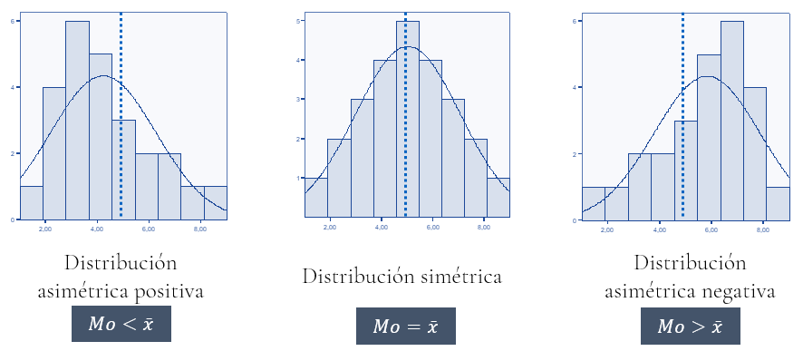
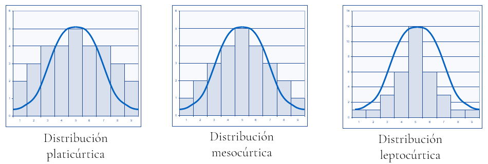

```{r matrstars-numerado-setup-cap4, include=FALSE}
options(matrstars.suppress_caption = TRUE)
```

# Estadística descriptiva.

{width="100%"}

::: {style="text-align: center;"}
**Figura 4.1.** [Pilotos de Shuttlepod Movers.]{.smallcaps}
:::


La Estadística Descriptiva es la parte de la Ciencia Estadística que se ocupa de recopilar datos, depurarlos y caracterizar con ellos un conjunto de casos o individuos.

Los datos se organizan en variables y/o atributos.

Las **variables** son características de los casos o individuos en estudio que se plasman en valores que están expresados en **escala métrica**. Los **atributos** son características de los casos o individuos en estudio que se concretan en diversas categorías (si el atributo tiene **escala nominal**) o niveles (si el atributo tiene **escala ordinal**). Los atributos se denominan también variables categóricas, cualitativas o factores.

Centrémonos en las variables. Podemos estudiar una sola de ellas, dejando de lado las demás características que describen a ese mismo grupo de casos: hablaremos entonces de un **análisis estadístico univariante**. Si el interés se desplaza hacia el modo en que dos variables caracterizan conjuntamente al grupo, y hacia la posible relación entre ambas, estaremos ante un **análisis bivariante**. Y si son varias las variables que examinamos de forma simultánea, el análisis pasa a ser **multivariante**.

## {.hicon} Análisis univariante.

En el análisis estadístico univariante estudiamos cómo una única característica —nos centraremos en una variable, aunque bien podría tratarse de un atributo— describe a un grupo de casos, individuos o elementos. Pensemos, por ejemplo, en el salario percibido por los trabajadores en nómina de una empresa. O en la rentabilidad económica obtenida por un conjunto de compañías de un mismo sector.

El conjunto de pares formado por cada valor que puede tomar la variable en estudio (o categoría o nivel, en el caso de un atributo) y el número de casos que toman tal valor se denomina **distribución de frecuencias** de la variable.

¿Y cómo estudiamos la forma en que una variable describe globalmente a un grupo de casos? Mediante el cálculo de una serie de **medidas**: instrumentos matemáticos que extraen y sintetizan la información contenida en una distribución de frecuencias.

Hay diferentes tipos de medidas, principalmente las de **posición**, **dispersión** y **forma**.

Antes de profundizar en esas medidas, en su significado y en su obtención, veremos cómo presentar en R, mediante tablas, tanto los datos de un grupo de individuos y las variables o atributos que los caracterizan como sus distribuciones de frecuencias univariantes.

Nos serviremos, a modo de ilustración, de los salarios abonados por una de las empresas de transporte interestelar de mercancías del proyecto *R-Stars*.

## {.hicon} *Shuttlepod Movers*: ¿una estructura salarial demasiado plana?

*Shuttlepod Movers* es una empresa de transporte interestelar de mercancías fundada en el planeta **Arrakis**, en la **Gran Nube de Magallanes**. Constituida como Sociedad Anónima Galáctica (SAG), atiende rutas medianas y largas con una flota de 47 cargueros espaciales y una plantilla de 49 trabajadores. Su actual CEO es *Tasha Tachybaptus*.

{.d-block .mx-auto width="500"}

::: {style="text-align: center;"}
**Figura 4.2.** [Nuevo carguero TranStar v.6.]{.smallcaps}
:::


La siguiente tabla resume los principales indicadores de la compañía:

```{r, eval=TRUE, echo=FALSE, message=FALSE}
library(knitr)
library(kableExtra)

ficha <- data.frame(
  Indicador = c("Activos", "Flota", "Edad media flota", "Rutas operadas",
                "Ingresos", "Beneficio neto", "Margen operativo",
                "Rentabilidad económica", "Liquidez", "Plantilla"),
  Valor = c("249,4 mil PAVOs", "47 cargueros", "Madura", "594",
            "241,7 mil PAVOs", "180,8 mil PAVOs", "74,8%",
            "72,5%", "0,56", "49 trabajadores")
)

ficha %>%
  kable(
        col.names = c("Indicador", "Valor")) %>%
  kable_styling(full_width = F,
                bootstrap_options = c("striped", "bordered", "condensed"),
                position = "center",
                font_size = 11) %>%
  row_spec(0, bold = T, align = "c") %>%
  row_spec(1:nrow(ficha), bold = F, align = "c")
```

::: {style="text-align: center;"}
**Tabla 4.1.** Ficha resumen de Shuttlepod Movers
:::


A pesar de presentar márgenes y rentabilidades muy elevados, la empresa tiene una **liquidez reducida** (0,56), lo que supone un riesgo a corto plazo. Pero lo que más preocupa a Tasha Tachybaptus es otra cosa: sospecha que la **estructura salarial de la empresa es demasiado plana**. Prácticamente todos los empleados perciben salarios similares, sin una diferenciación clara entre niveles de cualificación. Esto podría estar dificultando la atracción y retención de perfiles altamente cualificados, que son imprescindibles en un sector tecnológicamente exigente como el transporte interestelar.

**Tasha nos pide un análisis descriptivo de la variable SALARIO** que responda a estas preguntas: ¿cuál es el nivel salarial típico de la plantilla? ¿Cuán dispersos están los salarios? ¿La distribución salarial es simétrica o está sesgada hacia algún extremo? En definitiva: ¿es cierto que la estructura salarial de *Shuttlepod Movers* es excesivamente homogénea?

Respondamos a estas preguntas con las herramientas de la estadística descriptiva.

## {.hicon} Representando datos y distribuciones de frecuencias en tablas con R.

Para aprender a representar tanto los datos de las variables y atributos que caracterizan a un grupo de casos como sus distribuciones de frecuencias univariantes, supongamos que trabajamos dentro del proyecto "explora" que creamos anteriormente. En su carpeta guardaremos el *script* "describe_rstars.R" y el archivo de Microsoft® Excel® "trabajadores.xlsx", cuyos enlaces de descarga figuran en la sección final del capítulo.

El archivo recoge, en su hoja "Datos", información sobre la plantilla de *Shuttlepod Movers*: el salario percibido (variable **SALARIO**, expresada en cientos de PAVOs), el nivel de estudios (atributo **NESTUDIOS**) y el departamento al que pertenece cada trabajador (atributo **DEP**).

Las primeras líneas del script se ocupan de tres tareas que ya nos resultan familiares: limpiar la memoria o *Global Environment* de los objetos creados con anterioridad, cargar los paquetes necesarios e importar los datos:

```{r, eval=TRUE, echo=TRUE, message=FALSE}
# Script para la construcción de tablas de datos 
# y trabajo con distribuciones de frecuencias univariantes.

# Limpiando el Global Environment
rm(list = ls())

# Cargando paquetes
library(readxl)
library(gtExtras)
library(knitr)
library(kableExtra)
library(dplyr)
library(DescTools)
library(moments)
library(ggplot2)

## DATOS

# Importando datos desde Excel
datos <- read_excel("trabajadores.xlsx",
                    sheet = "Datos",
                    na = c("n.d."))
datos <- data.frame(datos, row.names = 1)

# visualizando el data frame de modo elegante con {gtExtras}
datos_df_graph <- gt_plt_summary(datos)
datos_df_graph
```

::: {style="text-align: center;"}
**Tabla 4.2**
:::


Los datos han quedado almacenados en el *data frame* "datos", cuyas variables hemos listado con la función `gt_plt_summary()` del paquete `{gtExtras}`. Sabemos que basta con escribir el nombre del *data frame* para que su contenido aparezca en la consola, pero el resultado dista de ser elegante. Mostrémoslo de un modo más amigable mediante la **confección de una "tabla"**.

Uno de los paquetes más populares de R para construir tablas de datos es `{knitr}`, que incorpora la función `kable()`. Con ella podemos generar tablas en varios formatos y ajustar diversas características, como su título. Y si deseamos afinar todavía más su apariencia, dispondremos de `{kableExtra}`, un paquete que amplía las posibilidades de `kable()`.

Para llevar nuestros casos y variables a una tabla —esto es, para mostrar el *data frame* "datos" de un modo más vistoso— activaremos ambos paquetes, si no lo hemos hecho ya, y construiremos la tabla a partir de su contenido. El código es el siguiente:

```{r, eval=FALSE, echo=TRUE, message=FALSE}
# Tabla de datos
datos %>%
  kable(caption = "Trabajadores de Shuttlepod Movers",
        col.names = c("Trabajador", "Salario", "Nivel de estudios",
                      "Departamento")) %>%
  kable_styling(full_width = F,
                bootstrap_options = c("striped", "bordered", "condensed"),
                position = "center",
                font_size = 11) %>%
  row_spec(0, bold= T, align = "c") %>%
  row_spec(1:(nrow(datos)), bold= F, align = "c")
```

Invocamos en primer lugar el *data frame* de partida, "datos". Después, el operador *pipe* `%>%` encadena ese contenido con el diseño de la tabla, que corre a cargo de la función `kable()` de `{knitr}`. Entre los argumentos de `kable()` destacan dos:

-   **`caption =`**: fija el título de la tabla.

-   **`col.names =`**: opcional, asigna un nombre a cada columna de la tabla cuando no queremos que se muestren los que traen por defecto, es decir, los del propio *data frame*.

A continuación, un nuevo *pipe* `%>%` anuncia que vamos a completar el diseño con funciones complementarias de `{kableExtra}`. La primera es `kable_styling()`, que dota a la tabla de características adicionales a través de sus argumentos:

-   **`full_width =`**: admite un valor lógico e indica si deseamos que la tabla ocupe todo el ancho del documento (TRUE) o solo el necesario (FALSE).

-   **`bootstrap_options =`**: de tipo alfanumérico, fija ciertos rasgos estéticos complementarios. Con "striped" las filas aparecen sombreadas de forma alterna; con "bordered", cada una queda delimitada por finas líneas superior e inferior; y con "condensed", la tabla adopta un aspecto más compacto.

-   **`position =`**: sitúa la tabla centrada, a la izquierda del párrafo o a la derecha.

-   **`font_size =`**: argumento numérico que regula el tamaño de los caracteres, aspecto nada menor cuando se trata de que la tabla "quepa" en un documento de anchura determinada.

Cerramos con `row_spec()`, también de `{kableExtra}`, que permite personalizar las filas que nos interesen. Conviene saber que el encabezado se identifica como la fila "0". En el ejemplo la empleamos dos veces: una para ese encabezado y otra para el resto de filas, desde la primera hasta la que contiene el último caso, la de posición `nrow(datos)`. El primer argumento señala, pues, las filas afectadas; los demás determinan si los caracteres aparecerán en negrita (`bold =`) y cómo se alinearán los elementos dentro de las columnas (`align =`).

El resultado es:

```{r, eval=TRUE, echo=FALSE, message=FALSE}
datos %>%
  kable(
        col.names = c("Trabajador", "Salario", "Nivel de estudios",
                      "Departamento")) %>%
  kable_styling(full_width = F,
                bootstrap_options = c("striped", "bordered", "condensed"),
                position = "center",
                font_size = 11) %>%
  row_spec(0, bold= T, align = "c") %>%
  row_spec(1:(nrow(datos)), bold= F, align = "c")
```

::: {style="text-align: center;"}
**Tabla 4.3.** Trabajadores de Shuttlepod Movers
:::


En ocasiones solo nos interesa estudiar una variable, es decir, una columna del *data frame*. Puede suceder, además, que los casos sean muy numerosos y que varios de ellos compartan el mismo valor en esa variable. Cuando así ocurre, resulta más práctico llevar a la tabla, en lugar de todos los datos, la **distribución de frecuencias** de la variable o atributo que nos ocupa. Es lo que haremos a continuación, tomando SALARIO como objeto de análisis.

Lo primero que debemos tener presente es que, en una distribución de frecuencias, **los valores de la variable se disponen de menor a mayor**. Ordenaremos, por tanto, las filas del *data frame* "datos" según el salario de cada caso; y, cuando dos trabajadores compartan salario, deshará el empate el orden alfabético de su nombre, que es el de la fila del *data frame*. Para esta reordenación recurriremos a la función `arrange()` del paquete `{dplyr}`, que ya conocemos:

```{r, eval=TRUE, echo=TRUE, message=FALSE}
# Distribución de frecuencias del salario de los trabajadores de la empresa.

# Colocar los datos
datos <- datos %>% arrange(SALARIO, row.names(datos))
```

Con los casos ya ordenados de menor a mayor salario, contaremos cuántos de ellos comparten cada valor de la variable, esto es, su frecuencia absoluta. Crearemos para ello un objeto llamado "conteo", de clase `table`, mediante la función `table()`, que contabiliza las veces que aparece cada valor:

```{r, eval=TRUE, echo=TRUE, message=FALSE}
# Contar frecuencias
conteo <- table(datos$SALARIO)
conteo
```

Al mostrar "conteo" en la consola comprobamos que consta de dos filas: la primera recoge los valores que adopta SALARIO en los distintos casos y la segunda, cuántos casos presentan cada valor, es decir, la **frecuencia absoluta**. El objeto "conteo" es, en suma, la distribución de frecuencias de la variable SALARIO.

Convirtamos ahora ese objeto en un *data frame* llamado "conteo_df", que nos permitirá representar la distribución con más elegancia. Para ello ejecutaremos:

```{r, eval=TRUE, echo=TRUE, message=FALSE}
# Convertir el resultado a un data frame para una mejor visualización
conteo_df <- as.data.frame(conteo)
conteo_df
```

El *data frame* "conteo_df" consta de dos columnas: Var1, con los valores que toma SALARIO en el grupo de casos, y Freq, con las frecuencias absolutas de cada uno de ellos. Renombrémoslas para que su contenido resulte más transparente:

```{r, eval=TRUE, echo=TRUE, message=FALSE}
# Renombrar las columnas para mayor claridad
colnames(conteo_df) <- c("Valor", "Frecuencia")
```

Calculemos a continuación el resto de frecuencias que habitualmente acompañan a una variable. La **frecuencia total**, N, suma de todas las frecuencias absolutas y, por tanto, número total de casos, se obtiene sin dificultad:

```{r, eval=TRUE, echo=TRUE, message=FALSE}
# Calcular y guardar la frecuencia total
N <- sum(conteo_df$Frecuencia)
```

La serie de frecuencias absolutas acumuladas se calculará del siguiente modo:

```{r, eval=TRUE, echo=TRUE, message=FALSE}
# Calcular frecuencias absolutas acumuladas
conteo_df$Frecuencia_acum <- cumsum(conteo_df$Frecuencia)
```

Como sabemos, la última frecuencia absoluta acumulada ha de coincidir con la frecuencia total. Nos restan las frecuencias relativas, cociente entre cada frecuencia absoluta y la frecuencia total, que expresan la proporción de casos que corresponde a cada valor de la variable:

```{r, eval=TRUE, echo=TRUE, message=FALSE}
# Calcular frecuencias relativas
conteo_df$Frecuencia_R <- conteo_df$Frecuencia / N

# Calcular frecuencias relativas acumuladas
conteo_df$Frecuencia_R_acum <- cumsum(conteo_df$Frecuencia_R)
```

La suma de las frecuencias relativas es siempre 1, esto es, el 100% de los casos; y, por la misma razón, la última frecuencia relativa acumulada vale también 1.

Construyamos ya la tabla que recogerá la distribución de frecuencias de SALARIO con todos sus tipos de frecuencias. Bastará con aplicar al *data frame* "conteo_df" la función `kable()` de `{knitr}` y las funciones auxiliares de `{kableExtra}`:

```{r, eval=FALSE, echo=TRUE, message=FALSE}
conteo_df %>%
  kable(caption = "Distribución de frecuencias de salarios. Shuttlepod Movers",
        col.names = c("x(i) = Salario", "Frecuencia absoluta n(i)",
                      "Frecuencia absoluta acum. N(i)", "Frecuencia relativa f(i)",
                      "Frecuencia relativa acum. F(i)"),
        digits  = c(0, 0, 0, 2, 2),
        format.args = list(decimal.mark = ".", scientific = FALSE)) %>%
  kable_styling(full_width = F,
                bootstrap_options = c("striped", "bordered", "condensed"),
                position = "center",
                font_size = 11) %>%
  row_spec(0, bold= T, align = "c") %>%
  row_spec(1:(nrow(conteo_df)), bold= F, align = "c")
```

```{r, eval=TRUE, echo=FALSE, message=FALSE}
conteo_df %>%
  kable(
        col.names = c("x(i) = Salario", "Frecuencia absoluta n(i)",
                      "Frecuencia absoluta acum. N(i)", "Frecuencia relativa f(i)",
                      "Frecuencia relativa acum. F(i)"),
        digits  = c(0, 0, 0, 2, 2),
        format.args = list(decimal.mark = ".", scientific = FALSE)) %>%
  kable_styling(full_width = F,
                bootstrap_options = c("striped", "bordered", "condensed"),
                position = "center",
                font_size = 11) %>%
  row_spec(0, bold= T, align = "c") %>%
  row_spec(1:(nrow(conteo_df)), bold= F, align = "c")
```

::: {style="text-align: center;"}
**Tabla 4.4.** Distribución de frecuencias de salarios. Shuttlepod Movers
:::


Conviene advertir que en `kable()` han aparecido dos argumentos nuevos:

-   **`digits =`**: vector que establece, columna a columna, cuántos decimales se mostrarán en la tabla. A las columnas de datos categóricos se les asigna el valor NA.

-   **`format.args =`**: lista que gobierna aspectos de formato, como el uso del punto o la coma para los decimales, o el recurso a la notación científica en cifras muy grandes.

Una primera mirada a la distribución ya apunta en la dirección que sospecha la CEO: la mayor parte de los trabajadores percibe entre 12 y 20 cientos de PAVOs, lo que supone cerca del 70% de la plantilla, mientras que los salarios bajos (8–10) y los más altos (25–30) resultan minoritarios. Todo indica, en efecto, una distribución **concentrada en los niveles intermedios**. Para confirmar esta impresión con rigor necesitaremos, sin embargo, las medidas de dispersión y de forma.

En ocasiones, la variable analizada toma un número enorme de valores distintos. Puede deberse a que los casos sean muy numerosos o a que la variable, de naturaleza continua, admita una gran variedad de valores, incluso infinitos. Para que la distribución quepa entonces en una tabla de dimensiones razonables, la solución pasa por **agrupar los valores en intervalos**. Hagámoslo con SALARIO.

La primera tarea consiste en formar los intervalos, para lo que disponemos de la función `cut()`. Esta nos permite decidir en cuántos tramos de idéntica amplitud queremos dividir el recorrido que va del salario menor al mayor. Guardaremos ese número en una constante, ***k***; y si preferimos no fijarlo nosotros, sino confiarlo a un criterio objetivo como la regla de *Sturges*, bastará con ligar *k* a dicho método:

```{r, eval=TRUE, echo=TRUE, message=FALSE}

# Distribución de frecuencias agrupadas en intervalos
# del salario de los trabajadores de la empresa.

# Crear los intervalos (método de Sturges)
k <- nclass.Sturges(datos$SALARIO)
datos$intervalos <- cut(datos$SALARIO, breaks = k, include.lowest = TRUE)
levels(datos$intervalos)
```

El código anterior añade al *data frame* "datos" una columna nueva, "intervalos", que indica para cada caso en cuál de los tramos calculados se sitúa. El argumento lógico `include.lowest =` sirve para cerrar por la izquierda el intervalo inferior, de manera que el salario más bajo quede recogido en él. Los demás intervalos permanecen abiertos por ese lado y cerrados por la derecha: cuando un caso toma exactamente el valor de una frontera, se contabiliza en el intervalo para el que esa frontera es el extremo superior.

La columna "intervalos" pertenece a la clase ***factor***, y sus "niveles" son precisamente los intervalos que ha creado `cut()`.

Las líneas que siguen reproducen el procedimiento de la distribución sin agrupar: se crea un objeto de clase `table` que cuenta cuántos casos alberga cada intervalo (las frecuencias absolutas), se transforma en un *data frame* para manejarlo con mayor comodidad y se renombran sus dos columnas:

```{r, eval=TRUE, echo=TRUE, message=FALSE}

# Contar las frecuencias de cada intervalo
conteo_intervalos <- table(datos$intervalos)

# Convertir el resultado a un data frame para una mejor visualización
conteo_intervalos_df <- as.data.frame(conteo_intervalos)

# Renombrar las columnas para mayor claridad
colnames(conteo_intervalos_df) <- c("Intervalo", "Frecuencia")
```

Obtenemos así el *data frame* "conteo_intervalos_df", con dos columnas: "Intervalo", que recoge los tramos calculados, y "Frecuencia", que indica cuántos trabajadores perciben un salario comprendido en cada uno de ellos.

Antes de diseñar con `kable()` la tabla de presentación, calcularemos algunas informaciones adicionales que suelen acompañar a las frecuencias absolutas de cada intervalo.

La primera de ellas es la ***marca de clase***, que no es otra cosa que el **punto medio** de cada intervalo. Para obtenerla reconstruiremos los puntos de corte que delimitan los tramos y promediaremos cada par de extremos consecutivos:

```{r, eval=TRUE, echo=TRUE, message=FALSE}
# Calcular la marca de clase de cada intervalo
breaks <- seq(min(datos$SALARIO), max(datos$SALARIO), length.out = k + 1)
marca_clase <- (breaks[-length(breaks)] + breaks[-1]) / 2
```

La función `seq()` genera una secuencia de *k + 1* puntos equidistantes entre el valor mínimo y el máximo de SALARIO, que hacen las veces de extremos de los *k* intervalos. A partir de ella, `breaks[-length(breaks)]` recoge los extremos inferiores y `breaks[-1]`, los superiores; el promedio de cada pareja es la marca de clase.

El código restante incorpora el vector "marca_clase" al *data frame* "conteo_intervalos_df" como una variable más, reordena las columnas con `select()`, calcula las frecuencias que faltan —absoluta acumulada, relativa y relativa acumulada— y diseña la tabla de presentación:

```{r, eval=FALSE, echo=TRUE, message=FALSE}
# Agregar la columna "marca_clase" al data frame
conteo_intervalos_df$marca_clase <- marca_clase

# Cambiar el orden de las columnas en el data frame con dplyr
conteo_intervalos_df <- conteo_intervalos_df %>%
  select(Intervalo, marca_clase, Frecuencia)

# Calcular y guardar la frecuencia total
N_agre <- sum(conteo_intervalos_df$Frecuencia)

# Calcular frecuencias absolutas acumuladas
conteo_intervalos_df$Frecuencia_acum <- cumsum(conteo_intervalos_df$Frecuencia)

# Calcular frecuencias relativas
conteo_intervalos_df$Frecuencia_R <- conteo_intervalos_df$Frecuencia / N_agre

# Calcular frecuencias relativas acumuladas
conteo_intervalos_df$Frecuencia_R_acum <- cumsum(conteo_intervalos_df$Frecuencia_R)

# Mostrar el resultado
conteo_intervalos_df %>%
  kable(caption = "Distribución de frecuencias agrupadas en intervalos de salarios. Shuttlepod Movers",
        col.names = c("Intervalo salarial",
                      "Marca de clase x(i)",
                      "Frecuencia absoluta n(i)",
                      "Frecuencia absoluta acum. N(i)",
                      "Frecuencia relativa f(i)",
                      "Frecuencia relativa acum. F(i)"),
        digits  = c(NA, 2, 0, 0, 2, 2),
        format.args = list(decimal.mark = ".", scientific = FALSE)) %>%
  kable_styling(full_width = F,
                bootstrap_options = c("striped", "bordered", "condensed"),
                position = "center",
                font_size = 11) %>%
  row_spec(0, bold= T, align = "c") %>%
  row_spec(1:(nrow(conteo_intervalos_df)), bold= F, align = "c")
```

```{r, eval=TRUE, echo=FALSE, message=FALSE}
# Agregar la columna "marca_clase" al data frame
conteo_intervalos_df$marca_clase <- marca_clase

# Cambiar el orden de las columnas en el data frame con dplyr
conteo_intervalos_df <- conteo_intervalos_df %>%
  select(Intervalo, marca_clase, Frecuencia)

# Calcular y guardar la frecuencia total
N_agre <- sum(conteo_intervalos_df$Frecuencia)

# Calcular frecuencias absolutas acumuladas
conteo_intervalos_df$Frecuencia_acum <- cumsum(conteo_intervalos_df$Frecuencia)

# Calcular frecuencias relativas
conteo_intervalos_df$Frecuencia_R <- conteo_intervalos_df$Frecuencia / N_agre

# Calcular frecuencias relativas acumuladas
conteo_intervalos_df$Frecuencia_R_acum <- cumsum(conteo_intervalos_df$Frecuencia_R)
```

```{r, eval=TRUE, echo=FALSE, message=FALSE}
# Mostrar el resultado
conteo_intervalos_df %>%
  kable(
        col.names = c("Intervalo salarial",
                      "Marca de clase x(i)",
                      "Frecuencia absoluta n(i)",
                      "Frecuencia absoluta acum. N(i)",
                      "Frecuencia relativa f(i)",
                      "Frecuencia relativa acum. F(i)"),
        digits  = c(NA, 2, 0, 0, 2, 2),
        format.args = list(decimal.mark = ".", scientific = FALSE)) %>%
  kable_styling(full_width = F,
                bootstrap_options = c("striped", "bordered", "condensed"),
                position = "center",
                font_size = 11) %>%
  row_spec(0, bold= T, align = "c") %>%
  row_spec(1:(nrow(conteo_intervalos_df)), bold= F, align = "c")
```

::: {style="text-align: center;"}
**Tabla 4.5.** Distribución de frecuencias agrupadas en intervalos de salarios. Shuttlepod Movers
:::


La distribución agrupada confirma la concentración salarial: casi tres cuartas partes de la plantilla perciben entre 8 y 20 cientos de PAVOs. Los tramos superiores están mucho menos poblados, pues solo un 10% supera los 23,7 cientos de PAVOs y el salario máximo, 30 cientos, corresponde a un único trabajador. La sospecha de Tasha va tomando forma, pero necesitamos medidas concretas para sostenerla.

## {.hicon}{.hicon} Medidas de posición.

Las medidas de posición son instrumentos matemáticos que aspiran a **caracterizar globalmente** la distribución de frecuencias de una variable mediante un único valor o unos pocos.

Cabe clasificarlas en medidas de posición central y medidas de posición no central, estas últimas representadas sobre todo por los llamados cuantiles.

Las principales **medidas de posición central** son la media, la mediana y la moda. Dentro de la media conviene distinguir, a su vez, la aritmética, la geométrica y la armónica; de las tres, nos ocuparemos aquí de la más común, la media aritmética.

La **media aritmética** de la distribución de frecuencias de una variable *X* se calcula como:

$$
\overline{x} = \frac{1}{N} \sum_{i=1}^{h} x_i n_i
$$

En la fórmula anterior, *N* representa la frecuencia total y *h*, el número de valores distintos que toma la variable.

Si todos esos valores tuvieran frecuencia 1 —lo que conocemos como distribución de frecuencias unitarias—, la media se reduciría a:

$$
\overline{x} = \frac{1}{N} \sum_{i=1}^{N} x_i
$$

En R, la función que devuelve la media de una variable es `mean()`. Así, para conocer el salario medio de la plantilla ejecutaremos:

```{r, eval=TRUE, echo=TRUE, message=FALSE}
## MEDIDAS

# Media aritmética.
media <- mean(datos$SALARIO)
media
```

El salario medio en *Shuttlepod Movers* asciende a 16,04 cientos de PAVOs, es decir, 1.604 PAVOs. Disponemos ya de un primer indicador del **nivel salarial típico** de la plantilla: si la masa salarial se repartiera por igual entre todos los trabajadores, cada uno percibiría esa cantidad.

¿Qué significado encierra esta medida? La media aritmética es el "centro de gravedad" de la distribución, su punto de equilibrio: si todos los trabajadores cobraran el salario medio, desaparecerían las diferencias salariales y, sin embargo, la "masa" salarial desembolsada por la empresa seguiría siendo exactamente la misma. En otras palabras, **la media aritmética equivale a repartir de forma igualitaria la masa total de la variable**.

Entre sus ventajas destaca que, tratándose de variables en escala métrica, siempre es calculable y siempre es única. Como inconvenientes, que pierde representatividad en presencia de casos atípicos u *outliers* y que no puede obtenerse cuando trabajamos con atributos, variables cualitativas o factores, esto es, con escalas nominales u ordinales.

La **mediana** es el valor correspondiente al caso —o los casos— que parten la distribución en dos grupos con idéntico número de elementos, una vez ordenados de menor a mayor los valores de la variable. Cuando la frecuencia total es par, los casos "frontera" son dos; y si ambos presentan valores distintos, tendríamos dos medianas. Para evitarlo, el convenio establece tomar el promedio de esos dos valores.

En R, la mediana se obtiene con la función `median()`. Para conocer el salario mediano de la plantilla ejecutaremos:

```{r, eval=TRUE, echo=TRUE, message=FALSE}
# Mediana
mediana <- median(datos$SALARIO)
mediana
```

La mediana se sitúa en 15 cientos de PAVOs: la mitad de la plantilla cobra esa cantidad o menos y la otra mitad, esa cantidad o más. Reparemos en que la mediana queda ligeramente por debajo de la media (16,04), señal de que existen algunos salarios altos que "tiran" de esta última hacia arriba.

La mediana presenta dos ventajas notables: no se deja arrastrar por los casos atípicos u *outliers* y puede calcularse también con atributos o factores medidos en escala ordinal. A cambio, no es necesariamente única y desatiende buena parte de los valores de la distribución.

La **moda**, por su parte, es el valor —o los valores— que presenta la mayor frecuencia absoluta.

En R la calculamos con la función `Mode()` del paquete `{DescTools}`, que habremos activado previamente con `library()`:

```{r, eval=TRUE, echo=TRUE, message=FALSE}
# Moda
moda <- Mode(datos$SALARIO)
moda
```

La moda es 15, un salario de 1.500 PAVOs que se repite 11 veces. Que **media, mediana y moda estén tan próximas** —16,04, 15 y 15, respectivamente— constituye ya un indicio de que la distribución está bastante centrada, lo que refuerza la percepción de Tasha sobre una estructura salarial concentrada.

La moda ofrece la ventaja de poder calcularse incluso en atributos o factores medidos en escala nominal. Su principal inconveniente es que tampoco tiene por qué ser única, pues existen distribuciones multimodales.

Existen también medidas de posición no central, entre las que sobresalen los **cuantiles**. Su naturaleza se comprende con facilidad si los vemos como una generalización de la mediana. Sabemos ya que, ordenados los casos de menor a mayor valor, la mediana parte la distribución en dos grupos de igual frecuencia. Pues bien, si en lugar de dos grupos formamos cuatro, necesitaremos tres valores para delimitarlos: son los **cuartiles** de la distribución.

Con el mismo razonamiento, repartir la distribución en 10 grupos de idéntico tamaño exige 9 valores de separación, los **deciles**; y hacerlo en 100 grupos requiere 99, los **percentiles**.

En R, los cuantiles se obtienen con la función `quantile()`. Para los cuartiles de SALARIO procederemos así:

```{r, eval=TRUE, echo=TRUE, message=FALSE}
# Calcular los cuartiles
cuartiles <- quantile(datos$SALARIO, probs = c(0.25, 0.5, 0.75))
cuartiles
```

El argumento `probs =` indica qué proporción de casos debe quedar por detrás —con valores menores o iguales— de cada una de las "fronteras". Para los cuartiles esas proporciones son `0.25`, `0.5` (valor que coincide con la mediana) y `0.75`. Obtenemos así unos cuartiles de 12, 15 y 20: el 50% central de la plantilla percibe entre 12 y 20 cientos de PAVOs, un recorrido de apenas 8 unidades. Esa diferencia entre Q3 y Q1 es el **rango intercuartílico** (IQR = 8) y confirma que la mitad de los salarios se comprime en una franja relativamente estrecha.

## {.hicon}{.hicon} Medidas de dispersión o variabilidad.

Las medidas de dispersión cuantifican **cuán cerca o cuán lejos se sitúan, por lo general, los valores de una distribución respecto de una medida de posición central**. Un valor elevado de la dispersión nos advierte de que esa medida central representa mal al conjunto, pues los casos se alejan considerablemente de ella.

La medida de posición central a la que suelen hacer referencia las medidas de dispersión es la media aritmética.

Las medidas de dispersión son numerosas y se reparten en dos grandes familias: las **absolutas**, expresadas en unidades concretas —PAVOs, o PAVOs al cuadrado, en nuestro ejemplo—, y las **relativas**, que carecen de unidades y permiten por ello comparar la dispersión de distribuciones medidas en magnitudes distintas.

La medida de dispersión absoluta más utilizada es la **varianza**, cuya fórmula es:

$$
S^2 = \frac{1}{N} \sum_{i=1}^{h} (x_i - \overline{x})^2 n_i
$$

Hemos de tener en cuenta en la fórmula anterior que *N* es la frecuencia total, y *h* es el número de valores diferentes que toma la variable.

Si las frecuencias de todos los valores de la variable son 1 (distribución de frecuencias unitarias), lógicamente la varianza pasará a ser:

$$
S^2 = \frac{1}{N} \sum_{i=1}^{N} (x_i - \overline{x})^2
$$

La varianza es, en el fondo, el promedio de las desviaciones que separan a cada valor de la variable de su media aritmética. Se elevan al cuadrado para impedir que las desviaciones positivas y las negativas se anulen entre sí.

Ese cuadrado, sin embargo, tiene un precio: la varianza queda expresada en unidades al cuadrado y puede alcanzar valores muy grandes, difíciles de interpretar. Para sortear el inconveniente recurrimos a la **desviación típica**, definida como la raíz cuadrada positiva de la varianza, que devuelve la medida a las unidades originales:

$$
S = +\sqrt{S^2}
$$

Otra medida de dispersión muy utilizada, sobre todo en *Econometría*, es la *varianza insesgada* o **cuasivarianza**, cuya fórmula es:

$$
{\overline{S}}^2 = \frac{1}{N-1} \sum_{i=1}^{h} (x_i - \overline{x})^2 n_i
$$

Como siempre, si las frecuencias de todos los valores de la variable son 1 (distribución de frecuencias unitarias), la cuasivarianza pasará a ser:

$$
{\overline{S}}^2 = \frac{1}{N-1} \sum_{i=1}^{N} (x_i - \overline{x})^2
$$

En cuanto a una medida de dispersión relativa, cabe nombrar al **coeficiente de variación de Pearson**, definido como el cociente entre la desviación típica y la media aritmética (en valor absoluto):

$$
V = \frac{S}{|\overline{x}|}
$$

El coeficiente de variación nos dice qué proporción de la media aritmética representa la desviación típica. Cuanto mayor sea, mayor será la dispersión y menor la representatividad de la media respecto del conjunto. Y al tratarse de una medida relativa, sus valores son comparables entre distribuciones expresadas en unidades distintas.

Calculemos ya en R la varianza, la desviación típica, la cuasivarianza y el coeficiente de variación. Conviene tener presente un detalle: la función `var()` de R devuelve en realidad la cuasivarianza, de modo que para obtener la varianza habremos de aplicarle una corrección. Cuando los casos son muy numerosos, no obstante, ambas medidas prácticamente coinciden:

```{r, eval=TRUE, echo=TRUE, message=FALSE}
# Varianza
varianza <- var(datos$SALARIO)*(N-1)/N # recordar que la frecuencia total N ya fue calculada
varianza

# Desviación típica
desv <- varianza ^ (1/2)
desv

# Cuasivarianza
cuasivarianza <- var(datos$SALARIO)
cuasivarianza

# Coeficiente de variación
cvariacion <- desv / abs(media)
cvariacion
```

El coeficiente de variación asciende a 0,344: la desviación típica supone un 34,4% de la media salarial. Se trata de un valor moderado, pues la dispersión existe, pero no es elevada. **La sospecha de Tasha se confirma solo en parte**: la estructura salarial de *Shuttlepod Movers* resulta relativamente compacta, aunque no extremadamente plana, y la mayoría de los salarios se mueve en una franja razonable en torno a la media.

## {.hicon}{.hicon} Medidas de forma.

Las medidas de forma cuantifican el grado de deformación horizontal y vertical de la representación gráfica de una distribución de frecuencias. Son de dos tipos: medidas de asimetría y medidas de apuntamiento o curtosis.

Las **medidas de asimetría** evalúan el grado de deformación horizontal respecto de un "eje de simetría", el que pasa por el valor medio de la distribución. Suponiendo que esta sea unimodal y campaniforme, se nos presentan los casos que recoge la figura:

{width="100%"}

::: {style="text-align: center;"}
**Figura 4.3.** [Tipos de asimetría]{.smallcaps}
:::


El tipo y grado de asimetría se puede obtener mediante el **coeficiente de asimetría de Fisher**. Este coeficiente toma valor negativo si la distribución es *asimétrica negativa* (mayores frecuencias a la derecha de la media), valor positivo si la distribución es *asimétrica positiva* (mayores frecuencias a la izquierda de la media), y se acerca a 0 en caso de que la distribución sea aproximadamente *simétrica*, aunque pueden darse casos de distribuciones no simétricas con coeficiente 0. En R, se puede obtener el coeficiente de asimetría mediante la función `skewness()` del paquete `{moments}`:

```{r, eval=TRUE, echo=TRUE, message=FALSE}
# Coeficiente de asimetría de Fisher
asimetria <- skewness(datos$SALARIO)
asimetria
```

El valor obtenido es positivo, lo que indica **asimetría positiva**: la cola de la distribución se extiende hacia los salarios altos. Esto se puede comprobar fácilmente construyendo el histograma de la variable SALARIO y trazando una línea vertical que pase por la media salarial:

```{r, eval=TRUE, echo=TRUE, message=FALSE}
ggplot(data = datos, aes(x = SALARIO)) +
  geom_histogram(bins = k,
                 colour = "red",
                 fill = "orange") +
  geom_vline(aes(xintercept = mean(SALARIO)),
             colour = "blue",
             linetype = "dashed",
             linewidth = 1) +
  ggtitle("SALARIO MENSUAL",
          subtitle = "trabajadores de Shuttlepod Movers")+
  xlab("Salario (cientos de PAVOs)") +
  ylab("Frecuencias")
```

::: {style="text-align: center;"}
**Figura 4.4**
:::


La distribución es claramente asimétrica positiva. En términos de la pregunta de Tasha, esto significa que **el grueso de la plantilla se concentra en salarios medios-bajos**, y solo unos pocos trabajadores alcanzan salarios altos. La "cola" derecha corresponde, probablemente, a mandos o especialistas con mayor cualificación.

Las **medidas de curtosis**, por su parte, evalúan el grado de deformación vertical respecto de una distribución "tipo": la distribución normal. Damos por supuesto que la distribución estudiada es campaniforme, unimodal y simétrica, o a lo sumo ligeramente asimétrica. Pueden darse entonces los casos que muestra la figura:

{width="100%"}

::: {style="text-align: center;"}
**Figura 4.5.** [Tipos de apuntamiento o curtosis]{.smallcaps}
:::


El tipo y grado de apuntamiento o curtosis se puede obtener mediante el **coeficiente de apuntamiento de Fisher**. Este coeficiente toma valor negativo si la distribución es *platicúrtica* (más aplastada que la distribución normal), valor positivo si la distribución es *leptocúrtica* (más apuntada que la distribución normal), y se acerca a 0 en caso de que la distribución sea aproximadamente igual de apuntada que la distribución normal. En R, se puede obtener el coeficiente de curtosis mediante la función `kurtosis()` del paquete `{moments}`. Hay que tener en cuenta que para que esta versión coincida con lo dicho anteriormente, al valor calculado hay que restarle el valor "3":

```{r, eval=TRUE, echo=TRUE, message=FALSE}
# Coeficiente de apuntamiento o curtosis de Fisher
curtosis <- kurtosis(datos$SALARIO) - 3
curtosis
```

El coeficiente corregido es menor que 0, de modo que la distribución de SALARIO resulta **platicúrtica**, más "aplastada" que la normal. Interpretémoslo, eso sí, con cierta cautela: acabamos de comprobar que la distribución no es aproximadamente simétrica, supuesto del que parte esta medida. Podemos verificarlo gráficamente superponiendo al histograma una curva normal con la misma moda. Para que ambas representaciones sean comparables, el eje "y" debe pasar de "frecuencias" a "densidad", lo que se consigue añadiendo a `geom_histogram()` el argumento `aes(y = after_stat(density))`:

```{r, eval=TRUE, echo=TRUE, message=FALSE}
ggplot(data = datos, aes(x = SALARIO)) +
  geom_histogram(bins = k,
                 colour = "red",
                 fill = "orange",
                 aes(y = after_stat(density))) +
  stat_function(fun = dnorm,
                args = list(mean = moda, sd = sd(datos$SALARIO)),
                colour = "darkblue",
                linewidth = 1) +
  ggtitle("SALARIO MENSUAL",
          subtitle = "trabajadores de Shuttlepod Movers")+
  xlab("Salario (cientos de PAVOs)") +
  ylab("Densidad")
```

::: {style="text-align: center;"}
**Figura 4.6**
:::


El carácter platicúrtico de la distribución indica que los salarios están **más uniformemente repartidos** de lo que cabría esperar en una distribución normal, con menos concentración alrededor de la media y colas menos pronunciadas. Esto es coherente con la percepción de la CEO: la empresa tiende a pagar salarios parecidos a la mayoría de la plantilla.

## {.hicon}{.hicon} Medidas de concentración.

Las medidas de dispersión nos han dicho cuánto se alejan los salarios de su media. Las **medidas de concentración** responden a una pregunta distinta y, para el encargo de Tasha, más directa: **¿cómo se reparte la masa salarial total entre los trabajadores de la empresa?**

Conviene imaginar los dos extremos entre los que puede moverse ese reparto:

-   **Equidistribución**: todos los trabajadores perciben el mismo salario, de modo que cada uno se lleva idéntica fracción de la masa salarial. La concentración es *nula*.

-   **Concentración máxima**: un único trabajador acapara toda la masa salarial y el resto de la plantilla no percibe nada.

Reparemos en que la "estructura salarial demasiado plana" que sospecha Tasha no es otra cosa que una distribución muy próxima al primer extremo. Las medidas de concentración nos dirán, por tanto, a qué distancia se encuentra *Shuttlepod Movers* de un reparto perfectamente igualitario.

### {.hicon} La curva de Lorenz.

Para situar nuestra distribución entre esos dos extremos necesitamos dos series acumuladas, calculadas sobre los salarios ordenados de menor a mayor:

-   ***p(i)***: la proporción acumulada de **trabajadores**, es decir, qué parte de la plantilla queda hasta el caso *i*.

-   ***q(i)***: la proporción acumulada de **masa salarial**, esto es, qué parte del total de salarios pagados perciben esos mismos trabajadores.

Ambas series se obtienen con dos instrucciones muy sencillas:

```{r, eval=TRUE, echo=TRUE, message=FALSE}
## MEDIDAS DE CONCENTRACIÓN

# Salarios ordenados de menor a mayor
salarios <- sort(datos$SALARIO)

# Proporción acumulada de trabajadores (p) y de masa salarial (q)
p <- (1:N) / N
q <- cumsum(salarios) / sum(salarios)
```

La función `sort()` ordena los salarios de menor a mayor. A partir de ahí, `(1:N) / N` genera las proporciones acumuladas de plantilla —un trabajador de cada N, dos de cada N, y así sucesivamente— mientras que `cumsum()`, que ya utilizamos al calcular las frecuencias acumuladas, va sumando los salarios y los divide entre la masa salarial total. Recordemos que N, la frecuencia total, ya fue calculada al construir la distribución de frecuencias.

La comparación entre ambas series es inmediata: si todos los trabajadores cobraran lo mismo, el 40% de la plantilla percibiría exactamente el 40% de la masa salarial, de manera que *p(i)* y *q(i)* coincidirían en todos los casos. Cuanto más por debajo de *p(i)* se sitúe *q(i)*, mayor será la concentración. Veámoslo en tres tramos significativos de la plantilla:

```{r, eval=TRUE, echo=TRUE, message=FALSE}
# Reparto de la masa salarial entre tramos de la plantilla
tramos <- data.frame(
  Tramo = c("25% peor pagado", "50% peor pagado", "25% mejor pagado"),
  Masa  = c(q[round(0.25 * N)],
            q[round(0.50 * N)],
            1 - q[round(0.75 * N)])
)

tramos %>%
  kable(
        col.names = c("Tramo de la plantilla", "Masa salarial percibida"),
        digits = c(NA, 3)) %>%
  kable_styling(full_width = F,
                bootstrap_options = c("striped", "bordered", "condensed"),
                position = "center",
                font_size = 11) %>%
  row_spec(0, bold = T, align = "c") %>%
  row_spec(1:nrow(tramos), bold = F, align = "c")
```

::: {style="text-align: center;"}
**Tabla 4.6.** Reparto de la masa salarial. Shuttlepod Movers
:::


Bajo equidistribución perfecta, las tres cifras de la tabla serían 0,25, 0,50 y 0,25. Las desviaciones que observamos respecto de esos valores de referencia son la medida intuitiva de la concentración salarial de la empresa.

Esta misma información puede representarse gráficamente mediante la **curva de Lorenz**, que no es sino la representación de *q(i)* frente a *p(i)*:

```{r, eval=TRUE, echo=TRUE, message=FALSE}
# Curva de Lorenz
lorenz <- data.frame(p = c(0, p), q = c(0, q))

ggplot(data = lorenz, aes(x = p, y = q)) +
  geom_ribbon(aes(ymin = q, ymax = p), fill = "orange", alpha = 0.4) +
  geom_abline(intercept = 0, slope = 1,
              colour = "darkblue", linetype = "dashed", linewidth = 1) +
  geom_line(colour = "red", linewidth = 1) +
  ggtitle("CURVA DE LORENZ DEL SALARIO",
          subtitle = "trabajadores de Shuttlepod Movers") +
  xlab("Proporción acumulada de trabajadores") +
  ylab("Proporción acumulada de masa salarial")
```

::: {style="text-align: center;"}
**Figura 4.7**
:::


Hemos añadido al *data frame* "lorenz" un punto inicial (0, 0), que representa la situación de partida: cero trabajadores acumulan cero masa salarial. La diagonal discontinua azul es la **línea de equidistribución**, el lugar en el que se situaría la curva si todos los trabajadores cobrasen lo mismo. La curva roja recoge el reparto real, y la franja naranja sombreada entre ambas —el llamado **área de concentración**— es la traducción visual de la desigualdad salarial: cuanto más se pegue la curva a la diagonal, más plana será la estructura retributiva.

Como puede apreciarse, la curva de *Shuttlepod Movers* discurre muy cerca de la diagonal.

### {.hicon} El índice de Gini.

La curva de Lorenz nos ofrece una impresión visual, pero necesitamos traducirla a un número. De ello se encarga el **índice de Gini**, que compara la suma de las distancias verticales entre la diagonal y la curva con la mayor suma que podrían alcanzar esas distancias:

$$
I_G = \frac{\sum_{i=1}^{N-1} \left( p_i - q_i \right)}{\sum_{i=1}^{N-1} p_i}
$$

El numerador acumula las distancias entre ambas líneas y el denominador recoge el valor máximo que esa suma podría alcanzar, que se daría en el caso de concentración total. El último punto queda excluido del sumatorio porque en él siempre se cumple que *p(N)* = *q(N)* = 1: el 100% de la plantilla percibe, necesariamente, el 100% de la masa salarial.

El índice se mueve así entre **0** (equidistribución: la curva coincide con la diagonal y el área de concentración desaparece) y **1** (concentración máxima). Geométricamente, equivale a la proporción que el área de concentración representa sobre el triángulo completo situado bajo la diagonal.

Su cálculo en R es directo:

```{r, eval=TRUE, echo=TRUE, message=FALSE}
# Índice de Gini
gini <- sum(p[-N] - q[-N]) / sum(p[-N])
gini
```

La expresión `p[-N]` selecciona todos los elementos del vector salvo el último, que es precisamente el punto que debemos excluir. El resto no es más que la traducción literal de la fórmula.

El índice de Gini de los salarios de *Shuttlepod Movers* asciende a `r format(round(gini, 3), decimal.mark = ",", nsmall = 3)`, un valor bajo dentro de su recorrido de 0 a 1. **La intuición de Tasha queda ahora respaldada por una cifra**: la masa salarial de la empresa se reparte de forma notablemente igualitaria entre la plantilla. El 25% peor pagado percibe el `r format(round(100 * tramos$Masa[1], 1), decimal.mark = ",", nsmall = 1)`% del total, frente al 25% que le correspondería en un reparto perfectamente equitativo; y el 25% mejor pagado se lleva el `r format(round(100 * tramos$Masa[3], 1), decimal.mark = ",", nsmall = 1)`%, muy lejos del acaparamiento que cabría esperar en una estructura retributiva fuertemente jerarquizada.

Conviene subrayar la diferencia entre lo que nos dicen la dispersión y la concentración. El coeficiente de variación nos indicaba que los salarios se separan, en promedio, un 34,4% de la media. El índice de Gini añade algo distinto: que esa separación **no se traduce en un reparto desigual de la masa salarial**. Dicho de otro modo, las diferencias salariales existen, pero son demasiado pequeñas para generar una verdadera jerarquía retributiva. Justo lo que preocupaba a la CEO.

## {.hicon}{.hicon} Resumen del análisis descriptivo.

Para cerrar el análisis, reunimos todas las medidas calculadas en una única tabla resumen:

```{r, eval=TRUE, echo=TRUE, message=FALSE}
# Tabla resumen de medidas descriptivas
resumen <- data.frame(
  Medida = c("Media aritmética", "Mediana", "Moda",
             "Cuartil 1 (Q1)", "Cuartil 3 (Q3)", "Rango intercuartílico (IQR)",
             "Varianza", "Desviación típica", "Cuasivarianza",
             "Coef. de variación", "Coef. de asimetría (Fisher)",
             "Coef. de curtosis (Fisher)", "Índice de Gini"),
  Valor = round(c(media, mediana, as.numeric(moda),
                  cuartiles[1], cuartiles[3], cuartiles[3] - cuartiles[1],
                  varianza, desv, cuasivarianza,
                  cvariacion, asimetria, curtosis, gini), 3)
)

resumen %>%
  kable(
        col.names = c("Medida", "Valor")) %>%
  kable_styling(full_width = F,
                bootstrap_options = c("striped", "bordered", "condensed"),
                position = "center",
                font_size = 11) %>%
  row_spec(0, bold = T, align = "c") %>%
  row_spec(1:nrow(resumen), bold = F, align = "c")
```

::: {style="text-align: center;"}
**Tabla 4.7.** Resumen del análisis descriptivo de SALARIO. Shuttlepod Movers
:::


**Conclusión para Tasha Tachybaptus:** el análisis descriptivo confirma que la estructura salarial de *Shuttlepod Movers* es efectivamente **compacta y concentrada en los niveles intermedios**. El salario medio (16,04) y la mediana (15) están muy próximos, la dispersión es moderada (CV = 34,4%) y la distribución es platicúrtica, lo que indica salarios bastante uniformes. La asimetría positiva revela que, si bien existe un pequeño grupo de trabajadores con salarios superiores, la diferenciación retributiva hacia arriba es muy limitada. El índice de Gini, de solo `r format(round(gini, 3), decimal.mark = ",", nsmall = 3)`, cierra el diagnóstico: la masa salarial se reparte entre la plantilla de un modo muy próximo a la equidistribución. Si la CEO desea retener talento altamente cualificado, este análisis le da base empírica para considerar una revisión de la política salarial que introduzca una mayor diferenciación en los tramos superiores.

## {.hicon} Materiales para realizar las prácticas del capítulo.

En esta sección se recogen los enlaces de acceso a los distintos materiales (*scripts*, datos...) necesarios para desarrollar los contenidos prácticos del capítulo.

**Datos (en formato Microsoft® Excel®):**

-   trabajadores.xlsx ([obtener aquí](https://raw.githubusercontent.com/teckel71/RStars-book/main/download/trabajadores.xlsx))

**Scripts:**

-   describe_rstars.R ([obtener aquí](https://raw.githubusercontent.com/teckel71/RStars-book/main/download/describe_rstars.R))
