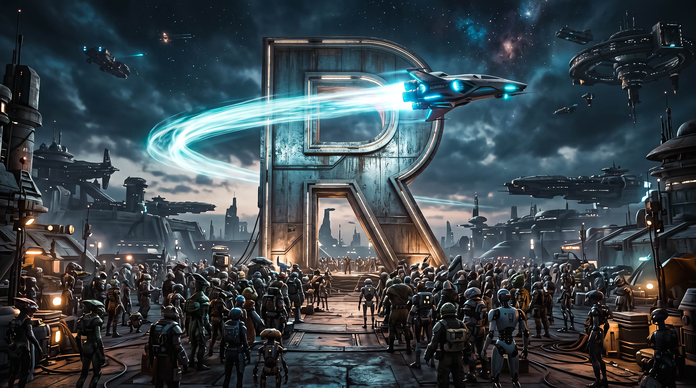

```{r matrstars-numerado-setup-cap90, include=FALSE}
options(matrstars.suppress_caption = TRUE)
```

# Apéndice: Guía friki del universo R-Stars. {.unnumbered}

{width="100%"}

::: {style="text-align: center;"}
**Figura 90.1.** [Un Universo de ficción... y datos.]{.smallcaps}
:::


Los capítulos del libro utilizan como hilo conductor un universo de ciencia ficción imaginado ex profeso: el sector del **transporte interestelar de mercancías** del año 2210. Este universo no es imprescindible para seguir los desarrollos estadísticos, pero da color a los ejercicios, ancla los datos en una narrativa coherente y permite aligerar los capítulos evitando repetir en cada uno la ambientación completa.

Este apéndice recoge, de forma monográfica, todo lo que hay que saber para moverse con soltura por el universo *R-Stars*: su historia, su geografía galáctica, sus personajes ilustres, las organizaciones que lo vertebran y —para el lector con estómago para ello— una pequeña incursión en la física que lo hace posible. Está pensado como material **opcional**: el lector puramente estadístico puede saltárselo sin remordimientos; el lector con inclinaciones friki encontrará aquí un pequeño homenaje al género de la ciencia ficción cinematográfica, con guiños repartidos por el texto que dejamos a su sagacidad detectar (y con una nota final que los identifica, para quien prefiera respuestas directas).

> *"En el espacio nadie puede oírte hacer un contraste de hipótesis... pero sí puede leer tus informes trimestrales."*
>
> — Proverbio no oficial de la AITM.

## Nota preliminar para el pasajero despistado. {.unnumbered}

Todo lo que sigue es **ficción**. Cualquier parecido con corporaciones reales, planetas cartografiados por la NASA o personajes de sagas cinematográficas es intencionado y afectuoso. El universo *R-Stars* se construye sobre una premisa sencilla: en el año 2210 la humanidad ha colonizado, comerciado y en algunos casos negociado alto el fuego a lo largo de cinco galaxias, transporta mercancías entre ellas a velocidades cercanas a las de la luz, y —lo más importante para nosotros— **genera datos**. Muchos datos. Suficientes para llenar un libro de estadística aplicada.

El resto son detalles.

## Cronología del sector interestelar. {.unnumbered}

La historia del transporte interestelar abarca poco más de siglo y medio, tiempo suficiente para pasar de las primeras misiones tripuladas a asteroides cercanos a una industria multigaláctica con más de 100.000 rutas activas.

```{r cronologia-frikistars, eval=FALSE, echo=FALSE}
library(MATrstars)

cronologia <- data.frame(
  Fecha       = c("Mediados s. XXI", "2084", "2087–2110",
                  "c. 2110", "Siglo XXII",
                  "2135", "2137", "2210"),
  Hito        = c("Primeros pasos de la logística espacial",
                  "Descubrimiento del plasma warp (con proto-especia sintética)",
                  "Primer contacto con civilizaciones extraterrestres",
                  "Hallazgo de Arrakis y del vuelo intergaláctico",
                  "Colonización de mundos lejanos y florecimiento diplomático",
                  "Firma del Tratado de Libre Comercio Interestelar (TLCI)",
                  "Creación de la Base de Datos Interestelar",
                  "Presente del sector (300 empresas, 30 planetas, 5 galaxias)")
)

kable_rstars(cronologia,
             caption = "Hitos principales del sector interestelar")
```

### Los prolegómenos (siglo XXI). {.unnumbered}

El transporte espacial comercial nace a mediados del siglo XXI, empujado por la escasez de recursos en la Tierra y el impulso privatizador de corporaciones pioneras. Compañías como *SpaceX* y *Blue Origin* inician la explotación sistemática del cinturón de asteroides y sientan, casi sin darse cuenta, las bases de una futura logística interplanetaria. En esta etapa el negocio consiste todavía en **arrastrar rocas** de un lado a otro del sistema solar, y los tiempos de tránsito se miden en meses.

### El salto cuántico: el descubrimiento del plasma warp (2084). {.unnumbered}

En 2084 un equipo mixto de físicos e ingenieros descubre —según cuenta la leyenda, casi por accidente— el fenómeno conocido como **plasma warp**: una configuración magnetohidrodinámica capaz de deformar localmente la métrica del espacio-tiempo y propulsar una nave a velocidades efectivamente equivalentes a las de la luz. El descubrimiento se anuncia oficialmente un martes, se patenta el miércoles, y el viernes ya cotizaba en bolsa.

En su primera versión, el plasma warp funcionaba con **proto-especia sintética**: un isómero artificial de melangium producido en laboratorio a un coste ruinoso y con una eficiencia energética marginal, suficiente para saltos interestelares **dentro de la Vía Láctea** pero incapaz de sostener trayectos intergalácticos. Los detalles físicos del fenómeno se abordan en la sección siguiente; baste decir aquí que, con este combustible experimental, la humanidad pudo alcanzar sistemas estelares que hasta entonces eran teoría de manual. Al principio, y por razones estrictamente presupuestarias, cada salto costaba aproximadamente lo que un pequeño país.

### Primer contacto: no estábamos solos (2087–2110). {.unnumbered}

Con las primeras rutas interestelares abiertas —aún con proto-especia sintética y aún dentro de la propia Vía Láctea— la humanidad descubrió con estupor que buena parte de los sistemas visitados estaban... **habitados**. La revelación, que hasta entonces solo había ocupado la ciencia ficción y algunos congresos poco concurridos de exobiología, resultó menos traumática de lo previsto por dos razones sorprendentes.

**Primera: casi todas las especies encontradas eran humanoides.** Y no humanoides "estilo dibujo animado", sino humanoides *desconcertantemente* humanos: bípedos, con dos ojos frontales, aparato fonador comparable, cinco dedos por mano (con alguna excepción anecdótica) y un rango de temperatura corporal perfectamente compatible con un apretón de manos. Los xenobiólogos llevan siglo y medio debatiendo si esta convergencia evolutiva es milagrosa, sospechosa o simplemente un fallo de originalidad del universo. Hay quien sostiene que, en realidad, los humanos somos los últimos en llegar.

**Segunda: su nivel tecnológico era comparable al nuestro.** La mayoría de civilizaciones halladas había descubierto la ionización controlada, la relatividad general y —crucialmente— algo equivalente al plasma warp de forma independiente, más o menos en la misma década que nosotros. Cada una había experimentado a su vez la sorpresa de encontrarse con humanos que "eran demasiado como ellos".

El efecto sobre la agenda espacial fue radical: lo que se había concebido como una empresa **colonial** —bandera plantada, minerales extraídos, planeta anexionado— se convirtió, casi de la noche a la mañana, en un ejercicio **diplomático** de una complejidad sin precedentes. Los primeros embajadores del sector fueron políglotas, sagaces y, con frecuencia, agentes económicos con habilidades muy poco compatibles con el uniforme militar. La palabra "extraterrestre" fue perdiendo peso hasta caer en desuso: hoy no se dice "un extraterrestre en Coruscant", se dice sencillamente "un coruscantino". De hecho, buena parte de los grandes magnates actuales del sector —incluidos **Romulus Steiner** y **Arg-us Korp**— son ciudadanos de otras especies, lo cual, dicho sea de paso, no se nota especialmente en las juntas de accionistas.

### El hallazgo de Arrakis y el vuelo intergaláctico (c. 2110). {.unnumbered}

Durante las expediciones exploratorias de finales del siglo XXI, una de las primeras naves *warp* que se aventuró más allá del brazo de Orión detectó una **anomalía isotópica** en la señal espectrográfica de una lejana nube molecular con dirección a la Gran Nube de Magallanes. La firma coincidía, con inquietante precisión, con la del proto-especia sintética que impulsaba a la propia nave —salvo que la señal era treinta órdenes de magnitud más intensa—.

Rastreando el origen, los exploradores llegaron a **Arrakis**, un planeta desértico cuyas capas geológicas estaban literalmente saturadas de **especia natural**: un isómero de melangium mucho más puro y estable que cualquier síntesis lograda en laboratorio. La eficiencia energética del combustible arrakiano superaba a la de la proto-especia en más de dos órdenes de magnitud.

El hallazgo cambió la escala del sector de la noche a la mañana. Con especia natural, los saltos ya no se limitaban a la Vía Láctea: se podía cruzar hasta las galaxias vecinas —Andrómeda, Triángulo, las dos Nubes de Magallanes— en cuestión de semanas subjetivas. La era **intergaláctica** del transporte había comenzado, y la casa de subastas del primer cargamento de especia arrakiana estableció el récord absoluto de precio por gramo de la historia comercial humana, marca que se mantiene sin discusión.

### La era colonial y diplomática (siglo XXII). {.unnumbered}

Con especia natural en las bodegas, la colonización dejó de ser una aventura fronteriza en unos pocos sistemas cercanos y se convirtió en una gran operación intergaláctica. Se establecen bases permanentes en mundos como **Pandora** (Vía Láctea), **Tatooine** (Andrómeda) y **Mustafar** (Andrómeda), casi todos ellos negociados —no ocupados— con las civilizaciones locales tras rondas diplomáticas de una duración legendaria.

Surgen entonces las primeras compañías especializadas en cargamentos masivos a larga distancia: la histórica **Arrakis Freight** (fundada, cómo no, sobre el negocio de la exportación de especia) y la célebre **Vader & Company**, tan admirada por sus márgenes operativos como temida por su severa política de recursos humanos y su departamento de atención al cliente notoriamente asfixiante.

### El marco legal: el TLCI (2135). {.unnumbered}

En 2135, tras una década larga de disputas jurisdiccionales entre humanos, coloniales y varias veintenas de especies aliadas, se firma el **Tratado de Libre Comercio Interestelar** (TLCI). El tratado estandariza los pesos, medidas, unidades monetarias y protocolos de aduana entre galaxias y especies, y —crucialmente— establece **corredores comerciales protegidos** por flotas conjuntas, lo que reduce drásticamente los riesgos de piratería en las rutas principales. Incluye además una llamativa moratoria sobre la **síntesis industrial de melangium puro** (véase la sección de física), consecuencia directa de tres incidentes de laboratorio cuyos detalles siguen clasificados.

El TLCI abre las puertas al crecimiento explosivo del sector: entre 2135 y 2160 aparecen decenas de nuevas transportistas, entre ellas *Nova Haulers* y la *ExoCargo Alliance*, y el volumen de mercancías movidas se multiplica por veinte.

### La Base de Datos Interestelar (2137). {.unnumbered}

En 2137, apenas dos años después del TLCI, el analista **Dr. Sagan Olbers** —hasta entonces un discreto oficial de logística de la *Federación de Rutas Espaciales de Andrómeda*— acomete lo que muchos consideraron una locura: convencer a los principales magnates del sector para que compartan sus datos financieros y operativos en un registro único. Contra todo pronóstico, lo consigue. El apoyo temprano del magnate **Romulus Steiner** (a la sazón CEO de *Arrakis Freight*) resulta decisivo: cuando el mayor accionista del sector abre sus libros, el resto no tarda en seguirle.

Nace así la **Base de Datos Interestelar**, hoy alimentada por las 300 compañías del sector y considerada el activo informacional más valioso de la galaxia. Sin ella, este libro no existiría.

### El presente: 2210. {.unnumbered}

En el momento en el que se ambientan los capítulos del libro, el sector ha alcanzado su madurez:

-   **300 empresas** activas.
-   **30 planetas** con bases operativas.
-   **5 galaxias** conectadas por rutas regulares.
-   Más de **109.000 rutas comerciales** anuales.
-   Rentabilidad media en torno al **60,16%**, cifra que hace las delicias de los accionistas y las pesadillas de los reguladores.

El sector es maduro y rentable, pero no plácido: la piratería en las fronteras, las tormentas de radiación, la creciente competencia entre astilleros, la disputa permanente por la especia y la aparición de nichos digitales especializados mantienen a analistas y CEOs —humanos y no humanos— en permanente sobreaviso.

## La física del plasma warp para el lector con prisa. {.unnumbered}

Este apartado puede saltarse sin culpa: la estadística del libro no depende de él. Se incluye por razones de **completitud** y por si el lector, en algún banquete, se ve enfrentado a la incómoda pregunta de "cómo funciona exactamente eso del warp".

El plasma warp es, técnicamente, un fenómeno de **acoplamiento resonante** entre la métrica local del espacio-tiempo y un estado isomérico metaestable de ciertos núcleos pesados. La teoría estándar, formalizada por la *Escuela Kwisatz–Herbert* poco después del descubrimiento de 2084, se apoya en cuatro postulados que enunciamos sin demasiado rigor:

1.  **Cualquier volumen material en reposo genera microperturbaciones en el campo de Higgs local.** En condiciones ordinarias, estas perturbaciones son insignificantes y no producen efectos macroscópicos observables.

2.  **Los núcleos de melangium (**$^{297}$Mg, isótopo transuránico) poseen un estado isomérico de espín $11/2^{+}$ cuya vida media (aproximadamente $4{,}7 \cdot 10^{-3}$ s) resulta compatible con la escala de resonancia del vacío cuántico.

3.  **Cuando una nube densa de este isómero se somete a un plasma toroidal confinado magnéticamente**, se produce una coherencia macroscópica del campo Higgs perturbado, que se manifiesta como una burbuja de espacio-tiempo localmente deformado (una métrica de Alcubierre modificada por un factor de fase espinorial).

4.  **La nave contenida en la burbuja se desplaza junto con la deformación métrica**, no dentro de ella, por lo que su velocidad instantánea respecto al espacio circundante es formalmente indefinida —lo que evita, elegantemente, contradecir la relatividad especial—.

En términos comprensibles para el lector no versado en teoría de campos: la nave no se mueve más deprisa que la luz; el **espacio-tiempo**, sencillamente, se pliega delante y detrás de ella con más o menos ganas según la calidad del isómero.

El problema práctico es que el melangium natural —la **especia**— solo se encuentra en cantidades industriales en el sistema estelar de **Arrakis**, donde una supernova ancestral generó las condiciones gravitatorias y de flujo neutrónico necesarias para sintetizarlo *in situ* y en abundancia. La versión sintética producida en laboratorio (proto-especia) funciona, pero con una eficiencia del **3–5%** respecto al natural, lo que la limita a saltos interestelares dentro de la propia Vía Láctea. Todo viaje intergaláctico requiere, sin excepción, especia natural arrakiana. Los sucesivos intentos de sintetizar el isómero puro a escala industrial han acabado en desastres de magnitud tal que el TLCI incorporó en 2135 una moratoria específica al respecto.

> **Nota tranquilizadora.** El pasajero medio experimenta el trayecto warp como un ligero mareo de unos minutos, seguido de un almuerzo. Los efectos secundarios documentados incluyen sensación de *déjà vu* al desembarcar y una tendencia —afortunadamente pasajera— a discutir con voz solemne sobre la naturaleza del tiempo.

Este monopolio geológico es la razón última por la que el sector del transporte interestelar está tan concentrado en Arrakis, y por la que **Arrakis Freight** encabeza casi todos los rankings del *Informe Bluebird*. La geografía manda, incluso —o especialmente— a escala galáctica.

## Geografía galáctica. {.unnumbered}

El universo conocido de *R-Stars* abarca **cinco galaxias**, cada una con sus mundos, sus rutas y sus peculiaridades culturales. Conviene tener presente que las distancias, incluso con especia natural, siguen siendo considerables: una ruta intergaláctica típica implica varias semanas subjetivas de tránsito y una lista sorprendentemente larga de trámites aduaneros.

### Las cinco galaxias. {.unnumbered}

-   **Vía Láctea.** Galaxia espiral de tamaño medio. Sigue siendo el centro administrativo del sector por razones históricas (aquí nació la humanidad) más que por razones logísticas. Alberga la Tierra, Pandora y buena parte de las oficinas centrales de las compañías más antiguas.

-   **Galaxia de Andrómeda (M31).** Galaxia espiral, la más poblada del sector en número de mundos habitados. Andrómeda es hoy el verdadero **motor comercial** del universo *R-Stars*: en ella se encuentran Tatooine, Mustafar y la sede de la *Federación de Rutas Espaciales*.

-   **Galaxia del Triángulo (M33).** Galaxia espiral menor. Menos poblada, pero estratégicamente situada entre la Vía Láctea y Andrómeda; muchas rutas intergalácticas la utilizan como escala técnica.

-   **Gran Nube de Magallanes (LMC).** Galaxia irregular, rica en gas y con intensa formación estelar. Aloja **Arrakis** —y, por tanto, la práctica totalidad de la producción de especia— y una nutrida colonia de mundos mineros. El *Cinturón de Magallanes* que la rodea es célebre por sus tormentas de radiación.

-   **Pequeña Nube de Magallanes (SMC).** Galaxia irregular, satélite de la anterior. Frontera efectiva del sector: más allá empieza el territorio no cartografiado, todavía objeto de expediciones especulativas.

### Planetas destacados. {.unnumbered}

El grueso de la actividad se concentra en una treintena de planetas. La tabla siguiente recoge los más relevantes desde el punto de vista narrativo del libro; el resto aparecen mencionados de forma tangencial y no requieren mayor presentación.

```{r planetas-frikistars, eval=FALSE, echo=FALSE}
library(MATrstars)

planetas <- data.frame(
  Planeta   = c("Arrakis", "Tatooine", "Pandora", "Coruscant",
                "Mustafar", "Fhloston Paradise", "Naboo", "Miranda"),
  Galaxia   = c("Gran Nube de Magallanes", "Andrómeda", "Vía Láctea",
                "Vía Láctea", "Andrómeda", "Andrómeda", "Vía Láctea",
                "Triángulo"),
  Rasgo     = c("Yacimientos de especia (combustible warp)",
                "Mundo desértico con grandes bases operativas",
                "Ecosistema protegido, biotecnología",
                "Astilleros orbitales",
                "Cristales kyber, inestabilidad política",
                "Turismo y bioingredientes de lujo",
                "Componentes biotecnológicos",
                "Nichos tecnológicos avanzados"),
  Compañía  = c("Arrakis Freight, Shuttlepod Movers",
                "—", "—", "Enterprise Logistics",
                "Kaiju Haulage Co.", "—", "—", "Hyperdrive Express")
)

kable_rstars(planetas,
             caption = "Principales planetas del sector R-Stars")
```

**Arrakis** (Gran Nube de Magallanes) es, sin discusión, el enclave más estratégico del sector: sus yacimientos de **especia** —único combustible viable para el plasma warp intergaláctico— sostienen a *Arrakis Freight*, *Shuttlepod Movers* y buena parte de la economía galáctica. Su puerto orbital nunca duerme, y su clase política mantiene con las flotas de escolta un delicado equilibrio que rara vez se explicita en los comunicados oficiales. **Tatooine** (Andrómeda), colonizada tras las primeras rondas diplomáticas de principios del siglo XXII, es un mundo desértico con grandes bases operativas, célebre por la resiliencia de su población y por sus dos soles (detalle astronómico que sus habitantes se cansaron de comentar hace un siglo). **Pandora** (Vía Láctea) es uno de los primeros mundos colonizados; su ecosistema protegido lo ha convertido en fuente privilegiada de componentes biotecnológicos, tras un largo y disputado acuerdo con la civilización local.

**Coruscant** alberga los inmensos y relucientes astilleros orbitales de *Enterprise Logistics*, cuyos cargueros llevan por lema el clásico *"llegar donde ningún carguero llegó antes"*. **Mustafar** (Andrómeda) es la base de *Kaiju Haulage Co.* y una de las principales fuentes de cristales kyber; su **inestabilidad política** —eufemismo diplomático para "todo el mundo está siempre a punto de derrocar a alguien"— la convierte, no obstante, en una plaza de alto riesgo operativo.

**Fhloston Paradise** y **Naboo** albergan ecosistemas protegidos de los que se extraen componentes biotecnológicos de altísimo valor. **Miranda** es la sede de *Hyperdrive Express*, la compañía tecnológica de más rápido crecimiento del sector.

El resto de la nómina se reparte entre mundos históricos (**Tierra, Vulcano, Qo'noS, Kobol**), colonias industriales (**Júpiter, Endor, Dagobah, Mül, Romulus, Caprica, Nueva Caprica**) y enclaves más exóticos (**LV-223, LV-426, Planet P**), estos últimos con una reputación logística que oscila entre lo desafiante y lo francamente suicida.

### Zonas de riesgo y nuevas fronteras. {.unnumbered}

Ningún sector maduro está exento de problemas, y el nuestro tiene los suyos:

-   **Piratería.** Los sistemas de **Klendathu** y **Miller** son las célebres "zonas rojas" del sector. El primero por su tradición de contrabando bien organizado; el segundo por saqueos francamente menos organizados pero igual de eficaces. Los seguros de carga aplican recargos de dos dígitos a cualquier ruta que los atraviese.

-   **Riesgos climáticos.** Las **tormentas de radiación** del Cinturón de Magallanes son el fenómeno meteorológico más temido por los pilotos. Los astilleros compiten por producir cascos capaces de resistirlas; los brokers, por asegurarlas.

-   **Nuevas fronteras.** Las compañías más ambiciosas exploran ya rutas hacia la **Galaxia de Cetus** y la **Nube Circungaláctica**. Los primeros contratos se firman a márgenes muy generosos, pero también con cláusulas de fuerza mayor que dan pie a debates jurisprudenciales encendidos.

## Personajes ilustres. {.unnumbered}

El sector no sería lo que es sin un puñado de personajes —analistas, científicos, magnates— cuyas decisiones han moldeado su desarrollo. Los capítulos del libro los invocan a menudo; conviene tenerlos presentes.

### Los padres fundadores del dato. {.unnumbered}

-   **Dr. Sagan Olbers.** Antiguo oficial de logística de la *Federación de Rutas Espaciales de Andrómeda* y creador, en 2137, de la **Base de Datos Interestelar**. Se le atribuye una tenacidad legendaria y una paciencia todavía mayor: convencer a treinta magnates —de tres especies distintas— de compartir sus libros contables se considera, en algunos círculos, un logro comparable al descubrimiento del propio plasma warp.

-   **Li Ti-Oh.** Experta en transporte interestelar, radicada en Tatooine (Andrómeda). Autora del principal informe sectorial del año 2210 sobre orígenes, fortalezas y debilidades del comercio logístico. Sus análisis son de lectura obligada en las escuelas de negocio del sector.

### La escuela AITM. {.unnumbered}

Bajo el paraguas de la **Agencia Interplanetaria de Transporte de Mercancías** (AITM) opera un pequeño pero influyente grupo de investigadores cuyos informes marcan la agenda regulatoria del sector.

-   **Dra. Xelia Bluebird.** Responsable del célebre *Informe Bluebird*, que segmenta a las 300 compañías del sector según sus índices de **fidelización**, **diversificación** y **digitalización**. El informe se publica cada dos años y sus conclusiones mueven cotizaciones bursátiles.

-   **Dr. Oren Crestfall.** Analista técnico de la AITM. Dirige el *Informe Crestfall*, un estudio comparativo sobre la **fiabilidad** y el **rendimiento energético** de los cargueros producidos por los distintos astilleros. Sus rankings son temidos por los fabricantes y adorados por los aseguradores.

-   **Mara Qyà.** Directora de la **Autoridad Reguladora del Transporte Interestelar (ARTI)**, el organismo encargado de auditar la salud financiera de las compañías del sector. Formada en econometría aplicada en la Universidad de Arrakis, es conocida en los pasillos de la ARTI como *"la mujer que no firma nada sin un p-valor"*. Bajo su dirección, la ARTI ha endurecido las auditorías periódicas y ha convertido el análisis previo de datos —depuración de *missing values*, detección de *outliers*, estudio de correlaciones— en un requisito formal antes de cualquier informe regulatorio. Su rigor metodológico le ha granjeado tanto admiradores como detractores; estos últimos la acusan de convertir las reuniones de directivos en seminarios de estadística. Ella lo considera un cumplido.

### Magnates y CEOs. {.unnumbered}

-   **Romulus Steiner.** Máximo accionista y CEO histórico de *Arrakis Freight*. Nacido en el sistema homónimo, es —como su nombre delata— uno de los primeros altos ejecutivos **no humanos** del sector; hecho que hoy nadie se molesta en subrayar, pero que en la década de 2130 fue tema recurrente de tertulia. Su apoyo temprano al Dr. Olbers fue determinante para el nacimiento de la Base de Datos Interestelar. En círculos periodísticos se le conoce como *"el hombre —o lo que sea— que abrió los libros"*.

-   **Tasha Tachybaptus.** Actual CEO de *Shuttlepod Movers* (Sociedad Anónima Galáctica con sede en Arrakis). Su reto declarado es renovar la envejecida flota de la compañía sin comprometer su ya delicada liquidez; una ecuación con más incógnitas que ecuaciones, en palabras propias.

-   **Arg-us Korp.** Magnate reciente, tan poderoso como esquivo. Originario de un sistema fronterizo de la Galaxia del Triángulo, es asimismo de origen **no humano** y —según los pocos periodistas que han conseguido entrevistarle— tiene una noción del tiempo levemente distinta de la humana, lo que dificulta enormemente el cierre de las reuniones. Ha protagonizado en los últimos años una serie de adquisiciones estratégicas, la más sonada de las cuales es la compra de *Home One Cargo*, una firma especializada en nichos digitales de alto margen.

## Organizaciones e instituciones. {.unnumbered}

### Agencia Interplanetaria de Transporte de Mercancías (AITM). {.unnumbered}

Organismo intergaláctico —y **multiespecífico**— encargado de **estudiar, segmentar y supervisar** el funcionamiento del sector. La AITM publica los informes de referencia (entre ellos los citados de Bluebird y Crestfall), mantiene las estadísticas oficiales y actúa como interlocutor técnico ante los organismos reguladores de las cinco galaxias. Su sede principal está en la Vía Láctea, con delegaciones permanentes en Andrómeda y Magallanes.

### Autoridad Reguladora del Transporte Interestelar (ARTI). {.unnumbered}

Organismo de **supervisión financiera** del sector, creado como brazo auditor independiente de la AITM. La ARTI tiene competencia para inspeccionar las cuentas de cualquier compañía de transporte interestelar, exigir la corrección de irregularidades y, en casos extremos, suspender temporalmente licencias de operación. Su directora actual, **Mara Qyà**, ha impuesto una cultura de análisis empírico riguroso: ningún informe de auditoría se emite sin un análisis previo de datos que incluya la depuración de valores faltantes, la detección de casos atípicos y el estudio de las relaciones entre las principales variables financieras.

### Federación de Rutas Espaciales de Andrómeda. {.unnumbered}

Institución logística histórica de la galaxia de Andrómeda, en la que se formó el Dr. Olbers antes de fundar la Base de Datos Interestelar. Continúa coordinando las rutas comerciales de Andrómeda y actúa como órgano consultivo de la AITM en materia intergaláctica.

### Los tres grandes astilleros. {.unnumbered}

El mercado de fabricación de cargueros está dominado por tres corporaciones. Sus naves —todas ellas propulsadas por **especia**— compiten en fiabilidad, rendimiento energético y precio.

-   **Korrigan Heavy Works.** El fabricante clásico. Naves robustas, sobredimensionadas y algo caras de mantener, pero con una reputación de indestructibilidad que le mantiene una cuota de mercado estable.

-   **Selene Dynamics.** El fabricante técnicamente más avanzado. Sus cargueros destacan sistemáticamente por un **rendimiento energético superior** y por una fiabilidad muy por encima de la media del sector. El *Informe Crestfall* la sitúa como referencia técnica desde hace tres bienios consecutivos.

-   **Arcturus Shipyards.** El tercer gran fabricante. Estrategia agresiva de precios, catálogo amplio y presencia en todos los segmentos. Muy popular entre compañías medianas y en expansión.

## Glosario del pasajero apresurado. {.unnumbered}

Se recogen a continuación algunos términos que aparecen recurrentemente en los capítulos, para consulta rápida:

-   **AITM.** Agencia Interplanetaria de Transporte de Mercancías. Organismo regulador y estadístico del sector.
-   **ARTI.** Autoridad Reguladora del Transporte Interestelar. Brazo auditor independiente de la AITM, encargado de la supervisión financiera de las compañías del sector. Dirigida por Mara Qyà.
-   **Base de Datos Interestelar.** Registro unificado —creado en 2137 por el Dr. Sagan Olbers— con la información operativa y financiera de las 300 compañías del sector. Fuente primaria de los datos utilizados en el libro.
-   **Especia (natural).** Isómero natural de melangium extraído en Arrakis. Combustible único del plasma warp para viajes intergalácticos. Su nombre comercial es objeto de disputas históricas.
-   **Melangium.** Isótopo transuránico artificial ($^{297}$Mg) cuyo estado isomérico metaestable es la base física del plasma warp.
-   **Plasma warp.** Tecnología de propulsión descubierta en 2084 que permite deformar localmente la métrica del espacio-tiempo. Sin ella, este libro trataría probablemente sobre logística de camiones.
-   **Primer contacto.** Denominación oficial del periodo 2087–2110, durante el cual la humanidad estableció relación con las primeras civilizaciones extraterrestres. Sinónimo, en el argot diplomático, de *"todo era más sencillo antes"*.
-   **Proto-especia.** Versión sintética del melangium, producida en laboratorio. Eficiencia baja; suficiente para viajes **intra**galácticos, insuficiente para **inter**galácticos.
-   **TLCI.** Tratado de Libre Comercio Interestelar (2135). Marco jurídico que rige los intercambios entre galaxias y especies.
-   **Zona roja.** Sistema estelar con actividad pirata documentada. Los seguros aplican recargos; los pilotos, precauciones adicionales.

## Nota final: la filmografía tras el universo R-Stars. {.unnumbered}

Como el lector atento habrá sospechado desde hace unas cuantas páginas, el universo *R-Stars* no es tan original como su rentabilidad media insinúa. Cada uno de los 30 planetas y cada una de las 300 compañías del sector rinde homenaje —a veces literal, a veces desviado, casi siempre en tono cariñoso— a alguna obra fundamental del **cine, la televisión o la literatura de ciencia ficción**. La tabla siguiente resume las principales fuentes de inspiración; la lista es representativa, no exhaustiva.

| Obra o saga | Año | Autoría / dirección | Ejemplos de guiños en *R-Stars* |
|----|----|----|----|
| **Star Wars** | 1977– | George Lucas *et al.* | Tatooine, Coruscant, Naboo, Dagobah, Mustafar, Endor, Hoth, Kashyyyk, Jedha, Scarif, Crait; Vader, Yoda, Skywalker, Boba Fett, Jabba, Lando, Kylo Ren, Snoke, Poe Dameron, Finn, Ahsoka, Ezra Bridger, Cassian, Jyn Erso; *Home One Cargo*, *Death Star Deliveries*, *Millennium Haulage*, *Tantive IV Cargo*. |
| **Dune** | 1965/1984/2021 | Frank Herbert (novela); D. Lynch; D. Villeneuve | Arrakis, **la especia**, Harkonnen, Atreides, Bene Gesserit, Sandworm; *Dune Dynamics*, *Spice Cargo Lines*. |
| **Star Trek** | 1966– | Gene Roddenberry | Vulcano, Qo'noS, Romulus, Risa; Kirk, Spock, Uhura, Sulu, Chekov, Chakotay, Janeway, Sarek, Seven of Nine, Pike, T'Pol, Phlox; Klingon, Borg, Cardassian, Bajoran, Andorian, Betazoid, Dominion; *Enterprise Logistics*, *NX-01 Cargo Lines*. |
| **Alien / Prometheus** | 1979– | Ridley Scott; James Cameron (*Aliens*) | LV-223, LV-426; Nostromo, Weyland-Yutani, Ripley, Ash, Xenomorph, Prometheus, Sulaco, Sevastopol, Narcissus. |
| **Blade Runner** | 1982 | Ridley Scott | Deckard, Roy Batty, Replicant, Tannhäuser (gate). |
| **Battlestar Galactica** | 1978 / 2004 | Glen A. Larson; Ronald D. Moore | Kobol, Caprica, Nueva Caprica; Adama, Starbuck, Apollo, Boomer, Cylon, Galactica, Pegasus, Viper, Ragnar, Dradis. |
| **2001: Una odisea del espacio** | 1968 | Stanley Kubrick | HAL 9000, Discovery One, Monolito, Dr. Bowman. |
| **The Matrix** | 1999 | Lana y Lilly Wachowski | Nebuchadnezzar, Zion. |
| **Firefly / Serenity** | 2002 / 2005 | Joss Whedon | Miranda; *Serenity Cargo Co.* |
| **Avatar** | 2009 | James Cameron | Pandora. |
| **El quinto elemento** | 1997 | Luc Besson | Fhloston Paradise; Leeloo. |
| **Starship Troopers** | 1997 (film) / 1959 (novela) | Paul Verhoeven; R. A. Heinlein | Klendathu, Planet P; Rico's Roughnecks; *Bug Hunter Logistics*. |
| **The Expanse** | 2015– | J. S. A. Corey (novelas); Amazon (serie) | Rocinante, Belter, Drummer, Naomi, Holden, Protogen, Eros, Behemoth. |
| **Interstellar** | 2014 | Christopher Nolan | Miller, Mann (los dos planetas visitados). |
| **Farscape** | 1999 | Rockne S. O'Bannon | Moya, Peacekeeper, Scorpio. |
| **Babylon 5** | 1993 | J. Michael Straczynski | Babylon 5; Minbari, Vorlon, Centurion. |
| **Event Horizon** | 1997 | Paul W. S. Anderson | *Event Horizon Haulage*. |
| **Elysium** | 2013 | Neill Blomkamp | *Elysium Freightlines*, *Elysium Star Transport*. |
| **Solaris** | 1972 / 2002 | Stanisław Lem (novela); Tarkovsky; Soderbergh | *Solaris Haulage*. |
| **Foundation** | 1942– | Isaac Asimov (novelas); Apple TV+ (2021) | Trantor; *Terminus Transport*. |
| **Robotech / Macross** | 1982 / 1985 | Shōji Kawamori; Carl Macek | SDF-1, Zentraedi, Veritech. |
| **Portal** | 2007 | Valve | *Aperture Cargo Systems*. |
| **Pacific Rim** | 2013 | Guillermo del Toro | *Kaiju Haulage Co.* |
| **Stargate** | 1994 | Roland Emmerich | *Star Gate Logistics*. |
| **Sunshine** | 2007 | Danny Boyle | *Icarus Star Transport*. |
| **Valerian y la ciudad de los mil planetas** | 2017 | Luc Besson | Mül; *Valerian Freight Co.* |
| **WALL·E** | 2008 | Andrew Stanton (Pixar) | EVA; *Eva Movers*, *Eva Star Transport*. |
| **Dark Star** | 1974 | John Carpenter | *Dark Star Haulage*. |
| **Terminator** | 1984 | James Cameron | *Neural Net Freight*. |

::: {style="text-align: center;"}
**Tabla 90.1**
:::


El resto de nombres del sector se reparte entre guiños puntuales (*Ripley Interstellar Freight*, *Ash Logistics*, *Nostromo Freight*), homenajes literarios sin adaptación cinematográfica canónica (los cargueros bautizados como *Hyperion* rinden pleitesía a Dan Simmons; los que llevan *Trantor* o *Foundation* a Asimov) y nombres de pura invención con sabor genérico a ciencia ficción (*Quantum Freightlines*, *Nebula Express*, *Warp Drive Logistics*, *Photon Pack Freight*, *Wormhole Transport Systems*).

Se anima al lector a considerar el resto de nombres como un pequeño juego lateral: identificarlos todos —hay unos cuantos francamente oscuros— puede llenar productivamente los ratos muertos entre dos capítulos de análisis multivariante.

## Coda: y que la R os acompañe. {.unnumbered}

El universo *R-Stars* es, en el fondo, una excusa: una excusa para hablar de tablas, distribuciones, contrastes, modelos y clústeres sin caer en el tedio del *dataset* de flores (con todos los respetos a los iris de Fisher, que cumplen su función con dignidad hace ya más de noventa años). Cuando en los capítulos aparezca un carguero de *Kaiju Haulage Co.* averiado en Mustafar, o un análisis clúster que separe a las compañías por su índice de digitalización, o un modelo log-lineal ajustado sobre la tabla de contingencia "galaxia × forma jurídica × estado financiero", conviene recordar que detrás de cada número hay —o querríamos que hubiera— un piloto en su cabina (humano, humanoide o vagamente reptiliano, según el turno) mirando por la ventanilla la Nube de Magallanes.

Y si el lector, llegado a este punto, decide que quiere abrir su propia compañía de transporte interestelar, que lo haga sabiendo que la rentabilidad media del sector supera el 60%, pero también que un cargamento de especia arrakiana no se financia con una hipoteca al uso y que los seguros de casco en el sistema de Klendathu no bajan del 12%.

Que la **R** os acompañe.
