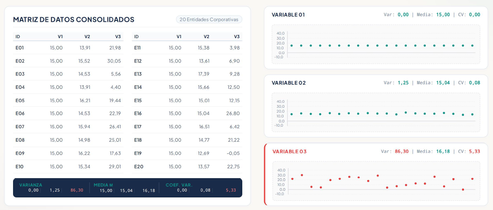
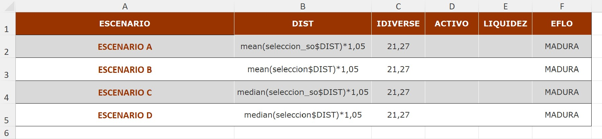
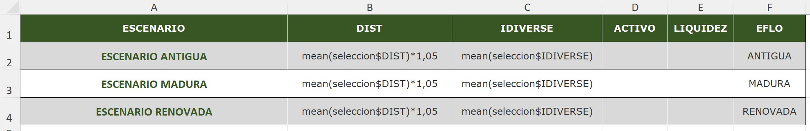
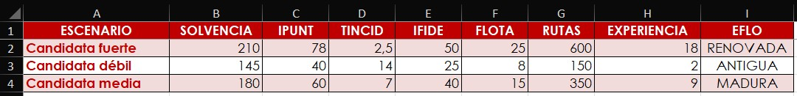

#  {.unnumbered}

{.portada-img width="100%"}

**Autor:**

| Miguel Ángel Tarancón Morán.

| Catedrático de Economía Aplicada. Universidad de Castilla - La Mancha.

<div style="margin-top: 3em; padding-top: 1em; border-top: 1px solid #ddd;
            font-family: 'Source Sans 3', 'Helvetica Neue', Arial, sans-serif;
            font-size: 0.82em; color: #666; line-height: 1.5;">
  Esta obra está publicada bajo una licencia
  <a href="https://creativecommons.org/licenses/by-nc-nd/4.0/deed.es">Creative Commons Atribución-NoComercial-SinDerivadas 4.0 Internacional (CC BY-NC-ND 4.0)</a>.
  Véase el capítulo de <a href="#licencia">Licencia</a> al final del libro.
</div>

```{r include=FALSE}
# automatically create a bib database for R packages
knitr::write_bib(c(
  .packages(), 'bookdown', 'knitr', 'rmarkdown'
), 'packages.bib')
```

```{r include=FALSE}
if (knitr:::is_html_output()) '# Bibliografía {-}'
```

<!--chapter:end:index.Rmd-->

```{r matrstars-numerado-setup-cap0, include=FALSE}
options(matrstars.suppress_caption = TRUE)
```

# Prefacio {.unnumbered}

{width="100%"}

::: {style="text-align: center;"}
**Figura 0.1.** [Estrellas... y R.]{.smallcaps}
:::


Este libro reúne las prácticas que han ido tomando forma a lo largo de muchos cursos, en diversas asignaturas de grado y máster sobre **análisis de datos** (especialmente de tipo económico) impartidas en la Facultad de Derecho y Ciencias Sociales de Ciudad Real. El motor de todo ese análisis es el lenguaje **R**, manejado a través de su IDE (o entorno de trabajo) **RStudio**.

¿Por qué R y no otra herramienta? La respuesta larga está en el capítulo introductorio; la corta cabe en una línea: R es **libre y gratuito** (igual que RStudio), está **pensado para la estadística** (frente a otros lenguajes también muy potentes, como Python) y cuenta con una **comunidad enorme y muy activa** que no deja de generar código y algoritmos para analizar datos.

¿La pega? Al principio, la curva de aprendizaje sube con cierta pendiente. Pero tranquilos: una vez os hacéis con la lógica de R y su entorno, las posibilidades son prácticamente infinitas.

Para que esa primera cuesta se haga más llevadera (o, al menos, más divertida), todos los ejemplos beben del proyecto **R-Stars**: una base de datos generada con herramientas de inteligencia artificial que recoge multitud de variables (muchas de ellas económicas) de **300 empresas ficticias**. Aunque todo es una gran simulación, los datos respetan las reglas básicas de coherencia económico-contable y conservan cierta dosis de realismo (dentro de lo que cabe).

¿Y a qué se dedican esas 300 empresas? Al **transporte interestelar de mercancías**.

```{r, echo=FALSE, out.width='60%', fig.align='center'}

```

Pido disculpas anticipadas por los errores que, inevitablemente, encontraréis: se irán puliendo (esperemos) a base de constantes revisiones. Os agradeceré de corazón que me comuniquéis cualquier fallo (ortográfico, de redacción, de contenido o de programación) que detectéis.

Por último, gracias a todas las personas y compañeros/as que hacen posible que este libro crezca y mejore sin descanso. Y gracias también a vosotros, por usar (si lo hacéis) esta peculiar guía de R para el análisis de datos económicos.

Y ahora sí: abrochaos el cinturón, que arrancamos este viaje galáctico rumbo al corazón mismo del lenguaje R.

```{r, echo=FALSE, out.width='60%', fig.align='center'}

```

------------------------------------------------------------------------

**Sobre el carácter gratuito de este libro.** Este manual es, y seguirá siendo, de acceso libre y gratuito. Se agradecen tanto los comentarios y sugerencias que ayuden a su mejora y actualización, como su cita en aquellos documentos en los que se utilice como referencia. La referencia recomendada, en formato APA, es la siguiente:

> Tarancón Morán, M. Á. (2026). *R-Stars: La Guía* [libro electrónico]. Universidad de Castilla-La Mancha. <https://teckel71.github.io/RStars-book/>

<!--chapter:end:00-prefacio.Rmd-->

```{r matrstars-numerado-setup-cap1, include=FALSE}
options(matrstars.suppress_caption = TRUE)
```

# Introducción.

{width="100%"}

::: {style="text-align: center;"}
**Figura 1.1.** [La distribución Normal...]{.smallcaps}
:::


## {.hicon} De los datos a la información: la analítica de datos. {#c01-de-los-datos-a-la-informacion-la-analitica}

Vivimos rodeados de datos. Las administraciones públicas los recopilan para diseñar políticas; las empresas los generan en cada transacción; los mercados financieros los emiten segundo a segundo. Pero los datos, por sí solos, no son más que registros en bruto: cifras de ventas, cotizaciones, respuestas a una encuesta, indicadores macroeconómicos. Su verdadero valor aparece cuando somos capaces de transformarlos en **información** que sirva de base para la **toma de decisiones**.

Esta necesidad de convertir datos en conocimiento útil recorre prácticamente todas las facetas de la actividad humana, y de manera muy especial la **Economía**, entendida como la ciencia que se ocupa de la asignación y administración de recursos limitados. Un gestor público quiere saber si una política de empleo está funcionando; una empresa aspira a anticipar la demanda; un investigador busca contrastar si una teoría sobre el comportamiento de los mercados se sostiene frente a la evidencia empírica. En todos estos casos el punto de partida son datos, y el objetivo, extraer de ellos información fiable.

### {.hicon} La Estadística como ciencia instrumental. {#c01-la-estadistica-como-ciencia-instrumental}

La ciencia que se ocupa de este tránsito del dato a la información es la **Estadística**. Su singularidad reside en que no posee un objeto de estudio sustantivo propio, como lo tiene la Física o la Biología: la Estadística es una **ciencia instrumental** que dota al resto de disciplinas de herramientas para recopilar datos de forma sistemática, organizarlos y extraer de ellos información relevante. Por eso es transversal a todas las ciencias —naturales, sociales, jurídicas— y a todos los campos del saber. Como señalan @Mood&Graybill1963:

> *"La Estadística es la tecnología del método científico."*

Dentro de la Estadística podemos distinguir dos grandes vertientes:

-   La **recopilación y organización** de datos en un sistema estructurado de consulta. Es la vertiente que asociamos a la producción de estadísticas oficiales, censos, encuestas, registros administrativos o bases de datos corporativas.

-   La **explotación y análisis** de esos datos: su transformación en información relevante mediante la aplicación de técnicas que permiten describir, resumir, detectar patrones, contrastar hipótesis y construir modelos.

### {.hicon} Analítica de datos económicos. {#c01-analitica-de-datos-economicos}

Esta segunda vertiente —la explotación de los datos y su conversión en información— es lo que hoy se conoce como **analítica de datos** (*data analytics*). La analítica de datos abarca desde la estadística descriptiva más elemental hasta las técnicas de aprendizaje automático (*machine learning*), pasando por la modelización econométrica, el análisis multivariante o los modelos de elección discreta, entre otras.

Este libro se sitúa precisamente en ese terreno: la **analítica de datos económicos**. Es decir, la aplicación de técnicas estadísticas y de análisis de datos a problemas de naturaleza económica y empresarial, con el objetivo de generar conocimiento que reduzca la incertidumbre inherente a los fenómenos económicos y contribuya a una mejor toma de decisiones.

### {.hicon} La infraestructura: el software de análisis. {#c01-la-infraestructura-el-software-de-analisis}

Para llevar a cabo esta analítica se necesita una infraestructura básica. Además de los propios datos y de los conocimientos metodológicos, resulta imprescindible contar con un **software** adecuado que permita procesar el flujo de datos, aplicar las técnicas de análisis pertinentes y presentar los resultados de forma clara.

En los últimos tiempos, la evolución del hardware no ha tenido precedentes, y ello ha dado soporte al desarrollo de un software potente dedicado al análisis de datos. Ese software se concreta en aplicaciones y plataformas diversas —SPSS®, Stata®, SAS®...— y también en lenguajes de programación orientados al análisis estadístico y matemático, como Python, Matlab®, Julia o... R.

En nuestro caso, la herramienta elegida es **R**.

## {.hicon} ¿Qué es R y cómo nos ayuda a analizar datos? {#c01-que-es-r-y-como-nos-ayuda-a-analizar-datos}

R no es una aplicación al uso, sino todo un **lenguaje de programación** orientado principalmente a la analítica de datos, sobre todo desde una perspectiva estadística. Se trata de un proyecto de GNU, de modo que los usuarios son libres de modificarlo y extenderlo. Se distribuye como software libre bajo licencia GNU y es multiplataforma, rasgos que han facilitado su difusión y el surgimiento de una comunidad muy activa de usuarios y desarrolladores.

R nos ofrece un ecosistema idóneo para cubrir todas las etapas de un proyecto de analítica de datos: desde la importación y depuración de los datos, pasando por su exploración gráfica y descriptiva, hasta la estimación de modelos y la presentación de resultados. A lo largo de este libro, R será nuestra herramienta de trabajo en cada una de estas etapas.

## {.hicon} Instalación de R y RStudio. {#c01-instalacion-de-r-y-rstudio}

Como ya se ha mencionado, R es un lenguaje de uso y difusión gratuitos, amparado por la licencia GNU. Instalarlo resulta sencillo: basta con acudir a la web de [CRAN](https://cran.r-project.org/) (*Comprehensive R Archive Network*), descargar la última versión disponible para nuestro sistema operativo (en este manual, Microsoft® Windows®) y ejecutar el archivo descargado, que completará la instalación.

R arrastra, eso sí, una limitación: el IDE (entorno de desarrollo integrado) que incorpora, es decir, el programa a través del cual interactuamos con el lenguaje, resulta muy poco amigable. Para salvar este inconveniente existen IDE alternativos, entre los que destaca RStudio, desarrollado por Posit® Software. También es gratuito, así que de nuevo bastará con visitar la web de [RStudio](https://posit.co/download/rstudio-desktop/) y descargar e instalar la versión libre de coste.

## {.hicon} R y RStudio. Comienzo: Proyectos. {#c01-r-y-rstudio-comienzo-proyectos}

Con R y su IDE RStudio ya instalados, podemos ponernos manos a la obra. Abriremos RStudio pulsando en el icono correspondiente y aparecerá la siguiente ventana:

{.d-block .mx-auto width="100%"}

::: {style="text-align: center;"}
**Figura 1.2.** [IDE de RStudio.]{.smallcaps}
:::


La parte izquierda de la ventana es la **consola**: la sección de RStudio desde la que manejamos R introduciendo código directamente. Escribamos, por ejemplo, `2+2` después del cursor (signo "\>") y pulsemos `Enter`. La propia consola nos devolverá el valor 4:

```{r,eval=TRUE, echo=TRUE}
2+2
```

Con todo, la forma más eficiente de trabajar es mediante **proyectos** y **scripts**.

Un **proyecto** se asocia, en esencia, a la carpeta en la que R trabajará: allí buscará los datos que le sirven de *input* y allí depositará, llegado el caso, los resultados u *output*. Dicho de otro modo, es una carpeta más de nuestro sistema de directorios, pero dotada de una característica especial: la de ser un proyecto de R. Al abrirlo desde RStudio le estamos indicando al programa que busque de forma preferente en esa carpeta todos los archivos que necesite y que guarde en ella lo que vaya generando.

Para crear un proyecto nuevo seguiremos la ruta `File → New Project`. El programa nos preguntará entonces si deseamos crearlo en una carpeta nueva o en una ya existente. Situémoslo, por ejemplo, en el disco extraíble D, carpeta R, subcarpeta "explora", que ya tenemos preparada. Aparecerá una ventana para localizar la carpeta y, una vez encontrada, pulsaremos `Open` y `Create Project`. El proyecto ya está creado.

Si ahora abrimos el explorador de Windows® y buscamos la carpeta "explora", veremos en ella un archivo del mismo nombre, identificado con el icono de un cubo con una "R". Ese archivo actúa como un faro: le indica a R que, mientras trabajemos en el proyecto "explora", encontrará en esa carpeta todos los datos que necesite y que en ella deberá depositar los ficheros de salida que produzca. Y sí, el proyecto se llama igual que la carpeta, porque adopta su nombre.

En sesiones posteriores, para retomar el mismo proyecto ya no recurriremos a `File → New Project`, sino a `File → Open Project`.

## {.hicon} Scripts. {#c01-scripts}

Los **scripts**, por su parte, son programas o rutinas en los que varias instrucciones se ejecutan de forma secuencial. Para crear uno seguiremos la ruta `File → New File → R Script`. ¿Y dónde se guardará? En la carpeta "explora", la del proyecto en el que estamos trabajando.

Desde el punto de vista informático, un script no es más que un archivo de texto plano, modificable con cualquier editor. Afortunadamente, para no tener que entrar y salir de RStudio continuamente, el propio IDE incorpora un **editor** de scripts, lo que resulta muy cómodo.

Observaremos que en la parte izquierda de RStudio ha surgido una ventana nueva, situada arriba, que desplaza la consola hacia abajo. Es la ventana del **editor**:

{.d-block .mx-auto width="100%"}

::: {style="text-align: center;"}
**Figura 1.3.** [El editor de Scripts de RStudio.]{.smallcaps}
:::


Al igual que ocurre con los proyectos, desde RStudio podemos crear un script nuevo o abrir uno ya existente para modificarlo, ejecutarlo y volver a guardarlo.

Empecemos a escribir nuestro script. Cuando queramos introducir un comentario que no ejecute instrucción alguna, lo precederemos del símbolo almohadilla o *hashtag* "\#". A continuación pediremos a R que realice la suma 2+2. Escribimos, por tanto, en el editor:

```{r, eval=FALSE, echo=TRUE}
#Ejemplo de Script
2+2  #este script hace una simple suma.
```

El script se ejecutará si pulsamos `Control + Mayúsculas + ENTER` o si acudimos al desplegable `Source → Source with Echo`. Para ejecutar únicamente la línea en la que se encuentra el cursor bastará con `Control + ENTER` o con el botón `Run`; y si queremos ejecutar varias líneas, las seleccionaremos previamente y emplearemos esas mismas opciones. En la consola aparecerá:

```{r, eval=TRUE, echo=FALSE}
#Ejemplo de Script
2+2  #este script hace una simple suma.
```

Guardaremos el script con `File → Save As…`; y, de nuevo, el destino predeterminado será la carpeta "explora", la de nuestro proyecto. Llamémoslo, por ejemplo, "explorando". Una vez que el script tiene nombre, podremos ir guardando los avances con solo pulsar el botón del "disquete" del editor. Si acudimos a la carpeta del proyecto desde el explorador de Windows®, encontraremos un archivo de texto llamado "explorando" con extensión ".R" (explorando.R). Podremos ejecutarlo cuantas veces queramos sin necesidad de teclear nada, o reescribirlo si no funciona como esperábamos o si necesitamos introducir cambios. Ahí reside, precisamente, la ventaja de trabajar con scripts.

Para recuperar un script en una nueva sesión de trabajo basta con seguir la ruta `File → Open File…` y seleccionarlo.

## {.hicon} Funciones. {#c01-funciones}

R trabaja fundamentalmente con datos y funciones. Pero ¿qué es exactamente una **función**?

Una función es un conjunto o **sistema de instrucciones** que convierte unos datos de entrada o **inputs** en unos datos de salida o **outputs**. Puede ser muy sencilla o realmente compleja. Y no todas vienen integradas en paquetes: el propio usuario puede crear las suyas —escribiéndolas, por ejemplo, en un script— y ejecutarlas.

Las partes básicas de una función son:

-   **Entradas, *inputs* o argumentos:** son las informaciones necesarias para llevar a cabo el procedimiento. Los argumentos puede introducirlos el usuario o venir dados por defecto, lo que significa que, si no les asignamos ningún valor, tomarán automáticamente uno preestablecido.

-   **Cuerpo:** lo forma el conjunto de instrucciones que transforman las entradas en salidas. Cuando comprende varias instrucciones, estas deben escribirse entre llaves `{ }`.

-   **Salidas:** son los resultados u *outputs* de la función. Cuando una función devuelve objetos de distinta naturaleza, estos suelen empaquetarse en una estructura de almacenamiento de tipo *lista*.

A modo de ejemplo, incorporemos a nuestro script una función llamada "suma". Recibirá dos entradas o argumentos —dos números cualesquiera— y devolverá como resultado la suma de ambos. El código es:

```{r, eval=TRUE, echo=TRUE}
suma <- function(x, y) {
  resultado <- x + y
  return(resultado)
}
```

Una vez ejecutado el código anterior, para sumar los números 12 y 16 solo tendremos que teclear en la consola —o escribir en el script y ejecutar— la línea:

```{r, eval=TRUE, echo=TRUE}
suma(x=12, y=16)
```

## {.hicon} Paquetes (*packages*). {#c01-paquetes-packages}

En torno a R se ha desarrollado una cantidad casi inimaginable de recursos: funciones, bases de datos, utilidades... Son tantos que no resultaría operativo abrir el programa (directamente o a través de un IDE como RStudio) y encontrarlos todos activos y listos para su uso. Además, ello obligaría a actualizar R de forma casi constante.

De ahí que los recursos disponibles se organicen en **paquetes** (*packages*, en inglés). Un paquete es una colección de funciones o un conjunto de datos desarrollados por la comunidad de R, que multiplican el potencial del lenguaje ampliando sus capacidades básicas o incorporando otras nuevas.

De hecho, al abrir R se activan algunos de estos paquetes, instalados junto al propio lenguaje. Solo algunos, eso sí: es el caso de `{base}` o de `{stats}` [@R-base].

La mayor parte de los paquetes disponibles no forma parte de la instalación básica de R, sino que reside en diversos servidores denominados repositorios. El más importante es [CRAN](https://cran.r-project.org/), el repositorio oficial, que alberga más de 20.000 paquetes, si bien existen otros, entre los que destaca GitHub.

Un modo sencillo de **instalar** en nuestra máquina un paquete alojado en CRAN consiste en acudir, dentro de RStudio, a la ventana inferior derecha, pulsar sobre la pestaña "Packages" y, después, sobre el botón "Install". Emergerá una ventana con un campo para escribir el nombre del paquete; al empezar a teclearlo, el propio RStudio nos irá sugiriendo los que están disponibles. Esta operación equivale a emplear la instrucción `install.packages()` —bien directamente en la consola, bien como una línea más de un script— con el nombre del paquete entrecomillado; si son varios, los separaremos con comas.

Una vez instalado el paquete, no habrá que repetir la operación cada vez que queramos utilizarlo: bastará con **activarlo**. En efecto, todos los paquetes que no vienen de serie en la instalación de R deben activarse antes de poder usar sus funcionalidades o sus datos. Para ello recurriremos a la instrucción `library()`, con el nombre del paquete dentro del paréntesis.

Del nombre de esta instrucción nace una confusión frecuente: la de tomar como sinónimos los términos "paquete" y "librería" en el entorno de R. Cuando nos referimos a estas colecciones de funcionalidades o datos, lo correcto es hablar de paquetes, pues el término "librería" alude más bien a la organización informática interna de un software.

## {.hicon} Help! (sistema de ayuda). {#c01-help-sistema-de-ayuda}

Es habitual albergar dudas sobre el uso correcto de las funcionalidades y herramientas que nos proporciona un paquete. Por fortuna, disponemos de varias fuentes de ayuda a las que acudir en busca de respuesta.

Para obtener información general sobre un paquete podemos utilizar la función `help()` con el argumento `package =`. Por ejemplo:

```{r, eval=TRUE, echo=TRUE}
help(package="base")
```

La información aparecerá en la ventana inferior derecha de RStudio. De hecho, esa misma ventana cuenta con una pestaña **"Help"** que nos permite consultar la ayuda sin necesidad de teclear código.

Cada función puede consultarse además de forma individual mediante `help("nombre de la función")` o, si el paquete todavía no se ha cargado, `help(function, package = "package")`. Estas instrucciones nos mostrarán la descripción de la función y de sus argumentos, acompañada de ejemplos de uso. Por ejemplo:

```{r, eval=FALSE, echo=TRUE}
help("rm", package="base")
```

La instrucción anterior nos muestra la documentación de la función `rm()`, del paquete `{base}` de R. Conviene señalar que este paquete se activa por defecto al abrir R o RStudio, de manera que el segundo argumento —el que indica el paquete que contiene la función— resulta innecesario.

Otra vía consiste en explorar las **viñetas** (*vignettes*): documentos que detallan con mayor profundidad las funcionalidades de un paquete y que se incluyen en su documentación. Podemos obtener la lista de las viñetas de todos nuestros paquetes instalados con la función `browseVignettes()`. Y si solo nos interesan las de un paquete concreto, le pasaremos su nombre como argumento: `browseVignettes(package = "packagename")`. En ambos casos se abrirá una ventana del navegador que nos permitirá explorar cómodamente el documento.

Si preferimos no abandonar la consola, la instrucción `vignette()` nos mostrará una lista de viñetas y `vignette(package = "packagename")`, las incluidas en un paquete determinado. Una vez identificada la que nos interesa, la consultaremos con `vignette("vignettename")`.

## {.hicon} ¿Y ahora? {#c01-y-ahora}

Ya tenemos R instalado y sabemos crear proyectos, escribir scripts, definir funciones, instalar y activar paquetes y consultar la ayuda. Con esta infraestructura estamos listos para empezar a trabajar con datos: en el siguiente capítulo aprenderemos a importarlos desde fuentes externas y a manejar las estructuras que R emplea para almacenarlos y manipularlos.

## {.hicon} El universo R-Stars. {#c01-el-universo-r-stars}

Los ejemplos empíricos desarrollados a lo largo de los distintos capítulos de este libro se apoyan en un escenario ficticio: el **universo R-Stars**, ambientado en un hipotético sector de transporte interestelar de mercancías en el año 2150. Este universo proporciona una base de datos con 300 empresas caracterizadas por variables económico-financieras y operativas, lo que permite aplicar cada técnica analítica del libro a datos con una estructura realista, pero sin las restricciones de confidencialidad asociadas a datos reales.

La descripción completa del universo R-Stars —la historia del sector, las cifras globales, las empresas más relevantes, el análisis DAFO y la ficha detallada de todas las variables de la base de datos— puede consultarse en el **Apéndice: El universo R-Stars** al final del libro.

<!--chapter:end:01-intro.Rmd-->

```{r matrstars-numerado-setup-cap2, include=FALSE}
options(matrstars.suppress_caption = TRUE)
```

# Almacenando y manipulando datos.

{width="100%"}

::: {style="text-align: center;"}
**Figura 2.1.** [¡Datos, datos!]{.smallcaps}
:::


## {.hicon} Objetos. Datos. {#c02-objetos-datos}

Como vimos en el capítulo 1, tras ejecutar un sencillo script (o al escribir instrucciones directamente desde la consola), R es interactivo: responde a las entradas que recibe. Las entradas o **expresiones** pueden ser, básicamente:

-   Expresiones aritméticas.

-   Expresiones lógicas.

-   Llamadas a funciones.

-   Asignaciones.

Las expresiones actúan sobre **objetos** de R. Un objeto es una entidad que puede llevar asociadas ciertas características o *metadatos*, a los que llamamos atributos. Ni todos los objetos comparten los mismos atributos ni todos ellos cuentan necesariamente con atributos que los caractericen.

Los objetos más importantes en R son ciertas estructuras o *contenedores* diseñados para almacenar elementos:

-   Vectores.

-   Matrices.

-   Listas.

-   Data frames.

-   Factores.

Los elementos almacenados en los objetos se agrupan en *clases*. Entre ellas destacan las referidas a **datos**, que pueden presentar distintos *modos*: `logical` (verdadero/falso), `numeric` (números) o `character` (cadena de texto). El modo `numeric` admite, además, dos tipos: `integer` (número entero) y `double` (número real). En los modos `logical` y `character`, modo y tipo coinciden.

Profundicemos un poco en algunos de estos contenedores. Para ello, situémonos en el proyecto que creamos en el capítulo anterior (proyecto "explora") y retomemos el script que preparamos allí mismo (script "explorando.R", alojado en la carpeta de dicho proyecto).

### {.hicon} Vectores. {#c02-vectores}

Los **vectores** son conjuntos de elementos **de la misma clase**. Definamos, por ejemplo, el vector x = (1,3,5,8). Para ello escribiremos en nuestro script:

```{r, eval=TRUE, echo=TRUE, warning=FALSE}
x <- c(1,3,5,8)
```

Ejecutamos la línea situando el cursor en cualquier punto de ella, dentro del script, y pulsando a la vez las teclas `Control + Enter` (o haciendo clic en el botón `Run` del editor). Ya tenemos en memoria nuestro primer objeto de tipo *vector*. Conviene reparar en que acabamos de realizar una **asignación**: una flecha formada por los signos "\<" y "-" traslada al vector llamado "x" los elementos 1, 3, 5 y 8.

Para ver su contenido basta con escribir en la consola (o en el script) el nombre del vector, "x". El resultado será:

```{r, eval=TRUE, echo=FALSE, message=FALSE, warning=FALSE}
x
```

Si además dirigimos la mirada a la ventana superior derecha de RStudio, comprobaremos que el ***Global Environment*** —la ventana que recoge los objetos que R mantiene en memoria— muestra nuestro vector e indica que su *modo* es *numérico*:

{.d-block .mx-auto width="100%"}

::: {style="text-align: center;"}
**Figura 2.2.** [Nuestro vector en memoria.]{.smallcaps}
:::


Si lo que buscamos es un vector de números consecutivos del 2 al 6, basta con ejecutar en la consola (o escribir y ejecutar en el script):

```{r, eval=TRUE, echo=TRUE, message=FALSE, warning=FALSE}
y <- c(2:6)
```

Al escribir el nombre del vector "y" en la consola obtendremos:

```{r, eval=TRUE, echo=TRUE, message=FALSE, warning=FALSE}
y
```

Para conocer la longitud de un vector recurriremos a la *función* `length()`. Así, `length(y)` devolverá el valor 5, pues "y" contiene cinco elementos. Escribamos en el script y ejecutemos:

```{r, eval=TRUE, echo=TRUE, message= FALSE, warning=FALSE}
length(y)
```

Un vector puede albergar, además de números, caracteres o cadenas alfanuméricas, siempre entrecomilladas (lo esencial es que todos los elementos pertenezcan a la misma clase). Sirva de ejemplo el vector "genero" (¡evitemos las tildes al nombrar los objetos o podemos encontrarnos con problemas!). Si ejecutamos estas dos líneas de código:

```{r, eval=FALSE, echo=TRUE, message=FALSE, warning=FALSE}
genero<-c("Mujer","Hombre")
genero
```

Se habrá creado el vector "genero":

```{r,eval=TRUE, echo=FALSE, message=FALSE, warning=FALSE}
genero<-c("Mujer","Hombre")
genero
```

La función `class()` nos indica la clase de los elementos almacenados en el vector:

```{r, eval=TRUE, echo=TRUE, message=FALSE, warning=FALSE}
class(genero)
```

Cuando falta un dato en un vector, escribiremos "NA" (*not available*, no disponible). Por ejemplo, si no dispusiéramos del tercer dato del vector "Z", lo definiríamos así:

```{r, eval=TRUE, echo=TRUE, message=FALSE, warning=FALSE}
Z <- c(1,2,NA,2,8)
```

Para **seleccionar un elemento** concreto de un vector indicaremos, entre corchetes, la posición que ocupa. Así, para recuperar el valor del tercer elemento del vector "x" haremos:

```{r, eval=TRUE, echo=TRUE, message=FALSE, warning=FALSE}
x[3]
```

Si lo que queremos es mostrar los elementos del vector "x" comprendidos entre el 2º y el 4º:

```{r, eval=TRUE, echo=TRUE, message=FALSE}
x[2:4]
```

Por último, para mostrar en pantalla elementos salteados —el 1º y el 4º, pongamos por caso— recurriremos, dentro de los corchetes, a la función `c()`, que recoge las posiciones seleccionadas:

```{r, eval=TRUE, echo=TRUE, message=FALSE, warning=FALSE}
x[c(1,4)]
```

### {.hicon} Matrices. {#c02-matrices}

Las **matrices** son, internamente, vectores a los que R añade dos atributos: el número de filas y el número de columnas. Se definen mediante la función `matrix()`. Por ejemplo, para construir la matriz "a":

$$
\begin{pmatrix}
    1 & 4 & 7 \\
    2 & 5 & 8 \\
    3 & 6 & 9
\end{pmatrix}
$$

Tendremos que escribir:

```{r, eval=TRUE, echo=TRUE, message=FALSE, warning=FALSE}
a <- matrix(c(1,2,3,4,5,6,7,8,9),nrow=3)
a
```

El número de filas se fija con el argumento `nrow =`; como el total de elementos es conocido, al indicar las filas queda determinado también el número de columnas. De forma equivalente, podríamos haber fijado las columnas con `ncol =`.

Como vemos, R "corta" el vector por columnas de forma predeterminada. Si lo preferimos, puede hacerlo por filas añadiendo a `matrix()` el argumento `byrow = TRUE`, si bien en nuestro ejemplo eso nos devolvería la traspuesta de la matriz que pretendemos almacenar.

Las dimensiones (número de filas y de columnas) de la matriz pueden obtenerse mediante la función `dim()`:

```{r, eval=TRUE, echo=TRUE, message=FALSE, warning=FALSE}
dim(a)
```

Esto es, 3 filas y 3 columnas.

Para seleccionar elementos concretos de una matriz emplearemos de nuevo los corchetes, esta vez con dos posiciones separadas por una coma: `[rango de filas, rango de columnas]`. Si dejamos en blanco el espacio situado entre el corchete de apertura y la coma, estaremos indicando que nos interesan todas las filas; y si no escribimos nada entre la coma y el corchete de cierre, que nos quedamos con todas las columnas. Veamos varios ejemplos de código, acompañados del resultado que devuelve la consola:

```{r, eval=TRUE, echo=TRUE, message=FALSE, warning=FALSE}
a[2,3]
a[1:2,2:3] 
a[,c(1,3)]
a[c(1,3),]
```

Tanto en vectores como en matrices, la suma y la diferencia funcionan sin mayor complicación. El producto, en cambio, merece una advertencia: la expresión `a*a` no realiza el producto matricial, sino la multiplicación elemento a elemento:

```{r, eval=FALSE, echo=TRUE, message=FALSE, warning=FALSE}
a*a
```

El resultado es, en este caso, el cuadrado de cada número, pues multiplicamos la matriz "a" por sí misma:

```{r, eval=TRUE, echo=FALSE, message=FALSE, warning=FALSE}
a*a
```

Para obtener el verdadero producto matricial deberemos escribir:

```{r, eval=TRUE, echo=TRUE, message=FALSE, warning=FALSE}
a%*%a
```

### {.hicon} *Data frames*. {#c02-data-frames}

Un ***data frame*** es un objeto que almacena datos con la estructura propia de la clase `data.frame`: en las filas se disponen los distintos casos o sujetos y, en las columnas, las variables. De ahí se derivan algunos rasgos característicos:

-   Se asemeja a una matriz, pues también tiene dos dimensiones: podemos acceder a sus elementos con corchetes, disponemos de nombres para filas y columnas, y podemos operar con sus datos.

-   Cada columna tiene un nombre, de manera que podemos acceder a una columna concreta con el símbolo **`$`**. Todas las columnas (variables) son vectores con la misma longitud.

-   Cada columna puede ser un vector numérico, factor, de tipo carácter o lógico.

Construyamos, por ejemplo, el *data frame* **"datos"**, con tres variables —"peso", "altura" y "color de ojos", a las que llamaremos "Peso", "Altura" y "Cl.ojos"— referidas a 3 individuos o casos. Una posibilidad consiste en definir primero las tres variables como vectores y reunirlas después mediante la función `data.frame()`:

```{r, eval=TRUE, echo=TRUE, message=FALSE, warning=FALSE}
Peso<-c(68,75,88)
Altura<-c(1.6,1.8,1.9)
Cl.ojos<-c("azules","marrones","marrones")
datos<-data.frame(Peso,Altura,Cl.ojos)
```

Si ahora ejecutamos una línea con el nombre de nuestro *data frame*, la consola nos devolverá su contenido:

```{r, eval=TRUE, echo=TRUE, message=FALSE, warning=FALSE}
datos
```

Para conocer los nombres de las variables (esto es, el de cada columna) recurriremos a la función `names()`:

```{r, eval=FALSE, echo=TRUE, message=FALSE, warning=FALSE}
names(datos)
```

Obteniéndose:

```{r, eval=TRUE, echo=FALSE, message=FALSE, warning=FALSE}
names(datos)
```

Para obtener únicamente los datos de la columna (variable) color de ojos escribiremos `datos$Cl.ojos`:

```{r, eval=TRUE, echo=TRUE, message=FALSE, warning=FALSE}
datos$Cl.ojos
```

Y para los de peso, `datos$Peso`:

```{r, eval=TRUE, echo=TRUE, message=FALSE, warning=FALSE}
datos$Peso
```

Para conocer el número de filas y de columnas de una hoja de datos utilizaremos las funciones `nrow()` y `ncol()`:

```{r, eval=TRUE, echo=TRUE, message=FALSE, warning=FALSE}
nrow(datos)
ncol(datos)
```

Para seleccionar elementos de un *data frame* podemos seguir las mismas reglas que en las matrices: el número de la fila identifica al individuo y el de la columna, a la variable. Para elegir una variable disponemos, además, de la vía que ya conocemos: su nombre precedido del nombre del *data frame* y del signo `$`. Así, si ejecutamos:

```{r, eval=TRUE, echo=TRUE, message=FALSE, warning=FALSE}
datos[,2]
datos$Altura
```

Obtenemos el mismo resultado.

### {.hicon} Factores. {#c02-factores}

En R, un **factor** es un tipo especial de objeto destinado a representar datos categóricos: datos que no son magnitudes continuas, sino que pertenecen a un conjunto limitado de categorías, también llamadas *niveles*. Pensemos en el vector "Cl.ojos" que creamos hace un momento: se trata de un vector de tipo carácter que, para R, todavía no es un factor.

Para convertirlo en un objeto de la clase "factor", podemos ejecutar:

```{r, eval=TRUE, echo=TRUE, message=FALSE, warning=FALSE}
Cl.ojosF <- factor(Cl.ojos)
```

En el *Global Environment* aparece ya el objeto "Cl.ojosF", de tipo factor. Si mostramos ambos objetos:

```{r, eval=TRUE, echo=TRUE, message=FALSE, warning=FALSE}
Cl.ojos
Cl.ojosF
```

Comprobamos que "Cl.ojosF" es algo más que un vector de elementos de tipo carácter: es una variable cuyos elementos solo pueden adoptar dos valores categóricos —los niveles "azules" y "marrones"—, que podrán aparecer una vez, repetirse o incluso no llegar a aparecer.

¿Por qué es necesario, a veces, transformar los datos "categóricos" en "factores"?

-   Ahorro de memoria: internamente, en lugar de almacenar "marrones" muchas veces, R guarda un número que representa a esa categoría (por ejemplo, 1 = marrones, 2 = azules).

-   Orden y niveles: podemos indicar si las categorías siguen una escala ordinal. Supongamos que manejamos las calificaciones "Suspenso", "Aprobado", "Notable" y "Sobresaliente". Si las guardamos como factor ordenado, R sabrá que Suspenso \< Aprobado \< Notable \< Sobresaliente, lo que nos permitirá comparar, ordenar, etc.

```{r, eval=TRUE, echo=TRUE, message=FALSE, warning=FALSE}
notas <- factor(
  c("Aprobado", "Notable", "Sobresaliente", "Suspenso"),
  levels = c("Suspenso", "Aprobado", "Notable", "Sobresaliente"),
  ordered = TRUE
)
notas
```

-   Modelos estadísticos: numerosos métodos de R reconocen automáticamente los factores como variables cualitativas y les aplican el tratamiento adecuado (tablas de contingencia, regresiones con variables categóricas, etc.).

En síntesis, un factor es una suerte de etiqueta inteligente para las categorías, que permite trabajar con datos cualitativos de forma más ordenada y más provechosa para el análisis.

### {.hicon} Listas. {#c02-listas}

Por último, una **lista** es un tipo de objeto capaz de albergar en su interior prácticamente cualquier cosa:

-   números

-   textos

-   vectores

-   matrices

-   *data frames*

-   otras listas

Podemos imaginarla como una caja organizadora con muchos compartimentos, en cada uno de los cuales cabe un objeto distinto, sea cual sea su naturaleza. Creemos, por ejemplo, la lista "mi_lista":

```{r, eval=TRUE, echo=TRUE, message=FALSE, warning=FALSE}
mi_lista <- list(
  nombre = "María",
  edad = 21,
  notas = c(8.5, 9.0, 7.2),
  aprobado = TRUE
)

mi_lista
```

La lista queda almacenada en el *Global Environment*. Si solo queremos ver su tercer elemento, podemos referirnos a él por su nombre o por la posición que ocupa, en este caso con corchetes dobles:

```{r, eval=TRUE, echo=TRUE, message=FALSE, warning=FALSE}
mi_lista$notas
mi_lista[[3]]

```

Las listas son las estructuras de almacenamiento más flexibles de R y se emplean con frecuencia para organizar y empaquetar resultados complejos.

En la práctica, la estructura con la que más trabajaremos a lo largo del libro es el ***data frame***: cada columna es un vector (numérico o factor) y cada fila un caso de la muestra. Además, cuando apliquemos técnicas estadísticas, los resultados de los modelos se devolverán habitualmente empaquetados en **listas**, ya que contienen elementos de distinta naturaleza (coeficientes, residuos, estadísticos de bondad de ajuste, etc.). De este modo, los cinco tipos de objetos que acabamos de presentar no son compartimentos estancos: conviven y se complementan en cualquier análisis real.

## {.hicon} Importando datos. {#c02-importando-datos}

Lo habitual no es teclear los datos, como hemos hecho hasta ahora, sino importarlos a R desde algún contenedor externo: un archivo de texto, una hoja de cálculo, una base de datos... En nuestro caso los traeremos desde Microsoft® Excel®. Cerremos, pues, el script que hemos ido construyendo en los apartados anteriores (recordemos guardarlo antes si queremos conservarlo), sin salir del proyecto "explora" en el que venimos trabajando. Acto seguido iremos a la carpeta del proyecto y guardaremos en ella los dos archivos de esta práctica, cuyos enlaces de descarga figuran en la sección final del capítulo:

-   Un archivo de Microsoft® Excel® llamado "interestelar_100.xlsx"

-   Un script con las instrucciones que vamos a mostrar a continuación, y que se llama "explora_rstars.R"

Si abrimos el archivo de Microsoft® Excel® "interestelar_100.xlsx", comprobaremos que consta de tres hojas: la primera recoge un aviso sobre el uso exclusivo que debe darse a los datos; la segunda describe las variables consideradas; y la tercera (hoja "Datos") contiene la información que vamos a **importar** desde RStudio. Se trata de variables económico-financieras y de otra índole, referidas a una muestra de empresas dedicadas al transporte interestelar de mercancías.

Abramos ahora el script "explora_rstars.R" con `File → Open File…` (o haciendo clic sobre el archivo en la ventana inferior derecha de RStudio, pestaña "Files"). Este script contiene el programa que iremos ejecutando a lo largo de la práctica.

La primera línea / instrucción en los scripts suele ser:

```{r, eval=TRUE, echo=TRUE, message=FALSE, warning=FALSE}
## Importando datos de las empresas R-Stars

# Limpiando el Global Environment
rm(list = ls())
```

Esta instrucción persigue **limpiar el *Global Environment*** (la memoria) de los objetos que hayan quedado de sesiones de trabajo anteriores.

A continuación suelen **cargarse los paquetes necesarios para ejecutar el código**. En rigor, pueden cargarse en cualquier punto del script, siempre que sea antes de ejecutar una línea que requiera alguno de los elementos que contienen.

```{r, eval=TRUE, echo=TRUE, message=FALSE}
# Cargando paquetes
library(readxl)
library(gtExtras)
```

Naturalmente, para cargar o activar un paquete este debe haberse instalado antes en la máquina en la que trabajamos. Si aún no hemos instalado `{readxl}` y `{gtExtras}`, habrá que hacerlo siguiendo el procedimiento descrito en la sección de *Paquetes* del capítulo anterior (sección 1.7); de lo contrario, R nos devolverá un error.

Para importar los datos alojados en el archivo de Microsoft® Excel® "interestelar_100.xlsx", el código que podemos emplear es:

```{r, eval=TRUE, echo=TRUE, message=FALSE}
# DATOS

interestelar_100 <- read_excel("interestelar_100.xlsx", sheet = "Datos", na = c("n.d."))
```

La función encargada de importar los datos es `read_excel()`, del paquete `{readxl}`.

Conviene detenerse en un detalle importante. Si la hoja de cálculo señala los valores perdidos mediante alguna anotación —"n.d." (no disponible), por ejemplo—, debemos incluir el argumento `na =` para indicar a R qué contenidos de las celdas ha de traducir como valores faltantes. Si las celdas sin dato estuvieran siempre en blanco, este argumento resultaría innecesario.

Volviendo a nuestro ejemplo, en el *Global Environment* aparece ya un objeto: una estructura de datos de tipo *data frame*, llamada "interestelar_100", que contiene 104 filas (una por empresa) y 29 columnas, una por cada variable almacenada en el archivo de Microsoft® Excel®. Cinco de esas variables son de naturaleza cualitativa y están formadas por cadenas de caracteres.

Puede explorarse el contenido del *data frame* y los principales estadísticos con la función `summary()`:

```{r, eval=FALSE, echo=TRUE, message=FALSE}
summary (interestelar_100)
```

```{r, eval=TRUE, echo=FALSE, message=FALSE}

library (dplyr)
df <- select(interestelar_100, everything())
# Número de variables por bloque
variables_por_bloque <- 4

# Dividir las variables en bloques
for (i in seq(1, ncol(interestelar_100), variables_por_bloque)) {
  # Comentario: No mostramos el nombre del bloque
  print(summary(interestelar_100[, i:min(i + variables_por_bloque - 1, ncol(interestelar_100))]))
  cat("\n")
}
rm (i)
rm (variables_por_bloque)
rm (df)
```

Veremos desfilar las 29 variables acompañadas de algunos estadísticos básicos.

Observemos que R ha interpretado la primera columna como una variable cualitativa (un atributo) cuando, en realidad, no es una variable, sino el nombre de los individuos o casos. Para evitarlo, podemos redefinir el *data frame* indicándole que tome esa primera columna como los *nombres de las filas*:

```{r, eval=TRUE, echo=TRUE, message=FALSE}
interestelar_100 <- data.frame(interestelar_100, row.names = 1)
```

En la línea anterior hemos asignado al *data frame* "interestelar_100" sus propios datos, pero advirtiendo a R de que la primera columna no es una variable, sino el nombre de los casos. Si repetimos ahora el `summary()`:

```{r, eval=FALSE, echo=TRUE, message=FALSE}
summary (interestelar_100)
```

```{r, eval=TRUE, echo=FALSE, message=FALSE}
library (dplyr)
df <- select(interestelar_100, everything())
# Número de variables por bloque
variables_por_bloque <- 4

# Dividir las variables en bloques
for (i in seq(1, ncol(interestelar_100), variables_por_bloque)) {
  # Comentario: No mostramos el nombre del bloque
  print(summary(interestelar_100[, i:min(i + variables_por_bloque - 1, ncol(interestelar_100))]))
  cat("\n")
}
rm (i)
rm (variables_por_bloque)
rm (df)
```

Comprobamos que "NOMBRE" ha dejado de figurar como variable: en el *Global Environment*, el *data frame* "interestelar_100" conserva sus 104 observaciones (casos), pero ahora cuenta con 28 variables, una menos que antes.

Una forma visualmente más elegante de explorar el contenido del *data frame* consiste en emplear la función `gt_plt_summary()` del paquete `{gtExtras}`:

```{r, eval=FALSE, echo=TRUE, message=FALSE}
# visualizando el data frame de modo elegante con {gtExtras}
datos_df_graph <- gt_plt_summary(interestelar_100)
```

El código asigna al nombre "datos_df_graph" (o al que prefiramos) una tabla gráfica con las variables que contiene el *data frame* —en este caso, "interestelar_100"—, junto con sus características y algunas medidas básicas, que varían según la tipología de cada variable. Bastará con invocar ese nombre para visualizarla:

```{r, eval=FALSE, echo=TRUE, message=FALSE}
datos_df_graph
```

Y el resultado será:

```{r, eval=TRUE, echo=FALSE, message=FALSE, warning=FALSE}
# visualizando el data frame de modo elegante con {gtExtras}
datos_df_graph <- gt_plt_summary(interestelar_100)
datos_df_graph
```

::: {style="text-align: center;"}
**Tabla 2.1**
:::


Antes de seguir manipulando nuestros datos, conviene recordar que R admite muchos otros formatos de importación. El paquete `{readr}`, por ejemplo, lee archivos de texto de tipo tabular (como los \*.csv). El paquete `{haven}` recupera los datos almacenados en archivos de SPSS® (.sav), Stata® (.dta) o SAS® (.sas7bdat), entre otros. Y también es posible capturar información procedente de páginas web (archivos JSON o XML, o tablas HTML) o de bases de datos gestionadas con diversos sistemas (SQLite, MySQL, MariaDB, PostgreSQL, Oracle®).

## {.hicon} El paquete `{dplyr}`. {#c02-el-paquete-dplyr}

### {.hicon} El *Tidyverse*. Cargando `{dplyr}`. {#c02-el-tidyverse-cargando-dplyr}

El ***Tidyverse*** es un conjunto de paquetes que comparten una misma filosofía —el uso de ciertas estructuras gramaticales comunes— y que simplifican buena parte de las tareas y análisis que podrían acometerse con el lenguaje R estándar. Una obra excelente para profundizar en el *Tidyverse* es @Wickham2017R.

Uno de esos paquetes es `{dplyr}`, que ofrece una gramática más sencilla que la del lenguaje R convencional para **manipular** las estructuras de datos conocidas como ***data frames***.

Los *data frames*, como ya sabemos, son estructuras que almacenan los datos disponiendo las variables del análisis en columnas y los casos que conforman la muestra o población en filas.

Supongamos que seguimos trabajando dentro del proyecto "explora" que creamos anteriormente (véase el capítulo 1) y que continuamos con el script "explora_rstars.R", con el que importamos los datos del archivo de Microsoft® Excel® "interestelar_100.xlsx", que reunía información sobre 104 empresas de transporte interestelar de mercancías.

Damos por hecho, por tanto, que ya hemos ejecutado la primera parte del script —la importación de los datos y la corrección de la columna con los nombres de las filas— y que el *data frame* "interestelar_100" se encuentra almacenado en el *Global Environment*.

Retomemos el trabajo desde ese punto cargando el paquete `{dplyr}` (si aún no está instalado, procedamos como se indicó en la sección 1.7):

```{r, eval=TRUE, echo=TRUE, message=FALSE}
## dplyr
# Cargando dplyr
library (dplyr)

```

Para comprender mejor la **sintaxis** de las funciones a las que da acceso `{dplyr}`, conviene retener tres ideas:

-   El primer argumento que tiene una función de `{dplyr}` es el *data frame* con el que se va a trabajar.

-   Los otros argumentos describen qué hay que hacer con el *data frame* especificado en el primer argumento. Es posible referirse a las columnas (variables) del *data frame* con su nombre, **sin utilizar el operador \$**.

-   El valor de retorno es un **nuevo** *data frame*.

En los siguientes subapartados practicaremos con algunas de sus funciones principales.

### {.hicon} Seleccionando columnas de un *data frame*. {#c02-seleccionando-columnas-de-un-data-frame}

La función clave de `{dplyr}` para seleccionar una o varias columnas (variables) de un *data frame* es la función `select()`.

Imaginemos, por ejemplo, que queremos eliminar de nuestro *data frame* la variable FJUR (forma jurídica de la empresa), de tipo carácter. Bastará con ejecutar la siguiente asignación:

```{r, eval=FALSE, echo=TRUE, message=FALSE}

# Seleccionando variables
interestelar_100 <-select(interestelar_100, -FJUR)
summary (interestelar_100)
```

```{r, eval=TRUE, echo=FALSE, message=FALSE}

#Seleccionando variables
interestelar_100 <-select(interestelar_100, -FJUR)

library (dplyr)
df <- select(interestelar_100, everything())
# Número de variables por bloque
variables_por_bloque <- 4

# Dividir las variables en bloques
for (i in seq(1, ncol(interestelar_100), variables_por_bloque)) {
  # Comentario: No mostramos el nombre del bloque
  print(summary(interestelar_100[, i:min(i + variables_por_bloque - 1, ncol(interestelar_100))]))
  cat("\n")
}
rm (i)
rm (variables_por_bloque)
rm (df)
```

En el *Global Environment* podemos verificar que el *data frame* ha pasado a tener una variable menos (27), pues hemos prescindido de FJUR. Como vemos, basta anteponer el guion "-" al nombre de una variable para eliminarla.

Supongamos ahora que solo deseamos visualizar tres variables del *data frame* "interestelar_100": ACTIVO, FPIOS y LIQUIDEZ. Para ello ejecutaremos:

```{r, eval=FALSE, echo=TRUE, message=FALSE}
select(interestelar_100, ACTIVO, FPIOS, LIQUIDEZ)
```

```{r, eval=TRUE, echo=FALSE, message=FALSE}
df <-select(interestelar_100, ACTIVO, FPIOS, LIQUIDEZ)
df <- dplyr::slice_head(df, n = 10)  # Solo primeras 10 filas

# Número de columnas por bloque
columnas_por_bloque <- 4

# Dividir las columnas en bloques y mostrar los datos en la consola
for (i in seq(1, ncol(df), columnas_por_bloque)) {
  print(df[, i:min(i + columnas_por_bloque - 1, ncol(df))])
  cat("\n")
}
rm(i)
rm(df)
rm(columnas_por_bloque)
```

(**Nota:** solo mostramos aquí los 10 primeros casos del *data frame*).

Como no hemos asignado el resultado de la función a ningún nombre, R se limita a mostrarlo en pantalla, sin guardar objeto alguno en el *Global Environment*. Si, por el contrario, asignamos el `select()` a un nombre, se creará un *data frame* que lo llevará y que contendrá las variables seleccionadas:

```{r, eval=FALSE, echo=TRUE, message=FALSE}

interestelar_100A <-select(interestelar_100, ACTIVO, FPIOS, LIQUIDEZ)
summary (interestelar_100A)
```

```{r, eval=TRUE, echo=FALSE, message=FALSE}

interestelar_100A <-select(interestelar_100, ACTIVO, FPIOS, LIQUIDEZ)

library (dplyr)
df <- select(interestelar_100A, everything())
# Número de variables por bloque
variables_por_bloque <- 3

# Dividir las variables en bloques
for (i in seq(1, ncol(interestelar_100A), variables_por_bloque)) {
  # Comentario: No mostramos el nombre del bloque
  print(summary(interestelar_100A[, i:min(i + variables_por_bloque - 1, ncol(interestelar_100A))]))
  cat("\n")
}
rm (i)
rm (variables_por_bloque)
rm (df)
```

Podemos comprobar que en el *Global Environment* figura otro *data frame*, llamado "interestelar_100A", con 3 variables y los mismos 104 casos.

### {.hicon} Ordenando casos de un *data frame*. {#c02-ordenando-casos-de-un-data-frame}

Además de seleccionar columnas, las funciones de `{dplyr}` permiten ordenar los casos (filas) de un *data frame* según los valores de ciertas variables. La encargada de ello es `arrange()`, que ordena de modo **ascendente** salvo que se le indique lo contrario. Creemos, por ejemplo, el *data frame* "interestelar_100C" con las variables RENECO, EFLO y ACTIVO, y con los casos ordenados de menor a mayor valor de RENECO:

```{r, eval=FALSE, echo=TRUE, message=FALSE}
# Ordenando casos
interestelar_100C <- select(interestelar_100, RENECO, EFLO, ACTIVO)
interestelar_100C <- arrange(interestelar_100C, RENECO)
interestelar_100C
```

```{r, eval=TRUE, echo=FALSE, message=FALSE}
interestelar_100C <- select(interestelar_100, RENECO, EFLO, ACTIVO)
interestelar_100C <- arrange(interestelar_100C, RENECO)
df<-interestelar_100C
df <- dplyr::slice_head(df, n = 10)  # Solo primeras 10 filas
# Número de columnas por bloque
columnas_por_bloque <- 3

# Dividir las columnas en bloques y mostrar los datos en la consola
for (i in seq(1, ncol(df), columnas_por_bloque)) {
  print(df[, i:min(i + columnas_por_bloque - 1, ncol(df))])
  cat("\n")
  }
rm(df)
rm(columnas_por_bloque)
```

(**Nota:** solo mostramos aquí los 10 primeros casos del *data frame*).

Para ordenar de modo descendente, en cambio, envolveremos el nombre de la variable en la función `desc()`:

```{r, eval=FALSE, echo=TRUE, message=FALSE}
interestelar_100D <- arrange(interestelar_100C, desc(RENECO))
interestelar_100D
```

```{r, eval=TRUE, echo=FALSE, message=FALSE}
interestelar_100D <- arrange(interestelar_100C, desc(RENECO))
df<-interestelar_100D
df <- dplyr::slice_head(df, n = 10)  # Solo primeras 10 filas
# Número de columnas por bloque
columnas_por_bloque <- 3

# Dividir las columnas en bloques y mostrar los datos en la consola
for (i in seq(1, ncol(df), columnas_por_bloque)) {
  print(df[, i:min(i + columnas_por_bloque - 1, ncol(df))])
  cat("\n")
  }
rm(df)
rm(columnas_por_bloque)
```

(**Nota:** solo mostramos aquí los 10 primeros casos del *data frame*).

Cuando varios casos comparten el mismo valor en una variable, podemos añadir una segunda variable como criterio de desempate. Ordenemos, por ejemplo, las empresas según EFLO (categorización de la antigüedad promedio de la flota, con las categorías ANTIGUA, MADURA y RENOVADA). Al tratarse de una variable categórica, los casos se dispondrán por orden alfabético de la categoría a la que pertenecen; y, dentro de cada una de ellas, los ordenaremos de nuevo por RENECO, esta vez de mayor a menor:

```{r, eval=FALSE, echo=TRUE, message=FALSE}
interestelar_100E <- arrange(interestelar_100C, EFLO, desc(RENECO))
interestelar_100E
```

```{r, eval=TRUE, echo=FALSE, message=FALSE}
interestelar_100E <- arrange(interestelar_100C, EFLO, desc(RENECO))
df<- interestelar_100E
df <- dplyr::slice_head(df, n = 10)  # Solo primeras 10 filas
# Número de columnas por bloque
columnas_por_bloque <- 3

# Dividir las columnas en bloques y mostrar los datos en la consola
for (i in seq(1, ncol(df), columnas_por_bloque)) {
  print(df[, i:min(i + columnas_por_bloque - 1, ncol(df))])
  cat("\n")
}
rm(df)
rm(columnas_por_bloque)
rm(i)
```

(**Nota:** solo mostramos aquí los 10 primeros casos del *data frame*. Una vez agotados los casos con categoría "ANTIGUA" en EFLO, comenzarían a aparecer los de categoría "MADURA", concretamente a partir de la posición 52).

### {.hicon} El operador *pipe*. {#c02-el-operador-pipe}

Ahora que conocemos `select()` y `arrange()`, podemos apreciar un problema: cuando necesitamos combinar varias operaciones, el código anidado se vuelve difícil de leer. El **operador *pipe*** `%>%`, proporcionado por el paquete `{magrittr}` (que se carga automáticamente con `{dplyr}`), resuelve este problema permitiendo **encadenar** operaciones de forma legible: toma el resultado de la expresión a su izquierda y lo pasa como primer argumento de la función a su derecha. Así, en lugar de anidar funciones —lo que obliga a leer "de dentro hacia fuera"—, el código se lee de izquierda a derecha y de arriba abajo, como una secuencia de pasos.

Veamos un ejemplo. Ya sabemos seleccionar variables con `select()` y ordenar casos con `arrange()`. Si quisiéramos hacer ambas cosas a la vez, sin *pipe* habría que anidar las funciones:

```{r, eval=FALSE, echo=TRUE, message=FALSE}
# Sin pipe (lectura "de dentro hacia fuera"):
arrange(select(interestelar_100, RENECO, EFLO, ACTIVO), RENECO)
```

Con el operador *pipe*, el mismo código se escribe así:

```{r, eval=FALSE, echo=TRUE, message=FALSE}
# Con pipe (lectura secuencial):
interestelar_100 %>%
  select(RENECO, EFLO, ACTIVO) %>%
  arrange(RENECO)
```

La segunda versión se lee de un modo mucho más natural: "toma `interestelar_100`, selecciona esas tres variables y ordena por RENECO". A lo largo del libro, utilizaremos habitualmente el operador *pipe* para construir secuencias de instrucciones.

**Nota:** Desde la versión 4.1, R incorpora un *pipe* nativo, `|>`, que funciona de forma muy similar a `%>%`. En este libro utilizaremos `%>%` por ser el más habitual en el ecosistema *tidyverse*, pero es posible encontrar `|>` en documentación y código más reciente.

### {.hicon} Seleccionando casos de un *data frame*. {#c02-seleccionando-casos-de-un-data-frame}

Además de seleccionar variables, `{dplyr}` permite quedarse con los casos que cumplen ciertas condiciones. De este cometido se encarga la función `filter()`. Si, por ejemplo, queremos retener las empresas con un resultado (variable RES) mayor o igual a 500 miles de PAVOs y mostrar en pantalla los valores de RES y RENECO, la instrucción será:

```{r, eval=FALSE, echo=TRUE, message=FALSE}
# Seleccionando casos
select(filter(interestelar_100, RES >= 500), RES, RENECO)
```

```{r, eval=TRUE, echo=FALSE, message=FALSE}

#definir df
df<-select(filter(interestelar_100, RES >= 500), RES, RENECO)

# Número de columnas por bloque
columnas_por_bloque <- 2

# Dividir las columnas en bloques y mostrar los datos en la consola
for (i in seq(1, ncol(df), columnas_por_bloque)) {
  print(df[, i:min(i + columnas_por_bloque - 1, ncol(df))])
  cat("\n")
}
rm(df)
rm(columnas_por_bloque)
```

Un mismo filtro admite varias condiciones. Construyamos un nuevo *data frame*, "interestelar_100B", que recoja las variables RES, RENECO y ACTIVO de aquellas empresas con un resultado mayor o igual a 500 miles de PAVOs y una rentabilidad económica (variable RENECO) inferior al 40%:

```{r, eval=FALSE, echo=TRUE, message=FALSE}
interestelar_100B <-select(filter(interestelar_100,
                                  RES >= 500 & RENECO < 40),
                                  RES, RENECO, ACTIVO)
interestelar_100B
```

```{r, eval=TRUE, echo=FALSE, message=FALSE}
interestelar_100B <-select(filter(interestelar_100,
                                  RES >= 500 & RENECO < 40),
                                  RES, RENECO, ACTIVO)
df <- select(interestelar_100B, everything())

# Número de columnas por bloque
columnas_por_bloque <- 3

# Dividir las columnas en bloques y mostrar los datos en la consola
for (i in seq(1, ncol(df), columnas_por_bloque)) {
  print(df[, i:min(i + columnas_por_bloque - 1, ncol(df))])
  cat("\n")
  }
rm(df)
rm(columnas_por_bloque)
```

En el *Global Environment* aparecerá el *data frame* "interestelar_100B" con un único caso: la empresa que satisface ambas condiciones, enlazadas mediante el operador lógico "**&**", equivalente a la conjunción "y" o, dicho de otro modo, a la intersección. El otro operador lógico de uso frecuente es la barra vertical "**\|**", que equivale a la conjunción "o", esto es, a la unión.

Por su parte, los operadores de comparación más habituales al construir las condiciones son \>, \<, \>=, \<=, == (igual: atención, con dos símbolos de igualdad seguidos) y != (distinto).

### {.hicon} Seleccionando casos por posición: `slice()`. {#c02-seleccionando-casos-por-posicion-slice}

Mientras que `filter()` selecciona casos según una **condición lógica**, la función `slice()` selecciona casos por su **posición** (número de fila). Por ejemplo, para obtener los 5 primeros casos del *data frame*:

```{r, eval=TRUE, echo=TRUE, message=FALSE}
# Seleccionando las 5 primeras filas
interestelar_100 %>% slice(1:5)
```

`{dplyr}` ofrece además variantes muy útiles de `slice()`. Por ejemplo, `slice_head()` y `slice_tail()` seleccionan las primeras o últimas *n* filas, y `slice_max()` y `slice_min()` seleccionan los casos con los valores más altos o más bajos de una variable:

```{r, eval=FALSE, echo=TRUE, message=FALSE}
# Las 3 empresas con mayor rentabilidad económica
interestelar_100 %>% slice_max(RENECO, n = 3)

# Las 3 empresas con menor resultado
interestelar_100 %>% slice_min(RES, n = 3)
```

```{r, eval=TRUE, echo=FALSE, message=FALSE}
interestelar_100 %>%
  slice_max(RENECO, n = 3) %>%
  select(RENECO, RES, ACTIVO)
```

(**Nota:** mostramos aquí únicamente el resultado de la primera instrucción y, para facilitar la lectura, solo tres de sus variables).

### {.hicon} Cambiando el nombre de las variables de un *data frame*. {#c02-cambiando-el-nombre-de-las-variables-de-un}

`{dplyr}` dispone de una función que permite cambiar con comodidad el nombre de una variable o columna de un *data frame*: `rename()`. Si queremos sustituir el nombre SOLVENCIA por SOLVE, bastará con ejecutar:

```{r, eval=TRUE, echo=TRUE, message=FALSE}
# Renombrando variables
interestelar_100 <- rename(interestelar_100, SOLVE = SOLVENCIA)
```

Si desplegamos el *data frame* "interestelar_100" en el *Global Environment*, comprobaremos que la variable SOLVENCIA ha desaparecido y que en su lugar figura SOLVE, naturalmente con los mismos datos. Conviene retener el orden: a la **izquierda** de la igualdad se escribe el **nombre nuevo** y, a la derecha, el antiguo. Un mismo `rename()` puede cambiar el nombre de **varias variables**, separando con comas las igualdades correspondientes.

### {.hicon} Añadiendo variables como transformación de otras variables en un *data frame*. {#c02-anadiendo-variables-como-transformacion-de}

El paquete `{dplyr}` permite además incorporar al *data frame* variables nuevas, obtenidas al **transformar las variables ya existentes**. De ello se ocupa la función `mutate()`.

Imaginemos que necesitamos calcular el cociente entre el resultado obtenido y el activo. Llamaremos RATIO a esta nueva variable, y el código será:

```{r, eval=FALSE, echo=TRUE, message=FALSE}
# Añadiendo variables como transformacion de otras variables
interestelar_100 <- mutate (interestelar_100, RATIO = RES / ACTIVO)
summary(interestelar_100)
```

```{r, eval=TRUE, echo=FALSE, message=FALSE}
# Añadiendo variables como transformacion de otras variables
interestelar_100 <- mutate (interestelar_100, RATIO = RES / ACTIVO)

library (dplyr)
df <- select(interestelar_100, everything())
# Número de variables por bloque
variables_por_bloque <- 4

# Dividir las variables en bloques
for (i in seq(1, ncol(interestelar_100), variables_por_bloque)) {
  # Comentario: No mostramos el nombre del bloque
  print(summary(interestelar_100[, i:min(i + variables_por_bloque - 1, ncol(interestelar_100))]))
  cat("\n")
}
rm (i)
rm (variables_por_bloque)
rm (df)
```

Dentro de `mutate()` podemos apoyarnos en **funciones procedentes de otros paquetes** de R. Si, por ejemplo, queremos construir la variable ACTIVOS_ACUM, que recoge el activo acumulado de las empresas empezando por la de menor tamaño, recurriremos a la función `cumsum()` del paquete `{base}`:

```{r, eval=FALSE, echo=TRUE, message=FALSE}
interestelar_100 <- arrange(interestelar_100, ACTIVO)
interestelar_100 <- mutate (interestelar_100, ACTIVOS_ACUM = cumsum(ACTIVO))
select(interestelar_100, ACTIVO, ACTIVOS_ACUM)
```

Podemos verificar que la variable ACTIVOS_ACUM se ha integrado ya en el *data frame*:

```{r, eval=TRUE, echo=FALSE, message=FALSE}
interestelar_100 <- arrange(interestelar_100, ACTIVO)
interestelar_100 <- mutate (interestelar_100, ACTIVOS_ACUM = cumsum(ACTIVO))
df<- select(interestelar_100, ACTIVO, ACTIVOS_ACUM)
df <- dplyr::slice_head(df, n = 10)  # Solo primeras 10 filas
# Número de columnas por bloque
columnas_por_bloque <- 3

# Dividir las columnas en bloques y mostrar los datos en la consola
for (i in seq(1, ncol(df), columnas_por_bloque)) {
  print(df[, i:min(i + columnas_por_bloque - 1, ncol(df))])
  cat("\n")
}
rm(df)
rm(columnas_por_bloque)
rm(i)
```

(**Nota:** solo mostramos aquí los 10 primeros casos del *data frame*).

Veamos un último ejemplo de variable creada a partir de otras. Construiremos ahora DIM (dimensión), una variable **categórica**, cuyos valores son cadenas de caracteres. DIM tomará el valor "ALTA" en las empresas con un ACTIVO mayor o igual que 216 miles de PAVOs; "MEDIA" en aquellas cuyo ACTIVO sea menor que 216 miles de PAVOs y mayor o igual que 54 miles de PAVOs; y "REDUCIDA" en las que no alcancen los 54 miles de PAVOs. Para obtener esta clasificación de forma automática emplearemos la función `cut()`, del paquete `{base}`:

```{r, eval=FALSE, echo=TRUE, message=FALSE}
interestelar_100 <- mutate(interestelar_100,
                           DIM = cut(ACTIVO,
                                 breaks = c(-Inf, 54, 216, Inf),
                                 labels = c("REDUCIDA", "MEDIA", "ALTA")))
select(interestelar_100, ACTIVO, DIM)
```

Reparemos en que `cut()`, anidada dentro del `mutate()` de `{dplyr}`, recibe a su vez varios argumentos: la variable numérica de referencia (ACTIVO); `breaks =`, donde fijamos los cortes que delimitan los intervalos en que se repartirán los casos (de menos infinito a 54, de 54 a 216 y de 216 a más infinito); y `labels =`, que recoge la etiqueta que adoptará la nueva variable DIM según el intervalo en el que caiga cada caso de la muestra:

```{r, eval=TRUE, echo=FALSE, message=FALSE}
interestelar_100 <- mutate(interestelar_100,
                           DIM = cut(ACTIVO,
                                 breaks = c(-Inf, 54, 216, Inf),
                                 labels = c("REDUCIDA", "MEDIA", "ALTA")))
df <-select(interestelar_100, ACTIVO, DIM)
df <- dplyr::slice_head(df, n = 10)  # Solo primeras 10 filas
# Número de columnas por bloque
columnas_por_bloque <- 3

# Dividir las columnas en bloques y mostrar los datos en la consola
for (i in seq(1, ncol(df), columnas_por_bloque)) {
  print(df[, i:min(i + columnas_por_bloque - 1, ncol(df))])
  cat("\n")
}
rm(df)
rm(columnas_por_bloque)
rm(i)

```

(**Nota:** solo mostramos aquí los 10 primeros casos del *data frame*).

Este mismo código gana legibilidad si recurrimos al operador *pipe* `%>%` que presentamos unas páginas atrás:

```{r, eval=FALSE, echo=TRUE, message=FALSE}
interestelar_100 <- interestelar_100 %>%
  mutate(DIM = cut(ACTIVO,
                   breaks = c(-Inf, 54, 216, Inf),
                   labels = c("REDUCIDA", "MEDIA", "ALTA")))

interestelar_100 %>% select(ACTIVO, DIM)
```

La lectura es ahora secuencial: "toma `interestelar_100`, crea la variable DIM con `cut()` y guarda el resultado". En la segunda línea: "toma `interestelar_100` y muestra las variables ACTIVO y DIM".

### {.hicon} Extrayendo y sintetizando información de las variables de un *data frame*. {#c02-extrayendo-y-sintetizando-informacion-de-las}

`{dplyr}` ofrece también la posibilidad de extraer y sintetizar, mediante *medidas*, la información de las variables que alberga un *data frame*. De ello se encarga la función `summarise()`. A modo de ejemplo, calculemos la *rentabilidad financiera* media de las 104 empresas:

```{r, eval=TRUE, echo=TRUE, message=FALSE}
#Extrayendo información de las variables de un data frame
summarise(interestelar_100, RENFIN_media = mean(RENFIN)) 
```

En muchas ocasiones resulta muy útil combinar `summarise()` con `group_by()`, que divide previamente el conjunto de casos en grupos definidos por una de las variables. Para ilustrarlo aprovecharemos la recién creada DIM: formaremos tres grupos de empresas y calcularemos después la rentabilidad media de cada uno:

```{r, eval=TRUE, echo=TRUE, message=FALSE}
interestelar_100 %>%
  group_by(DIM) %>%
  summarise(RENFIN_media = mean(RENFIN))
```

Hemos empleado el operador *pipe* `%>%` para encadenar dos instrucciones de `{dplyr}`: primero agrupar los casos y después calcular la media de cada grupo. El código podría "traducirse" así: "toma el *data frame* "interestelar_100", reparte sus casos en grupos según el valor de la variable DIM y, para cada grupo, calcula la media de RENFIN". Merece la pena reparar en que aparece un grupo cuyo valor de DIM es "NA", esto es, sin dato: se debe a que, al crear DIM, una empresa —en concreto, "Vega Transport"— carecía de valor en ACTIVO.

## {.hicon}{.hicon} Exportando datos. {#c02-exportando-datos}

Antes de concluir el capítulo, dediquemos unas líneas a la exportación de datos.

R dispone de un **formato propio de datos**, con extensión ".RData", capaz de albergar cualquier objeto del programa. Exportaremos el *data frame* "interestelar_100" a un archivo de este tipo, "interestelar_100.RData"; después lo borraremos del *Global Environment* y recuperaremos la información volviendo a cargar ese mismo archivo.

Para la exportación utilizaremos la función `save()`:

```{r, eval=TRUE, echo=TRUE, message=FALSE}
## Exportación de datos

# Exportando data frame a formato R (.RData)
save(interestelar_100, file = "interestelar_100.RData")
```

En la carpeta del proyecto puede verse ya el archivo generado. Para asegurarnos de que la exportación ha sido correcta, borraremos del *Global Environment* el *data frame* "interestelar_100" con la función `rm()` (de *remove*) y volveremos a cargarlo desde el archivo "interestelar_100.RData" mediante la función `load()`. El resultado será un *data frame* "interestelar_100" idéntico al de partida:

```{r, eval=FALSE, echo=TRUE, message=FALSE}
# Borrando el data frame interestelar_100
rm(interestelar_100)

# Importando el archivo .RData con los mismos datos
load("interestelar_100.RData")
summary (interestelar_100)
```

```{r, eval=TRUE, echo=FALSE, message=FALSE}
# Borrando el data frame interestelar_100
rm(interestelar_100)

# Importando el archivo .RData con los mismos datos
load("interestelar_100.RData")

library (dplyr)
df <- select(interestelar_100, everything())
# Número de variables por bloque
variables_por_bloque <- 4

# Dividir las variables en bloques
for (i in seq(1, ncol(interestelar_100), variables_por_bloque)) {
  # Comentario: No mostramos el nombre del bloque
  print(summary(interestelar_100[, i:min(i + variables_por_bloque - 1, ncol(interestelar_100))]))
  cat("\n")
}
rm (i)
rm (variables_por_bloque)
rm (df)
```

R admite, por supuesto, otros formatos de exportación. Podemos guardar los datos, por ejemplo, **en un archivo de Microsoft® Excel®**, para lo que utilizaremos la función `write_xlsx()` del paquete `{writexl}`. Ahora bien, para que la hoja de cálculo resultante incluya los nombres de las filas (las empresas), antes hay que dar dos pasos: crear con `row.names()` un vector que los recoja (vector "NOMBRE") y añadir ese vector al *data frame* "interestelar_100" como primera columna, lo que da lugar a un nuevo *data frame*, "interestelar_100n". De esta última operación se ocupa la función `cbind()`, que **pega columnas de datos** siempre que compartan el mismo número de filas.

El resultado de todo el código es el archivo de Microsoft® Excel® "interestelar_100_new.xlsx":

```{r, eval=TRUE, echo=TRUE, message=FALSE}
# Exportando el data frame interestelar_100 a Microsoft (R) Excel (R)
library(writexl)
NOMBRE <- row.names(interestelar_100)
interestelar_100n <- cbind(NOMBRE, interestelar_100)
write_xlsx(interestelar_100n, path = "interestelar_100_new.xlsx")

#Fin del script :)
```

## {.hicon} Las variables de la base de datos del proyecto R-Stars. {#c02-las-variables-de-la-base-de-datos-del}

La base de datos completa del proyecto R-Stars contiene datos económicos, financieros y operativos de 300 empresas de transporte interestelar de mercancías, recogidos en unas 30 variables. La ficha detallada de cada variable —nombre, tipo de datos, distribución, valores ausentes y número estimado de *outliers*— puede consultarse en el **Apéndice: Bases de datos utilizadas en el libro** al final del libro.

## {.hicon} Materiales para realizar las prácticas del capítulo. {#c02-materiales-para-realizar-las-practicas-del}

En esta sección se recogen los enlaces de acceso a los distintos materiales (*scripts*, datos...) necesarios para desarrollar los contenidos prácticos del capítulo.

**Datos (en formato Microsoft® Excel®):**

-   interestelar_100.xlsx ([obtener aquí](https://raw.githubusercontent.com/teckel71/RStars-book/main/download/interestelar_100.xlsx))

**Scripts:**

-   explora_rstars.R ([obtener aquí](https://raw.githubusercontent.com/teckel71/RStars-book/main/download/explora_rstars.R))

<!--chapter:end:02-datos.Rmd-->

```{r matrstars-numerado-setup-cap3, include=FALSE}
options(matrstars.suppress_caption = TRUE)
```

# Gráficos.

{width="100%"}

::: {style="text-align: center;"}
**Figura 3.1.** [El valor de las imágenes.]{.smallcaps}
:::


## {.hicon} El valor de las imágenes. {#c03-el-valor-de-las-imagenes}

Una imagen vale más que mil palabras.

En el análisis de datos, las representaciones gráficas no son un adorno, sino el **lenguaje común** entre datos, analistas y decisores.

Un buen gráfico puede condensar miles de observaciones en **patrones perceptibles de un vistazo**, revelando tendencias, rupturas, relaciones y valores atípicos que las tablas suelen ocultar.

En la fase exploratoria del análisis, el gráfico orienta las hipótesis y la elección de los modelos; en la de validación, permite comprobar supuestos y diagnosticar errores; y en la de comunicación, convierte resultados complejos en evidencia comprensible y útil para actuar.

Esa fuerza descansa en el modo en que las representaciones gráficas aprovechan la percepción humana —posición, longitud, forma, color— para aligerar la carga cognitiva y prevenir interpretaciones equívocas. De ahí que diseñar con intención, escoger el tipo de gráfico que conviene a cada pregunta y respetar los principios de claridad, comparabilidad y honestidad resulte tan decisivo como dominar cualquier técnica estadística.

Este capítulo recorre ese camino: del boceto exploratorio a la visualización final que informa, persuade y, sobre todo, ayuda a decidir mejor.

## {.hicon} El *Tidyverse* para gráficos: `{ggplot2}`. {#c03-el-tidyverse-para-graficos-ggplot2}

R, en su instalación básica, cuenta con funciones destinadas a crear gráficos y, de este modo, visualizar nuestros datos para generar información y extraer conclusiones con sencillez.

Con todo, esas funciones se quedan a veces cortas o exigen un código extenso y complejo. Por esa razón, el *Tidyverse* incorporó un paquete específico para construir gráficos de forma flexible y amigable. Recordemos que el *Tidyverse* es aquel conjunto de paquetes que comparten una misma filosofía —el uso de ciertas estructuras gramaticales comunes— y que simplifican buena parte de las tareas y análisis que podrían acometerse con el lenguaje R estándar.

Ese paquete es `{ggplot2}`, que pone a nuestra disposición herramientas muy versátiles para visualizar conjuntos de datos. En las páginas que siguen expondremos los fundamentos de su sintaxis y veremos cómo construir algunos de los gráficos más habituales.

Para ilustrar la creación de gráficos, supongamos que trabajamos dentro del proyecto "explora" que creamos anteriormente. En su carpeta guardaremos el *script* "ggplot2_rstars.R" y el archivo de Microsoft® Excel® "interestelar_100.xlsx", cuyos enlaces de descarga figuran en la sección final del capítulo.

Si abrimos "interestelar_100.xlsx", comprobaremos que consta de tres hojas: la primera recoge un aviso sobre el uso exclusivo que debe darse a los datos; la segunda describe las variables consideradas; y la tercera (hoja "Datos") contiene la información que vamos a **importar** desde RStudio. Se trata de variables económico-financieras y de otra índole, referidas a una muestra de empresas dedicadas al transporte interestelar de mercancías.

Abramos ahora el script "ggplot2_rstars.R" con `File → Open File…` (o haciendo clic sobre el archivo en la ventana inferior derecha de RStudio, pestaña "Files"). Este script contiene el programa que iremos ejecutando a lo largo de la práctica.

Una vez abierto el *script* en el editor de RStudio, observaremos que su primera instrucción es:

```{r, eval=TRUE, echo=TRUE, message=FALSE}
## Generando gráficos con {ggplot2}

# Limpiando el Global Environment
rm(list = ls())
```

Esta instrucción persigue limpiar el *Global Environment* (la memoria) de los objetos que hayan quedado de sesiones de trabajo anteriores.

A continuación, si preferimos despreocuparnos más adelante de la carga de los paquetes que necesitaremos, podemos activarlos todos de una vez:

```{r, eval=TRUE, echo=TRUE, message=FALSE}
# Cargando paquetes
library(readxl)
library(dplyr)
library(ggplot2)
library(gtExtras)
library(ggExtra)
library(ggrepel)
```

Recordemos que, si alguno de los paquetes no estuviera instalado en la máquina, R nos devolvería un error. En tal caso habrá que instalarlo (véase la sección 1.7) y volver a ejecutar el bloque de código anterior.

Para importar los datos que hay en la hoja "Datos" del archivo de Microsoft® Excel® "interestelar_100.xlsx", ejecutaremos el código:

```{r, eval=TRUE, echo=TRUE, message=FALSE}
# Importando datos desde Excel
interestelar_100 <- read_excel("interestelar_100.xlsx",
                               sheet = "Datos",
                               na = c("n.d."))
interestelar_100 <- data.frame(interestelar_100, row.names = 1)
```

En el *Global Environment* aparece ya un objeto de tipo *data frame*, denominado "interestelar_100", que contiene 104 filas (una por empresa) y 28 variables. Podemos listarlas de forma visual con la función `gt_plt_summary()` del paquete `{gtExtras}`:

```{r, eval=TRUE, echo=TRUE, message=FALSE}
# visualizando el data frame de modo elegante con {gtExtras}
datos_df_graph <- gt_plt_summary(interestelar_100)
datos_df_graph
```

::: {style="text-align: center;"}
**Tabla 3.1**
:::


## {.hicon} La estructura de un gráfico con `{ggplot2}`. {#c03-la-estructura-de-un-grafico-con-ggplot2}

Antes de construir nuestro primer gráfico conviene entender la lógica que sigue `{ggplot2}`: todo gráfico se levanta combinando tres ingredientes básicos.

**1. Datos y mapeo estético** (`ggplot()` + `aes()`). Se indica el *data frame* de origen y se asignan variables a los ejes y a otros atributos visuales (color, tamaño, forma…). Todo atributo que *dependa del valor de una variable* debe ir dentro de `aes()`. Los atributos *fijos* (un color concreto, un tamaño fijo) van *fuera* de `aes()`.

**2. Geometría** (`geom_*()`). Se elige el tipo de representación: puntos (`geom_point()`), barras (`geom_bar()`), cajas (`geom_boxplot()`), etc. Un gráfico puede contener varias capas geométricas superpuestas.

**3. Personalización**. Se refinan títulos (`ggtitle()`, `xlab()`, `ylab()`), escalas de color (`scale_fill_*()`, `scale_color_*()`), temas (`theme_*()`) y otros ajustes.

Estos ingredientes se encadenan con el operador **`+`**, de modo que la estructura típica de un gráfico con `{ggplot2}` es:

```{r, eval=FALSE, echo=TRUE, message=FALSE}
ggplot(data = mi_dataframe, aes(x = variable_x, y = variable_y)) +
  geom_tipo(...) +
  labs(title = "Título", x = "Eje X", y = "Eje Y")
```

Con esta estructura en mente, recorramos los tipos de gráficos más habituales.

## {.hicon} Gráficos de una variable. {#c03-graficos-de-una-variable}

### {.hicon} Histograma. {#c03-histograma}

El **histograma** es uno de los gráficos indispensables para hacerse una idea de cómo se distribuyen los casos en relación con una variable métrica. Construyamos uno para la variable LIQUIDEZ, que recoge la ratio de liquidez —cociente entre el activo corriente y el pasivo corriente— y que mide la capacidad de la empresa para atender sus deudas a corto plazo con activos a corto plazo. En algunos sectores se considera adecuado un valor de la ratio situado entre 1,5 y 2: por debajo de 1,5 pueden aparecer tensiones de caja, mientras que por encima de 2 cabe sospechar capital ocioso.

El código será:

```{r, eval=FALSE, echo=TRUE, message=FALSE}
# Histograma
ggplot(data = interestelar_100, aes(x = LIQUIDEZ)) +
       geom_histogram()
```

Observemos la estructura: `ggplot()` recibe el *data frame* y el mapeo estético, donde `aes(x = LIQUIDEZ)` señala que el eje x depende de los valores de LIQUIDEZ. Después, `geom_histogram()` fija la geometría. El resultado es:

```{r, eval=TRUE, echo=FALSE, message=FALSE}
# Histograma
ggplot(data = interestelar_100, aes(x = LIQUIDEZ)) +
       geom_histogram()
```

::: {style="text-align: center;"}
**Figura 3.2**
:::


Un aspecto que quizá nos interese modificar es el número de intervalos —o *bins*— en que se divide el rango de valores de la variable, lo que equivale a regular el "grosor" de las barras. R emplea 30 de forma predeterminada. Para reducirlo a 20, por ejemplo, añadiremos el argumento `bins =` en la línea del *geom*:

```{r, eval=TRUE, echo=TRUE, message=FALSE}
ggplot(data = interestelar_100, aes(x = LIQUIDEZ)) +
       geom_histogram(bins = 20)
```

::: {style="text-align: center;"}
**Figura 3.3**
:::


No siempre resulta fácil determinar cuántos intervalos conviene emplear. Una posibilidad es acogerse a la regla de *Sturges*, que propone calcular su número, *k*, como el logaritmo en base 2 del tamaño muestral más uno, redondeando el resultado hacia arriba:

$$
k = \left\lceil \log_{2}(n) + 1 \right\rceil
$$

donde *n* es el tamaño muestral.

Así, empleando la función `nclass.Sturges()` del paquete `{grDevices}`:

```{r, eval=TRUE, echo=TRUE, message=FALSE}
# Nº de bins según Sturges (con NA/Inf fuera)
nbins <- nclass.Sturges(interestelar_100$LIQUIDEZ[is.finite(interestelar_100$LIQUIDEZ)])
ggplot(data = interestelar_100, aes(x = LIQUIDEZ)) +
       geom_histogram(bins = nbins)
```

::: {style="text-align: center;"}
**Figura 3.4**
:::


La regla de *Sturges* propone, en este caso, tan solo 8 intervalos.

Modifiquemos ahora el color de las barras: el argumento `colour =` se ocupa del borde y `fill =`, del relleno. Como ambos colores son *fijos* —no dependen de ninguna variable—, se escriben **fuera** de `aes()`. Aprovecharemos además para mejorar la presentación del gráfico con un título, un subtítulo y sendas etiquetas en los ejes:

```{r, eval=TRUE, echo=TRUE, message=FALSE}
ggplot(data = interestelar_100, aes(x = LIQUIDEZ)) +
  geom_histogram(bins = nbins, colour = "red", fill = "orange") +
  ggtitle("RATIO DE LIQUIDEZ", subtitle = "Transporte Interestelar")+
  xlab("Liquidez (ratio)") +
  ylab("Frecuencias")
```

::: {style="text-align: center;"}
**Figura 3.5**
:::


Puede ocurrir que nos interese diferenciar los casos según grupos preestablecidos. Entre las variables del *data frame* "interestelar_100" figura una de naturaleza categórica, EFLO, que clasifica a las empresas en "ANTIGUA", "MADURA" o "RENOVADA" según la antigüedad media de su flota. Representemos entonces, en un mismo gráfico, un histograma de la ratio de liquidez para cada categoría de EFLO. Habrá que incluir esa variable **dentro de `aes()`**, puesto que el color de relleno de cada barra depende ahora del valor que EFLO toma en cada caso:

```{r, eval=TRUE, echo=TRUE, message=FALSE}
ggplot(data = interestelar_100, aes(x = LIQUIDEZ)) +
  geom_histogram(bins = nbins, colour = "red", aes(fill = EFLO)) +
  scale_fill_brewer(palette = "Oranges") +
  ggtitle("RATIO DE LIQUIDEZ", subtitle = "Transporte Interestelar")+
  xlab("Liquidez (ratio)") +
  ylab("Frecuencias")
```

::: {style="text-align: center;"}
**Figura 3.6**
:::


Como puede verificarse, los tres histogramas se superponen con colores distintos según la categoría de EFLO y, a la derecha del gráfico, surge una leyenda que indica qué color corresponde a cada grupo de empresas. La función `scale_fill_brewer()` nos permite escoger la paleta de colores; las disponibles pueden consultarse en [esta sección](https://ggplot2-book.org/scales-colour) de [@ggplot22021].

### {.hicon} Gráfico de densidad. {#c03-grafico-de-densidad}

Muy próximo al histograma se encuentra el gráfico de **densidad**, que estima la función de densidad de probabilidad empírica de la variable representada. Cabe entenderlo, en el fondo, como un histograma "suavizado". Probemos a ejecutar este código:

```{r, eval=TRUE, echo=TRUE, message=FALSE}
ggplot(data = interestelar_100, aes(x = LIQUIDEZ)) +
  geom_density(colour = "red", fill = "orange") +
  ggtitle("RATIO DE LIQUIDEZ", subtitle = "Transporte Interestelar")+
  xlab("Liquidez (ratio)") +
  ylab("Densidad")
```

::: {style="text-align: center;"}
**Figura 3.7**
:::


El *geom* empleado es ahora `geom_density()`. Desaparece, como es lógico, el número de intervalos o *bins*, y la función de densidad estimada puede recibir un color de borde (`colour =`) y otro de relleno (`fill =`).

Igual que sucedía con el histograma, podemos estimar una función de densidad para cada grupo de empresas definido por EFLO sin más que trasladar `fill =` al interior del `aes()` correspondiente:

```{r, eval=TRUE, echo=TRUE, message=FALSE}
ggplot(data = interestelar_100, aes(x = LIQUIDEZ)) +
  geom_density(aes(fill = EFLO), colour = "red", alpha = 0.70) +
  scale_fill_brewer(palette = "Oranges") +
  ggtitle("RATIO DE LIQUIDEZ", subtitle = "Transporte Interestelar") +
  xlab("Liquidez (ratio)") +
  ylab("Densidad")
```

::: {style="text-align: center;"}
**Figura 3.8**
:::


El argumento `alpha =` admite un valor entre 0 y 1 que regula la transparencia de los rellenos. Gracias a él, las funciones de densidad superpuestas pueden verse unas a través de otras.

### {.hicon} Gráfico de caja o *Box-Plot*. {#c03-grafico-de-caja-o-box-plot}

Otro tipo de gráfico de enorme interés es el de caja o ***box-plot***, que informa sobre la dispersión de una variable. Fijémonos en el siguiente código:

```{r, eval=FALSE, echo=TRUE, message=FALSE}
ggplot(data = interestelar_100, aes(x = "", y = LIQUIDEZ)) +
  geom_boxplot(fill= "orange") +
  ggtitle("RATIO DE LIQUIDEZ", subtitle = "Transporte Interestelar") +
  xlab("") +
  ylab("Ratio de liquidez")
```

Como puede observarse, el mapeo fija la variable que determinará las coordenadas del eje "y". El *geom* es, en este caso, `geom_boxplot()`. Las últimas líneas configuran los títulos del gráfico y del eje "y". Al ejecutar el código obtenemos:

```{r, eval=TRUE, echo=FALSE, message=FALSE}
ggplot(data = interestelar_100, aes(x = "", y = LIQUIDEZ)) +
  geom_boxplot(fill= "orange") +
  ggtitle("RATIO DE LIQUIDEZ", subtitle = "Transporte Interestelar") +
  xlab("") +
  ylab("Ratio de liquidez")
```

::: {style="text-align: center;"}
**Figura 3.9**
:::


**Nota:** conviene asignar al eje "x" una variable "vacía" (`x = ""`) y dejar también en blanco su etiqueta, para que no aparezcan ni una escala ni el título "x" en ese eje.

El gráfico se articula en torno a una "caja" central de forma rectangular, delimitada por el primer y el tercer cuartil. Dentro de ella queda, por tanto, el 50% central de los casos: quedan fuera el 25% con la ratio más baja, por debajo, y el 25% con la ratio más alta, por encima. La altura de la caja es la diferencia entre el tercer cuartil y el primero, magnitud conocida como "rango intercuartílico" (*IQR*, por sus siglas en inglés). Una línea horizontal divide además la caja en dos zonas: se trata de la **mediana** de la distribución, es decir, la ratio de liquidez que parte la muestra en dos mitades con idéntico número de casos, una por encima y otra por debajo.

Por encima y por debajo de la caja se extienden dos segmentos, los llamados "bigotes". Estos abarcan los casos situados fuera de la caja —por debajo del primer cuartil o por encima del tercero— siempre que disten de ella menos de **1,5 veces** su altura. Los casos que quedan más allá de ese límite se representan mediante puntos y son los que conocemos como **casos atípicos** o ***outliers***. Su identificación constituye una fase muy relevante antes de aplicar determinadas técnicas estadísticas.

En nuestro caso comprobamos que la ratio de liquidez (LIQUIDEZ) no presenta *outliers*: ninguna empresa arroja un valor anormalmente alto o bajo.

Representemos ahora, en cambio, la variable RES (resultado del ejercicio o beneficio neto):

```{r, eval=TRUE, echo=FALSE, message=FALSE}
ggplot(data = interestelar_100, aes(x = "", y = RES)) +
  geom_boxplot(fill= "orange") +
  ggtitle("RESULTADO DEL EJERCICIO", subtitle = "Transporte Interestelar") +
  xlab("") +
  ylab("Resultado (miles de PAVOs)")
```

::: {style="text-align: center;"}
**Figura 3.10**
:::


En esta ocasión sí aparecen 4 empresas *outliers*: compañías con resultados atípicamente elevados, por encima del tercer cuartil más 1,5 veces el rango intercuartílico. Dos de ellas superan el millón de PAVOs de beneficio neto.

`{ggplot2}` permite **incorporar al gráfico medidas estadísticas** y otros cálculos. El *box-plot*, por ejemplo, muestra la mediana, pero no la media. Si queremos que también aparezca esta última, podemos calcularla e integrarla mediante la función `stat_summary()`: el argumento `fun = "mean"` indica que la medida por calcular es la media aritmética y `geom = "point"`, que se representará como un punto:

```{r, eval=TRUE, echo=TRUE, message=FALSE}
ggplot(data = interestelar_100, aes(x = "", y = RES)) +
  geom_boxplot(fill = "orange") +
  stat_summary(fun = "mean",
               geom = "point",
               size = 3,
               col = "darkblue") +
  ggtitle("RESULTADO DEL EJERCICIO", subtitle = "Transporte Interestelar") +
  xlab("") +
  ylab("Resultado (miles de PAVOs)")
```

::: {style="text-align: center;"}
**Figura 3.11**
:::


El *resultado medio del ejercicio* se ha incorporado al gráfico de caja como un punto azul oscuro de buen tamaño, situado algo por encima de la *mediana*.

Refinemos el *box-plot* anterior. Quizá nos convenga, por ejemplo, disponer de una caja para cada grupo de empresas según la antigüedad de su flota (variable EFLO):

```{r, eval=TRUE, echo=TRUE, message=FALSE}
ggplot(data = interestelar_100, aes(x = EFLO, y = RES)) +
  geom_boxplot(aes(fill = EFLO)) +
  stat_summary(fun = "mean",
               geom = "point",
               size = 3,
               col = "darkblue") +
  stat_summary(fun = "mean",
               geom = "line",
               col = "darkblue",
               aes(group = TRUE)) +
  scale_fill_brewer(palette = "Oranges") +
  ggtitle("RESULTADO DEL EJERCICIO", subtitle = "Transporte Interestelar") +
  xlab("") +
  ylab("Resultado (miles de PAVOs)")
```

::: {style="text-align: center;"}
**Figura 3.12**
:::


Para obtener una caja por categoría de EFLO hemos asignado esa variable al eje x dentro del mapeo. Y como además queremos que cada caja luzca un color distinto, hemos hecho depender el relleno de la propia EFLO, añadiendo la característica `fill =` en el `aes()` de `geom_boxplot()`. La función `scale_fill_brewer()` se encarga, como ya sabemos, de aplicar la paleta de colores.

El primer bloque de `stat_summary()` marca con un punto la media de RES de cada grupo. El segundo une esos puntos mediante una línea, lo que facilita comparar visualmente los promedios. El argumento `aes(group = TRUE)` es el que obliga a la línea a enlazarlos todos, ignorando el agrupamiento por EFLO.

Como última extensión, en ocasiones interesa visualizar la posición de cada caso individual. Podemos lograrlo con una capa `geom_jitter()`, que reparte los puntos aplicándoles un ligero desplazamiento lateral aleatorio para evitar solapamientos. Y para que los *outliers* del *box-plot* no se dupliquen con los del *jitter*, indicamos `outlier.shape = NA`:

```{r, eval=TRUE, echo=TRUE, message=FALSE}
ggplot(data = interestelar_100, aes(x = EFLO, y = RES)) +
  geom_boxplot(aes(fill = EFLO), outlier.shape = NA) +
  stat_summary(fun = "mean",
               geom = "point",
               size = 3,
               col = "darkblue") +
  stat_summary(fun = "mean",
               geom = "line",
               col = "darkblue",
               aes(group = TRUE)) +
    geom_jitter(width = 0.1,
              size = 1,
              col = "darkred",
              alpha = 0.40) +
  scale_fill_brewer(palette = "Oranges") +
  ggtitle("RESULTADO DEL EJERCICIO", subtitle = "Transporte Interestelar") +
  xlab("") +
  ylab("Resultado (miles de PAVOs)")

```

::: {style="text-align: center;"}
**Figura 3.13**
:::


`geom_jitter()` muestra, sobre cada caja, la nube de casos individuales, *outliers* incluidos. Las características de esos puntos —amplitud del desplazamiento lateral, tamaño, color y opacidad— se controlan con los argumentos `width =`, `size =`, `col =` y `alpha =`.

### {.hicon} Gráfico de violín. {#c03-grafico-de-violin}

El gráfico de **violín** reúne las ventajas del *box-plot* —la mediana y los cuartiles— con las del gráfico de densidad —la forma completa de la distribución—. Cada "violín" es una función de densidad reflejada como en un espejo, cuya anchura en cada punto refleja la frecuencia relativa de los datos en ese valor. Resulta especialmente útil cuando la distribución es bimodal o adopta formas que un *box-plot* no alcanza a revelar:

```{r, eval=TRUE, echo=TRUE, message=FALSE}
ggplot(data = interestelar_100, aes(x = EFLO, y = LIQUIDEZ)) +
  geom_violin(aes(fill = EFLO), alpha = 0.7) +
  geom_boxplot(width = 0.15, fill = "white", alpha = 0.8) +
  stat_summary(fun = "mean",
               geom = "point",
               size = 2,
               col = "darkblue") +
  scale_fill_brewer(palette = "Oranges") +
  ggtitle("RATIO DE LIQUIDEZ POR TIPO DE FLOTA",
          subtitle = "Transporte Interestelar") +
  xlab("") +
  ylab("Ratio de liquidez")
```

::: {style="text-align: center;"}
**Figura 3.14**
:::


En el código, `geom_violin()` dibuja la silueta de la distribución y sobre ella se superpone un `geom_boxplot()` estrecho (argumento `width = 0.15`) que aporta la referencia de la mediana y los cuartiles, mientras que el punto azul oscuro señala la media. El violín reúne así ambas lecturas en una sola imagen: el resumen numérico del *box-plot* y el perfil completo de la distribución.

### {.hicon} Gráfico de barras. {#c03-grafico-de-barras}

El **gráfico de barras** es la representación básica de las variables **categóricas**. `{ggplot2}` ofrece dos funciones para construirlo: `geom_bar()`, que cuenta por sí sola las frecuencias de cada categoría, y `geom_col()`, que parte de valores ya calculados. Representemos el número de empresas por tipo de flota (EFLO):

```{r, eval=TRUE, echo=TRUE, message=FALSE}
ggplot(data = interestelar_100, aes(x = EFLO)) +
  geom_bar(aes(fill = EFLO)) +
  scale_fill_brewer(palette = "Oranges") +
  ggtitle("NÚMERO DE EMPRESAS POR TIPO DE FLOTA",
          subtitle = "Transporte Interestelar") +
  xlab("Antigüedad de la flota") +
  ylab("Número de empresas")
```

::: {style="text-align: center;"}
**Figura 3.15**
:::


`geom_bar()` cuenta cuántos casos hay en cada categoría de EFLO y traduce esa frecuencia en la altura de la barra. Cuando los valores vienen ya calculados —el resultado medio por galaxia, pongamos por caso—, recurriremos a `geom_col()`:

```{r, eval=TRUE, echo=TRUE, message=FALSE}
# Calcular el resultado medio por galaxia
res_por_galaxia <- interestelar_100 %>%
  group_by(GALAXIA) %>%
  summarise(RES_medio = mean(RES, na.rm = TRUE)) %>%
  arrange(desc(RES_medio))

ggplot(data = res_por_galaxia, aes(x = reorder(GALAXIA, RES_medio),
                                    y = RES_medio)) +
  geom_col(fill = "orange", colour = "red") +
  coord_flip() +
  ggtitle("RESULTADO MEDIO POR GALAXIA",
          subtitle = "Transporte Interestelar") +
  xlab("") +
  ylab("Resultado medio (miles de PAVOs)")
```

::: {style="text-align: center;"}
**Figura 3.16**
:::


En este ejemplo, `reorder()` dispone las barras de menor a mayor resultado medio y `coord_flip()` gira el gráfico para situarlas en horizontal, lo que facilita la lectura de los nombres de las galaxias.

## {.hicon} Gráficos de dos variables. {#c03-graficos-de-dos-variables}

### {.hicon} Gráfico de dispersión o *scatterplot*. {#c03-grafico-de-dispersion-o-scatterplot}

Abordamos ahora un tipo de gráfico muy frecuente cuando trabajamos con dos variables métricas: el **gráfico de dispersión** o ***scatterplot***. En él, cada variable ocupa uno de los ejes y cada punto del interior representa un caso u observación.

Creemos, a modo de ejemplo, un gráfico de dispersión que sitúe a las empresas de transporte interestelar de mercancías en función de su ratio de liquidez (LIQUIDEZ) y de su resultado del ejercicio (RES). El código es el siguiente:

```{r, eval=FALSE, echo=TRUE, message=FALSE}
ggplot(data = interestelar_100, aes(x = LIQUIDEZ, y = RES)) +
  geom_point(color = "red", size = 2, alpha = 0.7) +
  ggtitle("LIQUIDEZ vs RESULTADO DEL EJERCICIO",
          subtitle = "Transporte Interestelar") +
  xlab("Ratio de Liquidez") +
  ylab("Resultado del ejercicio (miles PAVOs)")
```

El resultado es el siguiente gráfico:

```{r, eval=TRUE, echo=FALSE, message=FALSE}
ggplot(data = interestelar_100, aes(x = LIQUIDEZ, y = RES)) +
  geom_point(color = "red", size = 2, alpha = 0.7) +
  ggtitle("LIQUIDEZ vs RESULTADO DEL EJERCICIO",
          subtitle = "Transporte Interestelar") +
  xlab("Ratio de Liquidez") +
  ylab("Resultado del ejercicio (miles PAVOs)")
```

::: {style="text-align: center;"}
**Figura 3.17**
:::


Refinemos algo más el gráfico. Puede resultar interesante, en primer lugar, **distinguir los tipos de empresas** según la antigüedad de sus flotas (variable EFLO), para lo cual haremos depender de esa variable el color de los puntos:

```{r, eval=TRUE, echo=TRUE, message=FALSE}
ggplot(data = interestelar_100, aes(x = LIQUIDEZ, y = RES)) +
  geom_point(aes(col = EFLO), size = 2, alpha = 0.7) +
  ggtitle("LIQUIDEZ vs RESULTADO DEL EJERCICIO",
          subtitle = "Transporte Interestelar") +
  xlab("Ratio de Liquidez") +
  ylab("Resultado del ejercicio (miles PAVOs)")
```

::: {style="text-align: center;"}
**Figura 3.18**
:::


En los dos gráficos anteriores se distinguen puntos —casos— candidatos a *outliers*, sobre todo en lo que respecta a la variable RES (beneficio neto o resultado del ejercicio), tal como ya advertimos al construir los *box-plots*.

Por otro lado, podría convenirnos completar el gráfico con información sobre cada una de las dos variables por separado, esto es, sobre sus **distribuciones marginales**. Para ello contamos con `{ggExtra}`, un paquete complementario de `{ggplot2}`. El procedimiento consta de dos pasos. El primero consiste en **asignar** el *scatterplot* diseñado con `ggplot()` a un objeto con el nombre que prefiramos, por ejemplo "scatter_plus". En el segundo, ese objeto pasa a ser el argumento de la función `ggMarginal()`, de `{ggExtra}`, tal como muestra el siguiente código:

```{r, eval=FALSE, echo=TRUE, message=FALSE}
scatter_plus <- ggplot(data = interestelar_100,
                       aes(x = LIQUIDEZ, y = RES)) +
  geom_point(aes(col = EFLO), size = 2, alpha = 0.7) +
  ggtitle("LIQUIDEZ vs RESULTADO DEL EJERCICIO",
          subtitle = "Transporte Interestelar") +
  xlab("Ratio de Liquidez") +
  ylab("Resultado del ejercicio (miles PAVOs)")

ggMarginal(scatter_plus, type = "histogram", groupColour = T,
           groupFill = T, position = "identity", alpha = 0.5)
```

El resultado es la aparición, en los márgenes del gráfico, de los histogramas de ambas variables, LIQUIDEZ y RES:

```{r, eval=TRUE, echo=FALSE, message=FALSE}
scatter_plus <- ggplot(data = interestelar_100,
                       aes(x = LIQUIDEZ, y = RES)) +
  geom_point(aes(col = EFLO), size = 2, alpha = 0.7) +
  ggtitle("LIQUIDEZ vs RESULTADO DEL EJERCICIO",
          subtitle = "Transporte Interestelar") +
  xlab("Ratio de Liquidez") +
  ylab("Resultado del ejercicio (miles PAVOs)")

ggMarginal(scatter_plus, type = "histogram", groupColour = T,
           groupFill = T, position = "identity", alpha = 0.5)
```

::: {style="text-align: center;"}
**Figura 3.19**
:::


Conviene apuntar que el argumento `position = "identity"` mantiene las barras de los histogramas perfectamente alineadas con los datos del gráfico de dispersión, sin desplazamiento alguno.

El tamaño de los puntos puede aportar, además, una información adicional si lo hacemos proporcional a una tercera variable: el nivel de solvencia (variable SOLVENCIA), por ejemplo. Bastará con trasladar la característica `size =` al interior de `aes()`, ya que el diámetro de cada punto deja de ser un parámetro fijo para depender de la magnitud que SOLVENCIA alcanza en cada caso:

```{r, eval=TRUE, echo=TRUE, message=FALSE}
scatter_plus <- ggplot(data = interestelar_100,
                       aes(x = LIQUIDEZ, y = RES)) +
  geom_point(aes(col = EFLO, size = SOLVENCIA), alpha = 0.7) +
  ggtitle("LIQUIDEZ vs RESULTADO DEL EJERCICIO",
          subtitle = "Transporte Interestelar") +
  xlab("Ratio de Liquidez") +
  ylab("Resultado del ejercicio (miles PAVOs)")

ggMarginal(scatter_plus, type = "histogram", groupColour = T,
           groupFill = T, position = "identity", alpha = 0.5)
```

::: {style="text-align: center;"}
**Figura 3.20**
:::


Por último, quizá nos resulte útil añadir una etiqueta (*label*) a cada punto para **identificar el caso concreto** que representa. El paquete `{ggrepel}` nos ofrece con este fin la función `geom_label_repel()`, que sitúa las etiquetas de manera automática evitando que se solapen:

```{r, eval=TRUE, echo=TRUE, message=FALSE, warning=FALSE}
scatter_plus <- ggplot(data = interestelar_100,
                       aes(x = LIQUIDEZ, y = RES)) +
  geom_point(aes(col = EFLO, size = SOLVENCIA), alpha = 0.7) +
  geom_label_repel(aes(label = row.names(interestelar_100)),
                   size = 2,
                   color = "black",
                   alpha = 0.5,
                   max.overlaps = 20,   
                   box.padding = 0.1,   
                   point.padding = 0.05,
                   force = 3,
                   max.time = 2,
                   seed = 123) +
  ggtitle("LIQUIDEZ vs RESULTADO DEL EJERCICIO",
          subtitle = "Transporte Interestelar") +
  xlab("Ratio de Liquidez") +
  ylab("Resultado del ejercicio (miles PAVOs)")

ggMarginal(scatter_plus, type = "histogram", groupColour = T,
           groupFill = T, position = "identity", alpha = 0.5)
```

::: {style="text-align: center;"}
**Figura 3.21**
:::


La función descarta por sí sola aquellas etiquetas que se solaparían en exceso, comportamiento que regula el argumento `max.overlaps`. Otros argumentos de interés son `box.padding` (el aire que rodea a cada etiqueta), `point.padding` (el que rodea al punto de anclaje) y `force` (la intensidad de la repulsión entre etiquetas).

## {.hicon} Paneles múltiples: *faceting*. {#c03-paneles-multiples-faceting}

Una de las prestaciones más potentes de `{ggplot2}` es la posibilidad de generar **paneles múltiples** (*facets*) a partir de una o varias variables categóricas. En lugar de superponer los grupos en una misma imagen —lo que en ocasiones dificulta su lectura—, se dibuja un gráfico independiente para cada categoría, todos ellos con idénticas escalas, lo que facilita enormemente la comparación.

La función principal es `facet_wrap()`, que reparte los paneles en una retícula. Veamos cómo obtener un histograma de LIQUIDEZ separado por tipo de flota. Recuperamos aquí el objeto `nbins`, que calculamos con la regla de *Sturges* al construir nuestro primer histograma y que sigue alojado en el *Global Environment*; si hubiéramos limpiado la memoria entretanto, bastaría con volver a ejecutar aquella línea antes que esta:

```{r, eval=TRUE, echo=TRUE, message=FALSE}
ggplot(data = interestelar_100, aes(x = LIQUIDEZ)) +
  geom_histogram(bins = nbins, fill = "orange", colour = "red") +
  facet_wrap(~ EFLO) +
  ggtitle("RATIO DE LIQUIDEZ POR TIPO DE FLOTA",
          subtitle = "Transporte Interestelar") +
  xlab("Liquidez (ratio)") +
  ylab("Frecuencias")
```

::: {style="text-align: center;"}
**Figura 3.22**
:::


La fórmula `~ EFLO` señala la variable que define los paneles. Si quisiéramos definirlos a partir de dos variables —EFLO y GALAXIA, por ejemplo—, recurriríamos a `facet_grid(EFLO ~ GALAXIA)`, que construye una cuadrícula con una dimensión por variable.

El *faceting* puede aplicarse a cualquier tipo de gráfico. Veámoslo sobre el gráfico de dispersión:

```{r, eval=TRUE, echo=TRUE, message=FALSE}
ggplot(data = interestelar_100, aes(x = LIQUIDEZ, y = RES)) +
  geom_point(aes(col = EFLO), size = 2, alpha = 0.7) +
  facet_wrap(~ EFLO) +
  ggtitle("LIQUIDEZ vs RESULTADO DEL EJERCICIO",
          subtitle = "Transporte Interestelar") +
  xlab("Ratio de Liquidez") +
  ylab("Resultado del ejercicio (miles PAVOs)")
```

::: {style="text-align: center;"}
**Figura 3.23**
:::


Cada panel recoge únicamente los casos de una categoría de EFLO, de modo que la relación entre LIQUIDEZ y RES se aprecia con nitidez dentro de cada grupo, sin la confusión que puede generar la superposición de colores en una sola imagen.

## {.hicon} Materiales para realizar las prácticas del capítulo. {#c03-materiales-para-realizar-las-practicas-del}

En esta sección se recogen los enlaces de acceso a los distintos materiales (*scripts*, datos...) necesarios para desarrollar los contenidos prácticos del capítulo.

**Datos (en formato Microsoft® Excel®):**

-   interestelar_100.xlsx ([obtener aquí](https://raw.githubusercontent.com/teckel71/RStars-book/main/download/interestelar_100.xlsx))

**Scripts:**

-   ggplot2_rstars.R ([obtener aquí](https://raw.githubusercontent.com/teckel71/RStars-book/main/download/ggplot2_rstars.R))

<!--chapter:end:03-graficos.Rmd-->

```{r matrstars-numerado-setup-cap4, include=FALSE}
options(matrstars.suppress_caption = TRUE)
```

# Estadística descriptiva.

{width="100%"}

::: {style="text-align: center;"}
**Figura 4.1.** [Pilotos de Shuttlepod Movers.]{.smallcaps}
:::


La Estadística Descriptiva es la parte de la Ciencia Estadística que se ocupa de recopilar datos, depurarlos y caracterizar con ellos un conjunto de casos o individuos.

Los datos se organizan en variables y/o atributos.

Las **variables** son características de los casos o individuos en estudio que se plasman en valores que están expresados en **escala métrica**. Los **atributos** son características de los casos o individuos en estudio que se concretan en diversas categorías (si el atributo tiene **escala nominal**) o niveles (si el atributo tiene **escala ordinal**). Los atributos se denominan también variables categóricas, cualitativas o factores.

Centrémonos en las variables. Podemos estudiar una sola de ellas, dejando de lado las demás características que describen a ese mismo grupo de casos: hablaremos entonces de un **análisis estadístico univariante**. Si el interés se desplaza hacia el modo en que dos variables caracterizan conjuntamente al grupo, y hacia la posible relación entre ambas, estaremos ante un **análisis bivariante**. Y si son varias las variables que examinamos de forma simultánea, el análisis pasa a ser **multivariante**.

## {.hicon} Análisis univariante. {#c04-analisis-univariante}

En el análisis estadístico univariante estudiamos cómo una única característica —nos centraremos en una variable, aunque bien podría tratarse de un atributo— describe a un grupo de casos, individuos o elementos. Pensemos, por ejemplo, en el salario percibido por los trabajadores en nómina de una empresa. O en la rentabilidad económica obtenida por un conjunto de compañías de un mismo sector.

El conjunto de pares formado por cada valor que puede tomar la variable en estudio (o categoría o nivel, en el caso de un atributo) y el número de casos que toman tal valor se denomina **distribución de frecuencias** de la variable.

¿Y cómo estudiamos la forma en que una variable describe globalmente a un grupo de casos? Mediante el cálculo de una serie de **medidas**: instrumentos matemáticos que extraen y sintetizan la información contenida en una distribución de frecuencias.

Hay diferentes tipos de medidas, principalmente las de **posición**, **dispersión** y **forma**.

Antes de profundizar en esas medidas, en su significado y en su obtención, veremos cómo presentar en R, mediante tablas, tanto los datos de un grupo de individuos y las variables o atributos que los caracterizan como sus distribuciones de frecuencias univariantes.

Nos serviremos, a modo de ilustración, de los salarios abonados por una de las empresas de transporte interestelar de mercancías del proyecto *R-Stars*.

## {.hicon} *Shuttlepod Movers*: ¿una estructura salarial demasiado plana? {#c04-shuttlepod-movers-una-estructura-salarial}

*Shuttlepod Movers* es una empresa de transporte interestelar de mercancías fundada en el planeta **Arrakis**, en la **Gran Nube de Magallanes**. Constituida como Sociedad Anónima Galáctica (SAG), atiende rutas medianas y largas con una flota de 47 cargueros espaciales y una plantilla de 49 trabajadores. Su actual CEO es *Tasha Tachybaptus*.

{.d-block .mx-auto width="500"}

::: {style="text-align: center;"}
**Figura 4.2.** [Nuevo carguero TranStar v.6.]{.smallcaps}
:::


La siguiente tabla resume los principales indicadores de la compañía:

```{r, eval=TRUE, echo=FALSE, message=FALSE}
library(knitr)
library(kableExtra)

ficha <- data.frame(
  Indicador = c("Activos", "Flota", "Edad media flota", "Rutas operadas",
                "Ingresos", "Beneficio neto", "Margen operativo",
                "Rentabilidad económica", "Liquidez", "Plantilla"),
  Valor = c("249,4 mil PAVOs", "47 cargueros", "Madura", "594",
            "241,7 mil PAVOs", "180,8 mil PAVOs", "74,8%",
            "72,5%", "0,56", "49 trabajadores")
)

ficha %>%
  kable(
        col.names = c("Indicador", "Valor")) %>%
  kable_styling(full_width = F,
                bootstrap_options = c("striped", "bordered", "condensed"),
                position = "center",
                font_size = 11) %>%
  row_spec(0, bold = T, align = "c") %>%
  row_spec(1:nrow(ficha), bold = F, align = "c")
```

::: {style="text-align: center;"}
**Tabla 4.1.** Ficha resumen de Shuttlepod Movers
:::


A pesar de presentar márgenes y rentabilidades muy elevados, la empresa tiene una **liquidez reducida** (0,56), lo que supone un riesgo a corto plazo. Pero lo que más preocupa a Tasha Tachybaptus es otra cosa: sospecha que la **estructura salarial de la empresa es demasiado plana**. Prácticamente todos los empleados perciben salarios similares, sin una diferenciación clara entre niveles de cualificación. Esto podría estar dificultando la atracción y retención de perfiles altamente cualificados, que son imprescindibles en un sector tecnológicamente exigente como el transporte interestelar.

**Tasha nos pide un análisis descriptivo de la variable SALARIO** que responda a estas preguntas: ¿cuál es el nivel salarial típico de la plantilla? ¿Cuán dispersos están los salarios? ¿La distribución salarial es simétrica o está sesgada hacia algún extremo? En definitiva: ¿es cierto que la estructura salarial de *Shuttlepod Movers* es excesivamente homogénea?

Respondamos a estas preguntas con las herramientas de la estadística descriptiva.

## {.hicon} Representando datos y distribuciones de frecuencias en tablas con R. {#c04-representando-datos-y-distribuciones-de}

Para aprender a representar tanto los datos de las variables y atributos que caracterizan a un grupo de casos como sus distribuciones de frecuencias univariantes, supongamos que trabajamos dentro del proyecto "explora" que creamos anteriormente. En su carpeta guardaremos el *script* "describe_rstars.R" y el archivo de Microsoft® Excel® "trabajadores.xlsx", cuyos enlaces de descarga figuran en la sección final del capítulo.

El archivo recoge, en su hoja "Datos", información sobre la plantilla de *Shuttlepod Movers*: el salario percibido (variable **SALARIO**, expresada en cientos de PAVOs), el nivel de estudios (atributo **NESTUDIOS**) y el departamento al que pertenece cada trabajador (atributo **DEP**).

Las primeras líneas del script se ocupan de tres tareas que ya nos resultan familiares: limpiar la memoria o *Global Environment* de los objetos creados con anterioridad, cargar los paquetes necesarios e importar los datos:

```{r, eval=TRUE, echo=TRUE, message=FALSE}
# Script para la construcción de tablas de datos 
# y trabajo con distribuciones de frecuencias univariantes.

# Limpiando el Global Environment
rm(list = ls())

# Cargando paquetes
library(readxl)
library(gtExtras)
library(knitr)
library(kableExtra)
library(dplyr)
library(DescTools)
library(moments)
library(ggplot2)

## DATOS

# Importando datos desde Excel
datos <- read_excel("trabajadores.xlsx",
                    sheet = "Datos",
                    na = c("n.d."))
datos <- data.frame(datos, row.names = 1)

# visualizando el data frame de modo elegante con {gtExtras}
datos_df_graph <- gt_plt_summary(datos)
datos_df_graph
```

::: {style="text-align: center;"}
**Tabla 4.2**
:::


Los datos han quedado almacenados en el *data frame* "datos", cuyas variables hemos listado con la función `gt_plt_summary()` del paquete `{gtExtras}`. Sabemos que basta con escribir el nombre del *data frame* para que su contenido aparezca en la consola, pero el resultado dista de ser elegante. Mostrémoslo de un modo más amigable mediante la **confección de una "tabla"**.

Uno de los paquetes más populares de R para construir tablas de datos es `{knitr}`, que incorpora la función `kable()`. Con ella podemos generar tablas en varios formatos y ajustar diversas características, como su título. Y si deseamos afinar todavía más su apariencia, dispondremos de `{kableExtra}`, un paquete que amplía las posibilidades de `kable()`.

Para llevar nuestros casos y variables a una tabla —esto es, para mostrar el *data frame* "datos" de un modo más vistoso— activaremos ambos paquetes, si no lo hemos hecho ya, y construiremos la tabla a partir de su contenido. El código es el siguiente:

```{r, eval=FALSE, echo=TRUE, message=FALSE}
# Tabla de datos
datos %>%
  kable(caption = "Trabajadores de Shuttlepod Movers",
        col.names = c("Trabajador", "Salario", "Nivel de estudios",
                      "Departamento")) %>%
  kable_styling(full_width = F,
                bootstrap_options = c("striped", "bordered", "condensed"),
                position = "center",
                font_size = 11) %>%
  row_spec(0, bold= T, align = "c") %>%
  row_spec(1:(nrow(datos)), bold= F, align = "c")
```

Invocamos en primer lugar el *data frame* de partida, "datos". Después, el operador *pipe* `%>%` encadena ese contenido con el diseño de la tabla, que corre a cargo de la función `kable()` de `{knitr}`. Entre los argumentos de `kable()` destacan dos:

-   **`caption =`**: fija el título de la tabla.

-   **`col.names =`**: opcional, asigna un nombre a cada columna de la tabla cuando no queremos que se muestren los que traen por defecto, es decir, los del propio *data frame*.

A continuación, un nuevo *pipe* `%>%` anuncia que vamos a completar el diseño con funciones complementarias de `{kableExtra}`. La primera es `kable_styling()`, que dota a la tabla de características adicionales a través de sus argumentos:

-   **`full_width =`**: admite un valor lógico e indica si deseamos que la tabla ocupe todo el ancho del documento (TRUE) o solo el necesario (FALSE).

-   **`bootstrap_options =`**: de tipo alfanumérico, fija ciertos rasgos estéticos complementarios. Con "striped" las filas aparecen sombreadas de forma alterna; con "bordered", cada una queda delimitada por finas líneas superior e inferior; y con "condensed", la tabla adopta un aspecto más compacto.

-   **`position =`**: sitúa la tabla centrada, a la izquierda del párrafo o a la derecha.

-   **`font_size =`**: argumento numérico que regula el tamaño de los caracteres, aspecto nada menor cuando se trata de que la tabla "quepa" en un documento de anchura determinada.

Cerramos con `row_spec()`, también de `{kableExtra}`, que permite personalizar las filas que nos interesen. Conviene saber que el encabezado se identifica como la fila "0". En el ejemplo la empleamos dos veces: una para ese encabezado y otra para el resto de filas, desde la primera hasta la que contiene el último caso, la de posición `nrow(datos)`. El primer argumento señala, pues, las filas afectadas; los demás determinan si los caracteres aparecerán en negrita (`bold =`) y cómo se alinearán los elementos dentro de las columnas (`align =`).

El resultado es:

```{r, eval=TRUE, echo=FALSE, message=FALSE}
datos %>%
  kable(
        col.names = c("Trabajador", "Salario", "Nivel de estudios",
                      "Departamento")) %>%
  kable_styling(full_width = F,
                bootstrap_options = c("striped", "bordered", "condensed"),
                position = "center",
                font_size = 11) %>%
  row_spec(0, bold= T, align = "c") %>%
  row_spec(1:(nrow(datos)), bold= F, align = "c")
```

::: {style="text-align: center;"}
**Tabla 4.3.** Trabajadores de Shuttlepod Movers
:::


En ocasiones solo nos interesa estudiar una variable, es decir, una columna del *data frame*. Puede suceder, además, que los casos sean muy numerosos y que varios de ellos compartan el mismo valor en esa variable. Cuando así ocurre, resulta más práctico llevar a la tabla, en lugar de todos los datos, la **distribución de frecuencias** de la variable o atributo que nos ocupa. Es lo que haremos a continuación, tomando SALARIO como objeto de análisis.

Lo primero que debemos tener presente es que, en una distribución de frecuencias, **los valores de la variable se disponen de menor a mayor**. Ordenaremos, por tanto, las filas del *data frame* "datos" según el salario de cada caso; y, cuando dos trabajadores compartan salario, deshará el empate el orden alfabético de su nombre, que es el de la fila del *data frame*. Para esta reordenación recurriremos a la función `arrange()` del paquete `{dplyr}`, que ya conocemos:

```{r, eval=TRUE, echo=TRUE, message=FALSE}
# Distribución de frecuencias del salario de los trabajadores de la empresa.

# Colocar los datos
datos <- datos %>% arrange(SALARIO, row.names(datos))
```

Con los casos ya ordenados de menor a mayor salario, contaremos cuántos de ellos comparten cada valor de la variable, esto es, su frecuencia absoluta. Crearemos para ello un objeto llamado "conteo", de clase `table`, mediante la función `table()`, que contabiliza las veces que aparece cada valor:

```{r, eval=TRUE, echo=TRUE, message=FALSE}
# Contar frecuencias
conteo <- table(datos$SALARIO)
conteo
```

Al mostrar "conteo" en la consola comprobamos que consta de dos filas: la primera recoge los valores que adopta SALARIO en los distintos casos y la segunda, cuántos casos presentan cada valor, es decir, la **frecuencia absoluta**. El objeto "conteo" es, en suma, la distribución de frecuencias de la variable SALARIO.

Convirtamos ahora ese objeto en un *data frame* llamado "conteo_df", que nos permitirá representar la distribución con más elegancia. Para ello ejecutaremos:

```{r, eval=TRUE, echo=TRUE, message=FALSE}
# Convertir el resultado a un data frame para una mejor visualización
conteo_df <- as.data.frame(conteo)
conteo_df
```

El *data frame* "conteo_df" consta de dos columnas: Var1, con los valores que toma SALARIO en el grupo de casos, y Freq, con las frecuencias absolutas de cada uno de ellos. Renombrémoslas para que su contenido resulte más transparente:

```{r, eval=TRUE, echo=TRUE, message=FALSE}
# Renombrar las columnas para mayor claridad
colnames(conteo_df) <- c("Valor", "Frecuencia")
```

Calculemos a continuación el resto de frecuencias que habitualmente acompañan a una variable. La **frecuencia total**, N, suma de todas las frecuencias absolutas y, por tanto, número total de casos, se obtiene sin dificultad:

```{r, eval=TRUE, echo=TRUE, message=FALSE}
# Calcular y guardar la frecuencia total
N <- sum(conteo_df$Frecuencia)
```

La serie de frecuencias absolutas acumuladas se calculará del siguiente modo:

```{r, eval=TRUE, echo=TRUE, message=FALSE}
# Calcular frecuencias absolutas acumuladas
conteo_df$Frecuencia_acum <- cumsum(conteo_df$Frecuencia)
```

Como sabemos, la última frecuencia absoluta acumulada ha de coincidir con la frecuencia total. Nos restan las frecuencias relativas, cociente entre cada frecuencia absoluta y la frecuencia total, que expresan la proporción de casos que corresponde a cada valor de la variable:

```{r, eval=TRUE, echo=TRUE, message=FALSE}
# Calcular frecuencias relativas
conteo_df$Frecuencia_R <- conteo_df$Frecuencia / N

# Calcular frecuencias relativas acumuladas
conteo_df$Frecuencia_R_acum <- cumsum(conteo_df$Frecuencia_R)
```

La suma de las frecuencias relativas es siempre 1, esto es, el 100% de los casos; y, por la misma razón, la última frecuencia relativa acumulada vale también 1.

Construyamos ya la tabla que recogerá la distribución de frecuencias de SALARIO con todos sus tipos de frecuencias. Bastará con aplicar al *data frame* "conteo_df" la función `kable()` de `{knitr}` y las funciones auxiliares de `{kableExtra}`:

```{r, eval=FALSE, echo=TRUE, message=FALSE}
conteo_df %>%
  kable(caption = "Distribución de frecuencias de salarios. Shuttlepod Movers",
        col.names = c("x(i) = Salario", "Frecuencia absoluta n(i)",
                      "Frecuencia absoluta acum. N(i)", "Frecuencia relativa f(i)",
                      "Frecuencia relativa acum. F(i)"),
        digits  = c(0, 0, 0, 2, 2),
        format.args = list(decimal.mark = ".", scientific = FALSE)) %>%
  kable_styling(full_width = F,
                bootstrap_options = c("striped", "bordered", "condensed"),
                position = "center",
                font_size = 11) %>%
  row_spec(0, bold= T, align = "c") %>%
  row_spec(1:(nrow(conteo_df)), bold= F, align = "c")
```

```{r, eval=TRUE, echo=FALSE, message=FALSE}
conteo_df %>%
  kable(
        col.names = c("x(i) = Salario", "Frecuencia absoluta n(i)",
                      "Frecuencia absoluta acum. N(i)", "Frecuencia relativa f(i)",
                      "Frecuencia relativa acum. F(i)"),
        digits  = c(0, 0, 0, 2, 2),
        format.args = list(decimal.mark = ".", scientific = FALSE)) %>%
  kable_styling(full_width = F,
                bootstrap_options = c("striped", "bordered", "condensed"),
                position = "center",
                font_size = 11) %>%
  row_spec(0, bold= T, align = "c") %>%
  row_spec(1:(nrow(conteo_df)), bold= F, align = "c")
```

::: {style="text-align: center;"}
**Tabla 4.4.** Distribución de frecuencias de salarios. Shuttlepod Movers
:::


Conviene advertir que en `kable()` han aparecido dos argumentos nuevos:

-   **`digits =`**: vector que establece, columna a columna, cuántos decimales se mostrarán en la tabla. A las columnas de datos categóricos se les asigna el valor NA.

-   **`format.args =`**: lista que gobierna aspectos de formato, como el uso del punto o la coma para los decimales, o el recurso a la notación científica en cifras muy grandes.

Una primera mirada a la distribución ya apunta en la dirección que sospecha la CEO: la mayor parte de los trabajadores percibe entre 12 y 20 cientos de PAVOs, lo que supone cerca del 70% de la plantilla, mientras que los salarios bajos (8–10) y los más altos (25–30) resultan minoritarios. Todo indica, en efecto, una distribución **concentrada en los niveles intermedios**. Para confirmar esta impresión con rigor necesitaremos, sin embargo, las medidas de dispersión y de forma.

En ocasiones, la variable analizada toma un número enorme de valores distintos. Puede deberse a que los casos sean muy numerosos o a que la variable, de naturaleza continua, admita una gran variedad de valores, incluso infinitos. Para que la distribución quepa entonces en una tabla de dimensiones razonables, la solución pasa por **agrupar los valores en intervalos**. Hagámoslo con SALARIO.

La primera tarea consiste en formar los intervalos, para lo que disponemos de la función `cut()`. Esta nos permite decidir en cuántos tramos de idéntica amplitud queremos dividir el recorrido que va del salario menor al mayor. Guardaremos ese número en una constante, ***k***; y si preferimos no fijarlo nosotros, sino confiarlo a un criterio objetivo como la regla de *Sturges*, bastará con ligar *k* a dicho método:

```{r, eval=TRUE, echo=TRUE, message=FALSE}

# Distribución de frecuencias agrupadas en intervalos
# del salario de los trabajadores de la empresa.

# Crear los intervalos (método de Sturges)
k <- nclass.Sturges(datos$SALARIO)
datos$intervalos <- cut(datos$SALARIO, breaks = k, include.lowest = TRUE)
levels(datos$intervalos)
```

El código anterior añade al *data frame* "datos" una columna nueva, "intervalos", que indica para cada caso en cuál de los tramos calculados se sitúa. El argumento lógico `include.lowest =` sirve para cerrar por la izquierda el intervalo inferior, de manera que el salario más bajo quede recogido en él. Los demás intervalos permanecen abiertos por ese lado y cerrados por la derecha: cuando un caso toma exactamente el valor de una frontera, se contabiliza en el intervalo para el que esa frontera es el extremo superior.

La columna "intervalos" pertenece a la clase ***factor***, y sus "niveles" son precisamente los intervalos que ha creado `cut()`.

Las líneas que siguen reproducen el procedimiento de la distribución sin agrupar: se crea un objeto de clase `table` que cuenta cuántos casos alberga cada intervalo (las frecuencias absolutas), se transforma en un *data frame* para manejarlo con mayor comodidad y se renombran sus dos columnas:

```{r, eval=TRUE, echo=TRUE, message=FALSE}

# Contar las frecuencias de cada intervalo
conteo_intervalos <- table(datos$intervalos)

# Convertir el resultado a un data frame para una mejor visualización
conteo_intervalos_df <- as.data.frame(conteo_intervalos)

# Renombrar las columnas para mayor claridad
colnames(conteo_intervalos_df) <- c("Intervalo", "Frecuencia")
```

Obtenemos así el *data frame* "conteo_intervalos_df", con dos columnas: "Intervalo", que recoge los tramos calculados, y "Frecuencia", que indica cuántos trabajadores perciben un salario comprendido en cada uno de ellos.

Antes de diseñar con `kable()` la tabla de presentación, calcularemos algunas informaciones adicionales que suelen acompañar a las frecuencias absolutas de cada intervalo.

La primera de ellas es la ***marca de clase***, que no es otra cosa que el **punto medio** de cada intervalo. Para obtenerla reconstruiremos los puntos de corte que delimitan los tramos y promediaremos cada par de extremos consecutivos:

```{r, eval=TRUE, echo=TRUE, message=FALSE}
# Calcular la marca de clase de cada intervalo
breaks <- seq(min(datos$SALARIO), max(datos$SALARIO), length.out = k + 1)
marca_clase <- (breaks[-length(breaks)] + breaks[-1]) / 2
```

La función `seq()` genera una secuencia de *k + 1* puntos equidistantes entre el valor mínimo y el máximo de SALARIO, que hacen las veces de extremos de los *k* intervalos. A partir de ella, `breaks[-length(breaks)]` recoge los extremos inferiores y `breaks[-1]`, los superiores; el promedio de cada pareja es la marca de clase.

El código restante incorpora el vector "marca_clase" al *data frame* "conteo_intervalos_df" como una variable más, reordena las columnas con `select()`, calcula las frecuencias que faltan —absoluta acumulada, relativa y relativa acumulada— y diseña la tabla de presentación:

```{r, eval=FALSE, echo=TRUE, message=FALSE}
# Agregar la columna "marca_clase" al data frame
conteo_intervalos_df$marca_clase <- marca_clase

# Cambiar el orden de las columnas en el data frame con dplyr
conteo_intervalos_df <- conteo_intervalos_df %>%
  select(Intervalo, marca_clase, Frecuencia)

# Calcular y guardar la frecuencia total
N_agre <- sum(conteo_intervalos_df$Frecuencia)

# Calcular frecuencias absolutas acumuladas
conteo_intervalos_df$Frecuencia_acum <- cumsum(conteo_intervalos_df$Frecuencia)

# Calcular frecuencias relativas
conteo_intervalos_df$Frecuencia_R <- conteo_intervalos_df$Frecuencia / N_agre

# Calcular frecuencias relativas acumuladas
conteo_intervalos_df$Frecuencia_R_acum <- cumsum(conteo_intervalos_df$Frecuencia_R)

# Mostrar el resultado
conteo_intervalos_df %>%
  kable(caption = "Distribución de frecuencias agrupadas en intervalos de salarios. Shuttlepod Movers",
        col.names = c("Intervalo salarial",
                      "Marca de clase x(i)",
                      "Frecuencia absoluta n(i)",
                      "Frecuencia absoluta acum. N(i)",
                      "Frecuencia relativa f(i)",
                      "Frecuencia relativa acum. F(i)"),
        digits  = c(NA, 2, 0, 0, 2, 2),
        format.args = list(decimal.mark = ".", scientific = FALSE)) %>%
  kable_styling(full_width = F,
                bootstrap_options = c("striped", "bordered", "condensed"),
                position = "center",
                font_size = 11) %>%
  row_spec(0, bold= T, align = "c") %>%
  row_spec(1:(nrow(conteo_intervalos_df)), bold= F, align = "c")
```

```{r, eval=TRUE, echo=FALSE, message=FALSE}
# Agregar la columna "marca_clase" al data frame
conteo_intervalos_df$marca_clase <- marca_clase

# Cambiar el orden de las columnas en el data frame con dplyr
conteo_intervalos_df <- conteo_intervalos_df %>%
  select(Intervalo, marca_clase, Frecuencia)

# Calcular y guardar la frecuencia total
N_agre <- sum(conteo_intervalos_df$Frecuencia)

# Calcular frecuencias absolutas acumuladas
conteo_intervalos_df$Frecuencia_acum <- cumsum(conteo_intervalos_df$Frecuencia)

# Calcular frecuencias relativas
conteo_intervalos_df$Frecuencia_R <- conteo_intervalos_df$Frecuencia / N_agre

# Calcular frecuencias relativas acumuladas
conteo_intervalos_df$Frecuencia_R_acum <- cumsum(conteo_intervalos_df$Frecuencia_R)
```

```{r, eval=TRUE, echo=FALSE, message=FALSE}
# Mostrar el resultado
conteo_intervalos_df %>%
  kable(
        col.names = c("Intervalo salarial",
                      "Marca de clase x(i)",
                      "Frecuencia absoluta n(i)",
                      "Frecuencia absoluta acum. N(i)",
                      "Frecuencia relativa f(i)",
                      "Frecuencia relativa acum. F(i)"),
        digits  = c(NA, 2, 0, 0, 2, 2),
        format.args = list(decimal.mark = ".", scientific = FALSE)) %>%
  kable_styling(full_width = F,
                bootstrap_options = c("striped", "bordered", "condensed"),
                position = "center",
                font_size = 11) %>%
  row_spec(0, bold= T, align = "c") %>%
  row_spec(1:(nrow(conteo_intervalos_df)), bold= F, align = "c")
```

::: {style="text-align: center;"}
**Tabla 4.5.** Distribución de frecuencias agrupadas en intervalos de salarios. Shuttlepod Movers
:::


La distribución agrupada confirma la concentración salarial: casi tres cuartas partes de la plantilla perciben entre 8 y 20 cientos de PAVOs. Los tramos superiores están mucho menos poblados, pues solo un 10% supera los 23,7 cientos de PAVOs y el salario máximo, 30 cientos, corresponde a un único trabajador. La sospecha de Tasha va tomando forma, pero necesitamos medidas concretas para sostenerla.

## {.hicon}{.hicon} Medidas de posición. {#c04-medidas-de-posicion}

Las medidas de posición son instrumentos matemáticos que aspiran a **caracterizar globalmente** la distribución de frecuencias de una variable mediante un único valor o unos pocos.

Cabe clasificarlas en medidas de posición central y medidas de posición no central, estas últimas representadas sobre todo por los llamados cuantiles.

Las principales **medidas de posición central** son la media, la mediana y la moda. Dentro de la media conviene distinguir, a su vez, la aritmética, la geométrica y la armónica; de las tres, nos ocuparemos aquí de la más común, la media aritmética.

La **media aritmética** de la distribución de frecuencias de una variable *X* se calcula como:

$$
\overline{x} = \frac{1}{N} \sum_{i=1}^{h} x_i n_i
$$

En la fórmula anterior, *N* representa la frecuencia total y *h*, el número de valores distintos que toma la variable.

Si todos esos valores tuvieran frecuencia 1 —lo que conocemos como distribución de frecuencias unitarias—, la media se reduciría a:

$$
\overline{x} = \frac{1}{N} \sum_{i=1}^{N} x_i
$$

En R, la función que devuelve la media de una variable es `mean()`. Así, para conocer el salario medio de la plantilla ejecutaremos:

```{r, eval=TRUE, echo=TRUE, message=FALSE}
## MEDIDAS

# Media aritmética.
media <- mean(datos$SALARIO)
media
```

El salario medio en *Shuttlepod Movers* asciende a 16,04 cientos de PAVOs, es decir, 1.604 PAVOs. Disponemos ya de un primer indicador del **nivel salarial típico** de la plantilla: si la masa salarial se repartiera por igual entre todos los trabajadores, cada uno percibiría esa cantidad.

¿Qué significado encierra esta medida? La media aritmética es el "centro de gravedad" de la distribución, su punto de equilibrio: si todos los trabajadores cobraran el salario medio, desaparecerían las diferencias salariales y, sin embargo, la "masa" salarial desembolsada por la empresa seguiría siendo exactamente la misma. En otras palabras, **la media aritmética equivale a repartir de forma igualitaria la masa total de la variable**.

Entre sus ventajas destaca que, tratándose de variables en escala métrica, siempre es calculable y siempre es única. Como inconvenientes, que pierde representatividad en presencia de casos atípicos u *outliers* y que no puede obtenerse cuando trabajamos con atributos, variables cualitativas o factores, esto es, con escalas nominales u ordinales.

La **mediana** es el valor correspondiente al caso —o los casos— que parten la distribución en dos grupos con idéntico número de elementos, una vez ordenados de menor a mayor los valores de la variable. Cuando la frecuencia total es par, los casos "frontera" son dos; y si ambos presentan valores distintos, tendríamos dos medianas. Para evitarlo, el convenio establece tomar el promedio de esos dos valores.

En R, la mediana se obtiene con la función `median()`. Para conocer el salario mediano de la plantilla ejecutaremos:

```{r, eval=TRUE, echo=TRUE, message=FALSE}
# Mediana
mediana <- median(datos$SALARIO)
mediana
```

La mediana se sitúa en 15 cientos de PAVOs: la mitad de la plantilla cobra esa cantidad o menos y la otra mitad, esa cantidad o más. Reparemos en que la mediana queda ligeramente por debajo de la media (16,04), señal de que existen algunos salarios altos que "tiran" de esta última hacia arriba.

La mediana presenta dos ventajas notables: no se deja arrastrar por los casos atípicos u *outliers* y puede calcularse también con atributos o factores medidos en escala ordinal. A cambio, no es necesariamente única y desatiende buena parte de los valores de la distribución.

La **moda**, por su parte, es el valor —o los valores— que presenta la mayor frecuencia absoluta.

En R la calculamos con la función `Mode()` del paquete `{DescTools}`, que habremos activado previamente con `library()`:

```{r, eval=TRUE, echo=TRUE, message=FALSE}
# Moda
moda <- Mode(datos$SALARIO)
moda
```

La moda es 15, un salario de 1.500 PAVOs que se repite 11 veces. Que **media, mediana y moda estén tan próximas** —16,04, 15 y 15, respectivamente— constituye ya un indicio de que la distribución está bastante centrada, lo que refuerza la percepción de Tasha sobre una estructura salarial concentrada.

La moda ofrece la ventaja de poder calcularse incluso en atributos o factores medidos en escala nominal. Su principal inconveniente es que tampoco tiene por qué ser única, pues existen distribuciones multimodales.

Existen también medidas de posición no central, entre las que sobresalen los **cuantiles**. Su naturaleza se comprende con facilidad si los vemos como una generalización de la mediana. Sabemos ya que, ordenados los casos de menor a mayor valor, la mediana parte la distribución en dos grupos de igual frecuencia. Pues bien, si en lugar de dos grupos formamos cuatro, necesitaremos tres valores para delimitarlos: son los **cuartiles** de la distribución.

Con el mismo razonamiento, repartir la distribución en 10 grupos de idéntico tamaño exige 9 valores de separación, los **deciles**; y hacerlo en 100 grupos requiere 99, los **percentiles**.

En R, los cuantiles se obtienen con la función `quantile()`. Para los cuartiles de SALARIO procederemos así:

```{r, eval=TRUE, echo=TRUE, message=FALSE}
# Calcular los cuartiles
cuartiles <- quantile(datos$SALARIO, probs = c(0.25, 0.5, 0.75))
cuartiles
```

El argumento `probs =` indica qué proporción de casos debe quedar por detrás —con valores menores o iguales— de cada una de las "fronteras". Para los cuartiles esas proporciones son `0.25`, `0.5` (valor que coincide con la mediana) y `0.75`. Obtenemos así unos cuartiles de 12, 15 y 20: el 50% central de la plantilla percibe entre 12 y 20 cientos de PAVOs, un recorrido de apenas 8 unidades. Esa diferencia entre Q3 y Q1 es el **rango intercuartílico** (IQR = 8) y confirma que la mitad de los salarios se comprime en una franja relativamente estrecha.

## {.hicon}{.hicon} Medidas de dispersión o variabilidad. {#c04-medidas-de-dispersion-o-variabilidad}

Las medidas de dispersión cuantifican **cuán cerca o cuán lejos se sitúan, por lo general, los valores de una distribución respecto de una medida de posición central**. Un valor elevado de la dispersión nos advierte de que esa medida central representa mal al conjunto, pues los casos se alejan considerablemente de ella.

La medida de posición central a la que suelen hacer referencia las medidas de dispersión es la media aritmética.

Las medidas de dispersión son numerosas y se reparten en dos grandes familias: las **absolutas**, expresadas en unidades concretas —PAVOs, o PAVOs al cuadrado, en nuestro ejemplo—, y las **relativas**, que carecen de unidades y permiten por ello comparar la dispersión de distribuciones medidas en magnitudes distintas.

La medida de dispersión absoluta más utilizada es la **varianza**, cuya fórmula es:

$$
S^2 = \frac{1}{N} \sum_{i=1}^{h} (x_i - \overline{x})^2 n_i
$$

Hemos de tener en cuenta en la fórmula anterior que *N* es la frecuencia total, y *h* es el número de valores diferentes que toma la variable.

Si las frecuencias de todos los valores de la variable son 1 (distribución de frecuencias unitarias), lógicamente la varianza pasará a ser:

$$
S^2 = \frac{1}{N} \sum_{i=1}^{N} (x_i - \overline{x})^2
$$

La varianza es, en el fondo, el promedio de las desviaciones que separan a cada valor de la variable de su media aritmética. Se elevan al cuadrado para impedir que las desviaciones positivas y las negativas se anulen entre sí.

Ese cuadrado, sin embargo, tiene un precio: la varianza queda expresada en unidades al cuadrado y puede alcanzar valores muy grandes, difíciles de interpretar. Para sortear el inconveniente recurrimos a la **desviación típica**, definida como la raíz cuadrada positiva de la varianza, que devuelve la medida a las unidades originales:

$$
S = +\sqrt{S^2}
$$

Otra medida de dispersión muy utilizada, sobre todo en *Econometría*, es la *varianza insesgada* o **cuasivarianza**, cuya fórmula es:

$$
{\overline{S}}^2 = \frac{1}{N-1} \sum_{i=1}^{h} (x_i - \overline{x})^2 n_i
$$

Como siempre, si las frecuencias de todos los valores de la variable son 1 (distribución de frecuencias unitarias), la cuasivarianza pasará a ser:

$$
{\overline{S}}^2 = \frac{1}{N-1} \sum_{i=1}^{N} (x_i - \overline{x})^2
$$

En cuanto a una medida de dispersión relativa, cabe nombrar al **coeficiente de variación de Pearson**, definido como el cociente entre la desviación típica y la media aritmética (en valor absoluto):

$$
V = \frac{S}{|\overline{x}|}
$$

El coeficiente de variación nos dice qué proporción de la media aritmética representa la desviación típica. Cuanto mayor sea, mayor será la dispersión y menor la representatividad de la media respecto del conjunto. Y al tratarse de una medida relativa, sus valores son comparables entre distribuciones expresadas en unidades distintas.

Calculemos ya en R la varianza, la desviación típica, la cuasivarianza y el coeficiente de variación. Conviene tener presente un detalle: la función `var()` de R devuelve en realidad la cuasivarianza, de modo que para obtener la varianza habremos de aplicarle una corrección. Cuando los casos son muy numerosos, no obstante, ambas medidas prácticamente coinciden:

```{r, eval=TRUE, echo=TRUE, message=FALSE}
# Varianza
varianza <- var(datos$SALARIO)*(N-1)/N # recordar que la frecuencia total N ya fue calculada
varianza

# Desviación típica
desv <- varianza ^ (1/2)
desv

# Cuasivarianza
cuasivarianza <- var(datos$SALARIO)
cuasivarianza

# Coeficiente de variación
cvariacion <- desv / abs(media)
cvariacion
```

El coeficiente de variación asciende a 0,344: la desviación típica supone un 34,4% de la media salarial. Se trata de un valor moderado, pues la dispersión existe, pero no es elevada. **La sospecha de Tasha se confirma solo en parte**: la estructura salarial de *Shuttlepod Movers* resulta relativamente compacta, aunque no extremadamente plana, y la mayoría de los salarios se mueve en una franja razonable en torno a la media.

## {.hicon}{.hicon} Medidas de forma. {#c04-medidas-de-forma}

Las medidas de forma cuantifican el grado de deformación horizontal y vertical de la representación gráfica de una distribución de frecuencias. Son de dos tipos: medidas de asimetría y medidas de apuntamiento o curtosis.

Las **medidas de asimetría** evalúan el grado de deformación horizontal respecto de un "eje de simetría", el que pasa por el valor medio de la distribución. Suponiendo que esta sea unimodal y campaniforme, se nos presentan los casos que recoge la figura:

{width="100%"}

::: {style="text-align: center;"}
**Figura 4.3.** [Tipos de asimetría]{.smallcaps}
:::


El tipo y grado de asimetría se puede obtener mediante el **coeficiente de asimetría de Fisher**. Este coeficiente toma valor negativo si la distribución es *asimétrica negativa* (mayores frecuencias a la derecha de la media), valor positivo si la distribución es *asimétrica positiva* (mayores frecuencias a la izquierda de la media), y se acerca a 0 en caso de que la distribución sea aproximadamente *simétrica*, aunque pueden darse casos de distribuciones no simétricas con coeficiente 0. En R, se puede obtener el coeficiente de asimetría mediante la función `skewness()` del paquete `{moments}`:

```{r, eval=TRUE, echo=TRUE, message=FALSE}
# Coeficiente de asimetría de Fisher
asimetria <- skewness(datos$SALARIO)
asimetria
```

El valor obtenido es positivo, lo que indica **asimetría positiva**: la cola de la distribución se extiende hacia los salarios altos. Esto se puede comprobar fácilmente construyendo el histograma de la variable SALARIO y trazando una línea vertical que pase por la media salarial:

```{r, eval=TRUE, echo=TRUE, message=FALSE}
ggplot(data = datos, aes(x = SALARIO)) +
  geom_histogram(bins = k,
                 colour = "red",
                 fill = "orange") +
  geom_vline(aes(xintercept = mean(SALARIO)),
             colour = "blue",
             linetype = "dashed",
             linewidth = 1) +
  ggtitle("SALARIO MENSUAL",
          subtitle = "trabajadores de Shuttlepod Movers")+
  xlab("Salario (cientos de PAVOs)") +
  ylab("Frecuencias")
```

::: {style="text-align: center;"}
**Figura 4.4**
:::


La distribución es claramente asimétrica positiva. En términos de la pregunta de Tasha, esto significa que **el grueso de la plantilla se concentra en salarios medios-bajos**, y solo unos pocos trabajadores alcanzan salarios altos. La "cola" derecha corresponde, probablemente, a mandos o especialistas con mayor cualificación.

Las **medidas de curtosis**, por su parte, evalúan el grado de deformación vertical respecto de una distribución "tipo": la distribución normal. Damos por supuesto que la distribución estudiada es campaniforme, unimodal y simétrica, o a lo sumo ligeramente asimétrica. Pueden darse entonces los casos que muestra la figura:

{width="100%"}

::: {style="text-align: center;"}
**Figura 4.5.** [Tipos de apuntamiento o curtosis]{.smallcaps}
:::


El tipo y grado de apuntamiento o curtosis se puede obtener mediante el **coeficiente de apuntamiento de Fisher**. Este coeficiente toma valor negativo si la distribución es *platicúrtica* (más aplastada que la distribución normal), valor positivo si la distribución es *leptocúrtica* (más apuntada que la distribución normal), y se acerca a 0 en caso de que la distribución sea aproximadamente igual de apuntada que la distribución normal. En R, se puede obtener el coeficiente de curtosis mediante la función `kurtosis()` del paquete `{moments}`. Hay que tener en cuenta que para que esta versión coincida con lo dicho anteriormente, al valor calculado hay que restarle el valor "3":

```{r, eval=TRUE, echo=TRUE, message=FALSE}
# Coeficiente de apuntamiento o curtosis de Fisher
curtosis <- kurtosis(datos$SALARIO) - 3
curtosis
```

El coeficiente corregido es menor que 0, de modo que la distribución de SALARIO resulta **platicúrtica**, más "aplastada" que la normal. Interpretémoslo, eso sí, con cierta cautela: acabamos de comprobar que la distribución no es aproximadamente simétrica, supuesto del que parte esta medida. Podemos verificarlo gráficamente superponiendo al histograma una curva normal con la misma moda. Para que ambas representaciones sean comparables, el eje "y" debe pasar de "frecuencias" a "densidad", lo que se consigue añadiendo a `geom_histogram()` el argumento `aes(y = after_stat(density))`:

```{r, eval=TRUE, echo=TRUE, message=FALSE}
ggplot(data = datos, aes(x = SALARIO)) +
  geom_histogram(bins = k,
                 colour = "red",
                 fill = "orange",
                 aes(y = after_stat(density))) +
  stat_function(fun = dnorm,
                args = list(mean = moda, sd = sd(datos$SALARIO)),
                colour = "darkblue",
                linewidth = 1) +
  ggtitle("SALARIO MENSUAL",
          subtitle = "trabajadores de Shuttlepod Movers")+
  xlab("Salario (cientos de PAVOs)") +
  ylab("Densidad")
```

::: {style="text-align: center;"}
**Figura 4.6**
:::


El carácter platicúrtico de la distribución indica que los salarios están **más uniformemente repartidos** de lo que cabría esperar en una distribución normal, con menos concentración alrededor de la media y colas menos pronunciadas. Esto es coherente con la percepción de la CEO: la empresa tiende a pagar salarios parecidos a la mayoría de la plantilla.

## {.hicon}{.hicon} Medidas de concentración. {#c04-medidas-de-concentracion}

Las medidas de dispersión nos han dicho cuánto se alejan los salarios de su media. Las **medidas de concentración** responden a una pregunta distinta y, para el encargo de Tasha, más directa: **¿cómo se reparte la masa salarial total entre los trabajadores de la empresa?**

Conviene imaginar los dos extremos entre los que puede moverse ese reparto:

-   **Equidistribución**: todos los trabajadores perciben el mismo salario, de modo que cada uno se lleva idéntica fracción de la masa salarial. La concentración es *nula*.

-   **Concentración máxima**: un único trabajador acapara toda la masa salarial y el resto de la plantilla no percibe nada.

Reparemos en que la "estructura salarial demasiado plana" que sospecha Tasha no es otra cosa que una distribución muy próxima al primer extremo. Las medidas de concentración nos dirán, por tanto, a qué distancia se encuentra *Shuttlepod Movers* de un reparto perfectamente igualitario.

### {.hicon} La curva de Lorenz. {#c04-la-curva-de-lorenz}

Para situar nuestra distribución entre esos dos extremos necesitamos dos series acumuladas, calculadas sobre los salarios ordenados de menor a mayor:

-   ***p(i)***: la proporción acumulada de **trabajadores**, es decir, qué parte de la plantilla queda hasta el caso *i*.

-   ***q(i)***: la proporción acumulada de **masa salarial**, esto es, qué parte del total de salarios pagados perciben esos mismos trabajadores.

Ambas series se obtienen con dos instrucciones muy sencillas:

```{r, eval=TRUE, echo=TRUE, message=FALSE}
## MEDIDAS DE CONCENTRACIÓN

# Salarios ordenados de menor a mayor
salarios <- sort(datos$SALARIO)

# Proporción acumulada de trabajadores (p) y de masa salarial (q)
p <- (1:N) / N
q <- cumsum(salarios) / sum(salarios)
```

La función `sort()` ordena los salarios de menor a mayor. A partir de ahí, `(1:N) / N` genera las proporciones acumuladas de plantilla —un trabajador de cada N, dos de cada N, y así sucesivamente— mientras que `cumsum()`, que ya utilizamos al calcular las frecuencias acumuladas, va sumando los salarios y los divide entre la masa salarial total. Recordemos que N, la frecuencia total, ya fue calculada al construir la distribución de frecuencias.

La comparación entre ambas series es inmediata: si todos los trabajadores cobraran lo mismo, el 40% de la plantilla percibiría exactamente el 40% de la masa salarial, de manera que *p(i)* y *q(i)* coincidirían en todos los casos. Cuanto más por debajo de *p(i)* se sitúe *q(i)*, mayor será la concentración. Veámoslo en tres tramos significativos de la plantilla:

```{r, eval=TRUE, echo=TRUE, message=FALSE}
# Reparto de la masa salarial entre tramos de la plantilla
tramos <- data.frame(
  Tramo = c("25% peor pagado", "50% peor pagado", "25% mejor pagado"),
  Masa  = c(q[round(0.25 * N)],
            q[round(0.50 * N)],
            1 - q[round(0.75 * N)])
)

tramos %>%
  kable(
        col.names = c("Tramo de la plantilla", "Masa salarial percibida"),
        digits = c(NA, 3)) %>%
  kable_styling(full_width = F,
                bootstrap_options = c("striped", "bordered", "condensed"),
                position = "center",
                font_size = 11) %>%
  row_spec(0, bold = T, align = "c") %>%
  row_spec(1:nrow(tramos), bold = F, align = "c")
```

::: {style="text-align: center;"}
**Tabla 4.6.** Reparto de la masa salarial. Shuttlepod Movers
:::


Bajo equidistribución perfecta, las tres cifras de la tabla serían 0,25, 0,50 y 0,25. Las desviaciones que observamos respecto de esos valores de referencia son la medida intuitiva de la concentración salarial de la empresa.

Esta misma información puede representarse gráficamente mediante la **curva de Lorenz**, que no es sino la representación de *q(i)* frente a *p(i)*:

```{r, eval=TRUE, echo=TRUE, message=FALSE}
# Curva de Lorenz
lorenz <- data.frame(p = c(0, p), q = c(0, q))

ggplot(data = lorenz, aes(x = p, y = q)) +
  geom_ribbon(aes(ymin = q, ymax = p), fill = "orange", alpha = 0.4) +
  geom_abline(intercept = 0, slope = 1,
              colour = "darkblue", linetype = "dashed", linewidth = 1) +
  geom_line(colour = "red", linewidth = 1) +
  ggtitle("CURVA DE LORENZ DEL SALARIO",
          subtitle = "trabajadores de Shuttlepod Movers") +
  xlab("Proporción acumulada de trabajadores") +
  ylab("Proporción acumulada de masa salarial")
```

::: {style="text-align: center;"}
**Figura 4.7**
:::


Hemos añadido al *data frame* "lorenz" un punto inicial (0, 0), que representa la situación de partida: cero trabajadores acumulan cero masa salarial. La diagonal discontinua azul es la **línea de equidistribución**, el lugar en el que se situaría la curva si todos los trabajadores cobrasen lo mismo. La curva roja recoge el reparto real, y la franja naranja sombreada entre ambas —el llamado **área de concentración**— es la traducción visual de la desigualdad salarial: cuanto más se pegue la curva a la diagonal, más plana será la estructura retributiva.

Como puede apreciarse, la curva de *Shuttlepod Movers* discurre muy cerca de la diagonal.

### {.hicon} El índice de Gini. {#c04-el-indice-de-gini}

La curva de Lorenz nos ofrece una impresión visual, pero necesitamos traducirla a un número. De ello se encarga el **índice de Gini**, que compara la suma de las distancias verticales entre la diagonal y la curva con la mayor suma que podrían alcanzar esas distancias:

$$
I_G = \frac{\sum_{i=1}^{N-1} \left( p_i - q_i \right)}{\sum_{i=1}^{N-1} p_i}
$$

El numerador acumula las distancias entre ambas líneas y el denominador recoge el valor máximo que esa suma podría alcanzar, que se daría en el caso de concentración total. El último punto queda excluido del sumatorio porque en él siempre se cumple que *p(N)* = *q(N)* = 1: el 100% de la plantilla percibe, necesariamente, el 100% de la masa salarial.

El índice se mueve así entre **0** (equidistribución: la curva coincide con la diagonal y el área de concentración desaparece) y **1** (concentración máxima). Geométricamente, equivale a la proporción que el área de concentración representa sobre el triángulo completo situado bajo la diagonal.

Su cálculo en R es directo:

```{r, eval=TRUE, echo=TRUE, message=FALSE}
# Índice de Gini
gini <- sum(p[-N] - q[-N]) / sum(p[-N])
gini
```

La expresión `p[-N]` selecciona todos los elementos del vector salvo el último, que es precisamente el punto que debemos excluir. El resto no es más que la traducción literal de la fórmula.

El índice de Gini de los salarios de *Shuttlepod Movers* asciende a `r format(round(gini, 3), decimal.mark = ",", nsmall = 3)`, un valor bajo dentro de su recorrido de 0 a 1. **La intuición de Tasha queda ahora respaldada por una cifra**: la masa salarial de la empresa se reparte de forma notablemente igualitaria entre la plantilla. El 25% peor pagado percibe el `r format(round(100 * tramos$Masa[1], 1), decimal.mark = ",", nsmall = 1)`% del total, frente al 25% que le correspondería en un reparto perfectamente equitativo; y el 25% mejor pagado se lleva el `r format(round(100 * tramos$Masa[3], 1), decimal.mark = ",", nsmall = 1)`%, muy lejos del acaparamiento que cabría esperar en una estructura retributiva fuertemente jerarquizada.

Conviene subrayar la diferencia entre lo que nos dicen la dispersión y la concentración. El coeficiente de variación nos indicaba que los salarios se separan, en promedio, un 34,4% de la media. El índice de Gini añade algo distinto: que esa separación **no se traduce en un reparto desigual de la masa salarial**. Dicho de otro modo, las diferencias salariales existen, pero son demasiado pequeñas para generar una verdadera jerarquía retributiva. Justo lo que preocupaba a la CEO.

## {.hicon}{.hicon} Resumen del análisis descriptivo. {#c04-resumen-del-analisis-descriptivo}

Para cerrar el análisis, reunimos todas las medidas calculadas en una única tabla resumen:

```{r, eval=TRUE, echo=TRUE, message=FALSE}
# Tabla resumen de medidas descriptivas
resumen <- data.frame(
  Medida = c("Media aritmética", "Mediana", "Moda",
             "Cuartil 1 (Q1)", "Cuartil 3 (Q3)", "Rango intercuartílico (IQR)",
             "Varianza", "Desviación típica", "Cuasivarianza",
             "Coef. de variación", "Coef. de asimetría (Fisher)",
             "Coef. de curtosis (Fisher)", "Índice de Gini"),
  Valor = round(c(media, mediana, as.numeric(moda),
                  cuartiles[1], cuartiles[3], cuartiles[3] - cuartiles[1],
                  varianza, desv, cuasivarianza,
                  cvariacion, asimetria, curtosis, gini), 3)
)

resumen %>%
  kable(
        col.names = c("Medida", "Valor")) %>%
  kable_styling(full_width = F,
                bootstrap_options = c("striped", "bordered", "condensed"),
                position = "center",
                font_size = 11) %>%
  row_spec(0, bold = T, align = "c") %>%
  row_spec(1:nrow(resumen), bold = F, align = "c")
```

::: {style="text-align: center;"}
**Tabla 4.7.** Resumen del análisis descriptivo de SALARIO. Shuttlepod Movers
:::


**Conclusión para Tasha Tachybaptus:** el análisis descriptivo confirma que la estructura salarial de *Shuttlepod Movers* es efectivamente **compacta y concentrada en los niveles intermedios**. El salario medio (16,04) y la mediana (15) están muy próximos, la dispersión es moderada (CV = 34,4%) y la distribución es platicúrtica, lo que indica salarios bastante uniformes. La asimetría positiva revela que, si bien existe un pequeño grupo de trabajadores con salarios superiores, la diferenciación retributiva hacia arriba es muy limitada. El índice de Gini, de solo `r format(round(gini, 3), decimal.mark = ",", nsmall = 3)`, cierra el diagnóstico: la masa salarial se reparte entre la plantilla de un modo muy próximo a la equidistribución. Si la CEO desea retener talento altamente cualificado, este análisis le da base empírica para considerar una revisión de la política salarial que introduzca una mayor diferenciación en los tramos superiores.

## {.hicon} Materiales para realizar las prácticas del capítulo. {#c04-materiales-para-realizar-las-practicas-del}

En esta sección se recogen los enlaces de acceso a los distintos materiales (*scripts*, datos...) necesarios para desarrollar los contenidos prácticos del capítulo.

**Datos (en formato Microsoft® Excel®):**

-   trabajadores.xlsx ([obtener aquí](https://raw.githubusercontent.com/teckel71/RStars-book/main/download/trabajadores.xlsx))

**Scripts:**

-   describe_rstars.R ([obtener aquí](https://raw.githubusercontent.com/teckel71/RStars-book/main/download/describe_rstars.R))

<!--chapter:end:04-descriptiva.Rmd-->

```{r matrstars-numerado-setup-cap5, include=FALSE}
options(matrstars.suppress_caption = TRUE)
```

# Análisis previo de datos.

{width="100%"}

::: {style="text-align: center;"}
**Figura 5.1.** [Comandante de *Rogue One Freight* supervisando los datos de travesía.]{.smallcaps}
:::


## {.hicon}{.hicon} Introducción. {#c05-introduccion}

Antes de aplicar técnicas complejas que nos permitan extraer conclusiones relevantes, conviene detenerse en unas **tareas previas** que persiguen dos objetivos:

-   **Preparar nuestros datos** para que puedan ser procesados correctamente sin provocar distorsiones en los resultados. En especial, hay dos puntos clave: el tratamiento de los datos faltantes (***missing values***) y de los casos atípicos o ***outliers***.

-   Obtener una **visión inicial de la información** que esconden los datos: las medidas básicas que caracterizan la distribución de frecuencias de cada variable y, cuando manejamos más de una, la relación estadística que existe entre ellas.

Conviene además que esos rasgos iniciales de nuestra muestra o población se presenten de un modo **visualmente amigable**, claro y conciso. Un buen análisis previo que nadie entiende sirve de bien poco.

A lo largo de esta práctica, y sobre un ejemplo basado en una base de datos de empresas dedicadas al transporte interestelar de mercancías, recorreremos una serie de buenas prácticas y de análisis básicos con los que preparar y explorar cualquier conjunto de datos.

## {.hicon} Encargo de la ARTI: auditoría sectorial. {#c05-encargo-de-la-arti-auditoria-sectorial}

La **Autoridad Reguladora del Transporte Interestelar (ARTI)** ha decidido realizar una auditoría de la salud financiera del sector. Su directora, ***Mara Qyà*** —conocida en los pasillos de la ARTI como *"la mujer que no firma nada sin un p-valor"*—, necesita un **informe previo** antes de que los auditores se desplieguen por las cinco galaxias. Y lo necesita, como siempre, *para ayer*.

Mara Qyà plantea dos preguntas concretas:

1. **¿Es la rentabilidad económica del sector razonablemente homogénea**, o hay empresas con comportamientos anómalos que merezcan una inspección particular? → Para responder, analizaremos la variable **RENECO** (rentabilidad económica) de forma univariante.

2. **¿Cómo se relacionan entre sí los principales indicadores financieros** —rentabilidad, tamaño, margen y resultado—, y hay empresas que destaquen como atípicas cuando se examinan todas estas dimensiones a la vez? → Para ello, ampliaremos el análisis a cuatro variables: **RENECO**, **ACTIVO**, **MARGEN** y **RES**.

Antes de responder, Mara Qyà exige que los datos estén **depurados**: sin valores faltantes que distorsionen los resultados y con una decisión razonada sobre los posibles *outliers*. Quiere, además, gráficos claros y medidas concretas. Manos a la obra.

Supongamos que trabajamos dentro del **proyecto** "explora" que creamos anteriormente. En su carpeta guardaremos el *script* "previo_rstars.R" y el archivo de Microsoft® Excel® "interestelar_100.xlsx", cuyos enlaces de descarga figuran en la sección final del capítulo.

Si abrimos "interestelar_100.xlsx", comprobaremos que consta de tres hojas: la primera recoge un aviso sobre el uso exclusivo que debe darse a los datos; la segunda describe las variables consideradas; y la tercera (hoja "Datos") contiene la información que vamos a **importar** desde RStudio. Se trata de variables económico-financieras y de otra índole, referidas a una muestra de empresas dedicadas al transporte interestelar de mercancías.

Merece la pena fijarse en un detalle: la hoja de cálculo contiene variables con datos faltantes (*missing values*). Unos se reconocen por la presencia de celdas en blanco, pero otros aparecen como celdas con el texto "n.d." (no disponible). Identificar cómo se anota cada ausencia resulta clave, porque **tendremos que añadir código adicional** a la instrucción de importación **para que R los registre correctamente como *NAs*** (*not available*).

Cerremos el archivo "interestelar_100.xlsx" y volvamos a RStudio para abrir el *script* "previo_rstars.R" con `File → Open File…` (o haciendo clic sobre él en la ventana inferior derecha, pestaña "Files"). Este *script* contiene el código que iremos ejecutando a lo largo de la práctica.

Su primera instrucción es:

```{r, eval=TRUE, echo=TRUE, message=FALSE}
## Tratamiento y análisis previo de datos.

# Limpiando el Global Environment
rm(list = ls())
```

Esta instrucción persigue limpiar el *Global Environment* (la memoria) de los objetos que hayan quedado de sesiones de trabajo anteriores.

A continuación, si preferimos despreocuparnos más adelante de la carga de los paquetes que necesitaremos, podemos activarlos todos de una vez:

```{r, eval=TRUE, echo=TRUE, message=FALSE}
# Cargando paquetes
library (readxl)
library (gtExtras)
library (dplyr)
library (visdat)
library (ggplot2)
library (knitr)
library (kableExtra)
library (moments) # paquete necesario para calcular la curtosis.
library (patchwork)
library (GGally)
```

```{r include=FALSE}
# Carga silenciosa del paquete {MATrstars} para que las funciones auxiliares
# (explora_na, kable_rstars, etc.) esten disponibles desde el inicio del
# capitulo. La presentacion pedagogica del paquete se realiza mas adelante,
# donde aparece por primera vez kable_rstars(). En el script .R equivalente,
# la carga se hace ya al principio junto al resto de librerias.
if (!requireNamespace("MATrstars", quietly = TRUE)) {
  if (!requireNamespace("remotes", quietly = TRUE)) install.packages("remotes")
  remotes::install_github("teckel71/MATrstars")
}
library(MATrstars)
```

::: {style="text-align: center;"}
**Tabla 5.1**
:::


Para importar los datos alojados en la hoja "Datos" del archivo de Microsoft® Excel® y echar un primer vistazo a las variables que contiene, ejecutaremos:

```{r, eval=FALSE, echo=TRUE, message=FALSE}
## DATOS

# Importando datos desde Excel
interestelar_100 <- read_excel("interestelar_100.xlsx",
                               sheet = "Datos",
                               na = c("n.d."))
interestelar_100 <- data.frame(interestelar_100, row.names = 1)

# visualizando el data frame de modo elegante con {gtExtras}
datos_df_graph <- gt_plt_summary(interestelar_100)
datos_df_graph
```

```{r, eval=TRUE, echo=FALSE, message=FALSE}
## DATOS

# Importando datos desde Excel
interestelar_100 <- read_excel("interestelar_100.xlsx",
                               sheet = "Datos",
                               na = c("n.d."))
interestelar_100 <- data.frame(interestelar_100, row.names = 1)
```

R interpreta por defecto como NAs las celdas vacías de la hoja de cálculo, pero, como acabamos de ver, esa no es la única manera de señalar una ausencia. De ahí que hayamos añadido a `read_excel()` el argumento `na =`, que recoge los contenidos de celda que deben traducirse como dato faltante.

Por otro lado, R ha interpretado la primera columna como una variable categórica cuando, en realidad, no es una variable, sino el nombre de cada caso u observación. Para evitarlo, hemos redefinido el *data frame* indicándole que tome esa columna como los *nombres de las filas*.

```{r, eval=TRUE, echo=FALSE, message=FALSE}
# visualizando el data frame de modo elegante con {gtExtras}
datos_df_graph <- gt_plt_summary(interestelar_100)
datos_df_graph
```

::: {style="text-align: center;"}
**Tabla 5.2**
:::


La "tabla" de variables resultante nos confirma que 24 de ellas son métricas y 4, categóricas.

## {.hicon}{.hicon} Análisis de una variable. {#c05-analisis-de-una-variable}

### {.hicon} Buscando *missing values* y *outliers*. {#c05-buscando-missing-values-y-outliers}

Centrémonos en la *Rentabilidad Económica* (RENECO), la variable que nos permitirá responder a la primera pregunta de Mara Qyà. Como toda buena práctica aconseja, trabajaremos sobre una copia del *data frame* original para preservar su integridad:

```{r eval=TRUE, echo=TRUE, message=FALSE, warning=FALSE, message=FALSE}
# Copia de df
muestra <- interestelar_100
```

Lo primero es comprobar que todas las empresas tienen su correspondiente valor de RENECO, es decir, que no existen **valores perdidos o *missing values***.

Para hacernos una idea general recurriremos a la función `vis_miss()` del paquete `{visdat}`, que localiza gráficamente los *missing values* de cada variable y calcula qué porcentaje representan sobre el total de observaciones. Como aquí solo nos interesa RENECO, acotaremos antes el *data frame* con la función `select()` del paquete `{dplyr}`:

```{r eval=TRUE, echo=TRUE, message=FALSE, warning=FALSE, message=FALSE}
## Analisis de una variable.

# Localizando missing values.
muestra %>%
  select (RENECO) %>%
  vis_miss() +
    labs(title = "Rentabilidad Económica: valores ausentes",
      subtitle = "Transporte de mercancías interestelar",
      y = "Observación",
      fill = NULL) +
    scale_fill_manual(
      values = c("TRUE" = "red", "FALSE" = "grey"),
      labels = c("TRUE" = "NA", "FALSE" = "Presente")) +
  theme(
    plot.title = element_text(face = "bold", size = 14),
    axis.text.x = element_text(margin = margin(t = -20)))
```

::: {style="text-align: center;"}
**Figura 5.2**
:::


La explicación detallada del código es la siguiente:

-   **`muestra %>%`**: el *pipe* de `{dplyr}` encadena las operaciones de forma legible.

-   **`select(RENECO)`**: nos quedamos únicamente con la columna `RENECO`, de modo que el gráfico se centre en esa variable y muestre una sola columna.

-   **`vis_miss()`**: función del paquete `{visdat}` que dibuja un mapa de celdas **Present/Missing**:

    -   Eje **Y** = observaciones (filas del data frame).

    -   Eje **X** = variables (aquí, solo `RENECO`).

    -   Cada celda indica si el valor está presente o es NA.

-   **`labs(...)`**:

    -   `title` y `subtitle`: títulos del gráfico.

    -   `y = "Observación"`: etiqueta del eje Y.

    -   `fill = NULL`: **suprime el título de la leyenda**, que por defecto mostraría una etiqueta poco informativa.

-   **`scale_fill_manual(...)`**: personaliza los colores y las etiquetas de la leyenda:

    -   `values = c("TRUE" = "red", "FALSE" = "grey")`: internamente, `vis_miss()` codifica con `TRUE` la ausencia de dato y con `FALSE` su presencia. Aquí pedimos rojo para `TRUE` y gris para `FALSE`.

    -   `labels = c("TRUE" = "NA", "FALSE" = "Presente")`: sustituye el texto de la leyenda, de modo que en lugar de `TRUE/FALSE` leamos NA/Presente.

-   **`theme(plot.title = element_text(face = "bold", size = 14))`**: pone el título en negrita y a tamaño 14.

El gráfico revela que, en RENECO, aproximadamente un 1% de los casos carece de dato, es decir, uno de los 104. Para saber de cuál se trata recurriremos de nuevo a `{dplyr}`, filtrando las empresas que no tienen valor en esa variable:

```{r eval=FALSE, echo=TRUE, message=FALSE}
# Mostrar casos concretos de NAs
muestra %>% filter(is.na(RENECO)) %>% select(RENECO)
```

La función `is.na()` responde, caso por caso, a una pregunta muy simple: ¿falta el dato de esta variable en esta fila? El filtro devuelve una única empresa, en la que efectivamente no consta valor alguno de RENECO:

```{r eval=TRUE, echo=FALSE, message=FALSE, warning=FALSE}
# Hacer copia del df y mostrar casos concretos de NAs
muestra %>% filter(is.na(RENECO)) %>% select(RENECO)
```

Comprobamos que la empresa sin valor en RENECO es *Photon Pack Freight*.

Ante la existencia de *missing values*, se puede actuar de varios modos. La decisión no es trivial y depende de la proporción de datos faltantes, de si su ausencia es aleatoria o sistemática, y del tipo de análisis posterior. Las principales estrategias son:

-   **Eliminación del caso** (*listwise deletion*): se descartan las observaciones con algún valor faltante. Es la opción más sencilla, pero implica perder información. Si los datos no faltan de forma completamente aleatoria (MCAR, *Missing Completely At Random*), la eliminación puede introducir sesgos en los resultados.

-   **Imputación por media o mediana**: se sustituye el valor faltante por la media (o la mediana) de la variable. Conserva el tamaño muestral, pero subestima la variabilidad real y puede distorsionar las relaciones entre variables.

-   **Imputación múltiple** (paquete `{mice}` en R): genera varios conjuntos de datos completos con valores simulados, analiza cada uno por separado y combina los resultados. Es el enfoque de referencia en investigación, ya que refleja la incertidumbre asociada a la imputación.

-   **Imputación por k-vecinos más próximos** (función `kNN()` del paquete `{VIM}`): estima el valor faltante a partir de los casos más parecidos en las demás variables. Intuitivo y eficaz cuando las variables están relacionadas entre sí.

En nuestro ejemplo, dado que los *missing values* representan un porcentaje muy reducido respecto al total (apenas 1 caso de 104 para RENECO), **optaremos por la eliminación del caso**, que es la vía más directa y no introduce distorsión apreciable en este contexto. En situaciones con mayor proporción de datos faltantes, o cuando se sospeche que la ausencia no es aleatoria, convendría considerar las técnicas de imputación mencionadas. Esta **eliminación de casos** se podrá realizar mediante el código:

```{r, eval=TRUE, echo=TRUE}
muestra <- muestra %>% filter(! is.na(RENECO))
```

El operador **`!`** significa "no", de manera que `!is.na(RENECO)` se lee como "que RENECO no sea un dato faltante".

En el *Global Environment* podemos comprobar que el *data frame* "muestra" tiene ahora un caso menos: 103.

Detengámonos un momento en lo que acabamos de hacer. La detección y eliminación de *missing values* exige una **secuencia recurrente** de instrucciones: una llamada a `vis_miss()` acompañada de `labs()`, `scale_fill_manual()` y `theme()` para el gráfico; un `filter(is.na(...))` para listar los casos afectados; y un `filter(!is.na(...))` para descartarlos. Ese mismo bloque, con variaciones mínimas, reaparecerá cada vez que abordemos esta tarea, tanto en lo que resta de capítulo como en los siguientes.

El gráfico de `vis_miss()` arrastra además un pequeño defecto estético cuando analizamos pocas variables: los nombres aparecen, por defecto, muy despegados del panel superior. Para aligerar los *scripts* del libro sin renunciar a la uniformidad de la presentación —y, de paso, corregir ese detalle—, el paquete `{MATrstars}` incorpora la función auxiliar `explora_na()`, que encapsula todo el bloque anterior (gráfico, listado de NAs y eliminación opcional), coloca correctamente los nombres de variable y presenta la tabla de casos afectados con el estilo tipográfico habitual del libro, mediante `kable_rstars()`.

De este modo, todo el bloque de código anterior podría haberse escrito de forma mucho más compacta como:

```{r eval=FALSE, echo=TRUE, message=FALSE}
muestra <- explora_na(
  muestra,
  variables = RENECO,
  accion    = "eliminar",
  titulo    = "Rentabilidad Económica: valores ausentes",
  subtitulo = "Transporte de mercancías interestelar"
)
```

Como a estas alturas ya hemos eliminado de "muestra" el caso con NA, comprobaremos el funcionamiento de la función sobre una **copia limpia** del *data frame* original que contenga solo la variable RENECO; la llamaremos "muestra_demo". El resultado coincidirá con el del bloque manual, pero presentado con las mejoras comentadas:

```{r eval=FALSE, echo=TRUE, message=FALSE}
muestra_demo <- select(interestelar_100, RENECO)
muestra_demo <- explora_na(
  muestra_demo,
  variables = RENECO,
  accion    = "eliminar",
  titulo    = "Rentabilidad Económica: valores ausentes",
  subtitulo = "Transporte de mercancías interestelar"
)
rm(muestra_demo)
```

```{r eval=TRUE, echo=FALSE, message=FALSE, warning=FALSE, results='asis'}
options(matrstars.figura_num = "5.3", matrstars.tabla_num = "5.3")
muestra_demo <- select(interestelar_100, RENECO)
muestra_demo <- explora_na(
  muestra_demo,
  variables = RENECO,
  accion    = "eliminar",
  titulo    = "Rentabilidad Económica: valores ausentes",
  subtitulo = "Transporte de mercancías interestelar"
)
rm(muestra_demo)
```

**A partir de aquí, y en los capítulos siguientes, el tratamiento de *missing values* se realizará con `explora_na()`**. La ficha completa de la función —argumentos, valores por defecto, ejemplos de uso y enlace al código fuente en GitHub— puede consultarse en el **Apéndice: Funciones auxiliares del paquete `{MATrstars}`** al final del libro.

Resueltos los valores perdidos, **conviene rastrear la posible presencia de *outliers*** o casos atípicos, capaces de desvirtuar los resultados de ciertos análisis. Como trabajamos con una sola variable métrica, la rentabilidad económica, nos basta con representarla mediante un ***box-plot*** o gráfico de caja. Recurriremos para ello a la gramática de `{ggplot2}`:

```{r eval=FALSE, echo=TRUE, message=FALSE}
## Localizando outliers
ggplot(data = muestra, aes(y = RENECO)) +
    geom_boxplot(fill = "orange") +
    ggtitle("Rentabilidad Económica",
            subtitle = "Empresas de transporte interestelar") +
            ylab("Rentabilidad Económica (%)") +
    theme(plot.title = element_text(face = "bold", size = 14))
```

Obteniéndose el gráfico:

```{r eval=TRUE, echo=FALSE, message=FALSE}
## Localizando outliers
ggplot(data = muestra, aes(y = RENECO)) +
    geom_boxplot(fill = "orange") +
    ggtitle("Rentabilidad Económica",
            subtitle = "Empresas de transporte interestelar") +
            ylab("Rentabilidad Económica (%)") +
    theme(plot.title = element_text(face = "bold", size = 14))
```

::: {style="text-align: center;"}
**Figura 5.4**
:::


Recordemos brevemente cómo se lee este gráfico, que ya conocemos del capítulo 4. La "caja" alberga el 50% central de los casos, los comprendidos entre el primer y el tercer cuartil, cuya diferencia es el *rango intercuartílico*; la línea horizontal que la atraviesa es la mediana. De la caja salen dos segmentos o "bigotes": el superior alcanza el mayor valor que no llega a considerarse atípico y el inferior, el menor. Los casos atípicos u *outliers* son precisamente los que quedan más allá, a más de **1,5 veces** el rango intercuartílico por encima del tercer cuartil o por debajo del primero, y se dibujan como puntos sueltos.

En nuestro caso, el *box-plot* delata dos empresas atípicas. Para identificarlas recurriremos de nuevo a `{dplyr}` y **estableceremos un filtro**:

```{r eval=FALSE, echo=TRUE, message=FALSE}
# Mostrar casos concretos de outliers
Q1 <- quantile (muestra$RENECO, c(0.25))
Q3 <- quantile (muestra$RENECO, c(0.75))

muestra %>% 
  filter(RENECO > Q3 + 1.5*IQR(RENECO) |
         RENECO < Q1 - 1.5*IQR(RENECO)) %>%
  select(RENECO)
```

Las dos primeras líneas calculan el primer cuartil (Q1) y el tercero (Q3) con la función `quantile()`, a la que se pasa como segundo argumento la proporción de casos que deben quedar por debajo del cuantil buscado: `0.25` para el primer cuartil, puesto que deja por debajo al 25% de empresas con menor rentabilidad. Después, `filter()` retiene los *outliers*, definidos como los casos cuyo RENECO supera a Q3 más 1,5 veces el rango intercuartílico, o bien no alcanza a Q1 menos esa misma cantidad; el rango intercuartílico lo proporciona la función `IQR()`. Por último, `select()` muestra el resultado en la consola:

```{r eval=TRUE, echo=FALSE, message=FALSE}
# Mostrar casos concretos de outliers
Q1 <- quantile (muestra$RENECO, c(0.25))
Q3 <- quantile (muestra$RENECO, c(0.75))

muestra %>% 
  filter(RENECO > Q3 + 1.5*IQR(RENECO) |
         RENECO < Q1 - 1.5*IQR(RENECO)) %>%
  select(RENECO)
```

Los casos atípicos o *outliers* en la variable RENECO son *Jovian Logistics* y *Sandworm Freight*.

Como ocurría con los *missing values*, el **tratamiento de los *outliers*** depende de la información que se tenga, y del enfoque que se quiera seguir en la aplicación de las diferentes técnicas. Es un tema que a veces resulta **complejo**, y que no está exento de divergencias en la opinión de los investigadores. Las principales alternativas son:

-   **Eliminar el caso**: adecuado cuando son pocos, representan una proporción reducida de la muestra y se sospecha que el valor extremo obedece a un error de medida o de registro. Es la opción que adoptaremos en este libro.

-   **Winsorizar**: sustituir los valores extremos por el del percentil 5 (o el 95), o por el límite del bigote del *box-plot*. El caso se conserva, pero su influencia queda acotada.

-   **Mantener y documentar**: a veces el *outlier* es un dato real y relevante (una empresa genuinamente excepcional). Eliminarlo supondría perder información legítima. En estos casos, conviene reportar los resultados con y sin *outliers* para valorar su impacto.

-   **Usar técnicas estadísticas robustas**: muchos métodos disponen de versiones diseñadas para mitigar el efecto de valores extremos sin necesidad de eliminarlos. Algunos ejemplos concretos: la **mediana** en lugar de la media como medida de posición central; la **MAD** (*Median Absolute Deviation*) en lugar de la desviación típica como medida de dispersión; la **regresión robusta** (función `rlm()` del paquete `{MASS}`) en lugar de la regresión lineal ordinaria (`lm()`); o la **correlación de Spearman** en lugar de la de Pearson, que es menos sensible a valores extremos.

La decisión depende en última instancia del contexto del análisis. Al final de este capítulo veremos, precisamente, cómo la presencia o ausencia de *outliers* puede alterar las correlaciones entre variables, lo que subraya la importancia de esta decisión.

En nuestro ejemplo, dado que los *outliers* son solo dos y apenas representan una fracción de la muestra, **prescindiremos de esas dos empresas de comportamiento atípico** para que **no distorsionen los resultados** de las técnicas que apliquemos después, como un ANOVA o un análisis de regresión. Bastará con crear a partir de "muestra" un nuevo *data frame* sin esos dos casos, al que llamaremos "muestra_so":

```{r eval=TRUE, echo=TRUE, message=FALSE}
# Eliminar outliers
muestra_so <- muestra %>%
              filter(RENECO <= Q3 + 1.5*IQR(RENECO) &
                     RENECO >= Q1 - 1.5*IQR(RENECO))
```

Conviene reparar en que, dentro de `filter()`, ahora pedimos justo lo contrario que antes: por eso hay que invertir el sentido de las desigualdades y sustituir el operador "**\|**" por "**&**". En el *Global Environment* comprobamos que "muestra_so" conserva las mismas variables que "muestra", pero con dos casos menos: 101.

Como sucedía con los *missing values*, este procedimiento reaparecerá una y otra vez en los capítulos siguientes: un *box-plot* con `ggplot()`, el cálculo de Q1 y Q3 con `quantile()`, un `filter()` para listar los casos y otro para eliminarlos. Para aligerar el código, el paquete `{MATrstars}` incluye la función auxiliar `explora_outliers()`, que reúne todo ese bloque en una sola llamada y presenta la tabla de casos afectados con el estilo tipográfico habitual del libro, mediante `kable_rstars()`.

Además, la función incorpora una mejora visual importante: cuando los *outliers* son tan extremos que "aplastan" la caja del *box-plot* hasta hacerla ilegible, `explora_outliers()` activa automáticamente una **escala pseudologarítmica** en el eje Y. Esta transformación (`pseudo_log` en `{ggplot2}`, activable manualmente con `scale_y_continuous(trans = "pseudo_log")`) comprime los valores grandes sin alterar los pequeños, y a diferencia del logaritmo puro, admite valores cero y negativos. La función detecta cuándo es necesario aplicarla comparando el rango de los datos con el rango intercuartílico: si la diferencia es muy acusada, aplica la transformación automáticamente; en caso contrario, mantiene la escala lineal habitual.

De este modo, todo el bloque de código anterior podría haberse escrito de forma mucho más compacta como:

```{r eval=FALSE, echo=TRUE, message=FALSE}
muestra_so <- explora_outliers(
  muestra,
  variables = RENECO,
  accion    = "eliminar",
  titulo    = "Rentabilidad Económica",
  subtitulo = "Empresas de transporte interestelar"
)
```

Como "muestra_so" ya viene depurada, volveremos a apoyarnos en una **copia limpia** del *data frame* original con la sola variable RENECO, de nuevo bajo el nombre "muestra_demo". Aplicamos primero `explora_na()` para descartar los NAs y después `explora_outliers()`. El resultado coincidirá con el del bloque manual, ahora con las mejoras comentadas:

```{r eval=FALSE, echo=TRUE, message=FALSE}
muestra_demo <- select(interestelar_100, RENECO)
muestra_demo <- explora_na(muestra_demo, RENECO, accion = "eliminar")
muestra_demo <- explora_outliers(
  muestra_demo,
  variables = RENECO,
  accion    = "eliminar",
  titulo    = "Rentabilidad Económica",
  subtitulo = "Empresas de transporte interestelar"
)
rm(muestra_demo)
```

```{r include=FALSE}
# Preparacion silenciosa: crear la copia y descartar los NAs con explora_na().
# Se hace en un chunk oculto para que el numerador no reserve Figura/Tabla
# aqui (las etiquetas del explora_na univariante ya se emitieron mas arriba
# en el chunk 5.3).
muestra_demo <- select(interestelar_100, RENECO)
muestra_demo <- explora_na(muestra_demo, RENECO, accion = "eliminar")
```

```{r eval=TRUE, echo=FALSE, message=FALSE, warning=FALSE, results='asis'}
options(matrstars.figura_num = "5.5", matrstars.tabla_num = "5.4")
muestra_demo <- explora_outliers(
  muestra_demo,
  variables = RENECO,
  accion    = "eliminar",
  titulo    = "Rentabilidad Económica",
  subtitulo = "Empresas de transporte interestelar"
)
```

```{r include=FALSE}
rm(muestra_demo)
```

Más adelante, tras trabajar con varias variables simultáneamente, veremos cómo esta misma función `explora_outliers()` se aplica también al caso multivariante, calculando internamente la distancia de Mahalanobis. En los capítulos que siguen, la detección y eliminación de *outliers* se realizará con `explora_outliers()`, cuya ficha completa —argumentos, valores por defecto y enlace al código fuente en GitHub— puede consultarse en el **Apéndice: Funciones auxiliares del paquete `{MATrstars}`** al final del libro.

### {.hicon} Descripción de una variable. {#c05-descripcion-de-una-variable}

Con la base de datos ya depurada de *missing values* y *outliers*, y **antes** de aplicar la técnica que corresponda a los objetivos del estudio, se acostumbra a presentar una batería de **gráficos** básicos y **medidas** descriptivas que ofrecen una **idea inicial de la estructura** del sector en la variable analizada. Hablamos de medidas y gráficos de posición, de dispersión y de forma, esto es, de asimetría y curtosis.

Conviene abrir ese recorrido con una tabla que recoja la distribución de frecuencias de la variable. Cuando los casos son numerosos —101 en nuestro ejemplo—, lo razonable es agruparlos en intervalos, tal como aprendimos en el capítulo 4. Aquí construiremos la tabla con `kable_rstars()`, la función de presentación tabular del paquete `{MATrstars}`, de la que hablaremos enseguida:

```{r, eval=TRUE, echo=TRUE, message=FALSE}
# Tabla de datos (distribución de frecuencias agrupadas en intervalos)
muestra_so <- muestra_so %>% arrange(RENECO, row.names(muestra_so))
k <- nclass.Sturges(muestra_so$RENECO)
muestra_so$intervalos <- cut(muestra_so$RENECO, breaks = k, include.lowest = TRUE)

# Contar frecuencias y construir data frame
conteo_intervalos_df <- as.data.frame(table(muestra_so$intervalos))
colnames(conteo_intervalos_df) <- c("Intervalo", "Frecuencia")
N_agre <- sum(conteo_intervalos_df$Frecuencia)
conteo_intervalos_df$Frecuencia_acum <- cumsum(conteo_intervalos_df$Frecuencia)
conteo_intervalos_df$Frecuencia_R <- conteo_intervalos_df$Frecuencia / N_agre
conteo_intervalos_df$Frecuencia_R_acum <- cumsum(conteo_intervalos_df$Frecuencia_R)

# Mostrar con kable_rstars()
conteo_intervalos_df %>%
  kable_rstars(
               col.names = c("Intervalo", "n(i)", "N(i)", "f(i)", "F(i)"),
               digits    = c(NA, 0, 0, 2, 2))
```

::: {style="text-align: center;"}
**Tabla 5.5**
:::


::: {style="text-align: center;"}
**Tabla 5.6.** Dist. frecuencias agrupadas: Rentabilidad Económica
:::


La función `kable_rstars()` pertenece a `{MATrstars}`, un pequeño **paquete propio** que reúne las **funciones auxiliares** empleadas a lo largo del libro. No está alojado en CRAN, sino en GitHub ([https://github.com/teckel71/MATrstars](https://github.com/teckel71/MATrstars)), y se instala de forma automática la primera vez que se ejecuta el bloque siguiente:

```{r eval=TRUE, echo=TRUE, message=FALSE, warning=FALSE}
# Paquete MATrstars: funciones auxiliares del libro R-Stars.
if (!requireNamespace("MATrstars", quietly = TRUE)) {
  if (!requireNamespace("remotes", quietly = TRUE)) install.packages("remotes")
  remotes::install_github("teckel71/MATrstars")
}
library(MATrstars)
```

`kable_rstars()` es un **envoltorio** de `kable()` y `kable_styling()` que aplica automáticamente los ajustes tipográficos habituales del libro: encabezado en negrita centrado, filas alternas rayadas, bordes discretos, cuerpo centrado, fuente de 11 puntos, punto como separador decimal y notación científica desactivada. El usuario solo indica lo específico de cada tabla (`caption`, `col.names`, `digits`); el resto está preconfigurado.

**A partir de aquí, la práctica totalidad de las tablas del libro se generarán con `kable_rstars()`**. La ficha completa puede consultarse en el **Apéndice: Funciones auxiliares del paquete `{MATrstars}`** al final del libro.

La lectura de la tabla es clara: la **rentabilidad económica** de estas empresas se concentra en valores **medios-altos**, en torno al 50-60%, y son los dos intervalos centrales (47,4-53,9 y 53,9-60,3) los que reúnen la mayor parte de los casos. Alrededor de ocho de cada diez compañías quedan entre el 41% y el 66,8%, lo que apunta a un sector relativamente estable, con resultados parecidos entre sí. Los extremos están poco poblados: apenas un 5% presenta rentabilidades por debajo del 34,5% y solo un 2% supera el 73,2%. En términos económicos, la competencia y la eficiencia operativa parecen empujar a las empresas hacia un rendimiento **razonable y sostenido**, de modo que tanto el fracaso como el éxito excepcional resultan **minoritarios**. **Primera respuesta parcial para Mara Qyà:** el sector exhibe una rentabilidad bastante homogénea, si bien aún debemos confirmar esta impresión con las medidas descriptivas y descartar la presencia de anomalías.

El **análisis gráfico**, por su parte, ofrece una imagen mucho más intuitiva de cómo se distribuyen nuestros casos en la variable estudiada.

Un gráfico fundamental es el **histograma** de la variable estudiada. Para ello, utilizaremos la gramática del paquete `{ggplot2}`:

```{r eval=TRUE, echo=TRUE, message=FALSE}
## Descriptivos básicos

# Gráficos básicos
g1 <-
ggplot(data = muestra_so, aes(x = RENECO)) +
  geom_histogram(bins = k,
                 colour = "red",
                 fill = "orange",
                 alpha = 0.7) +
  geom_vline(xintercept = mean(muestra_so$RENECO),
             color = "dark blue",
             linewidth = 1.2,
             alpha = 0.8) +
  ggtitle("Histograma")+
  xlab("Rentabilidad Económica (%)") +
  ylab("Frecuencias")

g1
```

::: {style="text-align: center;"}
**Figura 5.6**
:::


El gráfico muestra con nitidez cómo se reparten las empresas según su rentabilidad económica. La línea vertical azul, incorporada mediante `geom_vline()`, señala la rentabilidad media. A simple vista, la distribución resulta acampanada y prácticamente simétrica.

Como complemento del histograma podemos dibujar un gráfico de densidad de RENECO, que no es sino una versión "suavizada" de aquel y que representa la distribución de probabilidad empírica de la muestra. Sobre él superpondremos, mediante `stat_function()` y el argumento `fun = dnorm`, una curva normal con la misma media y desviación típica que nuestros datos. La comparación entre ambas curvas permite confirmar de un vistazo los rasgos que el histograma solo dejaba intuir, como una ligera asimetría. El código es:

```{r eval=TRUE, echo=TRUE, message=FALSE}
g2 <-
ggplot(data = muestra_so, aes(x = RENECO)) +
  geom_density(colour = "red",
               fill = "orange",
               alpha = 0.7) +
  geom_vline(xintercept = mean(muestra_so$RENECO),
             color = "dark blue",
             linewidth = 0.8,
             alpha = 0.8) +
  stat_function(fun = dnorm, args = list(mean = mean(muestra_so$RENECO),
                                         sd = sd(muestra_so$RENECO)),
                                         geom = "area",
                                         color = "darkblue", 
                                         fill = "yellow",
                                         alpha = 0.2) +
  ggtitle("Gráfico de densidad vs curva normal")+
  xlab("Rentabilidad Económica (%)") +
  ylab("Densidad")

g2
```

::: {style="text-align: center;"}
**Figura 5.7**
:::


La curva naranja muestra cómo se distribuye la **rentabilidad económica**: tiene forma de “campana”, con la mayoría de empresas concentradas alrededor del 50–60%. La línea vertical azul marca el valor central (media), en torno al 52%. Comparada con la curva azul de referencia (la normal), la distribución real es muy parecida, aunque algo más ancha y con un ligero peso extra en rentabilidades algo por debajo del centro; en el extremo alto hay menos casos de lo que predeciría una campana perfecta. En términos económicos: el sector muestra un rendimiento **bastante estable** y similar entre compañías, con **pocas** muy rezagadas o extraordinariamente rentables.

Un tercer gráfico útil es el ***box-plot***, construido ya sobre la muestra sin *outliers* y enriquecido con los valores individuales de cada empresa, que incorporamos con `geom_jitter()`:

```{r eval=TRUE, echo=TRUE, message=FALSE}
g3 <-
ggplot(data = muestra_so, aes(x = "", y = RENECO)) +
  geom_boxplot(color = "red",
               fill = "orange",
               outlier.shape = NA) +
  stat_summary(fun = "mean",
               geom = "point",
               size = 3,
               col = "darkblue") +
  geom_jitter(width = 0.1,
              size = 1,
              col = "darkred",
              alpha = 0.50) +
  ggtitle("Box-Plot") +
  ylab("Rentabilidad Económica (%)")

g3
```

::: {style="text-align: center;"}
**Figura 5.8**
:::


El *box-plot* confirma que la rentabilidad económica se concentra en la zona central. La **mediana** ronda el **50%** —la línea que atraviesa la caja— y la mitad de las empresas se sitúa aproximadamente entre el 46% y el 59%, altura de la caja o rango intercuartílico, lo que denota una variabilidad moderada. El punto azul, que marca la media, queda muy próximo a la mediana, señal de una distribución casi simétrica. Los bigotes se extienden hasta valores en torno al 28% y al 80%, y ya no aparece ningún caso atípico, puesto que los dos detectados se eliminaron previamente. La nube de puntos rojos que dibuja `geom_jitter()` confirma lo esencial: la mayoría de las compañías rinde de forma parecida y estable en el entorno del 50-60%.

Conviene, además, conocer el valor de las principales **medidas descriptivas** —de posición, dispersión y forma— que caracterizan la distribución. Crearemos para ello un *data frame* llamado "estadisticos", que las recogerá todas, aplicando a la variable RENECO de "muestra_so" la función `summarise()` de `{dplyr}`. Calcularemos la media, la desviación típica, el valor mínimo, la mediana, el valor máximo, el coeficiente de asimetría de *Fisher* y el coeficiente de apuntamiento o curtosis de *Fisher*. Esta última medida procede de la función `kurtosis()` del paquete `{moments}`, que debemos tener activado. Un matiz importante: esa función sitúa la distribución perfectamente mesocúrtica en el valor 3, de modo que le restaremos 3 para que la referencia vuelva a ser 0, tal como vimos en el capítulo 4. El código es:

```{r eval=TRUE, echo=TRUE, message=FALSE}
# Calcular estadísticos
estadisticos <- muestra_so %>% summarise( Media = mean(RENECO),
                                          DT = sd(RENECO),
                                          Mínimo = min(RENECO),
                                          Mediana = median(RENECO),
                                          Maximo = max(RENECO),
                                          Asimetria = skewness(RENECO),
                                          Curtosis = kurtosis(RENECO) - 3)
```

Volcar todas las medidas en un *data frame* de un único caso tiene una ventaja evidente: podemos mostrarlas en una tabla elegante generada a partir de él con `kable_rstars()`:

```{r eval=FALSE, echo=TRUE, message=FALSE}
# Mostrar estadisticos
estadisticos %>%
  kable_rstars(caption   = "Principales Estadísticos de la Rentabilidad Económica",
               col.names = c("Media", "Desviación Típica",
                             "Valor mínimo", "Mediana",
                             "Valor Máximo", "C. Asimetría Fisher",
                             "C. Curtosis Fisher"),
               digits    = c(2, 2, 2, 2, 2, 2, 2))
```

```{r eval=TRUE, echo=FALSE, message=FALSE}
  estadisticos %>%
  kable_rstars(
               col.names = c("Media", "Desviación Típica",
                             "Valor mínimo", "Mediana",
                             "Valor Máximo", "C. Asimetría Fisher",
                             "C. Curtosis Fisher"),
               digits    = c(2, 2, 2, 2, 2, 2, 2))
```

::: {style="text-align: center;"}
**Tabla 5.7.** Principales Estadísticos de la Rentabilidad Económica
:::


El significado de estas medidas quedó explicado en el capítulo 4. En conjunto, cabe afirmar lo siguiente:

-   La rentabilidad típica del sector está en torno al 51–52% (media ≈ 51,6% y mediana ≈ 50,4%), lo que indica un nivel medio-alto y sin sesgos fuertes.

-   La variabilidad es moderada (desv. típica ≈ 10 p.p.): la mayoría de empresas se mueve, grosso modo, entre \~42% y \~62%. Es un sector relativamente estable.

-   La asimetría ligeramente positiva (0,14) sugiere que hay algunas compañías con rentabilidades algo superiores a lo habitual, pero no dominan el panorama.

-   La curtosis negativa (−0,19, platicúrtica) revela una distribución más "plana" que la normal: menos casos extremos, tanto por arriba como por abajo, y algo menos de concentración en el centro. En términos económicos, existe una diversidad razonable de resultados, pero escasean los fracasos sonados y los éxitos extraordinarios.

-   Los extremos observados (≈ 28% mínimo y ≈ 80% máximo) existen, pero son minoría.

-   **Conclusión:** el negocio de transporte interestelar muestra una **rentabilidad sostenida y relativamente homogénea**; hay diferencias entre empresas (gestión, escala, rutas, mix tecnológico), pero el **riesgo de resultados extremos** parece **contenido**, y los “superéxitos” son poco frecuentes.

### {.hicon} Normalidad. {#c05-normalidad}

Numerosas técnicas multivariantes de corte inferencial —el análisis de la varianza o la regresión lineal, por citar dos— exigen que las variables sigan una **distribución normal**. Para comprobarlo disponemos de dos caminos: el análisis gráfico y el análisis formal, este último basado en contrastar la hipótesis nula de normalidad.

Empecemos por el **método gráfico** más extendido: el ***gráfico qq*** o cuantil-cuantil, que enfrenta los cuantiles de nuestra muestra con los de una distribución normal teórica de idéntica media y desviación típica. Si los puntos se alinean sobre la diagonal, asumiremos un comportamiento aproximadamente normal. El código, con las herramientas de `{ggplot2}`, es el siguiente:

```{r eval=FALSE, echo=TRUE, message=FALSE}
## Normalidad

# Grafico QQ
g4 <-
ggplot(data = muestra_so, aes(sample = RENECO)) +
  stat_qq(colour = "red") + 
  stat_qq_line(colour = "dark blue") +
  ggtitle("QQ-Plot")

g4
```

Y el resultado:

```{r eval=TRUE, echo=FALSE, message=FALSE}
## Normalidad

# Grafico QQ
g4 <-
ggplot(data = muestra_so, aes(sample = RENECO)) +
  stat_qq(colour = "red") + 
  stat_qq_line(colour = "dark blue") +
  ggtitle("QQ-Plot")

g4
```

::: {style="text-align: center;"}
**Figura 5.9**
:::


No siempre resulta fácil extraer una conclusión firme de un gráfico *qq*. En nuestro ejemplo, sin embargo, los puntos se ciñen a la diagonal con bastante fidelidad, lo que invita a pensar que RENECO podría seguir una distribución normal.

Si queremos ser más precisos, al análisis gráfico podemos añadir uno formal, apoyado en un **contraste de hipótesis**. La prueba más habitual es la **de normalidad de *Shapiro y Wilk***, que se comporta bien en muestras relativamente reducidas. Su hipótesis nula es, justamente, el supuesto de normalidad; así que, para una significación del 5%, un p-valor superior a 0,05 nos llevará a no rechazarla. La ejecutamos así:

```{r eval=FALSE, echo=TRUE, message=FALSE}
# Prueba de Shapiro-Wilk

shapiro.test(x = muestra_so$RENECO)
```

El resultado obtenido en la consola es:

```{r eval=TRUE, echo=FALSE, message=FALSE}
# Prueba de Shapiro-Wilk

shapiro.test(x = muestra_so$RENECO)
```

El p-valor obtenido supera con holgura el umbral de 0,05, de modo que **no se rechaza la hipótesis nula de normalidad**: con una significación del 5%, la muestra respalda que RENECO se comporta de forma normal, tal como ya anticipaba el gráfico *qq*.

### {.hicon} Resumen: 4 gráficos básicos en la descripción de una variable. {#c05-resumen-4-graficos-basicos-en-la-descripcion}

En definitiva, para describir inicialmente la distribución de frecuencias de una variable métrica basta con los cuatro gráficos que acabamos de recorrer. Y como en un informe el espacio siempre escasea, podemos reunirlos en una sola imagen gracias al paquete `{patchwork}`, que combina gráficos generados con `{ggplot2}`. Crearemos así el objeto "resumen" a partir de "g1", "g2", "g3" y "g4", con una sintaxis de lo más intuitiva: el operador `/` coloca debajo lo que viene a continuación, mientras que `|` lo sitúa al lado. Después añadiremos un título y un subtítulo para el conjunto:

```{r eval=TRUE, echo=TRUE, message=FALSE}
## Resumen gráfico

resumen <- (g1 | g2)/(g3 | g4)
resumen <- resumen + 
  plot_annotation(
    title = "Rentabilidad Económica",
    subtitle = "Empresas TMI (sin outliers)",
    theme = theme(
      # TÍTULO de la composición
      plot.title = element_text(
        size = 16,          # tamaño
        face = "bold",      # negrita
      ),
      # SUBTÍTULO de la composición
      plot.subtitle = element_text(
        size = 12
      )))
resumen
```

::: {style="text-align: center;"}
**Figura 5.10**
:::


La composición queda guardada en el *Global Environment* con el nombre "resumen". El bloque `plot_annotation()` es el encargado de definir y dar formato al título y al subtítulo del conjunto.

## {.hicon}{.hicon} Análisis de múltiples variables. {#c05-analisis-de-multiples-variables}

Muchas de las técnicas que se aplican al análisis de datos económicos —el análisis de componentes principales, la regresión o el análisis clúster, entre otras— parten de una distribución de frecuencias multivariante. En este apartado nos ceñiremos a las **variables métricas**, pues a los atributos, variables categóricas o factores les dedicaremos un capítulo entero.

Pasamos ahora a la segunda pregunta de Mara Qyà: ¿cómo se relacionan entre sí los principales indicadores financieros, y hay empresas que destaquen como atípicas al examinar varias dimensiones a la vez?

Todas ellas reclaman, una vez más, una fase inicial que ponga a punto la base de datos y ofrezca una fotografía de las variables implicadas. Lo aconsejable es aplicar a cada variable por separado algunos de los análisis gráficos que acabamos de ver.

A ese examen individual hay que sumar uno adicional, dirigido a cuantificar el **grado de intensidad de la relación estadística** entre las variables: el estudio de la ***correlación***. Pero antes debemos detenernos en un problema específico que surge en cuanto manejamos varias variables a la vez: la detección de casos atípicos.

### {.hicon} Localización de *missing values* y *outliers*. {#c05-localizacion-de-missing-values-y-outliers}

También aquí el primer paso consiste en localizar los casos con **valores perdidos o *missing values***, para decidir después cómo tratarlos: eliminar el caso, estimar el valor ausente, etc.

Imaginemos un análisis que tenga en cuenta cuatro variables: RENECO (rentabilidad económica), ACTIVO (volumen de activos de la empresa), MARGEN (margen de beneficio) y RES (resultado del ejercicio). Son, precisamente, las cuatro dimensiones por las que pregunta Mara Qyà.

Generaremos primero una copia del *data frame* original para preservar su integridad, a la que llamaremos "muestra2". Sobre ella aplicaremos `explora_na()`, indicando en el argumento `variables` las cuatro del análisis y `accion = "eliminar"` para que, además de mostrar el gráfico y la tabla de casos afectados, los descarte del *data frame*:

```{r echo=TRUE, message=FALSE, warning=FALSE, results='asis'}
options(matrstars.figura_num = "5.11", matrstars.tabla_num = "5.8")
## Trabajando con multiples variables.

# Copia de df original.
muestra2 <- interestelar_100

# Diagnóstico y filtrado de missing values.
muestra2 <- explora_na(
  muestra2,
  variables = c(RENECO, ACTIVO, MARGEN, RES),
  accion    = "eliminar",
  titulo    = "Variables económico-financieras: valores ausentes",
  subtitulo = "Transporte de mercancías interestelar"
)
```

El *data frame* "muestra2" contiene los mismos datos que "interestelar_100", salvo los 3 casos con *missing values* que han sido eliminados (101): *Vega Transport*, *Photon Pack Freight* y *Poe Dameron Cargo*.

En cuanto a la **detección de *outliers***, examinar las variables de una en una resulta poco operativo cuando son numerosas. La alternativa consiste en calcular la ***distancia de Mahalanobis***, que actúa como **"resumen" del comportamiento de cada caso** en todas las variables consideradas a la vez. Podemos verla como una especie de "z-score multivariante": mide cuántas desviaciones típicas se aleja una observación del "centro" del conjunto, teniendo en cuenta todas las variables y el modo en que se relacionan entre sí.

Su utilización, intuitivamente, se puede justificar de este modo:

-   Con una sola variable, el “raro” es el que está a muchos **z-scores** de la media.

-   Con varias variables (p. ej., rentabilidad, activo, margen, resultado), el “centro” es el vector de medias y la forma de la nube viene dada por la covarianza (las variables pueden estar en escalas distintas y estar correlacionadas).

-   La *distancia de Mahalanobis:*

    -   **Estandariza** las escalas (una variable en millones no pesa más que otra en porcentajes).

    -   **Gira y estira** el espacio según las correlaciones (si dos variables están muy correlacionadas, moverte a lo largo de su diagonal “cuesta” menos que moverte perpendicularmente).

-   En 2D lo verías como **elipses** alrededor del centro (no círculos). Los puntos fuera de la elipse “grande” son **potenciales *outliers***.

La distancia de Mahalanobis de un vector $\mathbf{x}\in\mathbb{R}^p$ respecto del centro $\boldsymbol{\mu}$ y la matriz de covarianzas $\mathbf{\Sigma}$ es:

$$
D_M(\mathbf{x})
= \sqrt{(\mathbf{x}-\boldsymbol{\mu})^{\top}\,\mathbf{\Sigma}^{-1}\,(\mathbf{x}-\boldsymbol{\mu})}.
$$

Añadiremos, pues, una columna más al *data frame* "muestra2" con la *distancia de Mahalanobis* que corresponde a cada caso en el conjunto de las cuatro variables. La llamaremos MAHALANOBIS. Para calcularla nos valdremos de las funciones `mutate()` y `pick()` de `{dplyr}`, que alimentan a su vez a la función `mahalanobis()`, en la que hay que especificar tres elementos:

-   Las columnas de "muestra2" para las que se van a calcular las distancias.

-   El vector de medias de las variables para las que se calcula la distancia (argumento `center =`).

-   La matriz de varianzas y covarianzas de las variables para las que se calcula la distancia (argumento `cov =`).

En definitiva, el código es:

```{r eval=TRUE, echo=TRUE, message=FALSE}
# Identificando y descartando outliers con distancia de Mahalanobis.
muestra2 <- muestra2 %>%
  mutate(
    MAHALANOBIS = {
      X <- pick(RENECO, ACTIVO, MARGEN, RES)
      mahalanobis(as.matrix(X),
                  center = colMeans(X),
                  cov = cov(X))
    }
  )
```

Hecho esto, podemos construir el diagrama de caja de MAHALANOBIS igual que haríamos con cualquier otra variable:

```{r eval=TRUE, echo=TRUE, message=FALSE}
ggplot(data = muestra2, aes(y = MAHALANOBIS)) +
    geom_boxplot(fill = "orange") +
    ggtitle("DISTANCIA DE MAHALANOBIS",
            subtitle = "RENECO, ACTIVO, MARGEN, RES. Empresas TMI.") +
    ylab("MAHALANOBIS")
```

::: {style="text-align: center;"}
**Figura 5.12**
:::


El gráfico delata varios casos atípicos. Para identificarlos ejecutaremos:

```{r eval=FALSE, echo=TRUE, message=FALSE}
Q1M <- quantile (muestra2$MAHALANOBIS, c(0.25))
Q3M <- quantile (muestra2$MAHALANOBIS, c(0.75))

muestra2 %>%
  filter(MAHALANOBIS > Q3M + 1.5*IQR(MAHALANOBIS) |
         MAHALANOBIS < Q1M - 1.5*IQR(MAHALANOBIS))%>%
  select(MAHALANOBIS, RENECO, ACTIVO, MARGEN, RES) 
```

En la consola se obtendrá el listado:

```{r eval=TRUE, echo=FALSE, message=FALSE}
Q1M <- quantile (muestra2$MAHALANOBIS, c(0.25))
Q3M <- quantile (muestra2$MAHALANOBIS, c(0.75))

df <- muestra2 %>%
  filter(MAHALANOBIS > Q3M + 1.5*IQR(MAHALANOBIS) |
           MAHALANOBIS < Q1M - 1.5*IQR(MAHALANOBIS))%>%
           select(MAHALANOBIS, RENECO, ACTIVO, MARGEN, RES)
  
# Número de columnas por bloque
columnas_por_bloque <- 3

# Dividir las columnas en bloques y mostrar los datos en la consola
for (i in seq(1, ncol(df), columnas_por_bloque)) {
  print(df[, i:min(i + columnas_por_bloque - 1, ncol(df))])
  cat("\n")
}
rm(i)
rm(df)
rm(columnas_por_bloque)
```

Si optamos por eliminarlos con vistas al análisis posterior, crearemos un nuevo *data frame*, "muestra2_so", mediante el código siguiente:

```{r eval=TRUE, echo=TRUE, message=FALSE}
muestra2_so <- muestra2 %>%
  filter(MAHALANOBIS <= Q3M + 1.5*IQR(MAHALANOBIS) &
           MAHALANOBIS >= Q1M - 1.5*IQR(MAHALANOBIS)) 
```

El *data frame* "muestra2_so" será una réplica de "muestra2" sin los casos detectados como atípicos: 91 empresas en total.

Como sucedía en el caso univariante, todo este bloque puede sintetizarse con `explora_outliers()`. Cuando se le pasan varias variables, la función reconoce automáticamente que estamos ante un caso multivariante, calcula por su cuenta la distancia de Mahalanobis y le aplica la regla de 1,5·IQR. Dicho de otro modo, **una misma función resuelve ambos escenarios**: con una sola variable trabaja directamente sobre ella; con varias, sintetiza su comportamiento mediante Mahalanobis. El bloque manual anterior quedaría así:

```{r eval=FALSE, echo=TRUE, message=FALSE}
muestra2_so <- explora_outliers(
  muestra2,
  variables = c(RENECO, ACTIVO, MARGEN, RES),
  accion    = "eliminar",
  titulo    = "DISTANCIA DE MAHALANOBIS",
  subtitulo = "RENECO, ACTIVO, MARGEN, RES. Empresas TMI."
)
```

De nuevo, como "muestra2_so" ya está depurada, comprobaremos el funcionamiento sobre una **copia limpia** del *data frame* original que contenga solo las cuatro variables de interés, a la que llamaremos "muestra2_demo". Aplicamos primero `explora_na()` para descartar los tres casos con NAs y después `explora_outliers()` sobre el resultado:

```{r eval=FALSE, echo=TRUE, message=FALSE}
muestra2_demo <- select(interestelar_100, RENECO, ACTIVO, MARGEN, RES)
muestra2_demo <- explora_na(muestra2_demo, accion = "eliminar")
muestra2_demo <- explora_outliers(
  muestra2_demo,
  variables = c(RENECO, ACTIVO, MARGEN, RES),
  accion    = "eliminar",
  titulo    = "DISTANCIA DE MAHALANOBIS",
  subtitulo = "RENECO, ACTIVO, MARGEN, RES. Empresas TMI."
)
rm(muestra2_demo)
```

```{r include=FALSE}
# Preparacion silenciosa: crear la copia y descartar los 3 NAs con
# explora_na(). Se hace en un chunk oculto para que el numerador no
# reserve Figura/Tabla aqui (las etiquetas del explora_na multivariante
# ya se emitieron mas arriba, en el chunk 5.3.1).
muestra2_demo <- select(interestelar_100, RENECO, ACTIVO, MARGEN, RES)
muestra2_demo <- explora_na(muestra2_demo, accion = "eliminar")
```

```{r eval=TRUE, echo=FALSE, message=FALSE, warning=FALSE, results='asis'}
options(matrstars.figura_num = "5.13", matrstars.tabla_num = "5.9")
muestra2_demo <- explora_outliers(
  muestra2_demo,
  variables = c(RENECO, ACTIVO, MARGEN, RES),
  accion    = "eliminar",
  titulo    = "DISTANCIA DE MAHALANOBIS",
  subtitulo = "RENECO, ACTIVO, MARGEN, RES. Empresas TMI."
)
```

```{r include=FALSE}
rm(muestra2_demo)
```

**A partir de aquí, y en los capítulos siguientes, la detección y eliminación de *outliers* se realizará con `explora_outliers()`**, ya sea en el caso univariante o multivariante. La ficha completa de la función —argumentos, valores por defecto, ejemplos de uso y enlace al código fuente en GitHub— puede consultarse en el **Apéndice: Funciones auxiliares del paquete `{MATrstars}`** al final del libro.

### {.hicon} Correlación entre variables. {#c05-correlacion-entre-variables}

Cuando manejamos más de una variable, un rasgo de primer orden es la intensidad con que esas variables se relacionan estadísticamente entre sí: el estudio de las correlaciones. Una forma rápida y vistosa de visualizar la **matriz de correlaciones** es la función `ggpairs()` del paquete `{GGally}`. Para aplicarla hemos creado el *data frame* auxiliar "temporal", con las variables métricas del estudio, que borramos una vez generado el gráfico:

```{r eval=TRUE, echo=TRUE, warning=FALSE, error=FALSE, message=FALSE}
## Correlaciones entre variables.
temporal <- muestra2_so %>% select(RENECO, ACTIVO, MARGEN, RES)
corr_plot_so <- ggpairs(temporal, 
                        lower = list(continuous = wrap("cor",
                        size = 4.5,
                        method = "pearson",
                        stars = TRUE)),
                        title = "Matriz de Correlación (sin outliers)")
rm(temporal)
corr_plot_so
```

::: {style="text-align: center;"}
**Figura 5.14**
:::


La interpretación detallada del código es la siguiente:

-   **`ggpairs(temporal)`**: crea una cuadrícula con una fila y una columna por cada variable del *data frame* "temporal".

    -   **Triángulo inferior (`lower`)**: lo personalizamos para que muestre los coeficientes de correlación.

-   **`lower = list(continuous = wrap("cor", ...))`**\
    En las celdas del triángulo inferior, cuando ambas variables son numéricas (“continuous”):

    -   **`"cor"`**: escribe el **coeficiente de correlación** entre esas dos variables.

    -   **`method = "pearson"`**: usa la correlación de *Pearson* (relación lineal).

    -   **`size = 4.5`**: tamaño del número que aparece.

    -   **`stars = TRUE`**: añade junto al número los asteriscos de significación estadística. La convención habitual es `*` para p \< 0,05, `**` para p \< 0,01 y `***` para p \< 0,001; cuantos más asteriscos, menos probable resulta que la relación observada se deba al azar.

-   **`title = "Matriz de Correlación (sin outliers)"`**: título del conjunto.

-   **Asignación `corr_plot_so <- ...`**: guarda la figura en el objeto `corr_plot_so`. Para verla, basta con escribir `corr_plot_so` en la consola.

Un coeficiente de correlación se mueve entre **-1**, que indica una relación intensa en sentido opuesto, y **+1**, que señala una relación igualmente intensa pero en el mismo sentido. El gráfico muestra que ACTIVO y RES mantienen una relación muy fuerte y positiva, y que entre MARGEN y RENECO existe también un vínculo apreciable. En cambio, ACTIVO y MARGEN, por un lado, y RENECO y ACTIVO, por otro, apenas guardan relación estadística.

Para terminar, comparemos las correlaciones anteriores con las que resultan si mantenemos en la muestra los casos *outliers*:

```{r eval=TRUE, echo=FALSE, warning=FALSE, error=FALSE, message=FALSE}
temporal <- muestra2 %>% select(RENECO, ACTIVO, MARGEN, RES)
corr_plot_co <- ggpairs(temporal, 
                        lower = list(continuous = wrap("cor",
                                                       size = 4.5,
                                                       method = "pearson",
                                                       stars = TRUE)),
                        title = "Matriz de Correlación (con outliers)")
rm(temporal)
corr_plot_so_gg <- ggmatrix_gtable(corr_plot_so)
corr_plot_co_gg <- ggmatrix_gtable(corr_plot_co)

library (gridExtra)

grid.arrange(corr_plot_so_gg, corr_plot_co_gg, ncol = 2, top = "CORRELACIONES")
```

::: {style="text-align: center;"}
**Figura 5.15**
:::


El contraste es elocuente: la presencia de *outliers* altera las relaciones entre las variables. La correlación entre ACTIVO y RES se refuerza, mientras que las de RENECO con MARGEN y con RES se debilitan. Todo ello confirma lo que ya apuntábamos: **decidir si se trabaja con o sin los casos atípicos** es una cuestión tan **relevante** como delicada.

**Conclusión para el informe de Mara Qyà (parte 2):** los principales indicadores financieros del sector están moderadamente correlacionados, con una relación especialmente fuerte entre el tamaño (ACTIVO) y el resultado (RES). No obstante, estas correlaciones son sensibles a la presencia de *outliers*, por lo que cualquier análisis más profundo deberá documentar explícitamente la decisión adoptada al respecto. Mara Qyà ya tiene los elementos clave para su auditoría.

## {.hicon} Materiales para realizar las prácticas del capítulo. {#c05-materiales-para-realizar-las-practicas-del}

En esta sección se recogen los enlaces de acceso a los distintos materiales (*scripts*, datos...) necesarios para desarrollar los contenidos prácticos del capítulo.

**Datos (en formato Microsoft® Excel®):**

-   interestelar_100.xlsx ([obtener aquí](https://raw.githubusercontent.com/teckel71/RStars-book/main/download/interestelar_100.xlsx))

**Scripts:**

-   previo_rstars.R ([obtener aquí](https://raw.githubusercontent.com/teckel71/RStars-book/main/download/previo_rstars.R))

<!--chapter:end:05-analisis_previo_de_datos.Rmd-->

```{r matrstars-numerado-setup-cap6, include=FALSE}
options(matrstars.suppress_caption = TRUE)
```

# Componentes principales.

{width="100%"}

::: {style="text-align: center;"}
**Figura 6.1.** [Carguero a dos niveles de resolución.]{.smallcaps}
:::


## {.hicon} Introducción. {#c06-introduccion}

A veces, menos es más. Esta es la filosofía que subyace a las **técnicas de reducción de la dimensión** de la información.

Imaginemos una serie de casos (por ejemplo, las empresas de un sector económico) caracterizados por múltiples variables. Puede ocurrir que, paradójicamente, el contar con tantas variables haga difícil la caracterización de los casos. Esto ocurre cuando algunas de las variables aportan una información muy parecida sobre tales casos. Por ejemplo, es más difícil hacerse una idea del comportamiento global en el ámbito económico o financiero de un grupo de empresas si tenemos que atender a los valores que toman en un conjunto de 10 variables, que si solo tenemos que atender a un par de indicadores.

Las técnicas de reducción de la dimensión de la información tratan, precisamente, de disminuir el número de variables necesarias para caracterizar un grupo de casos, aprovechando la posibilidad de que las (múltiples) variables originales compartan información sobre estos. Es decir, la idea fundamental es pasar de un planteamiento basado en manejar muchas variables con información compartida o redundante (variables que "dicen lo mismo" sobre el comportamiento de los casos) a un planteamiento en el que hay **menos variables**, pero que **no comparten información** (variables que "dicen" cosas diferentes sobre el comportamiento de los casos). En este proceso es importante que la pérdida de información sea mínima, y que solo se pierda la información redundante o repetida.

La principal técnica de reducción de la dimensión de la información es la de **componentes principales,** y es la que se expondrá y ejemplificará en el resto del capítulo. Pero antes, es preciso concretar la relación entre dos conceptos muy presentes en esta técnica: información y varianza.

## {.hicon} Información y varianza. {#c06-informacion-y-varianza}

En el apartado anterior hemos hablado de la posibilidad de que algunas variables compartan "información" sobre el comportamiento de los casos que constituyen nuestra muestra u objeto de estudio. Pero, ¿qué es, en este contexto, la "información"?

La ***información*** que una variable contiene sobre un conjunto de casos puede entenderse como su **capacidad para diferenciar a unos casos de otros**.

Observemos este ejemplo, en el que se representan los valores que toman un grupo de 20 empresas en 3 variables.

{width="100%"}

::: {style="text-align: center;"}
**Figura 6.2.** [Información y Varianza]{.smallcaps}
:::


En la variable 1, todas las empresas toman el mismo valor. Por tanto, la capacidad que tiene la variable para distinguir a los casos (empresas), unos de otros, es nula. Eso es debido a que, en definitiva, esta variable no contiene información sobre el grupo de 20 empresas.

En la variable 2, existe cierta dispersión, aunque reducida, en los valores que adoptan los casos. Esto permite distinguir a unos de otros, aunque a veces con cierta dificultad. Por ejemplo, la empresa 17 se distingue del resto por ser la que tiene un valor (un poco) mayor. Aun así, como la dispersión es reducida, no se distinguen algunos casos de otros demasiado bien. En definitiva, la variable 2 contiene cierta cantidad de información sobre el conjunto de empresas de la muestra, aunque no demasiado grande.

Por último, la variable 3 muestra una dispersión considerablemente mayor que las otras dos variables. Existe un amplio abanico de valores que toman los diferentes casos (empresas). Esto hace que puedan diferenciarse con facilidad, en general, unos de otros. Esta variable posee, por tanto, una cantidad de información superior respecto a las empresas, ya que observando los valores que toman en la variable pueden diferenciarse con facilidad unas de otras.

Como conclusión, podemos establecer que cuanto mayor dispersión muestra una variable para un grupo de casos, mayor cantidad de información contiene sobre ellos, en el sentido de disfrutar de un mayor "poder" de diferenciación de unos casos respecto a otros.

Una medida de la dispersión de una variable usualmente utilizada es la **varianza**. Por tanto, en cierta manera, la varianza sirve para medir la cantidad de información que contiene la variable: a mayor varianza, mayor dispersión. Y a mayor dispersión, mayor cantidad de información.

En el ejemplo, puede observarse cómo la variable 3 es la que mayor varianza tiene, luego la variable 2, y la variable 1 tiene una varianza de 0 (y no posee información sobre las 20 empresas). Esta comparación de varianzas es válida siempre y cuando las tres variables estén expresadas en las mismas unidades, ya que la varianza es una medida de dispersión absoluta. Por ello, para poder comparar, hemos añadido también en el ejemplo una medida de dispersión relativa: el coeficiente de variación. Podemos comprobar cómo el mayor coeficiente de variación pertenece a la variable 3 (que es la que tiene una mayor cantidad de información), luego la variable 2 (que cuenta con menor cantidad de información), y por último la variable 1, con un coeficiente de 0 (no contiene información sobre las empresas).

## {.hicon} La elección de *Arg-Us Korp*. {#c06-la-eleccion-de-arg-us-korp}

Vamos a considerar el caso del sector del "Transporte Interestelar". Tenemos una selección de 104 empresas o compañías. El "magnate" de los negocios a escala interplanetaria, *Arg-us* *Korp* en la imagen), está de compras: quiere adquirir una de las empresas que mejor proyección a futuro en el sector tenga.

{width="100%"}

::: {style="text-align: center;"}
**Figura 6.3.** [Arg-Us Korp.]{.smallcaps}
:::


Entre las variables disponibles en la base de datos, la base de datos interestelar contiene varios indicadores que podrían reflejar la preparación de una empresa para afrontar el futuro: gasto en I+D, edad de la flota, gastos de capital, solvencia, beneficio por año-luz, diversificación, fidelización, digitalización...

Tras consultar con su equipo de analistas, *Korp* ha seleccionado tres de ellos, los que considera más relevantes para su estrategia de adquisición:

-   **IDIVERSE (Índice de Diversificación):** empresas con operaciones diversificadas tienen mayor resiliencia ante cambios del mercado, ya que no dependen de una única fuente de ingresos ni de un solo tipo de carga.

-   **IFIDE (Índice de Fidelización):** un alto nivel de fidelización indica relaciones sólidas con los clientes, lo que proporciona estabilidad de ingresos y ventajas competitivas a largo plazo.

-   **IDIG (Índice de Digitalización):** la digitalización es clave en la eficiencia operativa y la adaptabilidad tecnológica. Un IDIG elevado sugiere inversión en automatización, software avanzado y optimización de procesos.

Aun así, su equipo sabe que Korp quiere una respuesta precisa. Un nombre de una empresa.

Así, el equipo ha pensado en crear un *ranking* de compañías basándose en estos tres indicadores. Pero, si tienen 3 variables, ¿cómo combinar su análisis para obtener un solo *ranking* de modo objetivo? ¿Cómo ponderar las tres variables?

La respuesta ha venido al comprobar que las tres variables guardan entre sí unas correlaciones relativamente altas (en valor absoluto). Es decir: aportan una información bastante parecida sobre cada una de las empresas de la selección. Esto es importante porque, si en gran medida comparten información "redundante", pueden ser, seguramente, "resumidas" en un solo indicador, cuyo valor o puntuación para cada caso (empresa) podría servir para establecer el ranking de compañías candidatas a ser adquiridas.

El método para obtener este indicador a partir de las tres variables originales se llama ***Análisis de Componentes Principales*** **(PCA)**, y puede ser fácilmente desarrollado con unas líneas de código de R. Ese indicador, que es la clave de toda la estrategia, será la primera "componente" del PCA, una combinación lineal de las tres variables originales; siempre y cuando su poder para "retener" la información global ofrecida por esas tres variables sea lo suficientemente alto.

## {.hicon} Preparación previa de datos. {#c06-preparacion-previa-de-datos}

Vamos a suponer que trabajamos dentro de un **proyecto** que hemos creado previamente, de nombre **"componentes"**. Dentro de la carpeta del proyecto guardaremos estos dos elementos:

-   El *script* llamado "componentes_rstars.R".

-   El archivo de Microsoft® Excel® llamado "interestelar_100.xlsx". Si abrimos este último archivo, comprobaremos que se compone de tres hojas. La primera muestra un mensaje sobre el uso de los datos, la segunda recoge la descripción de las variables consideradas, y la tercera (hoja "Datos") almacena los datos que debemos importar. Estos datos se corresponden con diferentes variables económicas y financieras de 104 empresas dedicadas a los servicios de transporte interestelar de mercancías.

Comenzaremos a ejecutar el código usual en cualquier *script*, esto es, limpiar el *Global Environment*, cargar los paquetes necesarios, importar los datos del archivo de Excel®, y tratar los casos con datos faltantes o *missing values*, y los casos que, para las variables estudiadas, se comportan como *ouliers*. En cuanto a los primeros pasos, tenemos:

```{r, eval=TRUE, echo=TRUE, message=FALSE}
### Análisis de Componentes Principales ###

# Limpiando el Global Environment
rm(list = ls())

# Cargando paquetes
library(readxl)
library(dplyr)
library(visdat)
library(ggplot2)
library(gtExtras)
library (GGally)
library (knitr)
library (kableExtra)
library (patchwork)

## DATOS

# Importando datos desde Excel
interestelar_100 <- read_excel("interestelar_100.xlsx",
                               sheet = "Datos",
                               na = c("n.d."))
interestelar_100 <- data.frame(interestelar_100, row.names = 1)

# Seleccionando variables metricas para el analisis.
seleccion <- interestelar_100 %>%
  select(IDIVERSE, IFIDE, IDIG)
seleccion_df_graph <- gt_plt_summary(seleccion)
seleccion_df_graph
```

::: {style="text-align: center;"}
**Tabla 6.1**
:::


```{r include=FALSE}
# Carga silenciosa del paquete {MATrstars} (funciones auxiliares del libro
# R-Stars, presentado en el capitulo 5). La carga se hace en un chunk oculto
# para no romper la exposicion pedagogica del script visible, que ya no
# necesita presentarlo. En el .R equivalente, la carga se hace al principio
# junto al resto de librerias.
if (!requireNamespace("MATrstars", quietly = TRUE)) {
  if (!requireNamespace("remotes", quietly = TRUE)) install.packages("remotes")
  remotes::install_github("teckel71/MATrstars")
}
library(MATrstars)
```

Básicamente, en el código anterior se han almacenado los datos de la hoja de cálculo en el *data frame* "interestelar_100". Luego, se ha creado un nuevo *data frame* más reducido con las únicas variables del análisis que vamos a realizar (IDIVERSE, IFIDE e IDIG), al que hemos llamado "seleccion". Estas tres variables han sido exploradas a traves de una tabla gráfica a partir de la función `gt_plt_summary()` del paquete `{gtExtras}`.

El siguiente paso consistirá en localizar los posibles ***missing values***, ya que para obtener componentes principales es necesario que todos los casos posean dato en todas las variables del análisis. Ante la existencia de *missing values*, se puede actuar de varios modos. Por ejemplo, **se puede intentar obtener el conjunto de valores que no están disponibles por otro canal de información,** o recurrir **a alguna estimación**. En caso de que esto sea difícil, se puede optar, simplemente, por **eliminar** estos casos, en especial cuando representan un porcentaje muy reducido respecto al total de observaciones. En nuestro ejemplo supondremos que hemos optado por esta última vía.

Para diagnosticarlos y eliminarlos en un solo paso, recurrimos a la función auxiliar `explora_na()` del paquete `{MATrstars}`, presentada en el capítulo anterior. Aplicada al *data frame* "seleccion" —que contiene únicamente las tres variables del análisis— y con `accion = "eliminar"`, la función localiza gráficamente los *missing values*, muestra la tabla de casos afectados y devuelve el *data frame* filtrado. Como "seleccion" solo contiene las variables del análisis, no es necesario especificar el argumento `variables`:

```{r, eval=TRUE, echo=TRUE, message=FALSE, warning=FALSE, results='asis'}
options(matrstars.figura_num = "6.4", matrstars.tabla_num = "6.2")
# Diagnóstico y filtrado de missing values.
seleccion <- explora_na(
  seleccion,
  accion    = "eliminar",
  titulo    = "Indicadores: Diversificación, Fidelidad, Digitalización",
  subtitulo = "Transporte de mercancías interestelar"
)
```

Del gráfico y de la tabla anteriores se desprende que existen 2 *missing values* repartidos en 2 de las 3 variables del estudio, correspondientes a las empresas *Ezra Bridger Haulage* y *Alderaan Freight*, que quedan eliminadas. Podemos verificar en el *Global Environment* que el *data frame* "seleccion" ha pasado a tener 102 casos.

Por otro lado, la técnica de componentes principales **es muy sensible a la existencia de *outliers***. En concreto, las observaciones atípicas pueden afectar a los resultados a través de tres vías:

-   **Distorsión de las componentes principales:** pueden influir en la dirección de las componentes principales, haciendo que estas se ajusten más a los valores atípicos que a la mayoría de los datos. Esto puede llevar a una interpretación incorrecta de las relaciones entre las variables.

-   **Afectación a las cargas de las variables:** estas cargas son relevantes porque indican la importancia relativa de cada variable original en la formación de la componente, es decir, cuánto contribuye o se correlaciona una variable específica con una componente principal.

-   **Modificación de la varianza explicada:** pueden *inflar* la varianza total de los datos, lo que puede afectar a la proporción de varianza explicada por cada componente principal. Esto puede ocasionar una selección incorrecta del número de componentes a retener.

En consecuencia, deberán ser identificados y, en su caso, eliminados. Para realizar este proceso, y dado que en nuestro análisis contamos con tres variables métricas, "resumiremos" el valor que toma cada empresa en el conjunto de las variables mediante el cálculo de la ***distancia de Mahalanobis***, sobre la que aplicaremos posteriormente la regla clásica de 1.5 veces el rango intercuartílico para identificar los casos atípicos.

Todo este flujo (cálculo de Mahalanobis, construcción del *boxplot*, identificación de los *outliers* y creación de un nuevo *data frame* sin ellos) se realiza en una sola llamada mediante la función auxiliar `explora_outliers()` del paquete `{MATrstars}` que ya se presentó en el capítulo anterior. Cuando se le pasa un *data frame* con varias variables métricas —como es aquí el caso—, la función detecta el caso multivariante y calcula internamente la distancia de Mahalanobis. Como "seleccion" solo contiene las tres variables del análisis, no es necesario especificar el argumento `variables`. El resultado del filtrado se almacena en un nuevo *data frame* llamado "seleccion_so":

```{r, eval=TRUE, echo=TRUE, message=FALSE, warning=FALSE, results='asis'}
options(matrstars.figura_num = "6.5", matrstars.tabla_num = "6.3")
# Diagnóstico y filtrado de outliers.
seleccion_so <- explora_outliers(
  seleccion,
  accion    = "eliminar",
  titulo    = "DISTANCIA DE MAHALANOBIS",
  subtitulo = "IDIVERSE, IFIDE, IDIG. Empresas TMI."
)
```

El gráfico y la tabla anteriores confirman que hay 13 empresas que se comportan como *outliers*, considerando conjuntamente las tres variables del análisis. El *data frame* "seleccion_so" contiene los 89 casos restantes (los que **no** son *outliers* y no contenían *missing values*). Con él es con el que se procederá al cálculo de las componentes.

## {.hicon} Cálculo de componentes. {#c06-calculo-de-componentes}

La **condición previa** para el **cálculo de componentes** es que las variables originales del análisis contengan información redundante, es decir, que en buena medida tengan una capacidad para diferenciar a los casos (empresas) parecida. Esto se verifica con la existencia de **altas correlaciones**, en valor absoluto, entre ellas (al menos, entre *algunas*). Por tanto, hemos de calcular la matriz de correlaciones correspondiente. Un modo gráfico visualmente efectivo es utilizar las posibilidades que nos ofrece el paquete `{GGally}`, mediante la función `ggpairs()`:

```{r, eval=TRUE, echo=TRUE, message=FALSE}
# Correlaciones.
corr_plot_so <- ggpairs(seleccion_so, 
                        lower = list(continuous = wrap("cor",
                                                       size = 4.5,
                                                       method = "pearson",
                                                       stars = TRUE)),
                        title = "Matriz de Correlación (sin outliers).")
corr_plot_so
```

::: {style="text-align: center;"}
**Figura 6.6**
:::


Puede apreciarse cómo existen altas correlaciones (en valor absoluto) entre todas las variables. Por tanto, tiene sentido hacer un análisis de componentes principales, ya que hay variables que parecen **compartir información**.

La obtención de las componentes se va a realizar mediante la función `prcomp()` del paquete `{stats}`, que es un paquete cargado por defecto al abrir R. Es conveniente que activemos el argumento `scale =` con “T” (*true*) para que las variables originales sean consideradas en sus **versiones tipificadas**. Vamos a asignar los resultados a un objeto de nombre, por ejemplo, “componentes”. Por último, guardaremos el `summary()` o resumen de los resultados con un nombre provisional, por ejemplo, "temporal". El código es el siguiente:

```{r, eval=TRUE, echo=TRUE, message=FALSE}
# Obtencion de componentes.
componentes <- prcomp (seleccion_so, scale=T)
temporal <- summary (componentes)
temporal
```

La “*Standard deviation*” es la raíz cuadrada de los autovalores asociados a cada componente. “*Proportion of Variance*” nos dice la proporción de la suma de varianzas de las variables originales (*comunalidad*) recogida por cada componente, proporción que se acumula en “*Cumulative Proportion*”. Nótese que las componentes aparecen ordenadas de más a menos importantes en función de la cantidad de varianza que capturan.

En este caso, a partir de la tabla anterior podemos destacar que la primera componente recoge más del 71% de la varianza (*comunalidad*) o información puesta en juego globalmente por las tres variables originales. Las dos primeras componentes, en conjunto, aglutinan casi el 89% de la información de las tres variables ofrecen sobre el comportamiento de las empresas. Entre las tres componentes, lógicamente se recoge el 100% de la *comunalidad* o varianza global.

Si el elemento "*importance*" del `summary()` o resumen "temporal" lo convertimos en un *data frame*, por ejemplo "summary_df", podremos presentar los resultados por medio de una tabla estéticamente más atractiva, a partir de la función `kable_rstars()` del paquete `{MATrstars}` presentado en el capítulo anterior. Combinaremos esta función con `column_spec()` del paquete `{kableExtra}` para poner en negrita la primera columna (la que contiene el nombre de las componentes):

```{r, eval=FALSE, echo=TRUE, message=FALSE}
# Convertir el resumen en un data frame
summary_df <- as.data.frame(temporal$importance)
summary_df <- t(summary_df)  # Transponer para mejor visualización
rm (temporal)

# Crear la tabla con kable_rstars, con column_spec para negrita en primera columna
summary_df %>%
  kable_rstars(caption   = "Resumen de Componentes",
               col.names = c("Componente", 
                             "Desv. típica",
                             "Proporción de varianza (comunalidad)",
                             "Proporción de varianza (comunalidad) acumulada"),
               digits    = c(2, 2, 2)) %>%
  column_spec(1, bold = TRUE, extra_css = "text-align: center;")
```

```{r, eval=TRUE, echo=FALSE, message=FALSE}
# Convertir el resumen en un data frame
summary_df <- as.data.frame(temporal$importance)
summary_df <- t(summary_df)  # Transponer para mejor visualización
rm (temporal)

# Paquete MATrstars: funciones auxiliares del libro R-Stars.
# Si no está instalado, se instala desde GitHub (solo la primera vez).
if (!requireNamespace("MATrstars", quietly = TRUE)) {
  if (!requireNamespace("remotes", quietly = TRUE)) install.packages("remotes")
  remotes::install_github("teckel71/MATrstars")
}
library(MATrstars)
library(kableExtra)

# Crear la tabla con kable_rstars, con column_spec para negrita en primera columna
summary_df %>%
  kable_rstars(
               col.names = c("Componente", 
                             "Desv. típica",
                             "Proporción de varianza (comunalidad)",
                             "Proporción de varianza (comunalidad) acumulada"),
               digits    = c(2, 2, 2)) %>%
  column_spec(1, bold = TRUE, extra_css = "text-align: center;")
```

::: {style="text-align: center;"}
**Tabla 6.4.** Resumen de Componentes
:::


Los coeficientes o **cargas** de cada componente se obtienen pidiendo a nuestro objeto “*componentes*” el elemento “*rotation*”. Estas cargas las vamos a guardar en un nuevo objeto que llamaremos, por ejemplo, “cargas”, que presentaremos mediante una pequeña tabla diseñada con `kable_rstars()` del paquete `{MATrstars}` combinada con `column_spec()` de `{kableExtra}` para destacar en negrita la primera columna:

```{r, eval=FALSE, echo=TRUE, message=FALSE}
# Cargas de cada componente.
cargas <- componentes$rotation
cargas %>%
  kable_rstars(caption = "Cargas de las componentes obtenidas",
               digits  = c(3, 3, 3)) %>%
  column_spec(1, bold = TRUE, extra_css = "text-align: left;")
```

```{r, eval=TRUE, echo=FALSE, message=FALSE}
# Cargas de cada componente.

cargas <- componentes$rotation
cargas %>%
  kable_rstars(
               digits  = c(3, 3, 3)) %>%
  column_spec(1, bold = TRUE, extra_css = "text-align: left;")
```

::: {style="text-align: center;"}
**Tabla 6.5.** Cargas de las componentes obtenidas
:::


En la tabla, se muestran las cargas (*loads*), que son los coeficientes que intervienen en las combinaciones lineales que definen cada componente, a partir de las variables originales (tipificadas). Por tanto, con base en las cargas se pueden explicitar las ecuaciones correspondientes a cada componente. Por ejemplo, para la primera componente, la ecuación será:

$$
\text{CP}_{i1} = 0.6006 \cdot \text{IDIVERSE}_{i1} + 0.5442 \cdot \text{IFIDE}_{i1} + 0.5858 \cdot \text{IDIG}_{i1}
$$

Puede observarse que, en cuanto a la primera componente, que es la que especialmente nos interesa como *indicador* de la "preparación de las diferentes compañías de transporte para afrontar el futuro", las 3 cargas tienen signo positivo, lo que implica que, cuanto mayores sean los valores de una empresa en las variables **IDIVERSE** (*índice de diversificación*), **IFIDE** (*índice de fidelidad*) e **IDIG** (*índice de digitalización*), mayor será el valor del indicador y, por tanto, su preparación. Además, como las variables fueron tipificadas, los valores de las cargas son comparables. De este modo, vemos cómo, dentro de la primera componente, que es la que adoptamos como indicador, la mayor importancia la tiene **IDIVERSE**, seguido de **IDIG** y, por último, **IFIDE**.

## {.hicon} Retención de componentes. {#c06-retencion-de-componentes}

La etapa de retención de componentes consiste en decidir cuántas de las componentes generadas (recordemos que, en un principio, se calculan tantas componentes como variables originales) consideramos que resumen de un modo aceptable la información contenida en las variables originales. Estas **componentes "retenidas" se convertirán en las componentes principales**.

La primera componente siempre es retenida y, por tanto, es una "componente principal". El resto, que van capturando proporciones cada vez menores de la varianza común de las variables originales (*comunalidad*), podrán o no retenerse; aunque, siempre, la retención de una componente implica que se han retenido todas las anteriores. En este caso práctico, buscamos un único indicador de la "preparación de las diferentes compañías de transporte para afrontar el futuro", por lo que solo vamos a "retener" la primera componente. En otras aplicaciones, podría ser necesario retener varias para recoger la suficiente comunalidad.

Hay varios procedimientos o criterios para decidir cuántas componentes retener. Uno de ellos, comúnmente aplicado, es el de **retener aquellas componentes cuyo autovalor es mayor que 1** (suponiendo que se ha trabajado con las variables en sus versiones tipificadas). Los autovalores son el cuadrado de los elementos “Desviación típica” (valores “*Standard deviation*” (sdev) del objeto “componentes” que hemos generado a partir de la función `prcomp()`).

Hemos creado un *data frame* con estos autovalores calculados (y su orden de importancia, al que hemos llamado variable o columna “orden”, y que es un vector de números enteros consecutivos que va desde uno hasta número de variables originales o de componentes) y los hemos dispuesto en un gráfico de barras:

```{r, eval=TRUE, echo=TRUE, message=FALSE}
# Determinacion Componentes a retener.
# Criterio del Autovalor mayor que 1.
orden <- c(1:ncol(seleccion_so))
autovalor <- componentes$sdev^2
autovalores <- data.frame(orden, autovalor)

autograph <- ggplot(data = autovalores, aes(x = orden,
                                                   y = autovalor)) +
             geom_bar(stat = "identity",
                      colour = "red",
                      fill = "orange",
                      alpha = 0.7) +
             scale_x_continuous(breaks=c(1:nrow(autovalores)))+
             geom_hline(yintercept = 1,
                        colour = "dark blue") +
             geom_text(aes(label = round(autovalor,2)),
                       vjust = 1,
                       colour = "dark blue",
                       size = 3) +
             ggtitle("AUTOVALORES DE LAS COMPONENTES",
                     subtitle = "Empresas TMI") +
             xlab ("Número de componente") +
             ylab("Autovalor")

autograph
```

::: {style="text-align: center;"}
**Figura 6.7**
:::


Respecto al gráfico, conviene recordar que, al ser de barras, si no se quieren representar las frecuencias sino los valores que toma una variable (en este caso, “autovalor”) para cada valor de la otra variable (en este caso, “orden”); en el `geom_bar()` habrá que añadir el argumento `stat =` con el valor “identity”. Además, se utiliza el elemento `scale_x_continuous()` para personalizar la escala del eje x, y que se divida dicho eje en tantos tramos como componentes hay.

En el gráfico obtenido, las componentes cuyas barras atraviesan la línea que pasa por el valor "1" son las que deberían ser retenidas, ya que son las componentes que resumen de modo suficiente la información ofrecida sobre el comportamiento de los casos por las variables originales. En este caso, basta con retener solo la primera componente (por lo tanto, solo contamos con una **componente principal**). Este es un resultado favorable cara a nuestro propósito, ya que nos indica que podemos usar como indicador solo una componente, la primera, y con ella resumiremos suficientemente las tres variables originales. Por tanto, es un buen indicador, en ese sentido.

Un gráfico complementario útil es el que muestra, para cada componente, el porcentaje de varianza total (comunalidad) acumulada al ir reteniendo las sucesivas componentes, un resultado que ya se obtuvo anteriormente en forma de tabla:

```{r, eval=TRUE, echo=TRUE, message=FALSE}
# Comunalidad acumulada.
autovalores <- autovalores %>%
  mutate(variacum = 100*(cumsum((autovalor/nrow(autovalores)))))
checkcp <- ifelse(autovalores$autovalor >= 1, "CP", "NCP")
checkcp
             
vacumgraph <- ggplot(data = autovalores, aes(x = orden,
                                                    y = variacum)) +
              geom_bar(stat = "identity",
                       aes(fill = checkcp),
                       colour = "red",
                       alpha = 0.7) +
              scale_x_continuous(breaks=c(1:nrow(autovalores)))+
              geom_text(aes(label = round(variacum,2)),
                        vjust = 1,
                        colour = "dark blue",
                        size = 3) +
              ggtitle("COMUNALIDAD ACUMULADA POR COMPONENTES",
                      subtitle = "Empresas TMI") +
              xlab ("Número de componente") +
              ylab("Varianza acumulada")
vacumgraph
```

::: {style="text-align: center;"}
**Figura 6.8**
:::


Para obtener el gráfico anterior, se comienza añadiendo al *data frame* “autovalores” una columna o variable que es la *suma acumulada del porcentaje de comunalidad* recogido por las sucesivas componentes, que están ordenadas de mayor a menor autovalor. Para calcular el porcentaje, se usa la función `cumsum()`, y se tiene en cuenta que, como las variables fueron tipificadas para calcular las componentes, la *comunalidad*, que coincide con la suma de las varianzas de las componentes (autovalores), es igual al número de variables o componentes (valor que toma la función `nrow()`).

Después, se ha creado un vector que contiene tantos elementos como variables o componentes hay en el análisis (vector “checkcp”). Con la función condicional `ifelse()` se consigue que los elementos de "checkcp" sean "CP" o "NCP" según los correspondientes autovalores sean mayores o no que 1. Finalmente, según sea el valor de cada elemento de "checkcp", las barras del gráfico se colorearán de uno u otro modo.

Posteriormente, mediante el paquete `{patchwork}`, se han unido los dos gráficos creados en esta fase, poniendo uno debajo del otro:

```{r, eval=TRUE, echo=TRUE, message=FALSE}
combinado <- autograph / vacumgraph
combinado <- combinado + 
  plot_annotation(
    title = "Retención de componentes (Autovalor >1)",
    subtitle = "Empresas TMI (sin outliers)",
    theme = theme(
      # TÍTULO de la composición
      plot.title = element_text(
        size = 16,          # tamaño
        face = "bold",      # negrita
      ),
      # SUBTÍTULO de la composición
      plot.subtitle = element_text(
        size = 12
      )))
combinado
```

::: {style="text-align: center;"}
**Figura 6.9**
:::


Una vez confirmado el hecho de que la primera componente es suficiente para contar con un buen indicador de "preparación de las diferentes compañías de transporte para afrontar el futuro", considerando los aspectos de *digitalización*, *diversificación* y *fidelización* de clientes, pasaremos a estudiar qué casos concretos ofrecen mejores (mayores) valores en el indicador, para lo cual hemos de calcular sus puntuaciones.

## {.hicon} Puntuaciones de los casos (scores). {#c06-puntuaciones-de-los-casos-scores}

Para obtener las puntuaciones de cada caso (empresa) en el indicador de "preparación de las diferentes compañías de transporte para afrontar el futuro" (y que es nuestra componente principal, que a su vez coincide con la primera componente), simplemente debemos tener en cuenta que tales puntuaciones están guardadas en la matriz “x” del objeto `prcomp()` creado. Vamos a renombrar a las primera columna (componente) de esta matriz como “scores” y vamos a recolocar las filas (empresas) de mayor a menor valor de la puntuación (lo que se consigue mediante la función `arrange()` del paquete `{dplyr}`. Finalmente, mostraremos en una tabla el *ranking* de las 10 mejores empresas (según sus puntuaciones en el indicador), "cortando" el *data frame* con la función `slice()`:

```{r, eval=FALSE, echo=TRUE, message=FALSE}
## Puntuaciones o Scores
scores <- componentes$x[,1]  #tantas columnas como componentes retenidas
scores_df <- as.data.frame(scores)
scores_df <- cbind(scores_df,seleccion_so)
scores_top10 <- scores_df %>%
  arrange(desc(scores)) %>%
  slice(1:10)

scores_top10 %>%
  kable_rstars(caption   = "Puntuaciones empresas TMI (Top-10, sin outliers)",
               col.names = c("Empresa",
                             "Puntuación",
                             "I. Diversif.",
                             "I. Fidelizac.",
                             "I. Digitalizac."),
               digits    = c(3, 3, 3, 3)) %>%
  column_spec(1, bold = TRUE, extra_css = "text-align: left;")
```

```{r, eval=TRUE, echo=FALSE, message=FALSE}
## Puntuaciones o Scores
scores <- componentes$x[,1]  #tantas columnas como componentes retenidas
scores_df <- as.data.frame(scores)
scores_df <- cbind(scores_df,seleccion_so)
scores_top10 <- scores_df %>%
  arrange(desc(scores)) %>%
  slice(1:10)
  
scores_top10 %>%
  kable_rstars(
               col.names = c("Empresa",
                             "Puntuación",
                             "I. Diversif.",
                             "I. Fidelizac.",
                             "I. Digitalizac."),
               digits    = c(3, 3, 3, 3)) %>%
  column_spec(1, bold = TRUE, extra_css = "text-align: left;")
```

::: {style="text-align: center;"}
**Tabla 6.6.** Puntuaciones empresas TMI (Top-10, sin outliers)
:::


De la tabla y gráfico anteriores podemos concluir que las empresas más preparadas para afrontar el futuro, según nuestro indicador (primera componente del análisis PCA) son, por este orden, *Shuttlepod Movers*, *Kamino Movers* e *Ícarus Star Transport*.

¿Seguro?

Este *ranking* se ha elaborado a partir de las compañías que formaron la muestra para realizar el análisis de componentes principales. Estas empresas eran aquellas que tenían dato en las tres variables originales y que **no habían sido calificadas como *outliers***. Los *outliers* se apartaron de la muestra para evitar distorsiones y sesgos en el análisis. Pero una cuestión que podríamos plantearnos es si, una vez calculadas las combinaciones lineales que son las *componentes* sin su influencia, podrían ser ahora, en virtud de esas componentes calculadas, puntuadas. Que una compañía se comporte como *outlier* en una o varias de las variables originales, y no se cuente con ella a la hora de calcular las componentes; no quiere decir necesariamente que no sea una buena candidata a ser la elegida para ser adquirida por su preparación para afrontar el futuro (incluso podría concluirse que en algún aspecto está "especialmente preparada").

```{r, eval=FALSE, echo=TRUE, message=FALSE}
# Scores puntuando outliers
scores_all <- predict(componentes, newdata = seleccion)
scores_all <- scores_all[,1]
scores_all_df <- as.data.frame(scores_all)
scores_all_df <- cbind(scores_all_df,seleccion)
scores_all_top10 <- scores_all_df %>%
  arrange(desc(scores_all)) %>%
  slice(1:10)

scores_all_top10 %>%
  kable_rstars(caption   = "Puntuaciones empresas TMI (Top-10, con outliers)",
               col.names = c("Empresa",
                             "Puntuación",
                             "I. Diversif.",
                             "I. Fidelizac.",
                             "I. Digitalizac."),
               digits    = c(3, 3, 3, 3)) %>%
  column_spec(1, bold = TRUE, extra_css = "text-align: left;")
```

```{r, eval=TRUE, echo=FALSE, message=FALSE}
# Scores puntuando outliers
scores_all <- predict(componentes, newdata = seleccion)
scores_all <- scores_all[,1]
scores_all_df <- as.data.frame(scores_all)
scores_all_df <- cbind(scores_all_df,seleccion)
scores_all_top10 <- scores_all_df %>%
  arrange(desc(scores_all)) %>%
  slice(1:10)

scores_all_top10 %>%
  kable_rstars(
               col.names = c("Empresa",
                             "Puntuación",
                             "I. Diversif.",
                             "I. Fidelizac.",
                             "I. Digitalizac."),
               digits    = c(3, 3, 3, 3)) %>%
  column_spec(1, bold = TRUE, extra_css = "text-align: left;")
```

::: {style="text-align: center;"}
**Tabla 6.7.** Puntuaciones empresas TMI (Top-10, con outliers)
:::


Vemos como el *ranking* cambia radicalmente, y pasa a estar encabezado por las compañías ***Arrakis Freight***, ***Chakotay Cargo Systems*** e ***Hyperdrive Express***. Si un análisis particularizado de estas empresas por parte del equipo encargado del estudio da como resultado que sus datos son correctos, serían, seguramente, las candidatas para ser adquiridas por el magnate *Arg-Us Korp*.

## {.hicon} Efecto de los *outliers* en las puntuaciones. {#c06-efecto-de-los-outliers-en-las-puntuaciones}

Cabe hacerse una pregunta antes de cerrar esta historia. ¿Qué hubiera ocurrido si se hubieran calculado las componentes sin eliminar los *outliers* previamente? ¿Hubieran cambiado los resultados? ¿era tan relevante el efecto de estos casos sobre los resultados, como comentamos al comienzo del tema, en la parte teórica?

En R, el código es fácil de adaptar: basta con sustituir el *data frame* "seleccion_so" por el *data frame* "seleccion", desde el apartado del cálculo de componentes hasta la formación del primer *ranking* basado en las puntuaciones de las compañías en la primera componente.

El *ranking* obtenido de este modo es el siguiente:

```{r, eval=TRUE, echo=FALSE, message=FALSE}
# Obtencion de componentes (sin eliminación de outliers en cálculo).
componentes2 <- prcomp (seleccion, scale=T)

# Cargas de cada componente.
cargas2 <- componentes2$rotation
## Puntuaciones o Scores
scores2 <- componentes2$x[,1]  #tantas columnas como componentes retenidas
scores2_df <- as.data.frame(scores2)
scores2_df <- cbind(scores2_df,seleccion)
scores2_top10 <- scores2_df %>%
  arrange(desc(scores2)) %>%
  slice(1:10)

scores2_top10 %>%
  kable_rstars(
               col.names = c("Empresa",
                             "Puntuación",
                             "I. Diversif.",
                             "I. Fidelizac.",
                             "I. Digitalizac."),
               digits    = c(3, 3, 3, 3)) %>%
  column_spec(1, bold = TRUE, extra_css = "text-align: left;")
```

::: {style="text-align: center;"}
**Tabla 6.8.** Puntuaciones empresas TMI (Top-10, outliers en cálculo)
:::


Como puede repararse, los cambios, en este caso, no parecen ser relevantes. Solo a partir de la séptima posición se registran cambios en el orden de las empresas.

No obstante, hay una tercera vía para proceder al análisis de componentes principales que nos libera de la necesidad de tener que decidir si es conveniente incluir en el cálculo los *outliers* o no: la utilización de **técnicas robustas**.

## {.hicon} Utilización de técnicas robustas: método de Hubert. {#c06-utilizacion-de-tecnicas-robustas-metodo-de}

La presencia de *outliers*, según comentamos, puede distorsionar los resultados del análisis. Esto se debe, en esencia, a los efectos que estos elementos tienen en el cálculo de *la matriz de varianzas-covarianzas de las variables originales*, básica en el cálculo de componentes. Este efecto se manifiesta, por ejemplo, en un incremento *artificial* de las varianzas, debido a la mayor dispersión inducida por los *outliers*.

En la literatura se han desarrollado métodos de cálculo de esta matriz de varianzas-covarianzas que minimizan este efecto distorsionador de los *outliers*. Son los **métodos robustos**. Este es el caso de la variante del análisis de componentes principales de ***Hubert***, que emplea estimadores robustos de la matriz de varianzas y covarianzas tales como *MCD* o *S-estimators*.

El siguiente código permite obtener las componentes por *Hubert*, y realizar el ranking de empresas de acuerdo a las puntuaciones de la primera componente. Hay que tener en cuenta que, en esta ocasión, las cargas de la primera componente son negativas, luego las mejores compañías en términos de diversificación de operaciones, fidelización de clientes y digitalización serán aquellas que presenten **menores** puntuaciones:

```{r, eval=FALSE, echo=TRUE, message=FALSE}
# --- Obtención de componentes (ROBPCA de Hubert) ---
# "seleccion" debe ser un data.frame/matriz numérica (obs x vars)
library(rrcov)

componentes3 <- PcaHubert(
  x        = seleccion,
  k        = ncol(seleccion),        # 0 => deja que el método elija nº de comp.
  scale    = TRUE,     # estandariza como en prcomp(scale=TRUE)
  mcd      = TRUE,     # fase inicial robusta
)

summary(componentes3)

# --- Cargas de cada componente ---
cargas3 <- as.data.frame(unclass(componentes3@loadings))
cargas3    # Atención! Las cargas de CP1 son negativas: el ranking debe ascender

# --- Puntuaciones (Scores) ---
# Si quieres la 1ª componente (equivalente a componentes2$x[,1]):
scores3 <- as.numeric(componentes3@scores[, 1])
# (Si quieres todas: scores3_all <- as.data.frame(componentes3@scores))

scores3_df <- data.frame(scores3 = scores3) %>%
  cbind(seleccion)

# --- Top-10 por la 1ª componente (orden descendente, como en tu código original) ---
scores3_top10 <- scores3_df %>%
  arrange(scores3_df) %>%      # orden ascendente porque las cargas de PC1 son negativas (mejor empresa => menor puntuación)
  slice(1:10)

scores3_top10 %>%
  kable_rstars(caption   = "Puntuaciones empresas TMI (Top-10, Hubert)",
               col.names = c("Empresa",
                             "Puntuación",
                             "I. Diversif.",
                             "I. Fidelizac.",
                             "I. Digitalizac."),
               digits    = c(3, 3, 3, 3)) %>%
  column_spec(1, bold = TRUE, extra_css = "text-align: left;")
```

```{r, eval=TRUE, echo=FALSE, message=FALSE}
# --- Obtención de componentes (ROBPCA de Hubert) ---
# "seleccion" debe ser un data.frame/matriz numérica (obs x vars)
library(rrcov)

componentes3 <- PcaHubert(
  x        = seleccion,
  k        = ncol(seleccion),        # 0 => deja que el método elija nº de comp.
  scale    = TRUE,     # estandariza como en prcomp(scale=TRUE)
  mcd      = TRUE,     # fase inicial robusta
)

summary(componentes3)

# --- Cargas de cada componente ---
cargas3 <- as.data.frame(unclass(componentes3@loadings))
cargas3    # Atención! Las cargas de CP1 son negativas: el ranking debe ascender

# --- Puntuaciones (Scores) ---
# Si quieres la 1ª componente (equivalente a componentes2$x[,1]):
scores3 <- as.numeric(componentes3@scores[, 1])
# (Si quieres todas: scores3_all <- as.data.frame(componentes3@scores))

scores3_df <- data.frame(scores3 = scores3) %>%
  cbind(seleccion)

# --- Top-10 por la 1ª componente (orden descendente, como en tu código original) ---
scores3_top10 <- scores3_df %>%
  arrange(scores3_df) %>%      # orden ascendente porque las cargas de PC1 son negativas (mejor empresa => menor puntuación)
  slice(1:10)

scores3_top10 %>%
  kable_rstars(
               col.names = c("Empresa",
                             "Puntuación",
                             "I. Diversif.",
                             "I. Fidelizac.",
                             "I. Digitalizac."),
               digits    = c(3, 3, 3, 3)) %>%
  column_spec(1, bold = TRUE, extra_css = "text-align: left;")
```

::: {style="text-align: center;"}
**Tabla 6.9.** Puntuaciones empresas TMI (Top-10, Hubert)
:::


En la tabla se comprueba que existen leves variaciones con respecto a las clasificaciones anteriores. A destacar la inclusión en el *top-10* de *Ripley Interestellar Freight*, y la desaparición de *Kamino Movers*.

### {.hicon} La decisión de *Arg-Us Korp*. {#c06-la-decision-de-arg-us-korp .unnumbered}

¿Cuál de los tres rankings elegiríamos? La elección no es trivial, y depende de la confianza que tengamos en la calidad de los datos. Si creemos que los *outliers* son errores o casos irrelevantes para la comparación, el ranking sin ellos (método clásico) es la opción más limpia. Si preferimos no descartar ninguna observación, el método robusto de Hubert ofrece una protección natural contra la distorsión, sin necesidad de eliminar casos.

En cualquiera de los tres rankings, una empresa aparece consistentemente en las primeras posiciones: ***Home One Cargo***. Su combinación de alta diversificación, fuerte fidelización de clientes y nivel de digitalización avanzado la sitúa como la candidata más sólida para afrontar el futuro del sector.

Cuentan las crónicas que *Arg-us Korp* —siguiendo los consejos de su equipo de analistas, armados con R y un buen análisis de componentes principales— **adquirió *Home One Cargo*** pocas semanas después. El precio de la operación no se ha hecho público, pero los analistas del sector coinciden en que fue una compra inteligente. Korp, fiel a su estilo, cerró la reunión de adquisición antes de que nadie más pudiera hablar.

## {.hicon} Materiales para realizar las prácticas del capítulo. {#c06-materiales-para-realizar-las-practicas-del}

En esta sección se muestran los links de acceso a los diferentes materiales (*scripts*, datos...) necesarios para llevar a cabo los contenidos prácticos del capítulo.

**Datos (en formato Microsoft (R) Excel (R)):**

-   interestelar_100.xlsx ([obtener aquí](https://raw.githubusercontent.com/teckel71/RStars-book/main/download/interestelar_100.xlsx))

**Scripts:**

-   componentes_rstars.R ([obtener aquí](https://raw.githubusercontent.com/teckel71/RStars-book/main/download/componentes_rstars.R))

<!--chapter:end:06-componentes_principales.Rmd-->

```{r matrstars-numerado-setup-cap7, include=FALSE}
options(matrstars.suppress_caption = TRUE)
```

# Análisis Clúster.

{width="100%"}

::: {style="text-align: center;"}
**Figura 7.1.** [Grupos de cargueros en travesía.]{.smallcaps}
:::


## {.hicon} Introducción. {#c07-introduccion}

El análisis de conglomerados —o análisis de clústeres (AC)— agrupa casos con características similares en función de un conjunto de variables clasificadoras. El objetivo es que:

-   Los casos de un mismo clúster sean lo más homogéneos posible entre sí.
-   Los clústeres entre sí sean lo más heterogéneos posible, de acuerdo con las variables consideradas.

En general, el proceso de determinación de los grupos, conglomerados o clústeres de casos es el siguiente:

-   Se parte de un conjunto de **n** casos, y para cada uno de ellos se cuenta con el valor de **m** variables clasificadoras.
-   Se establece una **medida de distancia** que cuantifica lo que dos casos se parecen, **considerando en conjunto** los valores que poseen para las variables clasificadoras.
-   Se crean los grupos, conglomerados o clústeres con los casos que poseen entre sí una **menor distancia**.
-   Finalmente, se **caracterizan** los grupos, conglomerados o clústeres obtenidos, y se comparan unos con otros para extraer conclusiones.

En lo que respecta a la medida de **distancia** entre los casos, la medida más habitual es la **distancia euclídea**. Así, la distancia euclídea entre dos casos, i e i', para las m variables clasificadoras x, será:

$$
d(i, i') = \sqrt{\sum_{j=1}^{m} (x_{ij} - x_{i'j})^2}
$$

Esta distancia es muy sensible a la escala de las variables clasificadoras. Para evitar este inconveniente, se trabaja con las variables previamente **tipificadas**.

### {.hicon} Clasificación de los métodos de análisis clúster. {#c07-clasificacion-de-los-metodos-de-analisis}

En la literatura actual [@Kaufman&Rousseeuw1990; @Xu&Wunsch2005; @Jain2010; @Aggarwal2015], los métodos de análisis clúster se clasifican en cinco grandes familias:

-   **Métodos jerárquicos.** Van formando sucesivamente grupos como agrupación de otros grupos precedentes (métodos aglomerativos: *Ward*, *single linkage*, *complete linkage*…) o dividen recursivamente un único grupo inicial (métodos divisivos como DIANA). Producen una estructura piramidal (dendrograma).

-   **Métodos de partición o basados en centroides.** Asignan los casos a un número prefijado de grupos, minimizando la varianza intra-clúster. El más representativo es ***k-medias***; otros son *k-medoids* (PAM), CLARA.

-   **Métodos basados en densidad.** Detectan regiones densamente pobladas del espacio de variables y las declaran clústeres, dejando fuera los casos aislados como ruido. El más representativo es ***DBSCAN***; otros son OPTICS y HDBSCAN.

-   **Métodos basados en modelos.** Suponen que los datos provienen de una mezcla de distribuciones (típicamente gaussianas) y estiman los parámetros mediante algoritmos EM. Ejemplo: modelos de mezclas gaussianas (GMM).

-   **Métodos basados en cuadrículas o en grafos.** Discretizan el espacio en celdas o construyen grafos de similitud (métodos espectrales, STING, CLIQUE).

En este capítulo abordaremos, con ejemplos prácticos en R, los **tres primeros métodos**, que son los más frecuentes en la práctica aplicada:

```{r, eval=TRUE, echo=FALSE, message=FALSE, warning=FALSE}
library(knitr)
library(kableExtra)

comparativa <- data.frame(
  Método = c("Jerárquico (Ward)",
             "k-medias (partición)",
             "DBSCAN (densidad)"),
  Necesita_k = c("No, se decide después",
                 "Sí, a priori",
                 "No, emerge del algoritmo"),
  N_casos = c("Pocos (decenas)",
              "Medio-alto (cientos, miles)",
              "Medio-alto (cientos, miles)"),
  Outliers = c("Los agrupa como el resto",
               "Sensible; requiere depurar antes",
               "Los identifica como ruido"),
  Forma_clusters = c("Compactos (esféricos)",
                     "Compactos (esféricos)",
                     "Formas arbitrarias"),
  Aplicacion = c("Clasificar todos los casos, incluidos atípicos",
                 "Descubrir tipologías o segmentos poblacionales",
                 "Detectar patrones densos y filtrar anomalías")
)

comparativa %>%
  kable(
        col.names = c("Método", "¿Fija el nº de grupos?", "Tamaño típico de muestra",
                      "Tratamiento de outliers", "Forma de los clústeres", "Ámbito preferente")) %>%
  kable_styling(full_width = FALSE,
                bootstrap_options = c("striped", "bordered", "condensed"),
                position = "center",
                font_size = 10) %>%
  row_spec(0, bold = TRUE, align = "c") %>%
  row_spec(1:nrow(comparativa), align = "c")
```

::: {style="text-align: center;"}
**Tabla 7.1.** Comparativa de los tres métodos de análisis clúster tratados en el capítulo.
:::


Estos tres métodos serán ilustrados con un mismo hilo conductor: el ***Informe Bluebird***, que abarca tres encargos consecutivos que la Agencia Interplanetaria de Transporte de Mercancías (AITM) realiza a la doctora Xelia Bluebird.

## {.hicon} El Informe *Bluebird*. {#c07-el-informe-bluebird}

{width="100%"}

::: {style="text-align: center;"}
**Figura 7.2.** [Agencia Interplanetaria del Transporte de Mercancías.]{.smallcaps}
:::


La *Agencia Interplanetaria de Transporte de Mercancías* (AITM) tiene entre sus cometidos el estudio del sector desde una perspectiva de segmentación. La doctora ***Xelia Bluebird*** (en la imagen), investigadora sénior de la agencia, es la responsable del informe anual de segmentación empresarial que lleva su nombre. Este año, el ***Informe Bluebird*** abarca tres encargos distintos, pero complementarios:

{width="100%"}

::: {style="text-align: center;"}
**Figura 7.3.** [Xelia Bluebird, investigadora de la AITM.]{.smallcaps}
:::


-   **Encargo 1 — Panel de candidatas premium (25 empresas).** Tras la reciente compra de *Home One Cargo* por *Arg-us Korp*, la AITM ha seleccionado un panel de **25 empresas top** para ofrecerles un programa de consultoría personalizada. Bluebird debe agrupar estas 25 candidatas en un número reducido de perfiles y ubicar en qué grupo queda encuadrada *Home One Cargo* junto a otras empresas de referencia. Al ser una muestra pequeña, donde nos interesa clasificar **todos los casos** —incluidos los eventuales *outliers*—, se aplicará un **método jerárquico** (algoritmo de Ward).

-   **Encargo 2 — Tipologías del sector (300 empresas).** El Consejo de la AITM ha solicitado un estudio de segmentación del sector completo, con **300 empresas**, orientado a identificar **tipologías o perfiles característicos** de compañías, más que a clasificar casos individuales. Aquí interesa descubrir patrones poblacionales, para lo cual se aplicará un método de **partición** (***k-medias*** con inicialización *kmeans++*).

-   **Encargo 3 — Detección de anomalías y patrones de densidad (300 empresas).** Como validación cruzada del encargo anterior, y para responder a otra petición de la agencia —¿existen agrupaciones "naturales" en función de la densidad de casos, y qué empresas quedan fuera de esas zonas densas?—, Bluebird aplicará un método basado en densidad (***DBSCAN***). Este método tiene la ventaja añadida de identificar los *outliers* como ruido, sin necesidad de eliminarlos previamente.

En las tres variables clasificadoras coinciden los tres encargos: los índices de **fidelización de clientes (IFIDE)**, **diversificación del negocio (IDIVERSE)** y **digitalización de la compañía (IDIG)**. Al final del capítulo, en la sección de síntesis, compararemos los resultados de las tres técnicas.

## {.hicon} {.hicon} Encargo 1: análisis jerárquico (método de Ward). {#c07-encargo-1-analisis-jerarquico-metodo-de-ward}

En los **métodos jerárquicos aglomerativos**, se van formando sucesivamente grupos como agrupación de otros grupos precedentes, hasta llegar a un único grupo que recoge a todos los individuos; tomando el proceso una **estructura piramidal**. Estos métodos son especialmente adecuados cuando hay un número reducido de casos y se quieren clasificar **todos los casos** —incluidos los *outliers*—, así como cuando se desconoce a priori el número de grupos a formar.

Entre los métodos jerárquicos aglomerativos más extendidos figuran:

-   **Vecino más cercano (single linkage):** distancia entre grupos = distancia entre sus elementos más próximos.
-   **Vecino más lejano (complete linkage):** distancia entre grupos = distancia entre sus elementos más lejanos.
-   **Método de Ward:** se unen los grupos que dan lugar a otro grupo con menor varianza intra-clúster (menor suma de cuadrados respecto al centroide).

En la práctica, el **método de Ward** es uno de los más utilizados porque proporciona grupos muy homogéneos. Será el que apliquemos al panel de 25 candidatas premium.

###  Preparación de los datos. {#c07-preparacion-de-los-datos}

Dado que son pocos los casos (empresas) a segmentar, vamos a utilizar un método jerárquico de agrupación de casos. En concreto, utilizaremos el **método de Ward**.

Vamos a suponer que trabajamos dentro de un **proyecto** que hemos creado previamente, de nombre **"cluster"**. Dentro de la carpeta del proyecto guardaremos estos dos elementos:

-   El *script* llamado "cluster_rstars.R".

-   El archivo de Microsoft® Excel® llamado "interestelar_25.xlsx". Si abrimos este último archivo, comprobaremos que se compone de tres hojas. La primera muestra un mensaje sobre el uso de los datos, la segunda recoge la descripción de las variables consideradas, y la tercera (hoja "Datos") almacena los datos que debemos importar. Estos datos se corresponden con diferentes variables económicas y financieras de 25 empresas dedicadas a los servicios de transporte interestelar de mercancías.

Comenzaremos a ejecutar el código del *script*. En primer lugar, el código se ocupa de limpiar el *Global Environment* y cargar los paquetes necesarios. Uno de ellos es `{MATrstars}`, un paquete propio del libro que reúne funciones auxiliares utilizadas a lo largo de los distintos capítulos. Como no está disponible en CRAN, se instala directamente desde GitHub la primera vez; en las siguientes ocasiones bastará con activarlo con `library(MATrstars)`. Los detalles del paquete y de las funciones que contiene se recogen en el **Apéndice: Funciones auxiliares del paquete `MATrstars`**.

```{r, eval=TRUE, echo=TRUE, message=FALSE, warning=FALSE}
### CLUSTER jerárquico 25 empresas TMI.###

# Limpiando el Global Environment
rm(list = ls())

# Cargando paquetes
library(readxl)
library(dplyr)
library(ggplot2)
library(gtExtras)
library(visdat)
library (factoextra)
library (knitr)
library (kableExtra)
library (patchwork)

# Paquete MATrstars: funciones auxiliares del libro R-Stars.
# Si no está instalado, se instala desde GitHub (solo la primera vez).
if (!requireNamespace("MATrstars", quietly = TRUE)) {
  if (!requireNamespace("remotes", quietly = TRUE)) install.packages("remotes")
  remotes::install_github("teckel71/MATrstars")
}
library(MATrstars)
```

Posteriormente importaremos los datos del archivo de Excel®, y trataremos los casos con datos faltantes o *missing values*:

```{r, eval=TRUE, echo=TRUE, message=FALSE, warning=FALSE}
## DATOS

# Importando datos desde Excel
interestelar_25 <- read_excel("interestelar_25.xlsx",
                               sheet = "Datos",
                               na = c("n.d."))
interestelar_25 <- data.frame(interestelar_25, row.names = 1)

# Seleccionando variables metricas para el analisis.
seleccion <- interestelar_25 %>%
  select(IDIVERSE, IFIDE, IDIG)
seleccion_df_graph <- gt_plt_summary(seleccion)
seleccion_df_graph
```

::: {style="text-align: center;"}
**Tabla 7.2**
:::


Para el diagnóstico y, en su caso, filtrado de los *missing values* aplicamos la función auxiliar `explora_na()` del paquete `{MATrstars}` que ya se presentó en el capítulo 5:

```{r, eval=FALSE, echo=TRUE}
# Diagnóstico y filtrado de missing values.
seleccion <- explora_na(
  seleccion,
  accion    = "eliminar",
  titulo    = "Indicadores: Diversificación, Fidelidad, Digitalización",
  subtitulo = "Transporte de mercancías interestelar"
)
```

```{r include=FALSE}
# Ejecucion silenciosa de explora_na(). Se sabe de antemano que las 25
# empresas no contienen NAs en las tres variables del analisis, por lo
# que la funcion no emitira grafico ni tabla, solo un mensaje. Usamos
# include=FALSE para que el preprocesador de numeracion no reserve
# Figura ni Tabla en este chunk.
seleccion <- explora_na(
  seleccion,
  accion    = "eliminar",
  titulo    = "Indicadores: Diversificación, Fidelidad, Digitalización",
  subtitulo = "Transporte de mercancías interestelar"
)
```

No se ha localizado ninguna observación con *missing values*, luego no se ha de realizar ningún tipo de tratamiento.

El siguiente paso es la **identificación de *outliers***. Como en el análisis contamos con 3 variables métricas, "resumiremos" el valor que toma cada caso en el conjunto de las variables mediante el cálculo de la ***distancia de Mahalanobis***, sobre la que aplicaremos la regla clásica de 1.5 veces el rango intercuartílico para identificar los casos atípicos.

Todo este proceso —cálculo de Mahalanobis, *boxplot* de la distancia, identificación de los casos atípicos y presentación en una tabla— se realiza en una sola llamada mediante la función auxiliar `explora_outliers()` del paquete `{MATrstars}` que ya se presentó en el capítulo 5. Cuando se le pasa un *data frame* con varias variables métricas, la función detecta el caso multivariante y calcula internamente la distancia de Mahalanobis. Como en "seleccion" solo hay ya las tres variables del análisis, no es necesario especificar el argumento `variables`. Además, en esta ocasión usamos `accion = "documentar"` porque **no** queremos eliminar los *outliers*, sino solo identificarlos:

```{r, eval=TRUE, echo=TRUE, message=FALSE, warning=FALSE, results='asis'}
options(matrstars.figura_num = "7.4", matrstars.tabla_num = "7.3")
# Diagnóstico de outliers.
explora_outliers(
  seleccion,
  accion    = "documentar",
  titulo    = "DISTANCIA DE MAHALANOBIS",
  subtitulo = "IDIVERSE, IFIDE, IDIG. Empresas TMI."
)
```

De la tabla anterior se desprende que los *outliers* identificados son las empresas *Chakotay Cargo Systems*, *Home One Cargo*, y de modo más moderado, *Tannhäuser Freight* e *Hyperion Star Haulage*. Estos son, en definitiva, los 4 casos en los que nos fijaremos específicamente más adelante, al analizar los resultados del análisis clúster.

Estas empresas cuentan con un valor atípico en la distancia de Mahalanobis, lo que, a su vez, implica que muestren valores atípicos en una o varias de las variables originales (IDIVERSE, IFIDE, IDIG). En el desarrollo de otras técnicas, en este punto localizaríamos y eliminaríamos los *outliers*. En este caso **no** lo vamos a hacer, ya que queremos agrupar **todos los casos** que tenemos en el análisis. Precisamente, si hay algún caso que permanece aislado, sin agruparse con otros en el proceso de agrupación hasta las últimas etapas, quizá se trate de un candidato a *outlier*, por lo que el análisis clúster **también puede considerarse una técnica de localización de casos atípicos**.

La siguiente etapa se refiere a la aplicación propia del análisis clúster al grupo de 25 compañías que toman valores para las tres variables incluidas en el análisis.

###  Aplicación del método de *Ward*. {#c07-aplicacion-del-metodo-de-ward}

Los métodos de agrupación usualmente se basan en la **distancia euclídea**. Como la distancia euclídea es sensible a las unidades de medida de las diferentes variables clasificadoras, es preciso trabajar con las **variables tipificadas**, lo que lograremos creando, por ejemplo, un *data frame* “zseleccion” con la función `scale()`. Luego, aplicaremos el método elegido a este *data frame,* en lugar de al *data frame* que contiene los datos originales sin tipificar:

```{r, eval=TRUE, echo=TRUE, message=FALSE, warning=FALSE}
# CLUSTER JERARQUICO CON VARIABLES ORIGINALES.

# Tipificando variables
zseleccion <- data.frame(scale(seleccion))
summary(zseleccion)
```

Este nuevo *data frame* contiene las mismas variables del análisis; pero tipificadas (obsérvese, en el `summary()`, las medias de las variables).

Previamente a aplicar un método de agrupación concreto, es necesario calcular la **matriz de distancias** entre los casos, a la que llamaremos, por ejemplo, **“d”**. Esta matriz se calcula con la función `dist()`. Para visualizarla, una opción es representarla mediante el *gráfico de temperatura* que ofrece la función `fviz_dist()` del paquete `{factoextra}`:

```{r, eval=TRUE, echo=TRUE, message=FALSE, warning=FALSE}
# Matriz de distancias
d <- dist(zseleccion)
fviz_dist(d, lab_size = 8)  # Del paquete {factoextra}
```

::: {style="text-align: center;"}
**Figura 7.5**
:::


Los casos con intersecciones en tonos anaranjados tenderán a agruparse con mayor facilidad (o a agruparse antes); mientras que los casos cuyas intersecciones están en tonos azulados tenderán a pertenecer a grupos diferentes (o a agruparse más tarde). Cabe destacar los colores azulados asociados a las empresas *Chakotay Cargo Systems*, *Home One Cargo*, que precisamente eran las dos compañías identificadas más claramente como *outliers*.

Vamos a realizar el análisis clúster jerárquico mediante uno de los métodos más habituales, el de ***Ward***, como es común en las aplicaciones prácticas, ya que este método proporciona grupos muy homogéneos (mínima varianza). La función a utilizar es `hclust()`. La solución la guardaremos en el objeto (lista) que hemos llamado, por ejemplo, “cluster_j”. Luego se visualizará el ***dendograma*** construido con la función `fviz_dend()` del paquete `{factoextra}`, que permite personalizar el gráfico con una gramática similar a la utilizada con los gráficos del paquete `{ggplot2}`:

```{r, eval=TRUE, echo=TRUE, message=FALSE, warning=FALSE}
# Método de Ward.
cluster_j<-hclust(d, method="ward.D2")

d1<-fviz_dend(cluster_j,
          cex = 0.6,
          lwd = 0.2,
          rect = FALSE,
          labels_track_height = 5.5) +
  labs(title = "Empresas TMI.",
       subtitle = "Método de Ward. Variables originales tipificadas.") +
  theme_grey() +
  theme(legend.position = "none")
d1$layers[[1]]$aes_params$linewidth <- 0.2
d1
```

::: {style="text-align: center;"}
**Figura 7.6**
:::


Los argumentos utilizados son: `cex = 0.6` (tamaño del texto de las etiquetas), `lwd = 0.5` (grosor de las líneas del dendrograma; el valor por defecto suele ser demasiado grueso en versiones recientes), `rect = FALSE` (sin rectángulos alrededor de los clústeres, que se añadirán luego), y `labels_track_height = 5.5` (espacio reservado para las etiquetas). Con `labs()` se añaden título y subtítulo, con `theme_grey()` un tema visual gris, y con `theme(legend.position = "none")` se oculta una leyenda espuria de "lwd" que puede aparecer en versiones recientes de `{ggplot2}`.

El eje vertical del *dendograma* recoge las distancias entre casos y grupos que se van agrupando sucesivamente. En el método de Ward, esta escala refleja la suma de cuadrados de la distancia de los casos dentro del clúster.

Cabe observar que las empresas *Chakotay Cargo Systems* y *Home One Cargo* —los *outliers* identificados antes— permanecen sin agruparse hasta el final del proceso, lo que confirma su perfil diferenciado. En cambio, empresas como *Betazoid Transport* y *Skywalker Freight Co.* se unen muy pronto, indicando su gran similitud.

Una cuestión importante consiste en determinar con **cuántos grupos** hemos de quedarnos. Aunque existen algoritmos y paquetes de R que aconsejan un número (por ejemplo, la función `NbClust()` del paquete `{NbClust}`); a veces puede ser preferible que el propio investigador decida el número de grupos a crear, mediante la observación del dendograma, y de acuerdo a los objetivos de su propia investigación.

Dentro de los métodos *objetivos*, uno muy extendido es el del *método de la anchura media de silueta*, muy utilizado en este tipo de análisis.

Para cada observación $i$, la **anchura de la silueta** $s_i$ se calcula como:

$$
s_i = \frac{b_i - a_i}{\max(a_i, b_i)}
$$

Donde:

-   $a_i$ es la distancia promedio de la observación $i$ a todas las demás observaciones dentro de su propio clúster.
-   $b_i$ es la distancia promedio de la observación $i$ al clúster más cercano.

La anchura de la silueta varía entre **-1 y 1.** Un valor cercano a 1 indica que la observación está bien agrupada dentro de su clúster; un valor cercano a 0 quiere decir que la observación está en el límite entre dos clústeres; y un valor negativo implica que la observación podría estar mal clasificada en su clúster actual. De este modo, para evaluar cuál es el mejor número de conglomerados a retener:

1.  Se prueban diferentes valores de $k$ (número de clústeres).

2.  Se calcula el promedio de los valores de silueta $k$ .

3.  Se selecciona el $k$ que maximiza el **promedio de la silueta**, lo que indica que la partición es más adecuada.

De todos modos, es necesario insistir en que estos métodos no llevan a una conclusión única ni irrevocable; por lo que puede ser preferible que el **propio investigador** decida el número de grupos a crear, mediante la observación del dendograma, y de acuerdo a los objetivos de su propia investigación, tomando los métodos cuantitativos solo como **orientación**.

En nuestro caso, el gráfico del *método de la silueta* se obtiene a partir de la función `fviz_nbclust` del paquete `{factoextra}`, con el código:

```{r, eval=TRUE, echo=TRUE, message=FALSE, warning=FALSE}
# Método de obtención de número de grupos (k) del Ancho de Silueta.
p <- fviz_nbclust(
  x = zseleccion, 
  FUNcluster = hcut, 
  method = "silhouette",
  hc_method = "ward.D2",
  k.max = 15
)
p
```

::: {style="text-align: center;"}
**Figura 7.7**
:::


El método aconseja una división de los casos en 8 grupos o conglomerados diferentes. Sin embargo, parece un número excesivo si se quieren caracterizar posteriormente los grupos e incidir en sus diferencias. Un segundo número de grupos apropiado según el método es 2; pero podría ocurrir lo contrario que el caso anterior: sería un valor demasiado bajo, lo que provocaría que tan solo se distinguiese un grupo con los dos outliers de otro con los 23 casos restantes. Así, el investigador puede decidir qué número de grupos parece equilibrado y se ajusta a sus intereses. En este ejemplo, **un número de grupos razonable podría ser 5**, que contaría con el aval de mantener individualizadas a 2 de las empresas etiquetadas como *outliers*.

Si se acepta esta opción, se podrá visualizar de nuevo el dendograma coloreando los grupos formados, con el código siguiente (debe modificarse el código para igualar el argumento `k =` al número de grupos seleccionado):

```{r, eval=TRUE, echo=TRUE, message=FALSE, warning=FALSE}
ngrupos = 5   # números de conglomerados decidido! #############################
d2<-fviz_dend(cluster_j,
          cex = 0.6,
          lwd = 0.2,
          k = ngrupos, # número de conglomerados que se ha decidido formar!
          k_colors = "black",
          labels_track_height = 5.5,
          rect = TRUE,
          rect_border = "npg",
          rect_fill = TRUE) +
  labs(title = "Empresas TMI.",
       subtitle = "Método de Ward. Variables originales tipificadas.") +
  theme_grey() +
  theme(legend.position = "none")
d2$layers[[1]]$aes_params$linewidth <- 0.2
d2
```

::: {style="text-align: center;"}
**Figura 7.8**
:::


Los argumentos añadidos son: `k = 5` (número de clústeres decidido), `k_colors = "black"` (color negro para las etiquetas), `rect = TRUE` (dibujar rectángulos delimitando los grupos), `rect_border = "npg"` (paleta de colores del *Nature Publishing Group*) y `rect_fill = TRUE` (rectángulos rellenos).

Del gráfico se pueden extraer varios conglomerados: dos empresas destacadas (*Hyperion Star Haulage* y *Event Horizon Haulage*) forman un grupo con perfil claramente diferenciado; un grupo central numeroso agrupa compañías con comportamientos homogéneos, que representan el segmento "medio" del sector; un tercer grupo reúne empresas ligeramente más avanzadas; y, finalmente, las dos empresas más singulares (*Chakotay Cargo Systems* y *Home One Cargo*), identificadas como *outliers* en el análisis previo, quedan aisladas cada una en su propio clúster.

A continuación vamos a **identificar con mayor detalle los casos** que integran cada uno de los grupos, así como a **caracterizar tales grupos** en función de los valores medios de las variables originales. Para ello, crearemos el vector de valores enteros que indica el grupo al que pertenece cada caso (empresa). A este vector se le llamará, por ejemplo, “whatcluster_j”, y se construirá mediante la función `cutree()`, donde el primer argumento es el nombre del objeto que guarda la solución del análisis clúster (“cluster_j”), y el segundo argumento es el número de grupos que hemos decidido crear (k = 5).

Lamentablemente, el "número de grupo" que `cutree()` asigna a cada caso no tiene por qué coincidir con el orden de grupos del dendograma (es decir, el segundo grupo del dendograma puede ser denominado por `cutree()`, por ejemplo, grupo "4"). Para que los grupos se llamen según el orden en que se disponen en el dendograma, hay que hacer varios ajustes adicionales, como se muestra en el código. La idea general es re-etiquetar los grupos de cutree() para que sus ids (1, 2, …, k) sigan el orden visual de izquierda→derecha del dendrograma (el que se ve con fviz_dend). cutree() no garantiza ese orden: puede llamar “1” a un grupo que está en el centro o a la derecha. Este código crea un mapa de ids que arregla eso.

Además, conviene convertir esta variable "whatcluster_j" en un factor con la función `as.factor()`, para que deje de ser variable métrica, a efectos de incorporar una leyenda en gráficos posteriores, . Finalmente, ese factor se incorporará al *data frame* “seleccion” (importante: **no a ”zseleccion”**; sino al *data frame* que contiene a las variables no tipificadas):

```{r, eval=TRUE, echo=TRUE, message=FALSE, warning=FALSE}
## CARACTERIZACIÓN Y COMPOSICIÓN DE GRUPOS.

# cortando árbol en grupos
cl <- cutree(cluster_j, k = ngrupos)

# etiquetas en el orden exacto del dendrograma (izq→der)
ord_labels <- cluster_j$labels[cluster_j$order]

# posición (1..n) de cada caso según ese orden
pos <- match(names(cl), ord_labels)

# mapa de id antiguo -> id nuevo (1..ngrupos) según el bloque más a la izquierda
mins       <- tapply(pos, cl, min)             # posición más a la izq por clúster
old_order  <- names(sort(mins))                # ids antiguos ordenados izq→der
map        <- setNames(seq_along(old_order), old_order)

# Formar etiqueta de grupos (factor "whatcluster")
whatcluster_j <- factor(map[as.character(cl)], levels = 1:ngrupos)
seleccion$whatcluster_j <- whatcluster_j
```

El bloque anterior re-etiqueta los grupos de `cutree()` para que sus identificadores (1, 2, …, k) sigan el orden visual de izquierda→derecha del dendrograma. Los pasos clave son: `cutree()` asigna un id (arbitrario) a cada caso; `cluster_j$order` da el orden visual de los casos; `tapply(pos, cl, min)` obtiene la posición más a la izquierda de cada clúster; y `setNames()` construye un "diccionario" que traduce los ids antiguos a los nuevos, ordenados de izquierda a derecha. Finalmente, se guarda el factor `whatcluster_j` en el *data frame* "seleccion" (que contiene las variables **no** tipificadas, para facilitar la caracterización posterior en las unidades originales).

###  Caracterización de los grupos o conglomerados. {#c07-caracterizacion-de-los-grupos-o-conglomerados}

Una vez incorporado el grupo de pertenencia de cada empresa al *data frame* "seleccion", se podrán calcular y almacenar las medias de cada grupo de las distintas variables originales, usando las funciones `by_group()` y `summarise()` de `{dplyr}`. Toda la información se asigna al *data frame* “tablamedias” para poder representarla en una tabla mediante `kable_rstars()` del paquete `{MATrstars}` presentado en el capítulo 5:

```{r, eval=FALSE, echo=TRUE, message=FALSE, warning=FALSE}
# Tabla con centroides de grupos.
tablamedias <- seleccion %>%
               group_by(whatcluster_j) %>%
               summarise(obs = length(whatcluster_j),
                                      Idiverse = mean(IDIVERSE),
                                      Ifide = mean(IFIDE),
                                      Idig = mean(IDIG))

tablamedias %>%
  kable_rstars(caption   = "Método de Ward. 5 grupos. Medias de variables",
               col.names = c("Clúster",
                             "Observaciones",
                             "I. Diversif.",
                             "I. Fidelizac.",
                             "I. Digitalizac."),
               digits    = c(0, 0, 3, 3, 3))
```

```{r, eval=TRUE, echo=FALSE, message=FALSE, warning=FALSE}
# Paquete MATrstars: funciones auxiliares del libro R-Stars.
# Si no está instalado, se instala desde GitHub (solo la primera vez).
if (!requireNamespace("MATrstars", quietly = TRUE)) {
  if (!requireNamespace("remotes", quietly = TRUE)) install.packages("remotes")
  remotes::install_github("teckel71/MATrstars")
}
library(MATrstars)

# Tabla con centroides de grupos.
tablamedias <- seleccion %>%
               group_by(whatcluster_j) %>%
               summarise(obs = length(whatcluster_j),
                                      Idiverse = mean(IDIVERSE),
                                      Ifide = mean(IFIDE),
                                      Idig = mean(IDIG))

tablamedias %>%
  kable_rstars(
               col.names = c("Clúster",
                             "Observaciones",
                             "I. Diversif.",
                             "I. Fidelizac.",
                             "I. Digitalizac."),
               digits    = c(0, 0, 3, 3, 3))
```

::: {style="text-align: center;"}
**Tabla 7.4.** Método de Ward. 5 grupos. Medias de variables
:::


Obviamente, también se podrían comparar las medias de los grupos, para cada variable, con un simple gráfico de barras. A fin de crear un método que valga para cualquier número de variables, realizaremos la tarea con un bucle. El código es el siguiente:

```{r, eval=TRUE, echo=TRUE, message=FALSE, warning=FALSE}
# Gráficos de centroides

  # Vector de nombre de variables excluyendo la variable no deseada
    variables <- setdiff(names(tablamedias), c("whatcluster_j", "obs"))

  # Lista para almacenar los gráficos
    graficos.centroides <- list()

  # Bucle para crear y almacenar los gráficos
    for (i in seq_along(variables)) {
    var1 <- variables[[i]]
    grafico <- ggplot(data= tablamedias,
                      aes_string(y = var1, x = "whatcluster_j")) +
               geom_bar(stat = "identity",
                        colour = "red",
                        fill = "orange",
                        alpha = 0.7) +
               ggtitle(paste0(var1, ". Media por grupos."),
                       subtitle = "Empresas TMI")+
               xlab ("Grupo") +
               ylab(var1)
    graficos.centroides[[paste0("grafico_", var1)]] <- grafico
}  
```

En el código anterior, `setdiff()` crea un vector "variables" que contiene todos los nombres de las columnas del *data frame* "tablamedias", excepto `whatcluster_j` y `obs`, que no son las variables originales. Luego se crea una lista vacía "graficos.centroides" para almacenar los gráficos generados. Con `for (i in seq_along(variables))` comienza el bucle, que recorre cada elemento del vector "variables". En el código de gráfico, "var1" toma el nombre, en cada iteración, de la variable a representar. En el "mapeo", es importante utilizar `aes_string()`, que requiere que los nombres de las variables se pasen como cadenas de texto (entre comillas), lo que es útil cuando los nombres de las variables se generan dinámicamente o se pasan como argumentos de función, y cuando se necesitan construir *mapeos estéticos* de manera programática. Finalmente, con `graficos.centroides[[paste0("grafico_", var1)]] <- grafico` se guarda el gráfico en la lista "graficos.centroides" con un nombre basado en "var1".

Los gráficos guardados en la lista "gráficos.centroides" se pueden agrupar en composiciones, por ejemplo de 2x2 gráficos, utilizando el paquete `{patchwork}`. Para automatizar el proceso emplearemos la función `create_patchwork()`, incluida en el paquete `{MATrstars}` que hemos cargado al inicio del *script*. Esta función recibe una **lista de gráficos** generados con `{ggplot2}` y devuelve una **lista de composiciones** en las que los gráficos se disponen en retículas de 2 filas por 2 columnas (cuatro gráficos por composición); si el número total de gráficos no es múltiplo de cuatro, la última composición se completa con paneles vacíos para que la retícula quede uniforme. En el **Apéndice: Funciones auxiliares del paquete `MATrstars`** puede consultarse su descripción detallada y el enlace al código fuente.

Con esta función, crearemos la lista de composiciones de gráficos denominada, por ejemplo, "grupos.graficos.centroides":

```{r, eval=TRUE, echo=TRUE, message=FALSE, warning=FALSE}
# Aplicar función de composiciones a gráficos de centroides.
  grupos.graficos.centroides <- create_patchwork(graficos.centroides)
  
# Presentar las composiciones
  for (n in 1:length(grupos.graficos.centroides)){
       print(grupos.graficos.centroides[[n]])
  }
```

::: {style="text-align: center;"}
**Figura 7.9**
:::


Como solo hay 3 variables originales en el análisis; "grupos.graficos.centroides" solo cuenta con un elemento o composición, que contiene tres gráficos (valores medios de IDIVERSE, IFIDE e IDIG, por conglomerado).

Hablando siempre en términos de la media (centroides), puede comprobarse cómo el grupo 4 (compañía *Chakotay Cargo Systems*) destaca por su alto valor en el índice de diversificación y en el Fidelización, quedando en segunda posición en el índice de digitalización. El otro grupo de una única compañía, el grupo 5, que contiene a la empresa *Home One Cargo*, destaca por poseer el mayor índice de digitalización. En adición, ocupa la segunda posición en el índice de fidelización. Por último, en cuanto al índice de diversificación, ocupa una posición media. En cuanto al grupo 3, en promedio es un conglomerado formado por empresas con índices de fidelización y digitalización medios, mientras que en cuando a la diversificación ocupa una destacada segunda posición, solo por detrás del grupo 4. Por su parte, las empresas del grupo 2, en promedio, presentan un índice de fidelización medio, mientras que los índices de diversificación y digitalización son más bien bajos. Por último, el grupo 1, compuesto por las compañías *Hyperion Star Haulage* y *Event Horizon Haulage*, se caracteriza por mostrar los menores valores medios en los tres indicadores.

Por otro lado, se pueden presentar en diferentes **tablas** las informaciones de **cada grupo**. Vamos a automatizar de nuevo el proceso de generación de las tablas mediante el empleo de un *bucle.* Las diferentes tablas se irán guardando en una lista de nombre, por ejemplo, "tablascompo":

```{r, eval=FALSE, echo=TRUE, message=FALSE, warning=FALSE}
# Tablas con composiciones de grupos

  # Número de tablas y lista para guardarlas

  numclusters <- nlevels(seleccion$whatcluster_j)
  tablascompo <- list()

  # Bucle para generar las tablas

  for (n in 1:numclusters){
      tabla <- seleccion %>%
      filter(whatcluster_j == as.character(n)) %>%
      select(IDIVERSE, IFIDE, IDIG) %>%
      kable_rstars(caption   = paste("Método de Ward. Grupo ", n, "."),
                   col.names = c("I. Diversificación",
                                 "I. Fidelización",
                                 "I. Digitalización"),
                   digits    = c(0, 3, 3, 3))
      tablascompo[[n]] <- tabla
  }

  # Presentar las tablas
  for (n in 1:numclusters){
    print(tablascompo[[n]])
  }
```

Las tablas obtenidas serán:

```{r, eval=TRUE, echo=FALSE, message=FALSE, warning=FALSE}
# Tablas con composiciones de grupos

  # Número de tablas y lista para guardarlas

  numclusters <- nlevels(seleccion$whatcluster_j)
  tablascompo <- list()

# Bucle para generar las tablas

for (n in 1:numclusters){
      tabla <- seleccion %>%
      filter(whatcluster_j == as.character(n)) %>%
      select(IDIVERSE, IFIDE, IDIG) %>%
      kable_rstars(
                   col.names = c("I. Diversificación",
                                 "I. Fidelización",
                                 "I. Digitalización"),
                   digits    = c(0, 3, 3, 3))
      tablascompo[[n]] <- tabla
}
  # Presentar las tablas
tablascompo[[1]]
```

::: {style="text-align: center;"}
**Tabla 7.5**
:::

```{r, eval=TRUE, echo=FALSE, message=FALSE, warning=FALSE}
tablascompo[[2]]
```

::: {style="text-align: center;"}
**Tabla 7.6**
:::

```{r, eval=TRUE, echo=FALSE, message=FALSE, warning=FALSE}
tablascompo[[3]]
```

::: {style="text-align: center;"}
**Tabla 7.7**
:::

```{r, eval=TRUE, echo=FALSE, message=FALSE, warning=FALSE}
tablascompo[[4]]
```

::: {style="text-align: center;"}
**Tabla 7.8**
:::

```{r, eval=TRUE, echo=FALSE, message=FALSE, warning=FALSE}
tablascompo[[5]]
```

::: {style="text-align: center;"}
**Tabla 7.9**
:::


Para representar los grupos gráficamente, tenemos la dificultad de contar con más de dos variables clasificadoras. Una idea es **generar todas las combinaciones de variables posibles** y los correspondientes gráficos de dispersión con los casos coloreados de modo diferente según el grupo de pertenencia. Finalmente, esos gráficos se presentan de modo compacto utilizando de nuevo la función `create_patchwork()` del paquete `{MATrstars}`, ya empleada antes, para hacer mediante `{patchwork}` composiciones de 2x2 gráficos.

Vamos a realizar la tarea de generar todos los gráficos de modo automatizado. Primero generaremos un vector con el nombre de todas las variables (excluyendo al *factor* whatcluster_j) mediante la función `setdiff()`. Luego, crearemos una lista para ir almacenando los gráficos (lista "graficos"). Por último, calcularemos todas las combinaciones de nombres de variables posibles, con la función `combn()`, y las almacenaremos en la lista "combinaciones". En esta función, el argumento **`simplify = FALSE`** le dice a la función que no vuelque el resultado a una matriz. En su lugar, devuelve una lista donde cada elemento de la misma es una combinación de los elementos del vector original.

```{r, eval=TRUE, echo=TRUE, message=FALSE, results='asis', warning=FALSE}
# Gráficos Variable vs Variable

  # Lista de variables excluyendo la variable no deseada
    variables <- setdiff(names(seleccion), "whatcluster_j")

  # Lista para almacenar los gráficos
    graficos <- list()

  # Generar todas las combinaciones posibles de pares de variables
    combinaciones <- combn(variables, 2, simplify = FALSE)
```

El siguiente paso consiste en utilizar un bucle para generar los gráficos de dispersión de acuerdo a las combinaciones de variables obtenidas y guardarlos en la lista "graficos". El bucle itera tantas veces como elementos guarda la lista "combinaciones" (argumento/función `seq_along()`):

```{r, eval=TRUE, echo=TRUE, message=FALSE, results='asis', warning=FALSE}
  # Bucle para crear y almacenar los gráficos
    for (i in seq_along(combinaciones)) {
      var1 <- combinaciones[[i]][1]
      var2 <- combinaciones[[i]][2]
      grafico <- ggplot(seleccion,
                        aes_string(x = var1,
                                         y = var2,
                                         color = "whatcluster_j")) +
                 geom_point() +
                 labs(title = paste("GRÁFICO", var1, "-", var2),
                      subtitle = "Empresas TMI") +
                 xlab (var1) +
                 ylab (var2) +
                 scale_color_brewer(palette = "Set1") 
      graficos[[paste0("grafico_", var1, "_", var2)]] <- grafico
}
```

Una vez generados los gráficos de todas las combinaciones de variables (6 gráficos en el ejemplo), y almacenados en la lista "graficos", se podrán reagrupar y presentar en composiciones de 2x2 mediante el empleo de la función `create_patchwork()`:

```{r, eval=TRUE, echo=TRUE, message=FALSE, results='asis', warning=FALSE}
  # Hacer agrupaciones con la función de patchworks creada anteriormente
    gruposgraficos <- create_patchwork(graficos)

  # Presentar las composiciones
    for (n in 1:length(gruposgraficos)){
      print(gruposgraficos[[n]])
    }
```

::: {style="text-align: center;"}
**Figura 7.10**
:::


Los gráficos de dispersión ratifican los cuatro perfiles: los clústeres 1 y 2 se sitúan en la parte baja del eje de diversificación, con las empresas más tradicionales; el clúster 3 reúne a las compañías equilibradas y en fase de modernización; y los clústeres 4 (*Chakotay Cargo Systems*) y 5 (*Home One Cargo*), pese a formar cada uno una empresa aislada, muestran comportamientos muy distintos entre sí: la primera es una empresa muy diversificada y con alta fidelidad; la segunda destaca por su altísima digitalización. En cuanto a las relaciones entre las variables, se aprecia una correlación positiva leve entre diversificación y fidelidad, algo más marcada en los grupos avanzados; la digitalización no siempre acompaña a la diversificación, salvo en los perfiles más maduros; y la fidelidad no depende directamente del grado de digitalización, sino que refleja otros factores como la calidad del servicio y la trayectoria de la empresa.

**Cierre del Encargo 1 (informe Bluebird).** El panel de 25 candidatas premium queda encuadrado en cinco perfiles nítidos. *Home One Cargo* ha resultado ser una empresa singular: un perfil altamente digitalizado, pero de diversificación moderada. La AITM concluye que la reciente adquisición por parte de *Arg-us Korp* aporta al grupo del magnate una compañía de perfil tecnológicamente avanzado y especializado, que difícilmente hubiera podido encontrarse dentro del segmento medio del sector.

## {.hicon} {.hicon} Encargo 2: análisis de partición (k-medias). {#c07-encargo-2-analisis-de-particion-k-medias}

Los **métodos de partición** —cuyo representante más habitual es ***k-medias***— se aplican cuando hay un elevado número de casos y el objetivo es descubrir **tipologías o perfiles característicos** de individuos, más que clasificar casos concretos. Se identifican patrones de subpoblaciones a partir de la muestra. Por eso conviene detectar y eliminar los *outliers* previamente, ya que estos métodos son sensibles a su presencia.

Una diferencia clave respecto a los métodos jerárquicos es que **es necesario decidir *a priori* el número de conglomerados** o grupos de casos a formar. En compensación, los métodos de partición son más eficientes y permiten el traslado de casos de unos grupos a otros durante el ajuste.

El método de ***k-medias*** es iterativo. Se establece un *centroide* inicial ("semilla") para cada uno de los k grupos que se quieren crear, y se van asignando a cada grupo los casos que se sitúen más cerca de su centro. Una vez asignados los casos, se recalculan los *centroides*, y se repite el proceso en una nueva iteración. El procedimiento termina cuando el algoritmo encuentra una solución convergente.

**Elección del número de grupos.** Cuando no se tiene un valor decidido *a priori*, se puede recurrir al método del *ancho medio de silueta*, o al algoritmo *NbClust*.

**Determinación de las "semillas".** La generación aleatoria puede llevar a soluciones diferentes cada vez que se ejecuta el algoritmo. Alternativas más robustas son: (i) tomar los centroides de un clúster jerárquico previo como semillas; (ii) usar el método del *centroide más lejano*, y su versión mejorada ***k-medias++***, que fija el primer centroide al azar y luego elige cada nuevo centroide con probabilidad proporcional al cuadrado de la distancia a los precedentes, garantizando que los centroides estén bien separados. Este será el método que utilicemos.

Para el **Encargo 2 del Informe Bluebird**, trabajaremos ahora con **300 empresas** del sector, buscando identificar sus **perfiles característicos** en las mismas tres variables (IDIVERSE, IFIDE, IDIG).

Trabajaremos, como en el ejemplo de clúster jerarquizado, en el proyecto llamado "cluster". Vamos a ir a la carpeta del proyecto y vamos a guardar en ella los dos archivos de esta práctica: un archivo de Microsoft® Excel® llamado “interestelar_300.xlsx" y un *script* denominado "kmedias_rstars.R". En la última sección del capítulo dispones de los enlaces a dicho material.

Si abrimos el archivo de Microsoft® Excel®, "interestelar_300.xlsx", comprobaremos que tiene la misma estructura y "hojas" que nos encontramos en "interestelar_25.xlsx"; pero extendido a 300 empresas o compañías.

###  Preparación de los datos. {#c07-preparacion-de-los-datos-2}

La primera parte del script es semejante a la del *script* de la parte de "clúster jerárquico", *cluster_rstars.R*. Solo cambia en los siguientes aspectos:

-   No utiliza el paquete `{factoextra}`, y sí utiliza los paquetes `{cluster}`y `{ClusterR}`.
-   El archivo a importar es *interestelar_300.xlsx*, y los datos se almacenan en el *data frame* "interestelar_300".
-   Los *outliers*, en esta ocasión, sí son eliminados, con lo que se trabajará con un *data frame* sin casos atípicos, denominado "seleccion_so".

Dicho esto, pasamos a transcribir el código correspondiente a la limpieza del *Global Environment*, carga de paquetes (incluido el paquete `{MATrstars}`, que contiene la función auxiliar `create_patchwork()` que ya utilizamos en el ejemplo anterior) e importación de datos:

```{r, eval=TRUE, echo=TRUE, message=FALSE, warning=FALSE}
### CLUSTER de k-medias empresas TMI. ###

# Limpiando el Global Environment
rm(list = ls())

# Cargando paquetes
library(readxl)
library(dplyr)
library(ggplot2)
library(gtExtras)
library(visdat)
library (cluster)
library (ClusterR)
library (knitr)
library (kableExtra)
library (patchwork)

# Paquete MATrstars: funciones auxiliares del libro R-Stars.
# Si no está instalado, se instala desde GitHub (solo la primera vez).
if (!requireNamespace("MATrstars", quietly = TRUE)) {
  if (!requireNamespace("remotes", quietly = TRUE)) install.packages("remotes")
  remotes::install_github("teckel71/MATrstars")
}
library(MATrstars)

## DATOS

# Importando datos desde Excel
interestelar_300 <- read_excel("interestelar_300.xlsx",
                              sheet = "Datos",
                              na = c("n.d."))
interestelar_300 <- data.frame(interestelar_300, row.names = 1)

# Seleccionando variables metricas para el analisis.
seleccion <- interestelar_300 %>%
  select(IDIVERSE, IFIDE, IDIG)
seleccion_df_graph <- gt_plt_summary(seleccion)
seleccion_df_graph
```

::: {style="text-align: center;"}
**Tabla 7.10**
:::


Para el diagnóstico y, en su caso, filtrado de los *missing values*, aplicamos de nuevo la función auxiliar `explora_na()` del paquete `{MATrstars}`:

```{r, eval=FALSE, echo=TRUE}
# Diagnóstico y filtrado de missing values.
seleccion <- explora_na(
  seleccion,
  accion    = "eliminar",
  titulo    = "Indicadores: Diversificación, Fidelidad, Digitalización",
  subtitulo = "Transporte de mercancías interestelar"
)
```

```{r include=FALSE}
# Ejecucion silenciosa de explora_na(). Se sabe de antemano que las 300
# empresas no contienen NAs en las tres variables del analisis, por lo
# que la funcion no emitira grafico ni tabla, solo un mensaje. Usamos
# include=FALSE para que el preprocesador de numeracion no reserve
# Figura ni Tabla en este chunk.
seleccion <- explora_na(
  seleccion,
  accion    = "eliminar",
  titulo    = "Indicadores: Diversificación, Fidelidad, Digitalización",
  subtitulo = "Transporte de mercancías interestelar"
)
```

Aunque se ha incluido el código para identificar y eliminar los casos con ***missing values***, en las 300 empresas no hay ningún dato ausente en las tres variables de interés, almacenadas en el *data frame* "seleccion", luego se siguen manteniendo los 300 casos.

Para la detección de ***outliers***, se aplica también la función auxiliar `explora_outliers()` del paquete `{MATrstars}`, análoga a la usada en el análisis clúster jerárquico. Con `accion = "eliminar"` la función devuelve un nuevo *data frame* sin los casos identificados, que en el resto del análisis será el que utilicemos:

```{r, eval=TRUE, echo=TRUE, message=FALSE, warning=FALSE, results='asis'}
options(matrstars.figura_num = "7.11", matrstars.tabla_num = "7.11")
# Diagnóstico y filtrado de outliers.
seleccion_so <- explora_outliers(
  seleccion,
  accion    = "eliminar",
  titulo    = "DISTANCIA DE MAHALANOBIS",
  subtitulo = "IDIVERSE, IFIDE, IDIG. Empresas TMI."
)
```

La tabla anterior recoge los 26 casos identificados como *outliers*. En esta ocasión, y a diferencia del caso del análisis jerárquico, sí los eliminamos, ya que lo que deseamos no es agrupar casos concretos, sino identificar patrones que caractericen a la mayor parte de las empresas. El *data frame* "seleccion_so" contiene los 274 casos restantes con las tres variables del análisis.

###  Determinación del número de grupos o clústeres a formar. {#c07-determinacion-del-numero-de-grupos-o}

Una vez preparados los datos, vamos a proceder a aplicar la técnica de formación de conglomerados no-jerárquica de **k-medias**. Primero, y puesto que se basa en el cálculo de las distancias euclídeas entre casos, procederemos a tipificar los valores de las variables, utilizando la función `scale()`, y creando el data frame "zseleccion_so". Después, calcularemos la matriz de distancias **d**:

```{r, eval=TRUE, echo=TRUE, message=FALSE, warning=FALSE}
## CLUSTER K-MEDIAS CON VARIABLES ORIGINALES

# Tipificando variables
zseleccion_so <- data.frame(scale(seleccion_so))
summary(zseleccion_so)

d <- dist(zseleccion_so)
```

Una cuestión clave es la determinación previa del número de grupos a formar. Si no se tiene decidido un número de conglomerados *a priori* como consecuencia del interés o de los objetivos de la propia investigación, se puede recurrir como orientación a algún método o algoritmo "objetivo". De nuevo, puede recurrirse al \*\*método de la \*anchura media de silueta\*\*, proponiendo diferentes números de grupos (parámetro *k*).

La función `KMeans_rcpp()` del paquete `{ClusterR}` permite calcular la *anchura media de Silueta* para cada número de grupos propuesto, estimando los grupos mediante el método de **k-medias++**. Aplicaremos el método para cada número de grupos *k* propuesto, mediante una función que guarda el ancho medio de silueta en un vector:

```{r, eval=TRUE, echo=TRUE, message=FALSE, warning=FALSE}
# --- Calcular el ancho medio de silueta para distintos k ---
set.seed(123)
res_sil <- sapply(2:10, 
                  function(k) {
                    km <- KMeans_rcpp(zseleccion_so,
                    clusters = k,
                    num_init = 10,
                    max_iters = 100,
                    initializer = "kmeans++")
  mean(silhouette(km$clusters, d)[, "sil_width"])
}
)
```

El código anterior ejecuta la siguiente secuencia:

1.  **`set.seed(123)`** fija la “semilla” aleatoria. *k-medias* (incluso con *kmeans++*) usa un poco de azar al empezar; fijar la semilla hace que siempre se obtengan los mismos resultados al repetir el código (reproducibilidad).

2.  **`sapply(2:10, function(k) { ... })`**:

-   2:10 es la secuencia de valores de *k* que vamos a probar (de 2 a 10 clústeres).

-   `sapply(..., function(k) { ... })` aplica la función a cada *k* y devuelve el vector numérico *res_sil* con los resultados.

3.  Dentro de la función anónima **`function(k) { ... }`**:

-   `KMeans_rcpp()` (del paquete `{ClusterR}`) ejecuta *k-medias* sobre los datos del *data frame* "zseleccion_so".

-   `clusters = k`: número de grupos que queremos formar.

-   `num_init = 10`: ejecuta el algoritmo 10 veces con diferentes inicios y se queda con la mejor solución (esto reduce la mala suerte de una mala inicialización).

-   `max_iters = 100`: tope de iteraciones por ejecución.

-   `initializer = "kmeans++"`: estrategia de inicio que suele dar mejores resultados que un inicio totalmente aleatorio.

El objeto `km` contiene, entre otras cosas, `km$clusters`, que es el vector de asignaciones: dice a qué cluster pertenece (1, 2, 3, …, k) cada caso.

`silhouette(...)` (del paquete cluster) calcula, para cada observación, su ancho de silueta. Necesita:

-   `km$clusters`: las etiquetas de clúster.

-   `d`: matriz de distancias entre observaciones.

El resultado de silhouette es una matriz con columnas; una de ellas es `"sil_width" =`, que es el ancho de silueta de cada punto.

-   `[...] [, "sil_width"]` extrae esa columna.

-   `mean(...)` hace la media: se obtiene el ancho medio de la silueta para ese k.

El resultado final es el vector "res_sil", con 9 valores (para k = 2, 3, …, 10). Cada valor es el ancho medio de silueta correspondiente. Servirá para crear, junto a cada valor de "k", un pequeño *data frame* de nombre "df_sil" que será la base, a su vez, para representar los *anchos de silueta* gráficamente con `{ggplot2}`:

```{r, eval=TRUE, echo=TRUE, message=FALSE, warning=FALSE}
# --- Crear data frame para graficar ---
df_sil <- data.frame(
  k = 2:10,
  Silhouette = res_sil
)

# --- Gráfico con ggplot2 ---
ggplot(df_sil, aes(x = k, y = Silhouette)) +
  geom_line(color = "steelblue", linewidth = 1) +
  geom_point(size = 3, color = "darkred") +
  labs(title = "Ancho medio de Silueta para distintos k (k-means++)",
       x = "Número de clústeres (k)",
       y = "Silueta media") +
  theme_minimal(base_size = 13)
```

::: {style="text-align: center;"}
**Figura 7.12**
:::


El número de clústeres aconsejado por el gráfico es k=2 (primer punto, el más alto). No obstante, dos grupos puede aportar poco detalle en cuanto a la identificación de patrones de empresa diferentes. La segunda opción, según el gráfico, es la de **7 grupos**. Es la que adoptaremos.

###  Aplicación del método de k-medias con determinación de semillas *kmeans++*. {#c07-aplicacion-del-metodo-de-k-medias-con}

Una vez decidido el número de grupos (en el ejemplo, 7), se aplica (de nuevo) el método de ***k-medias***, en la versión de la función `KMeans_rcpp()` del paquete `{ClusterR}`, que permite obtener las "semillas" (centroides iniciales) mediante el algoritmo *kmeans++*, que ofrece buenos resultados frente a otras posibilidades de obtención de "semillas", como la generación puramente aleatoria. La solución final se guarda en el objeto “cluster_k”:

```{r, eval=TRUE, echo=TRUE, message=FALSE, warning=FALSE}
  # Aplicación definitiva de k-medias.
  k <- 7  # poner aquí número de grupos decidido!!!!

  # Aplicando k-means con inicializacion kmeans++

  cluster_k <-KMeans_rcpp (zseleccion_so,
                           clusters = k,
                           num_init = 10,
                           max_iters = 100,
                           initializer = "kmeans++")
```

Como se acaba de explicar, en la función `KMeans_rcpp()`, el primer argumento es el *data frame* con las variables clasificadoras (en sus versiones tipificadas). El segundo es el número de clústeres o grupos a obtener (que lo hemos asignado anteriormente al parámetro “**k**”). El tercero, `num_init =`, es el número de veces que se repite el procedimiento a fin de retener la mejor solución. `Max_iters =` fija el máximo de iteraciones del procedimiento de *k-medias* hasta obtener una solución estable. `Initializer =` define el método de obtención de las semillas (en nuestro caso, *k-means++*). La solución final se guarda en el objeto “cluster_k”, como se puede apreciar en el *Global Environment*.

Dentro de la solución, el vector con el grupo de pertenencia de cada empresa se obtiene con el elemento “\$clusters”. Conviene guardar ese vector como factor. En concreto, se ha añadido como el factor **`whatcluster_k`**, integrado dentro del *data frame* "seleccion_so".

```{r, eval=TRUE, echo=TRUE, message=FALSE, warning=FALSE}
  seleccion_so$whatcluster_k <- as.factor(cluster_k$clusters)
```

###  Caracterización de los grupos o conglomerados. {#c07-caracterizacion-de-los-grupos-o-conglomerados-2}

A continuación vamos a **caracterizar los grupos** formados en función de las medias de las variables originales (coordenadas de los *centroides*). Así, se podrán mostrar en pantalla las medias de cada grupo de las distintas variables originales, usando las funciones `by_group()` y `summarise()` de `{dplyr}`. Toda la información se asigna al *data frame* “tablamedias”; para poder, posteriormente, representarla en una tabla mediante las facilidades que ofrecen los paquetes `{knitr}` y `{kableExtra}`:

```{r, eval=FALSE, echo=TRUE, message=FALSE, warning=FALSE, results='asis'}
# CARACTERIZANDO GRUPOS FORMADOS
  
  # Tabla con centroides de grupos.
  tablamedias <- seleccion_so %>%
    group_by(whatcluster_k) %>%
    summarise(obs = length(whatcluster_k),
              Idiverse = mean(IDIVERSE),
              Ifide = mean(IFIDE),
              Idig = mean(IDIG))
  
  tablamedias %>%
    kable_rstars(caption   = "Método de k-medias. 7 grupos. Medias de variables",
                 col.names = c("Clúster",
                               "Observaciones",
                               "I. Diversif.",
                               "I. Fidelizac.",
                               "I. Digitalizac."),
                 digits    = c(NA, 0, 3, 3, 3))
```

```{r, eval=TRUE, echo=FALSE, message=FALSE, warning=FALSE, results='asis'}
# CARACTERIZANDO GRUPOS FORMADOS
  
  # Tabla con centroides de grupos.
  tablamedias <- seleccion_so %>%
    group_by(whatcluster_k) %>%
    summarise(obs = length(whatcluster_k),
              Idiverse = mean(IDIVERSE),
              Ifide = mean(IFIDE),
              Idig = mean(IDIG))

    tablamedias %>%
    kable_rstars(
                 col.names = c("Clúster",
                               "Observaciones",
                               "I. Diversif.",
                               "I. Fidelizac.",
                               "I. Digitalizac."),
                 digits    = c(NA, 0, 3, 3, 3))
```

::: {style="text-align: center;"}
**Tabla 7.12.** Método de k-medias. 7 grupos. Medias de variables
:::


Obviamente, también se podrían comparar las medias de los grupos, para cada variable, con un gráfico de barras. El código es el siguiente:

```{r, eval=TRUE, echo=TRUE, message=FALSE, warning=FALSE}
# Gráficos de centroides
  
  # Vector de nombre de variables excluyendo la variable no deseada
  variables <- setdiff(names(tablamedias), c("whatcluster_k", "obs"))
  
  # Lista para almacenar los gráficos
  graficos.centroides <- list()
  
  # Bucle para crear y almacenar los gráficos
  for (i in seq_along(variables)) {
    var1 <- variables[[i]]
    grafico <- ggplot(data= tablamedias,
                      aes_string(y = var1, x = "whatcluster_k")) +
      geom_bar(stat = "identity",
               colour = "red",
               fill = "orange",
               alpha = 0.7) +
      ggtitle(paste0(var1, ". Media por grupos."),
              subtitle = "Empresas TMI.")+
      xlab ("Grupo") +
      ylab(var1)
    graficos.centroides[[paste0("grafico_", var1)]] <- grafico
  }          
```

Para hacer composiciones de 4 gráficos (que en este caso será solo una, dado que hemos almacenado en la lista "graficos.centroides" 4 elementos correspondientes a las 4 variables clasificadoras), volveremos a utilizar la función `create_patchwork()` del paquete `{MATrstars}`, ya empleada en el ejemplo de clúster jerárquico. La función se aplica directamente a la lista de gráficos "graficos.centroides":

```{r, eval=TRUE, echo=TRUE, message=FALSE, warning=FALSE}
  # Aplicar función de composiciones a gráficos de centroides.
  grupos.graficos.centroides <- create_patchwork(graficos.centroides)
  
  # Presentar las composiciones
  for (n in 1:length(grupos.graficos.centroides)){
    print(grupos.graficos.centroides[[n]])
  }
```

::: {style="text-align: center;"}
**Figura 7.13**
:::


La lista "grupos.graficos.centroides" almacena las composiciones de 4 (o menos) gráficos generadas. En este ejemplo, solo tiene un elemento, que es mostrado al ejecutar el bucle de presentación de composiciones.

Por medio de la tabla y los gráficos anteriores se pueden trazar algunas conclusiones sobre la estructura del sector. El análisis revela una clara **heterogeneidad estructural** entre las empresas de transporte de mercancías interestelar. Las tres dimensiones —diversificación, fidelización y digitalización— se combinan de manera diferente en cada grupo, reflejando distintos modelos de negocio y grados de madurez estratégica. Podemos identificar tres grandes bloques y siete perfiles:

-   **Empresas avanzadas e innovadoras** — Grupo 6 (18 empresas). Máximos en las tres dimensiones: alta diversificación (35,9), muy alta fidelidad (43,7) y muy alta digitalización (33,7). Son las líderes del sector, con capacidad de expansión y liderazgo tecnológico.

-   **Empresas equilibradas y en transición** — Grupos 1 (57 empresas, alta diversificación y fidelidad, digitalización media), 2 (17 empresas, muy alta fidelidad y digitalización pero baja diversificación: nicho tecnológico) y 7 (61 empresas, diversificación y fidelidad medias-altas, digitalización baja: candidatas a modernizarse).

-   **Empresas tradicionales o rezagadas** — Grupos 3 (17 empresas, sin posicionamiento claro), 5 (74 empresas, el grupo más numeroso; tradicionales con buena fidelidad pero digitalización muy baja) y 4 (30 empresas, las más rezagadas en las tres dimensiones).

**Conclusión general.** El grupo 6 marca el estándar competitivo del sector. El grupo 4 y buena parte del grupo 5 concentran los mayores desafíos estructurales. Los grupos 1 y 7 tienen potencial de convertirse en líderes si aceleran su digitalización. En conjunto, **la digitalización aparece como el factor diferenciador clave** para el crecimiento y la supervivencia en el sector, actuando como catalizador tanto de la fidelidad como de la diversificación.

**Nota estadística.** La caracterización realizada es puramente descriptiva. Para verificar formalmente si las diferencias observadas entre las medias de los grupos son estadísticamente significativas, se pueden aplicar pruebas de **comparaciones múltiples**, como el test de *Tukey* (basado en el ANOVA) o el test no paramétrico de *Kruskal-Wallis* con comparaciones a posteriori. Ambos enfoques se estudiarán en detalle en el capítulo siguiente, dedicado al Análisis de la Varianza.

Finalmente, es interesante mostrar cómo los elementos de cada grupo se disponen en los diagramas de dispersión producto de cruzar las variables clasificadoras entre sí. Para generar estos gráficos de un modo automatizado, primero generaremos un vector con el nombre de todas las variables (excluyendo al *factor* whatcluster_k mediante la función `setdiff()`. Luego, crearemos una lista para ir almacenando los gráficos (lista "graficos").a continuación, calcularemos todas las combinaciones de nombres de variables posibles, con la función `combn()`, y las almacenaremos en la lista "combinaciones". En esta función, el argumento **`simplify = FALSE`** le dice a la función que no vuelque el resultado a una matriz:

```{r, eval=TRUE, echo=TRUE, message=FALSE, warning=FALSE}
# GRÁFICOS Variable vs Variable

  # Lista de variables excluyendo la variable no deseada
    variables <- setdiff(names(seleccion_so), "whatcluster_k")

  # Lista para almacenar los gráficos
    graficos <- list()

  # Generar todas las combinaciones posibles de pares de variables
    combinaciones <- combn(variables, 2, simplify = FALSE)
```

Una vez almacenados los elementos anteriores, procederemos a crear los gráficos de dispersión mediante un bucle. Estos gráficos se guardarán en la lista "graficos", que se pasará por la función `create_patchwork()` para que se sinteticen en composiciones de 4 (o menos) gráficos. Estas composiciones se almacenan en la lista "gruposgraficos", y se presentan mediante un nuevo bucle:

```{r, eval=TRUE, echo=TRUE, message=FALSE, warning=FALSE}
  # Bucle para crear y almacenar los gráficos
    for (i in seq_along(combinaciones)) {
         var1 <- combinaciones[[i]][1]
         var2 <- combinaciones[[i]][2]
         grafico <- ggplot(seleccion_so,
                           aes_string(x = var1,
                                            y = var2,
                                            color = "whatcluster_k")) +
         geom_point() +
         labs(title = paste("GRÁFICO", var1, "-", var2),
              subtitle = "Empresas TMI") +
         xlab (var1) +
         ylab (var2) +
         scale_color_brewer(palette = "Set1") 
         graficos[[paste0("grafico_", var1, "_", var2)]] <- grafico
    }

  # Aplicar función de composiciones de patchwork

    gruposgraficos <- create_patchwork(graficos)

  # Presentar las composiciones
    for (n in 1:length(gruposgraficos)){
         print(gruposgraficos[[n]])
    }
```

::: {style="text-align: center;"}
**Figura 7.14**
:::


Los gráficos de dispersión muestran con claridad la estructura espacial de los siete clústeres y su correspondencia con los niveles de **diversificación**, **fidelización** y **digitalización** de las empresas. Los grupos 4 y 5 se concentran en la zona inferior izquierda de los diagramas, caracterizados por los valores más bajos en todas las variables —empresas con escasa diversificación y digitalización, y menor fidelidad de clientes—, mientras que el grupo 6 se sitúa de forma destacada en el extremo superior derecho, evidenciando su liderazgo tecnológico y su alta diversificación. Los grupos 1 y 7 se ubican en posiciones intermedias, aunque algo más desplazados hacia niveles medios-altos de fidelidad y diversificación, lo que los perfila como empresas con potencial de crecimiento. Finalmente, los grupos 2 y 3, más concentrados en la parte superior central, presentan altos niveles de fidelización y moderada digitalización, pero con menor dispersión en diversificación, lo que sugiere estrategias más focalizadas.

En conjunto, los diagramas reflejan relaciones positivas entre las tres variables, especialmente entre diversificación y digitalización (IDIVERSE–IDIG), donde se observa un patrón casi lineal: las empresas más diversificadas tienden también a estar más digitalizadas. La relación entre fidelización y digitalización (IFIDE–IDIG) es más dispersa, aunque se vislumbra una pendiente positiva: la digitalización parece acompañarse de cierta mejora en la fidelidad de los clientes. En cambio, la asociación fidelidad–diversificación (IFIDE–IDIVERSE) resulta más compleja, con un grupo principal en torno a valores medios-altos de fidelización independientemente de la diversificación, lo que podría indicar que la fidelidad no depende directamente de la amplitud del negocio, sino de otros factores como la calidad del servicio o la relación cliente–empresa.

## {.hicon} {.hicon} Encargo 3: análisis basado en densidad (DBSCAN). {#c07-encargo-3-analisis-basado-en-densidad-dbscan}

El método **DBSCAN** —acrónimo de *Density-Based Spatial Clustering of Applications with Noise*— pertenece a la familia de algoritmos de agrupación basados en densidad.

A diferencia de los métodos jerárquicos o de partición, que buscan minimizar distancias o varianzas internas, DBSCAN identifica regiones del espacio donde los puntos están suficientemente "apiñados" y las considera clústeres naturales, mientras que los puntos aislados son clasificados como **ruido** u *outliers*.

La idea central es intuitiva. Imaginemos que recorremos el espacio de datos con un círculo (en tres dimensiones, una esfera) de radio *eps*. Si ese círculo abarca al menos *minPts* observaciones, el punto central se considera parte de una zona densa. Si la densidad se propaga a los vecinos, se forma un clúster; si no, el punto se etiqueta como ruido.

Así, el algoritmo forma clústeres a partir de regiones densas y deja fuera los puntos dispersos.

En este método, cada punto o caso se clasifica según su *vecindad*:

-   **Punto núcleo (core point):** tiene al menos `minPts` vecinos a una distancia menor que `eps`.\
-   **Punto borde (border point):** no cumple esa condición, pero pertenece a la vecindad de un punto núcleo.\
-   **Ruido:** punto que no pertenece a ningún clúster.

El proceso se repite hasta que todos los puntos han sido etiquetados. De este modo, DBSCAN no necesita especificar el número de clústeres a priori: el número total emerge de los patrones de densidad del propio conjunto de datos.

Los dos **hiperparámetros clave** de la técnica son:

| Parámetro | Significado | Efecto principal |
|------------------------|------------------------|------------------------|
| `eps` | Radio máximo para considerar vecindad | Si es muy grande, fusiona clústeres distintos. Si es muy pequeño, genera exceso de ruido. |
| `minPts` | Número mínimo de puntos para formar un clúster denso | Valores típicos entre 4 y 10 según el tamaño de muestra. |

::: {style="text-align: center;"}
**Tabla 7.13**
:::


Como **ventajas** frente a los métodos *jerárquicos* y de *k-medias* podemos destacar:

-   **No requiere fijar k**: a diferencia de *k-medias*, donde el número de grupos se define manualmente, *DBSCAN* detecta automáticamente cuántos clústeres existen.

-   **Identifica ruido y *outliers*** : los métodos clásicos fuerzan la asignación de todos los casos a algún grupo; *DBSCAN* puede dejarlos fuera, lo que resulta muy útil cuando hay observaciones anómalas.

-   **Detecta clústeres de forma irregular**: *k-medias* tiende a producir grupos esféricos; *DBSCAN* permite clústeres de formas arbitrarias y de tamaños distintos.

-   **Escala bien con datos medianos o grandes**: es eficiente para conjuntos de varios miles de observaciones.

En cuanto a sus **limitaciones**, y las **precauciones que se han de tener en cuenta**, hemos de advertir:

-   **Sensibilidad a los parámetros *eps* y *minPts*** : su resultado depende fuertemente de estos valores. Si *eps* es demasiado pequeño, surgen muchos puntos de ruido; si es demasiado grande, los clústeres se fusionan.

-   **Dificultad en densidades heterogéneas**: cuando existen regiones con densidades muy distintas, un único eps puede ser inadecuado para todas (en esos casos, el algoritmo *HDBSCAN*, su versión jerárquica, ofrece mejores resultados).

-   **Escalado y distancia**: requiere que las variables estén en la misma escala y que la métrica de distancia sea representativa del problema.

Una de las mayores virtudes de DBSCAN es su **robustez ante outliers**. En los métodos jerárquicos o de partición (*k-medias*, *Ward*), un punto extremo puede distorsionar el cálculo de distancias o medias y alterar significativamente la estructura de los grupos. En cambio, *DBSCAN* identifica explícitamente los puntos atípicos como ruido, y no los utiliza para formar ni expandir clústeres. Dicho de otro modo: los *outliers* no influyen en los límites de los clústeres; y el algoritmo no intenta “forzarlos” a pertenecer a algún grupo, sino que los deja fuera de la estructura principal. Esto convierte a *DBSCAN* en una técnica intrínsecamente más robusta frente a observaciones anómalas, especialmente cuando los datos han sido previamente tipificados.

En el ejemplo práctico volveremos a utilizar la misma muestra de 300 empresas de transporte de mercancías interestelar empleada en el apartado de *k-medias*. Las variables clasificadoras son, de nuevo, los tres índices ya conocidos: diversificación (IDIVERSE), fidelización de clientes (IFIDE) y digitalización (IDIG).

Trabajaremos dentro del proyecto denominado "cluster", donde guardaremos los dos archivos necesarios para esta práctica: el archivo de datos en formato Microsoft® Excel® (interestelar_300.xlsx) y el *script* de R denominado *dbscan_rstars.R*. En la última sección del capítulo se facilitan los enlaces a ambos materiales.

###  Preparación de los datos. {#c07-preparacion-de-los-datos-3}

La primera parte del script reproduce esencialmente el mismo esquema que en el ejemplo de *k-medias*: limpieza del *Global Environment*, activación de paquetes (con carga del paquete `{MATrstars}` para disponer de la función `create_patchwork()`), importación de los datos, selección y presentación de las variables del análisis, tratamiento de *missing values* e identificación de *outliers*:

```{r, eval=FALSE, echo=TRUE, results='hide', message=FALSE, warning=FALSE}
### CLUSTER por algoritmo DBScan empresas TMI. ###

# Limpiando el Global Environment
rm(list = ls())

# Cargando paquetes
library(readxl)
library(dplyr)
library(ggplot2)
library(gtExtras)
library(visdat)
library(dbscan)
library (knitr)
library (kableExtra)
library (patchwork)

# Paquete MATrstars: funciones auxiliares del libro R-Stars.
# Si no está instalado, se instala desde GitHub (solo la primera vez).
if (!requireNamespace("MATrstars", quietly = TRUE)) {
  if (!requireNamespace("remotes", quietly = TRUE)) install.packages("remotes")
  remotes::install_github("teckel71/MATrstars")
}
library(MATrstars)

## DATOS

# Importando datos desde Excel
interestelar_300 <- read_excel("interestelar_300.xlsx",
                               sheet = "Datos",
                               na = c("n.d."))
interestelar_300 <- data.frame(interestelar_300, row.names = 1)

# Seleccionando variables metricas para el analisis.
seleccion <- interestelar_300 %>%
  select(IDIVERSE, IFIDE, IDIG)
seleccion_df_graph <- gt_plt_summary(seleccion)
seleccion_df_graph

# Diagnóstico y filtrado de missing values con explora_na().
seleccion <- explora_na(
  seleccion,
  accion    = "eliminar",
  titulo    = "Indicadores: Diversificación, Fidelidad, Digitalización",
  subtitulo = "Transporte de mercancías interestelar"
)

# Diagnóstico de outliers con explora_outliers().
# En el análisis DBSCAN se emplean todos los casos: el propio algoritmo
# identificara los outliers como "ruido" (cluster 0). Aquí solo
# documentamos gráficamente los outliers estadísticos para poder
# contrastarlos más adelante con la clasificación de DBSCAN.
explora_outliers(
  seleccion,
  accion    = "documentar",
  titulo    = "DISTANCIA DE MAHALANOBIS",
  subtitulo = "IDIVERSE, IFIDE, IDIG. Empresas TMI."
)
```

Aunque el *script* incluye la llamada a `explora_na()` para detectar y eliminar posibles *missing values*, la función ha verificado que no existen datos ausentes en las tres variables de interés (por eso no ha generado gráfico ni tabla). Por tanto, el *data frame* "seleccion" mantiene los 300 casos originales:

```{r include=FALSE}
### CLUSTER por algoritmo DBScan empresas TMI. ###

# Limpiando el Global Environment
rm(list = ls())

# Cargando paquetes
library(readxl)
library(dplyr)
library(ggplot2)
library(gtExtras)
library(visdat)
library(dbscan)
library (knitr)
library (kableExtra)
library (patchwork)

# Paquete MATrstars
if (!requireNamespace("MATrstars", quietly = TRUE)) {
  if (!requireNamespace("remotes", quietly = TRUE)) install.packages("remotes")
  remotes::install_github("teckel71/MATrstars")
}
library(MATrstars)

## DATOS

# Importando datos desde Excel
interestelar_300 <- read_excel("interestelar_300.xlsx",
                               sheet = "Datos",
                               na = c("n.d."))
interestelar_300 <- data.frame(interestelar_300, row.names = 1)

# Seleccionando variables metricas para el analisis.
seleccion <- interestelar_300 %>%
  select(IDIVERSE, IFIDE, IDIG)

# Ejecucion silenciosa de explora_na(): en 300 empresas no hay NAs, la
# funcion solo emite un mensaje. Con include=FALSE el preprocesador no
# reserva Figura ni Tabla para este chunk.
seleccion <- explora_na(
  seleccion,
  accion    = "eliminar",
  titulo    = "Indicadores: Diversificación, Fidelidad, Digitalización",
  subtitulo = "Transporte de mercancías interestelar"
)
```

En la detección de *outliers*, se han calculado las *distancias de Mahalanobis* y se han identificado los casos atípicos mediante la regla clásica de 1.5·IQR (26 observaciones). Todo el bloque se ejecuta en una sola llamada a `explora_outliers()`, con `accion = "documentar"` porque en el análisis DBSCAN mantendremos las 300 observaciones:

```{r, eval=TRUE, echo=FALSE, message=FALSE, warning=FALSE, results='asis'}
options(matrstars.figura_num = "7.15", matrstars.tabla_num = "7.14")
explora_outliers(
  seleccion,
  accion    = "documentar",
  titulo    = "DISTANCIA DE MAHALANOBIS",
  subtitulo = "IDIVERSE, IFIDE, IDIG. Empresas TMI."
)
```

A partir de aquí iniciaremos un procedimiento de análisis diferente. *DBSCAN* es una técnica robusta frente a los *outliers*, ya que estos no afectan a la formación de los clústeres, sino que el propio algoritmo los identifica y clasifica como "ruido". Por tanto, mantendremos las 300 observaciones en el análisis.

###  Aplicación de la técnica. {#c07-aplicacion-de-la-tecnica}

Antes de calcular distancias, es imprescindible que todas las variables estén en la **misma escala**. Si no lo hacemos, aquellas con un rango numérico más amplio dominarán el cálculo de distancias y distorsionarán la formación de los grupos. Para evitarlo, aplicamos una **tipificación estándar (z-score)** a cada variable: restamos su media y dividimos entre su desviación típica.

```{r, eval=TRUE, echo=TRUE, message=FALSE, warning=FALSE}
## APLICACION DE DBSCAN

# 1) Tipificación (z-scores)
zseleccion <- scale(seleccion)
zseleccion <- as.matrix(zseleccion)  # dbscan espera matriz/numérico
```

Como ya se precisó, *DBSCAN* depende de dos parámetros clave que determinan cómo se definen las regiones densas del espacio de datos:

-   **minPts**: número mínimo de observaciones que deben encontrarse dentro de un vecindario para que se considere suficientemente denso como para formar parte de un clúster.

-   **eps**: radio del vecindario, es decir, la distancia máxima que define si dos puntos son vecinos.

**Elección de minPts.** Una regla empírica ampliamente aceptada [@EsterEtAl1996; @Sander&Ester2003] es fijar **minPts = 2·p**, donde *p* es el número de variables métricas del análisis. Como en nuestro caso *p* = 3, usaremos **minPts = 6**.

**Elección de eps por el método del codo kNN.** El método clásico [@EsterEtAl1996] para seleccionar *eps* consiste en:

1.  Calcular, para cada observación, la distancia a su *k*-ésimo vecino más cercano (con *k* = minPts − 1).
2.  Ordenar esas distancias de menor a mayor y representarlas en un gráfico (**curva kNN**).
3.  Identificar el **codo** de la curva: el punto donde la pendiente cambia bruscamente, marcando la frontera entre las zonas densas (puntos con vecinos cercanos, curva plana) y las zonas dispersas (puntos aislados, curva ascendente pronunciada).
4.  Tomar como *eps* el valor de la distancia en ese codo.

```{r, eval=TRUE, echo=TRUE, message=FALSE, warning=FALSE}
## APLICACION DE DBSCAN

# 1) Parámetro minPts (regla empírica: 2·p)
minPts0 <- 6

# 2) Curva kNN: distancia al (minPts-1)-ésimo vecino más cercano
knn_d    <- kNNdist(zseleccion, k = minPts0 - 1)
d_sorted <- sort(as.numeric(knn_d))

# Data frame para gráfico
df_knn <- data.frame(
  punto    = seq_along(d_sorted),
  distancia = d_sorted
)
```

Con estos datos, representamos gráficamente la curva kNN. El "codo" es la zona donde la curva se dispara verticalmente:

```{r, eval=TRUE, echo=TRUE, message=FALSE, warning=FALSE}
ggplot(df_knn, aes(x = punto, y = distancia)) +
  geom_line(color = "steelblue", linewidth = 1) +
  labs(title = "Curva kNN para determinación de eps",
       subtitle = paste("k =", minPts0 - 1, "vecinos"),
       x = "Puntos ordenados por distancia",
       y = paste("Distancia al", minPts0 - 1, "vecino más cercano")) +
  theme_minimal(base_size = 13)
```

::: {style="text-align: center;"}
**Figura 7.16**
:::


Observando el gráfico, el codo se sitúa aproximadamente en torno al valor **eps ≈ 0,55** (donde la curva deja de ser prácticamente plana y comienza a crecer con fuerza). Este valor será el que utilizaremos para el ajuste final de DBSCAN:

```{r, eval=TRUE, echo=TRUE, message=FALSE, warning=FALSE}
# 3) Valor de eps elegido en el codo de la curva kNN
eps_final <- 0.55
```

Con los dos parámetros ya determinados (`minPts = 6`, `eps = 0.55`), aplicamos el algoritmo DBSCAN:

```{r, eval=TRUE, echo=TRUE, message=FALSE, warning=FALSE}
# 4) Modelo DBSCAN definitivo
modelo_db <- dbscan::dbscan(zseleccion, eps = eps_final, minPts = minPts0)
modelo_db

table(Cluster = modelo_db$cluster)

seleccion$whatcluster_dbs <- as.factor(modelo_db$cluster)
```

El resultado muestra el número de clústeres detectados y la cantidad de casos por clúster. El **clúster 0** contiene los puntos clasificados como *ruido* (no pertenecen a ninguna región densa). La instrucción final añade una columna `whatcluster_dbs` al *data frame* `seleccion` con la etiqueta de clúster asignada a cada empresa, para poder caracterizar los grupos a continuación.

###  Caracterización de los clústeres o grupos formados. {#c07-caracterizacion-de-los-clusteres-o-grupos}

Una vez obtenidos los clústeres, y asignados los elementos (teniendo en cuenta que el *grupo 0* no es realmente un clúster; sino que reúne a los casos considerados atípicos, *ouliers* o *ruido*), puede aplicarse el mismo código que se empleó en el caso de *k-medias* a la hora de caracterizar tales grupos (omitimos por no extender el código la prueba de comparaciones múltiples de *Kruskal-Wallis*):

```{r, eval=FALSE, echo=TRUE, results='hide', fig.show='hide', message=FALSE, warning=FALSE}
# CARACTERIZANDO GRUPOS FORMADOS

# Tabla con centroides de grupos.
tablamedias <- seleccion %>%
  group_by(whatcluster_dbs) %>%
  summarise(obs = length(whatcluster_dbs),
            Idiverse = mean(IDIVERSE),
            Ifide = mean(IFIDE),
            Idig = mean(IDIG))

tablamedias %>%
  kable_rstars(caption   = "Método DBSCAN. Medias de variables (Grupo 0 = Ruido)",
               col.names = c("Clúster",
                             "Observaciones",
                             "I. Diversif.",
                             "I. Fidelizac.",
                             "I. Digitalizac."),
               digits    = c(NA, 0, 3, 3, 3))

# Gráficos de centroides

# Vector de nombre de variables excluyendo la variable no deseada
variables <- setdiff(names(tablamedias), c("whatcluster_dbs", "obs"))

# Lista para almacenar los gráficos
graficos.centroides <- list()

# Bucle para crear y almacenar los gráficos
for (i in seq_along(variables)) {
  var1 <- variables[[i]]
  grafico <- ggplot(data= tablamedias,
                    aes_string(y = var1, x = "whatcluster_dbs")) +
    geom_bar(stat = "identity",
             colour = "red",
             fill = "orange",
             alpha = 0.7) +
    ggtitle(paste0(var1, ". Media por grupos."),
            subtitle = "Empresas TMI.")+
    xlab ("Grupo") +
    ylab(var1)
  graficos.centroides[[paste0("grafico_", var1)]] <- grafico
}                 

# Aplicar función de composiciones a gráficos de centroides.
grupos.graficos.centroides <- create_patchwork(graficos.centroides)

# Presentar las composiciones
for (n in 1:length(grupos.graficos.centroides)){
  print(grupos.graficos.centroides[[n]])
}

# GRÁFICOS Variable vs Variable

# Lista de variables excluyendo la variable no deseada
variables <- setdiff(names(seleccion), "whatcluster_dbs")

# Lista para almacenar los gráficos
graficos <- list()

# Generar todas las combinaciones posibles de pares de variables
combinaciones <- combn(variables, 2, simplify = FALSE)

# Bucle para crear y almacenar los gráficos
for (i in seq_along(combinaciones)) {
  var1 <- combinaciones[[i]][1]
  var2 <- combinaciones[[i]][2]
  grafico <- ggplot(seleccion,
                    aes_string(x = var1,
                                     y = var2,
                                     color = "whatcluster_dbs")) +
    geom_point() +
    labs(title = paste("GRÁFICO", var1, "-", var2),
         subtitle = "Empresas TMI.") +
    xlab (var1) +
    ylab (var2) +
    scale_color_brewer(palette = "Set1") 
  graficos[[paste0("grafico_", var1, "_", var2)]] <- grafico
}

# Aplicar función de composiciones de patchwork

gruposgraficos <- create_patchwork(graficos)

# Presentar las composiciones
for (n in 1:length(gruposgraficos)){
  print(gruposgraficos[[n]])
}
```

Con el código anterior, por ejemplo, podemos construir la tabla de número de elementos y medias de cada clúster:

```{r, eval=TRUE, echo=FALSE, fig.show='hide', message=FALSE, warning=FALSE}
# Tabla con centroides de grupos.
tablamedias <- seleccion %>%
               group_by(whatcluster_dbs) %>%
               summarise(obs = length(whatcluster_dbs),
                                      Idiverse = mean(IDIVERSE),
                                      Ifide = mean(IFIDE),
                                      Idig = mean(IDIG))

tablamedias %>%
  kable_rstars(
               col.names = c("Clúster",
                             "Observaciones",
                             "I. Diversif.",
                             "I. Fidelizac.",
                             "I. Digitalizac."),
               digits    = c(0, 0, 3, 3, 3))
```

::: {style="text-align: center;"}
**Tabla 7.15.** Método DBSCAN. Medias de variables (Grupo 0 = Ruido)
:::


Además, obtenemos los gráficos de las medias de los clústeres y de dispersión de las variables 2 a 2:

```{r, eval=TRUE, echo=FALSE, results='hide', message=FALSE, warning=FALSE}
# Gráficos de centroides

# Vector de nombre de variables excluyendo la variable no deseada
variables <- setdiff(names(tablamedias), c("whatcluster_dbs", "obs"))

# Lista para almacenar los gráficos
graficos.centroides <- list()

# Bucle para crear y almacenar los gráficos
for (i in seq_along(variables)) {
  var1 <- variables[[i]]
  grafico <- ggplot(data= tablamedias,
                    aes_string(y = var1, x = "whatcluster_dbs")) +
    geom_bar(stat = "identity",
             colour = "red",
             fill = "orange",
             alpha = 0.7) +
    ggtitle(paste0(var1, ". Media por grupos."),
            subtitle = "Empresas TMI.")+
    xlab ("Grupo") +
    ylab(var1)
  graficos.centroides[[paste0("grafico_", var1)]] <- grafico
}                 

# Aplicar función de composiciones a gráficos de centroides.
grupos.graficos.centroides <- create_patchwork(graficos.centroides)

# Presentar las composiciones
for (n in 1:length(grupos.graficos.centroides)){
  print(grupos.graficos.centroides[[n]])
}
```

::: {style="text-align: center;"}
**Figura 7.17**
:::

```{r, eval=TRUE, echo=FALSE, results='hide', message=FALSE, warning=FALSE}
# GRÁFICOS Variable vs Variable

# Lista de variables excluyendo la variable no deseada
variables <- setdiff(names(seleccion), "whatcluster_dbs")

# Lista para almacenar los gráficos
graficos <- list()

# Generar todas las combinaciones posibles de pares de variables
combinaciones <- combn(variables, 2, simplify = FALSE)

# Bucle para crear y almacenar los gráficos
for (i in seq_along(combinaciones)) {
  var1 <- combinaciones[[i]][1]
  var2 <- combinaciones[[i]][2]
  grafico <- ggplot(seleccion,
                    aes_string(x = var1,
                                     y = var2,
                                     color = "whatcluster_dbs")) +
    geom_point() +
    labs(title = paste("GRÁFICO", var1, "-", var2),
         subtitle = "Empresas TMI.") +
    xlab (var1) +
    ylab (var2) +
    scale_color_brewer(palette = "Set1") 
  graficos[[paste0("grafico_", var1, "_", var2)]] <- grafico
}

# Aplicar función de composiciones de patchwork

gruposgraficos <- create_patchwork(graficos)

# Presentar las composiciones
for (n in 1:length(gruposgraficos)){
  print(gruposgraficos[[n]])
}
```

::: {style="text-align: center;"}
**Figura 7.18**
:::


Se deja al lector, como ejercicio práctico, la interpretación de estos gráficos a fin de caracterizar los clústeres identificados (ha de tenerse en cuenta que el grupo 0 no es un clúster, sino que recoge los elementos *ruido*, y por tanto, su interpretación carece de sentido, al menos en términos de valores medios de las variables).

Para concluir, conviene hacerse una pregunta relevante: **¿Cómo ha clasificado *DBSCAN* a los casos 26 que fueron identificados como *outliers*?** ¿Los ha etiquetado como "ruido", como sería lo coherente?

La siguiente tabla nos muestra la respuesta:

```{r, eval=FALSE, echo=TRUE, fig.show='hide', message=FALSE, warning=FALSE}
# ¿Los outliers son ruido?

seleccion <- seleccion %>%
  mutate(MAHALANOBIS = mahalanobis(select(., IDIVERSE, IFIDE, IDIG),
                                   colMeans(select(., IDIVERSE, IFIDE, IDIG)),
                                   cov(select(., IDIVERSE, IFIDE, IDIG))))
Q1M <- quantile (seleccion$MAHALANOBIS, c(0.25))
Q3M <- quantile (seleccion$MAHALANOBIS, c(0.75))

seleccion_out <- seleccion %>%
  filter(MAHALANOBIS > Q3M + 1.5*IQR(MAHALANOBIS) |
           MAHALANOBIS < Q1M - 1.5*IQR(MAHALANOBIS))%>%
  select(whatcluster_dbs, MAHALANOBIS, IDIVERSE, IFIDE, IDIG)

seleccion_out %>%
  kable_rstars(caption   = "¿Outliers son ruido? (Grupo 0 = Ruido)",
               col.names = c("Caso",
                             "Observaciones",
                             "Grupo (0=ruido)",
                             "D. Mahalanobis",
                             "I. Diversificación",
                             "I. Fidelizac.",
                             "I. Digitalizac."),
               digits    = c(NA, 3, 3, 3, 3))
```

```{r, eval=TRUE, echo=FALSE, fig.show='hide', message=FALSE, warning=FALSE, results='asis'}
# ¿Los outliers son ruido?

seleccion <- seleccion %>%
  mutate(MAHALANOBIS = mahalanobis(select(., IDIVERSE, IFIDE, IDIG),
                                   colMeans(select(., IDIVERSE, IFIDE, IDIG)),
                                   cov(select(., IDIVERSE, IFIDE, IDIG))))
Q1M <- quantile (seleccion$MAHALANOBIS, c(0.25))
Q3M <- quantile (seleccion$MAHALANOBIS, c(0.75))

seleccion_out <- seleccion %>%
  filter(MAHALANOBIS > Q3M + 1.5*IQR(MAHALANOBIS) |
           MAHALANOBIS < Q1M - 1.5*IQR(MAHALANOBIS))%>%
  select(whatcluster_dbs, MAHALANOBIS, IDIVERSE, IFIDE, IDIG)

seleccion_out %>%
  kable_rstars(
               col.names = c("Caso",
                             "Observaciones",
                             "Grupo (0=ruido)",
                             "D. Mahalanobis",
                             "I. Diversificación",
                             "I. Fidelizac.",
                             "I. Digitalizac."),
               digits    = c(NA, 0, 3, 3, 3))
```

::: {style="text-align: center;"}
**Tabla 7.16.** ¿Outliers son ruido? (Grupo 0 = Ruido)
:::


La tabla revela un resultado matizado: de las **26 empresas identificadas como *outliers*** por la regla de Mahalanobis, **22 han sido efectivamente clasificadas como ruido** por *DBSCAN*, mientras que **4 casos han quedado integrados en alguno de los clústeres densos**. Esto sucede cuando un caso, pese a ser atípico en el conjunto multivariante, se encuentra lo suficientemente cerca de una región densa como para pertenecer al vecindario de sus puntos núcleo (dicho de otro modo: es un *outlier* estadístico, pero no un *outlier* de densidad). Por otro lado, *DBSCAN* ha ido más allá y ha clasificado también como *ruido* algunas empresas que la regla clásica de Mahalanobis no había identificado como atípicas: se trata de casos que, aun sin ser extremos en distancia, se encuentran en regiones poco densas del espacio de variables.

Este cruce ilustra que **ambos criterios responden a definiciones distintas de anomalía**: uno geométrico (basado en distancias respecto al centroide global), y otro topológico (basado en densidad local). Su combinación aporta una imagen más rica del comportamiento atípico dentro del sector.

## {.hicon} Cierre del Informe *Bluebird*: comparación de los tres métodos. {#c07-cierre-del-informe-bluebird-comparacion-de}

La doctora Bluebird ha completado los tres encargos con los siguientes resultados:

-   **Encargo 1 — Panel premium (Ward, 25 empresas).** Cinco perfiles nítidos, con dos empresas singulares (*Chakotay Cargo Systems* y *Home One Cargo*) aisladas en clústeres unipersonales, un núcleo central de 14 empresas del segmento medio del sector, y dos grupos periféricos con perfiles claramente diferenciados. El método jerárquico ha permitido clasificar **todos** los casos, incluidos los atípicos, y visualizar la estructura anidada mediante el dendrograma.

-   **Encargo 2 — Tipologías sectoriales (k-medias, 300 empresas).** Siete perfiles, agrupables en tres grandes bloques (líderes tecnológicos, empresas en transición, y tradicionales o rezagadas). La digitalización emerge como el factor diferenciador clave para la supervivencia y crecimiento del sector. Los *outliers* se eliminaron antes del análisis, lo que ha permitido identificar los patrones dominantes de la mayoría de las empresas.

-   **Encargo 3 — Anomalías y densidad (DBSCAN, 300 empresas).** El algoritmo ha identificado un pequeño número de clústeres densos y ha etiquetado el resto de casos como *ruido* —la mayoría de las empresas identificadas previamente como *outliers* por la regla de Mahalanobis (22 de 26), pero no todas: 4 casos quedaron integrados en los clústeres densos por proximidad. DBSCAN, a su vez, ha etiquetado como ruido algunas empresas adicionales que la regla clásica no identificaba. Los dos criterios responden a definiciones distintas de anomalía —geométrica vs. topológica— y se complementan.

**Complementariedad de los métodos.** Los tres análisis no compiten entre sí, sino que **se complementan**: el jerárquico clasifica todos los casos, incluidos los atípicos; k-medias identifica los patrones poblacionales dominantes; y DBSCAN aísla el núcleo denso del sector y expulsa las anomalías. En un análisis real, aplicar los tres métodos y contrastar sus resultados es una buena práctica para triangular conclusiones robustas.

Con estos resultados en la mano, la doctora *Xelia Bluebird* firma el informe y lo remite al Consejo de la AITM. Cuentan las malas lenguas que, al conocer el resultado del Encargo 1, *Arg-us Korp* enarcó una ceja y murmuró: *"Sabía que había hecho una buena compra"*.

## {.hicon} Materiales para realizar las prácticas del capítulo. {#c07-materiales-para-realizar-las-practicas-del}

En esta sección se muestran los links de acceso a los diferentes materiales (*scripts*, datos...) necesarios para llevar a cabo los contenidos prácticos del capítulo.

**Datos (en formato Microsoft (R) Excel (R)):**

-   interestelar_25.xlsx ([obtener aquí](https://raw.githubusercontent.com/teckel71/RStars-book/main/download/interestelar_25.xlsx))
-   interestelar_300.xlsx ([obtener aquí](https://raw.githubusercontent.com/teckel71/RStars-book/main/download/interestelar_300.xlsx))

**Scripts:**

-   cluster_rstars.R ([obtener aquí](https://raw.githubusercontent.com/teckel71/RStars-book/main/download/cluster_rstars.R))
-   kmedias_rstars.R ([obtener aquí](https://raw.githubusercontent.com/teckel71/RStars-book/main/download/kmedias_rstars.R))
-   dbscan_rstars.R ([obtener aquí](https://raw.githubusercontent.com/teckel71/RStars-book/main/download/dbscan_rstars.R))

<!--chapter:end:07-analisis_cluster.Rmd-->

```{r matrstars-numerado-setup-cap8, include=FALSE}
options(matrstars.suppress_caption = TRUE)
```

# Análisis de la varianza.

{width="100%"}

::: {style="text-align: center;"}
**Figura 8.1.** [Astillero interestelar en órbita estacionaria.]{.smallcaps}
:::


## Introducción. {#c08-introduccion}

El análisis de la varianza (ANOVA) puede considerarse una generalización del contraste de hipótesis de medias poblacionales iguales para el caso de poblaciones normales y con varianzas desconocidas, pero iguales. La generalización consiste en poder considerar más de dos poblaciones. La **hipótesis nula** será la que afirma que **las medias poblacionales de la variable métrica en estudio, para todas las poblaciones, son iguales**. La hipótesis alternativa, por su lado, afirmará que existe al menos dos poblaciones con medias diferentes. Como todo contraste, para llevarlo a cabo hemos de tener una muestra representativa de cada población, y fijar un nivel de significación (usualmente 0.05).

También se puede considerar el ANOVA como un **tipo especial de análisis de regresión**, en la que la variable dependiente es una variable métrica, y las variables explicativas son atributos o factores (en escala nominal u ordinal). La misión de los factores es clasificar a los casos que constituyen nuestra muestra en distintas submuestras, cada una representativa de una de las subpoblaciones cuyas medias en la variable en estudio se quiere comparar.

## ANOVA de un solo factor. {#c08-anova-de-un-solo-factor}

Aunque se pueden realizar ANOVAs con más de un atributo o factor, en este ejemplo nos ceñiremos al caso más simple, en el que solo hay un atributo o factor que se ocupa de distribuir los casos de la muestra entre los distintos grupos o submuestras (a partir de la categoría o nivel que toma cada caso).

### El Informe *Crestfall*. {#c08-el-informe-crestfall}

Todas las naves del sector del transporte interestelar de mercancías se propulsan con un mismo combustible: la *especia*. Sin embargo, no todas las naves se construyen igual. El diseño, los materiales, los sistemas de navegación y los protocolos de mantenimiento son responsabilidad de los grandes **astilleros interestelares**: las compañías que diseñan, fabrican y suministran los cargueros que luego operan las distintas empresas de transporte. La calidad y las prestaciones de las naves dependen, en buena medida, del astillero del que proceden.

La *Agencia Interplanetaria de Transporte de Mercancías* (AITM) realiza, cada cierto tiempo, estudios comparativos entre los principales astilleros del sector. El estudio que reproduciremos en este capítulo lleva a cabo dicha comparación entre los tres grandes astilleros activos en el momento: **Korrigan Heavy Works**, **Selene Dynamics** y **Arcturus Shipyards**. La investigación está dirigida por el doctor *Oren Crestfall*, analista técnico de la agencia, por lo que el informe que recoge sus resultados se conoce como *Informe Crestfall*.

{width="100%"}

::: {style="text-align: center;"}
**Figura 8.2.** [Planos de diversos modelos de cargueros de mercancías.]{.smallcaps}
:::


En el estudio se han seleccionado **48 naves cargueras**, 16 de cada uno de los tres astilleros, con independencia de cuál sea la empresa de transporte que las opera actualmente. Sobre cada nave se ha registrado, entre otras variables, su **Índice de Rendimiento Energético (IRE)** —toneladas de carga útil transportadas por unidad de especia consumida en la ruta estándar de referencia Sol–Centauri B— y su **Índice de Incidencias Graves (IIG)** —número de averías mayores registradas a lo largo de su vida operativa—. El factor que clasifica las naves es, por tanto, el **ASTILLERO** fabricante.

La AITM se plantea dos preguntas:

-   ¿Hay astilleros que fabrican naves con un rendimiento energético significativamente superior a las de otros?

-   ¿Hay astilleros cuyas naves son significativamente más fiables (menos averías graves) que las de otros?

Ambas preguntas tienen la misma estructura: comparar las medias de una variable métrica entre tres grupos definidos por un factor. El contraste natural es, pues, el ANOVA. Pero como veremos a lo largo del capítulo, las dos preguntas requerirán técnicas distintas: la primera podrá responderse con el ANOVA en sentido estricto; la segunda, no, y deberá responderse con una técnica robusta.

### Preparación de los datos. {#c08-preparacion-de-los-datos}

Los datos están almacenados en el archivo de Microsoft Excel "[astilleros_48.xlsx](https://raw.githubusercontent.com/teckel71/RStars-book/main/download/astilleros_48.xlsx)", y el script con el código del ejemplo se halla contenido en el fichero "[anova_rstars.R](https://raw.githubusercontent.com/teckel71/RStars-book/main/download/anova_rstars.R)". Vamos a suponer que trabajaremos en un proyecto de RStudio al que denominaremos "anova".

Comenzaremos a ejecutar el código del *script*. En primer lugar, el código se ocupa de **limpiar el *Global Environment* y cargar todos los paquetes necesarios**. Uno de ellos es `{MATrstars}`, un paquete propio del libro que reúne funciones auxiliares utilizadas a lo largo de los distintos capítulos. Como no está disponible en CRAN, se instala directamente desde GitHub la primera vez; en las siguientes ocasiones bastará con activarlo con `library(MATrstars)`. Los detalles del paquete y de las funciones que contiene se recogen en el **Apéndice: Funciones auxiliares del paquete `MATrstars`**.

```{r, eval=TRUE, echo=TRUE, message=FALSE, warning=FALSE}
### ANOVA de un factor: El Informe Crestfall ###

# Limpiando el Global Environment
rm(list = ls())

# Cargando paquetes
library(readxl)
library(dplyr)
library(ggplot2)
library(patchwork)
library(car)          # test de Levene
library(emmeans)      # comparaciones múltiples (Tukey)
library(effectsize)   # tamaño del efecto (eta², omega²)
library(FSA)          # comparaciones múltiples (Dunn)

# Paquete MATrstars: funciones auxiliares del libro R-Stars.
# Si no está instalado, se instala desde GitHub (solo la primera vez).
if (!requireNamespace("MATrstars", quietly = TRUE)) {
  if (!requireNamespace("remotes", quietly = TRUE)) install.packages("remotes")
  remotes::install_github("teckel71/MATrstars")
}
library(MATrstars)
```

A continuación importaremos los datos del archivo de Excel®. Con la función `read_excel()` del paquete `{readxl}` indicamos el archivo y la *hoja* donde se encuentran los datos (hoja "Datos"). El *data frame* resultante se llamará "datos". En este *data frame*, la primera columna no es una verdadera variable, sino que se compone de los nombres de los casos o naves. Con una línea de código adicional transformaremos esa primera columna en el *nombre de las filas*, de modo que tal columna abandona su *rol* de variable:

```{r, eval=FALSE, echo=TRUE, message=FALSE, warning=FALSE}
## DATOS

# Importando datos desde Excel
datos <- read_excel("astilleros_48.xlsx", sheet = "Datos")
datos <- data.frame(datos, row.names = 1)
summary(datos)
```

```{r, eval=TRUE, echo=FALSE, message=FALSE, warning=FALSE}
## DATOS

# Importando datos desde Excel
datos <- read_excel("astilleros_48.xlsx", sheet = "Datos")
datos <- data.frame(datos, row.names = 1)
df <- datos

# Número de variables por bloque
variables_por_bloque <- 3

# Dividir las variables en bloques
for (i in seq(1, ncol(df), variables_por_bloque)) {
  print(summary(df[, i:min(i + variables_por_bloque - 1, ncol(df))]))
  cat("\n")
}
rm(i)
rm(variables_por_bloque)
rm(df)
```

### El primer estudio: el Índice de Rendimiento Energético (IRE). {#c08-el-primer-estudio-el-endice-de-rendimiento}

Comencemos con la primera pregunta de la AITM: **¿hay diferencias significativas en el rendimiento energético medio de las naves según el astillero que las fabrica?** La hipótesis nula del contraste afirma que **no existen diferencias entre los IRE medios** de las naves de los tres astilleros (KORRIGAN, SELENE y ARCTURUS). La hipótesis alternativa, en cambio, afirma que **existe al menos una diferencia significativa** entre dos de esas medias poblacionales.

Antes de proceder al *análisis de la varianza* propiamente dicho, hemos de preparar nuestros datos mediante la localización de *missing values* y *outliers*. Los *outliers*, en el ANOVA, pueden tener una gran influencia (ya que se trabaja en *términos medios*) sobre los resultados, por lo que deben ser tratados convenientemente.

Para localizar los casos concretos de ***missing values***, aplicaremos la función auxiliar `explora_na()` del paquete `{MATrstars}`, que ya introdujimos en el capítulo 5. Al pasarle el *data frame* "datos" y las variables de interés para este primer estudio (IRE y ASTILLERO), la función diagnostica gráficamente los *missing values*, lista los casos afectados y, con `accion = "eliminar"`, devuelve el *data frame* filtrado. Guardamos el resultado en una **copia** llamada "muestra", con la que trabajaremos en adelante (para mantener la integridad del *data frame* original). En este ejemplo, los datos están completos, por lo que la función no eliminará ningún caso, pero se incluye en el código para mantener el procedimiento general:

```{r, eval=FALSE, echo=TRUE}
  # Missing values

  muestra <- explora_na(
    datos,
    variables = c(IRE, ASTILLERO),
    accion    = "eliminar",
    titulo    = "Astilleros: valores ausentes",
    subtitulo = "48 naves cargueras interestelares"
  )
```

```{r include=FALSE}
# Ejecucion silenciosa de explora_na(). Se sabe de antemano que las 48
# naves no contienen NAs en IRE ni en ASTILLERO, por lo que la funcion
# no emitira grafico ni tabla, solo un mensaje. Usamos include=FALSE
# para que el preprocesador de numeracion no reserve Figura ni Tabla en
# este chunk.
muestra <- explora_na(
  datos,
  variables = c(IRE, ASTILLERO),
  accion    = "eliminar",
  titulo    = "Astilleros: valores ausentes",
  subtitulo = "48 naves cargueras interestelares"
)
```

Una vez tratados los casos con valores perdidos o *missing values*, **es necesario detectar la presencia de *outliers*** o casos atípicos en la muestra, que pudieran desvirtuar los resultados derivados del ANOVA. Para ello, aplicamos la función auxiliar `explora_outliers()` del paquete `{MATrstars}` que ya se presentó en el capítulo 5. Al pasarle una sola variable métrica —en este caso IRE— la función detecta el caso univariante y aplica directamente la regla clásica de 1.5 veces el rango intercuartílico sobre ella. Con `accion = "eliminar"` la función devuelve un nuevo *data frame* sin los casos identificados como *outliers*, que llamaremos "**muestra_so**":

```{r, eval=TRUE, echo=TRUE, message=FALSE, warning=FALSE, results='asis'}
options(matrstars.figura_num = "8.3", matrstars.tabla_num = "8.1")
  # Outliers
  muestra_so <- explora_outliers(
    muestra,
    variables = IRE,
    accion    = "eliminar",
    titulo    = "ÍNDICE DE RENDIMIENTO ENERGÉTICO",
    subtitulo = "48 naves cargueras interestelares"
  )
```

Las naves identificadas como *outliers* son "iron sovereign" (un viejo carguero de Korrigan con un IRE inusualmente bajo, posiblemente fruto de un desgaste excepcional de su cámara de combustión) y "aurora swift" (un prototipo de Selene con un IRE extraordinariamente alto, probablemente derivado de un calibrado experimental). Como ocurría con los *missing values*, el tratamiento de los *outliers* depende de la información que se tenga, existiendo varias alternativas (corrección del dato, estimación, etc.) Si no se tiene información fiable, y los *outliers* no representan una gran proporción respecto al total de casos, puede optarse por su eliminación de la muestra, como haremos en este ejemplo. El *data frame* "muestra_so" contiene los 46 casos restantes.

Una vez preparados los datos, vamos a presentar los grupos de naves y sus rendimientos energéticos medios. Para ello, diseñaremos una tabla mediante `kable_rstars()` del paquete `{MATrstars}`, ya presentada en el capítulo 5 (véase también el **Apéndice: Funciones auxiliares del paquete `MATrstars`** para su ficha completa). Antes, hemos de crear un pequeño *data frame*, llamado por ejemplo "tablamedias", en el que cada caso o fila sea uno de los grupos en que queda dividida la muestra a partir de los niveles del factor "ASTILLERO", y que contenga tres variables: el ASTILLERO de cada grupo o submuestra, su número de casos contenidos (variable "observaciones"), y los respectivos IRE medios (variable "media"):

```{r, eval=FALSE, echo=TRUE, message=FALSE, warning=FALSE}
  # Visualizando número de frecuencias y medias de los grupos con dplyr:

  tablamedias <-  muestra_so %>%
                    group_by(ASTILLERO) %>%
                    summarise (observaciones = length(ASTILLERO),
                               media = mean(IRE))

  tablamedias %>%
    kable_rstars(caption   = "IRE. Medias por astillero.",
                 col.names = c("Astillero", "Observaciones", "IRE medio"))
```

```{r, eval=TRUE, echo=FALSE, message=FALSE, warning=FALSE}
  # Visualizando número de frecuencias y medias de los grupos con dplyr:

  tablamedias <-  muestra_so %>%
                    group_by(ASTILLERO) %>%
                    summarise (observaciones = length(ASTILLERO),
                               media = mean(IRE))

  tablamedias %>%
    kable_rstars(
                 col.names = c("Astillero", "Observaciones", "IRE medio"))
```

::: {style="text-align: center;"}
**Tabla 8.2.** IRE. Medias por astillero.
:::


Gráficamente, las tres submuestras de naves pueden caracterizarse, en cuanto al rendimiento energético (IRE), mediante dos tipos de gráficos: gráficos de densidad y gráficos de caja. Los gráficos serán construidos utilizando las facilidades del paquete `{ggplot2}`. Además, combinaremos los gráficos en una composición utilizando el paquete `{patchwork}`. El código es el siguiente:

```{r, eval=TRUE, echo=TRUE, message=FALSE, warning=FALSE}
  # Graficando casos y medias.

  # Crear el gráfico de densidad
  gdensidad <- ggplot(data= muestra_so, aes(x = IRE, color = ASTILLERO, fill = ASTILLERO)) +
    geom_density(alpha = 0.3) +
    geom_vline(data = tablamedias, aes(xintercept = media, color = ASTILLERO), linetype = "dashed", linewidth = 1) +
    labs(title = "Diagramas de Densidad por Grupo con Medias",
         x = "IRE (tn / unidad de especia)",
         y = "Densidad") +
    theme_grey()
  
  # Crear box-plot
  gbox <- ggplot(data = muestra_so,
         aes(y = ASTILLERO,
                    x = IRE,
                    color = ASTILLERO,
                    fill = ASTILLERO)) +
  geom_boxplot(outlier.shape = NA,
               alpha = 0.3) +
  stat_summary(fun = "mean",
               geom = "point",
               size = 3,
               aes(col = ASTILLERO),
               alpha = 0.60) +
  geom_jitter(width = 0.1,
              size = 1,
              aes(col = ASTILLERO),
              alpha = 0.40) +
  labs(title ="Diagramas de caja por Grupo con Medias",
       x = "IRE (tn / unidad de especia)",
       y = "Astillero")

  # Combinar gráficos.
  
  gdensidad / gbox
```

::: {style="text-align: center;"}
**Figura 8.4**
:::


Cada grupo o submuestra "representa" a una subpoblación, según el astillero fabricante. El ANOVA lo que intenta determinar es si, observadas las diferencias en las medias muestrales de la variable en estudio (aquí, IRE), esas diferencias pueden considerarse o no estadísticamente significativas a nivel poblacional. En realidad, la hipótesis nula a contrastar es que ninguna de las diferencias entre las medias de la variable de las subpoblaciones es estadísticamente significativa; mientras que la hipótesis alternativa es que existe al menos una diferencia significativa entre las medias de las subpoblaciones. En definitiva, la **hipótesis nula** a contrastar sugiere **que no existen diferencias entre los rendimientos energéticos medios de los grupos** (subpoblaciones) de naves (discriminadas por el astillero que las fabrica). De ser así, el factor ASTILLERO no tendría una influencia estadísticamente significativa sobre el valor medio de la variable IRE.

Las conclusiones a las que lleguemos con el *contraste F de ANOVA* serán válidas en la medida en que se cumplan las **hipótesis de normalidad y homogeneidad en las varianzas** de la variable dependiente o métrica (IRE), en los tres grupos o subpoblaciones en que queda dividida la población atendiendo los niveles o categorías del factor (ASTILLERO). Hemos de contrastar, pues, ambas hipótesis, a partir de la información de las tres submuestras que tenemos y que representan, respectivamente, a cada una de esas subpoblaciones.

En cuanto a la hipótesis de **normalidad**, se pueden usar dos vías para verificar su cumplimiento: el análisis gráfico y la realización de contrastes estadísticos.

El análisis gráfico puede llevarse a cabo mediante la realización *de gráficos QQ* de la variable IRE, a partir de las submuestras o grupos de naves en que queda fragmentada la muestra a partir de la variable ASTILLERO. Estos gráficos pueden generarse con la gramática del paquete `{ggplot2}`:

```{r, eval=TRUE, echo=TRUE, message=FALSE, warning=FALSE}
# PRERREQUISITOS / HIPÓTESIS ANOVA  

    # Normalidad / Gráfico QQ

    ggplot(data = muestra_so,
           aes(sample = IRE)) +
    stat_qq(colour = "red") + 
    stat_qq_line(colour = "dark blue") +
    ggtitle("IRE: QQ-PLOT",
            subtitle = "48 naves cargueras (sin outliers)") +
    facet_grid(. ~ ASTILLERO)
```

::: {style="text-align: center;"}
**Figura 8.5**
:::


Los *gráficos QQ* muestran un buen ajuste de los puntos a la diagonal en los tres astilleros, lo que sugiere un comportamiento próximo a la Ley Normal de la variable IRE en las tres submuestras. Para extraer una conclusión de un modo más preciso, vamos a realizar el contraste de normalidad de *Shapiro-Wilk*:

```{r, eval=FALSE, echo=TRUE, message=FALSE, warning=FALSE}
    # Normalidad: Shapiro-Wilk para cada grupo
    normalidad <- muestra_so %>%
      group_by(ASTILLERO) %>%
    summarise(shapiro_p_value = round(shapiro.test(IRE)$p.value, 3)) %>%
    mutate(decide = if_else(shapiro_p_value > 0.05,
                            "NORMALIDAD",
                            "NO-NORMALIDAD"))

    tablashapiro <- normalidad %>%
    kable_rstars(caption   = "Normalidad (Shapiro-Wilks)",
                 col.names = c("Astillero", "p-valor", "Conclusión"))

    tablashapiro

```

En el código anterior, se crea un pequeño *data frame* denominado "normalidad", que incluye, para cada submuestra definida por los niveles del factor ASTILLERO, los *p-valores* de la prueba de *Shapiro-Wilk*, y un atributo llamado "decide", creado mediante la función `mutate()` de `{dplyr}`, que adopta la categoría "NORMALIDAD" o "NO-NORMALIDAD" dependiendo de los p-valores. Posteriormente, el data frame "normalidad" se presenta como una tabla de nombre "tablashapiro".

```{r, eval=TRUE, echo=FALSE, message=FALSE, warning=FALSE}
    # Normalidad: Shapiro-Wilk para cada grupo
    normalidad <- muestra_so %>%
      group_by(ASTILLERO) %>%
    summarise(shapiro_p_value = round(shapiro.test(IRE)$p.value, 3)) %>%
    mutate(decide = if_else(shapiro_p_value > 0.05,
                            "NORMALIDAD",
                            "NO-NORMALIDAD"))

    tablashapiro <- normalidad %>%
    kable_rstars(
                 col.names = c("Astillero", "p-valor", "Conclusión"))

    tablashapiro
```

::: {style="text-align: center;"}
**Tabla 8.3**
:::


En esta prueba, la hipótesis nula equivale al supuesto de normalidad. Para un 5% de significación estadística, un **p-valor superior a 0,05 implicará el no-rechazo de la hipótesis nula de normalidad**. En el ejemplo, los tres astilleros presentan p-valores claramente por encima de 0,05, por lo que **podemos aceptar la existencia de normalidad en las tres subpoblaciones**.

En cuanto a la **homogeneidad de las varianzas**, en lugar del clásico test de *Bartlett* utilizaremos la prueba de ***Levene***. La razón es sencilla: el test de Bartlett es muy potente cuando se cumple estrictamente la normalidad, pero también muy sensible a desviaciones de ella; en cambio, Levene funciona bien incluso cuando la normalidad se cumple solo aproximadamente. Por eso es hoy la prueba recomendada en la mayoría de manuales aplicados. Está implementada en la función `leveneTest()` del paquete `{car}`:

```{r, eval=TRUE, echo=TRUE, message=FALSE, warning=FALSE}
    # Homogeneidad en las varianzas: test de Levene

    leveneTest(IRE ~ ASTILLERO, data = muestra_so)
```

El p-valor es claramente superior a 0,05; luego **no se rechaza la hipótesis nula de homogeneidad de las varianzas de los grupos (subpoblaciones)**.

Puesto que se cumplen tanto la hipótesis de normalidad en las tres subpoblaciones como la de homogeneidad de las varianzas, **los resultados del contraste *F de ANOVA* serán plenamente válidos**.

**Nota.** Cuando la normalidad se cumple pero **falla solo la homogeneidad de varianzas**, existe una alternativa paramétrica al ANOVA clásico: el ***ANOVA de Welch*** (`oneway.test(..., var.equal = FALSE)`), que ajusta los grados de libertad para tener en cuenta las varianzas desiguales. Para las comparaciones múltiples posteriores en ese caso, se recurre habitualmente al test de **Games-Howell** (`{PMCMRplus}::gamesHowellTest()`). En este primer estudio no lo necesitamos, pero es una herramienta útil para tener presente.

El contraste *F de ANOVA* de igualdad en las medias de la variable en estudio (IRE) de las distintas (sub)poblaciones (grupos de naves según el astillero fabricante) se realiza en R mediante la función `aov()`, que guardaremos, por ejemplo, como el objeto "Datos.aov", y que se almacenará en forma resumida en la lista "summary_aov", de un solo elemento. Este elemento, que contiene la solución resumida del contraste ANOVA, se convierte en un *data frame* (de nombre "aov_table") con el objetivo de presentarlo como una tabla con `kable_rstars()`:

```{r, eval=FALSE, echo=TRUE, message=FALSE, warning=FALSE}
# Test F de ANOVA

Datos.aov <- aov(muestra_so$IRE ~ muestra_so$ASTILLERO)
summary_aov <- summary(Datos.aov)

  # Extraer los resultados del ANOVA
  aov_table <- as.data.frame(summary_aov[[1]])

  # Convertir la tabla en una tabla de kable
  aov_table %>%
    kable_rstars(caption   = "Resultados del ANOVA",
                 col.names = c("Grados Libertad",
                               "Suma cuadrados",
                               "Media suma cuadrados",
                               "Estadístico F",
                               "p-valor"))
```

```{r, eval=TRUE, echo=FALSE, message=FALSE, warning=FALSE}
# Test F de ANOVA

Datos.aov <- aov(muestra_so$IRE ~ muestra_so$ASTILLERO)
summary_aov <- summary(Datos.aov)

  # Extraer los resultados del ANOVA
  aov_table <- as.data.frame(summary_aov[[1]])

  # Convertir la tabla en una tabla de kable
  aov_table %>%
    kable_rstars(
                 col.names = c("Grados Libertad",
                               "Suma cuadrados",
                               "Media suma cuadrados",
                               "Estadístico F",
                               "p-valor"))
```

::: {style="text-align: center;"}
**Tabla 8.4.** Resultados del ANOVA
:::


El valor del estadístico F de ANOVA es muy elevado, con un p-valor asociado prácticamente nulo. Como el p-valor es menor que 0,05, **se rechaza la hipótesis nula de medias iguales**; por lo que podremos afirmar (para una significación del 5%) que **el astillero fabricante influye, en media, en el rendimiento energético de las naves cargueras**.

### Tamaño del efecto. {#c08-tamano-del-efecto}

Que un contraste sea estadísticamente significativo no dice nada sobre la **magnitud** del efecto detectado. Con muestras grandes, incluso diferencias muy pequeñas pueden salir significativas; con muestras muy pequeñas, diferencias importantes pueden pasar desapercibidas. Por eso, además del p-valor, conviene reportar el **tamaño del efecto** (*effect size*), que cuantifica *cuánto* explica el factor de la variabilidad de la variable dependiente.

En ANOVA, las dos medidas más habituales son:

-   **Eta cuadrado (η²)**: proporción de la varianza total de la variable dependiente que queda explicada por el factor. Se calcula como η² = SS\~entre grupos\~ / SS~total~. Es la medida clásica, aunque ligeramente sesgada al alza en muestras pequeñas.

-   **Omega cuadrado (ω²)**: versión ajustada de η², menos sesgada. Es la medida preferida en la literatura moderna.

Los valores de referencia habitualmente usados [@Cohen1988] son: 0,01 → efecto **pequeño**; 0,06 → efecto **medio**; 0,14 → efecto **grande**.

Ambas medidas pueden calcularse con el paquete `{effectsize}`:

```{r, eval=TRUE, echo=TRUE, message=FALSE, warning=FALSE}
    # Tamaño del efecto para el ANOVA
    eta_squared(Datos.aov, partial = FALSE, ci = 0.95)
    omega_squared(Datos.aov, partial = FALSE, ci = 0.95)
```

El valor de η² es muy alto (por encima de 0,14), lo que indica un **efecto grande** del astillero sobre el rendimiento energético. El ω², algo más conservador, confirma la misma conclusión. Es decir: no solo hay diferencias significativas entre astilleros, sino que **el astillero explica una parte sustancial de la variabilidad del IRE**. La conclusión estadística tiene, por tanto, también una **relevancia práctica** importante.

## Comparaciones múltiples. {#c08-comparaciones-multiples}

Cuando el resultado del contraste *F de ANOVA* es de rechazo de la hipótesis nula, se presenta otra cuestión interesante. La hipótesis alternativa dice que existe al menos una diferencia entre las medias de dos grupos que es "importante". Pero no tienen porque ser todas. Entonces, cabe preguntarse que diferencias concretas entre medias son estadísticamente significativas, y cuáles no. Para dilucidar esta cuestión se han desarrollado diversas pruebas de **comparaciones múltiples**. Una de ellas es la prueba *HSD de Tukey*. Un modo de obtener los resultados de esta prueba es ejecutarla a partir de las funciones del paquete `{emmeans}`. En concreto, los resultados de la prueba *HSD de* *Tukey* se obtendrán aplicando la función `pairs()` a un objeto creado previamente con la función `emmeans()`, al que hemos llamado, por ejemplo, "medias", y que tiene como argumentos el nombre de nuestra solución del contraste ANOVA anterior y, entrecomillado, el nombre de la variable que actúa como factor que divide a la muestra en los tres grupos (submuestras) comparados (ASTILLERO). Los resultados se han guardado en el objeto "pares", que posteriormente se ha transformado en un *data frame* para poder ser presentado como una tabla con `kable_rstars()`:

```{r, eval=FALSE, echo=TRUE, message=FALSE, warning=FALSE}
# COMPARACIONES MÚLTIPLES

medias <- emmeans(Datos.aov, "ASTILLERO")
pares <- pairs(medias)
pares_df <- as.data.frame(pares)
pares_df %>%
  kable_rstars(caption   = "Resultados comparaciones múltiples",
               col.names = c("Grupos",
                             "Diferencia estimada",
                             "Desviación Típica",
                             "Grados de libertad",
                             "Estadístico t",
                             "p-valor"))
```

```{r, eval=TRUE, echo=FALSE, message=FALSE, warning=FALSE}
# COMPARACIONES MÚLTIPLES

medias <- emmeans(Datos.aov, "ASTILLERO")
pares <- pairs(medias)
pares_df <- as.data.frame(pares)

pares_df %>%
  kable_rstars(
               col.names = c("Grupos",
                             "Diferencia estimada",
                             "Desviación Típica",
                             "Grados de libertad",
                             "Estadístico t",
                             "p-valor"))
```

::: {style="text-align: center;"}
**Tabla 8.5.** Resultados comparaciones múltiples
:::


En la tabla generada, cada fila recoge la diferencia entre el IRE medio de las naves incluidas en las submuestras de los distintos astilleros. En la última columna, se muestran los *p-valores.* La hipótesis nula implica que la diferencia entre los IRE medios de los dos grupos implicados son tan pequeñas que pueden considerarse nulas. Por tanto, p-valores muy pequeños (menores que 0,05) implican un rechazo de esta hipótesis, y la admisión de que esas diferencias son significativamente distintas a 0, o sea, "importantes". En el ejemplo se observa que las tres comparaciones por pares arrojan p-valores muy pequeños, lo que indica que **las diferencias en el IRE medio entre los tres astilleros son todas estadísticamente significativas**. En particular, las naves construidas por *Selene Dynamics* presentan un rendimiento energético medio claramente superior al de las naves construidas por *Arcturus Shipyards*, y este, a su vez, es superior al de las naves construidas por *Korrigan Heavy Works*. La AITM puede, por tanto, afirmar con sólido respaldo estadístico que el astillero fabricante es un factor relevante a la hora de explicar las diferencias de rendimiento energético entre las naves del sector.

## ¿Y si no se cumplen las condiciones para realizar el contraste F de ANOVA? {#c08-y-si-no-se-cumplen-las-condiciones-para}

En el ejemplo anterior, todas las hipótesis necesarias para confiar en los resultados del contraste *F de ANOVA* y la prueba *HSD de Tukey* se cumplieron sin dificultad: la normalidad de las tres subpoblaciones (medida a través de las submuestras) y la homogeneidad de sus varianzas. Pero no siempre será así. Veámoslo con la segunda pregunta del *Informe Crestfall*: **¿hay diferencias significativas en la fiabilidad media de las naves según el astillero que las fabrica?**

### El segundo estudio: el Índice de Incidencias Graves (IIG). {#c08-el-segundo-estudio-el-endice-de-incidencias}

La variable que mide la fiabilidad de cada nave es el **Índice de Incidencias Graves (IIG)**, que recoge el número de averías mayores que la nave ha registrado a lo largo de su vida operativa. La hipótesis nula del contraste afirma que el IIG medio es el mismo en los tres astilleros; la alternativa, que existe al menos una diferencia significativa.

El procedimiento es el mismo del ejemplo anterior. Comenzamos por la detección de *missing values* y *outliers* en la variable IIG. Aplicamos de nuevo `explora_na()`, ahora sobre las variables IIG y ASTILLERO, y guardamos el resultado en el *data frame* "muestra2". Tampoco hay valores perdidos en IIG ni en ASTILLERO. En cuanto a los *outliers*, el boxplot global revela su presencia:

```{r, eval=FALSE, echo=TRUE}
  # Missing values

  muestra2 <- explora_na(
    datos,
    variables = c(IIG, ASTILLERO),
    accion    = "eliminar",
    titulo    = "Astilleros: valores ausentes en IIG",
    subtitulo = "48 naves cargueras interestelares"
  )
```

```{r include=FALSE}
# Ejecucion silenciosa de explora_na(): tampoco hay NAs en IIG ni
# ASTILLERO, la funcion solo emite mensaje. Con include=FALSE el
# preprocesador no reserva Figura ni Tabla en este chunk.
muestra2 <- explora_na(
  datos,
  variables = c(IIG, ASTILLERO),
  accion    = "eliminar",
  titulo    = "Astilleros: valores ausentes en IIG",
  subtitulo = "48 naves cargueras interestelares"
)
```

Aplicamos de nuevo `explora_outliers()`, esta vez sobre la variable IIG, con `accion = "eliminar"` para descartar los casos identificados como *outliers*. El resultado se guarda en el *data frame* "muestra2_so":

```{r, eval=TRUE, echo=TRUE, message=FALSE, warning=FALSE, results='asis'}
options(matrstars.figura_num = "8.6", matrstars.tabla_num = "8.6")
  # Outliers
  muestra2_so <- explora_outliers(
    muestra2,
    variables = IIG,
    accion    = "eliminar",
    titulo    = "ÍNDICE DE INCIDENCIAS GRAVES",
    subtitulo = "48 naves cargueras interestelares"
  )
```

Las naves identificadas como *outliers* son, en este caso, "iron sovereign" (Korrigan, con 16 averías acumuladas, fruto presumiblemente de la misma situación de desgaste excepcional que afectaba a su rendimiento) y "transit lane" (Arcturus, con 35 averías, una cifra excepcional posiblemente debida a un siniestro mayor en una de las primeras travesías de la nave). Ambas se eliminan de "muestra2_so".

Construimos a continuación la tabla de medias por astillero:

```{r, eval=FALSE, echo=TRUE, message=FALSE, warning=FALSE}
  tablamedias2 <-  muestra2_so %>%
                    group_by(ASTILLERO) %>%
                    summarise (observaciones = length(ASTILLERO),
                               media = mean(IIG))

  tablamedias2 %>%
    kable_rstars(caption   = "IIG. Medias por astillero.",
                 col.names = c("Astillero", "Observaciones", "IIG medio"))
```

```{r, eval=TRUE, echo=FALSE, message=FALSE, warning=FALSE}
  tablamedias2 <-  muestra2_so %>%
                    group_by(ASTILLERO) %>%
                    summarise (observaciones = length(ASTILLERO),
                               media = mean(IIG))

  tablamedias2 %>%
    kable_rstars(
                 col.names = c("Astillero", "Observaciones", "IIG medio"))
```

::: {style="text-align: center;"}
**Tabla 8.7.** IIG. Medias por astillero.
:::


Y los gráficos de densidad y caja:

```{r, eval=TRUE, echo=TRUE, message=FALSE, warning=FALSE}
  gdensidad2 <- ggplot(data= muestra2_so, aes(x = IIG, color = ASTILLERO, fill = ASTILLERO)) +
    geom_density(alpha = 0.3) +
    geom_vline(data = tablamedias2, aes(xintercept = media, color = ASTILLERO), linetype = "dashed", linewidth = 1) +
    labs(title = "Diagramas de Densidad por Grupo con Medias",
         x = "IIG (nº de averías mayores)",
         y = "Densidad") +
    theme_grey()
  
  gbox2 <- ggplot(data = muestra2_so,
         aes(y = ASTILLERO,
                    x = IIG,
                    color = ASTILLERO,
                    fill = ASTILLERO)) +
  geom_boxplot(outlier.shape = NA,
               alpha = 0.3) +
  stat_summary(fun = "mean",
               geom = "point",
               size = 3,
               aes(col = ASTILLERO),
               alpha = 0.60) +
  geom_jitter(width = 0.1,
              size = 1,
              aes(col = ASTILLERO),
              alpha = 0.40) +
  labs(title ="Diagramas de caja por Grupo con Medias",
       x = "IIG (nº de averías mayores)",
       y = "Astillero")
  
  gdensidad2 / gbox2
```

::: {style="text-align: center;"}
**Figura 8.7**
:::


Los gráficos ya anticipan dificultades. Las naves de *Selene Dynamics* presentan una distribución del IIG muy concentrada en valores próximos a cero (la inmensa mayoría de sus naves tienen ninguna o una sola avería en toda su vida operativa), lo que da lugar a una distribución claramente asimétrica. En cambio, las naves de *Arcturus Shipyards* presentan una distribución mucho más dispersa, con valores que van de 0 a 9 averías. Esta heterogeneidad en la forma y dispersión de las tres distribuciones es precisamente lo que hará peligrar las hipótesis del ANOVA.

Procedemos al contraste de normalidad mediante el gráfico QQ y la prueba de *Shapiro-Wilk*:

```{r, eval=TRUE, echo=TRUE, message=FALSE, warning=FALSE}
    ggplot(data = muestra2_so,
           aes(sample = IIG)) +
    stat_qq(colour = "red") + 
    stat_qq_line(colour = "dark blue") +
    ggtitle("IIG: QQ-PLOT",
            subtitle = "48 naves cargueras (sin outliers)") +
    facet_grid(. ~ ASTILLERO)
```

::: {style="text-align: center;"}
**Figura 8.8**
:::


```{r, eval=FALSE, echo=TRUE, message=FALSE, warning=FALSE}
    normalidad2 <- muestra2_so %>%
      group_by(ASTILLERO) %>%
    summarise(shapiro_p_value = round(shapiro.test(IIG)$p.value, 3)) %>%
    mutate(decide = if_else(shapiro_p_value > 0.05,
                            "NORMALIDAD",
                            "NO-NORMALIDAD"))

    tablashapiro2 <- normalidad2 %>%
    kable_rstars(caption   = "Normalidad del IIG (Shapiro-Wilks)",
                 col.names = c("Astillero", "p-valor", "Conclusión"))

    tablashapiro2
```

```{r, eval=TRUE, echo=FALSE, message=FALSE, warning=FALSE}
    normalidad2 <- muestra2_so %>%
      group_by(ASTILLERO) %>%
    summarise(shapiro_p_value = round(shapiro.test(IIG)$p.value, 3)) %>%
    mutate(decide = if_else(shapiro_p_value > 0.05,
                            "NORMALIDAD",
                            "NO-NORMALIDAD"))

    tablashapiro2 <- normalidad2 %>%
    kable_rstars(
                 col.names = c("Astillero", "p-valor", "Conclusión"))

    tablashapiro2
```

::: {style="text-align: center;"}
**Tabla 8.8**
:::


A diferencia del caso del IRE, ahora la prueba de *Shapiro-Wilk* rechaza la hipótesis de normalidad para el grupo de *Selene Dynamics* (su p-valor es prácticamente nulo). Esta no-normalidad **no se debe a la presencia de *outliers*** —ya los habíamos eliminado—, sino a una característica estructural de la subpoblación: las naves de Selene son, casi todas, sistemáticamente muy fiables, por lo que el IIG se acumula de manera asimétrica en torno a 0-1 averías. Ningún proceso de limpieza de la muestra podría corregir este hecho.

Contrastamos a continuación la homogeneidad de las varianzas, esta vez también con la prueba de Levene:

```{r, eval=TRUE, echo=TRUE, message=FALSE, warning=FALSE}
    leveneTest(IIG ~ ASTILLERO, data = muestra2_so)
```

El p-valor de la prueba de *Levene* es prácticamente nulo, muy por debajo de 0,05. Se rechaza, por tanto, **la hipótesis nula de homogeneidad de las varianzas de los grupos**. De nuevo, esto tiene una interpretación natural: la varianza del IIG en las naves de Selene es muy pequeña (sus valores están concentrados en torno a cero), mientras que la varianza en las naves de Arcturus es mucho mayor.

Puesto que se rechaza la hipótesis de normalidad en una de las subpoblaciones, y puesto que tampoco puede considerarse una dispersión similar en las tres subpoblaciones (varianzas homogéneas), **los resultados de la prueba *F de ANOVA* perderían validez**, y conviene optar por **una alternativa robusta**. No obstante, **a modo ilustrativo**, podemos calcularla:

```{r, eval=FALSE, echo=TRUE, message=FALSE, warning=FALSE}
Datos.aov2 <- aov(muestra2_so$IIG ~ muestra2_so$ASTILLERO)
summary_aov2 <- summary(Datos.aov2)
aov_table2 <- as.data.frame(summary_aov2[[1]])

aov_table2 %>%
    kable_rstars(caption   = "Resultados del ANOVA — IIG (solo ilustrativo)",
                 col.names = c("Grados Libertad",
                               "Suma cuadrados",
                               "Media suma cuadrados",
                               "Estadístico F",
                               "p-valor"))
```

```{r, eval=TRUE, echo=FALSE, message=FALSE, warning=FALSE}
Datos.aov2 <- aov(muestra2_so$IIG ~ muestra2_so$ASTILLERO)
summary_aov2 <- summary(Datos.aov2)
aov_table2 <- as.data.frame(summary_aov2[[1]])

  aov_table2 %>%
    kable_rstars(
                 col.names = c("Grados Libertad",
                               "Suma cuadrados",
                               "Media suma cuadrados",
                               "Estadístico F",
                               "p-valor"))
```

::: {style="text-align: center;"}
**Tabla 8.9.** Resultados del ANOVA — IIG (solo ilustrativo)
:::


Como no se cumplen las hipótesis del ANOVA, **estos resultados no son fiables y no debemos basar nuestras conclusiones en ellos**. Es necesario recurrir a técnicas robustas, puesto que el comportamiento de la variable analizada en las subpoblaciones (grupos) no se ajusta al necesario para poder aplicar los contrastes anteriores.

### Alternativa robusta: la prueba de Kruskal-Wallis. {#c08-alternativa-robusta-la-prueba-de-kruskal}

Cuando las condiciones del ANOVA no se cumplen, la alternativa **no paramétrica** más habitual es la **prueba de Kruskal-Wallis**. Es importante entender **qué contrasta exactamente**: en lugar de trabajar sobre las medias de los grupos, esta prueba trabaja sobre los **rangos** de los datos. Sustituye los valores originales por sus rangos globales (del 1 al *n*, ordenando toda la muestra de menor a mayor) y compara los **rangos medios** entre grupos.

La hipótesis nula es que los tres grupos proceden de la **misma distribución** (o equivalentemente, que sus rangos medios son iguales); la alternativa, que al menos un grupo tiene una tendencia central sistemáticamente diferente. En la práctica se interpreta como una comparación de tendencias centrales, pero **conviene tener presente esta distinción**: si las distribuciones tienen formas muy distintas (por ejemplo, asimetrías opuestas), el rechazo de la hipótesis nula no implica necesariamente diferencias de "medias" en el sentido estricto, sino diferencias globales de posición de las distribuciones.

Para aplicar la prueba en R usamos la función `kruskal.test()` del paquete `{stats}` (viene con R base, no requiere activar `{pgirmess}`):

```{r, eval=TRUE, echo=TRUE, message=FALSE, warning=FALSE}
    # Prueba de Kruskal-Wallis
    Datos.K <- kruskal.test(muestra2_so$IIG ~ muestra2_so$ASTILLERO)
    Datos.K
```

Puede comprobarse cómo el *p-valor* es muy pequeño (menor a 0,05), por lo que **se rechaza la hipótesis nula de igualdad de distribuciones** y se admite que **al menos uno de los astilleros presenta un comportamiento sistemáticamente diferente en cuanto al IIG**.

### Tamaño del efecto (versión no paramétrica). {#c08-tamano-del-efecto-version-no-parametrica}

Al igual que hicimos en el primer estudio, conviene reportar el tamaño del efecto para valorar la relevancia práctica. La medida análoga a η² para Kruskal-Wallis es la **eta² para KW** ($\eta^2_H$), que se calcula como $\eta^2_H = (H - k + 1)/(n - k)$, donde *H* es el estadístico de Kruskal-Wallis, *k* el número de grupos y *n* el tamaño total. Se interpreta con los mismos umbrales que η² (0,01 pequeño; 0,06 medio; 0,14 grande). El paquete `{effectsize}` la implementa:

```{r, eval=TRUE, echo=TRUE, message=FALSE, warning=FALSE}
    # Tamaño del efecto para Kruskal-Wallis
    rank_epsilon_squared(IIG ~ ASTILLERO, data = muestra2_so)
```

El tamaño del efecto es también claramente **grande**: el astillero explica una parte muy sustancial de la variabilidad del IIG en términos de rangos.

### Comparaciones múltiples: el test de Dunn. {#c08-comparaciones-multiples-el-test-de-dunn}

Igual que hicimos con Tukey tras el ANOVA, ahora necesitamos identificar **entre qué pares** de astilleros existen diferencias significativas. La opción moderna y recomendada es el **test de Dunn**, que compara los rangos medios entre pares con **p-valores explícitos ajustados por comparaciones múltiples** (por defecto, corrección de Bonferroni; también admite Holm, Benjamini-Hochberg, etc.). Es la extensión natural de KW y sustituye ventajosamente a la función `kruskalmc()` del paquete `{pgirmess}`, que se limitaba a devolver un veredicto binario sin p-valores. Está implementada en la función `dunnTest()` del paquete `{FSA}`:

```{r, eval=FALSE, echo=TRUE, message=FALSE, warning=FALSE}
    # Comparaciones múltiples: test de Dunn
    Datos.dunn <- dunnTest(IIG ~ ASTILLERO, data = muestra2_so,
                           method = "bonferroni")

    Datos.dunn$res %>%
      kable_rstars(caption   = "Dunn. Comparaciones múltiples (Bonferroni).",
                   col.names = c("Comparación", "Estadístico Z",
                                 "p-valor sin ajustar", "p-valor ajustado"))
```

```{r, eval=TRUE, echo=FALSE, message=FALSE, warning=FALSE}
    Datos.dunn <- dunnTest(IIG ~ ASTILLERO, data = muestra2_so,
                           method = "bonferroni")
    Datos.dunn$res %>%
      kable_rstars(
                   col.names = c("Comparación", "Estadístico Z",
                                 "p-valor sin ajustar", "p-valor ajustado"))
```

::: {style="text-align: center;"}
**Tabla 8.10.** Dunn. Comparaciones múltiples (Bonferroni).
:::


En la tabla generada se comprueba qué comparaciones por pares resultan estadísticamente significativas (para un 0,05 de significación) tras corregir por el número de comparaciones realizadas. El *Informe Crestfall* concluye, así, que **las naves de *Selene Dynamics* son significativamente más fiables que las de los otros dos astilleros**, mientras que, entre *Korrigan Heavy Works* y *Arcturus Shipyards*, las diferencias de fiabilidad no resultan tan claras. Esta conclusión, obtenida mediante la técnica robusta apropiada al caso, sí puede ser incorporada con plenas garantías al informe que la AITM entregará a las empresas del sector.

## {.hicon} Cierre del *Informe Crestfall*. {#c08-cierre-del-informe-crestfall}

El doctor *Oren Crestfall* firma su informe con dos conclusiones nítidas y estadísticamente respaldadas:

-   En **rendimiento energético (IRE)**, las diferencias entre astilleros son estadísticamente significativas, y de **magnitud grande** (η² y ω² por encima del umbral de 0,14). **Selene Dynamics** fabrica las naves energéticamente más eficientes; **Arcturus Shipyards** se sitúa en un nivel intermedio; y **Korrigan Heavy Works** ocupa la última posición.

-   En **fiabilidad (IIG)**, la comparación exigió abandonar el ANOVA por incumplimiento de sus hipótesis y recurrir a Kruskal-Wallis. La conclusión es también clara: **Selene Dynamics** fabrica naves significativamente más fiables que las de los otros dos astilleros. Entre *Korrigan* y *Arcturus* no se detectan diferencias concluyentes.

El *Informe Crestfall* sale de la AITM camino de los grandes operadores del sector. En un despacho poco iluminado, un magnate llamado *Arg-us Korp* lo lee con atención, subraya la palabra **Selene** y murmura: *"Interesante..."*.

## Materiales para realizar las prácticas del capítulo. {#c08-materiales-para-realizar-las-practicas-del}

En esta sección se muestran los links de acceso a los diferentes materiales (*scripts*, datos...) necesarios para llevar a cabo los contenidos prácticos del capítulo.

**Datos (en formato Microsoft (R) Excel (R)):**

-   astilleros_48.xlsx ([obtener aquí](https://raw.githubusercontent.com/teckel71/RStars-book/main/download/astilleros_48.xlsx))

**Scripts:**

-   anova_rstars.R ([obtener aquí](https://raw.githubusercontent.com/teckel71/RStars-book/main/download/anova_rstars.R))

<!--chapter:end:08-Analisis_de_la_Varianza.Rmd-->

```{r matrstars-numerado-setup-cap9, include=FALSE}
options(matrstars.suppress_caption = TRUE)
```

# Análisis de Regresión Lineal Múltiple.

```{r, include=FALSE}
# Carga anticipada de paquetes (necesarios antes de la sección de preparación de datos).
library(readxl)
library(dplyr)
library(ggplot2)
library(gtExtras)
library(visdat)
library(knitr)
library(kableExtra)
library(patchwork)
library(broom)
library(lmtest)
library(sandwich)
if (!requireNamespace("MATrstars", quietly = TRUE)) {
  if (!requireNamespace("remotes", quietly = TRUE)) install.packages("remotes")
  remotes::install_github("teckel71/MATrstars")
}
library(MATrstars)
```

{width="100%"}

::: {style="text-align: center;"}
**Figura 9.1.** [Recorriendo la nube de puntos...]{.smallcaps}
:::


## {.hicon} Introducción. {#c09-introduccion}

El análisis de regresión (lineal) múltiple es una de las técnicas de análisis de dependencias más profusamente utilizadas. En el modelo de regresión múltiple la variable dependiente tiene escala métrica. Las variables explicativas pueden ser métricas o ser atributos (factores).

Según los datos de los que se alimenta el modelo, se aplicarán diferentes métodos de estimación, especificaciones y pruebas:

-   Series temporales.

-   Datos de corte transversal.

-   Paneles de datos.

En este capítulo nos centraremos en los modelos estimados con base en datos de corte transversal (es decir, las variables tienen datos referentes a distintos casos o individuos: personas, empresas, países, etc.)

La construcción de un modelo de regresión cuenta con una serie de **etapas**, que son:

1.  **Especificación del modelo:** establecer las variables que entrarán a formar parte del modelo (dependiente, explicativas).

2.  **Estimación:** calcular el valor de los parámetros o coeficientes estructurales del modelo.

3.  **Contraste y validación:** verificar si el modelo estimado cumple con las hipótesis que garantizan unas buenas propiedades y si es adecuado para representar la realidad.

4.  **Utilización del modelo:** a efectos de previsión, análisis estructural o simulación de escenarios.

Vamos a partir del modelo básico de regresión (MBR). Es cierto que, para superar ciertas carencias de este, en la literatura se ha procedido a desarrollar especificaciones y métodos de estimación más elaborados; pero no es menos cierto que no es conveniente "quemar" etapas sin conocer las características del modelo fundamental, como cimiento donde se posan modelados más complejos.

En el MBR vamos a suponer que existen:

-   Una variable dependiente *y*.

-   k variables explicativas $x_j$.

-   Variable o ***perturbación aleatoria*** u, que recoge el efecto conjunto de todas aquellas variables que afectan al comportamiento de *y* pero que no están explicitadas en la especificación como variables *x*.

-   El tamaño de la muestra es *n*.

El modelo que se plantea es:

$$
y_i=\beta_1x_{i1}+\beta_2x_{i2}+\cdots+\beta_kx_{ik}+u_i
$$

con $i=1,2,...,n$ .

O, en notación matricial:

$$
y=X\beta+u
$$

Donde *y* es un vector (nx1), *X* una matriz (nxk), $\beta$ un vector (kx1), y *u* un vector (nx1).

En el MBR, la perturbación aleatoria *u* debe cumplir con una serie de **hipótesis básicas**: normalidad en su comportamiento, esperanza nula, homoscedasticidad o varianza constante, y ausencia de autocorrelación (covarianza nula entre diferentes elementos del vector de la perturbación). Estas hipótesis, junto a las de permanencia estructural (valores de los elementos de $\beta$ constantes a lo largo de la muestra), no endogeneidad o regresores no-estocásticos (covarianza nula entre la matriz *X* y el vector *u*), y rango pleno (las columnas de la matriz X o variables explicativas no han de ser combinaciones lineales unas de otras); permiten que el MBR pueda ser estimado por el método de mínimos cuadrados ordinarios (MCO), obteniendo estimadores con las mejores propiedades: **insesgadez, eficiencia, consistencia**.

En la medida en que alguna o algunas de las hipótesis básicas no se cumplan, los estimadores MCO perderán calidad, en el sentido de no gozar de las propiedades deseables, desde un punto de vista inferencial. En tal caso, podrán aplicarse otros métodos de estimación, diversos métodos econométricos, o asumir que los estimadores carecen de algunas de las propiedades deseables.

El modelo estimado será:

$$
\hat{y}_i=\hat{\beta}_1x_{i1}+\hat{\beta}_2x_{i2}+\cdots+\hat{\beta}_kx_{ik}
$$

Y el **error o residuo** será, para cada observación, $\hat{u}_i=y_i-\hat{y}_i$. El vector de residuos se considera una estimación del vector de perturbaciones aleatorias. Es por ello que el vector de residuos se utiliza para verificar el cumplimiento de las hipótesis del modelo básico referentes al comportamiento de la perturbación (normalidad, homoscedasticidad, ausencia de autocorrelación…)

Tras estas breves notas formales del MBR, pasaremos a construir un modelo que intentará explicar el comportamiento de la rentabilidad económica de un grupo de empresas en función de una serie de variables aleatorias.

##  Especificación del MBR. Datos de corte transversal. {#c09-especificacion-del-mbr-datos-de-corte}

### {.hicon} Renovarse o morir. {#c09-renovarse-o-morir}

*Dixitaliza* es una empresa especializada en ofrecer soluciones de alta tecnología a las empresas del sector del transporte espacial. En los últimos años, ha desarrollado una serie de herramientas basadas en la Inteligencia Artificial de tercera generación para optimizar la gestión de las grandes travesías interestelares: determinación de rutas, puntos de recarga de *especia*, balances energéticos, etc.

En este contexto, *Dixitaliza* ha encargado un estudio a la consultora *Data-Evidence* sobre la conveniencia de que las empresas de transporte interestelar de mercancías renueven sus flotas adoptando su soluciones tecnológicas, a fin de maximizar el rendimiento económico.

{width="100%"}

::: {style="text-align: center;"}
**Figura 9.2.** [Renovación de flota en Vader & Co.]{.smallcaps}
:::


El equipo de *Data-Evidence*, aprovechando los datos publicados por la *Agencia Interplanetaria de Transporte de Mercancías*, se ha decantado por estimar un modelo econométrico como soporte al planteamiento de diversos escenarios con diferentes grados de renovación tecnológica de su flota, en el que se pueda evaluar, en una empresa media del sector, el impacto que, sobre su rendimiento económico, tiene tal inversión.

###  Planteamiento inicial del modelo. {#c09-planteamiento-inicial-del-modelo}

En coherencia con el objetivo del modelo, variable dependiente del modelo es el **Beneficio Medio por cada 1.000 años luz recorridos (BMAL)**. Esta variable puede ser considerada como un indicador especialmente adecuado para medir el rendimiento económico operativo de las empresas de transporte interestelar de mercancías. Su utilización como variable dependiente en el modelo de regresión múltiple está sólidamente justificada tanto desde un punto de vista conceptual como empírico, por varias razones:

1.  **BMAL ajusta el beneficio a la escala física de la actividad:** En el transporte interestelar, la actividad económica está inevitablemente ligada a una magnitud física fundamental: la distancia recorrida a lo largo de las rutas comerciales entre sistemas estelares. Empresas más grandes cubren mayores distancias totales y, por tanto, pueden tener beneficios absolutos más altos simplemente por escala. Esto hace que medidas como los ingresos totales, el beneficio neto o el margen bruto, puedan generar comparaciones engañosas entre empresas grandes y pequeñas. BMAL corrige esta distorsión, al expresar cuánto beneficio se obtiene por unidad de actividad física realizada, lo que facilita la comparación de empresas que operan rutas muy diferentes en extensión o en número.

2.  **BMAL capta eficiencia operativa, no solo escala:** Mientras que medidas tradicionales (beneficio total, rentabilidad financiera, ROE, ROA, etc.) mezclan conceptos como el tamaño del balance, la estructura de capital, los efectos de apalancamiento y la eficiencia operativa; el indicador BMAL es primariamente operativo. Realmente captura la eficiencia del uso de la flota, la eficacia en planificación de rutas, la capacidad de generar beneficios ajustados a la distancia producida, la eficiencia energética y de mantenimiento de las naves y la calidad tecnológica de la flota. En sectores como el transporte interplanetario o interestelar, donde el “kilómetro recorrido” no tiene un precio lineal (por la variabilidad del espacio-tiempo, túneles de salto, costos de energía, riesgos de tormentas gravitacionales, etc.), una métrica como BMAL es muy informativa.

En el modelo se utiliza su transformación logarítmica natural (ln(BMAL)) con el fin de:

-   Estabilizar la varianza (reducir heterocedasticidad).

-   Aproximar la distribución a la normalidad.

-   Interpretar los coeficientes de las variables explicativas como elasticidades.

Es necesario tener en cuenta que, previamente, es necesario comprobar que no existen en la muestra casos con resultado económico nulo o negativo (pérdidas), ya que, entonces, no podría aplicarse la transformación logarítmica. Afortunadamente, en este caso, todas las empresas tienen un resultado positivo. En caso de no darse esta circunstancia, sería necesario especificar las variables sin logaritmos neperianos, o tomar alguna otra alternativa.

Como variables explicativas, se consideran las siguientes:

```{r, eval=TRUE, echo=FALSE, message=FALSE, warning=FALSE}
vars_modelo <- data.frame(
  Variable = c("EFLO", "DIST", "IDIVERSE", "ACTIVO", "LIQUIDEZ"),
  Descripcion = c(
    "Estado tecnológico de la flota (Antigua / Madura / Renovada)",
    "Distancia total anual recorrida (años luz)",
    "Índice de diversificación de servicios",
    "Volumen de activos totales (miles de PAVOs)",
    "Ratio de liquidez (Activo corriente / Pasivo corriente)"
  ),
  Signo = c("+", "\u2212", "+", "+", "+/\u2212"),
  Justificacion = c(
    "Flotas modernas: menor desgaste, mayor eficiencia energética",
    "Mayor distancia: más costes operativos por unidad recorrida",
    "Diversificación: economías de alcance, estabilidad de ingresos",
    "Mayor escala: economías de escala, mejor infraestructura",
    "Liquidez adecuada: continuidad operativa sin restricciones"
  )
)

vars_modelo %>%
  kable_rstars(
               col.names = c("Variable", "Descripción", "Signo esperado",
                             "Justificación económica"))
```

::: {style="text-align: center;"}
**Tabla 9.1.** Variables explicativas del modelo y signo esperado
:::


La variable central del estudio es **EFLO**, sobre la que se centra el encargo de *Dixitaliza*. El resto de variables controlan los efectos de la escala (ACTIVO, DIST), la estrategia (IDIVERSE) y la posición financiera (LIQUIDEZ), que podrían confundir la relación entre renovación tecnológica y rendimiento si no se incluyen en el modelo.

Por tanto, el modelo teórico adoptado se especifica como:


$$
\ln(BMAL_i) = \beta_0 
+ \beta_1 \ln(DIST_i) 
+ \beta_2 \ln(IDIVERSE_i) 
+ \beta_3 \ln(ACTIVO_i) 
+ \beta_4 \ln(LIQUIDEZ_i) 
+ \sum_{j=1}^{J-1} \gamma_j \, EFLO_{ij}
+ u_i
$$

donde:

-   $\ln(BMAL_i)$ es el logaritmo natural del beneficio medio por cada 1.000 años luz recorridos de la empresa $i$, utilizado como indicador de rendimiento operativo ajustado a la distancia recorrida;
-   $\ln(DIST_i)$ representa el logaritmo de la distancia total anual recorrida por la empresa $i$, que aproxima el volumen físico de actividad intersistémica;
-   $\ln(IDIVERSE_i)$ recoge el nivel de diversificación de servicios de la empresa $i$, expresado en términos logarítmicos para capturar su relación proporcional con el rendimiento;
-   $\ln(ACTIVO_i)$ expresa, también en forma logarítmica, la escala económica de la empresa a través del valor de sus activos totales;
-   $\ln(LIQUIDEZ_i)$ mide la posición financiera de corto plazo de la empresa $i$, utilizando un ratio de liquidez transformado mediante logaritmos para facilitar su interpretación en términos de elasticidades;
-   $EFLO_{ij}$ es un conjunto de variables dicotómicas que capturan el estado tecnológico de la flota, tomando como base una categoría omitida;
-   $u_i$ es la perturbación aleatoria del modelo.

###  Preparación de los datos. {#c09-preparacion-de-los-datos}

Vamos a trabajar en un proyecto de nombre, por ejemplo, "regresion". En la carpeta de este proyecto hemos de guardar estos dos elementos:

-   archivo de Microsoft® Excel® "interestelar_300.xlsx". Si abrimos este último archivo, comprobaremos que se compone de tres hojas. La primera muestra un mensaje sobre el uso de los datos, la segunda recoge la descripción de las variables consideradas, y la tercera (hoja "Datos") almacena los datos que debemos importar. Estos datos se corresponden con diferentes variables económicas y financieras de 300 empresas dedicadas a los servicios de transporte interestelar de mercancías.

-   El script con el código que vamos a ir ejecutando se llama "regresion_rstars.R".

Una vez abierto el *script* en el editor de RStudio , comprobaremos que la primera parte del código está dedicada a la limpieza de la memoria (*Global Environment*). Además, se cargan los paquetes que harán falta para ejecutar el código:

```{r, eval=TRUE, echo=TRUE, message=FALSE, warning=FALSE}
### REGRESIÓN MÚLTIPLE. Empresas TMI. ###

# Limpiando el Global Environment
rm(list = ls())

# Cargando paquetes
library (readxl)
library (dplyr)
library (ggplot2)
library (gtExtras)
library (visdat)
library (knitr)
library (kableExtra)
library (patchwork)
library (broom) # para augment()
library (lmtest)    # para resettest, bptest, coeftest
library (sandwich)   # errores estándar robustos (HC)
```

A continuación, se han integrado distintas funciones que serán operativamente útiles a la hora de obtener resultados. Estas funciones son:

-   **Función `presenta_modelo()`**: convierte el objeto "lista" con la solución del modelo de regresión en una presentación de los resultados detallada, compuesta de tres tablas que son almacenadas en una nueva lista. La función se importa del paquete `{MATrstars}`, ya presentado en el capítulo 5 (véase también el **Apéndice: Funciones auxiliares del paquete `MATrstars`** para su ficha completa). Un elemento fundamental de su funcionamiento interno es el empleo de la función `tidy()` del paquete `{broom}`, que sirve para convertir los resultados de modelos estadísticos u objetos analíticos en un *data frame* organizado (*tidy data*), con columnas estandarizadas como estimaciones, errores estándar, estadísticos y p-values. Además, la función `glance()`, también del paquete `{broom}`, extrae las siguientes informaciones:

1.  **r.squared**: El coeficiente de determinación R², que indica el porcentaje de variación explicada por el modelo.

2.  **adj.r.squared**: El R² ajustado, que toma en cuenta los grados de libertad.

3.  **sigma**: El error estándar de los residuos.

4.  **statistic**: El estadístico F del modelo.

5.  **p.value**: El valor p asociado con el estadístico F, que indica la significancia global del modelo.

6.  **df**: Los grados de libertad del numerador del estadístico F.

7.  **logLik**: El logaritmo de la verosimilitud del modelo.

8.  **AIC**: El criterio de información de Akaike.

9.  **BIC**: El criterio de información bayesiano.

10. **deviance**: La desviación del modelo.

-   **Función `predict_from_excel_scenarios()`**: facilita la lectura de escenarios de simulación / previsión detallados en un archivo de Microsoft® Excel®, incluyendo para las variables explicativas tanto valores concretos como fórmulas de cálculo en R. Devuelve las predicciones del modelo para cada escenario y, opcionalmente, una tabla con los resultados. La función se importa del paquete `{MATrstars}`, ya presentado en el capítulo 5 (véase también el **Apéndice: Funciones auxiliares del paquete `MATrstars`** para su ficha completa).

Posteriormente, como es habitual, se importan los datos, en nuestro caso desde el archivo correspondiente de Microsoft® Excel®. Para ello, utilizamos la función `read_excel()` del paquete `{readxl}`, indicando en los argumentos el archivo a explorar, y la *hoja* en la cual se encuentran los datos (hoja "Datos"). También hemos de prestar atención a la cuestión de si existen en la hoja de *Excel* anotaciones en las celdas donde no haya dato, para completar adecuadamente el argumento `na=` . Los datos se almacenarán en el *data frame* "interestelar_300". En este *data frame*, la primera columna no es una verdadera variable, sino que se compone de los nombres de los casos o empresas. Con una línea de código adicional transformaremos esa primera columna en el *nombre de las filas*, de modo que tal columna abandona su *rol* de variable. En definitiva, el código para importar los datos es:

```{r, eval=TRUE, echo=TRUE, message=FALSE, warning=FALSE}
## DATOS

# Importando datos desde Excel
interestelar_300 <- read_excel("interestelar_300.xlsx",
                               sheet = "Datos",
                               na = c("n.d."))
interestelar_300 <- data.frame(interestelar_300, row.names = 1)
```

Tras la importación, se seleccionan las variables que se usarán en el análisis y se procederá a localizar los (posibles) casos con *missing values*. Si existen casos con datos faltantes, se eliminarán:

```{r, eval=TRUE, echo=TRUE, message=FALSE, warning=FALSE}
# Seleccionando variables para el analisis.
seleccion <- interestelar_300 %>%
  select(BMAL,
         DIST,
         IDIVERSE,
         ACTIVO,
         LIQUIDEZ,
         EFLO)
seleccion_df_graph <- gt_plt_summary(seleccion)
seleccion_df_graph
```

::: {style="text-align: center;"}
**Tabla 9.2**
:::


Para el diagnóstico y, en su caso, filtrado de los *missing values*, aplicamos la función auxiliar `explora_na()` del paquete `{MATrstars}` que ya se presentó en el capítulo 5. Como el *data frame* "seleccion" contiene únicamente las seis variables del análisis, no es necesario especificar el argumento `variables`:

```{r, eval=FALSE, echo=TRUE}
# Diagnóstico y filtrado de missing values.
seleccion <- explora_na(
  seleccion,
  accion    = "eliminar",
  titulo    = "Modelo de regresión: Beneficio por mil años luz recorridos (BMAL).",
  subtitulo = "Transporte de mercancías interestelar"
)
```

```{r include=FALSE}
# Ejecucion silenciosa de explora_na(). Se sabe de antemano que las 300
# empresas no contienen NAs en las seis variables del analisis, por lo
# que la funcion no emitira grafico ni tabla, solo un mensaje. Usamos
# include=FALSE para que el preprocesador de numeracion no reserve
# Figura ni Tabla en este chunk.
seleccion <- explora_na(
  seleccion,
  accion    = "eliminar",
  titulo    = "Modelo de regresión: Beneficio por mil años luz recorridos (BMAL).",
  subtitulo = "Transporte de mercancías interestelar"
)
```

No se ha localizado ninguna observación con *missing values*, luego no se ha de realizar ningún tipo de tratamiento.

El siguiente paso es la **identificación de *outliers***. Como en el análisis contamos con cinco variables métricas (BMAL, DIST, IDIVERSE, ACTIVO y LIQUIDEZ; EFLO es conceptualmente categórica y se convertirá a factor a continuación), "resumiremos" el valor que toma cada empresa en el conjunto de las variables mediante el cálculo de la ***distancia de Mahalanobis***, sobre la que aplicaremos la regla clásica de 1.5 veces el rango intercuartílico. Todo el proceso —cálculo de Mahalanobis, *boxplot*, identificación y filtrado— se realiza en una sola llamada a la función auxiliar `explora_outliers()` del paquete `{MATrstars}`, presentada en el capítulo 5. En esta ocasión sí es necesario especificar el argumento `variables`, porque no queremos incluir EFLO en el cálculo:

```{r, eval=TRUE, echo=TRUE, message=FALSE, warning=FALSE, results='asis'}
options(matrstars.figura_num = "9.3", matrstars.tabla_num = "9.3")
# Diagnóstico y filtrado de outliers.
seleccion_so <- explora_outliers(
  seleccion,
  variables = c(BMAL, DIST, IDIVERSE, ACTIVO, LIQUIDEZ),
  accion    = "eliminar",
  titulo    = "DISTANCIA DE MAHALANOBIS",
  subtitulo = "BMAL, DIST, IDIVERSE, ACTIVO, LIQUIDEZ. Empresas TMI."
)
```

La tabla anterior recoge los 28 casos identificados como *outliers*. Vamos a optar por eliminar estas observaciones, ya que el análisis de regresión lineal es muy sensible a la presencia de *casos atípicos*. El *data frame* "seleccion_so" contiene los 272 casos restantes con las seis columnas originales (incluida EFLO, que preservamos para las etapas posteriores del análisis).

Antes de pasar a la especificación y estimación inicial del modelo, queda un detalle: es necesario, si existen variables explicativas categóricas, definirlas como **factores**, a fin de que puedan ser debidamente integradas en el modelo. Tal es el caso de la variable EFLO:

```{r, eval=TRUE, echo=TRUE, message=FALSE, warning=FALSE}
# Convertir variable EFLO en Factor.

seleccion_so$EFLO <- as.factor(seleccion_so$EFLO)
  levels(seleccion_so$EFLO)
```

Una vez preparados los datos, se pasará a la etapa de especificación y estimación del modelo de regresión lineal.

###  Especificación y estimación inicial del modelo. {#c09-especificacion-y-estimacion-inicial-del}

El modelo básico de regresión lineal, estimado mediante el método de mínimos cuadrados ordinarios (MCO), se obtendrá mediante la función `lm()`. Los resultados los guardaremos en un objeto de nombre, por ejemplo, “ecua0”. Luego, se realizará un `summary()` para ver dicha estimación.

```{r, eval=FALSE, echo=TRUE, message=FALSE, warning=FALSE}
## ESPECIFICACION Y ESTIMACION

# Especificar el modelo de regresión lineal
    ecua0 <- lm(data = seleccion_so,
                log(BMAL) ~ 
                  log(DIST) +
                  log(IDIVERSE) +
                  log(ACTIVO) +
                  log(LIQUIDEZ) +
                  EFLO)
    summary(ecua0)
```

El resultado es:

```{r, eval=TRUE, echo=FALSE, message=FALSE, warning=FALSE}
## ESPECIFICACION Y ESTIMACION

# Especificar el modelo de regresión lineal
    ecua0 <- lm(data = seleccion_so,
                log(BMAL) ~ 
                  log(DIST) +
                  log(IDIVERSE) +
                  log(ACTIVO) +
                  log(LIQUIDEZ) +
                  EFLO)
    summary(ecua0)
```

El modelo estimado utiliza como variable dependiente el logaritmo de BMAL, indicador del beneficio medio por cada 1.000 años luz recorridos, y presenta un ajuste excepcionalmente elevado, con un **R² ajustado del 98,21%**. Esto indica que las variables explicativas incluidas en el modelo logarítmico explican prácticamente la totalidad de la variabilidad en el rendimiento operativo ajustado de las empresas. Además, el estadístico F es extremadamente elevado (F = 2479, p \< 2,2·10⁻¹⁶), lo que confirma la significación conjunta del modelo: en su conjunto, las variables incluidas tienen capacidad predictiva y son relevantes para explicar BMAL.

A nivel individual, varios resultados merecen especial atención:

1.  **log(DIST)**

El coeficiente asociado a la distancia total recorrida es muy significativo (p \< 2·10⁻¹⁶) y presenta el signo esperado. La elasticidad estimada es aproximadamente –1,02, lo cual indica que un incremento del 1% en la distancia recorrida reduce BMAL en torno a un 1%. Este resultado es coherente con la lógica económica del sector: recorrer más distancia implica mayores costes energéticos, mayor desgaste de la flota, mayores riesgos operativos y un esfuerzo logístico superior, de modo que la productividad ajustada por unidad de distancia se reduce conforme la actividad física aumenta.

2.  **log(IDIVERSE)**

El índice de diversificación presenta un coeficiente positivo pero solo marginalmente significativo (p ≈ 0,073). Esto sugiere que una mayor diversificación tiene un efecto potencialmente favorable sobre BMAL (una elasticidad en torno al 0,04), pero dicho efecto no es lo suficientemente consistente para considerarlo concluyente. Este resultado encaja con la teoría: la diversificación puede generar economías de alcance, pero también puede introducir complejidad organizativa y costes adicionales. El modelo indica que su impacto existe, pero es tenue.

3.  **log(ACTIVO)**

Es una de las variables económica y estadísticamente más importantes. El coeficiente estimado, 0,912, es significativo al máximo nivel (p \< 2·10⁻¹⁶). Esto implica que un incremento del 1% en el volumen de activos totales eleva BMAL en aproximadamente un 0,91%. Económicamente, el resultado es muy consistente: empresas con mayor infraestructura, tecnología acumulada, bases logísticas y capacidad operativa disfrutan de economías de escala que se traducen en una mayor eficiencia ajustada por distancia recorrida.

4.  **log(LIQUIDEZ)**

El ratio de liquidez obtiene un coeficiente negativo (–0,065) pero no estadísticamente significativo (p ≈ 0,125). Esto indica que su influencia sobre BMAL no es relevante. El signo negativo puede interpretarse como un posible reflejo de que niveles muy altos de liquidez podrían estar asociados a baja inversión productiva o a una política financiera conservadora que no maximiza el rendimiento operativo; sin embargo, al no ser significativo, el modelo no permite afirmarlo con certeza.

5.  **EFLO (estado tecnológico de la flota)**

Los coeficientes de las categorías **EFLOMADURA** y **EFLORENOVADA**, tomando como base la categoría “Antigua”, presentan signos positivos, tal y como sugiere la teoría, pero sus niveles de significación son modestos:

*EFLOMADURA:* coeficiente 0,108 (p ≈ 0,25)

*EFLORENOVADA:* coeficiente 0,246 (p ≈ 0,099)

El signo positivo es coherente: flotas más modernas son más eficientes energéticamente y pueden operar rutas con menos desgaste, generando mayor beneficio ajustado por distancia. El hecho de que solo EFLORENOVADA alcance una significación marginal (10 %) indica que la renovación de la flota sí tiene un efecto apreciable, aunque no determinante, sobre BMAL.

Hay otras informaciones importantes a la hora de valorar la especificación (inicial) del modelo que no se recogen en el `summary()` del mismo, y que hemos de extraer. Además, conviene presentar los resultados de un modo más elegante y coherente.

Para poder hacer esto con este modelo inicial estimado, o con cualquier otra estimación, vamos a aplicar la función `presenta_modelo()` del paquete `{MATrstars}` (véase el **Apéndice: Funciones auxiliares del paquete `MATrstars`** para su ficha completa). Esta función recibe como input la estimación lineal de un modelo, y devuelve como output tres tablas contenidas en una *lista*: la primera es una *versión* del `summary()`, la segunda es una tabla con otras informaciones adicionales, como el valor del *Criterio de Información de Akaike* (AIC), y la tercera contiene los valores del *factor de inflación de la varianza* (VIF) de las variables del modelo. Las tres tablas se generan con la función `kable_rstars()`, que ya hemos utilizado en apartados anteriores para aplicar de manera uniforme el estilo tipográfico habitual del libro.

Basta con aplicar la función al modelo estimado inicial *(ecua_0)*, guardando las tres tablas generadas en la lista cuyo nombre determinaremos (en nuestro caso, *modelo_0*). Las tablas serán visualizadas:

```{r, eval=TRUE, echo=TRUE, message=FALSE, warning=FALSE}
  modelo_0 <- presenta_modelo(ecua0)

  modelo_0[[1]]
```

::: {style="text-align: center;"}
**Tabla 9.4.** Modelo Lineal
:::

```{r, eval=TRUE, echo=TRUE, message=FALSE, warning=FALSE}
  modelo_0[[2]]
```

::: {style="text-align: center;"}
**Tabla 9.5.** Estadísticos del modelo
:::

```{r, eval=TRUE, echo=TRUE, message=FALSE, warning=FALSE}
  modelo_0[[3]]
```

::: {style="text-align: center;"}
**Tabla 9.6.** Factor de inflación de la varianza
:::


Los resultados de la primera y segunda tabla ya fueron comentados en casi su totalidad anteriormente, al comentar el `summary()` del modelo. Se ha añadido el valor del *Criterio de Información de Akaike* (AIC). Esta es una medida basada en la *función de verosimilitud* que permite comparar la adecuación de especificaciones alternativas para representar la realidad, de modo que, **a menor AIC, mejor especificación.**

La tercera tabla muestra los valores del *factor de la inflación de la varianza* (VIF) para cada variable explicativa. El VIF **mide el riesgo de que, debido a la influencia de la variable en cuestión, exista un problema de multicolinealidad** entre las variables explicativas del modelo. Un valor de 5/10 (dependiendo de los autores) sugiere que puede existir un problema de multicolinealidad importante. En el caso del modelo inicial, las variables ACTIVO y EFLO muestran valores del VIF que sugieren un posible **problema de multicolinealidad**.

La búsqueda de una especificación alternativa que sea más adecuada puede atender a múltiples estrategias del analista, y del propio propósito para el que se quiere utilizar el modelo. En todo caso, implica una **gran carga de subjetividad**. Por ejemplo, si se quiere emplear el modelo a efectos predictivos, no sería relevante la presencia de multicolinealidad, siempre que el modelo realice buenas previsiones. En cambio, si el objetivo guarda relación con el análisis estructural (análisis del papel que juegan las diferentes variables explicativas en el comportamiento de la variable dependiente), la multicolinealidad puede distorsionar este análisis (influyendo incluso en el signo de los parámetros estimados).

En este ejemplo, y puesto que nuestro objetivo tiene que ver con el efecto de la renovación tecnológica de la flota (medido a través del factor EFLO) sobre el rendimiento (medido mediante BMAL), vamos a eliminar la variable ACTIVO, para intentar mitigar los posibles efectos adversos de una probable multicolinealidad sobre el análisis estructural de nuestro estudio.

Así pues, plantearemos una nueva especificación (modelo "ecua1") sin la inclusión del ACTIVO:

```{r, eval=TRUE, echo=TRUE, message=FALSE, warning=FALSE}
    ecua1 <- lm(data = seleccion_so,
                log(BMAL) ~ 
                  log(DIST) +
                  log(IDIVERSE) +
# ACTIVO elim.    log(ACTIVO) + 
                  log(LIQUIDEZ) +
                  EFLO)
    summary(ecua1)
```

```{r, eval=TRUE, echo=TRUE, message=FALSE, warning=FALSE}
  modelo_1 <- presenta_modelo(ecua1)

  modelo_1[[1]]
```

::: {style="text-align: center;"}
**Tabla 9.7.** Modelo Lineal
:::

```{r, eval=TRUE, echo=TRUE, message=FALSE, warning=FALSE}
  modelo_1[[2]]
```

::: {style="text-align: center;"}
**Tabla 9.8.** Estadísticos del modelo
:::

```{r, eval=TRUE, echo=TRUE, message=FALSE, warning=FALSE}
  modelo_1[[3]]
```

::: {style="text-align: center;"}
**Tabla 9.9.** Factor de inflación de la varianza
:::


La comparación entre ambos modelos muestra un equilibrio entre máxima capacidad explicativa (modelo con ACTIVO) y robustez econométrica (modelo sin ACTIVO).

El primer modelo (*ecua0*), que incluye log(ACTIVO), alcanza un R² ajustado extraordinariamente alto (98,21 %) y presenta residuos con muy baja dispersión, lo que indica un ajuste sobresaliente. Además, log(ACTIVO) es altamente significativo y con un signo positivo coherente: las empresas con mayor capacidad productiva y tecnológica tienden a generar un BMAL más elevado.

Sin embargo, este gran poder explicativo tiene un coste estadístico: ACTIVO muestra un VIF muy elevado, al igual que EFLO, revelando una fuerte multicolinealidad entre ambas variables. Esta colinealidad distorsiona las estimaciones de los coeficientes, dificulta la interpretación de los efectos parciales y sugiere que ACTIVO absorbe una gran parte de la variabilidad del rendimiento que debería corresponder a la variable clave del análisis, EFLO. En este modelo, EFLO no resulta significativa, por lo que su efecto queda enmascarado.

Al eliminar log(ACTIVO) para mejorar la estabilidad del modelo y aislar el impacto tecnológico de la flota (*ecua1*), la multicolinealidad desaparece y los VIF pasan a ser muy bajos. Como consecuencia, EFLO se convierte en un predictor altamente significativo, con coeficientes positivos y de gran magnitud, lo que refuerza la interpretación económica de que flotas más modernas (categorías MADURA y RENOVADA) generan un rendimiento operativo sustancialmente mayor. El R² ajustado se reduce ligeramente al 96,7 %, pero sigue siendo muy elevado para un modelo aplicado a datos empresariales. Además, el signo y la significación del resto de variables se mantienen coherentes: la distancia recorrida continúa siendo un determinante negativo y significativo del rendimiento; IDIVERSE gana significación estadística al eliminarse la colinealidad; y LIQUIDEZ mantiene un coeficiente negativo no significativo, lo cual sugiere que su efecto sobre BMAL es poco concluyente.

En conjunto, aunque el modelo con ACTIVO ofrece un ajuste matemático ligeramente superior, el modelo sin ACTIVO proporciona mayor claridad interpretativa, evita problemas de multicolinealidad y permite identificar con nitidez el efecto tecnológico de la flota sobre el rendimiento

Una vez eliminado el riesgo de que el modelo adolezca de problemas derivados de la presencia de multicolinealidad, queda plantearse si todavía puede ser mejorada la especificación. Si se busca obtener una estructura más sencilla sin una pérdida grande de bondad de la regresión (*Principio de Parsimonia*), puede recurrirse a la aplicación de algún método automatizado, como el *step / backward* que, en función del *Criterio de Información de Akaike (AIC)*, irá probando a estimar especificaciones más simples que disminuyan el AIC (lo que implica una mejor especificación). En nuestro caso, se aplicará con el código:

```{r, eval=TRUE, echo=TRUE, message=FALSE, warning=FALSE}
  ecuaDEF <- step(ecua1, scale = 0,
                  direction = c("backward"),
                  trace = 1, steps = 1000, k = 2)
  summary (ecuaDEF)
```

El resultado del algoritmo es una especificación del modelo, cuya estimación se almacena en memoria con el nombre, por ejemplo, *ecuaDEF*. Se ha mostrado el `summary()` del modelo. También se puede aplicar la función `presenta_modelo()`, para obtener un *output* de la estimación más detallado:

```{r, eval=TRUE, echo=TRUE, message=FALSE, warning=FALSE}
  modelo_DEF <- presenta_modelo(ecuaDEF)

  modelo_DEF[[1]]
```

::: {style="text-align: center;"}
**Tabla 9.10.** Modelo Lineal
:::

```{r, eval=TRUE, echo=TRUE, message=FALSE, warning=FALSE}
  modelo_DEF[[2]]
```

::: {style="text-align: center;"}
**Tabla 9.11.** Estadísticos del modelo
:::

```{r, eval=TRUE, echo=TRUE, message=FALSE, warning=FALSE}
  modelo_DEF[[3]]
```

::: {style="text-align: center;"}
**Tabla 9.12.** Factor de inflación de la varianza
:::


La comparación entre el modelo *ecua1* y el modelo seleccionado automáticamente mediante el procedimiento *stepwise* (*ecuaDEF*) muestra que la eliminación de la variable log(LIQUIDEZ) apenas afecta a la capacidad explicativa del modelo, pero sí mejora su parquedad (*parsimonia*). En *ecua1*, log(LIQUIDEZ) no resulta estadísticamente significativa (p = 0.182), lo que anticipa que su contribución marginal es escasa. El algoritmo *stepwise* confirma este hecho: al suprimir dicha variable, el *AIC* se reduce levemente y **el modelo resultante es más sencillo sin pérdida apreciable de información.**

**Nota importante**: El valor de AIC mostrado por `step()` puede diferir del obtenido con `glance()` (que es el utilizado en la segunda tabla generada por la función `presenta_modelo()`) porque ambas funciones emplean definiciones distintas del criterio. Esto no afecta a la comparación relativa entre modelos.

Desde el punto de vista de los resultados, ambos modelos presentan prácticamente la misma capacidad explicativa: el R² ajustado pasa de 0.9677 en *ecua1* a 0.9674 en *ecuaDEF*, una diferencia insignificante, y el error estándar residual permanece prácticamente constante (0.2653 frente a 0.2656). Asimismo, los coeficientes de log(DIST), log(IDIVERSE) y especialmente de las categorías de EFLO se mantienen prácticamente inalterados, conservando su significación estadística y el mismo sentido económico. En conjunto, el modelo seleccionado por *stepwise* ofrece una especificación más parsimoniosa (al eliminar un predictor irrelevante) sin sacrificar capacidad explicativa, por lo que constituye una mejora razonable sobre la especificación inicial.

Una vez decidida la especificación (final) del modelo, es necesario desarrollar la **etapa de contrastación de las hipótesis básicas del modelo básico de regresión lineal**, con la intención de determinar el grado en que los estimadores obtenidos mediante *mínimos cuadrados ordinarios* **(MCO)** gozan de buenas propiedades, o si es necesario aplicar métodos de estimación alternativos, métodos econométricos específicos, o incluso re-especificar el modelo).

##  Contraste del modelo básico de regresión lineal. {#c09-contraste-del-modelo-basico-de-regresion}

Antes de pasar a aplicar las pruebas específicas para evaluar el grado de las hipótesis que sustentan al modelo básico de regresión lineal, es conveniente generar varios gráficos de gran utilidad.

Para facilitar esta tarea, recurriremos a la función `augment()` del paquete `{broom}`. Esta función, aplicada a un modelo, genera algunas series de datos fundamentales relacionadas con el mismo, y las almacena junto a las variables del modelo especificado en un *data frame*. En nuestro caso, hemos llamado al *data frame* "series_ecuaDEF", y hemos cambiado el nombre a las series que vamos a utilizar posteriormente: los valores ajustados de la variable dependiente (logBMAL.est), los residuos (residuos), y los valores de la distancia de Cook (cooksd). Además, hemos creado una variable llamada ORDEN para asignar un valor correlativo a cada observación o caso de la muestra:

```{r, eval=FALSE, echo=TRUE, message=FALSE, warning=FALSE}
# MODELO FINAL: CONTRASTACIÓN.

  # Generar series útiles.
  
  series_ecuaDEF <- augment(ecuaDEF, seleccion_so)
  series_ecuaDEF <- series_ecuaDEF %>%
    rename(logBMAL.est = .fitted,
           residuos = .resid,
           cooksd = .cooksd)
  series_ecuaDEF$ORDEN = c(1:nrow(series_ecuaDEF))
  summary (series_ecuaDEF)
```

```{r, eval=TRUE, echo=FALSE, message=FALSE, warning=FALSE}
# MODELO FINAL: CONTRASTACIÓN.

  # Generar series útiles.
  
  series_ecuaDEF <- augment(ecuaDEF, seleccion_so)
  series_ecuaDEF <- series_ecuaDEF %>%
    rename(logBMAL.est = .fitted,
           residuos = .resid,
           cooksd = .cooksd)
  series_ecuaDEF$ORDEN = c(1:nrow(series_ecuaDEF))
df <- series_ecuaDEF

# Número de variables por bloque
variables_por_bloque <- 3

# Dividir las variables en bloques
for (i in seq(1, ncol(df), variables_por_bloque)) {
  # Comentario: No mostramos el nombre del bloque
  print(summary(df[, i:min(i + variables_por_bloque - 1, ncol(df))]))
  cat("\n")
}
rm (i)
rm (variables_por_bloque)
rm (df)
```

Una vez obtenidas todas las series necesarias, diseñaremos los gráficos que facilitarán la comprensión y contraste del modelo final.

-   El primero compara los valores reales de BMAL (en logaritmos), **log(BMAL)**, con las estimaciones del modelo, **logBMAL.est**, estando los casos reordenados según el el valor absoluto de sus diferencias. Lógicamente, es deseable que, para cada caso, la distancia entre ambos puntos sea mínima.

-   El segundo muestra los residuos, con los casos también reordenados según el valor absoluto de tales residuos.

-   El tercero es el *gráfico de densidad* de los residuos.

-   El cuarto representa, para cada caso, el *valor de la distancia de Cook*. Los valores altos de la distancia de Cook en un modelo de regresión indican observaciones que tienen una influencia significativa en los coeficientes estimados del modelo. Son considerados "altos" los valores que superan *el valor inverso de 4 por el número de observaciones muestrales*.

Los 4 gráficos se agrupan mediante la gramática del paquete {patchwork}. Finalmente, se genera una tabla a partir de un filtro para identificar los casos concretos que tienen valores "altos" de la distancia de Cook. En definitiva, el código es:

```{r, eval=FALSE, echo=TRUE, message=FALSE, warning=FALSE}
  # Gráficos.
  
g_real_pred <- ggplot(series_ecuaDEF) +
  geom_point(aes(x = reorder(ORDEN, abs(residuos)), y = logBMAL.est),
             size = 2, alpha = 0.6, color = "blue") +
  geom_point(aes(x = reorder(ORDEN, abs(residuos)), y = log(BMAL)),
             size = 2, alpha = 0.6, color = "red") +
  geom_segment(aes(
    x = reorder(ORDEN, abs(residuos)),
    xend = reorder(ORDEN, abs(residuos)),
    y = logBMAL.est, yend = log(BMAL)),
    color = "navy"
  ) +
  ggtitle("BMAL empresas TMI.",
          subtitle = "VALORES REALES (rojo) vs PREDICCIONES (azul).") +
  xlab("Casos (ordenados por |residuo|)") +
  ylab("Resultado: Real y Predicción")

  g_resid <- ggplot(
    data = series_ecuaDEF,
    aes(x = reorder(ORDEN, abs(residuos)), y = residuos)
  ) +
  geom_point(size = 2, alpha = 0.6, color = "blue") +
  geom_hline(yintercept = 0, color = "red") +
  ggtitle("BMAL empresas TMI.", subtitle = "Residuos (ordenados por |residuo|).") +
  xlab("Casos (ordenados por |residuo|)") +
  ylab("Residuos")

  g_hresid <- ggplot(data = series_ecuaDEF, aes(x = residuos)) +
    geom_density(colour = "red", fill = "orange", alpha = 0.6) +
    ggtitle("BMAL empresas TMI.", subtitle = "Densidad Residuos")+
    xlab("Residuos") +
    ylab("Densidad")

  g_cook <- ggplot(data = series_ecuaDEF, aes(x = ORDEN, y = cooksd)) +
    geom_bar(stat = "identity") +
    geom_hline(yintercept = 4/nrow(series_ecuaDEF),
               linetype = "dashed",
               color = "red") +
    ggtitle("BMAL empresas TMI.", subtitle= "Distancia de Cook.")+
    xlab("Casos") + 
    ylab("Distancias")

  (g_real_pred | g_resid) / (g_hresid | g_cook)

  tablaCook <- series_ecuaDEF %>%
    filter ( cooksd > 4/nrow(series_ecuaDEF)) %>%
    select (.rownames, cooksd) %>%
    kable_rstars(caption   = "Casos destacados distancia de Cook",
                 col.names = c("Caso","Distancia de Cook"),
                 digits    = 3)

    tablaCook
```

Los gráficos obtenidos son:

```{r, eval=TRUE, echo=FALSE, message=FALSE, warning=FALSE}
  # Gráficos.
  
g_real_pred <- ggplot(series_ecuaDEF) +
  geom_point(aes(x = reorder(ORDEN, abs(residuos)), y = logBMAL.est),
             size = 2, alpha = 0.6, color = "blue") +
  geom_point(aes(x = reorder(ORDEN, abs(residuos)), y = log(BMAL)),
             size = 2, alpha = 0.6, color = "red") +
  geom_segment(aes(
    x = reorder(ORDEN, abs(residuos)),
    xend = reorder(ORDEN, abs(residuos)),
    y = logBMAL.est, yend = log(BMAL)),
    color = "navy"
  ) +
  ggtitle("BMAL empresas TMI.",
          subtitle = "VALORES REALES (rojo) vs PREDICCIONES (azul).") +
  xlab("Casos (ordenados por |residuo|)") +
  ylab("Resultado: Real y Predicción")

  g_resid <- ggplot(
    data = series_ecuaDEF,
    aes(x = reorder(ORDEN, abs(residuos)), y = residuos)
  ) +
  geom_point(size = 2, alpha = 0.6, color = "blue") +
  geom_hline(yintercept = 0, color = "red") +
  ggtitle("BMAL empresas TMI.", subtitle = "Residuos (ordenados por |residuo|).") +
  xlab("Casos (ordenados por |residuo|)") +
  ylab("Residuos")

  g_hresid <- ggplot(data = series_ecuaDEF, aes(x = residuos)) +
    geom_density(colour = "red", fill = "orange", alpha = 0.6) +
    ggtitle("BMAL empresas TMI.", subtitle = "Densidad Residuos")+
    xlab("Residuos") +
    ylab("Densidad")

  g_cook <- ggplot(data = series_ecuaDEF, aes(x = ORDEN, y = cooksd)) +
    geom_bar(stat = "identity") +
    geom_hline(yintercept = 4/nrow(series_ecuaDEF),
               linetype = "dashed",
               color = "red") +
    ggtitle("BMAL empresas TMI.", subtitle= "Distancia de Cook.")+
    xlab("Casos") + 
    ylab("Distancias")

  (g_real_pred | g_resid) / (g_hresid | g_cook)
  
```

::: {style="text-align: center;"}
**Figura 9.4**
:::


A partir de los gráficos se puede concluir:

1.  Gráfico de **valores reales vs predicciones (ordenados por |residuo|):** El reordenamiento de los casos de menor a mayor error absoluto permite ver, de forma inmediata, en qué medida el modelo captura correctamente el rendimiento económico (log(BMAL)). El gráfico muestra que la mayoría de las predicciones (puntos azules) se encuentran muy próximas a los valores reales (puntos rojos), lo que confirma un ajuste excelente del modelo. Solo en los casos situados al final del eje horizontal (los de mayor error) se observan discrepancias apreciables, pero incluso estas no son excesivamente grandes, lo que sugiere que el modelo es muy sólido para la mayor parte de las empresas. Visualmente, este gráfico apoya la conclusión de un **modelo bien calibrado y con elevada capacidad predictiva**.

2.  Gráfico de **residuos (ordenados por |residuo|):** El reordenamiento permite detectar de forma muy clara si la dispersión de los residuos aumenta con su magnitud: si el modelo fuese heteroscedástico, los residuos crecerían o se abrirían en forma de embudo a medida que avanzamos hacia mayores errores de un modo muy acentuado. En el gráfico, se aprecia un ligero ensanchamiento para los casos con mayor residuo absoluto, pero la tendencia general mantiene una variación relativamente estable. Aunque no perfecta, la gráfica sugiere una heteroscedasticidad moderada

3.  Gráfico de **densidad de los residuos:** La forma de la densidad es aproximadamente simétrica y con un único pico central cercano a cero, lo cual es coherente con el supuesto de normalidad de la perturbación aleatoria. La curva no presenta colas demasiado pesadas ni asimetrías acusadas, aunque sí se observan ligeras desviaciones respecto a una distribución normal perfecta (lo que es habitual en datos reales). Estas características sugieren que, si bien los residuos no son perfectamente normales, se aproximan a este supuesto para que la inferencia basada en el modelo sea fiable.

4.  Gráfico de la **distancia de Cook:** El gráfico de la distancia de Cook muestra la influencia individual de cada observación sobre los coeficientes del modelo. La mayoría de los casos se encuentran muy por debajo del umbral crítico estándar (4/n), lo que indica que no existe un número significativo de observaciones con influencia excesiva. Algunos casos presentan valores algo más elevados, pero ninguno destaca de manera alarmante ni parece comprometer la estabilidad del modelo. Esto sugiere que los coeficientes estimados no están dominados por puntos atípicos influyentes y que los resultados son robustos desde la perspectiva de influencia.

Es importante recalcar que la *distancia de Cook* y la *presencia de outliers* están relacionadas, pero **no son lo mismo**:

-   Un **outlier** es una empresa con un valor inusual —un residuo grande—: el modelo se equivoca mucho al predecir su BMAL.
-   Un caso con **alta distancia de Cook** es una empresa **influyente**: si la eliminásemos, los coeficientes del modelo cambiarían sustancialmente.

Un punto puede tener un residuo grande sin ser influyente (porque está rodeado de muchas empresas similares que "anclan" la recta), y viceversa: un punto puede tener un residuo pequeño pero estar en una posición tan "solitaria" en el espacio de las variables explicativas que "arrastra" toda la recta hacia sí. Por ello, no debe eliminarse automáticamente una observación con alta distancia de Cook: es una señal para investigar, no para descartar.

En cuanto a la tabla con los casos con valores de la *distancia de Cook* más relevantes:

```{r, eval=TRUE, echo=FALSE, message=FALSE, warning=FALSE}
tablaCook <- series_ecuaDEF %>%
    filter ( cooksd > 4/nrow(series_ecuaDEF)) %>%
    select (.rownames, cooksd) %>%
    kable_rstars(
                 col.names = c("Caso","Distancia de Cook"),
                 digits    = 3)
    tablaCook
```

::: {style="text-align: center;"}
**Tabla 9.13**
:::


Tras estudiar los gráficos, vamos a pasar a **contrastar las hipótesis básicas del modelo básico de regresión lineal** referidas a la *forma funcional*, y la *normalidad* y *comportamiento homoscedástico* de la perturbación aleatoria. Para ello se aplicarán las pruebas de *Ramsey-Reset*, *Shapiro-Wilk* y *Breusch-Pagan*, respectivamente. Los resultados de las tres pruebas se presentarán condensados en una tabla, en la que, además, se incluirá la conclusión del contraste, para una significación de 0,05. Para crear la tabla, primero se generará un *data frame* con sus elementos, denominado, por ejemplo, "check_hipotesis". El código es:

```{r, eval=FALSE, echo=TRUE, message=FALSE, warning=FALSE}
  # Hipótesis básicas MBR.

    reset_test <- resettest(ecuaDEF, data= originales_so) # F. Funcional
    shapiro_test <- shapiro.test(series_ecuaDEF$residuos) # Normalidad
    bp_test <- bptest(ecuaDEF) # Homoscedasticidad

  # Tabla resultados

    # Crear un data frame con los resultados

      check_hipotesis <- data.frame(
        "Tipo_de_prueba" = c("Forma Funcional",
                             "Normalidad de perturbación aleatoria",
                             "Homoscedasticidad de perturbación aleatoria"),
        "Prueba" = c("Ramsey-Reset",
                     "Shapiro-Wilk",
                     "Breusch-Pagan"),
        "Estadistico" = c(reset_test$statistic,
                          shapiro_test$statistic,
                          bp_test$statistic),
        "P_valor" = c(reset_test$p.value,
                      shapiro_test$p.value,
                      bp_test$p.value),
        "Conclusion" = c(ifelse(reset_test$p.value >= 0.05,
                                 "F. funcional correcta",
                                 "F. funcional incorrecta"),
                         ifelse(shapiro_test$p.value >= 0.05,
                                "Normalidad",
                                "No-Normalidad"),
                         ifelse(bp_test$p.value >= 0.05,
                                "Homoscedasticidad",
                                "Heteroscedasticidad")))

    row.names(check_hipotesis) <- NULL

  # Crear la tabla con kable_rstars
    
    tabla_check <- check_hipotesis %>%
      kable_rstars(caption   = "Contrastes de hipótesis del MBR",
                   col.names = c("Tipo de prueba",
                                 "Prueba",
                                 "Estadístico",
                                 "P-valor",
                                 "Conclusión"),
                   digits    = 3)

    tabla_check
```

Y la tabla:

```{r, eval=TRUE, echo=FALSE, message=FALSE, warning=FALSE}
  # Hipótesis básicas MBR.

    reset_test <- resettest(ecuaDEF, data= originales_so) # F. Funcional
    shapiro_test <- shapiro.test(series_ecuaDEF$residuos) # Normalidad
    bp_test <- bptest(ecuaDEF) # Homoscedasticidad

  # Tabla resultados

    # Crear un data frame con los resultados

      check_hipotesis <- data.frame(
        "Tipo_de_prueba" = c("Forma Funcional",
                             "Normalidad de perturbación aleatoria",
                             "Homoscedasticidad de perturbación aleatoria"),
        "Prueba" = c("Ramsey-Reset",
                     "Shapiro-Wilk",
                     "Breusch-Pagan"),
        "Estadistico" = c(reset_test$statistic,
                          shapiro_test$statistic,
                          bp_test$statistic),
        "P_valor" = c(reset_test$p.value,
                      shapiro_test$p.value,
                      bp_test$p.value),
        "Conclusion" = c(ifelse(reset_test$p.value >= 0.05,
                                 "F. funcional correcta",
                                 "F. funcional incorrecta"),
                         ifelse(shapiro_test$p.value >= 0.05,
                                "Normalidad",
                                "No-Normalidad"),
                         ifelse(bp_test$p.value >= 0.05,
                                "Homoscedasticidad",
                                "Heteroscedasticidad")))

    row.names(check_hipotesis) <- NULL

  # Crear la tabla con kable_rstars

    tabla_check <- check_hipotesis %>%
      kable_rstars(
                   col.names = c("Tipo de prueba",
                                 "Prueba",
                                 "Estadístico",
                                 "P-valor",
                                 "Conclusión"),
                   digits    = 3)
    tabla_check
```

::: {style="text-align: center;"}
**Tabla 9.14**
:::


A partir de la tabla de resultados de los contrastes de las hipótesis básicas, encontramos los siguientes resultados:

1.  **Forma funcional:**

El contraste Ramsey–Reset no rechaza la hipótesis nula de forma funcional correcta al 5%. Esto significa que, según el test, no hay evidencia estadística de que falten variables relevantes ni de que la relación entre BMAL y las explicativas esté mal especificada (por ejemplo, no-linealidades no capturadas).

2.  **Normalidad en la perturbación aleatoria:**

La normalidad se rechaza al 5%, indicando que los residuos no siguen exactamente una distribución normal. Esto es bastante habitual en muestras de tamaño medio-grande. Implicaciones para MCO:

No afecta ni a la insesgadez ni a la consistencia de los estimadores MCO. Solo afecta a la inferencia estadística en muestras pequeñas, ya que los contrastes t y F dependen de la normalidad de los errores. En muestras grandes (como en este caso, más de 250 observaciones), el Teorema Central del Límite hace que los estimadores y estadísticos sean aproximadamente normales, por lo que el impacto práctico es limitado.

3.  **Homoscedasticidad:**

El contraste Breusch–Pagan indica claramente que los residuos no tienen varianza constante, es decir, existe heteroscedasticidad. En tales condiciones, los estimadores de mínimos cuadrados ordinarios siguen siendo insesgados y consistentes; pero dejan de ser eficientes: ya no son los de mínima varianza entre los lineales insesgados. Así, los contrastes t y F pueden ser incorrectos (tienden a subestimar o sobreestimar la significación). La solución al problema suele pasar por usar **errores estándar robustos** a heteroscedasticidad.

Si el modelo supera razonablemente la fase de contraste de las hipótesis básicas; podría ser utilizado para los objetivos planteados en la investigación: análisis estructural, previsión, simulación.

**Nota sobre autocorrelación.** En datos de corte transversal, la autocorrelación de la perturbación aleatoria no suele ser problemática, a diferencia de lo que ocurre con datos de series temporales. No obstante, si los datos tienen algún orden natural (por ejemplo, están ordenados por tamaño de empresa), puede verificarse su ausencia mediante el **test de Durbin-Watson** (`lmtest::dwtest()`).

###  Estimación con errores estándar robustos a heteroscedasticidad. {#c09-estimacion-con-errores-estandar-robustos-a}

El contraste de Breusch-Pagan ha revelado la presencia de **heteroscedasticidad**: la varianza de la perturbación no es constante a lo largo de las observaciones. Como ya se mencionó, los estimadores MCO siguen siendo insesgados y consistentes, pero **dejan de ser eficientes**, y los contrastes t y F pueden dar resultados incorrectos (significaciones que no lo son, o al revés).

La solución estándar en econometría aplicada moderna es utilizar **errores estándar robustos a heteroscedasticidad** (errores **HC**, propuestos por White, 1980). No se re-estima el modelo: los coeficientes estimados son los mismos. Lo que cambia son los **errores estándar** de esos coeficientes, y en consecuencia los estadísticos *t* y los *p-valores* asociados. De este modo, la inferencia se corrige sin alterar la estimación. En R, los errores HC se obtienen con los paquetes `{sandwich}` y `{lmtest}`:

```{r, eval=TRUE, echo=TRUE, message=FALSE, warning=FALSE}
    # Estimación con errores estándar robustos (HC1, tipo White)
    robust_ecuaDEF <- coeftest(ecuaDEF, vcov = vcovHC(ecuaDEF, type = "HC1"))
    robust_ecuaDEF
```

Comparemos ahora los resultados del modelo con errores estándar **convencionales** (MCO) y con errores estándar **robustos** (HC1):

```{r, eval=TRUE, echo=FALSE, message=FALSE, warning=FALSE}
    # Tabla comparativa MCO vs HC1
    coefs_mco <- summary(ecuaDEF)$coefficients
    coefs_hc1 <- robust_ecuaDEF

    comparativa_ee <- data.frame(
      Variable      = rownames(coefs_mco),
      Coeficiente   = round(coefs_mco[, 1], 4),
      EE_MCO        = round(coefs_mco[, 2], 4),
      pvalor_MCO    = round(coefs_mco[, 4], 4),
      EE_HC1        = round(coefs_hc1[, 2], 4),
      pvalor_HC1    = round(coefs_hc1[, 4], 4)
    )
    row.names(comparativa_ee) <- NULL

    comparativa_ee %>%
      kable_rstars(
                   col.names = c("Variable", "Coeficiente",
                                 "EE (MCO)", "p-valor (MCO)",
                                 "EE (HC1)", "p-valor (HC1)"),
                   digits    = 4)
```

::: {style="text-align: center;"}
**Tabla 9.15.** Comparación MCO vs errores robustos HC1
:::


La tabla permite verificar si los errores estándar robustos confirman o matizan las conclusiones extraídas con los errores convencionales. Si los p-valores apenas cambian, la heteroscedasticidad detectada tiene escasa influencia práctica sobre la inferencia. Si algún coeficiente cambia de significativo a no significativo (o viceversa), la estimación con errores robustos es la que debe prevalecer.

**Nota importante.** Los errores estándar robustos solo afectan a la **inferencia** (errores estándar, estadísticos t, p-valores), no a los **coeficientes estimados** ni a las **predicciones** del modelo. El modelo `ecuaDEF` sigue siendo exactamente el mismo; lo que cambia es nuestra evaluación de la precisión de sus coeficientes. Por ello, la sección de simulación que viene a continuación sigue utilizando `ecuaDEF` para generar predicciones, ya que los valores predichos son idénticos con o sin corrección HC.

En la siguiente sección, abordaremos un ejercicio de simulación.

##  Utilización del modelo estimado: simulación. {#c09-utilizacion-del-modelo-estimado-simulacion}

Una vez que el modelo ha sido especificado, estimado, validado y ha superado todas las fases de contraste, se encuentra plenamente preparado para la fase final: su utilización analítica y práctica. Un modelo de regresión no es únicamente un ejercicio estadístico; su verdadera utilidad surge cuando se emplea para informar decisiones, explorar escenarios alternativos y comprender la estructura económica del fenómeno estudiado. Entre las aplicaciones más habituales destacan la previsión, la simulación y el análisis estructural, cada una con objetivos distintos pero complementarios.

En primer lugar, la **previsión** consiste en utilizar el modelo para anticipar el comportamiento futuro de la variable dependiente a partir de valores proyectados o esperados de las variables explicativas. Es una herramienta esencial en la planificación empresarial y estratégica, dado que permite estimar resultados bajo condiciones futuras razonables.

En segundo lugar, la **simulación** permite generar predicciones bajo escenarios hipotéticos, no necesariamente reales ni previstos, modificando deliberadamente una o varias variables explicativas. A diferencia de la previsión, aquí no importa si los valores son plausibles o no: se busca medir el impacto potencial de decisiones alternativas, cambios en políticas o variaciones experimentales. Es especialmente útil en contextos de evaluación *ex ante* de políticas o inversiones.

Por último, el **análisis estructural** estudia la importancia relativa y el mecanismo causal mediante el cual cada variable explicativa influye sobre la variable dependiente. Este uso del modelo permite *interpretar los coeficientes*, identificar relaciones clave, evaluar elasticidades o propensiones marginales y comprender el funcionamiento interno del proceso económico modelizado. Se trata, por tanto, de un enfoque orientado no tanto a predecir, sino a **explicar**.

En las secciones anteriores, al comentar la significación estadística y el signo de los corficientes estimados, hemos realizado ya, de facto, un ejercicio de *análisis estructural*. En esta sección nos vamos a ocupar de realizar una **simulación de escenarios**.

La función `predict()` de R es una herramienta fundamental para utilizar un modelo ya estimado, permitiendo **obtener valores predichos de la variable dependiente a partir de nuevos valores de las variables explicativas**. Su funcionamiento es sencillo: recibe como argumento principal el objeto del modelo (por ejemplo, un `lm(()` o un `glm()`) y un argumento opcional `newdata`, que contiene un *data frame* con los valores que queremos simular o prever. Si no se aporta `newdata`, predict() devuelve las predicciones sobre la propia muestra con la que se estimó el modelo. Además, puede generar intervalos de predicción o de confianza mediante los argumentos `interval` y `level`. El **output** es generalmente un vector numérico o una matriz con las predicciones y, en su caso, los intervalos correspondientes.

En este ejemplo, se ha incorporado la función `predict_from_excel_scenarios()`. Esta función utiliza `predict`; pero permite obtener el escenario a aplicar desde un fichero de Microsoft® Excel®, en el que se pueden explicitar los valores concretos de las variables explicativas, o las fórmulas de R necesarias para que se calculen automáticamente. Además, como output, además de un *data frame* con los resultados, estos pueden ser presentados en una tabla diseñada con `kable_rstars()`.

Concretamente, los argumentos de `predict_from_excel_scenarios()` son los siguientes:

-   **`model`**: objeto del modelo estimado. Es imprescindible, pues la función usa su estructura para identificar la variable dependiente y las explicativas.

-   **`train_df`**: data frame utilizado para estimar el modelo. Se emplea como referencia para obtener niveles de factores, definir el entorno de evaluación de fórmulas en Excel, y aplicar predicciones coherentes con la estructura de los datos originales.

-   **`excel_path`**: ruta del archivo Excel que contiene los escenarios. El archivo debe incluir al menos una columna por cada variable explicativa del modelo.

-   **`sheet`**: nombre de la hoja donde están los escenarios. Permite flexibilizar la ubicación de los datos dentro del Excel.

-   **`id_col`**: nombre de la columna que identifica a cada escenario. Si no existe, la función crea una automáticamente. Facilita la lectura e interpretación de los resultados.

-   **`eval_dfs`**: lista con nombre de *data frames* adicionales que pueden usarse para evaluar fórmulas escritas en las celdas del *Excel*, por ejemplo `mean(df1$variable)`. Cada elemento de la lista se asigna al entorno de evaluación bajo el nombre que se le haya dado en la lista. Por defecto es una lista vacía (solo `train_df` queda disponible bajo el alias `train`).

-   **`interval`**: tipo de intervalo que se desea obtener con predict() ("prediction" o "confidence").

-   **`level`**: nivel de confianza del intervalo (por defecto, 95%).

-   **`transforma_log`**: si es TRUE, aplica la transformación *antilog* a los valores devueltos por `predict()`, para modelos cuya variable dependiente está en logaritmos. Así, la salida se presenta en la escala original del fenómeno.

-   **`return_kable`**: si es TRUE, la función devuelve una tabla formateada. Si es FALSE, solo devuelve el *data frame* con los resultados.

-   **`caption`**: texto base para el título de la tabla. La función lo completa automáticamente añadiendo el nombre de la variable dependiente del modelo, el tipo de intervalo, el nivel de confianza y, si procede, una indicación de que los valores están en la escala original tras aplicar antilog.

-   **`...`**: argumentos adicionales que se reenvían a `kable_rstars()` (por ejemplo, `digits` para el número de decimales, `font_size` para el tamaño de fuente, o `bootstrap_options` para el estilo de la tabla). Si no se pasa `digits`, se aplica un valor por defecto de `3`.

Los escenarios de los dos ejercicios de simulación que se plantean están recogidos en el archivo de Microsoft® Excel® "escenarios_rstars.xlsx". Este archivo se estructura en cuatro hojas. La primera ("Inicio") es una viso sobre el origen de los datos, la segunda hoja "Variables" presenta la definición de las diferentes variables de nuestra base de datos original, la hoja "Simula1" contiene los escenarios a aplicar en el primer ejercicio, y la hoja "Simula2" hace lo propio con el segundo ejercicio.

Centrándonos en el primer ejercicio, los escenarios planteados, que se encuentran en la hoja "Simula1", son los siguientes:

{width="100%"}

::: {style="text-align: center;"}
**Figura 9.5.** [Escenarios ejercicio 1.]{.smallcaps}
:::


En los cuatro escenarios solo varía DIST, manteniendo constantes IDIVERSE = 21,27 y EFLO = "MADURA". La diferencia entre escenarios se centra en cómo se calcula DIST:

A: 1,05 × media de DIST sin outliers (seleccion_so).

B: 1,05 × media de DIST con outliers (seleccion).

C: 1,05 × mediana de DIST sin outliers.

D: 1,05 × mediana de DIST con outliers.

El ejercicio permite comparar cómo cambian las predicciones cuando DIST se fija atendiendo a una medida de posición central diferente (media o mediana), y cómo influyen los *outliers* según formen o no parte del cálculo.

Para obtener el resultado, se aplicará el código:

```{r, eval=TRUE, echo=TRUE, message=FALSE, warning=FALSE}
# SIMULACIÓN
    
    res_Simula1 <- predict_from_excel_scenarios(
      model        = ecuaDEF,
      train_df     = seleccion_so,
      excel_path   = "escenarios_rstars.xlsx",
      sheet        = "Simula1",
      id_col       = "ESCENARIO",
      eval_dfs     = list(
        train = seleccion_so,
        df1   = seleccion        # para usar df1$variable en Excel
      ),
      interval       = "prediction",
      level          = 0.95,
      transforma_log = TRUE,
      return_kable   = TRUE
    )
```

Y el resultado será:

```{r, eval=TRUE, echo=TRUE, message=FALSE, warning=FALSE}
    res_Simula1[["table"]]
```

::: {style="text-align: center;"}
**Tabla 9.16**
:::


Los cuatro escenarios muestran cómo la predicción de BMAL depende sensiblemente del valor asignado a DIST. Cuando DIST se calcula con la media, los valores son más altos (Esc. A y B) y, al introducir outliers (Esc. B), la media aumenta notablemente, lo que reduce la predicción de BMAL, ya que en el modelo BMAL disminuye cuando DIST crece. En cambio, cuando DIST se calcula con la mediana (Esc. C y D), los valores son mucho menores y más estables, tanto si se incluyen los outliers como si no; esto produce predicciones de BMAL mucho más elevadas debido a que DIST entra con coeficiente negativo. Además, la diferencia entre usar la media o la mediana es mucho mayor que la diferencia entre usar la muestra completa o la depurada, lo que muestra que la media es muy sensible a los outliers, mientras que la mediana es mucho más robusta. En conjunto, el ejercicio demuestra que la elección entre media y mediana (y entre incluir o no outliers) **puede afectar de forma importante a las simulaciones**, especialmente cuando la variable afecta negativamente al resultado económico.

En cuanto al segundo ejercicio, los escenarios planteados son los siguientes:

{width="100%"}

::: {style="text-align: center;"}
**Figura 9.6.** [Escenarios ejercicio 2.]{.smallcaps}
:::


Como se ve, el segundo ejercicio plantea tres escenarios de renovación tecnológica de la flota —Antigua, Madura y Renovada— manteniendo constantes las demás variables en valores representativos de una empresa media del sector. Este planteamiento es esencial para los objetivos del estudio porque permite **aislar el efecto puro de la modernización de la flota (EFLO) sobre el rendimiento económico BMAL, cuantificando el beneficio esperado de invertir en tecnología avanzada**. Mediante esta simulación, *Data-Evidence* puede ofrecer a *Dixitaliza* una estimación sólida y basada en datos del impacto económico atribuible únicamente al grado de renovación, lo que constituye una herramienta clave para justificar decisiones estratégicas, diseñar propuestas comerciales y demostrar, con evidencia empírica, la conveniencia de adoptar soluciones tecnológicas de última generación en el transporte interestelar de mercancías.

En esta ocasión, se aplicará el código:

```{r, eval=TRUE, echo=TRUE, message=FALSE, warning=FALSE}
# SIMULACIÓN
    
    res_Simula2 <- predict_from_excel_scenarios(
      model        = ecuaDEF,
      train_df     = seleccion_so,
      excel_path   = "escenarios_rstars.xlsx",
      sheet        = "Simula2",
      id_col       = "ESCENARIO",
      eval_dfs     = list(
        train = seleccion_so,
        df1   = seleccion        # para usar df1$variable en Excel
      ),
      interval       = "prediction",
      level          = 0.95,
      transforma_log = TRUE,
      return_kable   = TRUE
    )
```

Y el resultado será:

```{r, eval=TRUE, echo=TRUE, message=FALSE, warning=FALSE}
    res_Simula2[["table"]]
```

::: {style="text-align: center;"}
**Tabla 9.17**
:::


Los resultados del segundo ejercicio muestran con gran claridad el **enorme impacto que tiene el grado de renovación tecnológica de la flota sobre el rendimiento económico BMAL**, exactamente en la línea del objetivo de *Dixitaliza*. Una empresa con flota antigua obtiene un BMAL estimado de apenas 165,9 unidades por cada 1.000 años luz; si pasa a una flota madura, su capacidad de generación de beneficio se multiplica por más de 4, alcanzando 698,7 (+532,8 respecto al escenario antiguo). El salto es aún más notable cuando la flota es renovada, donde el BMAL se sitúa en 1878,2, es decir, 1.712,3 unidades más que con flota antigua y 1.179,5 más que con flota madura. Estas diferencias representan incrementos porcentuales de enorme magnitud (≈ +320% al pasar de antigua a madura, y ≈ +1.030% al pasar de antigua a renovada), lo que evidencia que la modernización tecnológica no solo mejora la eficiencia operativa sino que **transforma radicalmente la rentabilidad de una empresa media del sector**. Para *Dixitaliza*, estos resultados constituyen una demostración empírica sólida del valor económico de sus soluciones tecnológicas: **invertir en renovar la flota no es un coste, sino una palanca directa y masiva de creación de beneficios**.

## {.hicon} Cierre del estudio *Data-Evidence*. {#c09-cierre-del-estudio-data-evidence}

El equipo de *Data-Evidence* entrega su informe a *Dixitaliza* con tres conclusiones principales:

1.  **El estado tecnológico de la flota (EFLO) tiene un impacto estadísticamente significativo y económicamente masivo sobre el rendimiento operativo** (medido por BMAL). Pasar de flota "Antigua" a "Renovada" multiplica el beneficio esperado por año-luz por un factor superior a 10, manteniendo constantes el resto de variables.

2.  **El modelo estimado es robusto**: supera los contrastes de forma funcional, y la corrección con errores estándar robustos a heteroscedasticidad confirma la significación de los coeficientes clave. La capacidad explicativa (R² ajustado ≈ 97%) es excepcionalmente elevada.

3.  **La distancia recorrida y la diversificación de servicios son los otros factores relevantes**: la primera con un efecto negativo (más kilómetros → menor rendimiento unitario), la segunda con un efecto positivo (más diversificación → mayor eficiencia global).

Con este informe en la mano, *Dixitaliza* lanza su campaña de renovación tecnológica dirigida a las empresas del sector con flotas antiguas. El eslogan —"*Renueva tu flota, multiplica tu beneficio*"— no es un mero recurso publicitario: es una conclusión respaldada por un modelo econométrico sólido.

## {.hicon} Materiales para realizar las prácticas del capítulo. {#c09-materiales-para-realizar-las-practicas-del}

En esta sección se muestran los links de acceso a los diferentes materiales (*scripts*, datos...) necesarios para llevar a cabo los contenidos prácticos del capítulo.

**Datos (en formato Microsoft (R) Excel (R)):**

- interestelar_300.xlsx ([obtener aquí](https://raw.githubusercontent.com/teckel71/RStars-book/main/download/interestelar_300.xlsx))

- escenarios_rstars.xlsx ([obtener aquí](https://raw.githubusercontent.com/teckel71/RStars-book/main/download/escenarios_rstars.xlsx))

**Scripts:**

-   regresion_rstars.R ([obtener aquí](https://raw.githubusercontent.com/teckel71/RStars-book/main/download/regresion_rstars.R))

<!--chapter:end:09-Analisis_de_Regresion_Lineal.Rmd-->

```{r matrstars-numerado-setup-cap10, include=FALSE}
options(matrstars.suppress_caption = TRUE)
```

# Modelos de Elección Discreta.

{width="100%"}

::: {style="text-align: center;"}
**Figura 10.1.** [Concedida o denegada: la decisión como variable.]{.smallcaps}
:::


## {.hicon} Introducción. {#c10-introduccion}

En los capítulos anteriores hemos trabajado con modelos en los que la variable dependiente es de naturaleza métrica (continua): la rentabilidad económica de una empresa, el beneficio por cada mil años-luz recorridos, un índice de satisfacción… En todos esos casos, la variable que queremos explicar puede tomar, en principio, cualquier valor dentro de un rango continuo, y los modelos de regresión lineal resultan adecuados para modelizar su comportamiento.

Sin embargo, en muchas situaciones reales del entorno empresarial, la variable que deseamos explicar no es continua, sino **categórica**: un banco concede o deniega un crédito, un consumidor compra o no un producto, una empresa pertenece a un sector u otro, un regulador otorga o rechaza una licencia. En todos estos casos, el resultado de la decisión es una **categoría**, no una cifra. La variable dependiente toma un número finito de valores discretos que representan las alternativas posibles, y lo que interesa modelizar es la **probabilidad de que un individuo o caso pertenezca a una u otra categoría** en función de un conjunto de variables explicativas.

La necesidad de interpretar económicamente estas pautas de comportamiento de los agentes económicos ha originado el desarrollo de la **modelización microeconométrica**. Los modelos microeconométricos ayudan a explicar las decisiones que los agentes del entorno de la empresa toman ante diferentes estímulos concretados en variables o atributos. En definitiva, intentan objetivar la toma de decisiones de los agentes económicos.

## {.hicon} Clasificación de los modelos de elección discreta. {#c10-clasificacion-de-los-modelos-de-eleccion}

Los modelos de elección discreta constituyen una familia amplia de técnicas que se clasifican según las características de la variable dependiente:

-   **Modelos de respuesta binaria:** la variable dependiente presenta solo dos alternativas, codificadas como 0 y 1. Por ejemplo: conceder o no un crédito, comprar o no un producto, obtener o no una licencia. Son los modelos más sencillos y frecuentes.

-   **Modelos de respuesta múltiple:** la variable dependiente admite más de dos categorías. A su vez, se subdividen en:

    -   *Multinomiales:* las categorías no tienen un orden natural (por ejemplo, elegir entre tres marcas).

    -   *Ordenados:* las categorías responden a una escala ordinal (por ejemplo, grado de satisfacción: bajo, medio, alto).

En este capítulo nos centraremos en los **modelos de respuesta binaria** y, dentro de ellos, en el **modelo logit binomial**, que es el más utilizado en la práctica por la facilidad de su especificación, estimación e interpretación.

## {.hicon} El modelo de respuesta binaria. {#c10-el-modelo-de-respuesta-binaria}

### Planteamiento general. {#c10-planteamiento-general}

Supongamos una variable dependiente categórica $Y$ que puede tomar valores 0 ó 1, y un conjunto de $k$ variables explicativas $X_1, X_2, \ldots, X_k$. El objetivo es determinar:

$$
P[Y = 1 \,/\, X_1, X_2, \ldots, X_k]
$$

Es decir, la probabilidad de que la variable dependiente tome el valor 1 (pertenencia al grupo de interés) condicionada a los valores de las variables explicativas. Naturalmente, $P[Y = 0 \,/\, X_1, \ldots, X_k] = 1 - P[Y = 1 \,/\, X_1, \ldots, X_k]$.

Para relacionar la probabilidad con el valor de las variables explicativas, construimos una **función de enlace** que incorpora una función de distribución de probabilidad subyacente:

$$
P[Y = 1 \,/\, X_1, X_2, \ldots, X_k] = f(X_1, X_2, \ldots, X_k; \beta)
$$

donde $\beta$ es el vector de los $k$ parámetros estructurales del modelo. En la función de enlace supondremos que las variables independientes actúan siguiendo un esquema lineal:

$$
f(X_1, X_2, \ldots, X_k; \beta) = f(X_1\beta_1 + X_2\beta_2 + \cdots + X_k\beta_k)
$$

y el modelo a estimar será:

$$
y = f(X_1\beta_1 + X_2\beta_2 + \cdots + X_k\beta_k) + \varepsilon
$$

donde $y$ es la variable dependiente (0 ó 1) y $\varepsilon$ es la perturbación aleatoria.

### La función de enlace: logit y probit. {#c10-la-funcion-de-enlace-logit-y-probit}

La forma funcional concreta de la función de enlace depende de la distribución de probabilidad que asumamos para el comportamiento de la variable $Y$. Aunque la verdadera naturaleza de $Y$ es discreta, asumimos para ella una distribución de probabilidad continua:

-   **Modelo logit:** suponemos que la variable dependiente sigue una distribución de probabilidad que se ajusta a una **curva logística**.

-   **Modelo probit:** suponemos que la variable dependiente sigue una distribución de probabilidad que se ajusta a una **distribución normal**.

En general, ambos modelos aportan soluciones similares en la mayoría de los casos. A nivel práctico, suelen utilizarse más los modelos logit, al ser menos dificultosa su especificación e interpretación de resultados. Por ello, el resto del capítulo se centrará en el modelo logit.

## {.hicon} El modelo logit binomial. {#c10-el-modelo-logit-binomial}

### Especificación. {#c10-especificacion}

En el modelo logit binomial, la función de enlace adopta la forma de la **función logística**:

$$
y_i = \frac{1}{1 + e^{-(\alpha + x_i\beta)}} + \varepsilon_i
$$

Bajo las hipótesis básicas habituales (el error sigue una distribución normal de media cero, tiene varianza constante y no está autocorrelacionado), la probabilidad de que la variable dependiente tome el valor 1 viene dada por:

$$
P(y_i = 1 \,/\, x_i) = E(Y) = \frac{1}{1 + e^{-(\alpha + x_i\beta)}}
$$

y la probabilidad estimada, una vez obtenidos los parámetros del modelo, será:

$$
\hat{P}(y_i = 1 \,/\, x_i) = \frac{1}{1 + e^{-(\hat{\alpha} + x_i\hat{\beta})}}
$$

Los parámetros se estiman mediante el método de **máxima verosimilitud**, a diferencia de la regresión lineal, donde se emplea mínimos cuadrados ordinarios (MCO).

### Contraste de significación individual: contraste de Wald. {#c10-contraste-de-significacion-individual}

Para contrastar si un parámetro individual es significativamente distinto de cero, se utiliza el **contraste de Wald**, que desempeña en el modelo logit un papel análogo al del contraste *t* en la regresión lineal. La hipótesis nula es $H_0: \beta_j = 0$, y el estadístico de contraste es:

$$
z = \frac{\hat{\beta}_j}{\text{SE}(\hat{\beta}_j)}
$$

que, bajo $H_0$, sigue una distribución normal estándar. Si el p-valor asociado es inferior al nivel de significación elegido (por ejemplo, 0,05), se rechaza $H_0$ y se concluye que la variable es estadísticamente significativa.

Cuando una variable explicativa es un **factor con más de dos niveles** (por ejemplo, EFLO con tres categorías: ANTIGUA, MADURA, RENOVADA), el modelo genera varias variables *dummy*. Es posible que ninguna de ellas sea individualmente significativa, pero que el factor en su conjunto sí lo sea. Para comprobarlo, se aplica el **contraste de Wald conjunto**, que evalúa simultáneamente la hipótesis $H_0: \beta_{\text{MADURA}} = \beta_{\text{RENOVADA}} = 0$.

### Medidas de la bondad del ajuste. {#c10-medidas-de-la-bondad-del-ajuste}

La evaluación de la calidad de un modelo logit difiere de la regresión lineal. No existe un $R^2$ clásico, pero sí varios indicadores alternativos:

-   **Porcentaje de predicciones correctas:** se compara la clasificación predicha por el modelo (asignando al grupo 1 los casos con probabilidad estimada $\geq 0,5$) con la pertenencia real. Es una medida intuitiva, pero puede ser engañosa cuando los grupos están muy desbalanceados.

-   **Pseudo** $R^2$ de Nagelkerke: es una adaptación del coeficiente de determinación para modelos estimados por máxima verosimilitud. Se calcula a partir de las log-verosimilitudes del modelo completo ($L_1$) y del modelo nulo ($L_0$):

$$
R^2_{\text{Nagelkerke}} = \frac{1 - \exp\!\left(-\frac{2}{n}(L_1 - L_0)\right)}{1 - \exp\!\left(\frac{2}{n}\, L_0\right)}
$$

Sus valores oscilan entre 0 y 1, y se interpreta de forma análoga al $R^2$ ajustado: valores más altos indican mejor ajuste.

-   **Criterio de información de Akaike (AIC):** permite comparar modelos con distinto número de variables. Cuanto menor sea el AIC, mejor es la especificación del modelo.

-   **Comparación de la devianza:** la devianza mide la discrepancia entre el modelo estimado y un modelo saturado. La diferencia entre la devianza del modelo nulo y la del modelo completo se distribuye como una $\chi^2$ y permite contrastar la significación conjunta del modelo.

### *Odd ratios*: interpretación económica de los coeficientes. {#c10-odd-ratios-interpretacion-economica-de-los}

En la regresión lineal, cada coeficiente indica directamente cuánto varía la variable dependiente cuando la explicativa se incrementa en una unidad. En el modelo logit, la interpretación no es tan directa, porque la relación entre las variables explicativas y la probabilidad no es lineal. Sin embargo, existe una transformación que facilita enormemente la lectura: el ***odd ratio***.

El *odd* (o *ventaja*) del suceso $Y = 1$ frente al suceso $Y = 0$ se define como el cociente entre sus probabilidades:

$$
\frac{P(y_i = 1)}{P(y_i = 0)} = e^{\alpha + \beta_1 x_{i1} + \beta_2 x_{i2} + \cdots + \beta_k x_{ik}}
$$

Cuando una variable $x_k$ se incrementa en una unidad (manteniendo las demás constantes), la nueva ventaja se divide por la antigua, obteniéndose:

$$
\frac{\text{Ventaja nueva}}{\text{Ventaja antigua}} = e^{\beta_k}
$$

El valor $e^{\beta_k}$ se denomina ***odd ratio*** de la variable $x_k$, y es el **factor por el que se multiplica la ventaja** cuando la variable se incrementa en una unidad:

-   Si $\beta_k > 0$ (parámetro positivo), entonces $e^{\beta_k} > 1$: la ventaja **aumenta** cuando aumenta la variable.

-   Si $\beta_k < 0$ (parámetro negativo), entonces $e^{\beta_k} < 1$: la ventaja **disminuye** cuando aumenta la variable.

El cambio porcentual en la ventaja se calcula como $(e^{\beta_k} - 1) \times 100\%$.

##  Práctica: ¿qué determina la concesión de licencias en el sector interestelar? {#c10-practica-que-determina-la-concesion-de}

### {.hicon} La ruta Coruscant–Arrakis. {#c10-la-ruta-coruscant-arrakis}

La ruta comercial entre los planetas *Coruscant* (en la Galaxia de Andrómeda) y *Arrakis* (en la Gran Nube de Magallanes) se ha consolidado en los últimos años como una de las más rentables del sector del transporte interestelar de mercancías. La expansión del tráfico comercial entre ambos planetas —impulsada por el crecimiento de la demanda de *especia* y componentes tecnológicos— ha atraído el interés de numerosas compañías navieras.

La **Autoridad Galáctica de Transporte Interestelar (AGTI)**, organismo regulador del sector, gestiona la concesión de licencias de operación para esta ruta. De las 100 compañías que solicitaron operar en la ruta Coruscant–Arrakis, la AGTI concedió la licencia a **40** y la denegó a **60**, basándose en una evaluación de múltiples indicadores financieros, operativos y de calidad de servicio.

Ante la previsión de que se convoque un nuevo concurso de licencias para atender la creciente demanda, un equipo de analistas de la consultora *Data-Evidence* ha decidido construir un **modelo logit binomial** que permita identificar qué factores determinan la concesión o denegación de la licencia. Este modelo será útil tanto para las compañías que deseen evaluar sus posibilidades como para la propia AGTI como herramienta de apoyo a la decisión.

###  Preparación de los datos. {#c10-preparacion-de-los-datos}

Para llevar a cabo la práctica, necesitamos dos archivos en la carpeta de nuestro proyecto:

-   El archivo de datos **licencias_100.xlsx**, que contiene tres hojas: una con un aviso sobre la naturaleza ficticia de los datos, otra con la descripción de las variables y una tercera (hoja "Datos") con los datos de las 100 compañías solicitantes.

-   El *script* **logit_rstars.R**, con el código que iremos ejecutando paso a paso.

Además, para la simulación de escenarios, utilizaremos el archivo **escenarios_logit_rstars.xlsx**.

Como es habitual, la primera parte del *script* está dedicada a la limpieza de la memoria y a la carga de los paquetes necesarios:

```{r, eval=TRUE, echo=TRUE, message=FALSE, warning=FALSE}
# Limpiando el Global Environment

rm(list = ls())


# Cargando paquetes

library(readxl)
library(dplyr)
library(ggplot2)
library(gtExtras)
library(aod)       # Para el contraste de Wald sobre factores

if (!requireNamespace("MATrstars", quietly = TRUE)) {
  if (!requireNamespace("remotes", quietly = TRUE)) install.packages("remotes")
  remotes::install_github("teckel71/MATrstars")
}
library(MATrstars)
```

En esta ocasión se incorpora un paquete nuevo, `{aod}`, que proporciona la función `wald.test()` necesaria para realizar el contraste de Wald conjunto sobre variables categóricas con más de dos niveles. Además, se utilizan del paquete `{MATrstars}` varias funciones:

-   **Función `presenta_logit()`**: convierte el objeto devuelto por `glm()` en una presentación formateada de los resultados del modelo logit, compuesta por cuatro tablas: coeficientes con contraste de Wald individual, bondad del ajuste, *odd ratios* y matriz de confusión. Es la función hermana de `presenta_modelo()`, adaptada a las particularidades del modelo logit (véase el **Apéndice: Funciones auxiliares del paquete `MATrstars`** para su ficha completa).

-   **Función `predict_from_excel_scenarios()`**: ya utilizada en el capítulo 9 para la regresión lineal, esta función ha sido extendida para detectar automáticamente si el modelo es un logit binomial y adaptar su comportamiento: en lugar de intervalos de predicción, calcula la probabilidad estimada con un intervalo de confianza y clasifica cada escenario según un umbral.

-   **Función `explora_na()`**: ya utilizada en capítulos anteriores, diagnostica los valores ausentes de un *data frame* mediante un gráfico `vis_miss()` con el estilo del libro y, opcionalmente, elimina los casos afectados.

-   **Función `create_patchwork()`**: ya utilizada en capítulos anteriores para componer listas de gráficos `{ggplot2}` en retículas de 2×2, facilitando la comparación visual.

A continuación, se importan los datos desde el archivo Excel:

```{r, eval=TRUE, echo=TRUE, message=FALSE, warning=FALSE}
# Importando datos desde Excel
LICENCIAS <- read_excel("licencias_100.xlsx",
                        sheet = "Datos")
LICENCIAS <- data.frame(LICENCIAS, row.names = 1)
```

Podemos obtener un resumen visual de las variables con `gt_plt_summary()`:

```{r, eval=TRUE, echo=TRUE, message=FALSE, warning=FALSE}
# Resumen visual de las variables
licencias_graph <- gt_plt_summary(LICENCIAS)
licencias_graph
```

::: {style="text-align: center;"}
**Tabla 10.1**
:::


###  Detección de valores perdidos. {#c10-deteccion-de-valores-perdidos}

Como paso previo a cualquier análisis, comprobamos la presencia de valores perdidos (*missing values*) en la base de datos mediante la función `explora_na()` del paquete `{MATrstars}`:

```{r, eval=TRUE, echo=TRUE, message=FALSE, warning=FALSE, fig.width=8, fig.height=4}
options(matrstars.figura_num = "10.2", matrstars.tabla_num = "10.2")
LICENCIAS <- explora_na(
  LICENCIAS,
  accion    = "eliminar",
  titulo    = "Modelo logit binomial.",
  subtitulo = "Licencias de operación — Ruta Coruscant–Arrakis"
)
```

La función confirma que la base de datos está completa: no se detectan valores perdidos en ninguna de las 100 observaciones ni en ninguna de las 12 variables. No obstante, al haber utilizado `accion = "eliminar"`, si se hubieran detectado casos con `NA`, habrían quedado automáticamente excluidos del *data frame* de trabajo.

###  Conversión de variables categóricas. {#c10-conversion-de-variables-categoricas}

Una vez confirmada la integridad de los datos, es imprescindible convertir las variables categóricas a **factor**. La variable EFLO (estado de la flota) tiene tres niveles, y fijamos como nivel de referencia la categoría ANTIGUA, de modo que los coeficientes de MADURA y RENOVADA indicarán la mejora respecto a ese nivel base. La variable LICENCIA es la variable dependiente binaria (0 = denegada, 1 = concedida):

```{r, eval=TRUE, echo=TRUE, message=FALSE, warning=FALSE}
# Conversión de variables categóricas a factor

LICENCIAS$EFLO <- factor(LICENCIAS$EFLO,
                         levels = c("ANTIGUA", "MADURA", "RENOVADA"))

LICENCIAS$LICENCIA <- factor(LICENCIAS$LICENCIA)

# Verificamos la conversión y la codificación de contrastes
is.factor(LICENCIAS$EFLO)
is.factor(LICENCIAS$LICENCIA)
contrasts(LICENCIAS$EFLO)
contrasts(LICENCIAS$LICENCIA)
```

La función `contrasts()` confirma la codificación de las variables *dummy*: para EFLO, la categoría ANTIGUA es la referencia (omitida), y se crean dos indicadores para MADURA y RENOVADA. Para LICENCIA, el valor 0 es la referencia y el valor 1 el evento de interés.

###  Análisis descriptivo previo. {#c10-analisis-descriptivo-previo}

Antes de estimar el modelo, conviene examinar las diferencias descriptivas entre los dos grupos (licencia concedida vs. denegada). Esto nos permitirá anticipar qué variables podrían ser relevantes. Comenzamos con las tablas de frecuencias:

```{r, eval=TRUE, echo=TRUE, message=FALSE, warning=FALSE}
# Distribución de la variable dependiente
table(LICENCIAS$LICENCIA)

# Tabla cruzada: LICENCIA por EFLO
table(LICENCIAS$EFLO, LICENCIAS$LICENCIA)
```

La tabla cruzada revela un patrón sugerente: entre las compañías con flota RENOVADA, el 66% obtuvieron la licencia, frente al 29% de las MADURA y el 20% de las ANTIGUA. Esto sugiere que el estado de la flota podría ser un factor relevante, aunque habrá que confirmar si este efecto se mantiene tras controlar por las demás variables.

Visualizamos la relación entre las variables categóricas (EFLO y GALAXIA) y la concesión de la licencia mediante gráficos de barras apiladas porcentuales, que muestran la proporción de concesión y denegación dentro de cada categoría:

```{r, eval=TRUE, echo=TRUE, message=FALSE, warning=FALSE, out.width="100%", fig.width=10, fig.height=4}
# Gráfico de barras apiladas: EFLO × LICENCIA (proporciones)
g_eflo <- ggplot(LICENCIAS, aes(x = EFLO, fill = LICENCIA)) +
  geom_bar(position = "fill") +
  scale_y_continuous(labels = scales::percent_format()) +
  scale_fill_manual(values = c("0" = "#E74C3C", "1" = "#2ECC71"),
                    labels = c("0" = "Denegada", "1" = "Concedida")) +
  labs(title = "Licencia según estado de la flota",
       x = "EFLO", y = "Proporción", fill = "Licencia") +
  theme_minimal() +
  theme(plot.title = element_text(face = "bold", size = 11))

# Gráfico de barras apiladas: GALAXIA × LICENCIA (proporciones)
g_gal <- ggplot(LICENCIAS, aes(x = GALAXIA, fill = LICENCIA)) +
  geom_bar(position = "fill") +
  scale_y_continuous(labels = scales::percent_format()) +
  scale_fill_manual(values = c("0" = "#E74C3C", "1" = "#2ECC71"),
                    labels = c("0" = "Denegada", "1" = "Concedida")) +
  labs(title = "Licencia según galaxia de operación",
       x = "GALAXIA", y = "Proporción", fill = "Licencia") +
  theme_minimal() +
  theme(plot.title = element_text(face = "bold", size = 11),
        axis.text.x = element_text(angle = 25, hjust = 1, size = 8))

# Composición de los dos gráficos categóricos
g_eflo + g_gal + patchwork::plot_layout(guides = "collect")
```

El gráfico de EFLO confirma visualmente la asociación ya detectada en la tabla cruzada: la proporción de licencias concedidas crece de forma clara al pasar de flotas antiguas a renovadas. En cuanto a GALAXIA, las diferencias son menos marcadas, lo que anticipa que la galaxia de operación probablemente no será una variable determinante en el modelo.

Veamos ahora las medias de las variables métricas en cada grupo, tanto en formato tabla como en formato gráfico:

```{r, eval=TRUE, echo=TRUE, message=FALSE, warning=FALSE}
# Tabla de medias por grupo de licencia
LICENCIAS %>%
  group_by(LICENCIA) %>%
  summarise(across(c(SOLVENCIA, IPUNT, TINCID, IFIDE, FLOTA, RUTAS, EXPERIENCIA),
                   ~ round(mean(.), 2))) %>%
  kable_rstars(
               col.names = c("LICENCIA", "SOLVENCIA", "IPUNT", "TINCID",
                              "IFIDE", "FLOTA", "RUTAS", "EXPERIENCIA"))
```

::: {style="text-align: center;"}
**Tabla 10.3.** Medias por grupo de licencia
:::


```{r, eval=TRUE, echo=TRUE, message=FALSE, warning=FALSE}
# Gráficos de barras agrupadas para cada variable métrica
vars_metricas <- c("SOLVENCIA", "IPUNT", "TINCID", "IFIDE",
                   "FLOTA", "RUTAS", "EXPERIENCIA")

graficos_metricas <- lapply(vars_metricas, function(var) {
  df_medias <- LICENCIAS %>%
    group_by(LICENCIA) %>%
    summarise(media = mean(.data[[var]], na.rm = TRUE), .groups = "drop")

  ggplot(df_medias, aes(x = LICENCIA, y = media, fill = LICENCIA)) +
    geom_col(width = 0.6) +
    geom_text(aes(label = round(media, 1)), vjust = -0.5, size = 3) +
    scale_fill_manual(values = c("0" = "#E74C3C", "1" = "#2ECC71"),
                      labels = c("0" = "Denegada", "1" = "Concedida")) +
    labs(title = var, x = NULL, y = "Media", fill = "Licencia") +
    theme_minimal() +
    theme(plot.title = element_text(face = "bold", size = 11, hjust = 0.5),
          legend.position = "bottom",
          legend.title = element_text(size = 9),
          legend.text = element_text(size = 8))
})

# Composición en patchwork (2x2)
pw_metricas <- create_patchwork(graficos_metricas)
```

```{r, eval=TRUE, echo=FALSE, message=FALSE, warning=FALSE, out.width="100%", fig.width=9, fig.height=5}
pw_metricas[[1]]
```

```{r, eval=TRUE, echo=FALSE, message=FALSE, warning=FALSE, out.width="100%", fig.width=9, fig.height=5}
pw_metricas[[2]]
```

Los gráficos permiten apreciar de un vistazo las diferencias entre los dos grupos. Las variables que muestran contrastes más acusados son IPUNT (puntualidad), TINCID (tasa de incidencias) y, en menor medida, SOLVENCIA: las compañías que obtuvieron la licencia son, en promedio, más puntuales, registran muchas menos incidencias y tienen mayor solvencia financiera. RUTAS y EXPERIENCIA también presentan diferencias apreciables. En cambio, FLOTA muestra medias muy similares en ambos grupos, lo que anticipa que probablemente no será una variable significativa en el modelo.

###  Partición en muestra de estimación y muestra de test. {#c10-particion-en-muestra-de-estimacion-y-muestra}

Para evaluar la capacidad predictiva del modelo sobre datos no vistos, dividimos la muestra en dos subconjuntos: una **muestra de estimación** (80 observaciones) con la que se ajustarán los parámetros del modelo, y una **muestra de test** (20 observaciones) que se reserva exclusivamente para la validación:

```{r, eval=TRUE, echo=TRUE, message=FALSE, warning=FALSE}
ESTIMA <- LICENCIAS[1:80, ]
TEST   <- LICENCIAS[81:100, ]

cat("Muestra de estimación:", nrow(ESTIMA), "observaciones\n")
cat("Muestra de test:",       nrow(TEST),   "observaciones\n")
table(ESTIMA$LICENCIA)
table(TEST$LICENCIA)
```

###  Estimación del modelo logit completo. {#c10-estimacion-del-modelo-logit-completo}

Con los datos preparados, estimamos el modelo logit binomial completo, incluyendo todas las variables explicativas disponibles. En R, la estimación se realiza mediante la función `glm()` (*generalized linear model*), especificando la familia `binomial` con enlace `logit`:

```{r, eval=FALSE, echo=TRUE, message=FALSE, warning=FALSE}
modelo <- glm(LICENCIA ~ SOLVENCIA + IPUNT + TINCID + IFIDE +
                          FLOTA + RUTAS + EXPERIENCIA + EFLO,
              data   = ESTIMA,
              family = binomial(link = "logit"))

summary(modelo)
```

El resultado es:

```{r, eval=TRUE, echo=FALSE, message=FALSE, warning=FALSE}
modelo <- glm(LICENCIA ~ SOLVENCIA + IPUNT + TINCID + IFIDE +
                          FLOTA + RUTAS + EXPERIENCIA + EFLO,
              data   = ESTIMA,
              family = binomial(link = "logit"))

summary(modelo)
```

El `summary()` muestra los coeficientes estimados, sus errores estándar, el estadístico z del contraste de Wald individual y los p-valores. Sin embargo, al igual que ocurría en la regresión lineal, conviene presentar los resultados de un modo más completo y organizado. Para ello utilizamos la función `presenta_logit()`, que genera tres tablas (coeficientes, bondad del ajuste y *odd ratios*), más una cuarta (matriz de confusión) si se pasa el argumento `datos`:

```{r, eval=TRUE, echo=TRUE, message=FALSE, warning=FALSE}
salida <- presenta_logit(modelo, datos = ESTIMA)

salida$coef    # Tabla 1: Coeficientes del modelo
salida$gof     # Tabla 2: Bondad del ajuste
salida$or      # Tabla 3: Odd ratios
```

###  Interpretación de los resultados. {#c10-interpretacion-de-los-resultados}

A partir de las tablas generadas por `presenta_logit()`, podemos analizar los resultados del modelo:

A nivel individual, el contraste de Wald (columna "Estadístico z" y "p-valor" de la tabla de coeficientes) revela que **tres variables son estadísticamente significativas**:

1.  **TINCID** (tasa de incidencias): es la variable más significativa del modelo. Su coeficiente es negativo, lo que indica que cuanto mayor es la tasa de incidencias de una compañía, menor es su probabilidad de obtener la licencia. Cada incidencia adicional por cada 1.000 años-luz reduce sustancialmente la ventaja (*odds*) de la concesión.

2.  **IPUNT** (índice de puntualidad): su coeficiente positivo indica que la puntualidad favorece la concesión. Cada punto adicional en el índice de puntualidad aumenta la ventaja de obtener la licencia.

3.  **SOLVENCIA**: su coeficiente positivo refleja que las compañías con mayor capacidad financiera tienen más probabilidad de obtener la licencia.

Las demás variables (IFIDE, FLOTA, RUTAS, EXPERIENCIA y EFLO) **no son estadísticamente significativas** a los niveles habituales. Esto no significa que carezcan de relación con la concesión de la licencia —el análisis descriptivo mostró que sí la tienen—, sino que su efecto queda absorbido por las tres variables significativas una vez que estas se incluyen en el modelo.

Un resultado especialmente interesante es el de **EFLO**: en el análisis descriptivo, el estado de la flota mostraba una asociación clara con la licencia (66% de concesión en flotas renovadas frente a 20% en antiguas). Sin embargo, en el modelo multivariante, EFLO pierde significación. La explicación radica en que las compañías con flota renovada tienden a tener también mejor puntualidad y menor tasa de incidencias, que son las variables que verdaderamente capturan el efecto. Este hallazgo ilustra un principio fundamental del análisis multivariante: **una asociación bivariante puede desaparecer cuando se controla por otras variables** que median o confunden la relación.

###  Contraste de Wald para el factor EFLO. {#c10-contraste-de-wald-para-el-factor-eflo}

Dado que EFLO genera dos variables *dummy* (EFLOMADURA y EFLORENOVADA), es posible que ninguna sea individualmente significativa pero que el factor en su conjunto sí lo sea. Para comprobarlo, aplicamos el contraste de Wald conjunto con la función `wald.test()` del paquete `{aod}`:

```{r, eval=TRUE, echo=TRUE, message=FALSE, warning=FALSE}
# Posiciones de los coeficientes de EFLO
names(coef(modelo))

wald.test(b     = coef(modelo),
          Sigma = vcov(modelo),
          Terms = 9:10)
```

El resultado del contraste confirma lo que ya anticipaban los contrastes individuales: el factor EFLO no es conjuntamente significativo una vez que IPUNT y TINCID están incluidos en el modelo. Esto refuerza la interpretación de que el efecto aparente de la renovación de la flota opera a través de la puntualidad y la seguridad operativa, no de forma directa.

###  Interpretación de los *odd ratios*. {#c10-interpretacion-de-los-odd-ratios}

La tabla de *odd ratios* (tercera tabla de `presenta_logit()`) muestra, para cada variable, el factor por el que se multiplica la ventaja del suceso LICENCIA = 1 cuando la variable se incrementa en una unidad, manteniendo las demás constantes:

```{r, eval=TRUE, echo=TRUE, message=FALSE, warning=FALSE}
salida$or
```

::: {style="text-align: center;"}
**Tabla 10.4.** Odd ratios
:::


La lectura de esta tabla permite trasladar los resultados estadísticos a un lenguaje económico directo. Por ejemplo, si el *odd ratio* de TINCID es inferior a 1 (con un cambio negativo en la ventaja), significa que cada incidencia adicional por cada 1.000 años-luz reduce la ventaja de obtener la licencia en el porcentaje que indica la columna "Cambio en ventaja (%)". Si el *odd ratio* de IPUNT es superior a 1, cada punto adicional de puntualidad multiplica la ventaja por ese factor.

###  Bondad del ajuste. {#c10-bondad-del-ajuste}

Además de la tabla de bondad del ajuste ya presentada, podemos evaluar la mejora del modelo frente al modelo nulo (un modelo sin ninguna variable explicativa) mediante el análisis de la devianza:

```{r, eval=TRUE, echo=TRUE, message=FALSE, warning=FALSE}
# Mejora de la devianza (análisis de devianza tipo chi-cuadrado)
anova(modelo, test = "Chisq")
```

También resulta ilustrativo comparar el AIC del modelo completo con el del modelo nulo:

```{r, eval=TRUE, echo=TRUE, message=FALSE, warning=FALSE}
# Comparación de AIC con el modelo nulo
modelo_nulo <- glm(LICENCIA ~ 1, data = ESTIMA,
                   family = binomial(link = "logit"))
AIC(modelo_nulo, modelo)
```

La reducción sustancial del AIC confirma que las variables explicativas aportan información relevante para explicar la concesión de licencias.

##  Capacidad predictiva del modelo. {#c10-capacidad-predictiva-del-modelo}

### Predicción *in-sample*. {#c10-prediccion-in-sample}

La **matriz de confusión** compara las clasificaciones realizadas por el modelo (basadas en un umbral de probabilidad de 0,5) con las pertenencias reales. `presenta_logit()` la genera automáticamente cuando se le pasa el argumento `datos`:

```{r, eval=TRUE, echo=TRUE, message=FALSE, warning=FALSE}
salida$conf
```

::: {style="text-align: center;"}
**Tabla 10.5.** Matriz de confusión
:::


El porcentaje de predicciones correctas sobre la muestra de estimación da una primera indicación de la calidad del modelo. Sin embargo, esta medida puede ser optimista, ya que el modelo ha sido ajustado sobre esos mismos datos.

### Predicción sobre la muestra de test. {#c10-prediccion-sobre-la-muestra-de-test}

La verdadera prueba de la capacidad predictiva de un modelo es su comportamiento sobre **datos que no ha visto durante la estimación**. Para ello, aplicamos `presenta_logit()` sobre la muestra de test:

```{r, eval=TRUE, echo=TRUE, message=FALSE, warning=FALSE}
salida_test <- presenta_logit(modelo, datos = TEST,
                              captions = c("Modelo Logit Binomial",
                                           "Bondad del ajuste",
                                           "Odd ratios",
                                           "Matriz de confusión (TEST)"))
salida_test$conf
```

::: {style="text-align: center;"}
**Tabla 10.6.** Matriz de confusión
:::


El porcentaje de acierto sobre la muestra de test permite evaluar de forma honesta si el modelo es capaz de generalizar sus predicciones a nuevos casos.

##  Simulación de escenarios. {#c10-simulacion-de-escenarios}

Una vez estimado y validado el modelo, podemos utilizarlo para simular la probabilidad de obtener la licencia bajo diferentes perfiles de compañía. Esto resulta especialmente útil para las empresas que estén considerando presentarse al próximo concurso de licencias: pueden evaluar *ex ante* sus posibilidades y, en su caso, identificar qué indicadores deberían mejorar para maximizar su probabilidad de concesión.

Los escenarios se definen en el archivo de Microsoft® Excel® **escenarios_logit_rstars.xlsx**, en su hoja "Escenarios". Se plantean tres perfiles ficticios:

-   **Candidata fuerte:** alta solvencia, alta puntualidad, pocas incidencias, flota renovada y amplia experiencia.

-   **Candidata débil:** solvencia baja, puntualidad deficiente, alta tasa de incidencias, flota antigua y escasa experiencia.

-   **Candidata media:** valores intermedios en todos los indicadores y flota madura.

{width="100%"}

::: {style="text-align: center;"}
**Figura 10.3.** [Escenarios de empresas candidatas a obtención de licencia.]{.smallcaps}
:::


Para obtener las predicciones, se utiliza la función `predict_from_excel_scenarios()`, que detecta automáticamente que el modelo es un logit binomial y adapta su comportamiento: en lugar de devolver intervalos de predicción (como hacía en el capítulo 9 con la regresión lineal), calcula la **probabilidad estimada** de pertenencia al grupo 1, un **intervalo de confianza** sobre dicha probabilidad y una **clasificación** según el umbral:

```{r, eval=FALSE, echo=TRUE, message=FALSE, warning=FALSE}
simulacion <- predict_from_excel_scenarios(
  model      = modelo,
  train_df   = ESTIMA,
  excel_path = "escenarios_logit_rstars.xlsx",
  sheet      = "Escenarios",
  id_col     = "ESCENARIO",
  umbral     = 0.5,
  caption    = "Simulación de escenarios"
)
```

El resultado es:

```{r, eval=TRUE, echo=FALSE, message=FALSE, warning=FALSE}
simulacion <- predict_from_excel_scenarios(
  model      = modelo,
  train_df   = ESTIMA,
  excel_path = "escenarios_logit_rstars.xlsx",
  sheet      = "Escenarios",
  id_col     = "ESCENARIO",
  umbral     = 0.5,
  caption    = "Simulación de escenarios"
)
```

```{r, eval=TRUE, echo=TRUE, message=FALSE, warning=FALSE}
simulacion$table
```

::: {style="text-align: center;"}
**Tabla 10.7.** Predicciones por escenario
:::


Los resultados de la simulación ilustran de forma elocuente el poder discriminante del modelo. La candidata fuerte obtiene una probabilidad muy elevada de concesión, coherente con sus buenos indicadores de puntualidad, seguridad y solvencia. La candidata débil, con perfil opuesto, tiene una probabilidad muy baja. La candidata media se sitúa en una zona intermedia, lo que refleja que sus indicadores no son suficientes para asegurar la licencia pero tampoco descartan la posibilidad.

Para las compañías que deseen mejorar sus posibilidades, el modelo señala con claridad dónde concentrar los esfuerzos: **reducir la tasa de incidencias y mejorar la puntualidad** son las dos palancas con mayor impacto sobre la probabilidad de concesión, seguidas de la mejora de la solvencia financiera.

##  Selección automática de la especificación. {#c10-seleccion-automatica-de-la-especificacion}

Al igual que en la regresión lineal, el algoritmo `step()` puede aplicarse a un modelo logit para buscar una especificación más parsimoniosa. El procedimiento elimina iterativamente las variables que no aportan al modelo según el criterio de información de Akaike (AIC):

```{r, eval=TRUE, echo=TRUE, message=FALSE, warning=FALSE}
modelo_step <- step(modelo)
```

La presentación del modelo reducido:

```{r, eval=TRUE, echo=TRUE, message=FALSE, warning=FALSE}
salida_red <- presenta_logit(modelo_step, datos = ESTIMA,
                             captions = c("Modelo reducido (step)",
                                          "Bondad del ajuste",
                                          "Odd ratios",
                                          "Matriz de confusión"))
salida_red$coef
```

::: {style="text-align: center;"}
**Tabla 10.8.** Modelo Logit Binomial
:::

```{r, eval=TRUE, echo=TRUE, message=FALSE, warning=FALSE}
salida_red$gof
```

::: {style="text-align: center;"}
**Tabla 10.9.** Bondad del ajuste
:::

```{r, eval=TRUE, echo=TRUE, message=FALSE, warning=FALSE}
salida_red$or
```

::: {style="text-align: center;"}
**Tabla 10.10.** Odd ratios
:::

```{r, eval=TRUE, echo=TRUE, message=FALSE, warning=FALSE}
salida_red$conf
```

::: {style="text-align: center;"}
**Tabla 10.11.** Matriz de confusión
:::


El modelo reducido, al eliminar las variables no significativas, mejora el AIC sin perder capacidad predictiva. Podemos comparar formalmente ambos modelos:

```{r, eval=TRUE, echo=TRUE, message=FALSE, warning=FALSE}
AIC(modelo, modelo_step)
```

Finalmente, comprobamos la capacidad predictiva del modelo reducido sobre la muestra de test:

```{r, eval=TRUE, echo=TRUE, message=FALSE, warning=FALSE}
salida_red_test <- presenta_logit(modelo_step, datos = TEST,
                                  captions = c("Modelo reducido",
                                               "Bondad del ajuste",
                                               "Odd ratios",
                                               "Confusión TEST (reducido)"))
salida_red_test$conf
```

::: {style="text-align: center;"}
**Tabla 10.12.** Matriz de confusión
:::


El modelo reducido mantiene una capacidad predictiva similar al completo, con la ventaja de ser más sencillo y de utilizar únicamente las variables que tienen un efecto estadísticamente significativo. En coherencia con el **principio de parsimonia**, el modelo reducido es preferible: explica lo mismo con menos complejidad.

## {.hicon} Cierre: el veredicto de *Data-Evidence*. {#c10-cierre-el-veredicto-de-data-evidence}

El equipo de *Data-Evidence* entrega su informe a la Autoridad Galáctica de Transporte Interestelar (AGTI) y a las compañías interesadas en la ruta Coruscant–Arrakis con tres conclusiones principales:

1.  **El modelo logit binomial identifica con claridad los factores determinantes de la concesión de licencias.** La puntualidad, la tasa de incidencias y la solvencia financiera son las variables con mayor peso en la decisión de la AGTI. El estado de la flota también contribuye, aunque su efecto es menos pronunciado una vez controlados los demás factores.

2.  **La capacidad predictiva del modelo es elevada**, tanto sobre los datos de estimación como sobre la muestra de test, lo que valida su utilidad como herramienta de apoyo a la decisión. La selección automática mediante `step()` produce un modelo más parsimonioso sin pérdida apreciable de precisión.

3.  **La simulación de escenarios ofrece a las compañías candidatas una guía accionable.** Una empresa con buenas prácticas operativas (baja tasa de incidencias, alta puntualidad) y solidez financiera tiene una probabilidad muy alta de obtener la licencia, independientemente de otros factores. Para las compañías en zona intermedia, el modelo señala con precisión dónde invertir esfuerzos para maximizar sus posibilidades.

Cuentan las crónicas que, tras la publicación del informe, varias compañías del sector invirtieron en mejorar sus protocolos de seguridad y puntualidad. Y que *Arg-us Korp*, siempre atento a las oportunidades del sector, murmuró al leer los resultados: *"Interesante... muy interesante"*.

## {.hicon} Materiales para realizar las prácticas del capítulo. {#c10-materiales-para-realizar-las-practicas-del}

En esta sección se muestran los links de acceso a los diferentes materiales (*scripts*, datos...) necesarios para llevar a cabo los contenidos prácticos del capítulo.

**Datos (en formato Microsoft (R) Excel (R)):**

-   licencias_100.xlsx ([obtener aquí](https://raw.githubusercontent.com/teckel71/RStars-book/main/download/licencias_100.xlsx))

-   escenarios_logit_rstars.xlsx ([obtener aquí](https://raw.githubusercontent.com/teckel71/RStars-book/main/download/escenarios_logit_rstars.xlsx))

**Scripts:**

-   logit_rstars.R ([obtener aquí](https://raw.githubusercontent.com/teckel71/RStars-book/main/download/logit_rstars.R))

<!--chapter:end:10-Modelos_de_Eleccion_Discreta.Rmd-->

```{r matrstars-numerado-setup-cap11, include=FALSE}
options(matrstars.suppress_caption = TRUE)
```

# Análisis de Datos Cualitativos.

{width="100%"}

::: {style="text-align: center;"}
**Figura 11.1.** [Galaxias que recorrer...]{.smallcaps}
:::


## {.hicon} Introducción. {#c11-introduccion}

En numerosas ocasiones los datos con los que el analista debe
enfrentarse son de naturaleza **cualitativa**, esto es, la información
se recoge en características de los individuos no numéricas o
**atributos** (o factores o variables categóricas o cualitativas).
Cuando ocurre esto, es necesario recurrir a técnicas de explotación
específicas para este tipo de datos. Así, en este capítulo vamos a
explorar algunos métodos para extraer información útil cuando los datos
de **los que disponemos son categóricos.**

En estos casos, la información suele sintetizarse y presentarse mediante
las denominadas **tablas de contingencia**. En este tipo de tablas, se
muestran las frecuencias conjuntas, es decir, el número de casos que
comparten los distintos niveles o categorías de los diferentes factores.

Cuando se trabaja con varios factores o atributos, representados en su
correspondiente tabla de contingencia, uno de los análisis más
interesantes es determinar si existe **asociación** entre los factores o
atributos, es decir, si se aprecia algún tipo de relación estadística
entre estas variables categóricas o cualitativas, en el sentido de si se
puede afirmar que el hecho de que los casos de la muestra tomen ciertos
niveles o categorías en unos factores, hace que estos mismos casos
tiendan a tomar ciertos niveles o categorías de otro u otros factores.

## {.hicon} Tablas de contingencia, y asociación entre dos atributos o factores. {#c11-tablas-de-contingencia-y-asociacion-entre}

### {.hicon} {.hicon} El entramado comercial del cosmos. {#c11-el-entramado-comercial-del-cosmos}

En el inmenso mapa del espacio conocido, las distintas galaxias no solo
se distinguen por la luz de sus estrellas, sino también por la forma en
que sus habitantes organizan el comercio, la política y la vida
empresarial. Las naves que surcan los corredores hiperespaciales
transportan minerales, piezas de ingeniería cuántica, alimentos
sintéticos y cualquier cosa que pueda venderse entre sistemas
planetarios. Pero detrás de cada nave hay una empresa, y detrás de cada
empresa, una historia.

El presente análisis forma parte de un informe solicitado por la
*Agencia Interplanetaria de Transporte de Mercancías*, preocupada por
comprender cómo ciertos factores estructurales influyen en la operativa
y organización de las empresas de transporte interestelar. En concreto,
son tres las cuestiones que se plantean:

1.  Si la galaxia donde opera la sede de las empresas (GALAXIA) influye
    en su forma jurídica (FJUR).

2.  Si el estado de renovación de la flota (EFLO) depende de alguno de
    estos factores.

3.  Finalmente, si estas tres dimensiones están entrelazadas en un
    sistema de relaciones más complejo.

Para las dos primeras cuestiones, se construirán tablas de contingencia
bidimensionales y se aplicarán medidas de asociación, como el
**coeficiente de contingecia ji-cuadrado**.

Vamos a trabajar en un proyecto de nombre, por ejemplo, "contingencia".
En la carpeta de este proyecto hemos de guardar estos dos elementos:

-   archivo de Microsoft® Excel® "interestelar_300.xlsx". Si abrimos
    este último archivo, comprobaremos que se compone de tres hojas. La
    primera muestra un mensaje sobre el uso de los datos, la segunda
    recoge la descripción de las variables consideradas, y la tercera
    (hoja "Datos") almacena los datos que debemos importar. Estos datos
    se corresponden con diferentes variables económicas y financieras de
    300 empresas dedicadas a los servicios de transporte interestelar de
    mercancías.

-   El script con el código que vamos a ir ejecutando se llama
    "contingencia_rstars.R".

Una vez abierto el *script* en el editor de RStudio, comprobaremos que
la primera parte del código está dedicada a la limpieza de la memoria
(*Global Environment*). Además, se cargan los paquetes que harán falta para
ejecutar el código:

```{r, eval=TRUE, echo=TRUE, message=FALSE, warning=FALSE}
#### Analisis de Tablas de Contingencia Bidimensionales ########################
################################################################################

# Limpiando el Global Environment
rm(list = ls())

# Cargando paquetes

  library (readxl)
  library (dplyr)
  library (ggplot2)
  library (gtExtras)
  library (visdat)
  library (knitr)
  library (kableExtra)
  library (patchwork)
  library (vcd)
```

Después, se integra el código de una función realizada *ad hoc*, de
nombre `custom_shading()`, que será utilizada posteriormente para
colorear, según la significación estadística, la representación de los
residuos en los gráficos de asociación realizados mediante la función
`assoc()` del paquete `{vcd}`:

```{r, eval=TRUE, echo=TRUE, message=FALSE, warning=FALSE}
#### Función: cambio de color de residuos en Gráficos vcd de Asociación ########

# Definir una función de sombreado personalizada
custom_shading <- function(residuals, cutoff = 1.96) {
  # Crear una matriz de colores basada en los residuos estandarizados
  colors <- ifelse(abs(residuals) > cutoff, "orange", "lightgray")
  return(colors)
}
################################################################################
```

Posteriormente, como es habitual, se importan los datos, en nuestro caso
desde el archivo correspondiente de Microsoft® Excel®. Para ello,
utilizamos la función `read_excel()` del paquete `{readxl}`, indicando
en los argumentos el archivo a explorar, y la *hoja* en la cual se
encuentran los datos (hoja "Datos"). También hemos de prestar atención a
la cuestión de si existen en la hoja de *Excel* anotaciones en las
celdas donde no haya dato, para completar adecuadamente el argumento
`na=` . Los datos se almacenarán en el *data frame* "interestelar_300".
En este *data frame*, la primera columna no es una verdadera variable,
sino que se compone de los nombres de los casos o empresas. Con una
línea de código adicional transformaremos esa primera columna en el
*nombre de las filas*, de modo que tal columna abandona su papel como
variable. En definitiva, el código para importar los datos es:

```{r, eval=TRUE, echo=TRUE, message=FALSE, warning=FALSE}
# DATOS

  # Importando datos

    library (readxl)
    interestelar_300 <- read_excel("interestelar_300.xlsx", sheet ="Datos")
    interestelar_300 <- data.frame(interestelar_300, row.names = 1)
```

Tras la importación, se seleccionan las variables que se usarán en el
análisis y se procederá a localizar los (posibles) casos con *missing
values*. Si existen casos con datos faltantes, se eliminarán.

Además, se renombran los niveles de la variable "GALAXIA" con las
funciones `mutate()` y `case_match()`, ya que los nombres originales son muy
extensos, lo que podrá dificultar la elaboración posterior de gráficos:

```{r, eval=TRUE, echo=TRUE, message=FALSE, warning=FALSE}
    # Seleccionando variables para el analisis.
    seleccion <- interestelar_300 %>%
      select(GALAXIA,
             FJUR,
             EFLO)
    seleccion_df_graph <- gt_plt_summary(seleccion)
    seleccion_df_graph
```

::: {style="text-align: center;"}
**Tabla 11.1**
:::


Para el diagnóstico y, en su caso, filtrado de los *missing values*, aplicamos la función auxiliar `explora_na()` del paquete `{MATrstars}` que ya se presentó en el capítulo 5. Como el *data frame* "seleccion" contiene únicamente las tres variables del análisis, no es necesario especificar el argumento `variables`. A continuación, con `mutate()` y `case_match()` se recodifican los niveles de GALAXIA:

```{r, eval=FALSE, echo=TRUE}
    # Diagnóstico y filtrado de missing values.
    seleccion <- explora_na(
      seleccion,
      accion    = "eliminar",
      titulo    = "Tablas de contingencia.",
      subtitulo = "Transporte de mercancías interestelar"
    )

    # Renombrando los niveles de GALAXIA.
    seleccion <- seleccion %>%
      mutate(GALAXIA = case_match(GALAXIA,
        "Gran Nube de Magallanes"  ~ "GN Magallanes",
        "Pequeña Nube de Magallanes" ~ "PN Magallanes",
        "Galaxia de Andrómeda"     ~ "Andrómeda",
        "Galaxia del Triángulo"    ~ "Triángulo",
        "Vía Láctea"               ~ "Vía Láctea",
        .default = GALAXIA))
```

```{r include=FALSE}
# Ejecucion silenciosa de explora_na(). Se sabe de antemano que las 300
# empresas no contienen NAs en las tres variables, por lo que la funcion
# no emitira grafico ni tabla, solo un mensaje. Usamos include=FALSE
# para que el preprocesador de numeracion no reserve Figura ni Tabla en
# este chunk.
seleccion <- explora_na(
  seleccion,
  accion    = "eliminar",
  titulo    = "Tablas de contingencia.",
  subtitulo = "Transporte de mercancías interestelar"
)

# Recodificacion real de GALAXIA (esta si necesitamos ejecutarla).
seleccion <- seleccion %>%
  mutate(GALAXIA = case_match(GALAXIA,
    "Gran Nube de Magallanes"  ~ "GN Magallanes",
    "Pequeña Nube de Magallanes" ~ "PN Magallanes",
    "Galaxia de Andrómeda"     ~ "Andrómeda",
    "Galaxia del Triángulo"    ~ "Triángulo",
    "Vía Láctea"               ~ "Vía Láctea",
    .default = GALAXIA))
```

No se ha localizado ninguna observación con *missing values*, luego no
se ha de realizar ningún tipo de tratamiento.

### {.hicon} {.hicon} La sospecha institucional (GALAXIA XFJUR). {#c11-la-sospecha-institucional-galaxia-xfjur}

En el sector del transporte interestelar existe la percepción
generalizada de que las condiciones institucionales y regulatorias de
cada galaxia influyen en la forma en que las empresas se constituyen
jurídicamente. La Vía Láctea, con un marco fiscal estable y maduro,
tiende a favorecer sociedades mercantiles de gran tamaño, mientras que
otras galaxias, como la Gran y la Pequeña Nube de Magallanes, han
desarrollado sistemas legales más flexibles o con incentivos específicos
para determinadas estructuras empresariales. Esta heterogeneidad
normativa sugiere que la elección de la forma jurídica (FJUR) podría
estar condicionada por la galaxia de operación (GALAXIA), lo cual
justifica el análisis estadístico de su posible asociación.

Partiendo de esta motivación, la primera fase del estudio se centra en
evaluar si la distribución de formas jurídicas difiere
significativamente entre galaxias. El objetivo es determinar si los
patrones observados responden a diferencias reales en los entornos
institucionales o si podrían atribuirse al azar. Para ello, se plantea
el contraste de independencia entre FJUR y GALAXIA como un primer
ejemplo de análisis de asociación en tablas de contingencia, ofreciendo
un caso en el que las diferencias regulatorias justifican plenamente la
necesidad de evaluar estadísticamente la relación entre ambas variables.

Para cubrir esta etapa, el primer paso es la construcción de la "**tabla
de contingencia**" que relacione las variables GALAXIA y FJUR. La
función fundamental es **`table()`** que, como sabemos, hace un recuento
de los casos (frecuencias) en los que una variable toma un determinado
valor (o en los que un atributo adopta una determinada categoría o
nivel). Cuando esta función se aplica a más de una variable o atributo,
hace un **recuento de los casos que adoptan las posibles combinaciones**
entre valores/categorías o niveles de las variables o atributos
implicados. Cuando se trata de dos atributos, por tanto, `table()`
construye una tabla de contingencia mediante la formulación de una tabla
de doble entrada. En nuestro ejemplo, a la tabla de contingencia la
hemos denominado, por ejemplo, "tab.GA.FJ". Luego, la hemos presentado
con un formato de tabla elaborado con la función `kable_rstars()` del paquete `{MATrstars}` presentado en el capítulo 5, complementada con `add_header_above()` y `column_spec()` de `{kableExtra}` para el encabezado agrupado y la negrita de la primera columna:

```{r, eval=FALSE, echo=TRUE, message=FALSE, warning=FALSE}
# TABLA DE CONTINGENCIA GALAXIA FJUR

 tab.GA.FJ <- with(seleccion, table(GALAXIA, FJUR))

 addmargins(tab.GA.FJ) %>%
  kable_rstars(caption = "Empresas TMI") %>%
  add_header_above(c(GALAXIA = 1, FJUR = 3, " " = 1),
                   bold = T,
                   line = T) %>%
  column_spec(1, bold = T)
```

```{r, eval=TRUE, echo=FALSE, message=FALSE, warning=FALSE}
# Paquete MATrstars: funciones auxiliares del libro R-Stars.
# Si no está instalado, se instala desde GitHub (solo la primera vez).
if (!requireNamespace("MATrstars", quietly = TRUE)) {
  if (!requireNamespace("remotes", quietly = TRUE)) install.packages("remotes")
  remotes::install_github("teckel71/MATrstars")
}
library(MATrstars)
library(kableExtra)

# TABLA DE CONTINGENCIA GALAXIA FJUR

  tab.GA.FJ <- with(seleccion, table(GALAXIA, FJUR))

 addmargins(tab.GA.FJ) %>%
  kable_rstars() %>%
  add_header_above(c(GALAXIA = 1, FJUR = 3, " " = 1),
                   bold = T,
                   line = T) %>%
  column_spec(1, bold = T)
```

::: {style="text-align: center;"}
**Tabla 11.2.** Empresas TMI
:::


Es de destacar que, en el código de la tabla, se ha añadido la función
`addmargin()` para que se añadan las frecuencias marginales de las
categorias de ambos atributos (sumas de filas y columnas). Además, se ha
utilizado la función `add_header_above()` del paquete `{kableExtra}`
para añadir filas superiores al encabezado, que ocupen distintas
cantidades de columnas.

La tabla de contingencia muestra cómo se distribuyen las formas
jurídicas de las empresas (CG, SAG y SLG) en cada galaxia del estudio.
Se observa que **Andrómeda** y **Vía Láctea** son las que concentran el
mayor número de compañías (84 cada una), mientras que **PN Mag.** es la
menos representada. En todas las galaxias, la forma jurídica **SLG**
aparece como la más frecuente, aunque con intensidades diferentes:
destaca especialmente en **PN Mag.**, donde representa dos tercios de
las empresas. Por el contrario, las distribuciones de **CG** y **SAG**
varían más según galaxia, con valores relativamente altos de CG en GN
Mag. y de SAG en Andrómeda. En conjunto, la tabla sugiere posibles
diferencias estructurales entre galaxias, lo que motiva la necesidad de
un análisis formal de asociación.

La tabla también se puede representar gráficamente mediante la función
`mosaic()` de la librería `{vcd}`, con lo que se percibirá mejor la
magnitud de las frecuencias conjuntas (celdas de la tabla). A mayor
frecuencia, mayor área del rectángulo correspondiente:

```{r, eval=FALSE, echo=TRUE, message=FALSE, warning=FALSE}
  # Representación gráfica de la tabla con mosaico (paquete vcd)

    mosaic(tab.GA.FJ,
            main = "Galaxia y Forma Jurídica",
            sub = "Empresas TMI",
            gp = shading_Marimekko(tab.GA.FJ),
            labeling_args = list(rot_labels = c(0, 90),
                                 gp_labels = gpar(fontsize = 10)),
            main_gp = gpar(fontsize = 16),
            sub_gp = gpar(fontsize = 14))
```

La función `mosaic()` pertenece al paquete `{vcd}`, especializado en
visualización de datos categóricos. En este código, **tab.GA.FJ** es la
tabla de contingencia que se representa, mientras que `main` y `sub`
añaden el título y subtítulo del gráfico. El argumento clave es
`gp = shading_Marimekko(tab.GA.FJ)`, que aplica un esquema de sombreado
tipo *Marimekko* basándose en los valores de la tabla: colores suaves,
bordes limpios y una amplitud de rectángulos proporcional al tamaño de
las frecuencias. De forma alternativa, podrían usarse otros esquemas,
como `shading_hcl()` (por defecto y muy informativo),
`shading_Friendly()` (rojo/azul según residuos) o un estilo manual
mediante gpar(fill = ..., col = ...) si se desea un control cromático
más personalizado.

El argumento `labeling_args` controla la presentación de las etiquetas:
`rot_labels = c(0, 90)` rota las correspondientes a GALAXIA para evitar
solapamientos, y `gp_labels = gpar(fontsize = 10)` especifica un tamaño
de fuente adecuado. Finalmente, `main_gp` y `sub_gp` ajustan el tamaño
del título y subtítulo. En conjunto, el código genera un mosaico claro,
bien rotulado y con un sombreado estético basado en la información de la
propia tabla.

En nuestro caso, el resultado es:

```{r, eval=TRUE, echo=FALSE, message=FALSE, warning=FALSE}
  # Representación gráfica de la tabla con mosaico (paquete vcd)

    mosaic(tab.GA.FJ,
            main = "Galaxia y Forma Jurídica",
            sub = "Empresas TMI",
            gp = shading_Marimekko(tab.GA.FJ),
            labeling_args = list(rot_labels = c(0, 90),
                                 gp_labels = gpar(fontsize = 10)),
            main_gp = gpar(fontsize = 16),
            sub_gp = gpar(fontsize = 14))
```

::: {style="text-align: center;"}
**Figura 11.2**
:::


El gráfico de mosaico muestra, mediante el área de cada rectángulo, la
distribución conjunta de las empresas según galaxia y forma jurídica.
Cada fila corresponde a una galaxia y su anchura refleja el número total
de empresas que operan en ella; dentro de cada fila, las columnas
representan las formas jurídicas (CG, SAG y SLG) en proporción a su
frecuencia dentro de esa galaxia. Puede verse, por ejemplo, que la Vía
Láctea y la Gran Nube de Magallanes albergan un mayor número total de
empresas, y que en la mayoría de galaxias predominan claramente las SLG,
mientras que las CG y SAG ocupan menos espacio relativo. La disposición
y tamaño de los rectángulos facilita comparar visualmente cómo varía la
composición jurídica entre galaxias, revelando patrones que justifican
analizar estadísticamente la posible asociación entre ambas variables.

Otro modo de visualizar la estructura de la tabla es hacer gráficos de
barras que muestren las frecuencias de las categorías de cada factor
(frecuencias marginales). Adicionalmente, en cada barra se pueden
diferenciar los casos o frecuencias que pertenecen a las categorías del
otro factor. En nuestro caso, este código utiliza **{ggplot2}** para
mostrar las *frecuencias marginales* de las variables **GALAXIA** y
**FJUR**, construyendo un gráfico de barras para cada una. En `g1`, se
representa el número de empresas por galaxia, apilando las barras según
la forma jurídica gracias al argumento `fill = FJUR`, lo que permite ver
simultáneamente la distribución total y su composición interna. En `g2`
se hace lo inverso: se muestran las frecuencias de cada forma jurídica,
apiladas por galaxia mediante `fill = GALAXIA`. Ambos gráficos incluyen
títulos, ejes claros y etiquetas informativas. Finalmente, la expresión
`(g1 + g2)` usa **{patchwork}** para colocar ambos gráficos lado a lado,
y `plot_annotation()` añade un título general, logrando una presentación
conjunta y coherente de las distribuciones marginales de las dos
variables:

```{r, eval=TRUE, echo=TRUE, message=FALSE, warning=FALSE}
   # Representando frecuencias de categorias en factores

    g1 <- ggplot(seleccion, mapping= aes(x= GALAXIA, fill = FJUR)) +
          geom_bar() +
          ggtitle("Galaxia", subtitle = "Empresas TMI") + 
          ylab("Frecuencias") +
          xlab("Galaxia") 

    g2 <- ggplot(seleccion, mapping= aes(x=FJUR, fill = GALAXIA)) +
          geom_bar() +
          ggtitle("Forma Jurídica", subtitle = "Empresas TMI") + 
          ylab("Frecuencias") +
          xlab("Forma Jurídica") 

    (g1 + g2) + plot_annotation(title = "Frecuencias Marginales.",
                  theme = theme(plot.title = element_text(size = 14)))
```

::: {style="text-align: center;"}
**Figura 11.3**
:::


La figura muestra las **frecuencias marginales** de las dos variables
categóricas implicadas en el análisis. En el gráfico de la izquierda se
observa cuántas empresas operan en cada **galaxia**, con las barras
apiladas según su **forma jurídica**. Esto permite ver simultáneamente
el tamaño total de cada galaxia en la muestra y cómo se distribuyen en
ella las categorías CG, SAG y SLG. Destacan, por ejemplo, Andrómeda y la
Vía Láctea como las galaxias con mayor número de empresas, y la clara
predominancia de las SLG en todas las galaxias.

En el gráfico de la derecha se muestra la distribución inversa: las
frecuencias de cada **forma jurídica**, apiladas según la galaxia de
procedencia. Aquí se aprecia que las SLG son la forma jurídica más
habitual en el conjunto del sector, y que las galaxias contribuyen en
proporciones diferentes a cada forma, lo que refuerza visualmente la
idea de posibles diferencias estructurales entre galaxias. En conjunto,
ambos gráficos facilitan una primera lectura descriptiva que complementa
el análisis de asociación entre las variables.

Como ya hemos dicho, una de las cuestiones más importantes en el
análisis de tablas de contingencia es **determinar si existe asociación
entre ambos atributos o factores** (galaxias donde se concentra la
actividad de cada emporesa y donde está su sede, y forma jurídica de la
empresa), en el sentido de poder plantear que los casos concentrados en
ciertas categorías o niveles concretos de una de las variables
categóricas o atributos tienden a concentrarse, simultáneamente, en
ciertas categorías concretas de la otra variable o atributo; o al revés:
que el hecho de que los casos no tiendan a concentrarse en ciertas
categorías de una de las variables o atributos está estadísticamente
relacionado con que no se concentren en ciertas categorías de la otra
variable o atributo.

Existen diferentes pruebas para verificar la posible existencia de
asociación entre dos factores. Una de ellas es el ***contraste o prueba
de asociación de Pearson**.* Este contraste se basa en un estadístico
del contraste, que bajo la hipótesis nula de que no existe asociación
sigue una distribución Chi/Ji Cuadrado. El estadístico, en realidad, es
una medida global de **lo distante que está la tabla de contingencia
observada (sus frecuencias conjuntas) respecto a la estructura "ideal"
que tendría que tener si existiera independencia** "total" entre ambos
atributos. Así, el estadístico del contraste de la *prueba de asociación
de Pearson* es:

$$
\chi^2 = \sum_{i=1}^{r} \sum_{j=1}^{c} \frac{(n_{ij} - E_{ij})^2}{E_{ij}}
$$

donde:

-   ( $n_{ij}$ ) es la frecuencia observada en la celda ( (i, j) ).

-   ( $E_{ij}$ ) es la frecuencia esperada en la celda ( (i, j) ),
    calculada como ( $E_{ij} = \frac{R_i \cdot C_j}{N}$ ).

-   ( $R_i$ ) es el total de la fila ( i ).

-   ( $C_j$ ) es el total de la columna ( j ).

-   ( $N$ ) es el total general de todas las observaciones.

Los *residuos estandarizados ajustados* son una medida de la desviación
de las frecuencias observadas respecto a las frecuencias teóricas o
esperadas (en caso de independencia perfecta entre atributos) en una
tabla de contingencia. Se utilizan para identificar celdas que
contribuyen significativamente a la asociación entre las variables. La
fórmula para calcular los residuos estandarizados es:

$$
 r_{ij} = \frac{n_{ij} - E_{ij}}{\sqrt{E_{ij} \left(1 - \frac{R_i}{N}\right) \left(1 - \frac{C_j}{N}\right)}}
$$

donde:

-   ( $r_{ij}$ ) es el residuo estandarizado para la celda en la fila (
    i ) y la columna ( j ).

El paquete `{stats}` de R incluye la función `chisq.test()`, que permite
realizar la **prueba de asociación de Pearson** para tablas de
contingencia. En este contraste, la hipótesis nula $(H_0)$ establece que
**no existe asociación entre las dos variables categóricas**, es decir,
que son estadísticamente **independientes** y que sus frecuencias
conjuntas siguen el patrón esperado bajo independencia. La hipótesis
alternativa $(H_1)$ plantea que **sí existe asociación**, de modo que la
distribución conjunta difiere significativamente de la esperada. El
siguiente código ejecuta el test y extrae los **residuos estandarizados
ajustados**, útiles para identificar qué celdas contribuyen más a la
posible asociación detectada:

```{r, eval=TRUE, echo=TRUE, message=FALSE, warning=FALSE}
Prueba_asoc_Pearson <- chisq.test(tab.GA.FJ)
Prueba_asoc_Pearson
Residuos_std <- Prueba_asoc_Pearson$stdres
```

El resultado de la prueba ofrece un estadístico ($\chi^2$ = 18.209) con
8 grados de libertad y un **p-valor de 0.0197**, inferior al nivel
habitual de significación del 5%. Esto implica que **rechazamos la
hipótesis nula de independencia** entre *GALAXIA* y *FJUR*. En
consecuencia, concluimos que **sí existe evidencia estadística de
asociación** entre la galaxia donde se sitúa la sede y opera
principalmente la empresa y su forma jurídica.

Precisamente, el paquete **`{vcd}`** incluye la función `assoc()`, que
permite visualizar los **residuos estandarizados (o ajustados) de
Pearson** de una tabla de contingencia, destacando así qué combinaciones
de categorías contribuyen más o menos a la asociación entre variables.
Para cada celda, el gráfico muestra la diferencia entre la frecuencia
observada y la esperada bajo independencia; las celdas con residuos
estadísticamente significativos (a un nivel del 5%) pueden resaltarse
mediante un esquema de colores personalizado. Para ello, utilizamos la
función `custom_shading()`, definida previamente, que se aplica mediante
el argumento `gp=` para asignar a cada barra un color en función de su
residuo.

```{r, eval=TRUE, echo=TRUE, message=FALSE, warning=FALSE}
assoc(tab.GA.FJ,
      main = "Galaxia y Forma Jurídica",
      sub = "Residuos de Pearson Tipificados. Naranja: significativos con sig. = 0.05",
      compress = FALSE,
      gp = gpar(fill = custom_shading(Residuos_std)),
      labeling_args = list(rot_labels = c(0, 90),
                           gp_labels = gpar(fontsize = 10)),
      main_gp = gpar(fontsize = 16),
      sub_gp = gpar(fontsize = 14))
```

::: {style="text-align: center;"}
**Figura 11.4**
:::


En esta llamada a `assoc()`, `tab.GA.FJ` es la tabla cuya asociación se
representa, mientras que `main` y `sub` añaden título y subtítulo
explicativos. El argumento `compress = FALSE` evita reducir visualmente
el ancho de las barras, manteniendo su proporción original. El argumento
clave `gp = gpar(fill = custom_shading(Residuos_std))` asigna un color a
cada celda en función del residuo ajustado: tonos **naranjas** para
residuos significativos y **grises** para los no significativos.
Finalmente, `labeling_args` controla la rotación y tamaño de las
etiquetas, y `main_gp` y `sub_gp` ajustan el tamaño de letra del título
y subtítulo para una presentación más clara.

El gráfico de residuos estandarizados muestra qué combinaciones *Galaxia
× Forma Jurídica* se desvían significativamente de lo esperado bajo
independencia. Las barras coloreadas en **naranja** indican celdas con
residuos estadísticamente significativos: es decir, combinaciones donde
la frecuencia observada es mayor o menor de lo que cabría esperar si
galaxia y forma jurídica fueran completamente independientes. En este
caso, solo unas pocas celdas (por ejemplo, **CG en la Gran Nube de
Magallanes**, **CG en la Pequeña Nube de Magallanes** y **SLG en la
Pequeña Nube de Magallanes**) muestran desviaciones significativas.

En conjunto, estos resultados confirman que **la distribución de formas
jurídicas no es uniforme entre galaxias**, tal como apuntaba la prueba
de ji-cuadrado. Aunque la mayoría de celdas no presentan desviaciones
fuertes, las que sí lo hacen indican que ciertas galaxias albergan un
número inusualmente alto o bajo de determinadas formas jurídicas. Esto
sugiere que los patrones observados no se deben al azar, sino a
**diferencias reales en los entornos institucionales, normativos o
económicos** de cada galaxia, lo que justifica concluir que existe una
asociación estadísticamente significativa entre ambas variables.

### {.hicon} {.hicon} ¿Se Refleja la estructura jurídica en la renovación de la flota? (FJUR × EFLO). {#c11-se-refleja-la-estructura-juridica-en-la}

En la segunda fase de la investigación se examina si el **estado de la
flota de las empresas (EFLO)** —renovada, madura o antigua— presenta
alguna relación sistemática con su **forma jurídica (FJUR)**. Aunque las
estructuras legales pueden variar entre empresas, el mantenimiento y
renovación de las flotas suele estar condicionado por **normativas
técnicas y ciclos de actualización comunes** en todo el sector del
transporte interestelar. Por ello, resulta razonable plantear que el
estado de la flota no dependa de la forma jurídica de la empresa, sino
de factores operativos y tecnológicos homogéneos.

Las pruebas de independencia realizadas confirman esta hipótesis: **no
se detecta asociación significativa entre EFLO y FJUR**, lo que indica
que las diferencias observadas en el estado de las flotas no pueden
atribuirse al tipo de organización jurídica. De este modo, la segunda
fase ofrece un ejemplo claro de ausencia de relación entre variables
categóricas y sirve como contrapunto a la Fase 1, preparando el terreno
para analizar conjuntamente las tres variables mediante modelos
log-lineales en la fase final.

A efectos de código, es aplicable todo el script de la *fase 1*, con el
único cambio de aplicarlo a una nueva tabla de contingencia que recoja a
las variables categóricas JUR y EFLO. Por ello, vamos a obviarlo,
mostrando aquí los principales resultados.

**1. Tabla de contingencia**

```{r, eval=TRUE, echo=FALSE, message=FALSE, warning=FALSE}
  tab.FJ.EF <- with(seleccion, table(FJUR, EFLO))

 addmargins(tab.FJ.EF) %>%
  kable_rstars() %>%
  add_header_above(c(FJUR = 1, EFLO = 3, " " = 1),
                   bold = T,
                   line = T) %>%
  column_spec(1, bold = T)
```

::: {style="text-align: center;"}
**Tabla 11.3.** Empresas TMI
:::


La tabla de contingencia de la Fase 2 muestra cómo se distribuye el
**estado de la flota (EFLO)** entre las distintas **formas jurídicas
(FJUR)**. A primera vista, las diferencias entre categorías son
relativamente proporcionales: tanto CG como SAG y SLG presentan una
mayor concentración de empresas con flotas **antiguas**, seguidas de
**maduras** y, en menor medida, **renovadas**. Aunque las SLG muestran
valores absolutos más altos debido a su mayor presencia total, la
proporción interna entre estados de flota es muy similar a la observada
en CG y SAG. Este patrón paralelo entre filas sugiere que el estado de
la flota no depende de la forma jurídica, anticipando un escenario de
**independencia** entre ambas variables.

**2. Visualización en *mosaico* de la tabla.**

```{r, eval=TRUE, echo=FALSE, message=FALSE, warning=FALSE}
  # Representación gráfica de la tabla con mosaico (paquete vcd)

    mosaic(tab.FJ.EF,
            main = "Forma Jurídica y Antigüedad Media Flota",
            sub = "Empresas TMI",
            gp = shading_Marimekko(tab.FJ.EF),
            labeling_args = list(rot_labels = c(0, 90),
                                 gp_labels = gpar(fontsize = 10)),
            main_gp = gpar(fontsize = 16),
            sub_gp = gpar(fontsize = 14))
```

::: {style="text-align: center;"}
**Figura 11.5**
:::


El mosaico representa la distribución conjunta entre **forma jurídica**
y **estado de la flota**, mostrando mediante el área de cada rectángulo
la frecuencia relativa de cada combinación. Se aprecia que, dentro de
cada forma jurídica, los patrones son muy similares: predominan las
flotas **antiguas**, seguidas de las **maduras** y, en menor proporción,
las **renovadas**. La estructura de las barras es prácticamente paralela
en CG, SAG y SLG, lo que indica que la composición de estados de flota
apenas varía entre tipos de empresa. Visualmente, este gráfico refuerza
la idea de que **no existe una relación clara entre FJUR y EFLO**,
anticipando un escenario de independencia entre ambas variables.

**3. Frecuencias marginales.**

```{r, eval=TRUE, echo=FALSE, message=FALSE, warning=FALSE}
  # Representando frecuencias de categorias en factores

    g1 <- ggplot(seleccion, mapping= aes(x= FJUR, fill = EFLO)) +
          geom_bar() +
          ggtitle("Forma Jurídica", subtitle = "Empresas TMI") + 
          ylab("Frecuencias") +
          xlab("Forma Jurídica") 

    g2 <- ggplot(seleccion, mapping= aes(x= EFLO, fill = FJUR)) +
          geom_bar() +
          ggtitle("Antigüedad Media de la Flota", subtitle = "Empresas TMI") + 
          ylab("Frecuencias") +
          xlab("Antigüedad Media") 

    (g1 + g2) + plot_annotation(title = "Frecuencias Marginales.",
                  theme = theme(plot.title = element_text(size = 14)))
```

::: {style="text-align: center;"}
**Figura 11.6**
:::


Los gráficos de barras muestran las **frecuencias marginales** de forma
jurídica y del estado de la flota, permitiendo observar cómo se
distribuyen ambas variables por separado. En el panel izquierdo, se
aprecia que las **SLG** son claramente la forma jurídica más frecuente,
seguidas de SAG y CG, y que en cada una de ellas predominan las flotas
**antiguas**, con patrones muy parecidos entre categorías. En el panel
derecho, la variable **EFLO** revela una estructura similar: las flotas
antiguas son las más numerosas en el conjunto del sector, mientras que
las renovadas son las menos habituales, independientemente de la forma
jurídica. En conjunto, ambos gráficos refuerzan visualmente la idea de
que **los perfiles de antigüedad de la flota se mantienen estables entre
tipos de empresa**, lo que coincide con el patrón esperado de
independencia entre EFLO y FJUR.

**4. Prueba de asociación *ji-cuadrado* de *Pearson*.**

```{r, eval=TRUE, echo=FALSE, message=FALSE, warning=FALSE}
# INDEPENDENCIA / ASOCIACION
  
  # Test de asociación de Pearson (Ji-Cuadrado)
    
  Prueba_asoc_Pearson <- chisq.test(tab.FJ.EF)
  Prueba_asoc_Pearson
  Residuos_std <- Prueba_asoc_Pearson$stdres
```

El contraste ji-cuadrado de Pearson arroja un estadístico de $χ^2$ =
3.8587 con 4 grados de libertad y un **p-valor de 0.4255**, muy superior
al nivel de significación habitual del 5%. Esto implica que **no podemos
rechazar la hipótesis nula de independencia entre la forma jurídica de
las empresas (FJUR) y el estado de su flota (EFLO)**. En otras palabras,
las diferencias observadas en la tabla de contingencia pueden explicarse
por el azar, y no existe evidencia estadística de que ciertos tipos de
empresa presenten flotas más antiguas, maduras o renovadas en mayor
proporción que otros.

**5. Gráfico de asociación (residuos ajustados).**

```{r, eval=TRUE, echo=FALSE, message=FALSE, warning=FALSE}
  # Aplicar la función de sombreado en el gráfico mosaico
  
  assoc(tab.FJ.EF,
        main = "Forma Jurídica y Antigüedad Media Flota",
        sub = "Residuos de Pearson Tipificados. Naranja: significativos con sig. = 0,05",
        compress = FALSE,
        gp = gpar(fill = custom_shading(Residuos_std)),
        labeling_args = list(rot_labels = c(0, 90),
                             gp_labels = gpar(fontsize = 10)),
        main_gp = gpar(fontsize = 16),
        sub_gp = gpar(fontsize = 14))
```

::: {style="text-align: center;"}
**Figura 11.7**
:::


El gráfico de asociación muestra los **residuos estandarizados
ajustados** de cada combinación entre forma jurídica y estado de la
flota. Todas las barras aparecen en **gris**, lo que indica que **ningún
residuo es estadísticamente significativo** al nivel del 5%. En términos
prácticos, esto significa que las frecuencias observadas en cada celda
no se desvían de manera relevante de las que se esperarían si ambas
variables fueran independientes. Así, el gráfico confirma visualmente lo
obtenido en la prueba ji-cuadrado: **no existe un patrón sistemático que
vincule la forma jurídica de las empresas con la antigüedad media de sus
flotas**, reforzando la conclusión de que ambas variables son
independientes.

## {.hicon} Modelos logaritmico-lineales aplicados a tablas de contingencia. {#c11-modelos-logaritmico-lineales-aplicados-a}

Cuando se trabaja en la verificación de la existencia de asociación
entre variables categóricas, atributos o factores, hemos de tener en
cuenta la posibilidad de que estos sean más de dos. En este caso
multifactorial, no son aplicables las técnicas exploradas anteriormente,
pensadas para el caso bifactorial (simple).

Una posibilidad que se nos ofrece es la aplicación de **modelos
logarítmico-lineales** (log-lineales) a tablas de contingencia
multifactoriales, que es lo que se tratará en este apartado.

Los modelos log-lineales aplicados a tablas de contingencia parten de la
condición de independencia entre factores. Supongamos el caso simple,
con una tabla de contingencia de dos factores o atributos, A y B. Bajo
la hipótesis de independencia (absoluta o teórica) entre los factores,
tendremos que cada frecuencia absoluta conjunta de la tabla se obtiene
como:

$$
n_{ij} = \frac{R_i \cdot C_j}{N} = N \cdot \frac{R_i}{N} \cdot \frac{C_j}{N} 
$$ con:

-   ( $n_{ij}$ ) es la frecuencia conjunta para la categoría o fila ( i
    ) del atributo o factor A, y la categoría o columna ( j ) del
    atributo o factor B).
-   ( $R_i$ ) es el total de la fila ( i ) del atributo o factor A.
-   ( $C_j$ ) es el total de la columna ( j ) del atributo o factor B.

Tomando logaritmos:

$$
\ln{n_{ij}} = ln{N} \ + ln{\frac{R_i}{N}} + ln{\frac{C_j}{N}}
$$

Y renombrando los términos:

$$
\ln{n_{ij}} = \lambda + \lambda^A_i + \lambda^B_j
$$

Si no existe independencia entre ambas variables o factores, tendremos:

$$
\ln{n_{ij}} = \lambda + \lambda^A_i + \lambda^B_j + \lambda^{AB}_{ij}
$$

Los términos $\lambda^A_i$ y $\lambda^B_j$ se denominan efectos directos
o principales, mientras que el término $\lambda^{AB}_{ij}$ es el efecto
conjunto o interacción entre los dos atributos o factores. Bajo la
hipótesis de independencia entre los dos factores, ese efecto tomaría
valor 0.

Si el modelo planteado solo tiene en la especificación los efectos
directos, se dirá que es el **modelo de independencia**. Si se plantean
todas las interacciones posibles entre los factores, se hablará del
**modelo saturado**. El modelo *saturado* otorga un ajuste perfecto;
pero es poco útil a la hora de extraer conclusiones relevantes. Se
requiere un modelo que, aunque no ajuste al 100% las frecuencias,
**recoja solo los efectos más importantes**.

Si algunos de los efectos más importantes (es decir, significativos en
términos estadísticos) son conjuntos (interacciones), podremos concluir
que existe asociación entre los factores del modelo (al menos, entre los
que existan interacciones importantes, en el caso de más de dos
factores). Si no es así, y el modelo que mejor representa la realidad es
el de independencia, diremos que los factores son independientes unos de
otros, y que no existe asociación (significativa) entre ellos.

Los modelos han de respetar siempre la *regla de la jerarquía* en su
especificación: solo se podrá plantear en el modelo una interacción
entre los atributos A y B si se han especificado los efectos directos de
A y de B. O se podrá plantear una interacción conjunta entre los
factores A, B y C si se han planteado también las interacciones entre A
y B, B y C, y A y C.

Los modelos log-lineales se estiman por el método de
máxima-verosimilitud.

La estrategia a seguir para estudiar la asociación entre factores será
plantear diferentes especificaciones, y comprobar si son aptas para
representar bien la realidad (tabla de contingencia). Eso se consigue
mediante pruebas que evalúan la magnitud de los residuos, entendidos
como la diferencia entre las frecuencias conjuntas realmente observadas,
y las frecuencias estimadas por el modelo estimado. Las dos pruebas más
comunes son la del *ratio de verosimilitud*, y la de *Pearson*.

Si existen varios modelos que, desde el punto de vista de las pruebas
anteriores, son aptos para representar razonablemente la realidad, se
elegirá el mejor de ellos mediante algún criterio específico, como puede
ser aquel que minimice el *Criterio de Información de Akaike*, que
penaliza, para una capacidad de explicación semejante, al modelo con una
estructura más compleja (más términos).

Los parámetros estimados finalmente, correspondientes a la mejor
especificación, informarán si los efectos directos e interacciones o
efectos conjuntos entre los distintos factores del modelo final tienen
una influencia positiva o negativa sobre el valor de las diferentes
frecuencias conjuntas de la tabla de contingencia, lo que informará no
solo de si existe asociación entre factores o no; sino también de, en
caso de existir, de cómo se materializa tal asociación.

### {.hicon} {.hicon} La complejidad del sistema de relaciones (GALAXIA X FJUR X EFLO). {#c11-la-complejidad-del-sistema-de-relaciones}

En la Fase 3 se planteaba la necesidad de comprender de forma integrada
cómo interactúan las tres dimensiones clave del sector: la **galaxia**
en la que operan las empresas, su **forma jurídica** y el **estado de su
flota**. Aunque en las fases anteriores analizamos las relaciones entre
cada par de variables por separado, esta visión bivariante es limitada,
ya que ignora que los patrones observados pueden depender
simultáneamente de un tercer factor. La pregunta central de esta fase
es, por tanto, si existe alguna estructura conjunta que explique cómo se
distribuyen las empresas cuando se consideran simultáneamente estas tres
características.

Los **modelos log-lineales** ofrecen una herramienta especialmente
adecuada para este objetivo, porque permiten analizar de forma conjunta
las dependencias e independencias entre **varios factores categóricos**.
A través de ellos es posible identificar cuáles de las relaciones
bivariantes son realmente fundamentales, cuáles desaparecen al controlar
por otras variables, y si es necesario incluir interacciones de orden
superior. En otras palabras, un modelo log-lineal nos ayuda a distinguir
entre asociaciones aparentes —producto de efectos indirectos— y
asociaciones genuinas entre los factores.

Al ajustar y comparar diferentes modelos log-lineales, podemos
determinar si, por ejemplo, la asociación detectada entre **GALAXIA y
FJUR** se mantiene una vez que controlamos por **EFLO**, o si el estado
de la flota influye únicamente a través de la forma jurídica. Esta
aproximación conjunta permite construir una imagen más completa del
sistema: identificar las dependencias esenciales, descartando las
espurias, y establecer qué estructura de relaciones resume mejor el
comportamiento de las empresas en este escenario intergaláctico.

Vamos a trabajar de nuevo en el proyecto de la sección anterior,
"contingencia". En la carpeta de este proyecto hemos de guardar estos
dos elementos:

-   archivo de Microsoft® Excel® "interestelar_300.xlsx". Si abrimos
    este último archivo, comprobaremos que se compone de tres hojas. La
    primera muestra un mensaje sobre el uso de los datos, la segunda
    recoge la descripción de las variables consideradas, y la tercera
    (hoja "Datos") almacena los datos que debemos importar. Estos datos
    se corresponden con diferentes variables económicas y financieras de
    300 empresas dedicadas a los servicios de transporte interestelar de
    mercancías.

-   El script con el código que vamos a ir ejecutando se llama
    "loglineal_rstars.R".

Una vez abierto el *script* en el editor de RStudio, comprobaremos que
la primera parte del código está dedicada a la limpieza de la memoria
(*Global Environment*). Además, se cargan los paquetes que harán falta para
ejecutar el código:

```{r, eval=TRUE, echo=TRUE, message=FALSE, warning=FALSE}
#### Modelos log-lineales para Tablas de Contingencia Multidimensionales #######
################################################################################

# Limpiando el Global Environment
rm(list = ls())

# Cargando paquetes

library (readxl)
library (dplyr)
library (ggplot2)
library (gtExtras)
library (visdat)
library (kableExtra)
library (pander)     # Tablas multifactoriales compactas en Rmarkdown
library (vcd)        # Visualización tablas de contingencia
library (MASS)       # Estimación log-lineales
```

Después, y previo a estimar los modelos log-lineales, el script
incorpora una serie de funciones auxiliares cuyo objetivo es **preparar
adecuadamente la tabla de contingencia multidimensional**, **gestionar
posibles problemas de estimación** y **formatear los resultados** de
forma clara, ordenada y útil para su interpretación. Estas funciones
permiten automatizar los pasos clave del análisis: detección de celdas
problemáticas, corrección de tablas para garantizar la estimabilidad del
modelo, extracción de coeficientes y presentación final de resultados.
Todas ellas se importan del paquete `{MATrstars}`, ya presentado en el
capítulo 5 (véase también el **Apéndice: Funciones auxiliares del
paquete `MATrstars`** para sus fichas completas).

La función **`detect_zeros_any()`** identifica de manera robusta todas
las celdas con frecuencia cero en una tabla de contingencia de
**cualquier número de dimensiones**. Es una herramienta diagnóstica
útil como paso previo al ajuste de modelos log-lineales, ya que
localizar los ceros muestrales permite anticipar peculiaridades en la
estimación (véase más adelante). Como complemento,
**`impute_zeros_with_one()`** permite reemplazar únicamente los ceros
por un valor mínimo (por defecto, 1), preservando el resto de las
celdas. **La imputación no es un paso estándar del análisis
log-lineal**, y en este capítulo **no se aplica por defecto**: se
expone en el paquete como herramienta disponible por si el usuario, en
algún contexto particular, desea manipular los ceros de la tabla; pero
el flujo pedagógico principal trabaja directamente sobre la tabla
original. La justificación de esta decisión se detalla en la sección
correspondiente.

Por su parte, **`extraer_coeficientes()`** toma un modelo log-lineal
ajustado y descompone sus parámetros en una tabla clara, nombrando cada
coeficiente según las combinaciones de niveles que representa. Esto
facilita enormemente la interpretación de modelos con múltiples
interacciones y niveles. Finalmente, la función **`generar_solucion()`**
automatiza la fase de reporte: extrae las pruebas de bondad de ajuste,
presenta los coeficientes en tablas bien formateadas con `kable_rstars()`,
y produce un mosaico de residuos del modelo para evaluar visualmente su
adecuación. Las dos tablas se devuelven en una lista de dos elementos
(`Informacion` y `Coeficientes`) que el usuario captura explícitamente
para poder revisarlas después.

Estas funciones, en conjunto, proporcionan una infraestructura sólida y
ordenada para trabajar con modelos log-lineales sobre tablas
multidimensionales, reduciendo errores, mejorando la legibilidad de los
resultados y facilitando el análisis de las dependencias entre los
factores estudiados.

En el siguiente bloque de código se procede a **importar los datos
originales y seleccionar las variables categóricas** que serán
analizadas mediante modelos log-lineales. Primero se utiliza
`read_excel()` para leer la hoja *Datos* del archivo
*interestelar_300.xlsx*, que contiene la información económica y
organizativa de las 300 empresas del sector de transporte interestelar.
A continuación, se convierte el resultado en un *data frame* estándar y
se asignan los identificadores de empresa como nombres de fila. Después,
mediante `dplyr::select()`, se crea el objeto `seleccion`, que conserva
únicamente las tres variables categóricas de interés: **GALAXIA**,
**FJUR** y **EFLO**, las cuales intervendrán en las tablas de
contingencia y en los modelos log-lineales posteriores. Finalmente, la
instrucción `gt_plt_summary(seleccion)` genera un resumen visual rápido
del contenido de estas variables, permitiendo comprobar de forma
inmediata su estructura y distribución antes de continuar con el
análisis:

```{r, eval=TRUE, echo=TRUE, message=FALSE, warning=FALSE}
# DATOS

## Importando datos

library (readxl)
interestelar_300 <- read_excel("interestelar_300.xlsx", sheet ="Datos")
interestelar_300 <- data.frame(interestelar_300, row.names = 1)

# Seleccionando variables para el analisis.
seleccion <- interestelar_300 %>%
  dplyr::select(GALAXIA,
                FJUR,
                EFLO)
seleccion_df_graph <- gt_plt_summary(seleccion)
seleccion_df_graph
```

::: {style="text-align: center;"}
**Tabla 11.4**
:::


El resumen visual confirma que el *data frame* `seleccion` contiene
exactamente las tres variables categóricas necesarias para el análisis
log-lineal: **GALAXIA** (5 categorías), **FJUR** (3 categorías) y
**EFLO** (3 categorías). Todas ellas aparecen completas, sin valores
perdidos, y el gráfico integrado muestra de forma inmediata la
distribución interna de sus niveles. Este diagnóstico rápido permite
verificar que los datos están correctamente estructurados y preparados
para construir la tabla de contingencia tridimensional y continuar con
la estimación de los modelos.

A continuación, se verifica la calidad de los datos seleccionados y se
preparan las variables categóricas para la construcción de la tabla
multidimensional. En primer lugar, se aplica la función auxiliar
`explora_na()` del paquete `{MATrstars}` para el **diagnóstico y, en su
caso, filtrado de los valores perdidos**. Dado que los modelos
log-lineales requieren tablas completas, esta comprobación es esencial
para asegurarse de que ninguna celda quedará afectada por *missing
values*.

Una vez depurado el *data frame*, se **recodifican los nombres de las
categorías de GALAXIA** para abreviarlos y facilitar tanto la
visualización de las tablas como la interpretación de resultados en
gráficos y salidas de modelos. Finalmente, se convierten todas las
variables a **formato factor**, asegurando que R trate correctamente a
cada una como un atributo categórico. Este flujo prepara un conjunto de
datos consistente, depurado y listo para construir la tabla de
contingencia tridimensional y avanzar hacia el ajuste de los modelos
log-lineales.

```{r, eval=FALSE, echo=TRUE}
# Diagnóstico y filtrado de missing values.
seleccion <- explora_na(
  seleccion,
  accion    = "eliminar",
  titulo    = "Modelos log-lineales.",
  subtitulo = "Transporte de mercancías interestelar"
)

# Renombrando los niveles de GALAXIA.
seleccion <- seleccion %>%
  mutate(GALAXIA = case_match(GALAXIA,
    "Gran Nube de Magallanes"  ~ "GN Magallanes",
    "Pequeña Nube de Magallanes" ~ "PN Magallanes",
    "Galaxia de Andrómeda"     ~ "Andrómeda",
    "Galaxia del Triángulo"    ~ "Triángulo",
    "Vía Láctea"               ~ "Vía Láctea",
    .default = GALAXIA))

# Pasar variables categóricas a factores
seleccion <- seleccion %>% mutate(across(everything(), as.factor))
```

```{r include=FALSE}
# Ejecucion silenciosa de explora_na(). Se sabe de antemano que las 300
# empresas no contienen NAs. Usamos include=FALSE para que el
# preprocesador no reserve Figura ni Tabla.
seleccion <- explora_na(
  seleccion,
  accion    = "eliminar",
  titulo    = "Modelos log-lineales.",
  subtitulo = "Transporte de mercancías interestelar"
)

# Recodificacion y conversion a factores (esta si necesitamos ejecutarla).
seleccion <- seleccion %>%
  mutate(GALAXIA = case_match(GALAXIA,
    "Gran Nube de Magallanes"  ~ "GN Magallanes",
    "Pequeña Nube de Magallanes" ~ "PN Magallanes",
    "Galaxia de Andrómeda"     ~ "Andrómeda",
    "Galaxia del Triángulo"    ~ "Triángulo",
    "Vía Láctea"               ~ "Vía Láctea",
    .default = GALAXIA))

seleccion <- seleccion %>% mutate(across(everything(), as.factor))
```

Una vez preparadas las variables categóricas, el siguiente paso consiste
en construir la **tabla de contingencia tridimensional** que servirá
como base de los modelos log-lineales. Para ello se utiliza `xtabs()`,
que permite crear la tabla combinando simultáneamente los niveles de
**GALAXIA**, **FJUR** y **EFLO**. Esta tabla representa todas las
frecuencias conjuntas del sistema y constituye el “objeto” que los
modelos analizarán para identificar patrones de dependencia entre los
factores.

Antes de estimar cualquier modelo, es prudente comprobar si la tabla
contiene **celdas con frecuencia cero**. La presencia de ceros
muestrales no impide la estimación en sí, pero da lugar a un fenómeno
importante que se explicará más adelante: el estimador de máxima
verosimilitud del **modelo saturado** no existe en sentido estricto
cuando alguna celda observada es cero, lo que se traduce en
coeficientes `-Inf`, `Inf` o `NaN` en su tabla de coeficientes. Por
ello se aplica la función `detect_zeros_any()`, diseñada para localizar
ceros en tablas de cualquier dimensión. Si existen, se muestran en una
tabla formateada para documentar qué combinaciones están ausentes.

**No se aplica ninguna imputación**: se trabaja directamente sobre la
tabla original `tab0`. Las razones se detallarán en la sección del
modelo saturado; adelantemos aquí solo la conclusión operativa: el
procedimiento `step()` funciona correctamente sobre el modelo saturado
aunque sus coeficientes contengan valores no finitos, porque opera
sobre la **desvianza** (que es 0 por construcción para el saturado, un
valor perfectamente finito) y no sobre los coeficientes.

```{r, eval=FALSE, echo=TRUE, message=FALSE, warning=FALSE}
# Construir tabla original
tab0 <- xtabs(~ GALAXIA + FJUR + EFLO, data = seleccion)

# Reportar celdas 0 (si existen) — es puramente informativo.
zeros_report <- detect_zeros_any(tab0)

if (is.null(zeros_report)) {
  message("No se han detectado celdas con frecuencia 0 en la tabla original.")
} else {
  zeros_report %>%
    kable_rstars(caption = "Combinaciones con frecuencia 0 detectadas")
}
```

```{r, eval=TRUE, echo=FALSE, message=FALSE, warning=FALSE}
# Construir tabla original
tab0 <- xtabs(~ GALAXIA + FJUR + EFLO, data = seleccion)

# Reportar celdas 0 (si existen) — es puramente informativo.
zeros_report <- detect_zeros_any(tab0)

if (is.null(zeros_report)) {
  message("No se han detectado celdas con frecuencia 0 en la tabla original.")
} else {
    zeros_report %>%
      kable_rstars()
}
```

::: {style="text-align: center;"}
**Tabla 11.5.** Combinaciones con frecuencia 0 detectadas
:::


En nuestro caso, se detecta una única combinación con 0 observaciones:
GALAXIA = "Pequeña Nube de Magallanes", FJUR = "CG" (cooperativa) y
EFLO = "RENOVADA". Se toma nota de esta particularidad y se continúa
el análisis directamente sobre `tab0`.

Para inspeccionar la estructura de la tabla de contingencia, se utiliza
`pander()`, ya que permite mostrar tablas multidimensionales en un
formato **compacto y legible**, similar a `ftable()` pero con un acabado
más limpio para documentos HTML o R Markdown. A diferencia de imprimir
directamente `tab0` en la consola —donde el resultado suele ser denso y
difícil de leer en tablas de más de dos dimensiones— `pander()` produce
una presentación ordenada, con sangrías y alineaciones que facilitan la
interpretación de las combinaciones de niveles. Además, ofrece distintos
*estilos* (como `"simple"`, `"grid"`, `"pandoc"` o `"rmarkdown"`) que
permiten adaptar la salida al formato final del documento. En este caso,
el estilo `"rmarkdown"` garantiza una integración perfecta en informes
HTML o PDF, manteniendo claridad y coherencia visual.

La función `mosaic()` del paquete **vcd** complementa la inspección
numérica mediante una representación gráfica de la tabla. Cada
rectángulo del mosaico refleja la frecuencia de una combinación de
categorías, permitiendo detectar visualmente patrones de asociación
entre los factores. El argumento `gp = shading_Marimekko(tab0)` aplica
un sombreado que ayuda a distinguir áreas proporcionales a los valores
observados, mientras que `labeling_args` controla la orientación y el
tamaño de las etiquetas para mejorar la legibilidad en tablas complejas.
Los argumentos `main_gp` y `sub_gp` ajustan el tamaño de los títulos
principal y secundario, de modo que el gráfico sea claro y equilibrado.
En conjunto, esta visualización facilita identificar relaciones
estructurales antes de pasar al ajuste de los modelos log-lineales.

```{r, eval=TRUE, echo=TRUE, message=FALSE, warning=FALSE}
# Mostrar tabla

pander("Tabla de contingencia GALAXIA × FJUR × EFLO")
pander(tab0, style= "rmarkdown")
```

::: {style="text-align: center;"}
**Tabla 11.6**
:::

```{r, eval=TRUE, echo=TRUE, message=FALSE, warning=FALSE}
# Representación gráfica de la tabla con mosaico
mosaic(tab0,
       main = "Galaxia, Forma Jurídica y Antigüedad media de la flota",
       sub = "Empresas TMI",
       gp = shading_Marimekko(tab0),
       labeling_args = list(rot_labels = c(0, 45),
                            gp_labels = gpar(fontsize = 8)),
       main_gp = gpar(fontsize = 16),
       sub_gp = gpar(fontsize = 14))
```

::: {style="text-align: center;"}
**Figura 11.8**
:::


La tabla `tab0` muestra la distribución tridimensional original de las
empresas según **galaxia**, **forma jurídica** y **antigüedad media de
la flota**. En ella se aprecia que algunas combinaciones presentan
frecuencias muy bajas, e incluso una con frecuencia cero (PN Mag. – CG
– Renovada). Como se ha comentado, se trabaja directamente sobre esta
tabla, sin imputar valor alguno a la celda vacía.

El mosaico asociado a `tab0` refuerza visualmente la interpretación de
la tabla. En él se observa que la variable **EFLO** genera las mayores
diferencias en tamaño de los rectángulos, reflejando que las flotas
**antiguas** y **maduras** son más frecuentes que las **renovadas**.
También se aprecian patrones claros por galaxia: Andrómeda y Vía Láctea
muestran bloques grandes y regulares, mientras que PN Magallanes
presenta porciones pequeñas y estrechas, consecuencia de su bajo número
de empresas. Las formas jurídicas también muestran diferencias
destacables: las **SLG** tienden a concentrar más empresas en casi todas
las galaxias, lo que se visualiza en rectángulos más anchos dentro de su
columna. En conjunto, la tabla y el mosaico permiten ver que la
distribución está lejos de ser uniforme, que existen dependencias
estructurales entre los factores y que la tabla imputada respeta
fielmente estos patrones, manteniendo la información necesaria para el
análisis log-lineal posterior.

Los modelos log-lineales se **estiman** con la función `loglm()` del
paquete **MASS**. Para evitar conflictos de nombres de funciones con
otros paquetes (por ejemplo, `select()` de `{dplyr}`), llamaremos
siempre a la función como `MASS::loglm()`. La estructura básica es
`loglm(formula, data = tabla)`, donde `formula` describe el patrón de
dependencias que queremos imponer y `data` es la tabla de contingencia
multidimensional (en nuestro caso, `tab0`).

En la fórmula, los nombres de las variables (`GALAXIA`, `EFLO`, `FJUR`)
representan **efectos principales**, y los símbolos `:` y `*` se
utilizan para las interacciones. Así, el **modelo de independencia
total** se escribe como `~ GALAXIA + EFLO + FJUR` (solo efectos
principales, sin asociaciones entre factores). El **modelo saturado**,
que reproduce exactamente todas las frecuencias observadas, se
escribiría como `~ GALAXIA * EFLO * FJUR`, lo que equivale a incluir
todos los efectos principales, todas las interacciones de segundo orden
y la interacción de tercer orden. Entre estos extremos se sitúan los
**modelos intermedios**, en los que se incluyen solo algunas
interacciones, por ejemplo `~ GALAXIA * FJUR + EFLO` (asociación
GALAXIA–FJUR, pero EFLO independiente) o
`~ GALAXIA * FJUR + GALAXIA * EFLO + FJUR * EFLO` (todas las
interacciones dos a dos, pero sin interacción triple).

Cuando se estima un modelo con `loglm()`, el resultado es un objeto que
contiene mucha información: pruebas de ajuste **(*deviance* y
*ji-cuadrado de Pearson*)**, frecuencias ajustadas, parámetros
estimados, etc.

Parte de esta información (en especial, los coeficientes) se almacena en
estructuras internas algo complejas, especialmente cuando el modelo
incluye varias interacciones. Para simplificar su uso, se emplean dos
funciones auxiliares del paquete `{MATrstars}` (ya introducidas al
comienzo del capítulo; su ficha completa está en el **Apéndice**):

-   La función **`extraer_coeficientes()`** toma un objeto devuelto por
    `loglm()` y construye un *data frame* con el nombre de cada
    coeficiente y su valor estimado, independientemente de que el
    parámetro proceda de un efecto principal o de una interacción de
    orden superior.

-   La función **`generar_solucion()`** automatiza la presentación de
    resultados: a partir de un modelo *log-lineal*, extrae las pruebas
    de ajuste (*ratio de verosimilitud* y *Pearson*), construye una
    tabla resumen con sus estadísticos, grados de libertad y p-valores,
    genera otra tabla con los coeficientes (llamando internamente a
    `extraer_coeficientes()`), y produce un *gráfico de mosaico de
    residuos* (frecuencias observadas frente a las estimadas por el
    modelo). Todo ello se devuelve en una lista de objetos listos para
    ser incluidos en el informe.

Con estas herramientas, estimar y resumir un modelo log-lineal se reduce
a una llamada muy sencilla. Comenzamos por el **modelo de
independencia**, que asume que la distribución conjunta de las
frecuencias puede explicarse únicamente por los efectos propios de cada
factor, sin interacción entre ellos (es decir, sin asociación entre
GALAXIA, EFLO y FJUR). El siguiente código ajusta este modelo a la tabla
`tab0` y captura la lista devuelta por `generar_solucion()` en el
objeto `solucion_modelo_indep`, además de dibujar el mosaico de residuos
correspondiente:

```{r, eval=TRUE, echo=TRUE, message=FALSE, warning=FALSE}
# Modelo de independencia (solo efectos principales, sin interacciones)
modelo_indep <- MASS::loglm(~ GALAXIA + EFLO + FJUR,
                            data   = tab0,
                            fitted = TRUE)

solucion_modelo_indep <- generar_solucion(modelo_indep)
```

::: {style="text-align: center;"}
**Figura 11.9**
:::


A partir del modelo de independencia podemos evaluar si la hipótesis de
**no asociación global** entre GALAXIA, FJUR y EFLO resulta razonable o
si, por el contrario, los datos sugieren la presencia de dependencias
entre los factores. Tras la estimación, la lista `solucion_modelo_indep`
contiene tanto las tablas con las pruebas de ajuste y los coeficientes
como acceso al **mosaico de residuos del modelo** (dibujado
automáticamente durante la llamada a `generar_solucion()`). Este gráfico constituye una
herramienta visual clave para diagnosticar la adecuación del modelo, ya
que compara las frecuencias observadas con las estimadas bajo la
suposición de independencia.

El mosaico colorea cada celda según el signo y magnitud del residuo de
desviancia: los **tonos azulados** indican que el modelo ha
**subestimado** la frecuencia observada (hay más casos reales de los que
el modelo espera), mientras que los **tonos rojizos** reflejan
**sobreestimación** (el modelo espera más casos de los que realmente se
observan). Cuanto más intenso es el color, mayor es la discrepancia
entre observaciones y predicciones, y, por tanto, peor el ajuste en esa
combinación de niveles.

En este caso, el gráfico muestra varias celdas con colores claramente
intensos, tanto azules como rojizos, lo que señala que el modelo de
independencia no es capaz de reproducir adecuadamente la estructura de
la tabla. En particular, se observan discrepancias sistemáticas por
galaxias y por formas jurídicas, así como diferencias notables entre
tipos de flota, indicando que las variables no actúan de manera
independiente. El patrón visual es consistente con la idea de que
**existen asociaciones reales entre algunos de los factores**,
asociaciones que el modelo de independencia no incorpora. Estos
resultados sugieren, por tanto, que será necesario considerar modelos
más complejos (incluyendo interacciones) para captar la estructura
conjunta de la distribución de las empresas intergalácticas.

Para interpretar el ajuste global del modelo de independencia, podemos
acceder al primer elemento de la lista solucion_modelo_indep, que
contiene las pruebas de validez del modelo (ratio de verosimilitud y
chi-cuadrado de Pearson), mediante:

```{r, eval=TRUE, echo=TRUE, message=FALSE, warning=FALSE}
    solucion_modelo_indep$Informacion
```

::: {style="text-align: center;"}
**Tabla 11.7.** Validación del modelo
:::


La tabla resultante resume el **contraste** entre las frecuencias
observadas y las que predice el modelo bajo la hipótesis de
independencia entre los tres factores. En ambos casos, los p-valores son
superiores a 0,05, lo que indica que **no se rechaza la hipótesis de
independencia global** al nivel habitual de significación. En otras
palabras, según estas pruebas, el modelo de independencia no presenta un
ajuste estadísticamente deficiente.

Sin embargo, esta conclusión debe matizarse a la luz del mosaico de
residuos: aunque el desajuste global no resulte significativo, el
gráfico revela discrepancias importantes en combinaciones concretas de
categorías. Esto sugiere que, **aun cuando el modelo de independencia no
sea rechazado formalmente, existen patrones de asociación local
relevantes que justifican avanzar hacia modelos con interacciones.**

Por último, vamos a mostrar el segundo elemento de la lista
"solucion_modelo_indep", que es la tabla donde se disponen los
parámetros o **coeficientes estimados** del modelo, que en este caso
corresponden solo a efectos directos o principales. Para obtener la
tabla ejecutaremos:

```{r, eval=TRUE, echo=TRUE, message=FALSE, warning=FALSE}
    solucion_modelo_indep$Coeficientes
```

::: {style="text-align: center;"}
**Tabla 11.8.** Coeficientes del modelo
:::


La tabla de coeficientes estimados por el modelo de independencia
muestra un parámetro o coeficiente para cada nivel de cada factor, ya
que la función `loglm()` utiliza una **parametrización con restricción
de suma cero**. El modelo ajustado tiene la forma

$$
\log(\hat{n}_{ijk}) =
\lambda +
\lambda_i^{(\text{GALAXIA})} +
\lambda_j^{(\text{FJUR})} +
\lambda_k^{(\text{EFLO})}
$$

de manera que cada frecuencia esperada es

$$
\hat{n}_{ijk} = \exp\Big(
\lambda +
\lambda_i^{(\text{GALAXIA})} +
\lambda_j^{(\text{FJUR})} +
\lambda_k^{(\text{EFLO})}
\Big)
$$

A modo ilustrativo, calculemos dos frecuencias esperadas concretas: una
correspondiente a una celda cuyo residuo es pequeño (lo que sugiere un
buen ajuste) y otra donde el residuo es grande en valor absoluto. Hay
que tener en cuenta, que se calcularán dos tipos de residuos: el
*residuo de la deviancia*, y el *residuo de Pearson*, cuyas diferencias
son:

| Característica | Residuo de Pearson | Residuo de la deviancia |
|------------------|-----------------------|-------------------------------|
| Definición | $r^{(P)}_{ij} = \dfrac{n_{ij} - \hat{n}_{ij}}{\sqrt{\hat{n}_{ij}}}$ | $r^{(dev)}_{ij} = \text{sign}(n_{ij} - \hat{n}_{ij}) \sqrt{2\Big[n_{ij}\ln\!\big(\tfrac{n_{ij}}{\hat{n}_{ij}}\big) - (n_{ij}-\hat{n}_{ij})\Big]}$ |
| Base teórica | Aproximación normal sobre la diferencia observado–esperado | Derivado de la **deviancia** (razón de verosimilitudes del modelo Poisson) |
| Qué mide | Desviación **estandarizada** de $O_{ij}$ respecto a $\hat{\mu}_{ij}$ | Contribución de cada celda a la **deviancia** (mal ajuste) del modelo |
| Signo | Positivo si el modelo subestima; negativo si sobreestima | Igual: signo dado por $\text{sign}(O_{ij}-\hat{\mu}_{ij})$ |
| Interpretación práctica | Valores grandes en valor absoluto indican celdas mal ajustadas | Igual, pero coherente con el criterio de ajuste por deviancia |
| Ventaja principal | Cálculo simple, fórmula muy intuitiva | Más fiel al modelo log-lineal y más fiable con frecuencias bajas |
| Uso típico en log-lineales | Diagnóstico básico y comparaciones rápidas | Residuo por defecto en mosaicos y diagnósticos detallados de ajuste del modelo |

::: {style="text-align: center;"}
**Tabla 11.9**
:::


**1. Celda con residuo pequeño: (Triángulo, SAG, MADURA):**

Según la tabla `tab0`, la frecuencia observada es:

$$
n_{ijk} = 4
$$

Los coeficientes relevantes son:

-   $(\lambda = 1.757)$
-   $(\lambda_{\text{Triángulo}}^{(\text{GALAXIA})} = -0.188)$
-   $(\lambda_{\text{SAG}}^{(\text{FJUR})} = -0.121)$
-   $(\lambda_{\text{MADURA}}^{(\text{EFLO})} = -0.047)$

Por tanto,

$$
\log(\hat{n})
= 1.757 - 0.188 - 0.121 - 0.047
= 1.401
$$
$$
\hat{n} = \exp(1.401) = 4.06
$$
El residuo de desviancia del modelo es:

$$
r^{(dev)} = \text{sign}(n-\hat{n}) \sqrt{2\left[n\log\left(\frac{n}{\hat{n}}\right) - (n-\hat{n}) \right]}
$$
Sustituyendo valores:

$$
r^{(dev)} \approx
\text{sign}(4 - 4.06)\sqrt{2\left[4\log\left(\frac{4}{4.06}\right)-(4-4.06)\right]}
\approx -0.08
$$
Lo que confirma el buen ajuste en esta combinación.

Por otro lado, el residuo ajustado de Pearson se obtiene como:

$$
r^{(P)} = \frac{n - \hat{n}}{\sqrt{\hat{n}}}
= \frac{4 - 4.06}{\sqrt{4.06}}
= -0.03
$$

**2. Celda con residuo grande: (PN Mag., SLG, ANTIGUA):**

En la tabla `tab0` la frecuencia observada es:

$$
n_{ijk} = 11
$$
Los coeficientes correspondientes son:

-   $(\lambda = 1.757)$
-   $(\lambda_{\text{PN Mag.}}^{(\text{GALAXIA})} = -0.512)$
-   $(\lambda_{\text{SLG}}^{(\text{FJUR})} = 0.289)$
-   $(\lambda_{\text{ANTIGUA}}^{(\text{EFLO})} = 0.450)$

Por tanto,

$$
\log(\hat{n})
= 1.757 - 0.512 + 0.289 + 0.450
= 1.984
$$
$$
\hat{\mu} = \exp(1.984) = 7.28
$$
El residuo de desviancia es:

$$
r^{(dev)}
\approx
\text{sign}(11 - 7.28)
\sqrt{2\left[
11\log\left(\frac{11}{7.28}\right) - (11 - 7.28)
\right]}
\approx 2.48
$$
Lo anterior indica un **desajuste notable**, coherente con la intensidad
del color en el mosaico.

Por su lado, el residuo de Pearson correspondiente es:

$$
r^{(P)} = \frac{11 - 7.28}{\sqrt{7.28}} = 1.38
$$

Este residuo confirma la existencia de una discrepancia apreciable entre
el modelo de independencia y los datos en esta combinación de niveles.

La **interpretación económica de los coeficientes** del modelo de
independencia se basa en el hecho de que cada parámetro refleja la
**tendencia relativa** de cada nivel del factor a aparecer con mayor o
menor frecuencia en la tabla conjunta, manteniendo constantes los demás
factores. Dado que el modelo es aditivo en escala logarítmica, un
coeficiente positivo indica que ese nivel aparece **más a menudo de lo
que cabría esperar en promedio**, mientras que un coeficiente negativo
indica el efecto contrario: menor presencia relativa. Por ejemplo, las
galaxias *Andrómeda* y *Vía Láctea* presentan coeficientes positivos, lo
que sugiere que, en términos agregados, concentran más empresas de lo
que predeciría una distribución totalmente homogénea, mientras que *PN
Mag.* presenta un coeficiente claramente negativo, coherente con su
menor número de compañías en la muestra.

Algo similar ocurre con las formas jurídicas. El coeficiente positivo de
las *SLG* indica que, independientemente de la galaxia y del estado de
la flota, este tipo de empresa aparece con mayor frecuencia relativa en
la tabla, lo que puede interpretarse como una **preferencia
estructural** del sector por esta forma organizativa. En cambio, las
*SAG* muestran un coeficiente negativo, reflejando una presencia
comparativamente menor. Estos efectos no implican causalidad, pero sí
proporcionan una primera lectura de los **patrones organizativos**
dominantes en el sector del transporte interestelar.

En cuanto al estado de la flota (EFLO), el parámetro positivo de
*ANTIGUA* indica que las flotas antiguas aparecen con mayor frecuencia
relativa que las flotas maduras o renovadas, cuyos coeficientes son
negativos. Esto es coherente con la estructura de datos y puede
interpretarse como una señal de que una proporción significativa de
estas empresas opera con flotas envejecidas, posiblemente reflejando
restricciones presupuestarias, ciclos largos de renovación o una baja
necesidad de actualización tecnológica en determinados itinerarios o
galaxias.

En conjunto, aunque el modelo de independencia no considera
interacciones, estos coeficientes ofrecen una primera visión de los
**patrones globales de presencia relativa** de cada categoría en el
conjunto del sector.

Pasamos ahora al **modelo saturado**, en el cual se especifican todos
los efectos directos o principales de los factores, y todas las
interacciones posibles entre dichos factores (interacciones dos a dos, y
la interacción entre los tres factores de modo simultáneo). Este modelo,
en la práctica, **no es relevante** porque, aunque explica al 100% las
frecuencias observadas, no indica cuál de los niveles de los factores o
atributos y sus interacciones son los más importantes (modelo
*redundante*).

Para su estimación, simplemente se sustituyen los signos “+” del modelo
anterior por los signos “\*”. El modelo se denominará "modelo_sat":

```{r, eval=TRUE, echo=TRUE, message=FALSE, warning=FALSE}
# Modelo Saturado.

modelo_sat <- MASS::loglm(~ GALAXIA * EFLO * FJUR,
                          data   = tab0,
                          fitted = TRUE)

solucion_modelo_sat <- generar_solucion(modelo_sat)
```

::: {style="text-align: center;"}
**Figura 11.10**
:::


El gráfico de mosaico muestra que, obviamente, todos los residuos son 0,
ya que coinciden las frecuencias observadas y las estimadas por el
modelo. En cuanto a la tabla de validación:

```{r, eval=TRUE, echo=TRUE, message=FALSE, warning=FALSE}
    solucion_modelo_sat$Informacion
```

::: {style="text-align: center;"}
**Tabla 11.10.** Validación del modelo
:::


En ambas pruebas el *p-valor* es 1, dado que **no se rechaza la
hipótesis de que el modelo representa adecuadamente la realidad** (de
hecho, la representa perfectamente). Pero, como hemos dicho, desde el
punto de vista del *análisis estructural*, el modelo saturado no es muy
útil, ya que no distingue entre los efectos e interacciones relevantes y
los que son poco importantes. Por último, mostraremos la tabla con los
coeficientes estimados, correspondientes tanto a los efectos principales
o directos como a las interacciones:

```{r, eval=TRUE, echo=TRUE, message=FALSE, warning=FALSE}
    solucion_modelo_sat$Coeficientes
```

::: {style="text-align: center;"}
**Tabla 11.11.** Coeficientes del modelo
:::


En esta tabla se observa un fenómeno llamativo: **todos los
coeficientes toman valores `Inf`, `-Inf` o `NaN`**. No se trata de un
error de estimación ni de un fallo del paquete `MASS`, sino de una
consecuencia matemática esperada. En un modelo log-lineal, cada
coeficiente es una combinación lineal de los $\log(\hat m_{ijk})$,
donde $\hat m_{ijk}$ son las frecuencias ajustadas. En el modelo
saturado, por definición, $\hat m_{ijk} = n_{ijk}$ para toda celda —el
ajuste es perfecto—, de modo que las celdas con frecuencia observada 0
producen $\log(0) = -\infty$. Cuando estos términos se combinan
linealmente, aparecen sumas y restas de infinitos que dan `-Inf`,
`Inf` o formas indeterminadas del tipo $\infty - \infty$, que R
representa como `NaN`. En términos técnicos, se dice que **el estimador
de máxima verosimilitud del modelo saturado no existe en sentido
estricto**: los parámetros "se escapan al infinito" en el borde del
espacio paramétrico. Este es un fenómeno bien conocido en la teoría de
modelos log-lineales, tratado con detalle en @agresti2013 (capítulo 9)
y @fienberg2007 (capítulo 5).

Sin embargo, esta anomalía **no invalida al modelo como punto de
partida para procedimientos de selección**. La razón es que la
**desvianza** del modelo saturado es 0 por construcción (ajuste
perfecto), un valor finito perfectamente utilizable. Los algoritmos
como `step()` que trabajan por AIC —definido como `desvianza + 2·k`—
solo necesitan la desvianza y el número de parámetros, no los
coeficientes en sí. Los submodelos que se van considerando durante la
búsqueda backward suelen tener $\hat m_{ijk} > 0$ en todas las celdas
(al eliminar interacciones de orden alto, el ajuste "se suaviza" y las
celdas originalmente en 0 pasan a tener frecuencias ajustadas
positivas), por lo que sus coeficientes son finitos e interpretables.
Así, aunque el modelo saturado no admita lectura directa de sus
coeficientes cuando hay ceros muestrales, **sí es válido como base
inicial** para la exploración de modelos alternativos, y el modelo
final `modelo_def` que resulta de esa exploración tendrá coeficientes
finitos y significativos.

La función `generar_solucion()` detecta automáticamente esta situación
y emite un `message()` informativo cuando encuentra coeficientes no
finitos entre los del modelo, para que el lector no confunda el
fenómeno con un error.

La estimación del modelo saturado permite aplicar algoritmos para la
obtención de la especificación de un modelo que, sin llegar a ser el
saturado, **asegure una representación válida de la realidad obviando
los efectos e interacciones que no sean estadísticamente relevantes**.
El procedimiento clásico para esta tarea es el algoritmo *backward* por
AIC, que parte de un modelo amplio (el saturado) y va eliminando
iterativamente los términos (interacciones o efectos) cuya supresión
más reduce el **criterio de información de Akaike (AIC)**, buscando así
un equilibrio eficiente entre bondad de ajuste y parsimonia.

En R, la función genérica `step()` implementa este procedimiento para
la mayoría de familias de modelos. Sin embargo, en el caso concreto de
los modelos log-lineales ajustados con `MASS::loglm()`, `step()`
presenta una limitación técnica: localiza la tabla de datos de cada
submodelo mediante `eval.parent()`, que sube por la pila de llamadas
hasta encontrarla por su nombre. Esto funciona sin problema en una
sesión interactiva, pero es **frágil cuando el documento se compila a
través de varias capas de funciones** (por ejemplo, al llamar a
`bookdown::render_book()` desde dentro de una función como
`build_book()`), ya que entonces cambia el número de llamadas apiladas
y `step()` deja de encontrar correctamente los datos, provocando un
error solo al renderizar el libro.

Para evitar esta fragilidad, se usa aquí la función
`step_loglm_backward()` del paquete `{MATrstars}` (véase su ficha
completa en el **Apéndice**), que implementa el mismo algoritmo
*backward* por AIC pero recibiendo la tabla de datos como argumento
explícito y capturándola en el *closure* de sus funciones internas.
Este pequeño cambio técnico hace que el procedimiento sea **robusto en
cualquier contexto de ejecución** (consola, `knitr`, `bookdown`,
`pkgdown`, funciones envolventes, etc.) manteniendo exactamente la
misma lógica algorítmica que `step()`. Los argumentos principales son
la fórmula del modelo saturado, la tabla de contingencia (`data`), el
control de la traza (`trace = TRUE` para imprimir cada paso) y el
número máximo de iteraciones (`steps`, con valor por defecto `1000`).

El resultado final, almacenado como `modelo_def`, es la especificación
óptima según el AIC, más simple que el modelo saturado pero
suficientemente expresiva para captar los patrones esenciales de
asociación entre los factores:

```{r, eval=TRUE, echo=TRUE, message=FALSE, warning=FALSE}
# Elección del modelo final.

modelo_def <- step_loglm_backward(~ GALAXIA * EFLO * FJUR,
                                   data  = tab0,
                                   trace = TRUE, steps = 1000)
```

En nuestro ejemplo, la especificación del modelo definitivo incluye los
tres efectos directos o principales de los factores o atributos, y la
interacción entre los factores de la forma jurídica (FJUR) y la Galaxia
donde opera principalmente y tiene la sede la empresa (GALAXIA). El
algoritmo no ha evaluado como importantes las interacciones de la
antigüedad de la flota (EFLO) con los otros dos factores, ni las
interacciones triples entre los tres factores.

Luego, se pasa el modelo a la función `generar_solución()` para obtener
los resultados (el gráfico de mosaico y las dos tablas). El gráfico
obtenido es:

```{r, eval=TRUE, echo=TRUE, message=FALSE, warning=FALSE}
    solucion_modelo_def <- generar_solucion(modelo_def)
```

::: {style="text-align: center;"}
**Figura 11.11**
:::


El gráfico de residuos del modelo seleccionado muestra un ajuste
considerablemente mejor que el del modelo de independencia. La mayoría
de los rectángulos presentan tonalidades suaves, señal de que las
diferencias entre las frecuencias observadas y las estimadas por el
modelo son pequeñas. Ello indica que incluir la **interacción GALAXIA ×
FJUR**, junto con los efectos principales de los tres factores, permite
capturar adecuadamente las pautas de asociación más relevantes presentes
en los datos. En términos prácticos, el modelo reconoce que la forma
jurídica de las empresas depende parcialmente de la galaxia en la que
operan, pero que la antigüedad media de la flota no modifica de forma
sustantiva este patrón.

Los residuos más intensos, aunque moderados, se concentran en
combinaciones puntuales en las que algunas galaxias presentan una ligera
sobre- o infra-representación de determinadas formas jurídicas o estados
de flota, pero **ningún patrón sistemático importante queda sin
explicar**. Esto confirma que las interacciones con EFLO no aportan
mejora significativa al modelo, y que la relación clave en la estructura
del sector está en el vínculo entre *dónde* opera la empresa (galaxia) y
*cómo* está formalmente constituida (forma jurídica). En conjunto, el
modelo final proporciona una representación parsimoniosa y
estadísticamente coherente de las dependencias esenciales entre los
factores analizados.

En cuanto a la tabla de validación:

```{r, eval=TRUE, echo=TRUE, message=FALSE, warning=FALSE}
    solucion_modelo_def$Informacion
```

::: {style="text-align: center;"}
**Tabla 11.12.** Validación del modelo
:::


Los resultados de la tabla de validación muestran que **ambas pruebas de
ajuste global** —la razón de verosimilitud (*Likelihood Ratio*) y la
prueba de *Pearson*— producen **p-valores muy elevados** (0.608 y
0.596). Esto significa que, bajo la hipótesis nula de que el modelo
especificado se ajusta correctamente a los datos, **no encontramos
evidencia estadística para rechazarla**. En otras palabras, las
discrepancias entre las frecuencias observadas y las estimadas por el
modelo **son compatibles con el azar**, por lo que el modelo final puede
considerarse **adecuado y bien ajustado**. Dado que el p-valor supera
con holgura niveles habituales de significación (0.05 o 0.01),
concluimos que **no es necesario añadir interacciones adicionales**, y
que la especificación elegida representa correctamente la estructura de
dependencias presente en la tabla de contingencia tridimensional.

En lo que se refiere a los coeficientes estimados del modelo:

```{r, eval=TRUE, echo=TRUE, message=FALSE, warning=FALSE}
    solucion_modelo_def$Coeficientes
```

::: {style="text-align: center;"}
**Tabla 11.13.** Coeficientes del modelo
:::


La tabla de coeficientes del modelo final refleja, en primer lugar, los
**efectos directos** de cada factor. Entre las galaxias, *Andrómeda* y
*Vía Láctea* presentan coeficientes claramente positivos, lo que indica
que, en promedio, estas regiones concentran un número de empresas mayor
del esperado bajo una distribución homogénea. En contraste, *PN Mag.*
muestra un coeficiente muy negativo, coherente con su menor presencia en
la muestra. En cuanto a la forma jurídica, las *SLG* tienen un
coeficiente directo positivo, reflejando que este tipo societario
aparece con mayor frecuencia global, mientras que *CG* y *SAG* presentan
coeficientes negativos, indicando una menor presencia relativa.
Finalmente, en el factor EFLO, el coeficiente positivo de *ANTIGUA*
muestra que las flotas más envejecidas son más habituales que las
maduras o renovadas, un patrón que podría relacionarse con barreras
tecnológicas o de inversión.

Las **interacciones GALAXIA × FJUR** aportan una lectura más matizada y
son la clave del modelo seleccionado. Por ejemplo, *GN Mag.* presenta
una interacción muy positiva con *CG* (+0.537), lo que indica que —más
allá de los efectos directos— en esta galaxia las empresas tipo *CG*
aparecen con una frecuencia muy superior a la esperada. Del mismo modo,
*PN Mag.* muestra una interacción muy positiva con *SLG* (+0.530),
sugiriendo que este tipo societario es especialmente dominante en esa
región concreta. En cambio, varias combinaciones presentan coeficientes
negativos, como *Andrómeda:SLG* (–0.097) o *GN Mag.:SLG* (–0.331), lo
que indica una menor afinidad entre esas formas jurídicas y dichos
entornos galácticos.

La combinación de efectos directos e interacciones permite entender
mejor el comportamiento económico del sector. Por ejemplo, aunque las
*SLG* son, en promedio, más frecuentes, su distribución no es homogénea:
prosperan especialmente en *PN Mag.*, pero no tanto en *Andrómeda* o *GN
Mag.*. Por el contrario, aunque *CG* tiene un efecto directo negativo
(menos frecuencia global), sí aparece reforzada en *GN Mag.*, lo que
podría deberse a condiciones normativas, institucionales o históricas
particulares de esa galaxia.

En conjunto, la tabla de coeficientes muestra que la estructura
empresarial del transporte interestelar no se explica únicamente por
diferencias generales entre galaxias o características internas de las
empresas, sino por **patrones específicos de compatibilidad entre formas
jurídicas y entornos galácticos**. Estas interacciones capturan
decisiones estratégicas relevantes: qué forma societaria encaja mejor en
cada contexto, cómo influyen los marcos regulatorios locales y qué
configuraciones organizativas resultan más estables o rentables en
determinadas regiones del universo económico analizado.

## {.hicon} Análisis de correspondencias. {#c11-analisis-de-correspondencias}

El **análisis de correspondencias** es una técnica destinada a
**representar visualmente** una tabla de contingencia, situando en un
gráfico bidimensional las categorías de los atributos o factores
implicados. Puede utilizarse para representar una tabla de dos atributos
o factores (**análisis de correspondencias simple**) o de más de dos
(**análisis de correspondencias múltiple**). Cuando en el gráfico
bidimensional se representan más de dos atributos o factores, este
análisis se convierte, además, en una técnica de reducción de la
dimensión de la información. De hecho, puede afirmarse que el análisis
de correspondencias es una suerte de **análisis de componentes
principales aplicado a variables categóricas**.

De acuerdo con lo anterior, se pueden establecer los siguientes
paralelismos con el análisis de componentes principales:

-   Las **componentes** en el análisis de componentes principales
    equivalen a los **ejes o dimensiones** del análisis de
    correspondencias.

-   La **varianza total** o comunalidad de las variables originales
    métricas del análisis de componentes principales pasa a ser, en el
    análisis de correspondencias, la **inercia total**.

-   La varianza que es capaz de asumir cada componente en el análisis de
    componentes principales ahora se denomina **inercia principal** (del
    eje o dimensión en cuestión).

-   Las **puntuaciones** de las componentes para un caso son, ahora, las
    **coordenadas** de una categoría de uno de los atributos o factores.

-   El papel de las **cargas** de las variables en las componentes
    principales lo asumen las **contribuciones** de las categorías o
    niveles de los factores o atributos en los ejes o dimensiones.

Como principal resultado del análisis se obtendrá un **gráfico de dos
ejes (dimensiones)** en el cual se situarán más próximas las categorías
de uno y otro factor que mantengan entre sí cierta tendencia a
asociarse.

Existe una **limitación matemática** que conviene recordar respecto al
número de dimensiones o ejes que se pueden calcular. Para una tabla de
contingencia con $r$ filas (categorías del primer factor) y $c$
columnas (categorías del segundo factor), el número máximo de
dimensiones no triviales que puede extraer el análisis de
correspondencias simple es:

$$
\text{Dimensiones máximas} = \min(r-1,\, c-1)
$$

Este número marca cuántos ejes son necesarios para reproducir
exactamente la información de la tabla. Así:

-   En una tabla $3 \times 3$, se calculan como máximo $\min(2,2) = 2$
    dimensiones, y ambas capturan el **100%** de la inercia total.

-   En una tabla $5 \times 3$, como la que se utilizará en el ejemplo
    (5 galaxias y 3 formas jurídicas), se calculan
    $\min(4,2) = 2$ dimensiones, que también asumen el **100%** de la
    inercia total.

-   Sin embargo, en una tabla $5 \times 5$, se pueden calcular hasta
    $\min(4,4) = 4$ dimensiones; y si se representan solo dos, el
    gráfico bidimensional recoge únicamente una parte de la inercia
    total.

Este matiz es importante: **la representación bidimensional recoge el
100% de la información solo cuando el número de dimensiones no triviales
es exactamente 2**, es decir, cuando el factor con menos categorías
tiene exactamente 3 categorías (y el otro tiene 3 o más). En otro caso,
habrá que revisar con especial atención qué porcentaje de la inercia
total captura el plano formado por las dos primeras dimensiones.

Existen varios paquetes de R que permiten desarrollar un análisis de
correspondencias simple, como es nuestro ejemplo. Optaremos por
utilizar el paquete `{FactoMineR}`, que dispone de la función `CA()`,
encargada de realizar los cálculos del análisis. Para la visualización
de los resultados nos apoyaremos en el paquete `{factoextra}`.

### {.hicon} {.hicon} De la asociación a su mapa: Galaxia y Forma Jurídica revisitadas. {#c11-de-la-asociacion-a-su-mapa-galaxia-y-forma}

En el apartado dedicado a las tablas de contingencia bidimensionales
concluimos que existe **asociación estadísticamente significativa**
entre la galaxia donde operan las empresas de transporte interestelar
(GALAXIA) y su forma jurídica (FJUR): la prueba ji-cuadrado de Pearson
arrojó un p-valor de 0.0197. Además, los residuos estandarizados
ajustados apuntaron a varias celdas relevantes: la sobrerrepresentación
de las **CG** en la **Gran Nube de Magallanes** y de las **SLG** en la
**Pequeña Nube de Magallanes**, entre otras. Sabemos, por tanto,
**que** existe asociación; y sabemos, para algunas celdas concretas,
**dónde** se manifiesta. Lo que nos falta es una **representación
sintética y visual** de esa asociación que permita, de un vistazo,
ubicar qué formas jurídicas gravitan hacia qué galaxias.

Esta es, precisamente, la utilidad del análisis de correspondencias:
sintetizar en un mapa bidimensional las relaciones entre las categorías
de ambos atributos. En este mapa, las categorías que aparecen próximas
tienden a asociarse (frecuencias observadas por encima de lo esperado
bajo independencia), y las que aparecen alejadas tienden a excluirse.

Vamos a trabajar en un proyecto de nombre, por ejemplo,
"correspondencias". En la carpeta de este proyecto hemos de guardar
estos dos elementos:

-   el archivo de Microsoft® Excel® "interestelar_300.xlsx", ya
    conocido de los apartados anteriores.

-   el script con el código que vamos a ir ejecutando, que se llamará
    "correspondencias_rstars.R".

Una vez abierto el *script* en el editor de RStudio, comprobaremos que
la primera parte del código está dedicada a la limpieza de la memoria
(*Global Environment*). Además, se cargan los paquetes que harán falta para
ejecutar el código:

```{r, eval=TRUE, echo=TRUE, message=FALSE, warning=FALSE}
#### Análisis de Correspondencias Simple. Universo R-Stars ####################
################################################################################

# Limpiando el Global Environment
rm(list = ls())

# Cargando paquetes

library (readxl)
library (dplyr)
library (ggplot2)
library (gtExtras)
library (visdat)
library (knitr)
library (kableExtra)
library (patchwork)
library (vcd)         # Visualización tablas de contingencia
library (FactoMineR)  # Cálculo del análisis de correspondencias
library (factoextra)  # Visualización de resultados del A. de Corresp.
```

A continuación, como es habitual, se **importan los datos** desde la
hoja "Datos" del archivo Excel, y se **seleccionan las variables
categóricas** que intervendrán en el análisis: GALAXIA y FJUR. Se
comprueban los posibles *missing values* con `vis_miss()`, y se
recodifican los nombres de las galaxias para facilitar la lectura de
los gráficos:

```{r, eval=TRUE, echo=TRUE, message=FALSE, warning=FALSE}
# DATOS

  # Importando datos

    interestelar_300 <- read_excel("interestelar_300.xlsx", sheet = "Datos")
    interestelar_300 <- data.frame(interestelar_300, row.names = 1)

  # Seleccionando variables categoricas para el analisis

    seleccion <- interestelar_300 %>%
      dplyr::select(GALAXIA,
                    FJUR)
    seleccion_df_graph <- gt_plt_summary(seleccion)
    seleccion_df_graph
```

::: {style="text-align: center;"}
**Tabla 11.14**
:::


El resumen visual confirma que el *data frame* `seleccion` contiene
las dos variables categóricas necesarias para el análisis de
correspondencias simple: **GALAXIA** (5 categorías) y **FJUR** (3
categorías). Ambas aparecen completas, sin valores perdidos:

```{r, eval=FALSE, echo=TRUE}
  # Diagnóstico y filtrado de missing values.

    seleccion <- explora_na(
      seleccion,
      accion    = "eliminar",
      titulo    = "Análisis de correspondencias.",
      subtitulo = "Transporte de mercancías interestelar"
    )

  # Renombrando los niveles de GALAXIA.

    seleccion <- seleccion %>%
      mutate(GALAXIA = case_match(GALAXIA,
        "Gran Nube de Magallanes"    ~ "GN Magallanes",
        "Pequeña Nube de Magallanes" ~ "PN Magallanes",
        "Galaxia de Andrómeda"       ~ "Andrómeda",
        "Galaxia del Triángulo"      ~ "Triángulo",
        "Vía Láctea"                 ~ "Vía Láctea",
        .default = GALAXIA))
```

```{r include=FALSE}
# Ejecucion silenciosa de explora_na(). No hay NAs. Usamos include=FALSE
# para que el preprocesador no reserve Figura ni Tabla.
seleccion <- explora_na(
  seleccion,
  accion    = "eliminar",
  titulo    = "Análisis de correspondencias.",
  subtitulo = "Transporte de mercancías interestelar"
)

# Recodificacion real de GALAXIA (esta si necesitamos ejecutarla).
seleccion <- seleccion %>%
  mutate(GALAXIA = case_match(GALAXIA,
    "Gran Nube de Magallanes"    ~ "GN Magallanes",
    "Pequeña Nube de Magallanes" ~ "PN Magallanes",
    "Galaxia de Andrómeda"       ~ "Andrómeda",
    "Galaxia del Triángulo"      ~ "Triángulo",
    "Vía Láctea"                 ~ "Vía Láctea",
    .default = GALAXIA))
```

Confirmado que no hay valores perdidos y renombradas las categorías de
GALAXIA, construimos la **tabla de contingencia** de partida, sobre la
cual se aplicará el análisis:

```{r, eval=FALSE, echo=TRUE, message=FALSE, warning=FALSE}
# TABLA DE CONTINGENCIA (GALAXIA X FJUR)

  tab.GA.FJ <- with(seleccion, table(GALAXIA, FJUR))

  addmargins(tab.GA.FJ) %>%
    kable_rstars(caption = "Empresas TMI: Galaxia y Forma Jurídica.") %>%
    add_header_above(c(GALAXIA = 1, FJUR = 3, " " = 1),
                     bold = T,
                     line = T) %>%
    column_spec(1, bold = T)
```

```{r, eval=TRUE, echo=FALSE, message=FALSE, warning=FALSE}
# TABLA DE CONTINGENCIA (GALAXIA X FJUR)

  tab.GA.FJ <- with(seleccion, table(GALAXIA, FJUR))

 addmargins(tab.GA.FJ) %>%
  kable_rstars() %>%
  add_header_above(c(GALAXIA = 1, FJUR = 3, " " = 1),
                   bold = T,
                   line = T) %>%
  column_spec(1, bold = T)
```

::: {style="text-align: center;"}
**Tabla 11.15.** Empresas TMI: Galaxia y Forma Jurídica.
:::


Ya disponemos de la tabla sobre la que se aplicará el análisis. Se
trata de una tabla $5 \times 3$, por lo que el número máximo de
dimensiones no triviales que se pueden extraer es
$\min(4, 2) = 2$. Esto implica que la representación bidimensional
podrá recoger el **100% de la inercia total**, algo que no siempre
ocurre y que resulta especialmente cómodo desde el punto de vista
interpretativo.

En el siguiente código, el análisis de correspondencias se aplica a la
tabla `tab.GA.FJ`, y la solución se almacena en el objeto
`acinterestelar`. Además, se prepara la lista `SolucionCA` para reunir
tres tablas con los principales resultados numéricos: la primera
recoge la información de las **dimensiones** (autovalores, porcentaje
de inercia principal y porcentaje acumulado), la segunda desglosa la
información de las **filas** (categorías de GALAXIA) y la tercera
desglosa la información de las **columnas** (categorías de FJUR):

```{r, eval=TRUE, echo=TRUE, message=FALSE, warning=FALSE}
# ANALISIS DE CORRESPONDENCIAS SIMPLE

  # Cálculo del análisis con la función CA() de {FactoMineR}

    acinterestelar <- CA(X = tab.GA.FJ, graph = F)

  # Estructura general de la solución

    SolucionCA <- list()

  # Tabla 1: Inercia principal por dimensión

    EigenCA <- as.data.frame(t(acinterestelar$eig))
    EigenCA$elemento <- c("Inercia Total",
                          "% Inercia Principal",
                          "Acumulada")
    EigenCA <- data.frame(EigenCA, row.names = ncol(EigenCA))
```

En cuanto a las tablas correspondientes a las filas (GALAXIA) y
columnas (FJUR), sus columnas se interpretan del siguiente modo:

-   **Inercia**: mide la varianza aportada por cada fila o columna
    (categoría de alguno de los atributos) al análisis. Valores altos
    indican que esa categoría contribuye mucho a la inercia total.

-   **Coordenadas Dim. 1 y Dim. 2**: son las coordenadas de la
    categoría en las dos dimensiones o ejes, e indican su posición en
    el espacio bidimensional del análisis.

-   **cos² Dim. 1 y Dim. 2** (coseno cuadrado): mide la **calidad de
    la representación** de la categoría en cada dimensión. Valores
    cercanos a 1 indican que la categoría está muy bien representada en
    esa dimensión; valores bajos indican una representación pobre. La
    suma del coseno cuadrado en todas las dimensiones no triviales es 1.

El código para construir las tres tablas es:

```{r, eval=TRUE, echo=TRUE, message=FALSE, warning=FALSE}
  # Tabla 1: Inercia principal por dimensión

    TableEigenCA <- EigenCA %>%
      kable_rstars(
                   digits  = 3)

    SolucionCA[[1]] <- TableEigenCA

  # Tabla 2: Categorías de las filas (GALAXIA)

    rows_data  <- acinterestelar$row$coord
    rows_cos2  <- acinterestelar$row$cos2

    rows_df <- data.frame(
      Inercia = acinterestelar$row$inertia,
      Dim_1   = rows_data[, 1],
      cos2_1  = rows_cos2[, 1],
      Dim_2   = rows_data[, 2],
      cos2_2  = rows_cos2[, 2]
    )
    rownames(rows_df) <- rownames(rows_data)

    TableRows <- rows_df %>%
      kable_rstars(

                   col.names = c("Inercia",
                                 "Coordenadas Dim. 1", "Cos2 Dim. 1",
                                 "Coordenadas Dim. 2", "Cos2 Dim. 2"),
                   digits    = 3)

    SolucionCA[[2]] <- TableRows

  # Tabla 3: Categorías de las columnas (FJUR)

    columns_data <- acinterestelar$col$coord
    columns_cos2 <- acinterestelar$col$cos2

    columns_df <- data.frame(
      Inercia = acinterestelar$col$inertia,
      Dim_1   = columns_data[, 1],
      cos2_1  = columns_cos2[, 1],
      Dim_2   = columns_data[, 2],
      cos2_2  = columns_cos2[, 2]
    )
    rownames(columns_df) <- rownames(columns_data)

    TableCols <- columns_df %>%
      kable_rstars(

                   col.names = c("Inercia",
                                 "Coordenadas Dim. 1", "Cos2 Dim. 1",
                                 "Coordenadas Dim. 2", "Cos2 Dim. 2"),
                   digits    = 3)

    SolucionCA[[3]] <- TableCols
```

La primera tabla resume la **descomposición de la inercia** entre las
dimensiones extraídas:

```{r, eval=TRUE, echo=TRUE, message=FALSE, warning=FALSE}
    SolucionCA[[1]]
```

::: {style="text-align: center;"}
**Tabla 11.16**
:::


Como se aprecia, la **primera dimensión** recoge el **75.4%** de la
inercia total (varianza o comportamiento asociativo de las categorías),
mientras que la **segunda dimensión** asume el **24.6%** restante. Al
tratarse de una tabla $5 \times 3$, sabemos que solo pueden calcularse
$\min(4, 2) = 2$ dimensiones, y estas dos, por construcción, recogen
el **100%** de la inercia. El gráfico bidimensional será, por tanto,
una **representación exacta** de la asociación entre las categorías.

Es habitual que los porcentajes de inercia principal asumidos por
ambas dimensiones estén bastante desequilibrados a favor del primer
eje, sobre todo cuando la asociación entre los atributos es fuerte y
dominada por unas pocas parejas de categorías. Aquí, sin ser extremo,
el primer eje domina claramente, lo que sugiere que la mayor parte de
la asociación entre GALAXIA y FJUR se ordena a lo largo de una única
dirección de contraste. Algunas características que ayudan a un mayor
equilibrio son: una distribución balanceada de las frecuencias en la
tabla, un número similar de categorías en ambos factores, relaciones
simétricas entre categorías (sin parejas de asociación dominantes),
tamaños de muestra grandes y categorías internamente homogéneas
respecto a sus asociaciones.

La segunda tabla, correspondiente al factor GALAXIA, permite
identificar qué categorías contribuyen más a la inercia y qué tan bien
están representadas en cada dimensión:

```{r, eval=TRUE, echo=TRUE, message=FALSE, warning=FALSE}
    SolucionCA[[2]]
```

::: {style="text-align: center;"}
**Tabla 11.17**
:::


Se observa que las categorías con **mayor inercia** son la **Gran Nube
de Magallanes** y la **Pequeña Nube de Magallanes**, es decir, son las
galaxias que más "peso" tienen en la estructura de asociación con la
forma jurídica: aportan una parte importante de la separación observada
en el análisis. En el otro extremo, **Vía Láctea** presenta una inercia
muy baja, lo que indica que su perfil de forma jurídica es próximo al
perfil medio (lo que cabría esperar bajo independencia). En cuanto a
la **calidad de la representación** (cos²), la **Gran Nube de
Magallanes** y la **Pequeña Nube de Magallanes** están fuertemente
representadas por la **Dimensión 1** (cos² de 0.944 y 0.787,
respectivamente), mientras que **Andrómeda**, **Triángulo** y **Vía
Láctea** encuentran mejor representación en la **Dimensión 2** (cos²
entre 0.68 y 0.86 en el segundo eje).

La tercera tabla recoge la información análoga para el factor FJUR:

```{r, eval=TRUE, echo=TRUE, message=FALSE, warning=FALSE}
    SolucionCA[[3]]
```

::: {style="text-align: center;"}
**Tabla 11.18**
:::


La categoría de forma jurídica con **mayor inercia** es **CG**,
seguida de **SLG** y, a distancia, **SAG**. Esto indica que las
sociedades de tipo CG son las que más contribuyen a diferenciar
galaxias en función de su composición jurídica. En cuanto a la
representación, **CG** aparece prácticamente identificada con la
**Dimensión 1** (cos² = 0.971), lo que la convierte en el "extremo
positivo" natural de dicho eje. **SLG** también está bien
representada por la primera dimensión (cos² = 0.806), aunque no de
forma tan exclusiva. En cambio, **SAG** queda claramente representada
por la **Dimensión 2** (cos² = 0.963), lo que indica que su
diferenciación respecto al perfil medio se produce principalmente en
esa segunda dirección.

El principal *output* del análisis de correspondencias es el **gráfico
bidimensional** donde se representan las categorías de los atributos o
factores. En general, cuanto más cerca se localicen determinada
categoría de un factor y determinada categoría del otro, mayor será la
tendencia estadística a asociarse (asociación), lo que implica a su
vez mayor asociación entre los atributos o factores.

Antes de presentar ese gráfico, resulta útil visualizar el
**porcentaje de inercia total asumido por cada dimensión** en forma de
gráfico de barras. Esto es importante, ya que si la inercia recogida
por la segunda dimensión fuera muy pequeña (algo que aquí no ocurre en
grado extremo), habría que ponderar con especial atención la posición
de las categorías en la primera dimensión a la hora de establecer
conclusiones. Para crear este gráfico de contribuciones puede
recurrirse a la función `fviz_screeplot()` del paquete `{factoextra}`:

```{r, eval=TRUE, echo=TRUE, message=FALSE, warning=FALSE}
# GRÁFICOS DEL ANÁLISIS DE CORRESPONDENCIAS

  # Gráfico de contribuciones de las dimensiones a la Inercia Total

    gcontrib <- fviz_screeplot(acinterestelar,
                               addlabels = TRUE,
                               barcolor = "darkblue",
                               barfill = "orange",
                               linecolor = "red") +
      labs(title = "Contribución de los ejes a la Inercia Total.",
           subtitle = "Galaxia y Forma Jurídica.") +
      ylab("Porcentaje de Inercia Total") +
      xlab("Eje") +
      theme(text = element_text(size = 12))

    gcontrib
```

::: {style="text-align: center;"}
**Figura 11.12**
:::


El gráfico confirma visualmente lo que ya sabíamos por la primera
tabla: la primera dimensión asume aproximadamente tres cuartas partes
de la inercia total, mientras que la segunda asume el cuarto restante.
No se descarta ninguna dimensión, dado que solo son dos las que pueden
extraerse en esta tabla.

Es útil, además, ver **qué categorías contribuyen más a cada
dimensión**. Para ello, `{factoextra}` proporciona la función
`fviz_contrib()`, que genera un gráfico de barras con las
contribuciones (en porcentaje) de las categorías al eje seleccionado.
La línea roja discontinua marca el nivel de contribución esperado bajo
uniformidad; las barras que la superan corresponden a las categorías
que "explican" más ese eje. A continuación se construyen los cuatro
gráficos (filas y columnas × dimensiones 1 y 2) y se disponen
conjuntamente con `{patchwork}`:

```{r, eval=TRUE, echo=TRUE, message=FALSE, warning=FALSE, fig.height=6}
  # Contribución de las categorías (filas y columnas) a las dimensiones

    grow_dim1 <- fviz_contrib(acinterestelar,
                              choice = "row",
                              axes = 1,
                              fill = "orange",
                              color = "darkblue") +
      theme(text = element_text(size = 9))

    grow_dim2 <- fviz_contrib(acinterestelar,
                              choice = "row",
                              axes = 2,
                              fill = "orange",
                              color = "darkblue") +
      theme(text = element_text(size = 9))

    gcol_dim1 <- fviz_contrib(acinterestelar,
                              choice = "col",
                              axes = 1,
                              fill = "orange",
                              color = "darkblue") +
      theme(text = element_text(size = 9))

    gcol_dim2 <- fviz_contrib(acinterestelar,
                              choice = "col",
                              axes = 2,
                              fill = "orange",
                              color = "darkblue") +
      theme(text = element_text(size = 9))

    gcontribs <- (grow_dim1 + grow_dim2) / (gcol_dim1 + gcol_dim2)
    gcontribs <- gcontribs +
      plot_annotation(title = "Contribuciones de las categorías a las dimensiones.",
                      subtitle = "Empresas TMI: Galaxia y Forma Jurídica.",
                      theme = theme(plot.title = element_text(size = 14, face = "bold"),
                                    plot.subtitle = element_text(size = 12)))

    gcontribs
```

::: {style="text-align: center;"}
**Figura 11.13**
:::


En la fila superior se observa que la **Dimensión 1** viene explicada,
sobre todo, por **GN Magallanes** y **PN Magallanes**, mientras que
la **Dimensión 2** se apoya especialmente en **Andrómeda**, con
aportaciones relevantes también de **Triángulo** y **PN Magallanes**.
En la fila inferior se aprecia que la **Dimensión 1** está claramente
dominada por **CG** y, en menor grado, por **SLG**, mientras que la
**Dimensión 2** viene explicada casi exclusivamente por **SAG**. En
conjunto, estos gráficos anticipan la lectura del biplot: el primer
eje contrapondrá galaxias con perfiles muy diferentes en CG/SLG, y el
segundo eje aislará la posición particular de SAG y las galaxias con
las que más se asocia.

Finalmente, llega el **gráfico bidimensional o biplot**, que se puede
obtener mediante la función `fviz_ca_biplot()` de `{factoextra}`.
Sus principales argumentos son:

-   `map = "symmetric"`: representa filas y columnas en el mismo
    espacio, utilizando la misma escala. Es la opción más apropiada
    para visualizar la asociación entre categorías de los dos factores.

-   `axes = c(1, 2)`: selecciona las dos primeras dimensiones.

-   `label = "all"`: muestra las etiquetas de todas las categorías.

-   `repel = TRUE`: evita la superposición de etiquetas.

-   `col.col` y `col.row`: colores para columnas (FJUR) y filas
    (GALAXIA) respectivamente.

-   `labs()` y `theme()`: añaden títulos, subtítulos y ajustan el
    tamaño del texto en el gráfico.

Es especialmente relevante la elección de `map = "symmetric"`, ya que
permite interpretar las cercanías entre categorías de uno y otro factor
de forma coherente:

```{r, eval=TRUE, echo=TRUE, message=FALSE, warning=FALSE}
  # Gráfico bidimensional (biplot simétrico) de categorías

    gbiplot <- fviz_ca_biplot(acinterestelar,
                              axes = c(1, 2),
                              label = "all",
                              repel = TRUE,
                              col.col = "orange",
                              col.row = "darkblue",
                              map = "symmetric") +
      labs(title = "Gráfico de dispersión de categorías.",
           subtitle = "Empresas TMI: Galaxia y Forma Jurídica.") +
      theme(text = element_text(size = 12))

    gbiplot
```

::: {style="text-align: center;"}
**Figura 11.14**
:::


En el mapa bidimensional se aprecia con claridad la **estructura de
asociación** entre galaxias y formas jurídicas. En el extremo derecho
del eje horizontal (Dimensión 1) se concentran la **Gran Nube de
Magallanes** y la forma jurídica **CG**, muy próximas entre sí: son
compañeras naturales de asociación, lo que coincide plenamente con
los residuos significativos detectados en el apartado 10.2. En el
extremo opuesto (izquierda del eje) se sitúa la **Pequeña Nube de
Magallanes**, cercana a la forma jurídica **SLG**: otra asociación
destacada ya identificada por los residuos. Por su parte, la
**Dimensión 2** (eje vertical) aísla a la forma jurídica **SAG** en la
parte inferior, próxima a las galaxias **Andrómeda** y **Triángulo**,
lo que indica que las sociedades tipo SAG tienden a concentrarse más
de lo esperado en esas dos galaxias. Finalmente, la **Vía Láctea**
aparece próxima al origen, lo que confirma que su perfil de forma
jurídica es el más "medio" o cercano al que cabría esperar bajo
independencia, sin asociaciones marcadas con ninguna forma jurídica
concreta.

Esta lectura visual **completa y sintetiza** las conclusiones del
apartado 10.2: la asociación entre galaxia y forma jurídica no es
homogénea, sino que se articula en torno a **parejas específicas de
categorías** que se atraen entre sí (CG-GN Magallanes, SLG-PN Magallanes,
SAG-Andrómeda/Triángulo), mientras que otras categorías se comportan
de manera más neutra. El análisis de correspondencias, en definitiva,
**pone rostro gráfico** a la asociación estadística detectada por la
prueba ji-cuadrado.

Para una presentación más compacta que combine el gráfico de
contribuciones y el biplot, puede recurrirse nuevamente al paquete
`{patchwork}`:

```{r, eval=TRUE, echo=TRUE, message=FALSE, warning=FALSE, fig.height=9}
  # Presentación compacta: contribuciones + biplot

    gcombinado <- gcontrib / gbiplot
    gcombinado <- gcombinado +
      plot_annotation(title = "GALAXIA vs FORMA JURÍDICA.",
                      subtitle = "Empresas TMI.",
                      caption = "Análisis de Correspondencias Simple.",
                      theme = theme(plot.title = element_text(size = 16, face = "bold"),
                                    plot.subtitle = element_text(size = 14),
                                    plot.caption = element_text(size = 12)))

    gcombinado
```

::: {style="text-align: center;"}
**Figura 11.15**
:::


El gráfico combinado ofrece una vista de conjunto muy útil para
comunicar los resultados: la parte superior informa de la calidad de
la representación bidimensional (qué porcentaje de la inercia total
queda recogido por los dos ejes), y la parte inferior muestra el
propio mapa de asociación entre categorías. Con esta representación
única quedan cubiertas, al mismo tiempo, las dos preguntas clave del
análisis de correspondencias: **cuánta información** captura el
gráfico y **qué asociaciones específicas** se producen entre las
categorías de los factores.

## {.hicon} Cierre: el entramado al descubierto. {#c11-cierre-el-entramado-al-descubierto}

El informe solicitado por la *Agencia Interplanetaria de Transporte de Mercancías* queda completado con tres niveles de profundidad creciente:

1.  **Tablas de contingencia y asociación (Fase 1 y 2).** El análisis bivariante ha revelado que la galaxia donde opera la sede de una empresa **sí está asociada** con su forma jurídica: determinadas galaxias favorecen ciertos marcos legales (sociedades cooperativas en Andrómeda, sociedades anónimas en la Vía Láctea…). En cambio, la relación entre forma jurídica y estado de la flota, aunque sugerente, no alcanza significación estadística con los datos disponibles.

2.  **Modelo log-lineal (Fase 3).** Al considerar simultáneamente las tres dimensiones —galaxia, forma jurídica y estado de la flota—, el modelo log-lineal ha identificado una estructura de asociaciones que el análisis bivariante no podía captar: las interacciones entre pares de factores son necesarias para explicar cómo se distribuyen las empresas, confirmando que el sector tiene un **entramado de relaciones más complejo** que la simple suma de asociaciones individuales.

3.  **Análisis de correspondencias.** Finalmente, el mapa de correspondencias ha proporcionado una representación visual que traduce las asociaciones detectadas en proximidades geográficas sobre un plano: las galaxias más pequeñas y las formas jurídicas más simples tienden a agruparse, mientras que las grandes galaxias se asocian con estructuras empresariales más sofisticadas. Esta visualización ha resultado ser la herramienta más eficaz para comunicar los resultados a los directivos de la AITM, poco habituados a interpretar tablas de residuos estandarizados pero muy receptivos a un buen gráfico.

Cuentan en los pasillos de la agencia que, al presentar el mapa de correspondencias en la sala de juntas, el director de la AITM señaló con el dedo la zona del gráfico donde se agrupaban las cooperativas de Andrómeda y murmuró: *"Así que ahí es donde se esconden..."*. La doctora *Bluebird*, presente como observadora, anotó mentalmente el comentario para su próximo informe.

## {.hicon} Materiales para realizar las prácticas del capítulo. {#c11-materiales-para-realizar-las-practicas-del}

En esta sección se muestran los links de acceso a los diferentes
materiales (*scripts*, datos...) necesarios para llevar a cabo los
contenidos prácticos del capítulo.

**Datos (en formato Microsoft (R) Excel (R)):**

-   interestelar_300.xlsx ([obtener
    aquí](https://raw.githubusercontent.com/teckel71/RStars-book/main/download/interestelar_300.xlsx))

**Scripts:**

-   contingencia_rstars.R ([obtener
    aquí](https://raw.githubusercontent.com/teckel71/RStars-book/main/download/contingencia_rstars.R))

-   loglineal_rstars.R ([obtener
    aquí](https://raw.githubusercontent.com/teckel71/RStars-book/main/download/loglineal_rstars.R))

-   correspondencias_rstars.R ([obtener
    aquí](https://raw.githubusercontent.com/teckel71/RStars-book/main/download/correspondencias_rstars.R))

<!--chapter:end:11-Analisis_datos_cualitativos.Rmd-->

```{r matrstars-numerado-setup-cap12, include=FALSE}
options(matrstars.suppress_caption = TRUE)
```

# Técnicas de Mapeado Perceptual: Escalado Multidimensional.

{width="100%"}

::: {style="text-align: center;"}
**Figura 12.1.** [¿Cómo nos ven? El mapa de las percepciones.]{.smallcaps}
:::


## {.hicon} Introducción: los mapas perceptuales. {#c12-introduccion-los-mapas-perceptuales}

En capítulos anteriores hemos utilizado diversas técnicas para describir, clasificar o explicar el comportamiento de un conjunto de variables. Todas ellas comparten un rasgo: parten de datos objetivos —cifras de ventas, ratios financieros, índices de satisfacción— y aplican procedimientos estadísticos para extraer conclusiones. Sin embargo, en el ámbito de la estrategia empresarial y el marketing, existe una pregunta que los datos objetivos, por sí solos, no responden: **¿cómo perciben los clientes nuestro servicio en relación con los de la competencia?**

Esta pregunta es esencialmente **subjetiva**, y para abordarla necesitamos una herramienta capaz de traducir las percepciones humanas en una representación visual interpretable. Esa herramienta es el **mapa perceptual**.

Un mapa perceptual es una **representación gráfica de las percepciones** que tienen los clientes (o cualquier grupo de evaluadores) sobre las **relaciones entre un conjunto de casos** —productos, servicios, marcas, empresas— en un espacio de pocas dimensiones (habitualmente dos). Su objetivo es revelar las **estructuras ocultas** que subyacen en los datos de percepción: qué casos se consideran similares, cuáles se perciben como diferentes, y qué ejes o dimensiones latentes organizan esas percepciones en la mente de los encuestados.

Los mapas perceptuales permiten responder a interrogantes fundamentales para la toma de decisiones empresariales:

-   ¿Quiénes son nuestros **competidores** más directos, desde el punto de vista del cliente?

-   ¿Cuál es nuestra **posición en el mercado** respecto a la competencia?

-   ¿Cómo podemos **reposicionar** nuestra marca o servicio?

-   ¿A qué **segmento** debemos dirigir nuestros esfuerzos?

-   ¿Cuáles son nuestras **fortalezas y debilidades** percibidas?

-   ¿Existe algún **nicho** de mercado no cubierto?

Para construir estos mapas a partir de datos de percepción, se han desarrollado diversas técnicas estadísticas, entre las cuales destaca la familia de métodos conocida como **Escalado Multidimensional** (EMD).

## {.hicon} Escalado Multidimensional: concepto y tipos. {#c12-escalado-multidimensional-concepto-y-tipos}

El **Escalado Multidimensional** (*Multidimensional Scaling*, MDS) es una técnica que permite descubrir estructuras o patrones dentro de una **matriz de proximidades** entre casos. Su objetivo es doble:

1.  Determinar la **dimensión del modelo** (el número de ejes) que proporcione un ajuste satisfactorio.

2.  Obtener las **coordenadas de los casos** en esas dimensiones, de manera que las distancias entre los puntos en el mapa reflejen fielmente las proximidades percibidas: cuanto más cercanos sean dos puntos, más similares serán las opiniones de los encuestados sobre esos dos casos.

Una ventaja importante del EMD frente a otras técnicas multivariantes (como el análisis factorial o el análisis de correspondencias) es que los **resultados no dependen de los juicios del investigador** sobre qué variables o características incluir. No es necesario presentar a los encuestados una lista predefinida de atributos: las dimensiones que emergen del análisis proceden directamente de los **juicios globales de los encuestados sobre la similitud entre los casos**.

Dicho esto, en la práctica aplicada es frecuente que los datos de partida no sean juicios directos de similitud, sino **valoraciones de los casos en un conjunto de atributos** (por ejemplo, mediante escalas Likert). En estos casos, la matriz de proximidades se **deriva** de los datos de valoración, como veremos más adelante.

### Proximidades y distancias. {#c12-proximidades-y-distancias}

El concepto central del EMD es la **proximidad** entre dos casos: un valor que indica cuán similares o diferentes los perciben los encuestados. Cuando se habla de proximidad en este contexto, nos referimos a una «distancia perceptual» entre los casos.

El procedimiento más directo para obtener datos de proximidad es **preguntar a las personas** acerca del parecido que perciben entre cada par de casos. Sin embargo, este enfoque resulta costoso cuando el número de casos es elevado (con $n$ casos hay $n(n-1)/2$ pares distintos), y en la práctica se recurre con frecuencia a un procedimiento indirecto: pedir a los encuestados que **valoren cada caso en una serie de atributos** mediante una escala tipo Likert, y calcular después la distancia entre los perfiles de valoración.

Formalmente, la **matriz de proximidades** $\Delta$ recoge las distancias entre todos los pares de casos:

$$
\Delta = \begin{pmatrix} \delta_{11} & \cdots & \delta_{1j} & \cdots & \delta_{1n} \\ \vdots & & \vdots & & \vdots \\ \delta_{i1} & \cdots & \delta_{ij} & \cdots & \delta_{in} \\ \vdots & & \vdots & & \vdots \\ \delta_{n1} & \cdots & \delta_{nj} & \cdots & \delta_{nn} \end{pmatrix}
$$

donde $\delta_{ij}$ representa la proximidad (distancia) entre el caso $i$ y el caso $j$. Esta matriz es simétrica ($\delta_{ij} = \delta_{ji}$) y tiene ceros en la diagonal ($\delta_{ii} = 0$).

### La matriz de dimensiones. {#c12-la-matriz-de-dimensiones}

El objetivo del EMD es encontrar, a partir de $\Delta$, una **matriz de coordenadas** $X$ que represente cada caso como un punto en un espacio de $p$ dimensiones:

$$
X = \begin{pmatrix} x_{11} & \cdots & x_{1j} & \cdots & x_{1p} \\ \vdots & & \vdots & & \vdots \\ x_{i1} & \cdots & x_{ij} & \cdots & x_{ip} \\ \vdots & & \vdots & & \vdots \\ x_{n1} & \cdots & x_{nj} & \cdots & x_{np} \end{pmatrix}
$$

La fila $i$ recoge las puntuaciones (coordenadas) del caso $i$ en cada una de las $p$ dimensiones. Estas coordenadas deben generar distancias entre los puntos que sean lo más coherentes posible con las proximidades originales de la matriz $\Delta$.

### EMD métrico y no métrico. {#c12-emd-metrico-y-no-metrico}

La diferencia entre ambos tipos radica en el **nivel de exigencia** con que se pide que las distancias en el mapa reproduzcan las proximidades originales:

-   **EMD métrico (clásico):** exige que las distancias en el mapa sean **proporcionales** a las proximidades originales. Es decir, si la distancia entre A y B es el doble que la distancia entre C y D en los datos, también debe serlo en el mapa. Se utiliza cuando las proximidades están medidas en una escala de razón o intervalo, con significado métrico preciso.

-   **EMD no métrico (ordinal):** exige únicamente que las distancias en el mapa preserven el **orden** de las proximidades originales. Si A y B están más cerca que C y D en los datos, también deben estarlo en el mapa, pero no importa cuánto más cerca. Basta con que se respete la ordenación, no las magnitudes exactas.

El EMD no métrico es el más utilizado en Ciencias Sociales y en investigación de mercados, porque los datos de encuesta (escalas Likert, valoraciones ordinales) no tienen un significado métrico estricto: la diferencia entre un 4 y un 5 en una escala de satisfacción no es necesariamente la misma que la diferencia entre un 6 y un 7. Al trabajar solo con el orden, el EMD no métrico es más robusto frente a esta limitación.

En este capítulo nos centraremos en el **EMD no métrico**, que es el más adecuado cuando los datos proceden de encuestas con escalas Likert.

## {.hicon} El algoritmo SMACOF y el Stress. {#c12-el-algoritmo-smacof-y-el-stress}

### SMACOF. {#c12-smacof}

Para pasar de la matriz de proximidades a la matriz de coordenadas, se han desarrollado diversos algoritmos. Uno de los más utilizados en EMD no métrico es **SMACOF** (*Scaling by Majorizing a Complicated Function*), implementado en el paquete `{smacof}` de R.

SMACOF busca iterativamente las coordenadas de los casos que minimizan una medida de desajuste denominada **Stress**. El proceso es conceptualmente sencillo: parte de una configuración inicial (habitualmente aleatoria o basada en un análisis de componentes principales) y la va refinando en sucesivas iteraciones hasta que el Stress deja de mejorar apreciablemente.

### El Stress como medida de bondad del ajuste. {#c12-el-stress-como-medida-de-bondad-del-ajuste}

El **Stress** cuantifica la discrepancia entre las proximidades originales y las distancias obtenidas en la configuración MDS. Su valor oscila entre 0 (ajuste perfecto: las distancias en el mapa reproducen exactamente el orden de las proximidades) y valores positivos que indican grados crecientes de desajuste.

Kruskal (1964) propuso la siguiente escala orientativa para interpretar el Stress:

|       Stress       | Calidad de la representación |
|:------------------:|:-----------------------------|
|     $> 0{,}20$     | Pobre                        |
| $0{,}10 - 0{,}20$  | Razonable                    |
| $0{,}05 - 0{,}10$  | Buena                        |
| $0{,}025 - 0{,}05$ | Excelente                    |
|   $0 - 0{,}025$    | Perfecta                     |

::: {style="text-align: center;"}
**Tabla 12.1**
:::


La elección del número de dimensiones $p$ se basa en un equilibrio entre parsimonia (pocas dimensiones, fáciles de interpretar) y calidad del ajuste (Stress bajo). La herramienta visual para esta decisión es el **gráfico de codo** (*scree plot*) del Stress: se representan los valores del Stress obtenidos para $p = 1, 2, 3, \ldots$ y se busca el punto a partir del cual añadir una dimensión más produce una mejora marginal reducida.

### El diagrama de Shepard. {#c12-el-diagrama-de-shepard}

Además del Stress, disponemos de una herramienta visual para evaluar la calidad del ajuste: el **diagrama de Shepard**. Este gráfico enfrenta en el eje horizontal las proximidades originales y en el eje vertical las distancias obtenidas en la configuración MDS. Si el ajuste es bueno, los puntos se alinearán sobre una función **monótona creciente** (en el caso no métrico) o sobre una línea recta (en el caso métrico).

El diagrama de Shepard permite detectar visualmente casos problemáticos: pares de casos cuya distancia en el mapa no se corresponde con su proximidad original (puntos muy alejados de la tendencia general).

##  Práctica: el mapa perceptual del sector interestelar. {#c12-practica-el-mapa-perceptual-del-sector}

### {.hicon} La imagen del sector. {#c12-la-imagen-del-sector}

La **Asociación Sectorial de Transporte Interestelar (ASTI)** ha detectado una tendencia preocupante entre las pequeñas y medianas empresas que contratan servicios de transporte de mercancías: muchos clientes consideran que «todas las compañías navieras son iguales» y eligen transportista basándose casi exclusivamente en el precio. Esto está erosionando los márgenes de todo el sector y dificultando que las compañías con mejor servicio puedan diferenciarse.

Para combatir esta dinámica, la ASTI ha encargado a la consultora *Data-Evidence* un estudio que responda a dos preguntas clave: **¿cómo perciben realmente los clientes a las distintas compañías del sector?** y **¿existen dimensiones latentes de diferenciación que el sector no está comunicando adecuadamente?**

El equipo de *Data-Evidence* diseña un cuestionario con seis atributos clave del servicio de transporte de mercancías —fiabilidad, puntualidad, seguridad de la carga, relación calidad-precio, atención al cliente e innovación tecnológica— y recoge las valoraciones de 30 clientes frecuentes (pequeñas empresas que contratan servicios de transporte interestelar) sobre 15 de las principales compañías del sector, utilizando una escala Likert de 1 (muy deficiente) a 7 (excelente). Con estos datos, construirá un **mapa perceptual** mediante Escalado Multidimensional No-Métrico.

###  Preparación de los datos. {#c12-preparacion-de-los-datos}

Para llevar a cabo la práctica, necesitamos dos archivos en la carpeta de nuestro proyecto:

-   El archivo de datos **percepcion_interestelar.xlsx**, que contiene tres hojas: un aviso sobre la naturaleza ficticia de los datos, la descripción de las variables y los datos agregados (medias por empresa).

-   El *script* **emd_rstars.R**, con el código que iremos ejecutando paso a paso.

Como es habitual, la primera parte del *script* está dedicada a la limpieza de la memoria y a la carga de los paquetes necesarios:

```{r, eval=TRUE, echo=TRUE, message=FALSE, warning=FALSE}
# Limpiando el Global Environment

rm(list = ls())


# Cargando paquetes

library(readxl)
library(dplyr)
library(tidyr)
library(ggplot2)
library(ggrepel)
library(gtExtras)
library(patchwork)
library(smacof)       # Algoritmo SMACOF para EMD
library(factoextra)   # Visualización de la matriz de distancias

if (!requireNamespace("MATrstars", quietly = TRUE)) {
  if (!requireNamespace("remotes", quietly = TRUE)) install.packages("remotes")
  remotes::install_github("teckel71/MATrstars")
}
library(MATrstars)
```

En esta ocasión se incorpora un paquete nuevo, `{smacof}`, que implementa el algoritmo SMACOF para Escalado Multidimensional. Su función principal, `mds()`, recibe una matriz de distancias y devuelve la configuración óptima en el número de dimensiones solicitado. Además, utilizamos `{factoextra}` para la visualización de la matriz de distancias y `{ggrepel}` para evitar el solapamiento de etiquetas en los gráficos.

A continuación, se importan los datos desde el archivo Excel. La hoja "Datos" contiene las valoraciones medias de cada empresa en cada uno de los seis atributos. Las 15 compañías seleccionadas para el estudio pertenecen al universo de 300 empresas de la Base de Datos Interestelar, y presentan perfiles muy diversos: desde grandes corporaciones con flota renovada como *Arrakis Freight* o *Excalibur Freight Systems*, hasta compañías pequeñas con flota antigua como *Sandworm Freight* o *First Order Cargo*, pasando por empresas de tamaño medio con flota madura como *Shuttlepod Movers* o *Defiant Cargo*:

```{r, eval=TRUE, echo=TRUE, message=FALSE, warning=FALSE}
# Importando datos desde Excel
PERCEPCION <- read_excel("percepcion_interestelar.xlsx",
                         sheet = "Datos")
PERCEPCION <- data.frame(PERCEPCION, row.names = 1)
```

El *data frame* resultante tiene 15 filas (una por empresa) y 6 columnas (una por atributo), con los nombres de las empresas como nombres de fila. Las valoraciones oscilan entre 1 y 7, como corresponde a la escala Likert utilizada en la encuesta. Podemos obtener un resumen visual de las variables con `gt_plt_summary()`:

```{r, eval=TRUE, echo=TRUE, message=FALSE, warning=FALSE}
# Resumen visual de las variables
percepcion_graph <- gt_plt_summary(PERCEPCION)
percepcion_graph
```

::: {style="text-align: center;"}
**Tabla 12.2**
:::


###  Exploración descriptiva de los perfiles. {#c12-exploracion-descriptiva-de-los-perfiles}

Antes de calcular proximidades, conviene examinar los perfiles de valoración de las compañías. Un gráfico de **coordenadas paralelas** permite visualizar simultáneamente los seis atributos para cada empresa, revelando patrones de similitud a simple vista.

Para construir este gráfico con `{ggplot2}` necesitamos que los datos estén en formato *largo* (una fila por cada combinación empresa-atributo), mientras que nuestro *data frame* está en formato *ancho* (una fila por empresa, una columna por atributo). La función `pivot_longer()` del paquete `{tidyr}` realiza esta transformación: toma todas las columnas excepto la que le indiquemos (en este caso, `EMPRESA`), y las apila en dos nuevas columnas: una con el nombre del atributo (`Atributo`) y otra con su valor numérico (`Valoracion`). Así, un *data frame* de 15 filas × 6 columnas se convierte en uno de 90 filas × 3 columnas, que es el formato que `ggplot()` necesita para trazar una línea por empresa a lo largo de los seis atributos:

```{r, eval=TRUE, echo=TRUE, message=FALSE, warning=FALSE, fig.width=10, fig.height=5}
# Añadimos el nombre de la empresa (que está en los rownames) como columna,
# y convertimos de formato ancho a largo con pivot_longer()
perfiles_long <- PERCEPCION %>%
  mutate(EMPRESA = rownames(PERCEPCION)) %>%
  pivot_longer(cols = -EMPRESA, names_to = "Atributo", values_to = "Valoracion")

ggplot(perfiles_long, aes(x = Atributo, y = Valoracion,
                          group = EMPRESA, color = EMPRESA)) +
  geom_line(linewidth = 0.7, alpha = 0.7) +
  geom_point(size = 2) +
  labs(title = "Perfiles de valoración de las compañías",
       subtitle = "Coordenadas paralelas — 6 atributos, escala Likert 1-7",
       x = NULL, y = "Valoración media") +
  theme_minimal() +
  theme(plot.title    = element_text(face = "bold", size = 12),
        plot.subtitle = element_text(size = 10),
        axis.text.x   = element_text(angle = 30, hjust = 1),
        legend.position = "right",
        legend.title  = element_blank(),
        legend.text   = element_text(size = 7))
```

::: {style="text-align: center;"}
**Figura 12.2**
:::


El gráfico ya permite intuir la existencia de grupos de empresas con perfiles similares. Se aprecia, por ejemplo, que las compañías con flota renovada (*Arrakis Freight*, *Excalibur Freight Systems*, *Kaiju Haulage Co.*) comparten un perfil característico: valoraciones altas en atención, fiabilidad, innovación y seguridad, pero bajas en precio (son percibidas como caras). En el extremo opuesto, compañías como *Sandworm Freight* o *First Order Cargo* muestran el patrón inverso. Sin embargo, la maraña de líneas resulta difícil de interpretar con 15 compañías. Precisamente para eso sirve el mapa perceptual: para proyectar toda esta información en un espacio bidimensional más fácil de leer.

###  Cálculo de la matriz de proximidades. {#c12-calculo-de-la-matriz-de-proximidades}

El primer paso del EMD consiste en construir la **matriz de proximidades** entre los casos. Puesto que nuestros datos son valoraciones en escala Likert (no juicios directos de similitud), calculamos las distancias euclídeas entre los perfiles de cada par de empresas. La función `dist()` de R realiza este cálculo tomando las filas del *data frame* como los casos (empresas) y las columnas como las variables (atributos):

```{r, eval=TRUE, echo=TRUE, message=FALSE, warning=FALSE}
proximidades <- dist(PERCEPCION)
```

El resultado es un objeto de clase `dist` que contiene las $15 \times 14 / 2 = 105$ distancias entre todos los pares de empresas. Podemos visualizar esta matriz como un **mapa de calor**, donde los tonos anaranjados indican proximidad (empresas percibidas como similares) y los tonos azulados indican distancia (empresas percibidas como diferentes):

```{r, eval=TRUE, echo=TRUE, message=FALSE, warning=FALSE, fig.width=8, fig.height=7}
fviz_dist(proximidades, lab_size = 6) +
  ggtitle("Matriz de distancias entre compañías") +
  theme(plot.title = element_text(face = "bold", hjust = 0.5))
```

::: {style="text-align: center;"}
**Figura 12.3**
:::


El mapa de calor revela patrones interesantes. Compañías como *Shuttlepod Movers* y *Defiant Cargo* presentan tonos anaranjados muy intensos entre sí, lo que indica que los clientes las perciben de manera muy similar. Lo mismo ocurre entre *Starfighter Logistics* y *Endor Express*. En el extremo opuesto, *Sandworm Freight* destaca por su fila y columna dominadas por tonos azulados: es la compañía más «peculiar» del grupo, la que los clientes perciben como más diferente del resto. También se aprecian bloques de color anaranjado entre las grandes empresas de flota renovada (*Arrakis Freight*, *Excalibur Freight Systems*, *Kaiju Haulage Co.*), confirmando que los clientes las perciben como un grupo homogéneo. Pero interpretar una matriz de $15 \times 15$ colores no es inmediato: el mapa perceptual nos dará una representación mucho más intuitiva de estas relaciones.

###  Selección del número de dimensiones. {#c12-seleccion-del-numero-de-dimensiones}

Antes de construir el mapa perceptual, debemos decidir cuántas dimensiones utilizar. Aunque nuestro objetivo final es un mapa bidimensional (el más fácil de interpretar), necesitamos verificar que dos dimensiones son suficientes para representar fielmente las proximidades entre las compañías.

Para ello, ejecutamos el EMD no métrico con $p = 1, 2, 3, 4, 5$ y $6$ dimensiones y registramos el Stress de cada solución. La función `mds()` del paquete `{smacof}` recibe la matriz de distancias, el número de dimensiones (`ndim`) y el tipo de escalado (`type = "ordinal"` para el caso no métrico):

```{r, eval=TRUE, echo=TRUE, message=FALSE, warning=FALSE}
dimensiones_max <- 6
stress_valores <- numeric(dimensiones_max)

for (p in 1:dimensiones_max) {
  solucion_p <- mds(proximidades, ndim = p, type = "ordinal")
  stress_valores[p] <- solucion_p$stress
}

df_stress <- data.frame(Dimensiones = 1:dimensiones_max,
                        Stress      = stress_valores)
```

```{r, eval=TRUE, echo=TRUE, message=FALSE, warning=FALSE}
kable_rstars(df_stress, )
```

::: {style="text-align: center;"}
**Tabla 12.3.** Stress por número de dimensiones
:::


El **gráfico de codo** representa estos valores y permite identificar visualmente el número de dimensiones más adecuado:

```{r, eval=TRUE, echo=TRUE, message=FALSE, warning=FALSE, fig.width=7, fig.height=4.5}
ggplot(df_stress, aes(x = Dimensiones, y = Stress)) +
  geom_line(color = "#2C3E50", linewidth = 1) +
  geom_point(color = "#E74C3C", size = 3) +
  geom_text(aes(label = round(Stress, 4)), vjust = -1, size = 3.5) +
  geom_hline(yintercept = 0.05, linetype = "dashed", color = "grey50") +
  annotate("text", x = 5.5, y = 0.055,
           label = "Umbral 0,05 (bueno)", color = "grey50", size = 3) +
  scale_x_continuous(breaks = 1:dimensiones_max) +
  labs(title    = "Selección de dimensiones: gráfico de codo del Stress",
       subtitle = "EMD No-Métrico (SMACOF) — tipo ordinal",
       x = "Número de dimensiones (p)", y = "Stress") +
  theme_minimal() +
  theme(plot.title    = element_text(face = "bold", size = 12),
        plot.subtitle = element_text(size = 10))
```

::: {style="text-align: center;"}
**Figura 12.4**
:::


El gráfico muestra que el Stress desciende marcadamente al pasar de una a dos dimensiones, y que a partir de dos dimensiones la mejora es progresivamente menor. Según la escala de Kruskal, el Stress obtenido con dos dimensiones se sitúa en el rango de calidad buena o excelente, lo que confirma que **dos dimensiones son suficientes** para representar adecuadamente las proximidades perceptuales.

###  La solución en dos dimensiones. {#c12-la-solucion-en-dos-dimensiones}

Ajustamos el EMD no métrico con $p = 2$ dimensiones:

```{r, eval=TRUE, echo=TRUE, message=FALSE, warning=FALSE}
solucion <- mds(proximidades, ndim = 2, type = "ordinal")
solucion
```

El resumen del objeto `solucion` muestra el valor del Stress y el número de iteraciones que ha necesitado el algoritmo SMACOF para converger. Las coordenadas de las 15 empresas en las dos dimensiones se almacenan en `solucion$conf`:

```{r, eval=TRUE, echo=TRUE, message=FALSE, warning=FALSE}
coordenadas <- as.data.frame(solucion$conf)
coordenadas$EMPRESA <- rownames(coordenadas)

kable_rstars(round(solucion$conf, 4),
             )
```

::: {style="text-align: center;"}
**Tabla 12.4.** Coordenadas de las empresas en 2 dimensiones
:::


###  Diagrama de Shepard. {#c12-diagrama-de-shepard}

Para evaluar visualmente la calidad del ajuste, construimos el **diagrama de Shepard**. En el eje horizontal se representan las proximidades originales (las distancias euclídeas calculadas a partir de los perfiles Likert) y en el vertical, las distancias obtenidas en la configuración bidimensional. Si el EMD ha funcionado correctamente, los puntos deben seguir una tendencia **monótona creciente**: a mayor proximidad original, mayor distancia en el mapa.

Para construir el diagrama con `{ggplot2}`, extraemos del objeto `solucion` las tres series que lo componen: las proximidades originales (`delta`), las distancias en la configuración (`confdist`) y las disparidades ajustadas (`dhat`), que son los valores de la función de transformación monótona:

```{r, eval=TRUE, echo=TRUE, message=FALSE, warning=FALSE, fig.width=6, fig.height=5}
# Extraemos los datos del diagrama de Shepard desde el objeto solucion
shepard_data <- data.frame(
  delta    = as.vector(solucion$delta),
  confdist = as.vector(solucion$confdist),
  dhat     = as.vector(solucion$dhat)
)
# Eliminamos la diagonal (distancia de cada caso consigo mismo = 0)
shepard_data <- shepard_data[shepard_data$delta > 0, ]
# Ordenamos por delta para trazar la línea escalonada correctamente
shepard_data <- shepard_data[order(shepard_data$delta), ]

ggplot(shepard_data) +
  geom_point(aes(x = delta, y = confdist),
             color = "#E74C3C", size = 1.5, alpha = 0.6) +
  geom_step(aes(x = delta, y = dhat),
            color = "#2C3E50", linewidth = 0.8) +
  labs(title = "Diagrama de Shepard",
       x = "Proximidades originales (distancias observadas)",
       y = "Distancias en la configuración MDS") +
  theme_minimal() +
  theme(plot.title = element_text(face = "bold", size = 12))
```

::: {style="text-align: center;"}
**Figura 12.5**
:::


La línea escalonada es la **función de transformación monótona** que el algoritmo ha encontrado para relacionar las proximidades con las distancias. En el EMD no métrico, esta función no necesita ser lineal: solo necesita ser no decreciente. Los puntos rojos representan los 105 pares de empresas: cuanto más cerca estén de la línea, mejor es el ajuste para ese par concreto. Los puntos alejados de la tendencia general señalan pares de empresas cuya distancia en el mapa no se corresponde bien con su proximidad original.

###  El mapa perceptual. {#c12-el-mapa-perceptual}

Estamos en condiciones de construir el mapa perceptual, que es la representación visual de las coordenadas obtenidas. Las empresas cercanas en el mapa son percibidas de forma similar por los clientes; las lejanas, de forma diferente:

```{r, eval=TRUE, echo=TRUE, message=FALSE, warning=FALSE, fig.width=9, fig.height=6}
ggplot(coordenadas, aes(x = D1, y = D2, label = EMPRESA)) +
  geom_point(color = "#E74C3C", size = 3, alpha = 0.8) +
  geom_label_repel(size = 3, color = "black", alpha = 0.6,
                   max.overlaps = 20) +
  geom_hline(yintercept = 0, linetype = "dashed", color = "grey70") +
  geom_vline(xintercept = 0, linetype = "dashed", color = "grey70") +
  labs(title    = "SECTOR INTERESTELAR DE TRANSPORTE DE MERCANCÍAS",
       subtitle = "Mapa perceptual — Configuración de opiniones de clientes",
       x = "Dimensión 1", y = "Dimensión 2") +
  theme_minimal() +
  theme(plot.title    = element_text(face = "bold", size = 14),
        plot.subtitle = element_text(size = 10))
```

::: {style="text-align: center;"}
**Figura 12.6**
:::


El mapa confirma y enriquece lo que el mapa de calor ya apuntaba. Las grandes compañías con flota renovada (*Arrakis Freight*, *Excalibur Freight Systems*, *Kaiju Haulage Co.*) se agrupan en la zona izquierda del mapa, claramente separadas del resto. Las compañías con flota antigua (*Sandworm Freight*, *First Order Cargo*, *Dark Star Haulage*, *Endor Express*, *Starfighter Logistics*) ocupan la zona derecha. Entre ambos grupos, las compañías con flota madura (*Shuttlepod Movers*, *Defiant Cargo*, *Ragnar Freight Lines*, *Prometheus Transport*, *Rebel Alliance Transport*) se sitúan en posiciones intermedias, coherente con la intuición de que son percibidas como un punto medio. Nótese también cómo las empresas que en el mapa de calor aparecían con tonos anaranjados intensos entre sí (*Shuttlepod Movers* y *Defiant Cargo*, por ejemplo) están ahora efectivamente muy próximas en el mapa, y cómo *Sandworm Freight* — la compañía más «azulada» del mapa de calor — ocupa el extremo derecho, aislada de las demás.

Pero las dimensiones en sí mismas no tienen un significado predeterminado: el EMD nos dice *dónde* se sitúan las empresas, pero no *por qué* están ahí. Para responder a esta segunda pregunta, necesitamos interpretar las dimensiones.

###  Interpretación de las dimensiones. {#c12-interpretacion-de-las-dimensiones}

Para averiguar qué representan las dos dimensiones extraídas por el EMD, calculamos la **correlación** entre cada atributo original y las coordenadas de los casos en cada dimensión. Los atributos con mayor correlación (en valor absoluto) con una dimensión nos indican qué está midiendo ese eje:

```{r, eval=TRUE, echo=TRUE, message=FALSE, warning=FALSE}
correlaciones <- cor(PERCEPCION, solucion$conf)
colnames(correlaciones) <- c("Dim.1", "Dim.2")

kable_rstars(round(correlaciones, 3),
             )
```

::: {style="text-align: center;"}
**Tabla 12.5.** Correlaciones atributos-dimensiones
:::


La tabla de correlaciones permite identificar el significado de cada eje. Para facilitar la lectura, podemos superponer los atributos como **vectores** sobre el mapa perceptual. La dirección del vector indica con qué dimensiones se asocia el atributo; su longitud, la intensidad de esa asociación.

El código que construye este gráfico combina dos capas de datos (empresas y atributos) en un mismo `ggplot()`. Las correlaciones son valores entre -1 y 1, pero las coordenadas de las empresas tienen otra escala, así que necesitamos un **factor de escala** que adapte la longitud de los vectores al rango del gráfico. Lo calculamos como el 80% del valor máximo absoluto de las coordenadas: de este modo, los vectores son lo bastante largos para ser visibles sin salirse del gráfico. Cada vector parte del origen (0, 0) y llega hasta el punto `(correlación × factor_escala)`, y se remata con una flecha cuyo tamaño se indica mediante `arrow(length = unit(0.2, "cm"))`, donde `unit()` es una función de `{grid}` que especifica longitudes en unidades físicas (en este caso, 0,2 centímetros para la punta de la flecha):

```{r, eval=TRUE, echo=TRUE, message=FALSE, warning=FALSE, fig.width=9, fig.height=6}
df_cor <- as.data.frame(correlaciones)
df_cor$Atributo <- rownames(df_cor)

# Factor de escala: adapta los vectores (correlaciones en -1,1) al rango
# de las coordenadas de las empresas, para que sean visibles en el gráfico
factor_escala <- max(abs(coordenadas$D1), abs(coordenadas$D2)) * 0.8

ggplot() +
  # Capa 1: puntos y etiquetas de las empresas
  geom_point(data = coordenadas, aes(x = D1, y = D2),
             color = "#E74C3C", size = 3, alpha = 0.8) +
  geom_label_repel(data = coordenadas, aes(x = D1, y = D2, label = EMPRESA),
                   size = 2.5, color = "black", alpha = 0.5,
                   max.overlaps = 20) +
  # Capa 2: vectores de atributos (flechas desde el origen)
  geom_segment(data = df_cor,
               aes(x = 0, y = 0,
                   xend = Dim.1 * factor_escala,
                   yend = Dim.2 * factor_escala),
               arrow = arrow(length = unit(0.2, "cm")),
               color = "#7B99AD", linewidth = 0.8) +
  geom_text(data = df_cor,
            aes(x = Dim.1 * factor_escala * 1.1,
                y = Dim.2 * factor_escala * 1.1,
                label = Atributo),
            color = "#4A6B82", fontface = "bold", size = 3.5) +
  # Ejes de referencia
  geom_hline(yintercept = 0, linetype = "dashed", color = "grey70") +
  geom_vline(xintercept = 0, linetype = "dashed", color = "grey70") +
  labs(title    = "MAPA PERCEPTUAL CON VECTORES DE ATRIBUTOS",
       subtitle = "Dirección y longitud indican correlación con cada dimensión",
       x = "Dimensión 1", y = "Dimensión 2") +
  theme_minimal() +
  theme(plot.title    = element_text(face = "bold", size = 13),
        plot.subtitle = element_text(size = 10))
```

::: {style="text-align: center;"}
**Figura 12.7**
:::


Este es el gráfico central del análisis, y su lectura permite al equipo de *Data-Evidence* interpretar las dimensiones latentes y extraer conclusiones sobre la estructura competitiva del sector.

La **Dimensión 1** (eje horizontal) es la que mayor variabilidad recoge, y separa las compañías esencialmente por un eje de **calidad percibida frente a precio**. Los vectores de INNOVACION, ATENCION, PUNTUALIDAD, SEGURIDAD y FIABILIDAD apuntan hacia la izquierda, donde se sitúan las compañías mejor valoradas en estos atributos (*Arrakis Freight*, *Excalibur Freight Systems*, *Kaiju Haulage Co.*). El vector de PRECIO apunta en la dirección opuesta (hacia la derecha), donde están las compañías percibidas como más económicas pero con peor servicio (*Sandworm Freight*, *First Order Cargo*). Esta dimensión refleja, por tanto, un continuo que va de «caro pero excelente» a «económico pero deficiente».

La **Dimensión 2** (eje vertical) introduce un matiz adicional: FIABILIDAD y SEGURIDAD apuntan hacia arriba, mientras que PUNTUALIDAD y ATENCION lo hacen ligeramente hacia abajo. Esto distingue, dentro de las compañías de calidad similar, entre aquellas que destacan por la seguridad e integridad de la carga (zona superior: *Corellian Freightworks*, *Mothership Movers*) y las que destacan más por la puntualidad y la atención al cliente (zona inferior: *Arrakis Freight*, *Kaiju Haulage Co.*).

###  Ampliación: la solución en tres dimensiones. {#c12-ampliacion-la-solucion-en-tres-dimensiones}

El gráfico de codo mostró que dos dimensiones proporcionan un ajuste satisfactorio. Sin embargo, puede resultar instructivo explorar qué aporta una **tercera dimensión** al análisis. Si el Stress mejora apreciablemente al pasar de dos a tres dimensiones, esa tercera dimensión podría recoger un matiz perceptual que los dos primeros ejes no capturan.

Ajustamos el EMD no métrico con $p = 3$ y examinamos las coordenadas y las correlaciones:

```{r, eval=TRUE, echo=TRUE, message=FALSE, warning=FALSE}
solucion_3d <- mds(proximidades, ndim = 3, type = "ordinal")
solucion_3d

coordenadas_3d <- as.data.frame(solucion_3d$conf)
coordenadas_3d$EMPRESA <- rownames(coordenadas_3d)

kable_rstars(round(solucion_3d$conf, 4),
             )
```

::: {style="text-align: center;"}
**Tabla 12.6.** Coordenadas en 3 dimensiones
:::


```{r, eval=TRUE, echo=TRUE, message=FALSE, warning=FALSE}
correlaciones_3d <- cor(PERCEPCION, solucion_3d$conf)
colnames(correlaciones_3d) <- c("Dim.1", "Dim.2", "Dim.3")

kable_rstars(round(correlaciones_3d, 3),
             )
```

::: {style="text-align: center;"}
**Tabla 12.7.** Correlaciones atributos-dimensiones (3D)
:::


La tabla de correlaciones en tres dimensiones nos permite identificar qué atributo o atributos recoge la tercera dimensión, es decir, qué aspecto de la percepción no quedaba adecuadamente representado con solo dos ejes.

Con tres dimensiones, existen tres combinaciones posibles de pares de ejes: D1-D2, D1-D3 y D2-D3. Cada combinación genera un mapa perceptual que muestra una proyección distinta de las posiciones de las compañías. Podemos reunir los tres mapas en una composición con `create_patchwork()` para compararlos simultáneamente:

```{r, eval=TRUE, echo=TRUE, message=FALSE, warning=FALSE, fig.width=14, fig.height=10}
# Función auxiliar para generar cada mapa
mapa_2d <- function(datos, dim_x, dim_y, titulo) {
  ggplot(datos, aes(x = .data[[dim_x]], y = .data[[dim_y]],
                    label = EMPRESA)) +
    geom_point(color = "#E74C3C", size = 2, alpha = 0.8) +
    geom_label_repel(size = 2, color = "black", alpha = 0.5,
                     max.overlaps = 20, label.padding = 0.15) +
    geom_hline(yintercept = 0, linetype = "dashed", color = "grey70") +
    geom_vline(xintercept = 0, linetype = "dashed", color = "grey70") +
    labs(title = titulo,
         x = dim_x, y = dim_y) +
    theme_minimal() +
    theme(plot.title = element_text(face = "bold", size = 10))
}

g_12 <- mapa_2d(coordenadas_3d, "D1", "D2", "Dimensión 1 vs Dimensión 2")
g_13 <- mapa_2d(coordenadas_3d, "D1", "D3", "Dimensión 1 vs Dimensión 3")
g_23 <- mapa_2d(coordenadas_3d, "D2", "D3", "Dimensión 2 vs Dimensión 3")

pw_mapas <- create_patchwork(list(g_12, g_13, g_23))
for (p in pw_mapas) print(p)
```

La lectura conjunta de los tres paneles revela información que el mapa bidimensional no podía mostrar por sí solo:

-   **Panel D1–D2** (arriba a la izquierda): reproduce la estructura principal del análisis bidimensional. Los grupos de compañías (RENOVADA a la izquierda, ANTIGUA a la derecha, MADURA en el centro) se mantienen estables, lo que indica que las dos primeras dimensiones son robustas.

-   **Panel D1–D3** (arriba a la derecha): la tercera dimensión reorganiza verticalmente a las compañías. El cambio más llamativo afecta a las compañías de flota antigua: *Endor Express*, *First Order Cargo*, *Starfighter Logistics* y *Dark Star Haulage*, que en el plano D1-D2 aparecían como un grupo relativamente compacto, se separan ahora en el eje D3. Esto indica que, aunque todas sean percibidas como «económicas», los clientes detectan diferencias entre ellas que la tercera dimensión captura — probablemente relacionadas con el atributo que muestre mayor correlación con D3 en la tabla de correlaciones.

-   **Panel D2–D3** (abajo a la izquierda): al prescindir de la primera dimensión (la de mayor variabilidad), este plano aísla los matices más finos de la percepción. Aquí se aprecia cómo compañías que en los otros paneles se solapaban (por compartir valores similares en D1) se diferencian en las dimensiones secundarias. Es el panel más útil para detectar sutilezas que el mapa principal no muestra.

## {.hicon} Cierre: el informe de *Data-Evidence*. {#c12-cierre-el-informe-de-data-evidence}

El equipo de *Data-Evidence* presenta su mapa perceptual ante la Asamblea General de la ASTI con tres conclusiones principales:

1.  **El sector no es percibido como homogéneo: existen grupos de posicionamiento claramente diferenciados.** Lejos de la percepción generalizada de que «todas las navieras son iguales», el mapa revela al menos tres perfiles perceptuales distintos, organizados en torno a dos dimensiones latentes que los clientes utilizan intuitivamente para evaluar a las compañías. Las grandes corporaciones con flota renovada (*Arrakis Freight*, *Excalibur Freight Systems*, *Kaiju Haulage Co.*) se agrupan en una zona del mapa claramente diferenciada de las compañías de flota antigua, y a su vez de las empresas con flota madura que ocupan posiciones intermedias.

2.  **Las dimensiones latentes del mapa perceptual revelan los ejes de diferenciación que el sector debería comunicar.** Los atributos que más peso tienen en la configuración del mapa señalan las palancas de diferenciación más eficaces. Las compañías que deseen reposicionarse deben trabajar sobre los atributos que definen estas dimensiones.

3.  **El mapa identifica oportunidades de nicho.** Las zonas del espacio perceptual con baja densidad de competidores representan posiciones de mercado no cubiertas. Una compañía que logre ubicarse en una de estas zonas tendría una ventaja competitiva perceptual sobre las demás.

Cuentan las crónicas que, tras la presentación, varias compañías del sector solicitaron a *Data-Evidence* estudios de reposicionamiento individuales. Que *Tasha Tachybaptus*, CEO de *Shuttlepod Movers*, tomó nota de la posición de su empresa en el mapa y comentó que «ahora entiendo por qué nos comparan con *Defiant Cargo*, y también por qué no nos comparan con *Arrakis*». Y que *Arg-us Korp*, que no aparecía en el estudio pero había leído con atención el informe, murmuró: *«Interesante... si yo estuviera en ese mapa, ¿dónde me colocaría?»*.

## {.hicon} Materiales para realizar las prácticas del capítulo. {#c12-materiales-para-realizar-las-practicas-del}

En esta sección se muestran los links de acceso a los diferentes materiales (*scripts*, datos...) necesarios para llevar a cabo los contenidos prácticos del capítulo.

**Datos (en formato Microsoft (R) Excel (R)):**

-   percepcion_interestelar.xlsx ([obtener aquí](https://raw.githubusercontent.com/teckel71/RStars-book/main/download/percepcion_interestelar.xlsx))

**Scripts:**

-   emd_rstars.R ([obtener aquí](https://raw.githubusercontent.com/teckel71/RStars-book/main/download/emd_rstars.R))

<!--chapter:end:12-Escalado_Multidimensional.Rmd-->

```{r matrstars-numerado-setup-cap70, include=FALSE}
options(matrstars.suppress_caption = TRUE)
```

`r if (knitr::is_html_output()) '
# Bibliografía {-}

<div id="refs"></div>
'`

`r if (knitr::is_latex_output()) '
# Bibliografía {-}
'`

<!--chapter:end:70-references.Rmd-->

```{r matrstars-numerado-setup-cap80, include=FALSE}
options(matrstars.suppress_caption = TRUE)
```

# Apéndice: Bases de datos utilizadas en el libro. {.unnumbered}

A lo largo del libro se utilizan **cinco bases de datos**, todas ellas ambientadas en el universo *R-Stars* (véase el apéndice correspondiente). Se distribuyen como ficheros de Excel con una estructura homogénea de tres hojas: una hoja `Inicio` con una breve descripción de la base y un aviso legal, una hoja `Variables` con la definición y las unidades de cada variable, y una hoja `Datos` con los registros propiamente dichos.

En este apéndice se documenta el contenido de las tres bases, indicando para cada variable su **nombre**, una **descripción** breve, sus **unidades** de medida y su **tipo** desde el punto de vista estadístico. Para el tipo se emplean cuatro categorías:

-   **Métrica** (o cuantitativa): variable que representa una magnitud numérica medible, ya sea continua (ratios, índices, importes monetarios) o discreta de recuento (número de empleados, número de rutas, etc.).
-   **Atributo nominal**: variable categórica cuyas modalidades **no admiten un orden natural** (por ejemplo, la galaxia en la que opera una compañía, o el departamento al que está asignado un trabajador).
-   **Atributo ordinal**: variable categórica cuyas modalidades **sí admiten un orden natural** (por ejemplo, el nivel de estudios de un trabajador, o el estado de renovación de la flota).
-   **Identificador**: variable de texto que sirve para etiquetar de forma unívoca cada registro (nombre de la empresa, del trabajador o de la nave). Desde el punto de vista estadístico son atributos nominales, pero se distinguen aquí porque no son objeto de análisis, sino de identificación.

Buena parte de las variables monetarias se expresan en **PAVOs**, la unidad de cuenta convencional del sector interestelar (siglas de *Patrón Anual de Valor Operativo*, unidad armonizada por el TLCI para permitir el comercio entre galaxias sin conversiones de tipo de cambio). Cuando el importe es elevado, se utiliza el múltiplo *Miles de PAVOs*.

## `interestelar_300`. {#c80-interestelar300 .unnumbered}

### Descripción general. {#c80-descripcion-general .unnumbered}

Contiene información **financiera y operativa** de una muestra representativa de **300 compañías** del sector del transporte interestelar de mercancías en un año de referencia. La base cubre las cinco galaxias operativas del sector y las tres formas jurídicas galácticas más habituales. Es la base principal del libro: se utiliza en la mayor parte de los capítulos, tanto en los de análisis univariante y bivariante como en los de análisis multivariante (regresión, análisis clúster y modelos log-lineales, entre otros).

**Estructura**: 300 filas × 29 columnas.

### Variables. {#c80-variables .unnumbered}

| Variable | Descripción | Unidades | Tipo |
|------------------|------------------|------------------|------------------|
| `NOMBRE` | Nombre comercial de la compañía. | Texto | Identificador |
| `SEDE` | Planeta en el que se encuentra la sede operativa de la compañía. | Texto (30 modalidades) | Atributo nominal |
| `GALAXIA` | Galaxia en la que se ubica la sede de la compañía. | Texto (5 modalidades) | Atributo nominal |
| `ACTIVO` | Valor total de los recursos de la empresa. | Miles de PAVOs | Métrica |
| `FPIOS` | Recursos propios de la empresa, excluyendo pasivos. | Miles de PAVOs | Métrica |
| `ING` | Ingresos generados por la actividad principal de la empresa. | Miles de PAVOs | Métrica |
| `MARGEN` | Margen operativo como porcentaje sobre los ingresos. | \% | Métrica |
| `RES` | Beneficio neto de la empresa. | Miles de PAVOs | Métrica |
| `SOLVENCIA` | Capacidad de la empresa para cubrir sus obligaciones financieras a largo plazo. | Índice (sin unidades) | Métrica |
| `ACTCOR` | Parte del activo total que puede convertirse en efectivo a corto plazo (activo corriente). | Miles de PAVOs | Métrica |
| `PASCOR` | Parte del pasivo total con vencimiento a corto plazo (pasivo corriente). | Miles de PAVOs | Métrica |
| `LIQUIDEZ` | Capacidad de la empresa para cubrir pasivos corrientes. | Cociente (sin unidades) | Métrica |
| `APALANCA` | Proporción entre pasivos totales y fondos propios (apalancamiento). | Cociente (sin unidades) | Métrica |
| `RENECO` | Rentabilidad económica: eficiencia del uso de los activos para generar beneficios. | \% | Métrica |
| `RENFIN` | Rentabilidad financiera: rentabilidad obtenida sobre los fondos propios. | \% | Métrica |
| `EMPLEA` | Cantidad de empleados en la empresa. | Entero (nº de personas) | Métrica |
| `FJUR` | Forma jurídica galáctica de la empresa. Modalidades: `CG` (Compañía Galáctica), `SLG` (Sociedad Limitada Galáctica) y `SAG` (Sociedad Anónima Galáctica). | Categórico (3 modalidades) | Atributo nominal |
| `FLOTA` | Número de cargueros espaciales operativos. | Entero (nº de naves) | Métrica |
| `COSTOP` | Costos operativos de la empresa. | Miles de PAVOs | Métrica |
| `CAPEX` | Inversiones realizadas en activos fijos, como naves o infraestructura. | Miles de PAVOs | Métrica |
| `IMD` | Inversiones en investigación y desarrollo tecnológico. | Miles de PAVOs | Métrica |
| `EFLO` | Categorización de la antigüedad promedio de la flota. Modalidades ordenadas de menor a mayor antigüedad: `RENOVADA` \< `MADURA` \< `ANTIGUA`. | Categórico (3 modalidades) | Atributo ordinal |
| `RUTAS` | Número de rutas interestelares gestionadas por la empresa. | Entero (nº de rutas) | Métrica |
| `IDIG` | Índice de digitalización de la empresa. | Índice (sin unidades) | Métrica |
| `IDIVERSE` | Índice de diversificación de la empresa. | Índice (sin unidades) | Métrica |
| `IFIDE` | Índice de fidelización de los clientes. | Índice (sin unidades) | Métrica |
| `GMEDRUT` | Distancia media de las rutas gestionadas. | Años luz | Métrica |
| `DIST` | Distancia operada globalmente por la flota de la empresa. | Millones de años luz / año | Métrica |
| `BMAL` | Beneficio medio obtenido por cada 1.000 años luz operados. | PAVOs / 1.000 años luz | Métrica |

::: {style="text-align: center;"}
**Tabla 80.1**
:::


## `trabajadores`. {#c80-trabajadores .unnumbered}

### Descripción general. {#c80-descripcion-general-2 .unnumbered}

Contiene información laboral básica sobre los **trabajadores de una compañía del sector** en un año de referencia. La base incluye el salario percibido, el nivel de estudios y el departamento de asignación de cada empleado. Se utiliza principalmente en los capítulos de análisis bivariante (comparación de medias entre grupos, análisis de la varianza y tablas de contingencia).

**Estructura**: 49 filas × 4 columnas.

### Variables. {#c80-variables-2 .unnumbered}

| Variable | Descripción | Unidades | Tipo |
|------------------|------------------|------------------|------------------|
| `NOMBRE` | Nombre del trabajador. | Texto | Identificador |
| `SALARIO` | Salario anual bruto percibido por el trabajador. | Cientos de PAVOs | Métrica |
| `NESTUDIOS` | Nivel de estudios alcanzado por el trabajador. Modalidades ordenadas de menor a mayor: `Básicos` \< `Medios` \< `Universitarios`. | Categórico (3 modalidades) | Atributo ordinal |
| `DEP` | Departamento de la empresa en el que trabaja. Modalidades: `Almacén`, `Gestión Interna`, `Personal Navegación`, `Gestión Clientes`, `Marketing`, `Coordinación` y `Dirección`. | Categórico (7 modalidades) | Atributo nominal |

::: {style="text-align: center;"}
**Tabla 80.2**
:::


## `astilleros_48`. {#c80-astilleros48 .unnumbered}

### Descripción general. {#c80-descripcion-general-3 .unnumbered}

Contiene información **técnica** sobre una muestra de **48 cargueros** fabricados por los tres grandes astilleros del sector: *Korrigan Heavy Works*, *Selene Dynamics* y *Arcturus Shipyards*. La base recoge indicadores de rendimiento energético, historial de incidencias graves, antigüedad y capacidad de carga. Constituye la base sobre la que se elabora el *Informe Crestfall* (véase el apéndice de la guía friki), y se utiliza en el libro en los capítulos dedicados a la comparación de medias entre más de dos poblaciones, al análisis de la covarianza y a la regresión.

**Estructura**: 48 filas × 7 columnas.

### Variables. {#c80-variables-3 .unnumbered}

| Variable | Descripción | Unidades | Tipo |
|------------------|------------------|------------------|------------------|
| `NOMBRE` | Identificación (nombre comercial) de la nave carguera. | Texto | Identificador |
| `ASTILLERO` | Empresa constructora y fabricante de la nave carguera. Modalidades: `KORRIGAN`, `SELENE` y `ARCTURUS`. | Categórico (3 modalidades) | Atributo nominal |
| `SEDE` | Puerto base de operaciones de la nave. | Texto | Atributo nominal |
| `IRE` | **Índice de Rendimiento Energético**: toneladas de carga transportadas por unidad de especia consumida en la ruta de referencia Sol–Centauri B. | Toneladas / unidad de especia | Métrica |
| `IIG` | **Índice de Incidencias Graves**: número de averías mayores registradas a lo largo de la vida operativa de la nave. | Entero (nº de averías) | Métrica |
| `ANTIGÜEDAD` | Años en servicio activo de la nave desde su puesta en operación. | Años | Métrica |
| `TONELAJE` | Capacidad máxima de carga útil de la nave. | Miles de toneladas | Métrica |

::: {style="text-align: center;"}
**Tabla 80.3**
:::


## `licencias_100`. {#c80-licencias100 .unnumbered}

### Descripción general. {#c80-descripcion-general-4 .unnumbered}

Contiene información sobre **100 compañías** del sector del transporte interestelar de mercancías que solicitaron una **licencia de operación** en la ruta Coruscant (Galaxia de Andrómeda) – Arrakis (Gran Nube de Magallanes), gestionada por la Autoridad Galáctica de Transporte Interestelar (AGTI). De las 100 solicitantes, 40 obtuvieron la licencia y 60 fueron denegadas. La base recoge variables financieras, operativas y de calidad de servicio evaluadas por la AGTI en el proceso de concesión. Las 100 compañías están extraídas de `interestelar_300`, y las variables compartidas (`NOMBRE`, `SEDE`, `GALAXIA`, `SOLVENCIA`, `FLOTA`, `EFLO`, `IFIDE` y `RUTAS`) conservan exactamente sus valores originales. Se utiliza en el capítulo 10 (modelos de elección discreta) para la estimación de un modelo logit binomial.

**Estructura**: 100 filas × 12 columnas.

### Variables. {#c80-variables-4 .unnumbered}

| Variable | Descripción | Unidades | Tipo |
|------------------|------------------|------------------|------------------|
| `NOMBRE` | Nombre comercial de la compañía. | Texto | Identificador |
| `SEDE` | Planeta en el que se encuentra la sede operativa de la compañía. | Texto | Atributo nominal |
| `GALAXIA` | Galaxia en la que opera principalmente la compañía. | Texto (5 modalidades) | Atributo nominal |
| `EFLO` | Estado de renovación de la flota de cargueros. Modalidades ordenadas de menor a mayor antigüedad: `RENOVADA` \< `MADURA` \< `ANTIGUA`. | Categórico (3 modalidades) | Atributo ordinal |
| `SOLVENCIA` | Capacidad de la empresa para cubrir sus obligaciones financieras a largo plazo. | Índice (sin unidades) | Métrica |
| `FLOTA` | Número de cargueros espaciales operativos. | Entero (nº de naves) | Métrica |
| `RUTAS` | Número de rutas interestelares gestionadas por la empresa. | Entero (nº de rutas) | Métrica |
| `IFIDE` | Índice de fidelización de los clientes. | Índice (sin unidades) | Métrica |
| `IPUNT` | Índice de puntualidad de la compañía en sus entregas. | Índice (0–100) | Métrica |
| `TINCID` | Tasa de incidencias registradas por cada 1.000 años-luz operados. | Incidencias / 1.000 años-luz | Métrica |
| `EXPERIENCIA` | Años de experiencia de la compañía en rutas intergalácticas similares a la solicitada. | Años | Métrica |
| `LICENCIA` | Resultado de la solicitud de licencia de operación en la ruta Coruscant–Arrakis. | Binario (1 = concedida, 0 = denegada) | Atributo nominal |

::: {style="text-align: center;"}
**Tabla 80.4**
:::


## `percepcion_interestelar`. {#c80-percepcioninterestelar .unnumbered}

### Descripción general. {#c80-descripcion-general-5 .unnumbered}

Contiene las **valoraciones medias** que 30 clientes frecuentes (pequeñas empresas que contratan servicios de transporte de mercancías) han otorgado a **15 compañías** del sector interestelar en **6 atributos de servicio**, utilizando una escala Likert de 1 (muy deficiente) a 7 (excelente). La encuesta fue diseñada por la consultora *Data-Evidence* por encargo de la Asociación Sectorial de Transporte Interestelar (ASTI), con el objetivo de construir un mapa perceptual del sector. Las 15 compañías están extraídas de `interestelar_300` y cubren los tres estados de flota (`RENOVADA`, `MADURA` y `ANTIGUA`), con tamaños y perfiles operativos muy diversos. Los valores de percepción son coherentes con las características financieras y operativas que las compañías presentan en la base principal. Se utiliza en el capítulo 12 (técnicas de mapeado perceptual: Escalado Multidimensional).

**Estructura**: 15 filas × 7 columnas.

### Variables. {#c80-variables-5 .unnumbered}

| Variable | Descripción | Unidades | Tipo |
|------------------|------------------|------------------|------------------|
| `EMPRESA` | Nombre comercial de la compañía valorada. | Texto | Identificador |
| `FIABILIDAD` | Percepción de fiabilidad general de la compañía como transportista de mercancías. | Escala Likert 1–7 | Métrica |
| `PUNTUALIDAD` | Percepción de puntualidad en las entregas y cumplimiento de plazos. | Escala Likert 1–7 | Métrica |
| `SEGURIDAD` | Percepción de seguridad en el transporte de la mercancía (integridad de la carga). | Escala Likert 1–7 | Métrica |
| `PRECIO` | Percepción de buena relación calidad-precio del servicio de transporte. | Escala Likert 1–7 | Métrica |
| `ATENCION` | Percepción de calidad de la atención al cliente y gestión de incidencias. | Escala Likert 1–7 | Métrica |
| `INNOVACION` | Percepción de innovación tecnológica en los procesos logísticos. | Escala Likert 1–7 | Métrica |

::: {style="text-align: center;"}
**Tabla 80.5**
:::


## Nota sobre carga y uso de las bases. {#c80-nota-sobre-carga-y-uso-de-las-bases .unnumbered}

Las cinco bases se distribuyen como ficheros `.xlsx`. Para cargarlas en R desde los *scripts* del libro se utiliza la función `readxl::read_excel()`, indicando explícitamente la hoja `Datos`. Un ejemplo típico de carga —adaptable a cualquiera de las cinco bases— es el siguiente:

```{r, eval=FALSE, echo=TRUE}
library(readxl)

datos <- read_excel("interestelar_300.xlsx", sheet = "Datos")
```

Los ficheros originales incluyen, además de las hojas `Datos` y `Variables`, una hoja `Inicio` con el aviso legal correspondiente. Todas las bases son **totalmente ficticias**: los nombres de empresas, planetas, sedes, trabajadores y naves están inspirados en distintas fuentes de la filmografía y la literatura de ciencia ficción, con intereses puramente didácticos.

<!--chapter:end:80-bases.Rmd-->

```{r matrstars-numerado-setup-cap81, include=FALSE}
options(matrstars.suppress_caption = TRUE)
```

# Apéndice: Funciones auxiliares del paquete `MATrstars`. {-}

A lo largo del libro se utilizan de forma recurrente pequeñas **funciones auxiliares** que ayudan a organizar el código de los *scripts*: generación de composiciones de gráficos, tratamiento de tablas, presentación de resultados, etc. Con el fin de mantener los *scripts* de las prácticas centrados en el análisis estadístico y evitar el bloque repetitivo de "fontanería" al inicio de cada uno, todas esas funciones se han agrupado en un paquete propio del libro llamado `MATrstars`.

`MATrstars` no está disponible en CRAN. Se distribuye a través de un repositorio público de GitHub, desde el que se instala con una sola línea:

```{r, eval=FALSE, echo=TRUE}
# install.packages("remotes")           # solo si no está instalado
remotes::install_github("teckel71/MATrstars")
```

En los *scripts* del libro se ha incluido un bloque estándar que **comprueba si el paquete ya está instalado**; si no lo está, lo instala automáticamente desde GitHub, y en cualquier caso lo activa con `library(MATrstars)`. Por tanto, los alumnos no necesitan preocuparse por la instalación: la primera ejecución del *script* la resuelve.

El repositorio con el código fuente completo del paquete se encuentra en:

- [https://github.com/teckel71/MATrstars](https://github.com/teckel71/MATrstars)

En las secciones siguientes se describe cada una de las funciones que integran el paquete: qué hacen, cómo se invocan, qué argumentos aceptan, qué devuelven y cómo utilizarlas.

## `create_patchwork()`. {#c81-createpatchwork .unnumbered}

### Propósito. {#c81-proposito .unnumbered}

Toma una lista de gráficos `ggplot` y los agrupa en **composiciones de 2 filas por 2 columnas** (cuatro gráficos por composición), utilizando los operadores de composición del paquete `{patchwork}`. Cuando el número total de gráficos no es múltiplo de cuatro, la última composición se completa con paneles vacíos (utilizando `theme_void()`) para mantener la retícula uniforme.

Esta función resulta especialmente útil cuando se genera una batería de gráficos de forma programática (por ejemplo, mediante un bucle sobre un conjunto de variables) y se desean presentar de manera compacta y ordenada. Aparece en los capítulos de análisis clúster (tanto jerárquico como no-jerárquico), en el capítulo de regresión lineal múltiple y, en general, cuando conviene resumir una batería de gráficos comparativos.

### Sintaxis. {#c81-sintaxis .unnumbered}

```{r, eval=FALSE, echo=TRUE}
create_patchwork(plot_list)
```

### Argumentos. {#c81-argumentos .unnumbered}

- **`plot_list`**: lista de objetos `ggplot`. Si la lista está vacía, la función devuelve `NULL`.

### Valor devuelto. {#c81-valor-devuelto .unnumbered}

Una **lista de composiciones** `patchwork`. Cada elemento de la lista contiene, como máximo, cuatro gráficos dispuestos en una retícula 2x2. Para presentar las composiciones basta con recorrer la lista con un bucle `for` e imprimir cada elemento con `print()`, tal y como se muestra en el ejemplo siguiente.

### Ejemplo. {#c81-ejemplo .unnumbered}

```{r, eval=FALSE, echo=TRUE}
library(ggplot2)
library(MATrstars)

# Lista de 5 gráficos de ejemplo (uno más que un múltiplo de 4)
graficos <- lapply(1:5, function(i) {
  ggplot(mtcars, aes(x = wt, y = mpg)) +
    geom_point() +
    ggtitle(paste("Gráfico", i))
})

# Aplicar la función del paquete
composiciones <- create_patchwork(graficos)

# Ver cuántas composiciones se han generado (será 2)
length(composiciones)

# Imprimir las composiciones una a una:
#  la primera con 4 gráficos completos,
#  la segunda con 1 gráfico y 3 paneles vacíos.
for (comp in composiciones) print(comp)
```

### Código fuente. {#c81-codigo-fuente .unnumbered}

El archivo con el código completo de la función, incluyendo la documentación en formato `{roxygen2}`, puede consultarse y descargarse desde el repositorio del paquete en GitHub:

- [`R/create_patchwork.R`](https://github.com/teckel71/MATrstars/blob/main/R/create_patchwork.R)

## `kable_rstars()`. {#c81-kablerstars .unnumbered}

### Propósito. {#c81-proposito-2 .unnumbered}

Genera una tabla HTML con el estilo tipográfico utilizado sistemáticamente en el libro *R-Stars*: encabezado en negrita centrado, cuerpo con líneas alternas para facilitar la lectura, bordes discretos, ancho ajustado al contenido y celdas centradas. Internamente es un envoltorio de `knitr::kable()`, seguido de `kableExtra::kable_styling()` y `kableExtra::row_spec()`, con los ajustes habituales del libro configurados como valores por defecto. De este modo, cada tabla en los *scripts* se reduce de un bloque de 12-18 líneas a una llamada compacta de 4-6 líneas.

Los valores por defecto (fuente de 11 puntos, punto como separador decimal, encabezado en negrita, cuerpo centrado, sin notación científica, opciones bootstrap `striped + bordered + condensed`) resuelven la práctica totalidad de las tablas del libro. Cuando alguna tabla concreta requiere un ajuste, basta con sobrescribir el argumento correspondiente.

### Sintaxis. {#c81-sintaxis-2 .unnumbered}

```{r, eval=FALSE, echo=TRUE}
kable_rstars(x,
             caption   = NULL,
             col.names = NULL,
             digits    = getOption("digits"),
             font_size = 11,
             full_width = FALSE,
             bootstrap_options = c("striped", "bordered", "condensed"),
             align  = "c",
             align_header = "c",
             bold_header  = TRUE,
             bold_body    = FALSE,
             format.args  = list(decimal.mark = ".", scientific = FALSE),
             ...)
```

### Argumentos. {#c81-argumentos-2 .unnumbered}

- **`x`**: *data frame* o matriz con los datos a mostrar.
- **`caption`**: título de la tabla. Por defecto `NULL` (sin título).
- **`col.names`**: vector de caracteres con los nombres de columna a mostrar. Por defecto `NULL` (se usan los nombres del *data frame*).
- **`digits`**: número de dígitos decimales. Puede ser un escalar (aplicado a todas las columnas numéricas) o un vector con un valor por columna (usar `NA` para columnas no numéricas).
- **`font_size`**: tamaño de fuente en puntos. Por defecto `11`.
- **`full_width`**: si `TRUE`, la tabla ocupa todo el ancho disponible. Por defecto `FALSE`.
- **`bootstrap_options`**: vector de caracteres con opciones de estilo Bootstrap para `kable_styling()`. Por defecto `c("striped", "bordered", "condensed")`.
- **`align`**: alineación de las celdas del cuerpo (`"l"`, `"c"` o `"r"`). Por defecto `"c"` (centrado).
- **`align_header`**: alineación de las celdas del encabezado. Por defecto `"c"`.
- **`bold_header`**: si `TRUE` (por defecto), el encabezado va en negrita.
- **`bold_body`**: si `TRUE`, el cuerpo va en negrita. Por defecto `FALSE`.
- **`format.args`**: lista con argumentos de formato numérico pasada a `knitr::kable()`. Por defecto, punto como separador decimal y notación científica desactivada.
- **`...`**: argumentos adicionales pasados a `knitr::kable()`.

### Valor devuelto. {#c81-valor-devuelto-2 .unnumbered}

Un objeto de clase `knitr_kable` con el estilo del libro aplicado, listo para su inclusión en un documento R Markdown con salida HTML.

### Ejemplo. {#c81-ejemplo-2 .unnumbered}

```{r, eval=FALSE, echo=TRUE}
library(dplyr)
library(MATrstars)

# Tabla con los 5 primeros coches del dataset mtcars,
# con caption, nombres de columna personalizados y 2 decimales.
mtcars %>%
  head(5) %>%
  kable_rstars(caption   = "Primeros 5 coches del dataset mtcars",
               col.names = c("mpg", "cil", "cc", "hp", "gr", "peso",
                             "1/4 mi", "vs", "am", "marchas", "carbs"),
               digits    = 2)
```

### Código fuente. {#c81-codigo-fuente-2 .unnumbered}

- [`R/kable_rstars.R`](https://github.com/teckel71/MATrstars/blob/main/R/kable_rstars.R)

## `explora_na()`. {#c81-explorana .unnumbered}

### Propósito. {#c81-proposito-3 .unnumbered}

Diagnostica los valores ausentes (`NA`) de un *data frame* sobre un conjunto de variables. Genera un gráfico `vis_miss()` del paquete `{visdat}` con el estilo tipográfico habitual del libro y, si se detectan `NA`s, una tabla con los casos afectados formateada con `kable_rstars()`. Si no se detecta ningún `NA`, la función se limita a emitir un mensaje informativo por la consola. Opcionalmente, elimina del *data frame* los casos con algún `NA` en las variables analizadas.

Además, corrige un pequeño problema estético del gráfico `vis_miss()`: cuando el número de variables analizadas es reducido (hasta 4), las etiquetas del eje x superior aparecen, por defecto, muy separadas del panel. La función coloca esas etiquetas en horizontal, centradas y pegadas al gráfico. Para más de 4 variables, mantiene el ángulo de 45 grados habitual.

La selección de variables sigue el estilo *tidy-select* del *tidyverse*: se pueden pasar los nombres sin comillas, con `c()`, o con los *helpers* de `dplyr::select()` (por ejemplo, `starts_with("I")`). Si no se especifica ninguna variable, se analizan todas las columnas del *data frame*.

Esta función sustituye, a partir del capítulo 5, al bloque manual formado por `vis_miss()` + `labs()` + `scale_fill_manual()` + `theme()`, seguido de un `filter(is.na(...))` para listar los casos afectados y, en su caso, un `filter(!is.na(...))` para eliminarlos. Aparece en los capítulos 5 a 10, siempre en la fase de preparación previa de datos.

### Sintaxis. {#c81-sintaxis-3 .unnumbered}

```{r, eval=FALSE, echo=TRUE}
explora_na(datos,
           variables  = NULL,
           accion     = c("documentar", "eliminar"),
           titulo     = "Valores ausentes",
           subtitulo  = NULL,
           etiqueta_y = "Observación",
           caption    = NULL,
           ...)
```

### Argumentos. {#c81-argumentos-3 .unnumbered}

- **`datos`**: *data frame* de entrada.
- **`variables`**: variables a analizar, en sintaxis *tidy-select* (nombres sin comillas, `c(...)` o *helpers* de `dplyr::select()`). Si se omite, se analizan todas las columnas de `datos`.
- **`accion`**: `"documentar"` (por defecto) solo diagnostica. `"eliminar"` además filtra los casos con algún `NA` en las variables analizadas.
- **`titulo`**: título del gráfico. Por defecto, `"Valores ausentes"`.
- **`subtitulo`**: subtítulo del gráfico. Por defecto, `NULL`.
- **`etiqueta_y`**: etiqueta del eje Y. Por defecto, `"Observación"`.
- **`caption`**: título de la tabla `kable_rstars()` con los casos con `NA`. Si es `NULL` (por defecto), se genera automáticamente indicando el número de casos afectados y las variables analizadas.
- **`...`**: argumentos adicionales reenviados a `kable_rstars()` (por ejemplo, `digits`, `font_size` o `bootstrap_options`).

### Valor devuelto. {#c81-valor-devuelto-3 .unnumbered}

El *data frame* (invisible): sin cambios si `accion = "documentar"`, o filtrado (solo casos completos en las variables analizadas) si `accion = "eliminar"`. Esto permite tanto sobrescribir el *data frame* de trabajo (`df <- explora_na(df, ..., accion = "eliminar")`) como utilizar la función solo con fines diagnósticos, sin alterar el objeto original.

Como efectos colaterales, la función imprime el gráfico `vis_miss()` y la tabla `kable_rstars()` con los casos afectados (si los hay), o un mensaje informativo por la consola (si no los hay).

### Ejemplo. {#c81-ejemplo-3 .unnumbered}

```{r, eval=FALSE, echo=TRUE}
library(MATrstars)

# 1. Una sola variable (sin comillas):
muestra <- explora_na(
  muestra,
  variables = RENECO,
  accion    = "eliminar",
  titulo    = "Rentabilidad Económica: valores ausentes",
  subtitulo = "Transporte de mercancías interestelar"
)

# 2. Varias variables (sin comillas):
muestra2 <- explora_na(
  muestra2,
  variables = c(RENECO, ACTIVO, MARGEN, RES),
  accion    = "eliminar",
  titulo    = "Variables económico-financieras: valores ausentes",
  subtitulo = "Transporte de mercancías interestelar"
)

# 3. Todo el data frame (sin argumento `variables`):
seleccion <- explora_na(
  seleccion,
  accion    = "eliminar",
  titulo    = "Indicadores: Diversificación, Fidelidad, Digitalización",
  subtitulo = "Transporte de mercancías interestelar"
)

# 4. Personalizando la tabla (los argumentos extra van a kable_rstars):
seleccion <- explora_na(
  seleccion,
  accion    = "eliminar",
  digits    = 3,
  font_size = 12
)
```

### Código fuente. {#c81-codigo-fuente-3 .unnumbered}

- [`R/explora_na.R`](https://github.com/teckel71/MATrstars/blob/main/R/explora_na.R)

## `explora_outliers()`. {#c81-exploraoutliers .unnumbered}

### Propósito. {#c81-proposito-4 .unnumbered}

Diagnostica los *outliers* (valores atípicos) de un *data frame* sobre un conjunto de variables métricas, siguiendo la regla clásica de Tukey de 1,5 veces el rango intercuartílico (IQR). La función distingue automáticamente dos casos según el número de variables seleccionadas:

- **Univariante** (una sola variable): el análisis se realiza directamente sobre esa variable.
- **Multivariante** (dos o más): se calcula internamente la **distancia de Mahalanobis** de cada caso y el análisis se aplica sobre esa medida sintética.

En ambos casos, la función genera un diagrama de caja (*boxplot*) con el estilo tipográfico habitual del libro y, si detecta *outliers*, una tabla con los casos afectados formateada con `kable_rstars()`. Si no hay *outliers*, se limita a emitir un mensaje informativo. Opcionalmente, elimina los casos identificados. En el caso multivariante, la columna auxiliar `MAHALANOBIS` que se calcula internamente **no se conserva** en el *data frame* devuelto.

La selección de variables sigue el estilo *tidy-select* del *tidyverse*, igual que en `explora_na()`. Si no se especifica ninguna variable, se analizan todas las columnas del *data frame*. Si alguna de las variables seleccionadas **no es métrica** (por ejemplo, un factor o una cadena), la función emite un aviso y no realiza el análisis, devolviendo el *data frame* sin cambios.

Cuando existen *outliers* muy extremos, la caja del *boxplot* puede aplastarse hasta el punto de resultar ilegible. Para mitigarlo, la función detecta automáticamente esta situación (cuando el IQR ocupa menos del 10% del rango total de la variable) y transforma el eje Y con una **escala pseudo-logarítmica** (`scales::pseudo_log_trans()`), que se comporta como una escala lineal cerca de 0 y como una logarítmica en los extremos. Esta transformación funciona correctamente con valores negativos o nulos, a diferencia de `log10()`. El subtítulo del gráfico indica cuando se ha aplicado. El comportamiento se controla con el argumento `escala`:

- `"auto"` (por defecto): detecta y aplica la escala pseudo-logarítmica si es necesario.
- `"lineal"`: fuerza siempre la escala lineal.
- `"pseudo_log"`: fuerza siempre la escala pseudo-logarítmica.

Esta función sustituye, a partir del capítulo 5, al bloque manual formado por el `ggplot()` + `geom_boxplot()`, el cálculo de `Q1` y `Q3` con `quantile()`, el `filter(...)` para listar los casos y, en su caso, un segundo `filter(...)` para eliminarlos. En el caso multivariante, también absorbe la creación previa de una columna `MAHALANOBIS` con `mutate(MAHALANOBIS = mahalanobis(...))` y su posterior eliminación con `select(-MAHALANOBIS)`. Aparece en los capítulos 5 a 9, siempre en la fase de preparación previa de datos.

### Sintaxis. {#c81-sintaxis-4 .unnumbered}

```{r, eval=FALSE, echo=TRUE}
explora_outliers(datos,
                 variables = NULL,
                 accion    = c("documentar", "eliminar"),
                 titulo    = NULL,
                 subtitulo = NULL,
                 escala    = c("auto", "lineal", "pseudo_log"),
                 caption   = NULL,
                 ...)
```

### Argumentos. {#c81-argumentos-4 .unnumbered}

- **`datos`**: *data frame* de entrada.
- **`variables`**: variables a analizar, en sintaxis *tidy-select* (nombres sin comillas, `c(...)` o *helpers* de `dplyr::select()`). Si se omite, se analizan todas las columnas numéricas de `datos`.
- **`accion`**: `"documentar"` (por defecto) solo diagnostica. `"eliminar"` además filtra los casos identificados como *outliers*.
- **`titulo`**: título del gráfico. Si es `NULL` (por defecto), se genera automáticamente según sea univariante (`"Outliers en <nombre>"`) o multivariante (`"Outliers (Mahalanobis) en: <lista>"`).
- **`subtitulo`**: subtítulo del gráfico. Por defecto, `NULL`. Cuando se activa la escala pseudo-logarítmica, se añade automáticamente un aviso al subtítulo.
- **`escala`**: escala del eje Y del *boxplot*. `"auto"` (por defecto) detecta automáticamente si la caja se comprime por *outliers* extremos y aplica una transformación pseudo-logarítmica. `"lineal"` fuerza la escala clásica. `"pseudo_log"` fuerza siempre la transformación.
- **`caption`**: título de la tabla `kable_rstars()` con los casos *outliers*. Si es `NULL` (por defecto), se genera automáticamente indicando el número de casos y la variable analizada (o el conjunto de variables, en el caso multivariante).
- **`...`**: argumentos adicionales reenviados a `kable_rstars()` (por ejemplo, `digits`, `font_size` o `bootstrap_options`).

### Valor devuelto. {#c81-valor-devuelto-4 .unnumbered}

El *data frame* (invisible): sin cambios si `accion = "documentar"`, o filtrado (sin los casos *outliers*) si `accion = "eliminar"`. En el caso multivariante, la columna auxiliar `MAHALANOBIS` calculada internamente **no se conserva** en el *data frame* devuelto.

Como efectos colaterales, la función imprime el *boxplot* y la tabla `kable_rstars()` con los casos afectados (si los hay), o un mensaje informativo por la consola (si no los hay).

### Ejemplo. {#c81-ejemplo-4 .unnumbered}

```{r, eval=FALSE, echo=TRUE}
library(MATrstars)

# 1. Univariante (una sola variable, sin comillas):
muestra_so <- explora_outliers(
  muestra,
  variables = RENECO,
  accion    = "eliminar",
  titulo    = "Rentabilidad Económica",
  subtitulo = "Empresas de transporte interestelar"
)

# 2. Multivariante (varias variables, Mahalanobis interno):
muestra2_so <- explora_outliers(
  muestra2,
  variables = c(RENECO, ACTIVO, MARGEN, RES),
  accion    = "eliminar",
  titulo    = "DISTANCIA DE MAHALANOBIS",
  subtitulo = "RENECO, ACTIVO, MARGEN, RES. Empresas TMI."
)

# 3. Todo el data frame (todas las columnas numéricas):
seleccion_so <- explora_outliers(
  seleccion,
  accion    = "eliminar",
  titulo    = "DISTANCIA DE MAHALANOBIS",
  subtitulo = "IDIVERSE, IFIDE, IDIG. Empresas TMI."
)

# 4. Solo documentar, sin eliminar (útil, por ejemplo, en cluster jerárquico):
explora_outliers(
  seleccion,
  accion    = "documentar",
  titulo    = "DISTANCIA DE MAHALANOBIS",
  subtitulo = "IDIVERSE, IFIDE, IDIG. Empresas TMI."
)

# 5. Forzar escala lineal (por ejemplo, en un boxplot sin outliers extremos):
explora_outliers(
  muestra,
  variables = RENECO,
  accion    = "documentar",
  escala    = "lineal"
)
```

### Código fuente. {#c81-codigo-fuente-4 .unnumbered}

- [`R/explora_outliers.R`](https://github.com/teckel71/MATrstars/blob/main/R/explora_outliers.R)

## `presenta_modelo()`. {#c81-presentamodelo .unnumbered}

### Propósito. {#c81-proposito-5 .unnumbered}

Convierte el objeto devuelto por `stats::lm()` (u otros modelos compatibles con `broom::tidy()` y `broom::glance()`) en un conjunto de tres tablas formateadas con `kable_rstars()`, listas para su inclusión en un documento R Markdown con salida HTML. Las tres tablas son:

1. **Coeficientes**: estimaciones, errores estándar, estadístico t, p-valor y niveles de significación (columna `stars`).
2. **Estadísticos del modelo**: R², R² ajustado, sigma, estadístico F, p-valor global, AIC y número de observaciones.
3. **Factor de inflación de la varianza (VIF)**: valores de VIF para cada variable explicativa.

Internamente, cada una de las tres tablas se construye con `kable_rstars()`, por lo que heredan automáticamente el estilo tipográfico habitual del libro. Cualquier argumento adicional pasado a `presenta_modelo()` a través de `...` se reenvía a las tres llamadas internas de `kable_rstars()`, permitiendo ajustar de forma uniforme, por ejemplo, el tamaño de fuente o las opciones Bootstrap. Esta función se emplea en el capítulo 9 (regresión lineal múltiple) para presentar de manera homogénea los distintos modelos estimados a lo largo de la práctica.

### Sintaxis. {#c81-sintaxis-5 .unnumbered}

```{r, eval=FALSE, echo=TRUE}
presenta_modelo(modelo,
                captions = c("Modelo Lineal",
                             "Estadísticos del modelo",
                             "Factor de inflación de la varianza"),
                ...)
```

### Argumentos. {#c81-argumentos-5 .unnumbered}

- **`modelo`**: objeto de modelo lineal ajustado (habitualmente devuelto por `stats::lm()`). Debe ser compatible con `broom::tidy()`, `broom::glance()` y `car::vif()`. Este último requiere que el modelo tenga al menos dos variables explicativas.
- **`captions`**: vector de caracteres de longitud 3 con los títulos de las tres tablas, en orden: coeficientes, estadísticos, VIF. Por defecto, `c("Modelo Lineal", "Estadísticos del modelo", "Factor de inflación de la varianza")`.
- **`...`**: argumentos adicionales pasados a `kable_rstars()` (por ejemplo, `font_size` o `bootstrap_options`), aplicados por igual a las tres tablas.

### Valor devuelto. {#c81-valor-devuelto-5 .unnumbered}

Una **lista de tres elementos**, cada uno un objeto `knitr_kable` con el estilo del libro aplicado. Los elementos están nombrados como `coef`, `stats` y `vif`, de forma que se puede acceder a ellos tanto por posición (`x[[1]]`) como por nombre (`x$coef`).

### Ejemplo. {#c81-ejemplo-5 .unnumbered}

```{r, eval=FALSE, echo=TRUE}
library(MATrstars)

# Ajustar un modelo lineal con varias variables explicativas
modelo <- lm(mpg ~ wt + hp + disp, data = mtcars)

# Aplicar presenta_modelo() y guardar la lista de tablas
salida <- presenta_modelo(modelo)

# Mostrar las tres tablas:
salida[[1]]     # tabla de coeficientes
salida[[2]]     # tabla de estadísticos
salida[[3]]     # tabla de VIF

# Personalizar títulos y tamaño de fuente:
presenta_modelo(modelo,
                captions  = c("Coeficientes", "Ajuste global", "VIF"),
                font_size = 12)
```

### Código fuente. {#c81-codigo-fuente-5 .unnumbered}

- [`R/presenta_modelo.R`](https://github.com/teckel71/MATrstars/blob/main/R/presenta_modelo.R)

## `presenta_logit()`. {#c81-presentalogit .unnumbered}

### Propósito. {#c81-proposito-6 .unnumbered}

Convierte el objeto devuelto por `stats::glm()` con `family = binomial(link = "logit")` en un conjunto de tablas formateadas con `kable_rstars()`, listas para su inclusión en un documento R Markdown con salida HTML. Es la función hermana de `presenta_modelo()`, adaptada a las particularidades de los modelos logit binomiales. Las tablas que genera son:

1. **Coeficientes**: estimaciones, errores estándar, estadístico z (contraste de Wald individual), p-valor y niveles de significación (columna `Sig.`).
2. **Bondad del ajuste**: pseudo R² de Nagelkerke, AIC, devianza nula (con grados de libertad), devianza residual (con grados de libertad) y número de observaciones.
3. ***Odd ratios***: para cada variable, el coeficiente estimado, el *odd ratio* ($e^{\hat{\beta}}$) y la variación porcentual de la ventaja (*odds*) cuando la variable aumenta en una unidad. Un valor positivo del cambio indica que la ventaja del suceso $Y = 1$ aumenta; uno negativo, que disminuye.
4. **Matriz de confusión** (opcional): tabla cruzada de valores observados frente a predichos, con el porcentaje global de predicciones correctas. Solo se genera si se suministra el argumento `datos`.

Internamente, cada tabla se construye con `kable_rstars()`, por lo que heredan automáticamente el estilo tipográfico habitual del libro. Cualquier argumento adicional pasado a `presenta_logit()` a través de `...` se reenvía a las llamadas internas de `kable_rstars()`, permitiendo ajustar de forma uniforme, por ejemplo, el tamaño de fuente o las opciones Bootstrap. Esta función se emplea en el capítulo 10 (modelos de elección discreta) para presentar de manera homogénea los distintos modelos logit estimados a lo largo de la práctica.

El pseudo R² de Nagelkerke se calcula internamente a partir de la log-verosimilitud del modelo completo ($L_1$) y del modelo nulo ($L_0$), sin recurrir a paquetes externos:

$$R^2_{\text{Nagelkerke}} = \frac{1 - \exp\!\left(-\tfrac{2}{n}(L_1 - L_0)\right)}{1 - \exp\!\left(\tfrac{2}{n}\, L_0\right)}$$

La separación del *odd ratio* en una tabla independiente (tabla 3), distinta de la de coeficientes (tabla 1), es deliberada: la tabla 1 presenta el contraste estadístico formal (¿es el parámetro significativamente distinto de cero?), mientras que la tabla 3 ofrece la interpretación económica del efecto (¿cuánto cambia la ventaja del suceso cuando la variable sube una unidad?). Esta separación facilita la lectura secuencial en el capítulo.

### Sintaxis. {#c81-sintaxis-6 .unnumbered}

```{r, eval=FALSE, echo=TRUE}
presenta_logit(modelo,
               datos    = NULL,
               umbral   = 0.5,
               captions = c("Modelo Logit Binomial",
                            "Bondad del ajuste",
                            "Odd ratios",
                            "Matriz de confusión"),
               ...)
```

### Argumentos. {#c81-argumentos-6 .unnumbered}

- **`modelo`**: objeto de clase `glm` ajustado con `family = binomial(link = "logit")`. Debe ser compatible con `broom::tidy()` y `broom::glance()`.
- **`datos`**: *data frame* sobre el que calcular la matriz de confusión. Si se proporciona, se genera la tabla 4; si es `NULL` (por defecto), la tabla 4 no se genera. Esto permite pasar tanto la muestra de estimación como una muestra de test independiente.
- **`umbral`**: probabilidad umbral para la clasificación. Por defecto, `0.5`: los casos con probabilidad estimada $\hat{P}(Y=1) \geq 0.5$ se clasifican en el grupo 1.
- **`captions`**: vector de caracteres de longitud 4 con los títulos de las cuatro tablas, en orden: coeficientes, bondad del ajuste, *odd ratios* y matriz de confusión. Por defecto, `c("Modelo Logit Binomial", "Bondad del ajuste", "Odd ratios", "Matriz de confusión")`.
- **`...`**: argumentos adicionales pasados a `kable_rstars()` (por ejemplo, `font_size` o `bootstrap_options`), aplicados por igual a todas las tablas.

### Valor devuelto. {#c81-valor-devuelto-6 .unnumbered}

Una **lista de 3 o 4 elementos**, cada uno un objeto `knitr_kable` con el estilo del libro aplicado. Los elementos están nombrados como `coef`, `gof`, `or` y, opcionalmente, `conf`, de forma que se puede acceder a ellos tanto por posición (`x[[1]]`) como por nombre (`x$coef`).

### Ejemplo. {#c81-ejemplo-6 .unnumbered}

```{r, eval=FALSE, echo=TRUE}
library(MATrstars)

# Ajustar un modelo logit binomial
modelo <- glm(am ~ wt + hp + disp, data = mtcars,
              family = binomial(link = "logit"))

# Presentar resultados (sin matriz de confusión)
salida <- presenta_logit(modelo)
salida$coef    # tabla de coeficientes
salida$gof     # bondad del ajuste
salida$or      # odd ratios

# Presentar resultados con matriz de confusión
salida <- presenta_logit(modelo, datos = mtcars)
salida$conf    # matriz de confusión

# Con muestra de test separada
ESTIMA <- mtcars[1:25, ]
TEST   <- mtcars[26:32, ]
modelo <- glm(am ~ wt + hp, data = ESTIMA,
              family = binomial(link = "logit"))
salida_test <- presenta_logit(modelo, datos = TEST)
salida_test$conf   # confusión sobre datos no vistos

# Personalizar títulos y tamaño de fuente:
presenta_logit(modelo,
               datos    = ESTIMA,
               captions = c("Coeficientes", "Ajuste",
                            "Odd ratios", "Confusión"),
               font_size = 12)
```

### Código fuente. {#c81-codigo-fuente-6 .unnumbered}

- [`R/presenta_logit.R`](https://github.com/teckel71/MATrstars/blob/main/R/presenta_logit.R)

## `predict_from_excel_scenarios()`. {#c81-predictfromexcelscenarios .unnumbered}

### Propósito. {#c81-proposito-7 .unnumbered}

Lee escenarios de simulación o previsión desde una hoja de un archivo Excel y devuelve las predicciones del modelo para cada escenario. La particularidad principal es que **las celdas del Excel pueden contener tanto valores numéricos como fórmulas de R** (por ejemplo, `mean(train$ACTIVO)` o `df1$IVENTAS[1]`), lo que permite al usuario del *script* definir escenarios de simulación desde Excel sin necesidad de codificarlos en R.

Las fórmulas escritas en las celdas de Excel se evalúan en un entorno donde: (a) cada variable de `train_df` está disponible por su nombre (por ejemplo, `mean(ACTIVO)`); (b) el propio `train_df` está disponible bajo el alias `train` (salvo que `eval_dfs` lo sobrescriba); (c) cualquier *data frame* adicional pasado por `eval_dfs` está disponible bajo el nombre que se le asigne en la lista.

La función **detecta automáticamente el tipo de modelo** y adapta su comportamiento:

- **Modelos lineales** (`lm`): devuelve la predicción puntual con intervalos de predicción o confianza, desviación típica de la predicción y, opcionalmente, la transformación antilog para modelos estimados en logaritmos.
- **Modelos logit binomiales** (`glm` con `family = binomial(link = "logit")`): devuelve la **probabilidad estimada** de pertenencia al grupo 1 con un **intervalo de confianza** calculado en la escala del enlace (logit) y transformado a probabilidades mediante la función logística inversa, junto con una columna de **clasificación** según el umbral especificado.

Opcionalmente, la función devuelve además una tabla con los resultados formateada con `kable_rstars()`. Se emplea en el capítulo 9 (regresión lineal múltiple) y en el capítulo 10 (modelos de elección discreta) para las simulaciones de escenarios sobre los modelos finales estimados.

> **Detalle técnico (rama logit).** El intervalo de confianza sobre la probabilidad se construye en dos pasos: (1) se obtiene la predicción en la escala del logit ($\hat{\eta}$) con su error estándar ($\text{SE}_\eta$) mediante `predict(type = "link", se.fit = TRUE)`; (2) se construye el intervalo como $\hat{\eta} \pm z_{\alpha/2} \cdot \text{SE}_\eta$ y se transforma a probabilidades aplicando la función logística inversa $p = 1/(1 + e^{-\eta})$ a los tres valores (estimación central, extremo inferior, extremo superior). Esta estrategia garantiza que el intervalo quede siempre acotado entre 0 y 1, lo que no ocurriría si se construyera directamente en la escala de probabilidades.

### Sintaxis. {#c81-sintaxis-7 .unnumbered}

```{r, eval=FALSE, echo=TRUE}
predict_from_excel_scenarios(model,
                             train_df,
                             excel_path,
                             sheet          = "Escenarios",
                             id_col         = "ESCENARIO",
                             eval_dfs       = list(),
                             interval       = c("prediction", "confidence"),
                             level          = 0.95,
                             transforma_log = FALSE,
                             umbral         = 0.5,
                             return_kable   = TRUE,
                             caption        = "Predicciones por escenario",
                             ...)
```

### Argumentos. {#c81-argumentos-7 .unnumbered}

- **`model`**: objeto de modelo ajustado, devuelto por `stats::lm()` o por `stats::glm()` con `family = binomial(link = "logit")`. La función detecta automáticamente el tipo y adapta la predicción.
- **`train_df`**: *data frame* de entrenamiento del modelo. Se utiliza para determinar los niveles de las variables factor y para resolver las referencias a variables sin prefijo dentro de las fórmulas de Excel. Además, queda disponible bajo el alias `train` en dichas fórmulas.
- **`excel_path`**: ruta al archivo Excel con los escenarios.
- **`sheet`**: nombre o índice de la hoja del Excel. Por defecto, `"Escenarios"`.
- **`id_col`**: nombre de la columna del Excel que identifica cada escenario. Por defecto, `"ESCENARIO"`. Si la columna no existe en la hoja, se crea con un identificador correlativo.
- **`eval_dfs`**: lista con nombre de *data frames* adicionales que se quieren exponer, bajo esos nombres, a las fórmulas escritas en las celdas de Excel. Por ejemplo, `list(df1 = seleccion)` permite escribir en Excel `df1$IVENTAS`. Por defecto, `list()`.
- **`interval`**: tipo de intervalo devuelto por `stats::predict.lm()`: `"prediction"` (por defecto) o `"confidence"`. Para modelos logit este argumento se ignora (siempre se calcula un intervalo de confianza sobre la probabilidad).
- **`level`**: nivel de confianza del intervalo. Por defecto, `0.95`.
- **`transforma_log`**: si `TRUE`, aplica `exp()` a las predicciones y a los extremos del intervalo. Útil cuando el modelo estima `log(y)` pero se desea presentar los resultados en la escala original de `y`. La desviación típica se transforma mediante el método delta aproximado. Por defecto, `FALSE`. Se ignora para modelos logit (con un `message()` informativo).
- **`umbral`**: probabilidad umbral para la clasificación en modelos logit. Por defecto, `0.5`. Se ignora para modelos lineales.
- **`return_kable`**: si `TRUE` (por defecto), devuelve además una tabla formateada con `kable_rstars()` en el elemento `$table` de la lista de salida. Si `FALSE`, ese elemento vale `NULL`.
- **`caption`**: título base de la tabla formateada. La función lo completa automáticamente añadiendo el nombre de la variable dependiente, el tipo de intervalo, el nivel de confianza y, para modelos logit, el umbral de clasificación. Por defecto, `"Predicciones por escenario"`.
- **`...`**: argumentos adicionales pasados a `kable_rstars()` (por ejemplo, `digits`, `font_size` o `bootstrap_options`). Si no se pasa `digits`, se aplica un valor por defecto de `3`.

### Valor devuelto. {#c81-valor-devuelto-7 .unnumbered}

Una **lista con dos elementos**:

- **`data`**: *data frame* con una fila por escenario, cuyas columnas dependen del tipo de modelo:
  - *Modelos lineales*: columna identificadora, variables explicativas evaluadas, predicción puntual (`.fitted`), extremos del intervalo (`.lwr`, `.upr`), desviación típica de la predicción (`.se_fit`) y metadatos `.interval`, `.level` y `.log_transform`.
  - *Modelos logit*: columna identificadora, variables explicativas evaluadas, probabilidad estimada (`.prob`), extremos del intervalo de confianza sobre la probabilidad (`.prob_lwr`, `.prob_upr`), error estándar en la escala del logit (`.se_link`), clasificación según el umbral (`.clasif`), y metadatos `.level` y `.umbral`.
- **`table`**: objeto `knitr_kable` con el *data frame* anterior formateado con `kable_rstars()` (o `NULL` si `return_kable = FALSE`).

### Ejemplo. {#c81-ejemplo-7 .unnumbered}

```{r, eval=FALSE, echo=TRUE}
library(MATrstars)

# ── Ejemplo 1: modelo lineal (capítulo 9) ──
modelo_lm <- lm(log(mpg) ~ wt + hp, data = mtcars)

res <- predict_from_excel_scenarios(
  model          = modelo_lm,
  train_df       = mtcars,
  excel_path     = "escenarios_rstars.xlsx",
  sheet          = "Simula1",
  transforma_log = TRUE
)

res$table    # tabla formateada con kable_rstars()
res$data     # data frame crudo con predicciones y metadatos

# ── Ejemplo 2: modelo logit (capítulo 10) ──
modelo_glm <- glm(LICENCIA ~ SOLVENCIA + IPUNT + TINCID + EFLO,
                  data   = ESTIMA,
                  family = binomial(link = "logit"))

res2 <- predict_from_excel_scenarios(
  model      = modelo_glm,
  train_df   = ESTIMA,
  excel_path = "escenarios_logit_rstars.xlsx",
  sheet      = "Escenarios",
  id_col     = "ESCENARIO",
  umbral     = 0.5
)

res2$table   # probabilidades estimadas con IC y clasificación
res2$data    # data frame con .prob, .prob_lwr, .prob_upr, .clasif
```

### Código fuente. {#c81-codigo-fuente-7 .unnumbered}

- [`R/predict_from_excel_scenarios.R`](https://github.com/teckel71/MATrstars/blob/main/R/predict_from_excel_scenarios.R)

## `detect_zeros_any()`. {#c81-detectzerosany .unnumbered}

### Propósito. {#c81-proposito-8 .unnumbered}

Identifica de forma robusta todas las celdas con frecuencia cero en una tabla de contingencia de **cualquier número de dimensiones**. Es una herramienta diagnóstica útil como paso previo al ajuste de modelos log-lineales: localizar los ceros muestrales permite anticipar peculiaridades en la estimación del modelo saturado (los coeficientes de un saturado ajustado sobre una tabla con ceros muestrales serán `Inf`, `-Inf` o `NaN` — véase capítulo 10, y la ficha de `generar_solucion()` en este apéndice).

Si la tabla tiene `dimnames`, la función mapea los índices numéricos a las etiquetas correspondientes de cada dimensión. Si no los tiene, devuelve los índices tal cual y crea nombres genéricos (`Var1`, `Var2`, etc.) para las columnas del *data frame* de salida. Se emplea en el capítulo 10, tanto como paso independiente en el flujo de análisis como internamente dentro de `impute_zeros_with_one()`.

### Sintaxis. {#c81-sintaxis-8 .unnumbered}

```{r, eval=FALSE, echo=TRUE}
detect_zeros_any(tab)
```

### Argumentos. {#c81-argumentos-8 .unnumbered}

- **`tab`**: tabla de contingencia (objeto `table`, `array` o `matrix`) de cualquier número de dimensiones.

### Valor devuelto. {#c81-valor-devuelto-8 .unnumbered}

Un *data frame* con una fila por cada celda de frecuencia cero, con una columna por dimensión de la tabla y una columna adicional `Frecuencia_Original` con valor `0L`. Si no hay celdas con frecuencia cero, devuelve `NULL`.

### Ejemplo. {#c81-ejemplo-8 .unnumbered}

```{r, eval=FALSE, echo=TRUE}
library(MATrstars)

# Tabla de contingencia tridimensional
tab <- xtabs(~ GALAXIA + FJUR + EFLO, data = seleccion)

# Detectar celdas con frecuencia cero
zeros <- detect_zeros_any(tab)
if (is.null(zeros)) {
  message("No hay celdas con frecuencia 0.")
} else {
  print(zeros)
}
```

### Código fuente. {#c81-codigo-fuente-8 .unnumbered}

- [`R/detect_zeros_any.R`](https://github.com/teckel71/MATrstars/blob/main/R/detect_zeros_any.R)

## `impute_zeros_with_one()`. {#c81-imputezeroswithone .unnumbered}

### Propósito. {#c81-proposito-9 .unnumbered}

Reemplaza en una tabla de contingencia los ceros por un valor mínimo (por defecto, `1L`), preservando el resto de las celdas (nunca modifica celdas con frecuencia positiva).

> **Es una herramienta opcional, no un paso estándar del análisis log-lineal.** Los ceros muestrales no impiden la estimación de modelos log-lineales (ni la de independencia, ni la del saturado). Sí producen coeficientes no finitos en el modelo saturado (véase la ficha de `generar_solucion()`), pero esto es un fenómeno matemático esperable —no un error— y no impide que `step()` funcione correctamente sobre el saturado para seleccionar un modelo definitivo con coeficientes finitos. En el flujo por defecto del **capítulo 10 no se aplica ninguna imputación**. La función se expone en el paquete por si el usuario, en algún contexto particular (comparación visual, sensibilidad a la asignación de ceros estructurales, etc.), desea manipular las celdas nulas.

La tabla devuelta lleva dos atributos que documentan la operación:

- `zeros_imputados`: *data frame* idéntico al devuelto por `detect_zeros_any()`, con una columna adicional `Frecuencia_Imputada` que registra el valor con el que se ha sustituido cada cero. Vale `NULL` si no había ceros.
- `nota_imputacion`: cadena de caracteres describiendo el número de celdas imputadas (o indicando que no había ceros).

Utiliza internamente `detect_zeros_any()` para localizar las celdas afectadas.

### Sintaxis. {#c81-sintaxis-9 .unnumbered}

```{r, eval=FALSE, echo=TRUE}
impute_zeros_with_one(tab, value = 1L)
```

### Argumentos. {#c81-argumentos-9 .unnumbered}

- **`tab`**: tabla de contingencia (objeto `table`, `array` o `matrix`) de cualquier número de dimensiones.
- **`value`**: valor con el que sustituir las celdas con frecuencia cero. Por defecto, `1L`.

### Valor devuelto. {#c81-valor-devuelto-9 .unnumbered}

Una tabla del mismo tipo y dimensiones que `tab`, con los ceros sustituidos por `value` y con los atributos `zeros_imputados` y `nota_imputacion` adjuntos.

### Ejemplo. {#c81-ejemplo-9 .unnumbered}

```{r, eval=FALSE, echo=TRUE}
library(MATrstars)

# Tabla de contingencia con ceros
tab <- xtabs(~ GALAXIA + FJUR + EFLO, data = seleccion)

# Imputar ceros con 1
tab_use <- impute_zeros_with_one(tab, value = 1L)

# Consultar la nota y el detalle de las celdas imputadas
cat(attr(tab_use, "nota_imputacion"), "\n")
attr(tab_use, "zeros_imputados")
```

### Código fuente. {#c81-codigo-fuente-9 .unnumbered}

- [`R/impute_zeros_with_one.R`](https://github.com/teckel71/MATrstars/blob/main/R/impute_zeros_with_one.R)

## `extraer_coeficientes()`. {#c81-extraercoeficientes .unnumbered}

### Propósito. {#c81-proposito-10 .unnumbered}

Toma un modelo log-lineal ajustado (habitualmente devuelto por `MASS::loglm()`) y descompone sus parámetros (`modelo$param`) en un *data frame* plano con dos columnas: `Coefficient` (nombre) y `Value` (valor estimado). El nombre se construye combinando el término y los niveles asociados, separados por `":"`, para facilitar la lectura de modelos con múltiples interacciones.

La función contempla los distintos casos que puede presentar `modelo$param`:

- **Intercepto**: se etiqueta como `"T. Independiente"`.
- **Efectos principales**: el nombre resulta de `variable:nivel`.
- **Interacciones dobles (matrices)**: se recorren filas y columnas, etiquetando como `nivel_fila:nivel_columna`.
- **Interacciones triples (arrays 3D)**: se recorren las tres dimensiones, etiquetando como `nivel1:nivel2:nivel3`.

Se utiliza internamente en `generar_solucion()`, pero se expone como función pública del paquete para permitir su uso independiente si el usuario quiere construir su propia presentación de resultados.

### Sintaxis. {#c81-sintaxis-10 .unnumbered}

```{r, eval=FALSE, echo=TRUE}
extraer_coeficientes(modelo)
```

### Argumentos. {#c81-argumentos-10 .unnumbered}

- **`modelo`**: modelo log-lineal ajustado (habitualmente devuelto por `MASS::loglm()`).

### Valor devuelto. {#c81-valor-devuelto-10 .unnumbered}

Un *data frame* con dos columnas:

- **`Coefficient`**: nombre del coeficiente.
- **`Value`**: valor estimado del coeficiente.

### Ejemplo. {#c81-ejemplo-10 .unnumbered}

```{r, eval=FALSE, echo=TRUE}
library(MATrstars)

modelo <- MASS::loglm(~ GALAXIA + FJUR + EFLO, data = tab_use)
extraer_coeficientes(modelo)
```

### Código fuente. {#c81-codigo-fuente-10 .unnumbered}

- [`R/extraer_coeficientes.R`](https://github.com/teckel71/MATrstars/blob/main/R/extraer_coeficientes.R)

## `generar_solucion()`. {#c81-generarsolucion .unnumbered}

### Propósito. {#c81-proposito-11 .unnumbered}

Automatiza la presentación de resultados de un modelo log-lineal ajustado (habitualmente devuelto por `MASS::loglm()`). A partir del modelo, la función:

1. Extrae las pruebas de bondad de ajuste (**razón de verosimilitud** y **ji-cuadrado de Pearson**) y las presenta en una tabla formateada con `kable_rstars()`.
2. Extrae los coeficientes del modelo mediante `extraer_coeficientes()` y los presenta en una segunda tabla formateada con `kable_rstars()`.
3. Dibuja un **gráfico de mosaico** con los residuos del modelo (usando `vcd::mosaic()` con sombreado `vcd::shading_hcl()`) en el dispositivo gráfico activo.

Las dos tablas se devuelven en una lista de dos elementos: `Informacion` y `Coeficientes`. El gráfico de mosaico es un efecto colateral del renderizado gráfico y no forma parte del valor de retorno.

> **Coeficientes no finitos.** Cuando la tabla de contingencia de entrada contiene celdas de frecuencia 0, algunos coeficientes del modelo pueden resultar `Inf`, `-Inf` o `NaN`. Esto no es un error: es un fenómeno esperable derivado de que el estimador de máxima verosimilitud del modelo saturado no existe en sentido estricto sobre tablas con ceros muestrales (los parámetros "se escapan al infinito" en el borde del espacio paramétrico). La función detecta esta situación y emite un `message()` informativo, pero no aborta ni imputa. El modelo sigue siendo utilizable como punto de partida para `step()`, que opera sobre la desvianza (finita, valor 0 para el saturado) y no sobre los coeficientes patológicos. Véase capítulo 10 y las referencias @agresti2013 (capítulo 9) y @fienberg2007 (capítulo 5).

> **Nota**: la versión anterior de esta función (previa a su integración en `{MATrstars}`) asignaba la lista de resultado directamente en el Global Environment con un nombre derivado del argumento (`solucion_<nombre_del_modelo>`). La versión del paquete requiere que el usuario **capture explícitamente el valor devuelto**: `solucion <- generar_solucion(modelo)`. Este cambio hace más transparente el flujo de datos y respeta la disciplina funcional habitual en R.

### Sintaxis. {#c81-sintaxis-11 .unnumbered}

```{r, eval=FALSE, echo=TRUE}
generar_solucion(modelo,
                 captions    = c("Validación del modelo",
                                 "Coeficientes del modelo"),
                 mosaic_main = "Residuos del modelo",
                 ...)
```

### Argumentos. {#c81-argumentos-11 .unnumbered}

- **`modelo`**: objeto de modelo log-lineal ajustado (habitualmente devuelto por `MASS::loglm()`).
- **`captions`**: vector de caracteres de longitud 2 con los títulos de las dos tablas, en orden: validación y coeficientes. Por defecto, `c("Validación del modelo", "Coeficientes del modelo")`.
- **`mosaic_main`**: título del gráfico de mosaico. Por defecto, `"Residuos del modelo"`.
- **`...`**: argumentos adicionales pasados a `kable_rstars()` (por ejemplo, `font_size` o `bootstrap_options`), aplicados por igual a las dos tablas. Si no se pasa `digits`, se aplica un valor por defecto de `3`.

### Valor devuelto. {#c81-valor-devuelto-11 .unnumbered}

Una **lista con dos elementos**:

- **`Informacion`**: objeto `knitr_kable` con la tabla de las pruebas de bondad de ajuste.
- **`Coeficientes`**: objeto `knitr_kable` con la tabla de coeficientes del modelo.

### Ejemplo. {#c81-ejemplo-11 .unnumbered}

```{r, eval=FALSE, echo=TRUE}
library(MATrstars)

modelo_indep <- MASS::loglm(~ GALAXIA + FJUR + EFLO, data = tab_use)
solucion <- generar_solucion(modelo_indep)

solucion$Informacion    # tabla de validación
solucion$Coeficientes   # tabla de coeficientes
# (el mosaico se dibuja automáticamente al llamar a la función)
```

### Código fuente. {#c81-codigo-fuente-11 .unnumbered}

- [`R/generar_solucion.R`](https://github.com/teckel71/MATrstars/blob/main/R/generar_solucion.R)

## `step_loglm_backward()`. {#c81-steploglmbackward .unnumbered}

### Propósito. {#c81-proposito-12 .unnumbered}

Implementa un procedimiento de selección de modelos log-lineales por eliminación progresiva de términos (*backward*) usando el criterio de información de Akaike (AIC). Es una alternativa a `stats::step()` pensada específicamente para modelos ajustados con `MASS::loglm()`.

La motivación para no usar `stats::step()` es puramente técnica: `step()` localiza la tabla de datos de cada submodelo mediante `eval.parent()`, que sube por la pila de llamadas hasta encontrarla por su nombre. Este mecanismo funciona en una sesión interactiva, pero es **frágil cuando el código se ejecuta a través de varias capas de funciones envolventes** (por ejemplo, al compilar un libro con `bookdown::render_book()` desde una función como `build_book()`), porque el número de saltos en la pila cambia y `step()` deja de localizar la tabla, produciendo un error difícil de diagnosticar.

`step_loglm_backward()` reimplementa el algoritmo *backward* por AIC sin depender de `eval.parent()`: la tabla de datos se pasa como argumento explícito y queda capturada en el *closure* de una función auxiliar interna, resolviéndose por alcance léxico (no dinámico). El resultado es equivalente al de `step()` en sesión interactiva, pero es robusto en cualquier contexto de ejecución (consola, `knitr`, `bookdown`, `pkgdown`, funciones envolventes, etc.).

Internamente, en cada iteración:

1. Se identifican los términos candidatos a eliminar mediante `stats::drop.scope()` aplicado a los términos de la fórmula actual (esto respeta la jerarquía: no se elimina un efecto principal si está implicado en una interacción todavía presente en el modelo).
2. Se ajusta un submodelo por cada término candidato y se calcula su AIC mediante `stats::extractAIC()`.
3. Se selecciona el término cuya eliminación produce el menor AIC. Si el AIC mínimo no mejora el actual, el algoritmo termina y devuelve el modelo actual.

### Sintaxis. {#c81-sintaxis-12 .unnumbered}

```{r, eval=FALSE, echo=TRUE}
step_loglm_backward(formula, data, trace = TRUE, steps = 1000)
```

### Argumentos. {#c81-argumentos-12 .unnumbered}

- **`formula`**: fórmula del modelo inicial (habitualmente el modelo saturado, como `~ A * B * C`).
- **`data`**: tabla de contingencia sobre la que se ajusta el modelo (objeto `table`, `array` o `matrix` de cualquier número de dimensiones, compatible con `MASS::loglm()`).
- **`trace`**: si `TRUE` (por defecto), imprime en la consola cada paso del algoritmo con el AIC actual, los términos candidatos y sus respectivos AIC.
- **`steps`**: número máximo de iteraciones. Por defecto, `1000`. En la práctica, la selección termina mucho antes al no encontrar más términos que mejoren el AIC.

### Valor devuelto. {#c81-valor-devuelto-12 .unnumbered}

Objeto de clase `loglm` correspondiente al modelo final seleccionado, ajustado con `fitted = TRUE` (por lo que incluye las frecuencias ajustadas necesarias para diagnóstico posterior).

### Ejemplo. {#c81-ejemplo-12 .unnumbered}

```{r, eval=FALSE, echo=TRUE}
library(MATrstars)

# Partiendo del modelo saturado sobre una tabla de contingencia:
tab0 <- xtabs(~ GALAXIA + FJUR + EFLO, data = seleccion)

modelo_def <- step_loglm_backward(~ GALAXIA * EFLO * FJUR,
                                  data  = tab0,
                                  trace = TRUE,
                                  steps = 1000)

# El resultado es un objeto loglm equivalente al de step()
# pero robusto en contextos de compilación:
generar_solucion(modelo_def)
```

### Código fuente. {#c81-codigo-fuente-12 .unnumbered}

- [`R/step_loglm_backward.R`](https://github.com/teckel71/MATrstars/blob/main/R/step_loglm_backward.R)

<!--chapter:end:81-apendice_matrstars.Rmd-->

```{r matrstars-numerado-setup-cap90, include=FALSE}
options(matrstars.suppress_caption = TRUE)
```

# Apéndice: Guía friki del universo R-Stars. {.unnumbered}

{width="100%"}

::: {style="text-align: center;"}
**Figura 90.1.** [Un Universo de ficción... y datos.]{.smallcaps}
:::


Los capítulos del libro utilizan como hilo conductor un universo de ciencia ficción imaginado ex profeso: el sector del **transporte interestelar de mercancías** del año 2150. Este universo no es imprescindible para seguir los desarrollos estadísticos, pero da color a los ejercicios, ancla los datos en una narrativa coherente y permite aligerar los capítulos evitando repetir en cada uno la ambientación completa.

Este apéndice recoge, de forma monográfica, todo lo que hay que saber para moverse con soltura por el universo *R-Stars*: su historia, su geografía galáctica, sus personajes ilustres, las organizaciones que lo vertebran y —para el lector con estómago para ello— una pequeña incursión en la física que lo hace posible. Está pensado como material **opcional**: el lector puramente estadístico puede saltárselo sin remordimientos; el lector con inclinaciones friki encontrará aquí un pequeño homenaje al género de la ciencia ficción cinematográfica, con guiños repartidos por el texto que dejamos a su sagacidad detectar (y con una nota final que los identifica, para quien prefiera respuestas directas).

> **¿Quieres más?** Este apéndice es apenas un resumen. Quien desee una inmersión mucho más detallada en el universo *R-Stars* —su cronología completa, su geografía planeta a planeta, su elenco de personajes y compañías, los astilleros del sector y la física del *plasma warp*— dispone de un libro dedicado enteramente a ello: [*R-Stars: El Universo*](https://teckel71.github.io/RStarsUniverso-book/index.html).

> *"En el espacio nadie puede oírte hacer un contraste de hipótesis... pero sí puede leer tus informes trimestrales."*
>
> — Proverbio no oficial de la AITM.

## Nota preliminar para el pasajero despistado. {#c90-nota-preliminar-para-el-pasajero-despistado .unnumbered}

Todo lo que sigue es **ficción**. Cualquier parecido con corporaciones reales, planetas cartografiados por la NASA o personajes de sagas cinematográficas es intencionado y afectuoso. El universo *R-Stars* se construye sobre una premisa sencilla: en el año 2150 la humanidad ha colonizado, comerciado y en algunos casos negociado alto el fuego a lo largo de cinco galaxias, transporta mercancías entre ellas a velocidades cercanas a las de la luz, y —lo más importante para nosotros— **genera datos**. Muchos datos. Suficientes para llenar un libro de estadística aplicada.

El resto son detalles.

## Cronología del sector interestelar. {#c90-cronologia-del-sector-interestelar .unnumbered}

La historia del transporte interestelar abarca poco más de siglo y medio, tiempo suficiente para pasar de las primeras misiones tripuladas a asteroides cercanos a una industria multigaláctica con más de 100.000 rutas activas.

```{r cronologia-frikistars, eval=FALSE, echo=FALSE}
library(MATrstars)

cronologia <- data.frame(
  Fecha       = c("Mediados s. XXI", "2084", "2087–2110",
                  "c. 2110", "Siglo XXII",
                  "2135", "2137", "2150"),
  Hito        = c("Primeros pasos de la logística espacial",
                  "Descubrimiento del plasma warp (con proto-especia sintética)",
                  "Primer contacto con civilizaciones extraterrestres",
                  "Hallazgo de Arrakis y del vuelo intergaláctico",
                  "Colonización de mundos lejanos y florecimiento diplomático",
                  "Firma del Tratado de Libre Comercio Interestelar (TLCI)",
                  "Creación de la Base de Datos Interestelar",
                  "Presente del sector (300 empresas, 30 planetas, 5 galaxias)")
)

kable_rstars(cronologia,
             caption = "Hitos principales del sector interestelar")
```

### Los prolegómenos (siglo XXI). {#c90-los-prolegomenos-siglo-xxi .unnumbered}

El transporte espacial comercial nace a mediados del siglo XXI, empujado por la escasez de recursos en la Tierra y el impulso privatizador de corporaciones pioneras. Compañías como *SpaceX* y *Blue Origin* inician la explotación sistemática del cinturón de asteroides y sientan, casi sin darse cuenta, las bases de una futura logística interplanetaria. En esta etapa el negocio consiste todavía en **arrastrar rocas** de un lado a otro del sistema solar, y los tiempos de tránsito se miden en meses.

### El salto cuántico: el descubrimiento del plasma warp (2084). {#c90-el-salto-cuantico-el-descubrimiento-del .unnumbered}

En 2084 un equipo mixto de físicos e ingenieros descubre —según cuenta la leyenda, casi por accidente— el fenómeno conocido como **plasma warp**: una configuración magnetohidrodinámica capaz de deformar localmente la métrica del espacio-tiempo y propulsar una nave a velocidades efectivamente equivalentes a las de la luz. El descubrimiento se anuncia oficialmente un martes, se patenta el miércoles, y el viernes ya cotizaba en bolsa.

En su primera versión, el plasma warp funcionaba con **proto-especia sintética**: un isómero artificial de melangium producido en laboratorio a un coste ruinoso y con una eficiencia energética marginal, suficiente para saltos interestelares **dentro de la Vía Láctea** pero incapaz de sostener trayectos intergalácticos. Los detalles físicos del fenómeno se abordan en la sección siguiente; baste decir aquí que, con este combustible experimental, la humanidad pudo alcanzar sistemas estelares que hasta entonces eran teoría de manual. Al principio, y por razones estrictamente presupuestarias, cada salto costaba aproximadamente lo que un pequeño país.

### Primer contacto: no estábamos solos (2087–2110). {#c90-primer-contacto-no-estabamos-solos-2087-2110 .unnumbered}

{width="100%"}

::: {style="text-align: center;"}
**Figura 90.2.** [Encuentros en la tercera... frase.]{.smallcaps}
:::


Con las primeras rutas interestelares abiertas —aún con proto-especia sintética y aún dentro de la propia Vía Láctea— la humanidad descubrió con estupor que buena parte de los sistemas visitados estaban... **habitados**. La revelación, que hasta entonces solo había ocupado la ciencia ficción y algunos congresos poco concurridos de exobiología, resultó menos traumática de lo previsto por dos razones sorprendentes.

**Primera: casi todas las especies encontradas eran humanoides.** Y no humanoides "estilo dibujo animado", sino humanoides *desconcertantemente* humanos: bípedos, con dos ojos frontales, aparato fonador comparable, cinco dedos por mano (con alguna excepción anecdótica) y un rango de temperatura corporal perfectamente compatible con un apretón de manos. Los xenobiólogos llevan siglo y medio debatiendo si esta convergencia evolutiva es milagrosa, sospechosa o simplemente un fallo de originalidad del universo. Hay quien sostiene que, en realidad, los humanos somos los últimos en llegar.

**Segunda: su nivel tecnológico era comparable al nuestro.** La mayoría de civilizaciones halladas había descubierto la ionización controlada, la relatividad general y —crucialmente— algo equivalente al plasma warp de forma independiente, más o menos en la misma década que nosotros. Cada una había experimentado a su vez la sorpresa de encontrarse con humanos que "eran demasiado como ellos".

El efecto sobre la agenda espacial fue radical: lo que se había concebido como una empresa **colonial** —bandera plantada, minerales extraídos, planeta anexionado— se convirtió, casi de la noche a la mañana, en un ejercicio **diplomático** de una complejidad sin precedentes. Los primeros embajadores del sector fueron políglotas, sagaces y, con frecuencia, agentes económicos con habilidades muy poco compatibles con el uniforme militar. La palabra "extraterrestre" fue perdiendo peso hasta caer en desuso: hoy no se dice "un extraterrestre en Coruscant", se dice sencillamente "un coruscantino". De hecho, buena parte de los grandes magnates actuales del sector —incluidos **Romulus Steiner** y **Arg-us Korp**— son ciudadanos de otras especies, lo cual, dicho sea de paso, no se nota especialmente en las juntas de accionistas.

### El hallazgo de Arrakis y el vuelo intergaláctico (c. 2110). {#c90-el-hallazgo-de-arrakis-y-el-vuelo .unnumbered}

Durante las expediciones exploratorias de finales del siglo XXI, una de las primeras naves *warp* que se aventuró más allá del brazo de Orión detectó una **anomalía isotópica** en la señal espectrográfica de una lejana nube molecular con dirección a la Gran Nube de Magallanes. La firma coincidía, con inquietante precisión, con la de la proto-especia sintética que impulsaba a la propia nave —salvo que la señal era treinta órdenes de magnitud más intensa—.

Rastreando el origen —una travesía al límite absoluto de la proto-especia, posible solo porque la Gran Nube de Magallanes, a unos 160.000 años luz, es la galaxia vecina más próxima—, los exploradores llegaron a **Arrakis**, un planeta desértico cuyas capas geológicas estaban literalmente saturadas de **especia natural**: un isómero de melangium mucho más puro y estable que cualquier síntesis lograda en laboratorio. La eficiencia energética del combustible arrakiano superaba a la de la proto-especia en más de dos órdenes de magnitud.

El hallazgo cambió la escala del sector de la noche a la mañana. Con especia natural, los saltos ya no se limitaban a la Vía Láctea: las dos Nubes de Magallanes quedaban a pocos días de viaje, y Andrómeda y el Triángulo, al otro lado de la **Gran Travesía**, a unas semanas subjetivas. La era **intergaláctica** del transporte había comenzado, y la casa de subastas del primer cargamento de especia arrakiana estableció el récord absoluto de precio por gramo de la historia comercial humana, marca que se mantiene sin discusión.

### La era colonial y diplomática (siglo XXII). {#c90-la-era-colonial-y-diplomatica-siglo-xxii .unnumbered}

Con especia natural en las bodegas, la colonización dejó de ser una aventura fronteriza en unos pocos sistemas cercanos y se convirtió en una gran operación intergaláctica. Se establecen bases permanentes en mundos como **Pandora** (Vía Láctea), **Tatooine** (Andrómeda) y **Mustafar** (Andrómeda), casi todos ellos negociados —no ocupados— con las civilizaciones locales tras rondas diplomáticas de una duración legendaria.

Surgen entonces las primeras compañías especializadas en cargamentos masivos a larga distancia: la histórica **Arrakis Freight** (fundada, cómo no, sobre el negocio de la exportación de especia) y la célebre **Vader & Company**, tan admirada por sus márgenes operativos como temida por su severa política de recursos humanos y su departamento de atención al cliente notoriamente asfixiante.

### El marco legal: el TLCI (2135). {#c90-el-marco-legal-el-tlci-2135 .unnumbered}

En 2135, tras una década larga de disputas jurisdiccionales entre humanos, coloniales y varias veintenas de especies aliadas, se firma el **Tratado de Libre Comercio Interestelar** (TLCI). El tratado estandariza los pesos, medidas, unidades monetarias y protocolos de aduana entre galaxias y especies, y —crucialmente— establece **corredores comerciales protegidos** por flotas conjuntas, lo que reduce drásticamente los riesgos de piratería en las rutas principales. Incluye además una llamativa moratoria sobre la **síntesis industrial de melangium puro** (véase la sección de física), consecuencia directa de tres incidentes de laboratorio cuyos detalles siguen clasificados.

El TLCI abre las puertas al crecimiento explosivo del sector: entre 2135 y 2160 aparecen decenas de nuevas transportistas y el volumen de mercancías movidas se multiplica por veinte.

### La Base de Datos Interestelar (2137). {#c90-la-base-de-datos-interestelar-2137 .unnumbered}

En 2137, apenas dos años después del TLCI, el analista **Dr. Sagan Olbers** —hasta entonces un discreto oficial de logística de la *Federación de Rutas Espaciales de Andrómeda*— acomete lo que muchos consideraron una locura: convencer a los principales magnates del sector para que compartan sus datos financieros y operativos en un registro único. Contra todo pronóstico, lo consigue. El apoyo temprano del magnate **Romulus Steiner** (a la sazón CEO de *Arrakis Freight*) resulta decisivo: cuando el mayor accionista del sector abre sus libros, el resto no tarda en seguirle.

Nace así la **Base de Datos Interestelar**, hoy alimentada por las 300 compañías del sector y considerada el activo informacional más valioso de la galaxia. Sin ella, este libro no existiría.

### El presente: 2150. {#c90-el-presente-2150 .unnumbered}

En el momento en el que se ambientan los capítulos del libro, el sector ha alcanzado su madurez:

-   **300 empresas** activas.
-   **30 planetas** con bases operativas.
-   **5 galaxias** conectadas por rutas regulares.
-   Más de **109.000 rutas comerciales** anuales.
-   Rentabilidad media en torno al **60,16%**, cifra que hace las delicias de los accionistas y las pesadillas de los reguladores.

El sector es maduro y rentable, pero no plácido: la piratería en las fronteras, las tormentas de radiación, la creciente competencia entre astilleros, la disputa permanente por la especia y la aparición de nichos digitales especializados mantienen a analistas y CEOs —humanos y no humanos— en permanente sobreaviso.

## La física del plasma warp para el lector con prisa. {#c90-la-fisica-del-plasma-warp-para-el-lector-con .unnumbered}

Este apartado puede saltarse sin culpa: la estadística del libro no depende de él. Se incluye por razones de **completitud** y por si el lector, en algún banquete, se ve enfrentado a la incómoda pregunta de "cómo funciona exactamente eso del warp".

El plasma warp es, técnicamente, un fenómeno de **acoplamiento resonante** entre la métrica local del espacio-tiempo y un estado isomérico metaestable de ciertos núcleos pesados. La teoría estándar, formalizada por la *Escuela Kwisatz–Herbert* poco después del descubrimiento de 2084, se apoya en cuatro postulados que enunciamos sin demasiado rigor:

1.  **Cualquier volumen material en reposo genera microperturbaciones en el campo de Higgs local.** En condiciones ordinarias, estas perturbaciones son insignificantes y no producen efectos macroscópicos observables.

2.  **Los núcleos de melangium (**$^{297}$Mg, isótopo transuránico) poseen un estado isomérico de espín $11/2^{+}$ cuya vida media (aproximadamente $4{,}7 \cdot 10^{-3}$ s) resulta compatible con la escala de resonancia del vacío cuántico.

3.  **Cuando una nube densa de este isómero se somete a un plasma toroidal confinado magnéticamente**, se produce una coherencia macroscópica del campo Higgs perturbado, que se manifiesta como una burbuja de espacio-tiempo localmente deformado (una métrica de Alcubierre modificada por un factor de fase espinorial).

4.  **La nave contenida en la burbuja se desplaza junto con la deformación métrica**, no dentro de ella, por lo que su velocidad instantánea respecto al espacio circundante es formalmente indefinida —lo que evita, elegantemente, contradecir la relatividad especial—.

En términos comprensibles para el lector no versado en teoría de campos: la nave no se mueve más deprisa que la luz; el **espacio-tiempo**, sencillamente, se pliega delante y detrás de ella con más o menos ganas según la calidad del isómero.

El problema práctico es que el melangium natural —la **especia**— solo se encuentra en cantidades industriales en el sistema estelar de **Arrakis**, donde una supernova ancestral generó las condiciones gravitatorias y de flujo neutrónico necesarias para sintetizarlo *in situ* y en abundancia. La versión sintética producida en laboratorio (proto-especia) funciona, pero con una eficiencia del **3–5%** respecto al natural, lo que la limita a saltos interestelares dentro de la propia Vía Láctea. Todo viaje intergaláctico requiere, sin excepción, especia natural arrakiana. Los sucesivos intentos de sintetizar el isómero puro a escala industrial han acabado en desastres de magnitud tal que el TLCI incorporó en 2135 una moratoria específica al respecto.

> **Nota tranquilizadora.** El pasajero medio experimenta el trayecto warp como un ligero mareo de unos minutos, seguido de un almuerzo. Los efectos secundarios documentados incluyen sensación de *déjà vu* al desembarcar y una tendencia —afortunadamente pasajera— a discutir con voz solemne sobre la naturaleza del tiempo.

Este monopolio geológico es la razón última por la que el sector del transporte interestelar está tan concentrado en Arrakis, y por la que **Arrakis Freight** encabeza casi todos los rankings del *Informe Bluebird*. La geografía manda, incluso —o especialmente— a escala galáctica.

## Geografía galáctica. {#c90-geografia-galactica .unnumbered}

{width="100%"}

::: {style="text-align: center;"}
**Figura 90.3.** [Galaxias y planetas de R-Stars.]{.smallcaps}
:::


El universo conocido de *R-Stars* abarca **cinco galaxias**, cada una con sus mundos, sus rutas y sus peculiaridades culturales. Conviene tener presente que las distancias, incluso con especia natural, siguen siendo considerables: una ruta intergaláctica típica implica varias semanas subjetivas de tránsito y una lista sorprendentemente larga de trámites aduaneros.

### Las cinco galaxias. {#c90-las-cinco-galaxias .unnumbered}

Las cinco galaxias forman parte del **Grupo Local** y no se reparten de forma homogénea, sino agrupadas en dos **«barrios»** separados por un enorme vacío. En el primero, la Vía Láctea está escoltada por sus dos satélites, la Gran Nube de Magallanes (a unos 160.000 años luz) y la Pequeña (a unos 200.000), separadas entre sí por apenas 75.000. En el segundo, Andrómeda y el Triángulo forman una pareja igual de estrecha, a unos 750.000 años luz. Entre ambos barrios median cerca de **2,5 millones de años luz**: es la *Gran Travesía*, la ruta más larga, cara y rentable del sector.

-   **Vía Láctea.** Espiral barrada. Sigue siendo el **centro administrativo** del sector por razones históricas (aquí nació la humanidad) más que logísticas, pues queda en un extremo del mapa comercial. Es la galaxia con más mundos del catálogo —Tierra, Luna, Júpiter, Pandora, Klendathu y los inquietantes LV-223, LV-426 y Planet P— y conserva las oficinas centrales de muchas de las compañías más antiguas.

-   **Gran Nube de Magallanes (LMC).** Galaxia irregular y mayor satélite de la Vía Láctea, rica en gas. Es la galaxia de la especia: aloja **Arrakis** —y, por tanto, la práctica totalidad de su producción—, además de Mül, Miranda y Fhloston Paradise, y concentra la mayor densidad de astilleros del sector. El *Cinturón de Magallanes* —el puente de gas que la une a su vecina— es célebre por sus tormentas de radiación.

-   **Pequeña Nube de Magallanes (SMC).** Galaxia enana irregular, satélite de la anterior. Pese a su cercanía a la Vía Láctea, es la galaxia menos desarrollada del sector: cuatro mundos (Kobol, Mann, Miller y Zegema Beach), ningún astillero propio y la mala fama pirata de **Miller**.

-   **Galaxia de Andrómeda (M31).** La mayor galaxia del Grupo Local y verdadero **motor comercial** del universo *R-Stars*. Iguala a la Vía Láctea en número de compañías, pero concentra los grandes puertos del sector —Tatooine, Coruscant y Naboo—, la mayor cantidad de bases de astillero y la sede de la *Federación de Rutas Espaciales*. La completan Dagobah, Endor, Hoth y Mustafar.

-   **Galaxia del Triángulo (M33).** Espiral menor y probable satélite de Andrómeda. Menos poblada, funciona como su **retaguardia logística**: muchas rutas internas del barrio de Andrómeda hacen en ella escala técnica. Reúne mundos históricos y diplomáticos —Vulcano, Qo'noS, Romulus, Caprica y Nueva Caprica—, el destino vacacional de Risa y la enigmática La Tierra (Final).

### Planetas destacados. {#c90-planetas-destacados .unnumbered}

El grueso de la actividad se concentra en una treintena de planetas. La tabla siguiente recoge los más relevantes desde el punto de vista narrativo del libro; el resto aparecen mencionados de forma tangencial y no requieren mayor presentación.

```{r planetas-frikistars, eval=FALSE, echo=FALSE}
library(MATrstars)

planetas <- data.frame(
  Planeta   = c("Arrakis", "Tatooine", "Pandora", "Coruscant",
                "Mustafar", "Fhloston Paradise", "Naboo", "Miranda"),
  Galaxia   = c("Gran Nube de Magallanes", "Andrómeda", "Vía Láctea",
                "Andrómeda", "Andrómeda", "Gran Nube de Magallanes", "Andrómeda",
                "Gran Nube de Magallanes"),
  Rasgo     = c("Yacimientos de especia (combustible warp)",
                "Mundo desértico con grandes bases operativas",
                "Ecosistema protegido, biotecnología",
                "Astilleros orbitales",
                "Cristales kyber, inestabilidad política",
                "Turismo y bioingredientes de lujo",
                "Componentes biotecnológicos",
                "Nichos tecnológicos avanzados"),
  Compañía  = c("Arrakis Freight, Shuttlepod Movers",
                "—", "—", "Home One Cargo",
                "Kaiju Haulage Co.", "—", "Enterprise Logistics", "Hyperdrive Express")
)

kable_rstars(planetas,
             caption = "Principales planetas del sector R-Stars")
```

**Arrakis** (Gran Nube de Magallanes) es, sin discusión, el enclave más estratégico del sector: sus yacimientos de **especia** —único combustible viable para el plasma warp intergaláctico— sostienen a *Arrakis Freight*, *Shuttlepod Movers* y buena parte de la economía galáctica. Su puerto orbital nunca duerme, y su clase política mantiene con las flotas de escolta un delicado equilibrio que rara vez se explicita en los comunicados oficiales. **Tatooine** (Andrómeda), colonizada tras las primeras rondas diplomáticas de principios del siglo XXII, es un mundo desértico con grandes bases operativas, célebre por la resiliencia de su población y por sus dos soles (detalle astronómico que sus habitantes se cansaron de comentar hace un siglo). **Pandora** (Vía Láctea) es uno de los primeros mundos colonizados; su ecosistema protegido lo ha convertido en fuente privilegiada de componentes biotecnológicos, tras un largo y disputado acuerdo con la civilización local.

{width="100%"}

::: {style="text-align: center;"}
**Figura 90.4.** [Arrakis, la fuente de la *Especia.*]{.smallcaps}
:::


{width="100%"}

::: {style="text-align: center;"}
**Figura 90.5.** [Pandora, un mundo exuberante de ecosistema protegido.]{.smallcaps}
:::


{width="100%"}

::: {style="text-align: center;"}
**Figura 90.6.** [Tatooine, un mundo desértico bajo dos soles.]{.smallcaps}
:::


**Coruscant**, el mundo con mayor densidad de sedes corporativas de Andrómeda, alberga los inmensos y relucientes astilleros orbitales de *Selene Dynamics* —donde se ensamblan los cargueros técnicamente más avanzados del sector— y la sede de *Home One Cargo*, la firma de nichos digitales cuya adquisición por *Arg-us Korp* reordenó su segmento.

{width="100%"}

::: {style="text-align: center;"}
**Figura 90.7.** [Coruscant, cuna de los astilleros orbitales de *Selene Dynamics*.]{.smallcaps}
:::


**Mustafar** (Andrómeda) es la base de *Kaiju Haulage Co.* y una de las principales fuentes de cristales kyber; su **inestabilidad política** —eufemismo diplomático para "todo el mundo está siempre a punto de derrocar a alguien"— la convierte, no obstante, en una plaza de alto riesgo operativo.

{width="100%"}

::: {style="text-align: center;"}
**Figura 90.8.** [Mustafar, un mundo inestable... en todos los sentidos.]{.smallcaps}
:::


**Fhloston Paradise** y **Naboo** albergan ecosistemas protegidos de los que se extraen componentes biotecnológicos de altísimo valor; **Naboo** es, además, la sede de *Enterprise Logistics*, compañía pionera de rutas cuyos cargueros llevan por lema el clásico *"llegar donde ningún carguero llegó antes"*. **Miranda** es la sede de *Hyperdrive Express*, la compañía tecnológica de más rápido crecimiento del sector.

{width="100%"}

::: {style="text-align: center;"}
**Figura 90.9.** [Fhloston Paradise, un mundo maravilloso y acuático.]{.smallcaps}
:::


El resto de la nómina se reparte entre mundos históricos (**Tierra, Vulcano, Qo'noS, Kobol**), colonias industriales (**Júpiter, Endor, Dagobah, Mül, Romulus, Caprica, Nueva Caprica**) y enclaves más exóticos (**LV-223, LV-426, Planet P**), estos últimos con una reputación logística que oscila entre lo desafiante y lo francamente suicida.

{width="100%"}

::: {style="text-align: center;"}
**Figura 90.10.** [Caprica, un planeta muy parecido a la Tierra]{.smallcaps}
:::


### Zonas de riesgo y nuevas fronteras. {#c90-zonas-de-riesgo-y-nuevas-fronteras .unnumbered}

Ningún sector maduro está exento de problemas, y el nuestro tiene los suyos:

-   **Piratería.** Los sistemas de **Klendathu** y **Miller** son las célebres "zonas rojas" del sector. El primero por su tradición de contrabando bien organizado; el segundo por saqueos francamente menos organizados pero igual de eficaces. Los seguros de carga aplican recargos de dos dígitos a cualquier ruta que los atraviese.

-   **Riesgos climáticos.** Las **tormentas de radiación** del Cinturón de Magallanes son el fenómeno meteorológico más temido por los pilotos. Los astilleros compiten por producir cascos capaces de resistirlas; los brokers, por asegurarlas.

-   **Nuevas fronteras.** Las compañías más ambiciosas exploran ya rutas hacia la **Galaxia de Cetus** y la **Nube Circungaláctica**. Los primeros contratos se firman a márgenes muy generosos, pero también con cláusulas de fuerza mayor que dan pie a debates jurisprudenciales encendidos.

## Personajes ilustres. {#c90-personajes-ilustres .unnumbered}

El sector no sería lo que es sin un puñado de personajes —analistas, científicos, magnates— cuyas decisiones han moldeado su desarrollo. Los capítulos del libro los invocan a menudo; conviene tenerlos presentes.

### Los padres fundadores del dato. {#c90-los-padres-fundadores-del-dato .unnumbered}

-   **Dr. Sagan Olbers.** Antiguo oficial de logística de la *Federación de Rutas Espaciales de Andrómeda* y creador, en 2137, de la **Base de Datos Interestelar**. Se le atribuye una tenacidad legendaria y una paciencia todavía mayor: convencer a treinta magnates —de tres especies distintas— de compartir sus libros contables se considera, en algunos círculos, un logro comparable al descubrimiento del propio plasma warp.

{width="100%"}

::: {style="text-align: center;"}
**Figura 90.11.** [Dr. Sagan Olbers, fundador de la Base de Datos Interestelar.]{.smallcaps}
:::


-   **Li Ti-Oh.** Experta en transporte interestelar, radicada en Tatooine (Andrómeda). Autora del principal informe sectorial del año 2150 sobre orígenes, fortalezas y debilidades del comercio logístico. Sus análisis son de lectura obligada en las escuelas de negocio del sector.

{width="100%"}

::: {style="text-align: center;"}
**Figura 90.12.** [Li Ti-Oh, Experta en Transporte Interestelar.]{.smallcaps}
:::


### La escuela AITM. {#c90-la-escuela-aitm .unnumbered}

Bajo el paraguas de la **Agencia Interplanetaria de Transporte de Mercancías** (AITM) opera un pequeño pero influyente grupo de investigadores cuyos informes marcan la agenda regulatoria del sector.

-   **Dra. Xelia Bluebird.** Responsable del célebre *Informe Bluebird*, que segmenta a las 300 compañías del sector según sus índices de **fidelización**, **diversificación** y **digitalización**. El informe se publica cada dos años y sus conclusiones mueven cotizaciones bursátiles.

{width="100%"}

::: {style="text-align: center;"}
**Figura 90.13.** [Dra. Xelia Bluebird, AITM.]{.smallcaps}
:::


-   **Dr. Oren Crestfall.** Analista técnico de la AITM. Dirige el *Informe Crestfall*, un estudio comparativo sobre la **fiabilidad** y el **rendimiento energético** de los cargueros producidos por los distintos astilleros. Sus rankings son temidos por los fabricantes y adorados por los aseguradores.

{width="100%"}

::: {style="text-align: center;"}
**Figura 90.14.** [Dr. Oren Crestfall, AITM.]{.smallcaps}
:::


-   **Mara Qyà.** Directora de la **Autoridad Reguladora del Transporte Interestelar (ARTI)**, el organismo encargado de auditar la salud financiera de las compañías del sector. Formada en econometría aplicada en la Universidad de Arrakis, es conocida en los pasillos de la ARTI como *"la mujer que no firma nada sin un p-valor"*. Bajo su dirección, la ARTI ha endurecido las auditorías periódicas y ha convertido el análisis previo de datos —depuración de *missing values*, detección de *outliers*, estudio de correlaciones— en un requisito formal antes de cualquier informe regulatorio. Su rigor metodológico le ha granjeado tanto admiradores como detractores; estos últimos la acusan de convertir las reuniones de directivos en seminarios de estadística. Ella lo considera un cumplido.

{width="100%"}

::: {style="text-align: center;"}
**Figura 90.15.** [Mara Qyà, Directora de la ARTI.]{.smallcaps}
:::


### Magnates y CEOs. {#c90-magnates-y-ceos .unnumbered}

-   **Romulus Steiner.** Máximo accionista y CEO histórico de *Arrakis Freight*. Nacido en el sistema homónimo, es —como su nombre delata— uno de los primeros altos ejecutivos **no humanos** del sector; hecho que hoy nadie se molesta en subrayar, pero que en la década de 2130 fue tema recurrente de tertulia. Su apoyo temprano al Dr. Olbers fue determinante para el nacimiento de la Base de Datos Interestelar. En círculos periodísticos se le conoce como *"el hombre —o lo que sea— que abrió los libros"*.

{width="100%"}

::: {style="text-align: center;"}
**Figura 90.16.** [Romulus Steiner, CEO de Arrakis Freight.]{.smallcaps}
:::


-   **Tasha Tachybaptus.** Actual CEO de *Shuttlepod Movers* (Sociedad Anónima Galáctica con sede en Arrakis). Su reto declarado es renovar la envejecida flota de la compañía sin comprometer su ya delicada liquidez; una ecuación con más incógnitas que ecuaciones, en palabras propias.

{width="100%"}

::: {style="text-align: center;"}
**Figura 90.17.** [Tasha Tachybaptus, CEO de Shuttlepod Movers.]{.smallcaps}
:::


-   **Arg-us Korp.** Magnate reciente, tan poderoso como esquivo. Originario de un sistema fronterizo de la Galaxia del Triángulo, es asimismo de origen **no humano** y —según los pocos periodistas que han conseguido entrevistarle— tiene una noción del tiempo levemente distinta de la humana, lo que dificulta enormemente el cierre de las reuniones. Ha protagonizado en los últimos años una serie de adquisiciones estratégicas, la más sonada de las cuales es la compra de *Home One Cargo*, una firma especializada en nichos digitales de alto margen.

{width="100%"}

::: {style="text-align: center;"}
**Figura 90.18.** [Arg-us Korp, magnate del sector.]{.smallcaps}
:::


## Organizaciones e instituciones. {#c90-organizaciones-e-instituciones .unnumbered}

### Agencia Interplanetaria de Transporte de Mercancías (AITM). {#c90-agencia-interplanetaria-de-transporte-de .unnumbered}

Organismo intergaláctico —y **multiespecífico**— encargado de **estudiar, segmentar y supervisar** el funcionamiento del sector. La AITM publica los informes de referencia (entre ellos los citados de Bluebird y Crestfall), mantiene las estadísticas oficiales y actúa como interlocutor técnico ante los organismos reguladores de las cinco galaxias. Su sede principal se levanta en la **Tierra** (Vía Láctea), en un valle alpino a orillas de un gran lago, con delegaciones permanentes en Andrómeda y Magallanes.

### Autoridad Reguladora del Transporte Interestelar (ARTI). {#c90-autoridad-reguladora-del-transporte .unnumbered}

Organismo de **supervisión financiera** del sector, creado como brazo auditor independiente de la AITM. La ARTI tiene competencia para inspeccionar las cuentas de cualquier compañía de transporte interestelar, exigir la corrección de irregularidades y, en casos extremos, suspender temporalmente licencias de operación. Su directora actual, **Mara Qyà**, ha impuesto una cultura de análisis empírico riguroso: ningún informe de auditoría se emite sin un análisis previo de datos que incluya la depuración de valores faltantes, la detección de casos atípicos y el estudio de las relaciones entre las principales variables financieras. Su sede se levanta sobre la **Luna** (Vía Láctea), en un enclave deliberadamente ajeno a la concentración corporativa del sector —al que dentro de la casa llaman, con cierta autocomplacencia, *"nuestra Basilea"*—.

### Autoridad Galáctica de Transporte Interestelar (AGTI). {#c90-autoridad-galactica-de-transporte .unnumbered}

Organismo encargado de la **concesión de licencias de operación** en rutas intergalácticas de alto valor estratégico. Sus procesos son especialmente estrictos en las rutas Coruscant–Arrakis y similares —que cruzan la **Gran Travesía**—, donde la seguridad de la especia condiciona toda la logística del sector. Tiene su sede en **Coruscant** (Andrómeda), sobre una plataforma verde en voladizo por encima de la ecumenópolis, a un salto orbital de la ruta que gestiona.

### Federación de Rutas Espaciales de Andrómeda. {#c90-federacion-de-rutas-espaciales-de-andromeda .unnumbered}

Institución logística histórica de la galaxia de Andrómeda, en la que se formó el Dr. Olbers antes de fundar la Base de Datos Interestelar. Continúa coordinando las rutas comerciales de Andrómeda y actúa como órgano consultivo de la AITM en materia intergaláctica. Su sede histórica se encuentra en **Naboo**, en una meseta al borde de las grandes cascadas del planeta, con planta radial que reproduce en el suelo las rutas comerciales que la Federación coordina.

### Asociación Sectorial de Transporte Interestelar (ASTI). {#c90-asociacion-sectorial-de-transporte .unnumbered}

Órgano de representación empresarial del sector. Encarga estudios de percepción y satisfacción de clientes —como el realizado por la consultora *Data-Evidence*— y actúa como interlocutor colectivo del sector ante la AITM y los reguladores. Su sede se sitúa en **Tatooine** (Andrómeda), el planeta con más compañías del sector, en un campus modernista al borde de un oasis cultivado.

### Los tres grandes astilleros. {#c90-los-tres-grandes-astilleros .unnumbered}

El mercado de fabricación de cargueros está dominado por tres corporaciones. Sus naves —todas ellas propulsadas por **especia**— compiten en fiabilidad, rendimiento energético y precio.

-   **Korrigan Heavy Works.** El fabricante clásico. Naves robustas, sobredimensionadas y algo caras de mantener, pero con una reputación de indestructibilidad que le mantiene una cuota de mercado estable.

-   **Selene Dynamics.** El fabricante técnicamente más avanzado. Sus cargueros destacan sistemáticamente por un **rendimiento energético superior** y por una fiabilidad muy por encima de la media del sector. El *Informe Crestfall* la sitúa como referencia técnica desde hace tres bienios consecutivos.

-   **Arcturus Shipyards.** El tercer gran fabricante. Estrategia agresiva de precios, catálogo amplio y presencia en todos los segmentos. Muy popular entre compañías medianas y en expansión.

## Glosario del pasajero apresurado. {#c90-glosario-del-pasajero-apresurado .unnumbered}

Se recogen a continuación algunos términos que aparecen recurrentemente en los capítulos, para consulta rápida:

-   **AITM.** Agencia Interplanetaria de Transporte de Mercancías. Organismo regulador y estadístico del sector.
-   **AGTI.** Autoridad Galáctica de Transporte Interestelar. Concede las licencias de operación en rutas intergalácticas estratégicas.
-   **ARTI.** Autoridad Reguladora del Transporte Interestelar. Brazo auditor independiente de la AITM, encargado de la supervisión financiera de las compañías del sector. Dirigida por Mara Qyà.
-   **ASTI.** Asociación Sectorial de Transporte Interestelar. Órgano de representación empresarial.
-   **Base de Datos Interestelar.** Registro unificado —creado en 2137 por el Dr. Sagan Olbers— con la información operativa y financiera de las 300 compañías del sector. Fuente primaria de los datos utilizados en el libro.
-   **CG / SLG / SAG.** Compañía Galáctica / Sociedad Limitada Galáctica / Sociedad Anónima Galáctica. Las tres formas jurídicas armonizadas por el TLCI.
-   **Cinturón de Magallanes.** Nombre que dan los pilotos al Puente de Magallanes, el filamento de gas que une las dos Nubes de Magallanes. Célebre por sus tormentas de radiación.
-   **Especia (natural).** Isómero natural de melangium extraído en Arrakis. Combustible único del plasma warp para viajes intergalácticos. Su nombre comercial es objeto de disputas históricas.
-   **Gran Travesía.** Ruta de unos 2,5 millones de años luz que separa el barrio de la Vía Láctea (con las dos Nubes de Magallanes) del de Andrómeda y el Triángulo. La más larga, cara y rentable del sector.
-   **Melangium.** Isótopo transuránico artificial ($^{297}$Mg) cuyo estado isomérico metaestable es la base física del plasma warp.
-   **PAVO.** *Patrón Anual de Valor Operativo*. Unidad monetaria armonizada por el TLCI.
-   **Plasma warp.** Tecnología de propulsión descubierta en 2084 que permite deformar localmente la métrica del espacio-tiempo. Sin ella, este libro trataría probablemente sobre logística de camiones.
-   **Primer contacto.** Denominación oficial del periodo 2087–2110, durante el cual la humanidad estableció relación con las primeras civilizaciones extraterrestres. Sinónimo, en el argot diplomático, de *"todo era más sencillo antes"*.
-   **Proto-especia.** Versión sintética del melangium, producida en laboratorio. Eficiencia baja; suficiente para viajes **intra**galácticos, insuficiente para **inter**galácticos.
-   **TLCI.** Tratado de Libre Comercio Interestelar (2135). Marco jurídico que rige los intercambios entre galaxias y especies.
-   **Zona roja.** Sistema estelar con actividad pirata documentada. Los seguros aplican recargos; los pilotos, precauciones adicionales.

## Nota final: la filmografía tras el universo R-Stars. {#c90-nota-final-la-filmografia-tras-el-universo-r .unnumbered}

Como el lector atento habrá sospechado desde hace unas cuantas páginas, el universo *R-Stars* no es tan original como su rentabilidad media insinúa. Cada uno de los 30 planetas y cada una de las 300 compañías del sector rinde homenaje —a veces literal, a veces desviado, casi siempre en tono cariñoso— a alguna obra fundamental del **cine, la televisión o la literatura de ciencia ficción**. La tabla siguiente resume las principales fuentes de inspiración; la lista es representativa, no exhaustiva.

| Obra o saga | Año | Autoría / dirección | Ejemplos de guiños en *R-Stars* |
|----|----|----|----|
| **Star Wars** | 1977– | George Lucas *et al.* | Tatooine, Coruscant, Naboo, Dagobah, Mustafar, Endor, Hoth, Kashyyyk, Jedha, Scarif, Crait; Vader, Yoda, Skywalker, Boba Fett, Jabba, Lando, Kylo Ren, Snoke, Poe Dameron, Finn, Ahsoka, Ezra Bridger, Cassian, Jyn Erso; *Home One Cargo*, *Death Star Deliveries*, *Millennium Haulage*, *Tantive IV Cargo*. |
| **Dune** | 1965/1984/2021 | Frank Herbert (novela); D. Lynch; D. Villeneuve | Arrakis, **la especia**, Harkonnen, Atreides, Bene Gesserit, Sandworm; *Dune Dynamics*, *Spice Cargo Lines*. |
| **Star Trek** | 1966– | Gene Roddenberry | Vulcano, Qo'noS, Romulus, Risa; Kirk, Spock, Uhura, Sulu, Chekov, Chakotay, Janeway, Sarek, Seven of Nine, Pike, T'Pol, Phlox; Klingon, Borg, Cardassian, Bajoran, Andorian, Betazoid, Dominion; *Enterprise Logistics*, *NX-01 Cargo Lines*. |
| **Alien / Prometheus** | 1979– | Ridley Scott; James Cameron (*Aliens*) | LV-223, LV-426; Nostromo, Weyland-Yutani, Ripley, Ash, Xenomorph, Prometheus, Sulaco, Sevastopol, Narcissus. |
| **Blade Runner** | 1982 | Ridley Scott | Deckard, Roy Batty, Replicant, Tannhäuser (gate). |
| **Battlestar Galactica** | 1978 / 2004 | Glen A. Larson; Ronald D. Moore | Kobol, Caprica, Nueva Caprica; Adama, Starbuck, Apollo, Boomer, Cylon, Galactica, Pegasus, Viper, Ragnar, Dradis. |
| **2001: Una odisea del espacio** | 1968 | Stanley Kubrick | HAL 9000, Discovery One, Monolito, Dr. Bowman. |
| **The Matrix** | 1999 | Lana y Lilly Wachowski | Nebuchadnezzar, Zion. |
| **Firefly / Serenity** | 2002 / 2005 | Joss Whedon | Miranda; *Serenity Cargo Co.* |
| **Avatar** | 2009 | James Cameron | Pandora. |
| **El quinto elemento** | 1997 | Luc Besson | Fhloston Paradise; Leeloo. |
| **Starship Troopers** | 1997 (film) / 1959 (novela) | Paul Verhoeven; R. A. Heinlein | Klendathu, Planet P; Rico's Roughnecks; *Bug Hunter Logistics*. |
| **The Expanse** | 2015– | J. S. A. Corey (novelas); Amazon (serie) | Rocinante, Belter, Drummer, Naomi, Holden, Protogen, Eros, Behemoth. |
| **Interstellar** | 2014 | Christopher Nolan | Miller, Mann (dos de los tres mundos candidatos). |
| **Farscape** | 1999 | Rockne S. O'Bannon | Moya, Peacekeeper, Scorpio. |
| **Babylon 5** | 1993 | J. Michael Straczynski | Babylon 5; Minbari, Vorlon, Centurion. |
| **Event Horizon** | 1997 | Paul W. S. Anderson | *Event Horizon Haulage*. |
| **Elysium** | 2013 | Neill Blomkamp | *Elysium Freightlines*, *Elysium Star Transport*. |
| **Solaris** | 1972 / 2002 | Stanisław Lem (novela); Tarkovsky; Soderbergh | *Solaris Haulage*. |
| **Foundation** | 1942– | Isaac Asimov (novelas); Apple TV+ (2021) | Trantor; *Terminus Transport*. |
| **Robotech / Macross** | 1982 / 1985 | Shōji Kawamori; Carl Macek | SDF-1, Zentraedi, Veritech. |
| **Portal** | 2007 | Valve | *Aperture Cargo Systems*. |
| **Pacific Rim** | 2013 | Guillermo del Toro | *Kaiju Haulage Co.* |
| **Stargate** | 1994 | Roland Emmerich | *Star Gate Logistics*. |
| **Sunshine** | 2007 | Danny Boyle | *Icarus Star Transport*. |
| **Valerian y la ciudad de los mil planetas** | 2017 | Luc Besson | Mül; *Valerian Freight Co.* |
| **WALL·E** | 2008 | Andrew Stanton (Pixar) | EVA; *Eva Movers*, *Eva Star Transport*. |
| **Dark Star** | 1974 | John Carpenter | *Dark Star Haulage*. |
| **Terminator** | 1984 | James Cameron | *Neural Net Freight*. |

::: {style="text-align: center;"}
**Tabla 90.1**
:::


El resto de nombres del sector se reparte entre guiños puntuales (*Ripley Interstellar Freight*, *Ash Logistics*, *Nostromo Freight*), homenajes literarios sin adaptación cinematográfica canónica (los cargueros bautizados como *Hyperion* rinden pleitesía a Dan Simmons; los que llevan *Trantor* o *Foundation* a Asimov) y nombres de pura invención con sabor genérico a ciencia ficción (*Quantum Freightlines*, *Nebula Express*, *Warp Drive Logistics*, *Photon Pack Freight*, *Wormhole Transport Systems*).

Se anima al lector a considerar el resto de nombres como un pequeño juego lateral: identificarlos todos —hay unos cuantos francamente oscuros— puede llenar productivamente los ratos muertos entre dos capítulos de análisis multivariante.

## Coda: y que la R os acompañe. {#c90-coda-y-que-la-r-os-acompane .unnumbered}

El universo *R-Stars* es, en el fondo, una excusa: una excusa para hablar de tablas, distribuciones, contrastes, modelos y clústeres sin caer en el tedio del *dataset* de flores (con todos los respetos a los iris de Fisher, que cumplen su función con dignidad hace ya más de noventa años). Cuando en los capítulos aparezca un carguero de *Kaiju Haulage Co.* averiado en Mustafar, o un análisis clúster que separe a las compañías por su índice de digitalización, o un modelo log-lineal ajustado sobre la tabla de contingencia "galaxia × forma jurídica × estado financiero", conviene recordar que detrás de cada número hay —o querríamos que hubiera— un piloto en su cabina (humano, humanoide o vagamente reptiliano, según el turno) mirando por la ventanilla la Nube de Magallanes.

Y si el lector, llegado a este punto, decide que quiere abrir su propia compañía de transporte interestelar, que lo haga sabiendo que la rentabilidad media del sector supera el 60%, pero también que un cargamento de especia arrakiana no se financia con una hipoteca al uso y que los seguros de casco en el sistema de Klendathu no bajan del 12%.

Que la **R** os acompañe.

<!--chapter:end:90-frikistars.Rmd-->

```{r matrstars-numerado-setup-cap99, include=FALSE}
options(matrstars.suppress_caption = TRUE)
```

# Licencia {.unnumbered #licencia}

<a rel="license" href="https://creativecommons.org/licenses/by-nc-nd/4.0/deed.es" target="_blank">
  
</a>

Esta obra de **Miguel Ángel Tarancón Morán** está publicada bajo una
[Licencia Creative Commons Atribución-NoComercial-SinDerivadas 4.0 Internacional (CC BY-NC-ND 4.0)](https://creativecommons.org/licenses/by-nc-nd/4.0/deed.es).

Esto significa que usted puede **descargar, leer, imprimir y compartir**
libremente esta obra, siempre que:

- **Cite** al autor y la fuente de forma adecuada.
- **No la utilice con fines comerciales.**
- **No distribuya versiones modificadas** de la misma.

Para usos que excedan estos términos (uso comercial, traducciones,
adaptaciones, etc.), contacte con el autor en <miguelangel.tarancon@uclm.es>.

## Cita sugerida {-}

> Tarancón Morán, M. Á. (2026). *R-Stars: La Guía*.
> Disponible en <https://teckel71.github.io/RStars-book/>.

## BibTeX {-}

```bibtex
@book{tarancon2026RStars,
  author = {Tarancón Morán, Miguel Ángel},
  title  = {R-Stars: La Guía},
  year   = {2026},
  url    = {https://teckel71.github.io/RStars-book/},
  note   = {Licencia CC BY-NC-ND 4.0}
}
```

El texto completo de la licencia puede consultarse en el archivo `LICENSE.md`
del repositorio o en <https://creativecommons.org/licenses/by-nc-nd/4.0/legalcode.es>.

<!--chapter:end:99-licencia.Rmd-->

