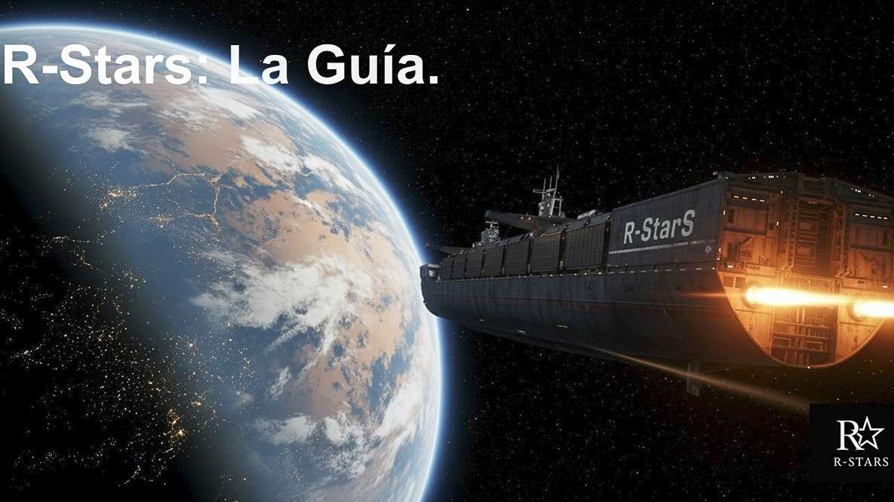

#  {.unnumbered}

{.portada-img width="100%"}

**Autor:**

| Miguel Ángel Tarancón Morán.

| Catedrático de Economía Aplicada. Universidad de Castilla - La Mancha.

<div style="margin-top: 3em; padding-top: 1em; border-top: 1px solid #ddd;
            font-family: 'Source Sans 3', 'Helvetica Neue', Arial, sans-serif;
            font-size: 0.82em; color: #666; line-height: 1.5;">
  Esta obra está publicada bajo una licencia
  <a href="https://creativecommons.org/licenses/by-nc-nd/4.0/deed.es">Creative Commons Atribución-NoComercial-SinDerivadas 4.0 Internacional (CC BY-NC-ND 4.0)</a>.
  Véase el capítulo de <a href="#licencia">Licencia</a> al final del libro.
</div>

```{r include=FALSE}
# automatically create a bib database for R packages
knitr::write_bib(c(
  .packages(), 'bookdown', 'knitr', 'rmarkdown'
), 'packages.bib')
```

```{r include=FALSE}
if (knitr:::is_html_output()) '# Bibliografía {-}'
```
